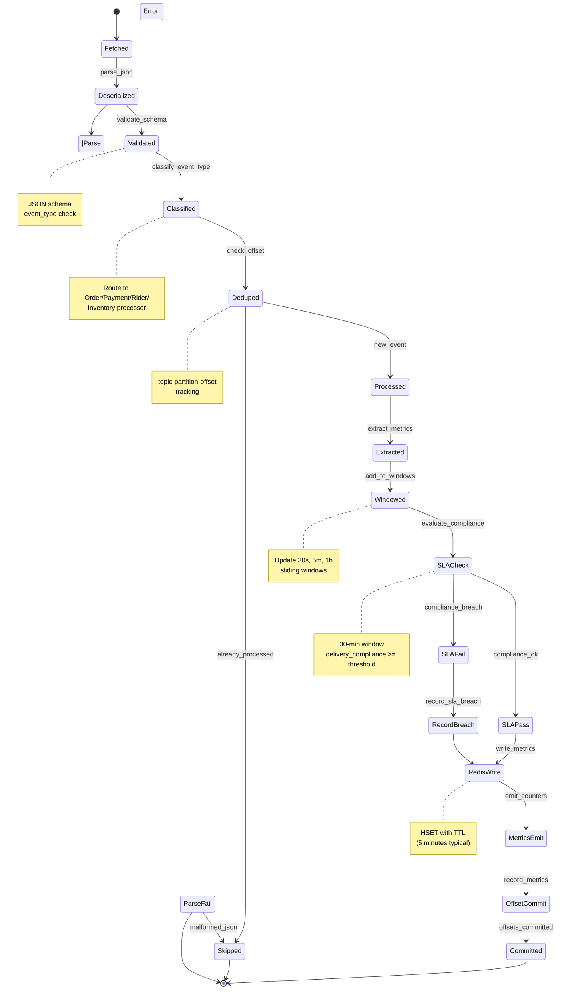

# Stream Processor Service - Stream Processing State Machine

## State Transitions

- **Fetched→Deserialized**: Kafka message received
- **Deserialized→Validated**: JSON parsing and schema validation
- **Validated→Classified**: Event type determination
- **Classified→Deduped**: Offset-based deduplication check
- **Deduped→Processed**: New event or skip if duplicate
- **Processed→Extracted**: Domain-specific metric extraction
- **Extracted→Windowed**: Add to sliding windows
- **Windowed→SLACheck**: Evaluate delivery compliance
- **SLACheck→SLAPass/SLAFail**: Compliance result
- **SLAPass→RedisWrite**: Write metrics cache
- **SLAFail→RecordBreach**: Record SLA violation
- **RedisWrite→MetricsEmit**: Prometheus emission
- **MetricsEmit→OffsetCommit**: Record latency metrics
- **OffsetCommit→Committed**: Kafka offset committed
