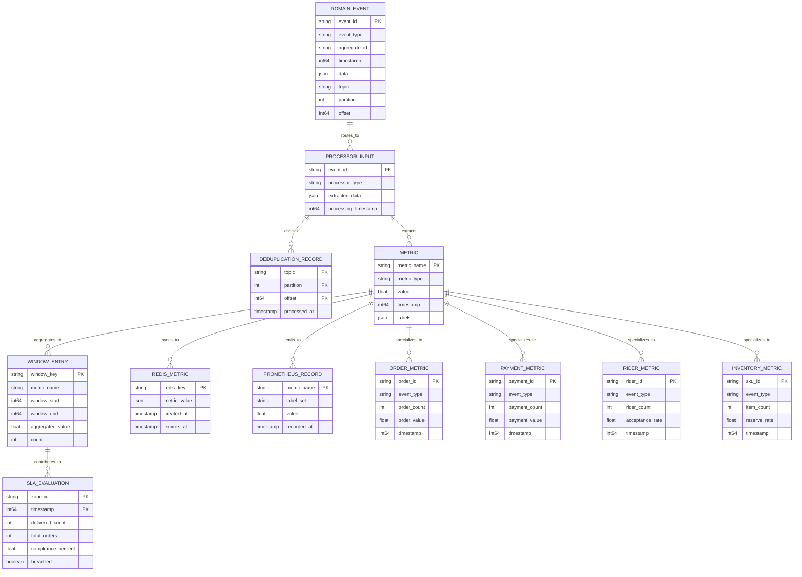

# Stream Processor Service - Data Model

## Key Entities

| Entity | Purpose |
|--------|---------|
| **DOMAIN_EVENT** | Kafka message from producer service |
| **PROCESSOR_INPUT** | Routed to appropriate processor |
| **DEDUPLICATION_RECORD** | Offset tracking for idempotency |
| **METRIC** | Extracted operational metric |
| **WINDOW_ENTRY** | Aggregated metric in time window |
| **SLA_EVALUATION** | Compliance check result per zone |
| **REDIS_METRIC** | TTL-bounded cache entry |
| **PROMETHEUS_RECORD** | Emitted Prometheus metric |
| **ORDER/PAYMENT/RIDER/INVENTORY_METRIC** | Domain-specific metrics |
