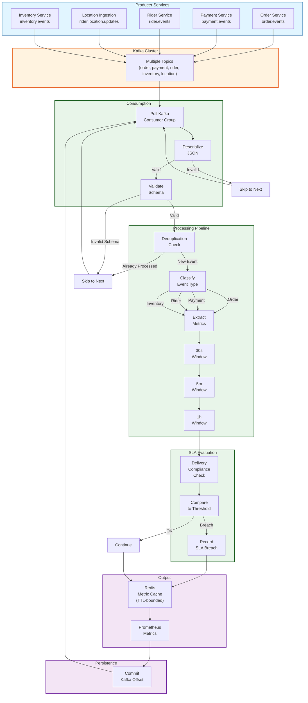

# Stream Processor Service - End-to-End Stream Processing Flow

## E2E Latency Budget (per event)

| Phase | Duration | Notes |
|-------|----------|-------|
| Kafka poll | 1-10s | Consumer group polling interval |
| JSON parse | <1 ms | FastAPI/JSON unmarshal |
| Validation | <1 ms | Schema check |
| Deduplication | <1 ms | Offset map lookup |
| Classification | <1 ms | Event type routing |
| Metric extraction | 1-5 ms | Domain-specific logic |
| Window aggregation | 1-2 ms | In-memory accumulation |
| SLA evaluation | 2-5 ms | Compliance threshold check |
| Redis write | 1-5 ms | HSET + TTL |
| Prometheus emit | <1 ms | Counter/gauge update |
| Offset commit | 1-2 ms | Kafka broker ack |
| **Total (p99)** | **<50 ms** | Per-event processing |

## Data Flow Guarantees

✓ **Idempotent processing**: Deduplication via offset tracking
✓ **Multi-window analysis**: Simultaneous 30s/5m/1h aggregations
✓ **SLA monitoring**: 30-min windows for delivery compliance
✓ **At-least-once delivery**: Offset commit only after processing
✓ **Horizontal scalability**: Consumer group rebalancing

## Real-Time Metrics

| Metric | Window | Storage | Consumer |
|--------|--------|---------|----------|
| **Order count** | 30s, 5m, 1h | Redis + Prom | Dashboard, Alerts |
| **Payment success rate** | 30s, 5m, 1h | Redis + Prom | Dashboard |
| **Rider acceptance rate** | 5m, 1h | Redis + Prom | Ops/Analytics |
| **Delivery compliance** | 30m | Redis + Prom | SLA alerts |
| **Item reserve rate** | 5m, 1h | Redis + Prom | Inventory alerts |

## Failure Modes & Recovery

| Mode | Handling | Recovery |
|------|----------|----------|
| Parse error | Skip event | Continue next |
| Schema validation fail | Skip event | Log warning |
| Duplicate event | Skip by offset | Reprocess from checkpoint |
| Redis write fail | Retry async | Metrics still emitted to Prom |
| SLA threshold breach | Record violation | Alert triggered |
