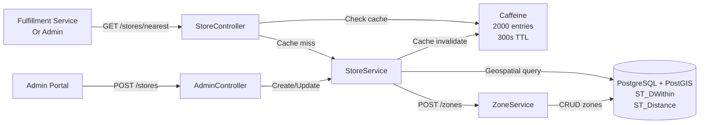

# Warehouse Service

## Overview

The warehouse-service is the operational authority for store/warehouse management in InstaCommerce. It provides geolocation-based store discovery, store zone (picking zone) management, operating hours tracking, and Caffeine-based caching for sub-300ms zone lookup latency. Enables fulfillment-service to assign picking tasks to optimal warehouse zones and supports real-time store availability status.

**Service Ownership**: Platform Team - Store Ops
**Language**: Java 21 / Spring Boot 4.0
**Default Port**: 8090
**Status**: Tier 2 (Fulfillment path; operational criticality)
**Database**: PostgreSQL 15+ with PostGIS (geolocation queries)
**Cache**: Caffeine (JVM-local, 5-minute TTL)

## SLOs & Availability

- **Availability SLO**: 99.9% (43 minutes downtime/month)
- **P99 Latency**: < 300ms per query (with cache: < 50ms)
- **Error Rate**: < 0.1%
- **Store Lookup**: < 200ms uncached (geospatial query)
- **Zone Lookup**: < 50ms (heavily cached)
- **Max Throughput**: 5,000 queries/minute per pod

## Key Responsibilities

1. **Store Discovery**: Find nearest store by lat/long within radius (Haversine formula)
2. **Store Zones Management**: CRUD for warehouse zones (picking zones, shelves, aisles)
3. **Zone Lookup**: Fast cached lookup of zones for a given store
4. **Operating Hours**: Query store hours (for ETA calculations, delivery windows)
5. **Store Status**: Track store online/offline status, capacity alerts
6. **Geospatial Indexing**: PostGIS GIST indexes for sub-second nearest-store queries
7. **Multi-tenant Support**: Support multiple store chains/brands

## Deployment

### GKE Deployment
- **Namespace**: fulfillment
- **Replicas**: 2 (Tier 2; not critical path)
- **CPU Request/Limit**: 500m / 1000m
- **Memory Request/Limit**: 512Mi / 1Gi
- **Readiness Probe**: `/actuator/health/ready` (checks DB + PostGIS)

### Database
- **Name**: `warehouse` (PostgreSQL 15+ with PostGIS extension)
- **Migrations**: Flyway (V1-V6) auto-applied
- **Connection Pool**: HikariCP 15 connections
- **GIS Extensions**: postgis, postgis_topology enabled
- **Indexes**: GIST on location column for geospatial queries

### Cache
- **Caffeine**: 2,000 entries max, 300s TTL (store data is stable)
- **Cache Key**: "stores:{storeId}", "zones:{storeId}", "hours:{storeId}"

## Architecture

### Geolocation Query Architecture

```
Client Request: Find nearest store to (12.9352, 77.6245) within 10km
        ↓
Cache Check: "nearest-stores-12.9352-77.6245"
   MISS → DB Query
        ↓
PostgreSQL + PostGIS:
  SELECT *, distance FROM stores
  WHERE ST_DWithin(location, ST_Point(77.6245, 12.9352), 10)  -- 10km in meters
  ORDER BY distance ASC
  LIMIT 1
        ↓
GIS Query Results
        ↓
Cache: Store in Caffeine (300s TTL)
        ↓
Response: { storeId, name, distance_km, address, hours }
```

### Component Architecture



## Integrations

### Synchronous Clients
| Client | Endpoint | Timeout | Purpose |
|--------|----------|---------|---------|
| fulfillment-service | GET /stores/nearest | 2s | Find store for order pickup |
| fulfillment-service | GET /stores/{id}/zones | 1s | Get picking zones for store |
| admin-gateway-service | POST /stores, PUT /zones | 5s | Admin store management |
| location-ingestion-service | GET /stores/nearby | 3s | Ingest store location for riders |

### Dependencies
- **PostgreSQL + PostGIS**: Geospatial queries (ST_DWithin, ST_Distance)
- **No Kafka**: Read-only for most; store data managed via admin APIs

## Data Model

### Stores Table (with Geospatial)

```sql
stores:
  id              UUID PRIMARY KEY DEFAULT gen_random_uuid()
  store_id        VARCHAR(255) NOT NULL UNIQUE (business identifier)
  name            VARCHAR(255) NOT NULL
  address         TEXT NOT NULL
  city            VARCHAR(255) NOT NULL
  state           VARCHAR(255) NOT NULL
  pincode         VARCHAR(10) NOT NULL
  location        geometry(Point, 4326) NOT NULL (PostGIS: lat/long)
  radius_km       DECIMAL(5,2) DEFAULT 10 (delivery radius)
  max_results     INT DEFAULT 5 (max nearby stores)
  status          ENUM('ACTIVE', 'INACTIVE', 'CLOSED_TEMPORARILY') DEFAULT 'ACTIVE'
  store_type      ENUM('MICRO', 'STANDARD', 'PREMIUM') (affects capacity)
  created_at      TIMESTAMP NOT NULL DEFAULT now()
  updated_at      TIMESTAMP NOT NULL DEFAULT now()

Indexes:
  - UNIQUE (store_id)
  - idx_stores_location (GIST on location, enables ST_DWithin)
  - idx_stores_city (filter by city)
  - idx_stores_status (query active)

Spatial Index (GIST):
  CREATE INDEX idx_stores_location ON stores USING GIST (location);
```

### Store Zones Table

```sql
store_zones:
  id              UUID PRIMARY KEY DEFAULT gen_random_uuid()
  store_id        UUID NOT NULL (FK → stores.id)
  zone_code       VARCHAR(50) NOT NULL (e.g., "A", "B", "REFRIGERATED")
  zone_name       VARCHAR(255) NOT NULL (e.g., "Zone A - Dry Goods")
  aisle           VARCHAR(50) (e.g., "Aisle 1")
  shelf_level     INT (e.g., 1, 2, 3)
  capacity_units  INT DEFAULT 1000 (max items for picking)
  current_load    INT DEFAULT 0 (current items being picked)
  status          ENUM('ACTIVE', 'MAINTENANCE', 'FULL') DEFAULT 'ACTIVE'
  created_at      TIMESTAMP NOT NULL DEFAULT now()
  updated_at      TIMESTAMP NOT NULL DEFAULT now()

Indexes:
  - store_id, zone_code - query zones for store
  - store_id, status - active zones
  - UNIQUE (store_id, zone_code) - prevent duplicate zones
```

### Store Hours Table

```sql
store_hours:
  id              UUID PRIMARY KEY DEFAULT gen_random_uuid()
  store_id        UUID NOT NULL (FK → stores.id)
  day_of_week     INT NOT NULL (0=Sunday, 1=Monday, ..., 6=Saturday)
  open_time       TIME NOT NULL (e.g., 08:00)
  close_time      TIME NOT NULL (e.g., 22:00)
  is_closed       BOOLEAN DEFAULT FALSE (if true, store closed that day)
  created_at      TIMESTAMP NOT NULL

Indexes:
  - UNIQUE (store_id, day_of_week)
  - store_id - query hours for store
```

### Zone Capacity Table (for real-time tracking)

```sql
zone_capacity_tracking:
  id              UUID PRIMARY KEY
  zone_id         UUID NOT NULL (FK → store_zones.id)
  timestamp       TIMESTAMP NOT NULL
  current_load    INT NOT NULL
  load_percentage INT (current_load / capacity * 100)

Indexes:
  - zone_id, timestamp DESC (latest load)
```

## API Documentation

### Find Nearest Store

**GET /stores/nearest**
```bash
Query Parameters:
  latitude: double (required, e.g., 12.9352)
  longitude: double (required, e.g., 77.6245)
  radiusKm: double optional (default: 10)
  limit: int optional (default: 1, max: 5)

Example: /stores/nearest?latitude=12.9352&longitude=77.6245&radiusKm=15&limit=3

Response (200):
{
  "stores": [
    {
      "id": "store-uuid",
      "storeId": "STORE_001",
      "name": "Downtown Store",
      "address": "123 Main St, City",
      "city": "Bangalore",
      "distanceKm": 2.5,
      "status": "ACTIVE",
      "zones": [
        {
          "id": "zone-uuid",
          "code": "A",
          "name": "Zone A - Dry Goods",
          "currentLoad": 45,
          "capacity": 100,
          "status": "ACTIVE"
        }
      ],
      "hours": {
        "mondayOpen": "08:00",
        "mondayClose": "22:00"
      }
    }
  ]
}

Caching:
  - Key: "nearest-stores-{lat}-{lng}-{radius}"
  - TTL: 300s (store changes infrequent)
  - Hit rate: 80%+ (same areas searched repeatedly)
```

### Get Store Details

**GET /stores/{storeId}**
```bash
Response (200):
{
  "id": "store-uuid",
  "storeId": "STORE_001",
  "name": "Downtown Store",
  "address": "...",
  "location": { "latitude": 12.9352, "longitude": 77.6245 },
  "status": "ACTIVE",
  "zones": [
    { "id": "zone-uuid", "code": "A", "name": "Zone A", ... }
  ],
  "hours": [
    { "dayOfWeek": 1, "openTime": "08:00", "closeTime": "22:00" }
  ],
  "createdAt": "2025-01-01T00:00:00Z"
}

Caching:
  - Key: "stores:{storeId}"
  - TTL: 300s
```

### Get Store Zones

**GET /stores/{storeId}/zones**
```bash
Response (200):
{
  "storeId": "store-uuid",
  "zones": [
    {
      "id": "zone-uuid",
      "code": "A",
      "name": "Zone A - Dry Goods",
      "aisle": "Aisle 1",
      "shelfLevel": 2,
      "capacityUnits": 100,
      "currentLoad": 45,
      "status": "ACTIVE"
    }
  ]
}

Caching:
  - Key: "zones:{storeId}"
  - TTL: 300s
```

### Create Zone (Admin)

**POST /stores/{storeId}/zones**
```bash
Authorization: Bearer {JWT_TOKEN}
Content-Type: application/json

Request Body:
{
  "code": "FRIDGE",
  "name": "Refrigerated Goods",
  "aisle": "Aisle 5",
  "shelfLevel": 1,
  "capacityUnits": 200
}

Response (201 Created):
Side Effects: Cache invalidated for "zones:{storeId}"
```

### Curl Examples

```bash
# 1. Find nearest store (heavy hitter query)
curl -s 'http://warehouse-service:8090/stores/nearest?latitude=12.9352&longitude=77.6245&radiusKm=10' \
  -H "Authorization: Bearer $JWT_TOKEN" | jq '.stores[0].name'

# 2. Get store zones (for picking assignment)
curl -s http://warehouse-service:8090/stores/store-uuid/zones \
  -H "Authorization: Bearer $JWT_TOKEN" | jq '.zones | length'

# 3. Create store (admin)
curl -s -X POST http://warehouse-service:8090/stores \
  -H "Authorization: Bearer $ADMIN_JWT" \
  -H "Content-Type: application/json" \
  -d '{
    "storeId": "STORE_002",
    "name": "New Store",
    "address": "456 Main St",
    "latitude": 12.9400,
    "longitude": 77.6300
  }' | jq '.id'

# 4. Get store hours
curl -s http://warehouse-service:8090/stores/store-uuid/hours \
  -H "Authorization: Bearer $JWT_TOKEN" | jq '.hours'
```

## Error Handling & Resilience

### Geospatial Query Timeout

```yaml
resilience4j:
  timelimiter:
    instances:
      geoQuery:
        timeoutDuration: 2s
        cancelRunningFuture: true

  circuitbreaker:
    instances:
      postgisQueries:
        failureRateThreshold: 50%
        slowCallDurationThreshold: 2000ms
        waitDurationInOpenState: 30s
```

### Failure Scenarios

**Scenario 1: PostGIS Unavailable**
- Service uses stale cache (up to 300s old)
- Returns cached nearest stores
- Alert if cache miss + DB unavailable

**Scenario 2: Geospatial Index Corrupted**
- Queries become very slow (full table scan)
- Alert: Query latency p99 > 2000ms
- Recovery: REINDEX idx_stores_location; restart pod

**Scenario 3: Cache Expiration During High Load**
- Many simultaneous nearest-store queries
- Cache miss for same location → multiple DB queries
- Mitigation: Increase Caffeine size or TTL

## Monitoring & Observability

### Key Metrics

| Metric | Type | Alert Threshold |
|--------|------|-----------------|
| `warehouse.store_lookup.latency_ms` | Histogram (p50, p99) | p99 > 200ms |
| `warehouse.zone_lookup.latency_ms` | Histogram | p99 > 50ms |
| `cache.caffeine.hits` | Counter | N/A |
| `cache.caffeine.hitRate` | Gauge | < 75% = investigate |
| `warehouse.geospatial_query_duration_ms` | Histogram | p99 > 2000ms = alert |
| `warehouse.zone_capacity_full_count` | Gauge | N/A |

### Alert Rules (YAML)

```yaml
alerts:
  - name: WarehouseStoreLookupLatencyHigh
    condition: histogram_quantile(0.99, warehouse_store_lookup_latency_ms) > 200
    duration: 5m
    severity: SEV-2
    action: Alert; check PostGIS index health or cache effectiveness

  - name: WarehouseGeospatialQuerySlow
    condition: histogram_quantile(0.99, warehouse_geospatial_query_duration_ms) > 2000
    duration: 5m
    severity: SEV-2
    action: Investigate; possible index corruption or high DB load

  - name: WarehouseCacheHitRateLow
    condition: cache_caffeine_hitRate < 0.75
    duration: 10m
    severity: SEV-3
    action: Investigate; may indicate cache churn or diverse queries

  - name: WarehouseZoneCapacityFull
    condition: warehouse_zone_capacity_full_count > 5
    duration: 10m
    severity: SEV-3
    action: Alert ops team; zones at capacity; may need zone rebalancing

  - name: WarehousePostgisConnectionPoolExhausted
    condition: db_hikari_connections_active > 13 (of 15)
    duration: 5m
    severity: SEV-2
    action: Scale up or investigate slow queries
```

### Logging
- **INFO**: Store created/updated, zone added, capacity updated
- **WARN**: Zone full, geospatial query slow (>500ms), cache miss
- **ERROR**: DB unavailable, index corruption, unhandled exception
- **DEBUG**: Query details, index stats (disabled in prod)

### Tracing
- **Spans**: Nearest-store query, PostGIS execution, cache operations
- **Sampling**: 10% (read-heavy; non-critical)
- **Retention**: 1 day

## Security Considerations

### Authentication
- **Read APIs**: Public (GET /stores/nearest does not require auth)
- **Admin APIs**: Requires JWT + ADMIN role

### Data Protection
- **Sensitive Data**: Store addresses (public)
- **Geolocation**: Store coordinates (public for customer discovery)

### Known Risks
1. **Store Enumeration**: Attacker discovers all store locations via repeated queries → Mitigated by rate limiting at API gateway
2. **Competitor Intelligence**: Competitors scrape store locations → Mitigated by terms of service

## Troubleshooting

### Issue: Nearest Store Query Returns Wrong Store

**Diagnosis:**
```bash
# Verify Haversine calculation
kubectl logs -n fulfillment deployment/warehouse-service | grep -i "distance\|coordinate"

# Check PostGIS function
kubectl exec -n fulfillment pod/warehouse-service-0 -- psql -U postgres -d warehouse -c \
  "SELECT *, ST_Distance(location, ST_Point(77.6245, 12.9352)) as distance_m FROM stores ORDER BY distance_m LIMIT 5;"

# Verify stored coordinates
psql -d warehouse -c "SELECT store_id, ST_AsText(location) FROM stores LIMIT 5;"
```

**Resolution:**
- Verify coordinates are in correct lat/long format (not reversed)
- Check if geospatial index exists: `\d+ idx_stores_location`
- Rebuild index if corrupted: `REINDEX INDEX idx_stores_location;`

### Issue: Zone Lookup Cache Not Working (Latency High)

**Diagnosis:**
```bash
# Check cache metrics
curl http://localhost:8090/actuator/metrics/cache.caffeine.hitRate

# Check zone lookup latency
curl http://localhost:8090/actuator/metrics/warehouse.zone_lookup.latency_ms

# Verify zones are cached
kubectl exec pod/warehouse-service-0 -- \
  curl -s http://localhost:8090/stores/store-uuid/zones | jq '.zones | length'

# Check cache size
curl http://localhost:8090/actuator/metrics/cache.caffeine.size
```

**Resolution:**
- Increase Caffeine maximumSize if near limit
- Check if zones are frequently updated (invalidating cache)
- Verify cache TTL is set correctly (should be 300s)

### Issue: Store Hours Not Appearing Correctly

**Diagnosis:**
```bash
# Verify stored hours
psql -d warehouse -c "SELECT * FROM store_hours WHERE store_id='store-uuid';"

# Check if all 7 days are populated
psql -d warehouse -c "SELECT COUNT(DISTINCT day_of_week) FROM store_hours WHERE store_id='store-uuid';"

# Test API response
curl -s http://localhost:8090/stores/store-uuid/hours | jq '.hours'
```

**Resolution:**
- Ensure all 7 days (0-6) have hours entries
- Check if is_closed flag is set correctly
- Verify open_time < close_time (not wrapped midnight)

## Configuration

### Environment Variables
```env
# Server
SERVER_PORT=8090
SPRING_PROFILES_ACTIVE=gcp

# Database (with PostGIS)
SPRING_DATASOURCE_URL=jdbc:postgresql://cloudsql-proxy:5432/warehouse
SPRING_DATASOURCE_USERNAME=${DB_USER}
SPRING_DATASOURCE_PASSWORD=${DB_PASSWORD}
SPRING_DATASOURCE_HIKARI_POOL_SIZE=15

# Geospatial
POSTGIS_ENABLED=true
DEFAULT_RADIUS_KM=10
MAX_NEARBY_RESULTS=5

# Cache
CACHE_TTL_SECONDS=300
CACHE_MAX_SIZE=2000

# Tracing
OTEL_EXPORTER_OTLP_TRACES_ENDPOINT=http://otel-collector.monitoring:4318/v1/traces
```

### application.yml
```yaml
server:
  port: 8090
spring:
  jpa:
    hibernate:
      ddl-auto: none
  cache:
    caffeine:
      spec: maximumSize=2000,expireAfterWrite=300s
    cache-names:
      - stores
      - store-zones
      - store-hours

warehouse-service:
  geospatial:
    default-radius-km: 10
    max-results: 5
  cache:
    ttl-seconds: 300
    enabled: true
```

## Kubernetes Deployment

```yaml
apiVersion: apps/v1
kind: Deployment
metadata:
  name: warehouse-service
  namespace: fulfillment
spec:
  replicas: 2
  selector:
    matchLabels:
      app: warehouse-service
  template:
    metadata:
      labels:
        app: warehouse-service
      annotations:
        prometheus.io/scrape: "true"
        prometheus.io/port: "8090"
    spec:
      containers:
      - name: warehouse-service
        image: warehouse-service:v1.2.3
        ports:
        - containerPort: 8090
          name: http
        env:
        - name: SPRING_PROFILES_ACTIVE
          value: gcp
        resources:
          requests:
            cpu: 500m
            memory: 512Mi
          limits:
            cpu: 1000m
            memory: 1Gi
        livenessProbe:
          httpGet:
            path: /actuator/health/live
            port: 8090
          initialDelaySeconds: 10
        readinessProbe:
          httpGet:
            path: /actuator/health/ready
            port: 8090
          initialDelaySeconds: 15
---
apiVersion: v1
kind: Service
metadata:
  name: warehouse-service
  namespace: fulfillment
spec:
  selector:
    app: warehouse-service
  ports:
  - port: 8090
    targetPort: 8090
  type: ClusterIP
```

## Related Documentation

- **Wave 38**: SLOs and observability
- **ADR-003**: Geospatial Queries and PostGIS Integration
- [High-Level Design](diagrams/hld.md)
- [Low-Level Architecture](diagrams/lld.md)
- [Database Schema (ERD)](diagrams/erd.md)
- [Runbook](runbook.md)