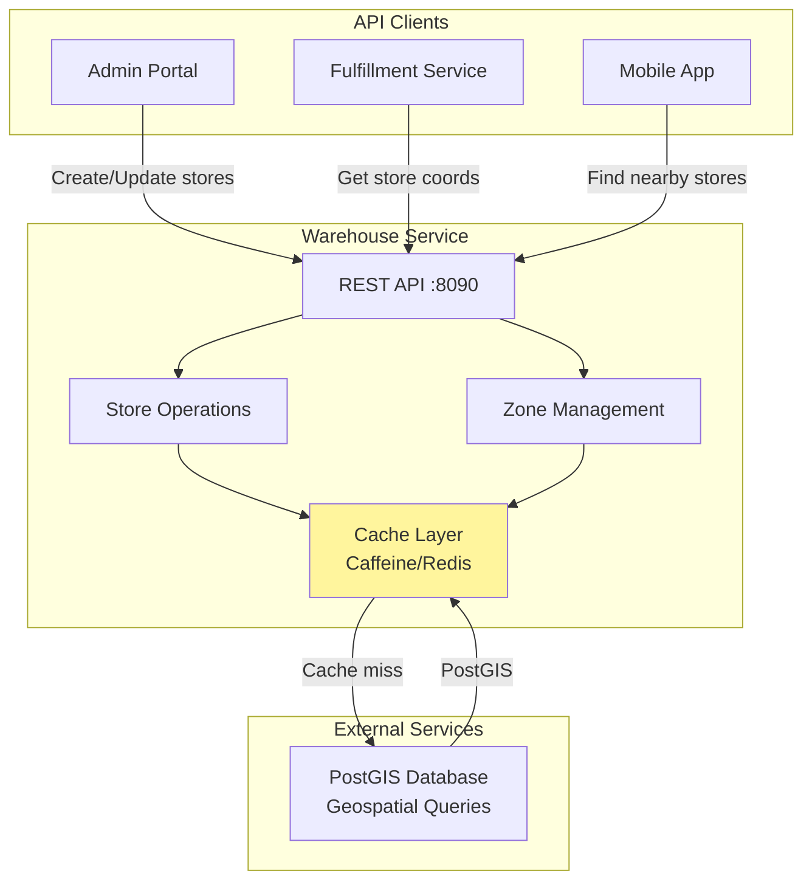
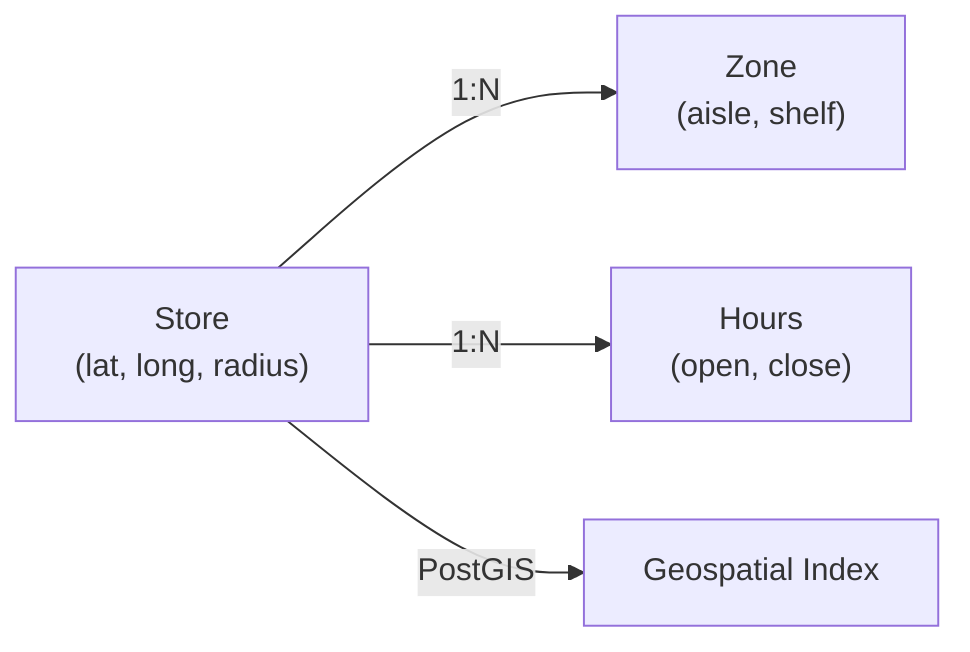

# Warehouse Service - High-Level Design (HLD)

## Overview

Warehouse Service provides store location management, zone configuration, and geographic lookups for the fulfillment pipeline.

## Data Model

## Key Responsibilities

| Component | Purpose |
|-----------|---------|
| Store Management | CRUD stores, maintain location data |
| Zone Management | Create/list picking zones (aisles, shelves) |
| Geographic Lookup | Find nearest store(s) within radius |
| Hours Management | Store operating hours tracking |
| Cache Coordination | Caffeine L1 + optional Redis L2 |

## SLO Targets

- Availability: 99.9%
- Store Lookup Latency: <50ms (with cache)
- Cache Hit Ratio: >95%
- Geospatial Query: <100ms
