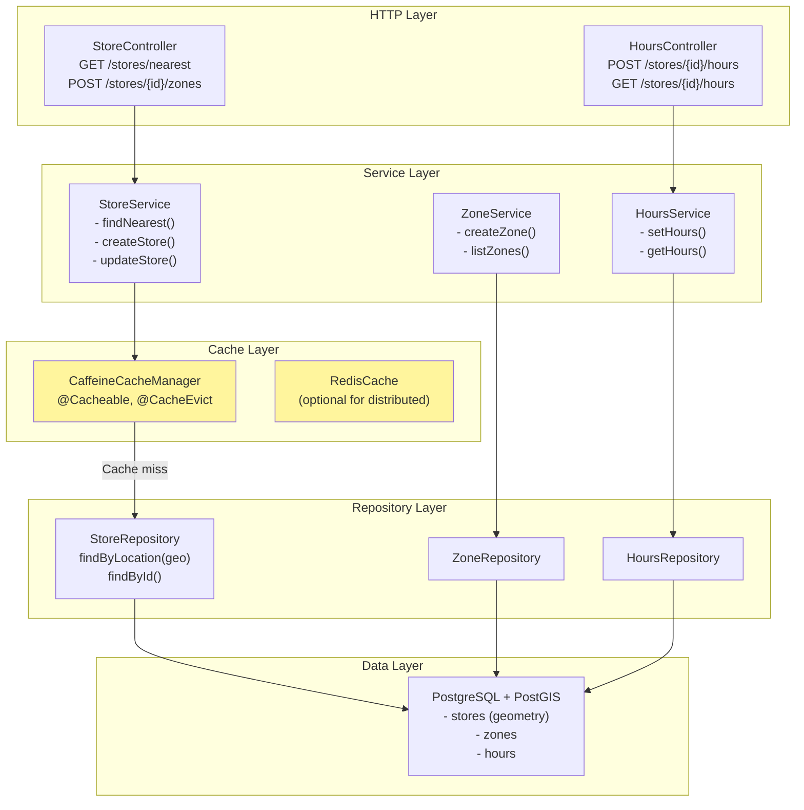
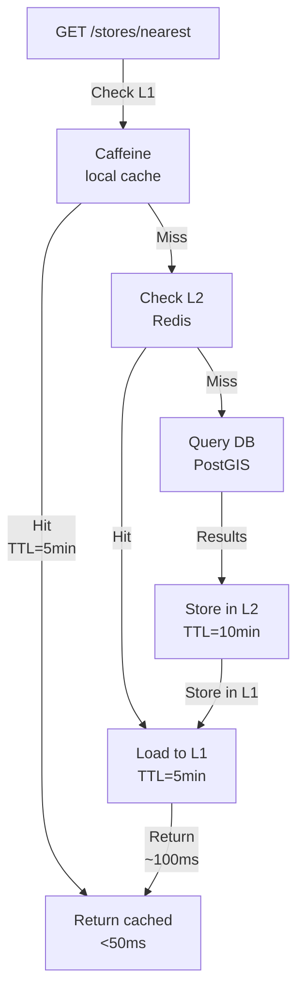

# Warehouse Service - Low-Level Design (LLD)



## Cache Strategy



## Database Schema

```sql
create table stores (
    id uuid primary key,
    name varchar not null,
    address text not null,
    city varchar(100),
    state varchar(100),
    pincode varchar(10),
    latitude numeric(10, 8),
    longitude numeric(11, 8),
    timezone varchar(50) default 'UTC',
    status varchar(30) default 'ACTIVE',
    capacity_orders_per_hour int default 100,
    created_at timestamp,
    updated_at timestamp,
    version bigint,
    -- PostGIS geometry type
    location geometry(POINT, 4326)
);

create index idx_stores_location_gist on stores using gist(location);
create index idx_stores_status on stores(status);

create table store_zones (
    id uuid primary key,
    store_id uuid references stores(id),
    zone_code varchar unique,
    zone_name varchar,
    aisle int,
    shelf_level int,
    created_at timestamp
);

create table store_hours (
    id uuid primary key,
    store_id uuid references stores(id),
    day_of_week int,  -- 0-6 (Sun-Sat)
    open_time time,
    close_time time,
    created_at timestamp
);
```
