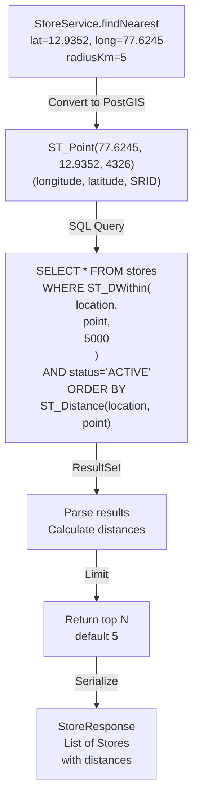

# Warehouse Service - Flowchart

```mermaid
flowchart TD
    A["GET /stores/nearest<br/>NearestStoreRequest<br/>latitude, longitude, radiusKm"]
    A -->|Validate coords| B{Valid geo<br/>coords?}
    B -->|No| C["HTTP 400<br/>Bad Request"]
    B -->|Yes| D["Check L1 cache<br/>Caffeine"]
    D -->|Hit<br/>TTL=5min| E["Return cached<br/>StoreResponse<br/><50ms"]
    D -->|Miss| F["Query L2 cache<br/>Redis"]
    F -->|Hit| G["Load to L1"]
    F -->|Miss| H["PostGIS query<br/>ST_DWithin"]
    H -->|Results| I["Build cache key<br/>hash(lat,long,radius)"]
    I -->|Store in Redis| J["TTL=10min"]
    J -->|Load to Caffeine| G
    G -->|HTTP 200| E
    H -->|No stores found| K["HTTP 404<br/>Not Found"]
    H -->|Max results exceeded| L["Sort by distance<br/>Limit to max_results"]
    L -->|HTTP 200| M["Return list"]
    E -->|Response| N["Client receives<br/>Store list<br/>sorted by distance"]

    O["POST /stores/{id}/zones<br/>CreateZoneRequest"]
    O -->|Validate| P{Zone exists?}
    P -->|Yes| Q["HTTP 409<br/>Conflict"]
    P -->|No| R["Create zone in DB"]
    R -->|Success| S["Invalidate cache<br/>store_zones:{storeId}"]
    S -->|@CacheEvict| T["HTTP 201<br/>ZoneResponse"]
    R -->|Fail| U["HTTP 500<br/>Error"]

    V["GET /stores/{id}/hours"]
    V -->|Check cache| W["Cached?"]
    W -->|Yes| X["HTTP 200"]
    W -->|No| Y["Query DB"]
    Y -->|Found| Z["Cache & return"]
    Z -->|HTTP 200| X
    Y -->|Not found| AA["HTTP 404"]
```

## Geospatial Query Details


