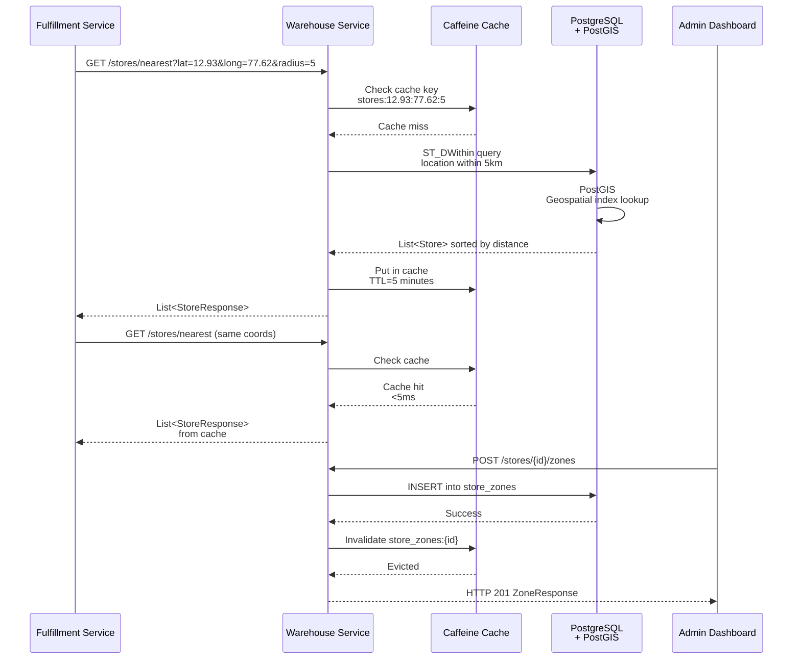
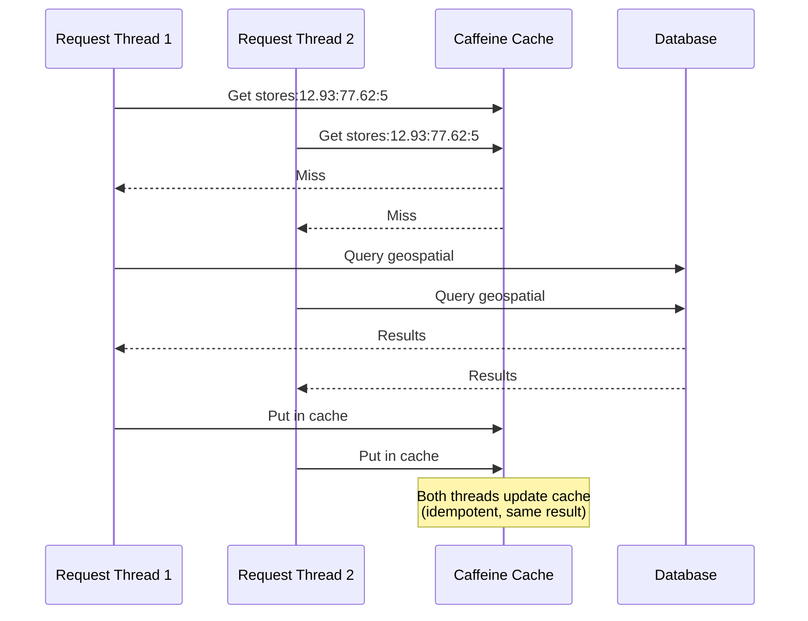

# Warehouse Service - Sequence Diagram

```mermaid
sequenceDiagram
    participant FulfillmentSvc as Fulfillment Service
    participant WarehouseSvc as Warehouse Service
    participant CaffeineMgr as Caffeine Cache
    participant PostgreSQL as PostgreSQL<br/>+ PostGIS
    participant Dashboard as Admin Dashboard

    FulfillmentSvc->>WarehouseSvc: GET /stores/nearest?lat=12.93&long=77.62&radius=5
    WarehouseSvc->>CaffeineMgr: Check cache key<br/>stores:12.93:77.62:5
    CaffeineMgr-->>WarehouseSvc: Cache miss
    WarehouseSvc->>PostgreSQL: ST_DWithin query<br/>location within 5km
    PostgreSQL->>PostgreSQL: PostGIS<br/>Geospatial index lookup
    PostgreSQL-->>WarehouseSvc: List<Store> sorted by distance
    WarehouseSvc->>CaffeineMgr: Put in cache<br/>TTL=5 minutes
    WarehouseSvc-->>FulfillmentSvc: List<StoreResponse>

    FulfillmentSvc->>WarehouseSvc: GET /stores/nearest (same coords)
    WarehouseSvc->>CaffeineMgr: Check cache
    CaffeineMgr-->>WarehouseSvc: Cache hit<br/><5ms
    WarehouseSvc-->>FulfillmentSvc: List<StoreResponse><br/>from cache

    Dashboard->>WarehouseSvc: POST /stores/{id}/zones
    WarehouseSvc->>PostgreSQL: INSERT into store_zones
    PostgreSQL-->>WarehouseSvc: Success
    WarehouseSvc->>CaffeineMgr: Invalidate store_zones:{id}
    CaffeineMgr-->>WarehouseSvc: Evicted
    WarehouseSvc-->>Dashboard: HTTP 201 ZoneResponse
```

## Cache Coordination Sequence

```mermaid
sequenceDiagram
    participant Thread1 as Request Thread 1
    participant Thread2 as Request Thread 2
    participant CaffeineMgr as Caffeine Cache
    participant PostgreSQL as Database

    Thread1->>CaffeineMgr: Get stores:12.93:77.62:5
    Thread2->>CaffeineMgr: Get stores:12.93:77.62:5
    CaffeineMgr-->>Thread1: Miss
    CaffeineMgr-->>Thread2: Miss
    Thread1->>PostgreSQL: Query geospatial
    Thread2->>PostgreSQL: Query geospatial
    PostgreSQL-->>Thread1: Results
    PostgreSQL-->>Thread2: Results
    Thread1->>CaffeineMgr: Put in cache
    Thread2->>CaffeineMgr: Put in cache
    Note over CaffeineMgr: Both threads update cache<br/>(idempotent, same result)
```
