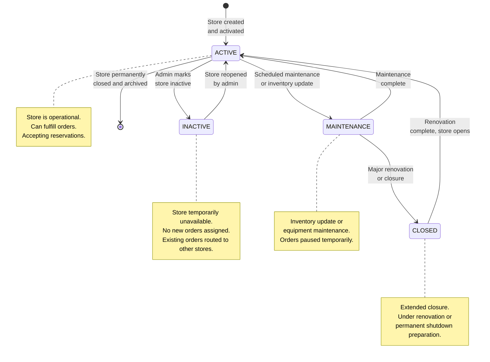
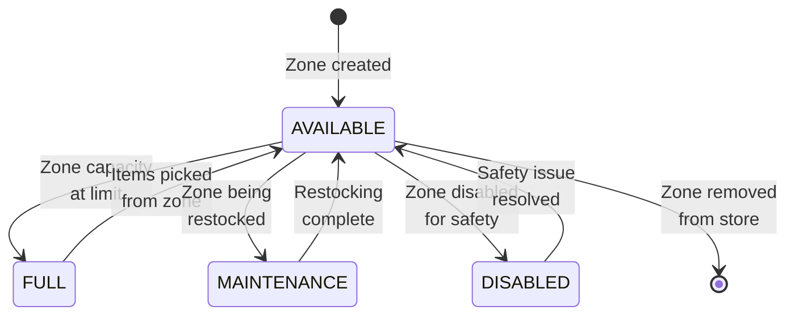
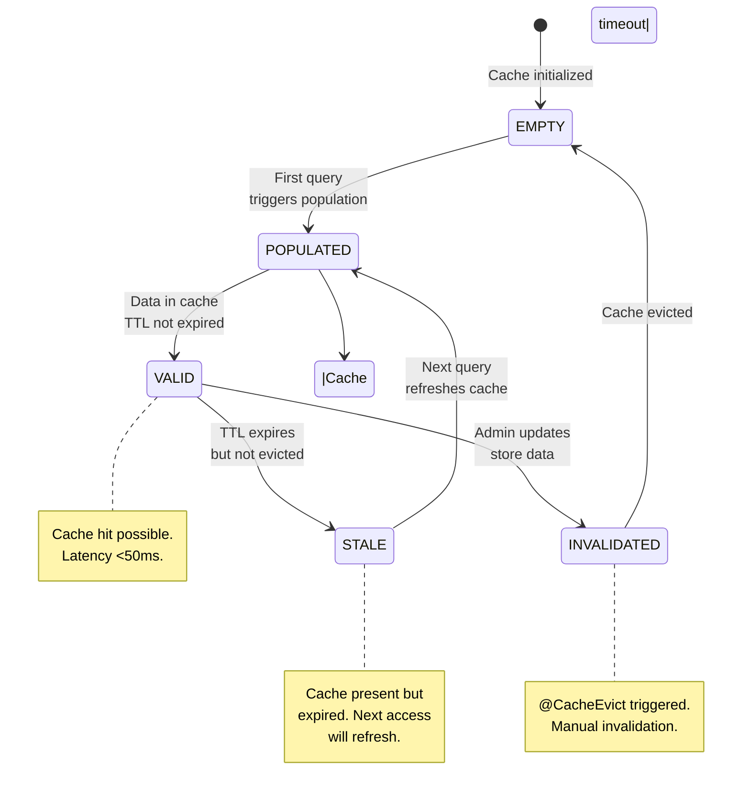

# Warehouse Service - State Machine Diagram

```mermaid
stateDiagram-v2
    [*] --> ACTIVE: Store created<br/>and activated

    ACTIVE --> INACTIVE: Admin marks<br/>store inactive

    INACTIVE --> ACTIVE: Store reopened<br/>by admin

    ACTIVE --> MAINTENANCE: Scheduled maintenance<br/>or inventory update

    MAINTENANCE --> ACTIVE: Maintenance<br/>complete

    MAINTENANCE --> CLOSED: Major renovation<br/>or closure

    CLOSED --> ACTIVE: Renovation<br/>complete, store opens

    ACTIVE --> [*]: Store permanently<br/>closed and archived

    note right of ACTIVE
        Store is operational.
        Can fulfill orders.
        Accepting reservations.
    end note

    note right of INACTIVE
        Store temporarily unavailable.
        No new orders assigned.
        Existing orders routed to other stores.
    end note

    note right of MAINTENANCE
        Inventory update or<br/>equipment maintenance.
        Orders paused temporarily.
    end note

    note right of CLOSED
        Extended closure.
        Under renovation or<br/>permanent shutdown preparation.
    end note
```

## Zone Status Lifecycle

```mermaid
stateDiagram-v2
    [*] --> AVAILABLE: Zone created

    AVAILABLE --> FULL: Zone capacity<br/>at limit

    FULL --> AVAILABLE: Items picked<br/>from zone

    AVAILABLE --> MAINTENANCE: Zone being<br/>restocked

    MAINTENANCE --> AVAILABLE: Restocking<br/>complete

    AVAILABLE --> DISABLED: Zone disabled<br/>for safety

    DISABLED --> AVAILABLE: Safety issue<br/>resolved

    AVAILABLE --> [*]: Zone removed<br/>from store
```

## Cache Lifecycle

```mermaid
stateDiagram-v2
    [*] --> EMPTY: Cache initialized

    EMPTY --> POPULATED: First query<br/>triggers population

    POPULATED --> VALID: Data in cache<br/>TTL not expired

    VALID --> STALE: TTL expires<br/>but not evicted

    STALE --> POPULATED: Next query<br/>refreshes cache

    VALID --> INVALIDATED: Admin updates<br/>store data

    INVALIDATED --> EMPTY: Cache evicted

    POPULATED -->|Cache timeout| EMPTY

    note right of VALID
        Cache hit possible.
        Latency <50ms.
    end note

    note right of STALE
        Cache present but<br/>expired. Next access<br/>will refresh.
    end note

    note right of INVALIDATED
        @CacheEvict triggered.
        Manual invalidation.
    end note
```
