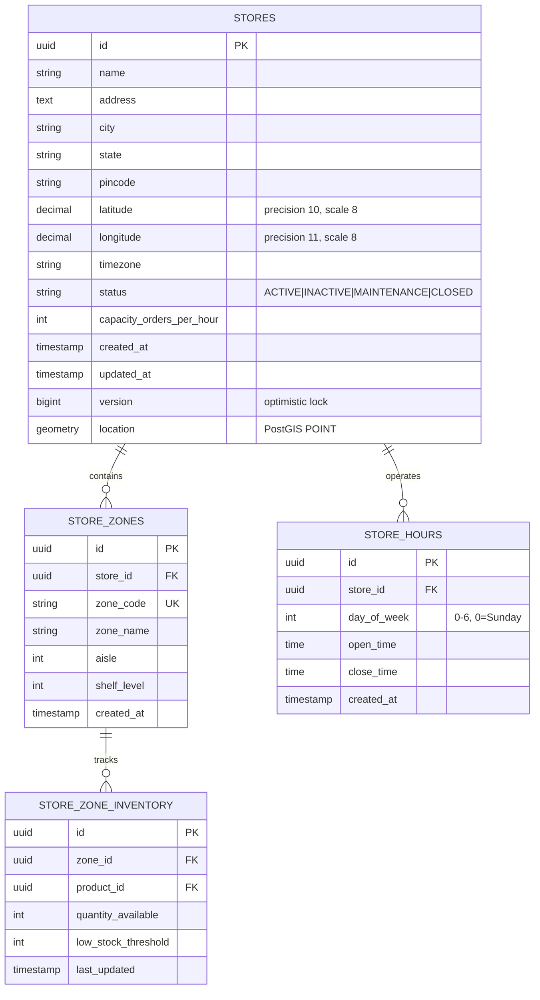
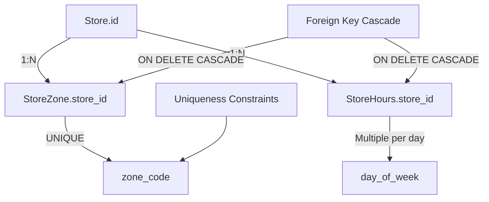

# Warehouse Service - Entity-Relationship Diagram (ERD)



## PostGIS Indexes

```sql
-- Geospatial index for efficient ST_DWithin queries
CREATE INDEX idx_stores_location_gist ON stores USING GIST(location);

-- Regular indexes for common lookups
CREATE INDEX idx_stores_status ON stores(status);
CREATE INDEX idx_stores_city_status ON stores(city, status);
CREATE INDEX idx_store_zones_store_id ON store_zones(store_id);
CREATE INDEX idx_store_hours_store_id ON store_hours(store_id);
CREATE INDEX idx_store_hours_day ON store_hours(day_of_week);
```

## Data Model Details

```markdown
## Store Entity

- **id**: UUID primary key
- **location**: PostGIS POINT geometry (longitude, latitude, SRID=4326)
- **timezone**: UTC or regional (e.g., Asia/Kolkata)
- **status**: Controls availability for order assignment
- **capacity_orders_per_hour**: Rate limiting for store
- **version**: Optimistic lock for concurrent updates

## StoreZone Entity

- **zone_code**: Unique identifier (e.g., "ZONE_A_1")
- **aisle**: Physical aisle number
- **shelf_level**: Shelf height (1-5)
- Composite uniqueness: (store_id, zone_code)

## StoreHours Entity

- **day_of_week**: 0=Sunday through 6=Saturday
- **open_time, close_time**: TIME fields (HH:MM:SS)
- Multiple entries per store for different hours on different days

## Cache Keys

- `stores:{latitude}:{longitude}:{radius_km}` -> List<Store>
- `store_zones:{store_id}` -> List<Zone>
- `store_hours:{store_id}` -> List<Hours>
- TTL: 5-10 minutes based on data type
```

## Relationships & Constraints


