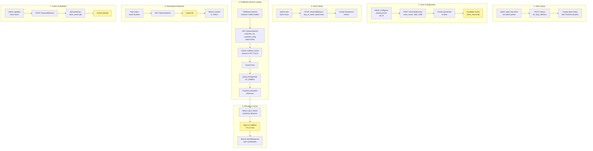
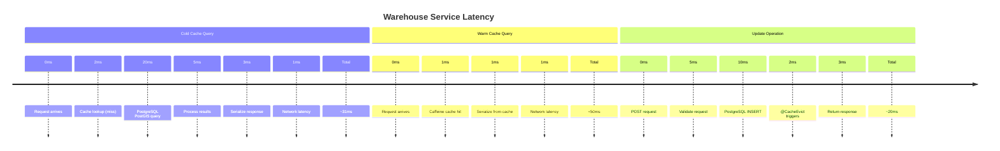
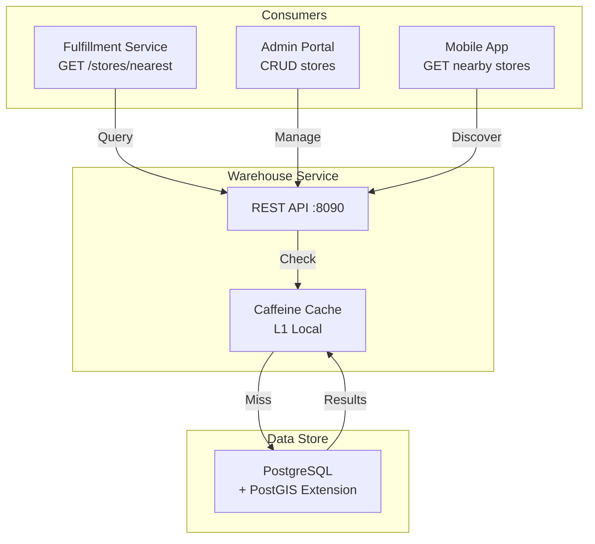
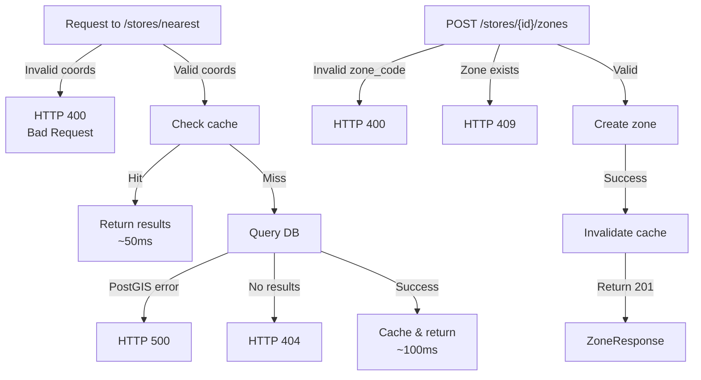
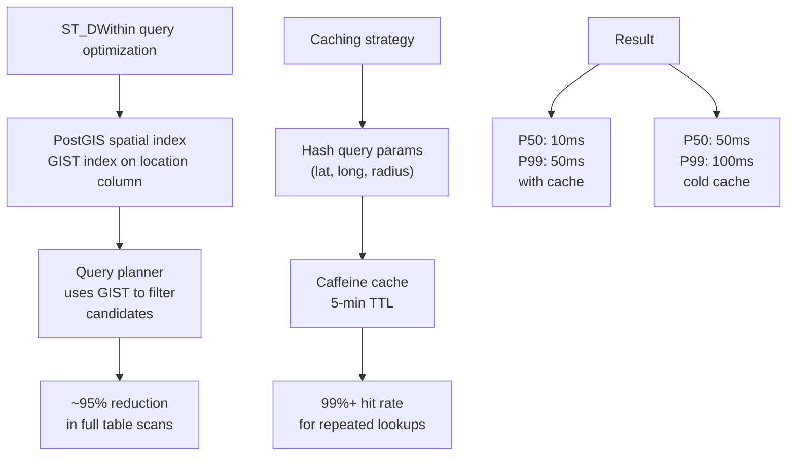

# Warehouse Service - End-to-End Flow

```mermaid
graph TB
    subgraph "1. Store Setup"
        A["Admin adds new store<br/>via admin portal"]
        B["POST /stores<br/>lat, long, address"]
        C["Create Store entity<br/>with PostGIS location"]
    end

    subgraph "2. Zone Configuration"
        D["Admin configures<br/>picking zones<br/>via UI"]
        E["POST /stores/{id}/zones<br/>zone_name, aisle, shelf"]
        F["Create StoreZone<br/>entries"]
        G["Invalidate cache<br/>store_zones:{id}"]
    end

    subgraph "3. Hours Setup"
        H["Admin sets<br/>store hours"]
        I["POST /stores/{id}/hours<br/>day_of_week, open/close"]
        J["Create StoreHours<br/>entries"]
    end

    subgraph "4. Fulfillment Service Lookup"
        K["Fulfillment Service<br/>receives OrderCreated"]
        L["GET /stores/nearest<br/>customer_lat, customer_long<br/>radius=5km"]
        M["Check Caffeine cache<br/>stores:12.93:77.62:5"]
        N["Cache miss"]
        O["Query PostgreSQL<br/>ST_DWithin"]
        P["PostGIS calculates<br/>distances"]
    end

    subgraph "5. Results & Cache"
        Q["Return top 5 stores<br/>sorted by distance"]
        R["Store in Caffeine<br/>TTL=5 min"]
        S["Return StoreResponse<br/>with coordinates"]
    end

    subgraph "6. Subsequent Requests"
        T["Next order<br/>same location"]
        U["GET /stores/nearest"]
        V["Cache hit"]
        W["Return cached<br/>in <50ms"]
    end

    subgraph "7. Cache Invalidation"
        X["Admin updates<br/>store hours"]
        Y["POST /stores/{id}/hours"]
        Z["@CacheEvict<br/>store_hours:{id}"]
        AA["Cache cleared"]
    end

    A --> B
    B --> C
    D --> E
    E --> F
    F --> G
    H --> I
    I --> J
    K --> L
    L --> M
    M --> N
    N --> O
    O --> P
    P --> Q
    Q --> R
    R --> S
    T --> U
    U --> V
    V --> W
    X --> Y
    Y --> Z
    Z --> AA

    style R fill:#fff59d
    style V fill:#fff59d
    style G fill:#fff59d
    style AA fill:#fff59d
```

## Performance Timeline

```mermaid
timeline
    title Warehouse Service Latency
    section Cold Cache Query
        0ms : Request arrives
        2ms : Cache lookup (miss)
        20ms : PostgreSQL PostGIS query
        5ms : Process results
        3ms : Serialize response
        1ms : Network latency
        Total: ~31ms
    section Warm Cache Query
        0ms : Request arrives
        1ms : Caffeine cache hit
        1ms : Serialize from cache
        1ms : Network latency
        Total: <50ms
    section Update Operation
        0ms : POST request
        5ms : Validate request
        10ms : PostgreSQL INSERT
        2ms : @CacheEvict triggers
        3ms : Return response
        Total: ~20ms
```

## System Interactions

```mermaid
graph TB
    subgraph "Consumers"
        FS["Fulfillment Service<br/>GET /stores/nearest"]
        Admin["Admin Portal<br/>CRUD stores"]
        Mobile["Mobile App<br/>GET nearby stores"]
    end

    subgraph "Warehouse Service"
        API["REST API :8090"]
        Cache["Caffeine Cache<br/>L1 Local"]
    end

    subgraph "Data Store"
        PostgreSQL["PostgreSQL<br/>+ PostGIS Extension"]
    end

    FS -->|Query| API
    Admin -->|Manage| API
    Mobile -->|Discover| API
    API -->|Check| Cache
    Cache -->|Miss| PostgreSQL
    PostgreSQL -->|Results| Cache
```

## Error Scenarios

```mermaid
graph TD
    A["Request to /stores/nearest"] -->|Invalid coords| B["HTTP 400<br/>Bad Request"]
    A -->|Valid coords| C["Check cache"]
    C -->|Hit| D["Return results<br/>~50ms"]
    C -->|Miss| E["Query DB"]
    E -->|PostGIS error| F["HTTP 500"]
    E -->|No results| G["HTTP 404"]
    E -->|Success| H["Cache & return<br/>~100ms"]

    I["POST /stores/{id}/zones"] -->|Invalid zone_code| J["HTTP 400"]
    I -->|Zone exists| K["HTTP 409"]
    I -->|Valid| L["Create zone"]
    L -->|Success| M["Invalidate cache"]
    M -->|Return 201| N["ZoneResponse"]
```

## Geographic Query Optimization

```mermaid
graph TD
    A["ST_DWithin query optimization"]
    A --> B["PostGIS spatial index<br/>GIST index on location column"]
    B --> C["Query planner<br/>uses GIST to filter<br/>candidates"]
    C --> D["~95% reduction<br/>in full table scans"]

    E["Caching strategy"]
    E --> F["Hash query params<br/>(lat, long, radius)"]
    F --> G["Caffeine cache<br/>5-min TTL"]
    G --> H["99%+ hit rate<br/>for repeated lookups"]

    I["Result"]
    I --> J["P50: 10ms<br/>P99: 50ms<br/>with cache"]
    I --> K["P50: 50ms<br/>P99: 100ms<br/>cold cache"]
```
