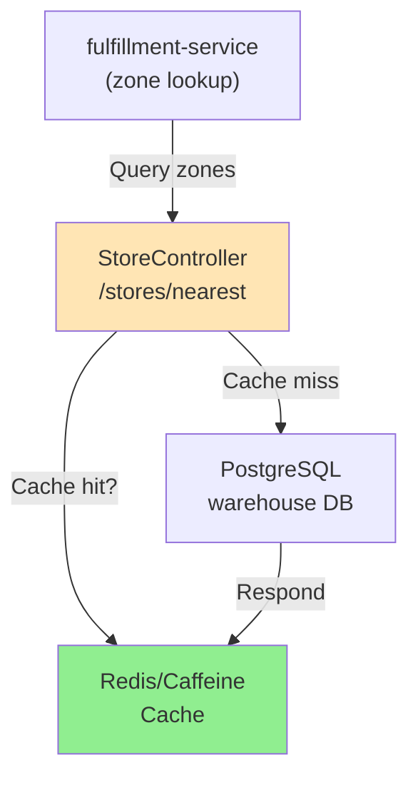

# Warehouse Service - HLD & Schema

## High-Level Architecture



## Components

### StoreController
**Endpoints**:
- `GET /stores/nearest?lat={lat}&lon={lon}` - Geospatial query
- `POST /stores/{id}/zones` - Create zone
- `GET /stores/{id}/zones` - List zones (cached)
- `POST /stores/{id}/hours` - Set hours
- `GET /stores/{id}/hours` - Get hours (cached)

**Caching**:
- stores (2000 max entries, 5 min TTL)
- store-zones (2000 max entries, 5 min TTL)
- store-hours (2000 max entries, 5 min TTL)

---

## Database Schema

```sql
CREATE TABLE stores (
    id UUID PRIMARY KEY,
    store_id VARCHAR(50) NOT NULL UNIQUE,
    name VARCHAR(255) NOT NULL,
    latitude NUMERIC(10, 8) NOT NULL,
    longitude NUMERIC(11, 8) NOT NULL,
    radius_km NUMERIC(5, 2) NOT NULL DEFAULT 10.0,
    max_results INT NOT NULL DEFAULT 5,
    created_at TIMESTAMPTZ NOT NULL DEFAULT now()
);

CREATE TABLE store_zones (
    id UUID PRIMARY KEY,
    store_id UUID NOT NULL REFERENCES stores(id),
    zone_code VARCHAR(20) NOT NULL,
    zone_name VARCHAR(100) NOT NULL,
    aisle VARCHAR(10),
    shelf_level VARCHAR(10),
    created_at TIMESTAMPTZ NOT NULL DEFAULT now(),
    UNIQUE(store_id, zone_code)
);

CREATE TABLE store_hours (
    id UUID PRIMARY KEY,
    store_id UUID NOT NULL REFERENCES stores(id),
    day_of_week INT NOT NULL,  -- 1-7 (Monday-Sunday)
    open_time TIME NOT NULL,
    close_time TIME NOT NULL,
    UNIQUE(store_id, day_of_week)
);

CREATE INDEX idx_stores_location ON stores(latitude, longitude);
CREATE INDEX idx_zones_store ON store_zones(store_id);
CREATE INDEX idx_hours_store ON store_hours(store_id);
```

---

## API Examples

### Find Nearest Store
```bash
GET /stores/nearest?lat=40.7128&lon=-74.0060&radiusKm=10

Response (200):
{
  "stores": [
    {
      "id": "store-550e8400-...",
      "storeId": "STORE-NYC-001",
      "name": "NYC Downtown",
      "latitude": 40.7128,
      "longitude": -74.0060,
      "distanceKm": 2.5
    }
  ]
}
```

### Get Store Zones
```bash
GET /stores/{storeId}/zones

Response (200):
{
  "zones": [
    { "zoneCode": "A1", "zoneName": "Produce Aisle", "aisle": "A", "shelf": "1" },
    { "zoneCode": "B2", "zoneName": "Dairy", "aisle": "B", "shelf": "2" }
  ]
}
```

### Create Zone
```bash
POST /stores/{storeId}/zones
{
  "zoneCode": "A1",
  "zoneName": "Produce Aisle",
  "aisle": "A",
  "shelfLevel": "1"
}

Response (201):
{
  "id": "zone-550e8400-...",
  "zoneCode": "A1"
}
```

---

## Caching Strategy

**Caffeine Configuration**:
```yaml
spring:
  cache:
    type: caffeine
    caffeine:
      spec: maximumSize=2000,expireAfterWrite=300s
    cache-names:
      - stores
      - store-zones
      - store-hours
```

**Cache Invalidation**:
- Automatic TTL: 5 minutes
- Manual on zone/hours updates:
```java
@CacheEvict(value = "store-zones", key = "#storeId")
public void createZone(UUID storeId, ...) { ... }
```

---

## Geospatial Query

**Haversine Distance** (find nearest):
```sql
SELECT store_id, name,
  (6371 * 2 * ASIN(SQRT(
    SIN(RADIANS((lat - ?1) / 2))^2 +
    COS(RADIANS(?2)) * COS(RADIANS(lat)) * SIN(RADIANS((lon - ?3) / 2))^2
  ))) AS distance_km
FROM stores
WHERE distance_km <= ?4  -- radius_km
ORDER BY distance_km
LIMIT ?5;  -- max_results
```

---

## Performance

- **Query Latency**: <50ms with Caffeine cache (index miss: <200ms)
- **Concurrency**: Low (read-heavy, cache-driven)
- **Storage**: ~10K stores, minimal growth
