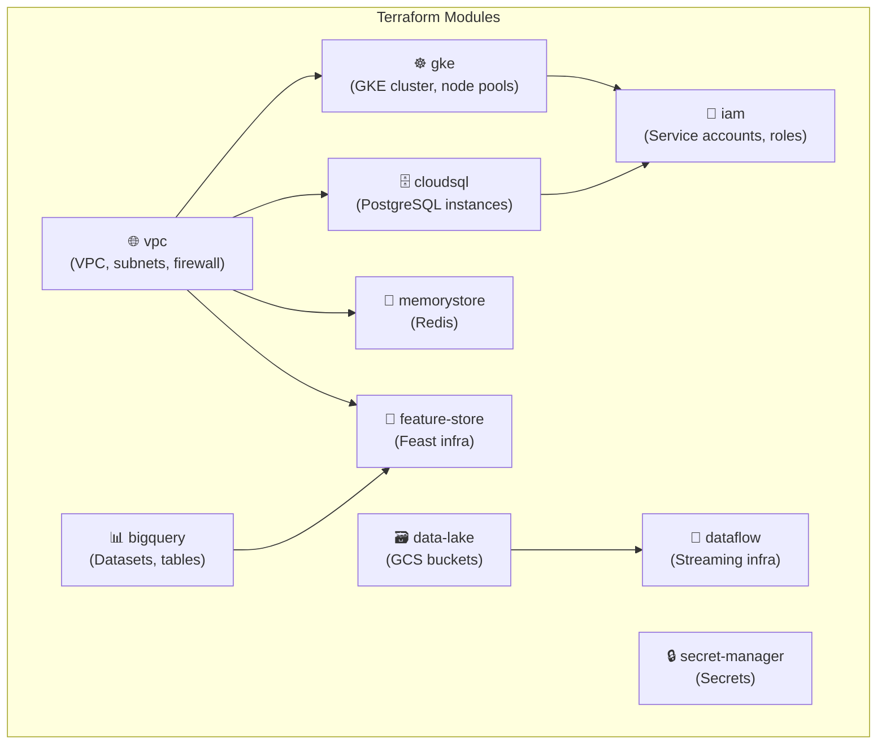

# InstaCommerce Terraform Infrastructure

GCP infrastructure as code for the InstaCommerce platform. Manages all cloud resources across dev and prod environments using reusable Terraform modules.

---

## Module Dependency Diagram



---

## Directory Structure

```
infra/terraform/
├── backend.tf                    # Remote state configuration (GCS)
│
├── modules/                      # Reusable Terraform modules
│   ├── vpc/                      # VPC, subnets, secondary IP ranges
│   │   ├── main.tf
│   │   ├── variables.tf
│   │   └── outputs.tf
│   ├── gke/                      # GKE cluster + node pools
│   │   ├── main.tf
│   │   ├── variables.tf
│   │   └── outputs.tf
│   ├── cloudsql/                  # Cloud SQL PostgreSQL instances
│   │   ├── main.tf
│   │   ├── variables.tf
│   │   └── outputs.tf
│   ├── memorystore/               # Redis (Memorystore)
│   │   ├── main.tf
│   │   ├── variables.tf
│   │   └── outputs.tf
│   ├── bigquery/                  # BigQuery datasets
│   │   ├── main.tf
│   │   ├── variables.tf
│   │   └── outputs.tf
│   ├── feature-store/             # Feast feature store infra
│   │   ├── main.tf
│   │   ├── variables.tf
│   │   └── outputs.tf
│   ├── data-lake/                 # GCS data lake buckets
│   │   ├── main.tf
│   │   ├── variables.tf
│   │   └── outputs.tf
│   ├── dataflow/                  # Dataflow job infra
│   │   ├── main.tf
│   │   ├── variables.tf
│   │   └── outputs.tf
│   ├── iam/                       # Service accounts + IAM bindings
│   │   ├── main.tf
│   │   ├── variables.tf
│   │   └── outputs.tf
│   └── secret-manager/            # Secret Manager secrets
│       ├── main.tf
│       ├── variables.tf
│       └── outputs.tf
│
└── environments/                  # Per-environment root configs
    ├── dev/
    │   ├── main.tf                # Dev module composition
    │   ├── variables.tf
    │   └── terraform.tfvars       # Dev-specific values
    └── prod/
        ├── main.tf                # Prod module composition
        ├── variables.tf
        └── terraform.tfvars       # Prod-specific values
```

---

## Resource Inventory

| Module | Resources Managed | Key Outputs |
|--------|------------------|-------------|
| **vpc** | VPC, subnet, secondary ranges (pods, services), firewall rules | `network_id`, `subnetwork_id`, `pods_range_name`, `services_range_name` |
| **gke** | GKE cluster, node pools, workload identity | `cluster_endpoint`, `cluster_ca_certificate` |
| **cloudsql** | Cloud SQL PostgreSQL instances (per-service databases) | `connection_name`, `instance_ip` |
| **memorystore** | Redis instance (Memorystore) | `redis_host`, `redis_port` |
| **bigquery** | BigQuery datasets (raw, staging, marts, features) | `dataset_ids` |
| **feature-store** | Feast online store (Redis), offline store (BigQuery) | `feature_store_endpoint` |
| **data-lake** | GCS buckets (raw, processed, ml, exports) | `bucket_names` |
| **dataflow** | Dataflow job templates, temp/staging buckets | `template_paths` |
| **iam** | Service accounts, IAM role bindings | `service_account_emails` |
| **secret-manager** | Secret Manager secrets (DB passwords, API keys) | `secret_ids` |

---

## Environment Setup

### Prerequisites

- [Terraform](https://www.terraform.io/downloads) ≥ 1.5
- [Google Cloud SDK](https://cloud.google.com/sdk) authenticated
- GCS bucket for remote state (configured in `backend.tf`)

### Initialize

```bash
cd infra/terraform/environments/dev   # or prod
terraform init
```

### Plan

```bash
# Review planned changes
terraform plan -var-file=terraform.tfvars

# Save plan to file
terraform plan -var-file=terraform.tfvars -out=plan.tfplan
```

### Apply

```bash
# Apply saved plan
terraform apply plan.tfplan

# Or apply directly (with confirmation prompt)
terraform apply -var-file=terraform.tfvars
```

### Destroy (dev only)

```bash
terraform destroy -var-file=terraform.tfvars
```

---

## Module Composition (Environment Root)

Each environment's `main.tf` composes all modules:

```hcl
module "vpc"            { source = "../../modules/vpc"            ... }
module "gke"            { source = "../../modules/gke"            network_id = module.vpc.network_id ... }
module "cloudsql"       { source = "../../modules/cloudsql"       network_id = module.vpc.network_id ... }
module "memorystore"    { source = "../../modules/memorystore"    network_id = module.vpc.network_id ... }
module "iam"            { source = "../../modules/iam"            ... }
module "secret_manager" { source = "../../modules/secret-manager" ... }
module "bigquery"       { source = "../../modules/bigquery"       ... }
module "feature_store"  { source = "../../modules/feature-store"  network_id = module.vpc.network_id ... }
module "data_lake"      { source = "../../modules/data-lake"      ... }
module "dataflow"       { source = "../../modules/dataflow"       ... }
```

### Key Variables

| Variable | Description | Example |
|----------|-------------|---------|
| `project_id` | GCP project ID | `instacommerce-prod` |
| `region` | GCP region | `asia-south1` |
| `env` | Environment name | `dev` / `prod` |
| `subnet_cidr` | VPC subnet CIDR | `10.0.0.0/20` |
| `pods_cidr` | GKE pods secondary range | `10.4.0.0/14` |
| `services_cidr` | GKE services secondary range | `10.8.0.0/20` |
| `databases` | List of Cloud SQL databases | `[identity_db, order_db, ...]` |
| `service_accounts` | Map of service accounts | `{order-service: [...]}` |
| `secrets` | Map of secrets to create | `{db-password: ...}` |

## Conventions

- All resources are tagged with `project = "instacommerce"` and `environment = "<env>"`
- Module outputs are referenced by other modules (e.g., GKE cluster endpoint used by Helm provider)
- Sensitive values are stored in Secret Manager and referenced via workload identity
