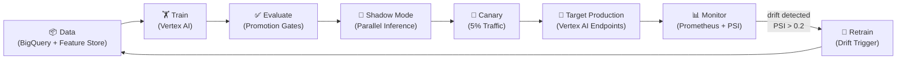
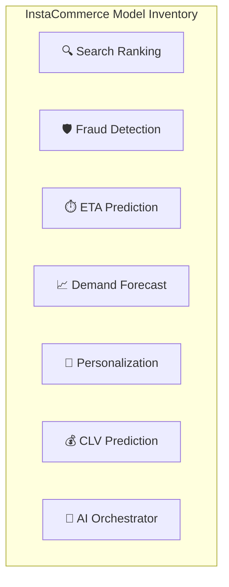
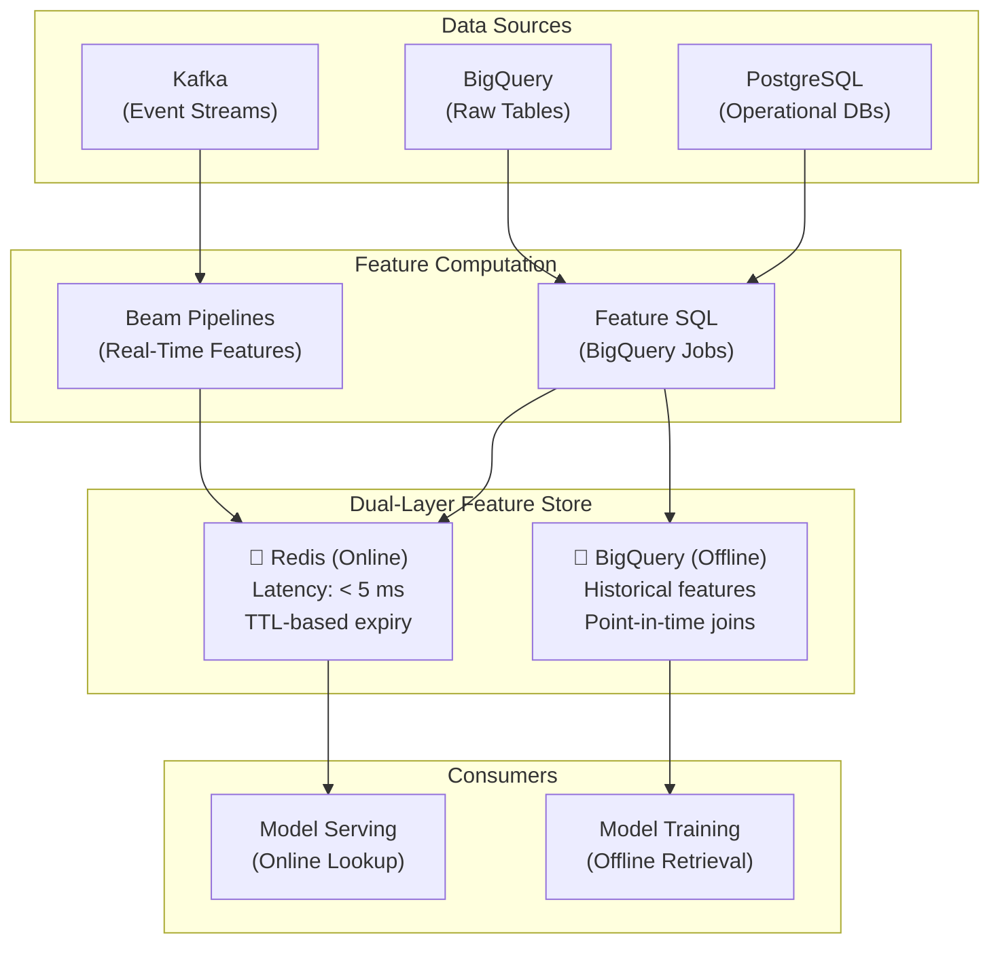
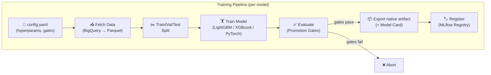
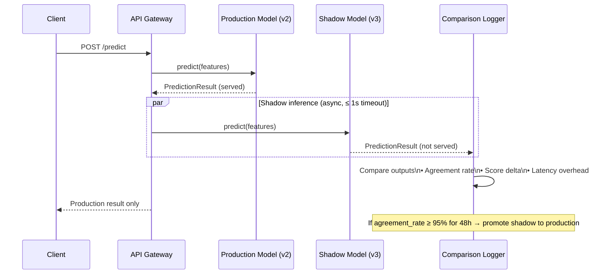
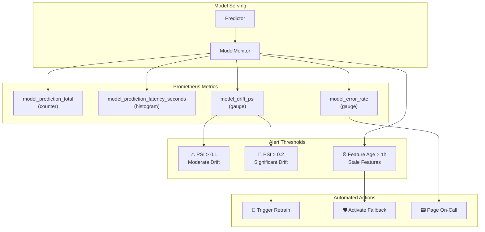

# InstaCommerce ML Platform

Machine learning platform repository for search, recommendations, fraud
detection, demand forecasting, ETA prediction, and customer lifetime value for
Q-commerce. The repo contains working training/serving components plus a richer
productionization roadmap; not every canary, registry, or rollback behavior
shown below is fully wired in the current codebase.

---

## MLOps Pipeline



---

## Model Inventory



| Model | Type | Framework | Target Latency | Key Metric | Target | Status |
|-------|------|-----------|---------------|------------|--------|--------|
| **Search Ranking** | LambdaMART | LightGBM → ONNX | < 20 ms | NDCG@10 ≥ 0.65 | +15% search conversion | ✅ Production |
| **Fraud Detection** | Binary Classification | XGBoost → ONNX | < 15 ms | AUC, Precision@95%Recall | 2% → 0.3% fraud rate | ✅ Production |
| **ETA Prediction** | Regression | LightGBM → ONNX | < 10 ms | MAE ≤ 1.5 min | ±5 min → ±1.5 min | ✅ Production |
| **Demand Forecast** | Time Series | Prophet + TFT | < 50 ms | MAPE ≤ 8% | 92% accuracy | ✅ Production |
| **Personalization** | Two-Tower NCF | PyTorch → ONNX | < 25 ms | Hit@10, NDCG@10 | +20% homepage CTR | ✅ Production |
| **CLV Prediction** | Probabilistic | BG/NBD + Gamma-Gamma | < 30 ms | MAE, Calibration | Segment-level accuracy | ✅ Production |
| **AI Orchestrator** | Routing / Ensemble | Spring Boot | < 50 ms | — | Orchestrate multi-model calls | ✅ Production |

---

> **Current artifact reality:** the training scripts in this repository export
> native model artifacts today (`.lgb`, `.xgb`, `.pkl`, `.json`). The serving
> layer attempts ONNX runtime when ONNX artifacts are available, but the
> end-to-end ONNX export/promotion path is still partial in the repo.

## Directory Structure

```
ml/
├── README.md
├── requirements.txt
├── __init__.py
│
├── train/                          # Model training pipelines (6 models)
│   ├── search_ranking/
│   │   ├── train.py                # LambdaMART training (LightGBM)
│   │   └── config.yaml             # Hyperparams + promotion gates
│   ├── fraud_detection/
│   │   ├── train.py                # XGBoost ensemble
│   │   └── config.yaml
│   ├── eta_prediction/
│   │   ├── train.py                # LightGBM regression
│   │   └── config.yaml
│   ├── demand_forecast/
│   │   ├── train.py                # Prophet + Temporal Fusion Transformer
│   │   └── config.yaml
│   ├── personalization/
│   │   ├── train.py                # Two-Tower Neural Collaborative Filtering
│   │   └── config.yaml
│   └── clv_prediction/
│       ├── train.py                # BG/NBD + Gamma-Gamma
│       └── config.yaml
│
├── serving/                        # Model serving infrastructure
│   ├── predictor.py                # BasePredictor — abstract interface
│   ├── ranking_predictor.py        # Search ranking predictor
│   ├── fraud_predictor.py          # Fraud detection predictor
│   ├── eta_predictor.py            # ETA prediction predictor
│   ├── demand_predictor.py         # Demand forecast predictor
│   ├── personalization_predictor.py # Personalization predictor
│   ├── clv_predictor.py            # CLV prediction predictor
│   ├── model_registry.py           # MLflow model registry client
│   ├── shadow_mode.py              # Shadow mode runner (A/B validation)
│   └── monitoring.py               # Prometheus metrics + PSI drift detection
│
├── eval/                           # Evaluation framework
│   └── evaluate.py                 # Unified evaluator: metrics, promotion gates, bias checks
│
├── feature_store/                  # Feature store definitions
│   ├── README.md
│   ├── entities/                   # Entity definitions (user, store, product, rider, search_query)
│   │   ├── user.yaml
│   │   ├── store.yaml
│   │   ├── product.yaml
│   │   ├── rider.yaml
│   │   └── search_query.yaml
│   ├── feature_groups/             # Feature group YAML definitions
│   │   ├── user_features.yaml
│   │   ├── store_features.yaml
│   │   ├── product_features.yaml
│   │   ├── rider_features.yaml
│   │   └── search_features.yaml
│   ├── feature_views/              # Feature views per model
│   │   ├── search_ranking_view.yaml
│   │   ├── fraud_detection_view.yaml
│   │   ├── eta_prediction_view.yaml
│   │   ├── demand_forecast_view.yaml
│   │   └── personalization_view.yaml
│   ├── sql/                        # Feature computation SQL
│   │   ├── user_features.sql
│   │   ├── store_features.sql
│   │   ├── product_features.sql
│   │   ├── rider_features.sql
│   │   └── search_features.sql
│   └── ingestion/
│       └── user_features_job.yaml
│
└── mlops/                          # MLOps tooling
    ├── __init__.py
    └── model_card_template.md      # Standardised model card template
```

---

## Feature Store Architecture



### Entities & Feature Groups

| Entity | Key | Feature Groups | Features |
|--------|-----|----------------|----------|
| `user` | `user_id` | `user_features` | order_count, avg_basket, lifetime_value, churn_score |
| `store` | `store_id` | `store_features` | avg_prep_time, order_volume, rating, fulfilment_rate |
| `product` | `product_id` | `product_features` | view_count, conversion_rate, return_rate, stock_velocity |
| `rider` | `rider_id` | `rider_features` | avg_delivery_time, acceptance_rate, rating, active_hours |
| `search_query` | `query_hash` | `search_features` | query_frequency, avg_clicks, conversion_rate, null_rate |

---

## Training Pipeline Flow



### Quick Start — Training

```bash
pip install -r ml/requirements.txt

# Train any model via CLI
python -m ml.train.search_ranking.train \
  --config ml/train/search_ranking/config.yaml \
  --experiment search-ranking-v1

python -m ml.train.fraud_detection.train \
  --config ml/train/fraud_detection/config.yaml \
  --experiment fraud-detection-v1

python -m ml.train.eta_prediction.train \
  --config ml/train/eta_prediction/config.yaml \
  --experiment eta-prediction-v1

python -m ml.train.demand_forecast.train \
  --config ml/train/demand_forecast/config.yaml \
  --experiment demand-forecast-v1

python -m ml.train.personalization.train \
  --config ml/train/personalization/config.yaml \
  --experiment personalization-v1

python -m ml.train.clv_prediction.train \
  --config ml/train/clv_prediction/config.yaml \
  --experiment clv-prediction-v1
```

### Evaluation

```bash
python -m ml.eval.evaluate \
  --model-path artifacts/search-ranking/v1/model.lgb \
  --test-data gs://instacommerce-ml/datasets/search_ranking/test.parquet \
  --gates-config ml/train/search_ranking/config.yaml \
  --bias-check \
  --output eval_report.json
```

The evaluation framework supports:
- **Promotion gates** — configurable min/max thresholds per metric
- **Bias checks** — demographic parity, equalized odds, disparate impact (4/5 rule)
- **MLflow integration** — auto-logs metrics and artifacts when `MLFLOW_TRACKING_URI` is set

---

## Model Serving Architecture

```mermaid
classDiagram
    class BasePredictor {
        <<abstract>>
        +model_name: str
        +status: ModelStatus
        +load(version) bool
        +health() dict
        +predict(features)* PredictionResult
        +rule_based_fallback(features)* PredictionResult
        #_load_model(version)* void
    }

    class RankingPredictor {
        +predict(features) PredictionResult
        +rule_based_fallback(features) PredictionResult
    }

    class FraudPredictor {
        +predict(features) PredictionResult
        +rule_based_fallback(features) PredictionResult
    }

    class ETAPredictor {
        +predict(features) PredictionResult
        +rule_based_fallback(features) PredictionResult
    }

    class DemandPredictor {
        +predict(features) PredictionResult
        +rule_based_fallback(features) PredictionResult
    }

    class PersonalizationPredictor {
        +predict(features) PredictionResult
        +rule_based_fallback(features) PredictionResult
    }

    class CLVPredictor {
        +predict(features) PredictionResult
        +rule_based_fallback(features) PredictionResult
    }

    BasePredictor <|-- RankingPredictor
    BasePredictor <|-- FraudPredictor
    BasePredictor <|-- ETAPredictor
    BasePredictor <|-- DemandPredictor
    BasePredictor <|-- PersonalizationPredictor
    BasePredictor <|-- CLVPredictor

    class ModelRegistry {
        +get_latest_version(model_name) str
        +download_artifact(model_name, version) Path
    }

    class ShadowRunner {
        +run_shadow(prod_result, shadow_predictor, features) dict
        +agreement_rate: float
    }

    class ModelMonitor {
        +record_prediction(features, result, latency_ms)
        +check_drift(recent, baseline) float
        +check_freshness(timestamps) bool
    }

    BasePredictor --> ModelRegistry : loads from
    BasePredictor --> ModelMonitor : instrumented by
    BasePredictor --> ShadowRunner : validated by
```



Every predictor:
1. Attempts to load an **ONNX Runtime** artifact when an ONNX export is
   available
2. Falls back to **native artifacts** (`.lgb`, `.xgb`, `.pkl`, `.json`) and then
   to **rule-based heuristics** if model loading fails (`DEGRADED` status)
3. Returns a standardised `PredictionResult` with version, latency, and
   fallback flag

---

## Shadow Mode & A/B Testing Flow



Shadow mode runs new model versions on live traffic **without serving their results**. The `ShadowRunner` compares outputs using a 10% relative tolerance and logs structured metrics for offline analysis.

---

## Monitoring & Drift Detection



### Drift Detection — Population Stability Index (PSI)

| PSI Range | Interpretation | Action |
|-----------|---------------|--------|
| < 0.1 | No significant drift | None |
| 0.1 – 0.2 | Moderate drift | Warning log |
| > 0.2 | Significant drift | Alert → trigger retrain pipeline |

### Freshness Check

Features older than **1 hour** (configurable via `_FEATURE_MAX_AGE_S`) are flagged as stale, and the predictor may fall back to rule-based heuristics.

---

## MLflow Tracking

All experiments are tracked in MLflow:

- **Tracking URI**: Set via `MLFLOW_TRACKING_URI` environment variable
- **Artifacts**: Stored in GCS (`gs://instacommerce-ml/mlflow-artifacts/`)
- **Model Registry**: MLflow Model Registry for versioning and stage transitions (Staging → Production → Archived)

## Known Limitations

The repo already contains the core building blocks, but the full production
posture described in the platform diagrams is still maturing. See
[`../docs/reviews/iter3/platform/ml-platform-productionization.md`](../docs/reviews/iter3/platform/ml-platform-productionization.md)
for the detailed gap assessment. The highest-signal current limitations are:

1. model registry / promotion state is still repository-centric rather than a
   fully durable control plane
2. shadow-mode comparison state is not documented as durable across failures
3. rollback is closer to a kill-switch posture than a true previous-version
   revert workflow
4. several feature-store ingestion paths are still scaffolded relative to the
   target architecture

## Infrastructure

| Component | Service | Details |
|-----------|---------|---------|
| **Training** | Vertex AI Training | GPU instances for NCF/TFT, CPU for LightGBM/XGBoost |
| **Serving** | Vertex AI Endpoints | ONNX Runtime, auto-scaling, < 25 ms p99 |
| **Feature Store** | Feast on GCP | BigQuery (offline) + Redis (online) |
| **Orchestration** | Cloud Composer | Airflow DAGs for training + feature refresh |
| **Experiment Tracking** | MLflow | Metrics, artifacts, model registry |
| **Monitoring** | Prometheus + Grafana | Prediction latency, drift PSI, error rate |
