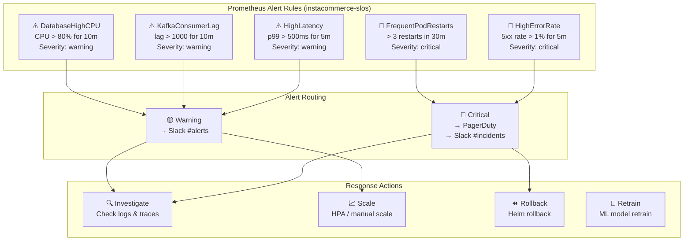
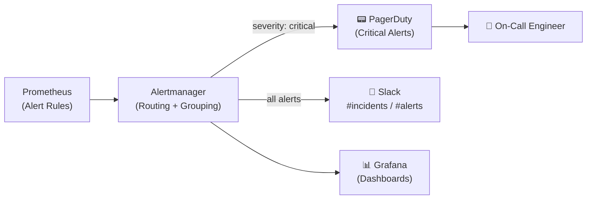

# InstaCommerce Monitoring

Prometheus alerting rules and Grafana dashboards for the InstaCommerce platform. Covers service SLOs, infrastructure health, Kafka consumer lag, and ML model performance.

---

## Alerting Hierarchy



---

## Alert Rules

All rules are defined in `monitoring/prometheus-rules.yaml` under the `instacommerce-slos` group:

| Alert | Expression | Duration | Severity | Description |
|-------|-----------|----------|----------|-------------|
| `HighErrorRate` | `sum(rate(http_server_requests_seconds_count{status=~"5.."}[5m])) / sum(rate(http_server_requests_seconds_count[5m])) > 0.01` | 5m | 🔴 critical | Service error rate exceeds 1% |
| `HighLatency` | `histogram_quantile(0.99, sum(rate(http_server_requests_seconds_bucket[5m])) by (le, service, uri)) > 0.5` | 5m | 🟡 warning | p99 latency exceeds 500ms |
| `KafkaConsumerLag` | `kafka_consumer_records_lag_max > 1000` | 10m | 🟡 warning | Kafka consumer lag exceeds 1000 records |
| `FrequentPodRestarts` | `increase(kube_pod_container_status_restarts_total[30m]) > 3` | — | 🔴 critical | Pod restarted more than 3 times in 30 minutes |
| `DatabaseHighCPU` | `cloudsql_database_cpu_utilization > 0.8` | 10m | 🟡 warning | Cloud SQL CPU utilization above 80% |

### Metrics Sources

| Source | Metrics |
|--------|---------|
| Spring Boot Actuator | `http_server_requests_seconds_*` (request rate, latency) |
| Kafka client | `kafka_consumer_records_lag_max` (consumer lag) |
| kube-state-metrics | `kube_pod_container_status_restarts_total` (pod restarts) |
| Cloud SQL exporter | `cloudsql_database_cpu_utilization` (DB CPU) |

---

## Dashboard Inventory

| Dashboard | Description | Key Panels |
|-----------|-------------|------------|
| **Service Overview** | High-level health of all microservices | Request rate, error rate, p50/p95/p99 latency, active pods |
| **Order Pipeline** | End-to-end order lifecycle metrics | Orders/min, order state distribution, fulfillment SLA, payment success rate |
| **Kafka & Messaging** | Kafka broker and consumer health | Consumer lag by topic, throughput, partition distribution, DLQ depth |
| **Database Health** | Cloud SQL PostgreSQL metrics | CPU, memory, connections, query latency, replication lag |
| **Redis / Memorystore** | Redis cache performance | Hit rate, memory usage, connected clients, evictions |
| **ML Model Performance** | ML serving metrics | Prediction count, latency, drift PSI, error rate, fallback rate |
| **Kubernetes Cluster** | GKE node and pod health | Node CPU/memory, pod restarts, HPA scaling events, resource quotas |
| **Data Platform** | Airflow DAG and pipeline health | DAG success/failure, task duration, data freshness, quality check results |

---

## On-Call Integration



### Severity Levels

| Severity | Channel | Response Time | Examples |
|----------|---------|--------------|---------|
| 🔴 **critical** | PagerDuty + Slack `#incidents` | < 15 min | HighErrorRate, FrequentPodRestarts |
| 🟡 **warning** | Slack `#alerts` | < 1 hour | HighLatency, KafkaConsumerLag, DatabaseHighCPU |
| 🔵 **info** | Slack `#monitoring` | Next business day | Scheduled maintenance, scaling events |

---

## Directory Structure

```
monitoring/
├── README.md
└── prometheus-rules.yaml    # Prometheus alerting rules (instacommerce-slos group)
```

---

## Adding New Alerts

1. Add a new rule entry to `prometheus-rules.yaml` under the `instacommerce-slos` group
2. Set appropriate `severity` label (`critical` or `warning`)
3. Include a descriptive `summary` annotation with template variables
4. Test the PromQL expression against Prometheus before deploying

```yaml
- alert: NewAlertName
  expr: |
    your_prometheus_expression > threshold
  for: 5m
  labels:
    severity: warning    # or critical
  annotations:
    summary: "Description of {{ $labels.service }}"
```
