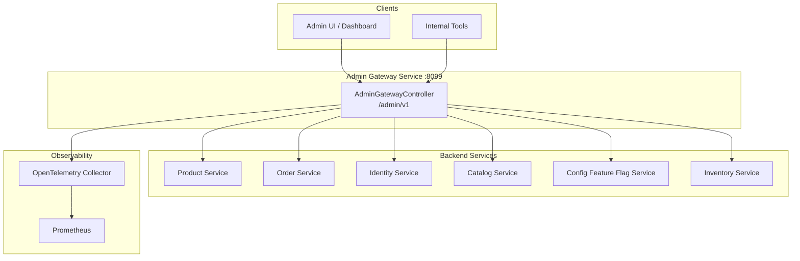
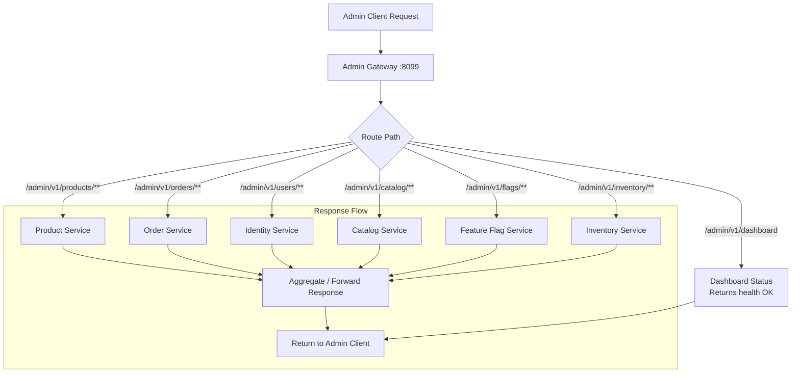
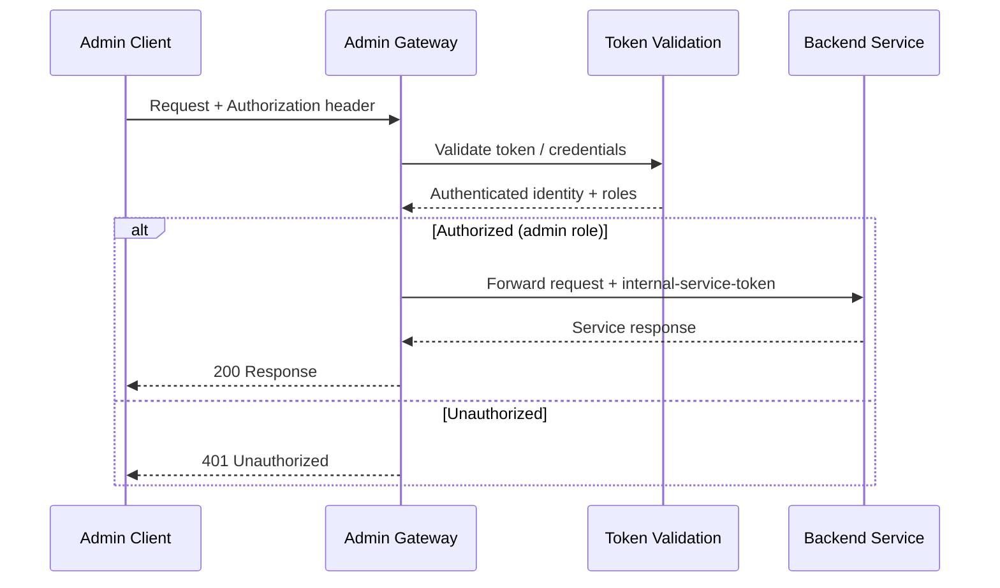
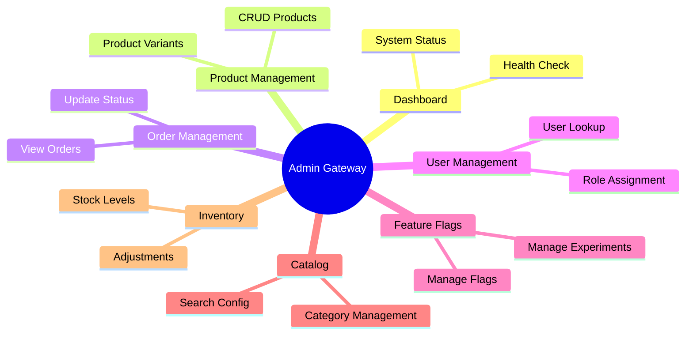

# Admin Gateway Service

API gateway for InstaCommerce admin operations. Routes authenticated admin requests to the appropriate backend microservices, providing a single entry point for the admin UI and internal tooling.

## Table of Contents

- [Architecture Overview](#architecture-overview)
- [Key Components](#key-components)
- [Request Routing](#request-routing)
- [Auth Flow](#auth-flow)
- [Supported Admin Operations](#supported-admin-operations)
- [API Reference](#api-reference)
- [Configuration](#configuration)

---

## Architecture Overview



---

## Key Components

| Component | Responsibility |
|---|---|
| **AdminGatewayController** | Central routing controller — accepts admin requests at `/admin/v1` and dispatches to backend services |
| **Application Config** | Service port, internal auth token, OpenTelemetry tracing configuration |

---

## Request Routing



All admin requests enter through the gateway at `/admin/v1`. The gateway authenticates the request, resolves the target service based on the URL path, forwards the request with the internal service token, and returns the response.

---

## Auth Flow



- **Inbound Auth**: Requests are validated at the gateway layer
- **Inter-Service Auth**: The gateway attaches the `internal.service.token` header when forwarding to backend services
- **Token**: Configured via `INTERNAL_SERVICE_TOKEN` environment variable

---

## Supported Admin Operations



---

## API Reference

### Gateway Endpoints

| Method | Endpoint | Description |
|---|---|---|
| `GET` | `/admin/v1/dashboard` | Gateway health and dashboard status |

### Actuator Endpoints

| Method | Endpoint | Description |
|---|---|---|
| `GET` | `/actuator/health/liveness` | Kubernetes liveness probe |
| `GET` | `/actuator/health/readiness` | Kubernetes readiness probe |
| `GET` | `/actuator/prometheus` | Prometheus metrics scrape endpoint |
| `GET` | `/actuator/info` | Application info |

### Dashboard Response

**GET /admin/v1/dashboard**

```json
{
  "status": "ok"
}
```

### Error Responses

| Status | Description |
|---|---|
| `401` | Missing or invalid authentication |
| `403` | Insufficient permissions (non-admin) |
| `502` | Backend service unavailable |
| `504` | Backend service timeout |

---

## Configuration

### application.yml

```yaml
server:
  port: ${SERVER_PORT:8099}
  shutdown: graceful

spring:
  application:
    name: admin-gateway-service
  lifecycle:
    timeout-per-shutdown-phase: 30s

internal:
  service:
    token: ${INTERNAL_SERVICE_TOKEN:dev-internal-token-change-in-prod}

management:
  endpoints:
    web:
      exposure:
        include: health,info,prometheus
  endpoint:
    health:
      probes:
        enabled: true
  tracing:
    sampling:
      probability: ${TRACING_PROBABILITY:1.0}
  otlp:
    tracing:
      endpoint: ${OTEL_EXPORTER_OTLP_TRACES_ENDPOINT:http://otel-collector.monitoring:4318/v1/traces}
    metrics:
      export:
        endpoint: ${OTEL_EXPORTER_OTLP_METRICS_ENDPOINT:http://otel-collector.monitoring:4318/v1/metrics}
```

### Environment Variables

| Variable | Default | Description |
|---|---|---|
| `SERVER_PORT` | `8099` | HTTP server port |
| `INTERNAL_SERVICE_TOKEN` | `dev-internal-token-change-in-prod` | Token for inter-service authentication |
| `OTEL_EXPORTER_OTLP_TRACES_ENDPOINT` | `http://otel-collector.monitoring:4318/v1/traces` | OpenTelemetry traces endpoint |
| `OTEL_EXPORTER_OTLP_METRICS_ENDPOINT` | `http://otel-collector.monitoring:4318/v1/metrics` | OpenTelemetry metrics endpoint |
| `TRACING_PROBABILITY` | `1.0` | Trace sampling probability (0.0–1.0) |
| `ENVIRONMENT` | `dev` | Deployment environment tag |

### Tech Stack

- Java 21, Spring Boot 3.x
- Spring MVC (Web)
- OpenTelemetry + Prometheus
- Docker (Alpine, non-root user)
- Graceful shutdown (30s timeout)
- Kubernetes health probes (liveness/readiness)
