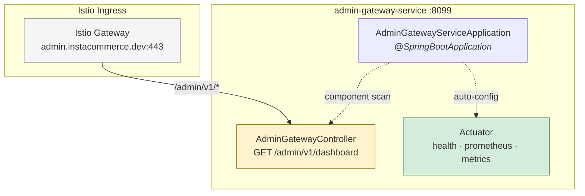
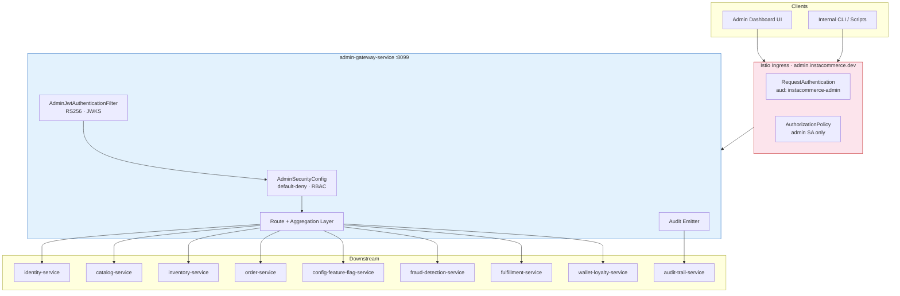
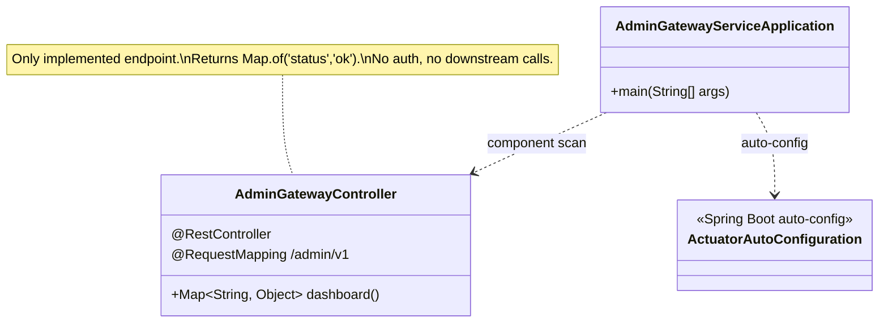
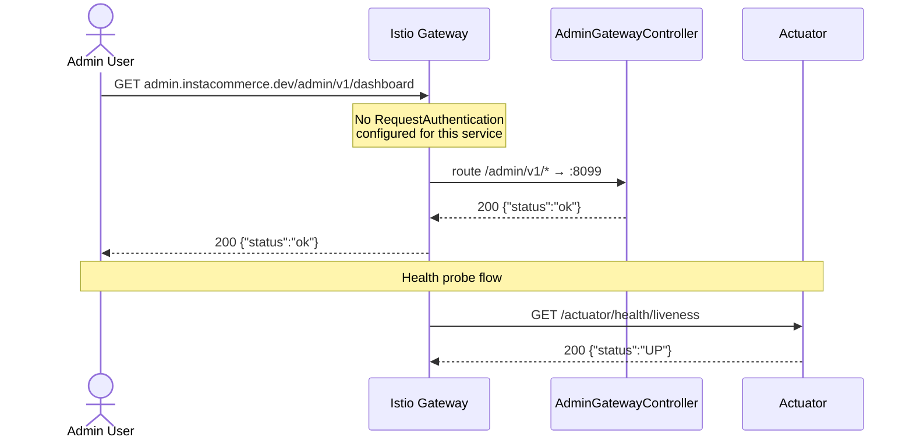

# Admin Gateway Service

> **Owner:** Edge & Identity cluster (C1)
> **Port:** 8099 · **Framework:** Spring Boot 3 (MVC) · **JDK:** 21
> **Gradle path:** `:services:admin-gateway-service`

Admin-facing API facade for InstaCommerce internal operations. In target state
this service mediates all admin-panel traffic — dashboard aggregation, order
management, inventory ops, catalog edits, feature-flag control, fraud rules, and
finance reconciliation — behind a dedicated RBAC and audit layer, reachable only
through the `admin.instacommerce.dev` host via Istio ingress.

**⚠️ Current state: scaffold.** The only implemented business logic is a single
stub endpoint (`GET /admin/v1/dashboard → {"status":"ok"}`). No authentication,
authorization, downstream routing, or test coverage exists in checked-in code.
The Iter-3 master review lists this service as **P0 — must not receive
production admin traffic as-is**
([`docs/reviews/iter3/master-review.md`](../../docs/reviews/iter3/master-review.md)).

---

## Table of Contents

1. [Service Role & Boundaries](#service-role--boundaries)
2. [Current vs Target State](#current-vs-target-state)
3. [High-Level Design](#high-level-design)
4. [Low-Level Design](#low-level-design)
5. [Integration Surfaces](#integration-surfaces)
6. [API Reference](#api-reference)
7. [Runtime & Configuration](#runtime--configuration)
8. [Observability](#observability)
9. [Testing](#testing)
10. [Failure Modes & Mitigations](#failure-modes--mitigations)
11. [Rollout & Rollback](#rollout--rollback)
12. [Known Limitations](#known-limitations)
13. [Industry Pattern Comparison](#industry-pattern-comparison)

---

## Service Role & Boundaries

The admin gateway is the **single ingress point for all internal-operations
traffic**. It is intentionally separated from the consumer-facing `mobile-bff-service`
to enable independent security posture, rate-limit policies, and network
isolation.

**Owns:**
- Admin API facade: request authentication, RBAC, and response shaping
- Aggregation of downstream domain responses for admin dashboard views
- Audit-event emission for every mutating admin action

**Does not own:**
- Domain logic — delegated to transactional services (order, inventory, catalog, etc.)
- Identity/token issuance — owned by `identity-service`
- Istio-level JWT validation — configured in Helm `requestAuthentications`
- Consumer/mobile API surface — owned by `mobile-bff-service`

---

## Current vs Target State

| Area | Current (checked-in code) | Target (per review docs) |
|------|---------------------------|--------------------------|
| **Endpoints** | `GET /admin/v1/dashboard` (stub) + actuator | Admin API facade: orders, inventory, catalog, riders, fraud rules, feature flags, finance |
| **Auth** | None — no `SecurityConfig`, no JWT filter | `AdminSecurityConfig` + `AdminJwtAuthenticationFilter` validating `aud: instacommerce-admin` |
| **RBAC** | None | Role hierarchy: `SUPER_ADMIN > OPS_MANAGER / FINANCE / PRODUCT_MGR > STORE_MGR / SUPPORT` |
| **Network isolation** | Istio VirtualService route exists (`/admin/v1 → admin-gateway-service`) but no `RequestAuthentication` or `AuthorizationPolicy` on this service | Dedicated `admin.instacommerce.dev` VirtualService, `RequestAuthentication` with admin audience, NetworkPolicy allowing ingress only from Istio gateway |
| **Downstream calls** | None | HTTP forwarding to identity, catalog, inventory, order, payment, fulfillment, config-feature-flag, fraud-detection, wallet-loyalty, audit-trail services |
| **Audit** | None | Every mutating admin action emitted to `audit-trail-service` |
| **Tests** | `spring-boot-starter-test` declared; no test classes | Controller, RBAC policy, JWT rejection, and downstream error-propagation coverage |

**Source references:**
- [`docs/reviews/iter3/services/edge-identity.md` §2.3, §8](../../docs/reviews/iter3/services/edge-identity.md) — scaffold assessment & planned RBAC config
- [`docs/reviews/api-gateway-bff-design.md` §5](../../docs/reviews/api-gateway-bff-design.md) — admin gateway service overview, RBAC model, key endpoints
- [`docs/reviews/iter3/master-review.md` §5](../../docs/reviews/iter3/master-review.md) — P0 issue register

---

## High-Level Design

### Current-state architecture

Two Java classes, a stub endpoint, and actuator. No downstream integration.



### Target-state architecture (not yet implemented)



---

## Low-Level Design

### Current component diagram (UML)



### Current request sequence



---

## Integration Surfaces

### Inbound

| Source | Protocol | Path | Auth (current) | Auth (target) |
|--------|----------|------|-----------------|---------------|
| Istio VirtualService | HTTP | `/admin/v1/*` | None | Istio `RequestAuthentication` + app-level JWT + RBAC |
| Kubernetes probes | HTTP | `/actuator/health/{liveness,readiness}` | None (permitAll) | None (permitAll) |
| Prometheus | HTTP | `/actuator/prometheus` | None | None |

### Outbound (target — none implemented)

| Target service | Purpose | Pattern |
|----------------|---------|---------|
| `identity-service` | User management, admin role queries | Sync HTTP via internal token |
| `catalog-service` | Product CRUD | Sync HTTP |
| `inventory-service` | Stock ops, bulk updates | Sync HTTP |
| `order-service` | Order lookup, refund initiation | Sync HTTP |
| `config-feature-flag-service` | Flag management | Sync HTTP |
| `fraud-detection-service` | Rule management | Sync HTTP |
| `audit-trail-service` | Audit event sink | Async (fire-and-forget or outbox) |

### Istio/Helm routing (exists in `deploy/helm/values.yaml`)

- Gateway hosts include `admin.instacommerce.dev`
- VirtualService route: `prefix: /admin/v1 → admin-gateway-service`
- **No `RequestAuthentication`** is configured for this service (only payment, order, checkout-orchestrator, and inventory have it)
- **No `AuthorizationPolicy`** restricts access to the admin surface

---

## API Reference

### Business endpoint

| Method | Path | Response | Notes |
|--------|------|----------|-------|
| `GET` | `/admin/v1/dashboard` | `{"status":"ok"}` | Stub. No downstream call. |

### Actuator endpoints (Spring Boot auto-configured)

| Method | Path | Purpose |
|--------|------|---------|
| `GET` | `/actuator/health/liveness` | K8s liveness probe |
| `GET` | `/actuator/health/readiness` | K8s readiness probe |
| `GET` | `/actuator/prometheus` | Prometheus metric scrape |
| `GET` | `/actuator/info` | App metadata |
| `GET` | `/actuator/metrics` | Micrometer metric index |

---

## Runtime & Configuration

### `application.yml` (full, as checked in)

```yaml
server:
  port: ${SERVER_PORT:8099}
  shutdown: graceful

spring:
  application:
    name: admin-gateway-service
  config:
    import: optional:sm://            # GCP Secret Manager integration
  lifecycle:
    timeout-per-shutdown-phase: 30s

management:
  tracing:
    sampling:
      probability: ${TRACING_PROBABILITY:1.0}
  otlp:
    tracing:
      endpoint: ${OTEL_EXPORTER_OTLP_TRACES_ENDPOINT:http://otel-collector.monitoring:4318/v1/traces}
    metrics:
      endpoint: ${OTEL_EXPORTER_OTLP_METRICS_ENDPOINT:http://otel-collector.monitoring:4318/v1/metrics}
  metrics:
    tags:
      service: ${spring.application.name}
      environment: ${ENVIRONMENT:dev}
    export:
      prometheus:
        enabled: true
  endpoints:
    web:
      exposure:
        include: health,info,prometheus,metrics
  endpoint:
    health:
      probes:
        enabled: true
      show-details: always
      group:
        readiness:
          include: readinessState
        liveness:
          include: livenessState
  health:
    livenessstate:
      enabled: true
    readinessstate:
      enabled: true

internal:
  service:
    name: ${spring.application.name}
    token: ${INTERNAL_SERVICE_TOKEN:dev-internal-token-change-in-prod}
```

### Environment variables

| Variable | Default | Notes |
|----------|---------|-------|
| `SERVER_PORT` | `8099` | HTTP listen port |
| `INTERNAL_SERVICE_TOKEN` | `dev-internal-token-change-in-prod` | Configured but **unused** until downstream forwarding is implemented |
| `OTEL_EXPORTER_OTLP_TRACES_ENDPOINT` | `http://otel-collector.monitoring:4318/v1/traces` | OTLP collector for distributed traces |
| `OTEL_EXPORTER_OTLP_METRICS_ENDPOINT` | `http://otel-collector.monitoring:4318/v1/metrics` | OTLP collector for metrics |
| `TRACING_PROBABILITY` | `1.0` | Trace sampling ratio (1.0 = 100%) |
| `ENVIRONMENT` | `dev` | Metric tag for environment discrimination |
| `SPRING_PROFILES_ACTIVE` | — | Set to `gcp` in Helm; enables Secret Manager `sm://` imports |

### Helm deployment posture (`deploy/helm/`)

| Key | `values.yaml` (base) | `values-dev.yaml` | `values-prod.yaml` |
|-----|----------------------|--------------------|--------------------|
| `replicas` | 2 | inherits | 2 |
| `image` | `admin-gateway-service` | tag: `dev` | tag: `prod` |
| `port` | 8099 | inherits | inherits |
| `requests` | 250m CPU / 384Mi | inherits | inherits |
| `limits` | 500m CPU / 768Mi | inherits | inherits |
| `HPA` | 2–6 replicas @ 70% CPU | inherits | inherits |
| `env.SPRING_PROFILES_ACTIVE` | `gcp` | inherits | inherits |

### Docker image

Multi-stage build (`Dockerfile`):

- **Build stage:** `gradle:9.4-jdk21` — `gradle clean build -x test --no-daemon`
- **Runtime stage:** `eclipse-temurin:25-jre-alpine`
- Non-root user `app` (UID 1001)
- Port 8099
- Healthcheck: `wget -qO- http://localhost:8099/actuator/health/liveness`
- JVM flags: `-XX:MaxRAMPercentage=75.0 -XX:+UseZGC -Djava.security.egd=file:/dev/./urandom`

### Local development

```bash
# Build (from repo root)
./gradlew :services:admin-gateway-service:build -x test

# Run
./gradlew :services:admin-gateway-service:bootRun

# Smoke test
curl -s http://localhost:8099/admin/v1/dashboard
# → {"status":"ok"}

curl -s http://localhost:8099/actuator/health/readiness
# → {"status":"UP","groups":["liveness","readiness"]}
```

No Docker Compose dependencies are required — this service has no database,
cache, or message-broker connections.

---

## Observability

### What exists today

| Signal | Mechanism | Notes |
|--------|-----------|-------|
| **Metrics** | Micrometer → Prometheus (`/actuator/prometheus`) + OTLP push | Standard JVM, HTTP server, and Spring MVC metrics. Custom business metrics: none. |
| **Traces** | Micrometer Tracing bridge → OTEL (`/v1/traces`) | Auto-instrumented Spring MVC spans. No downstream calls to propagate context to. |
| **Logs** | Logstash-logback-encoder (JSON) | Structured JSON logs with trace/span IDs when tracing is active. |
| **Health** | Spring Actuator liveness + readiness | K8s probe-compatible groups. |

### What is missing

- No custom admin-action metrics (request counts per admin role, per endpoint, per downstream service)
- No alerting rules in `monitoring/` specific to admin-gateway
- No dashboard definitions
- No audit-event emission to `audit-trail-service`

---

## Testing

**Current state:** `spring-boot-starter-test` is declared in `build.gradle.kts`
and JUnit Platform is configured. **No test classes exist** under `src/test/`.

```bash
# Would run tests if any existed
./gradlew :services:admin-gateway-service:test
```

**Required before production traffic (per Iter-3 edge-identity review §8):**

1. Controller tests — verify stub endpoint and future route responses
2. JWT rejection tests — consumer tokens with `aud: instacommerce-api` must be rejected; only `aud: instacommerce-admin` accepted
3. RBAC policy tests — role-to-endpoint mapping (`SUPPORT` cannot access `/admin/v1/feature-flags`, etc.)
4. Downstream error propagation — 5xx from domain services returns structured admin error, not raw upstream body
5. Integration tests with Testcontainers (once downstream calls exist)

---

## Failure Modes & Mitigations

| Failure mode | Impact | Current mitigation | Required mitigation |
|--------------|--------|-------------------|---------------------|
| **Unauthenticated admin access** | Unauthorized operations on all admin endpoints | **None** — no auth layer exists | `AdminSecurityConfig` + Istio `RequestAuthentication` with admin audience (see edge-identity §8) |
| **Privilege escalation via internal token** | Any service holding `INTERNAL_SERVICE_TOKEN` can call `/admin/**` | **None** — token is configured but unused; once forwarding is added, the flat token grants `ROLE_ADMIN` to all callers | Scope `InternalServiceAuthFilter` roles per caller name; add Istio `AuthorizationPolicy` restricting `/admin/**` to admin-gateway SA only |
| **Stub endpoint in production** | Admin dashboard shows `{"status":"ok"}` instead of real data | Low impact while scaffold | Replace stub with real aggregation before enabling admin UI traffic |
| **Pod crash / OOM** | 2-replica HPA absorbs single-pod failure; ZGC + 75% RAM cap reduces OOM risk | HPA 2–6 pods; graceful shutdown with 30s drain | Add PodDisruptionBudget (minAvailable: 1) |
| **Downstream service unavailable** | Not applicable yet — no downstream calls | — | Circuit breaker + timeout per downstream; graceful degradation returning partial dashboard |

---

## Rollout & Rollback

### Current deployment path

1. CI builds on path-filter match (`services/admin-gateway-service/**` in `.github/workflows/ci.yml`)
2. Docker image pushed; tag updated in `values-dev.yaml` → ArgoCD syncs to dev cluster
3. Prod: `values-prod.yaml` tag updated; ArgoCD syncs with 2 replicas

### Pre-production hardening checklist (from Iter-3 Wave 1, steps 1.2–1.4)

1. Add `spring-boot-starter-security` + JJWT → `build.gradle.kts`
2. Implement `AdminSecurityConfig` (default-deny, role whitelist)
3. Implement `AdminJwtAuthenticationFilter` (JWKS from identity-service, `aud: instacommerce-admin`)
4. Add `IDENTITY_JWKS_URI` env to Helm values
5. Deploy Istio `RequestAuthentication` for admin-gateway **first** (allows existing traffic)
6. Deploy `AuthorizationPolicy` **second** (begins denying unauthenticated traffic) — must be separate Helm release
7. Add `NetworkPolicy` allowing ingress only from Istio gateway pod
8. Validate: consumer token → 401; admin token → 200; no-token → 403

### Rollback

- Revert ArgoCD to previous image tag (dev: `values-dev.yaml`, prod: `values-prod.yaml`)
- If Istio policies cause traffic black-hole: delete `AuthorizationPolicy` first, then `RequestAuthentication`
- No database or state to migrate — rollback is stateless image swap

---

## Known Limitations

1. **No authentication or authorization** — the service accepts any HTTP request without validation
2. **No downstream routing** — cannot proxy or aggregate from domain services
3. **Internal service token is configured but unused** — will grant overbroad `ROLE_ADMIN` to all callers once forwarding is wired in (see edge-identity §6.2)
4. **No test coverage** — zero test classes
5. **No NetworkPolicy** — reachable from any pod in the namespace, not just Istio ingress
6. **No admin-specific Istio `RequestAuthentication`** — the admin host route exists but is unprotected at the mesh layer
7. **No audit trail integration** — admin actions are not logged to `audit-trail-service`
8. **No runbook** — the service does not own live control-plane behavior beyond the stub

---

## Industry Pattern Comparison

The admin-gateway pattern is standard in q-commerce and rapid-delivery
platforms. Observations grounded in public architecture disclosures and the
InstaCommerce design docs:

| Aspect | InstaCommerce (target) | Industry pattern |
|--------|----------------------|------------------|
| **Dedicated admin ingress** | Separate `admin.instacommerce.dev` host + Istio VirtualService | Common — Zepto and Blinkit use isolated admin domains behind Cloud IAP or VPN; DoorDash routes admin traffic through a separate BFF layer |
| **RBAC granularity** | Role hierarchy (SUPER_ADMIN → OPS_MANAGER / FINANCE / PRODUCT_MGR → STORE_MGR / SUPPORT) with per-endpoint enforcement | Comparable — Instacart's retailer portal and DoorDash's merchant dashboard use fine-grained permission models with store-scoped access |
| **Audit trail** | Planned: every mutating admin action → audit-trail-service | Industry baseline — mandatory for SOC 2 / PCI-DSS compliance; Instacart and DoorDash publish audit logs to immutable stores |
| **Network isolation** | Target: Istio AuthorizationPolicy + NetworkPolicy restricting admin surface to gateway SA | Best practice — defense-in-depth; public q-commerce platforms typically use Cloud IAP + mTLS + network policy |
| **Current maturity** | Scaffold — stub endpoint, no auth | Below production bar — all referenced platforms ship admin gateways with auth, RBAC, and audit before accepting traffic |

> **Note:** Comparisons are based on publicly available engineering blog posts
> and conference talks. No proprietary information is referenced.
