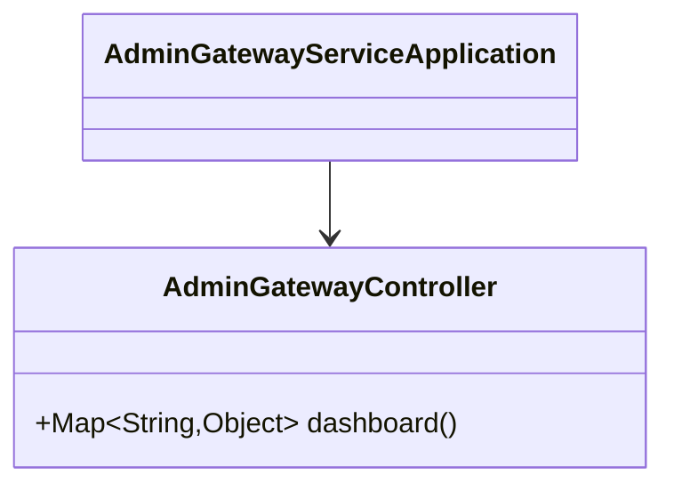
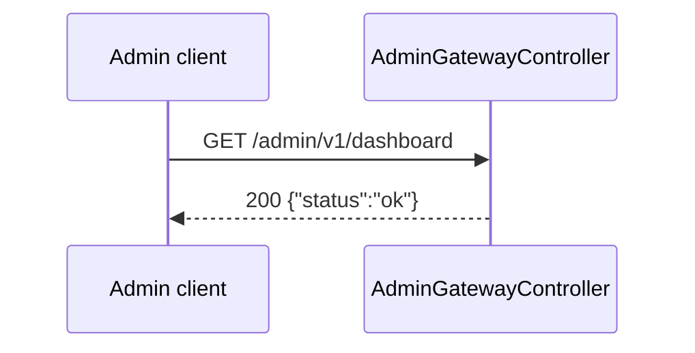
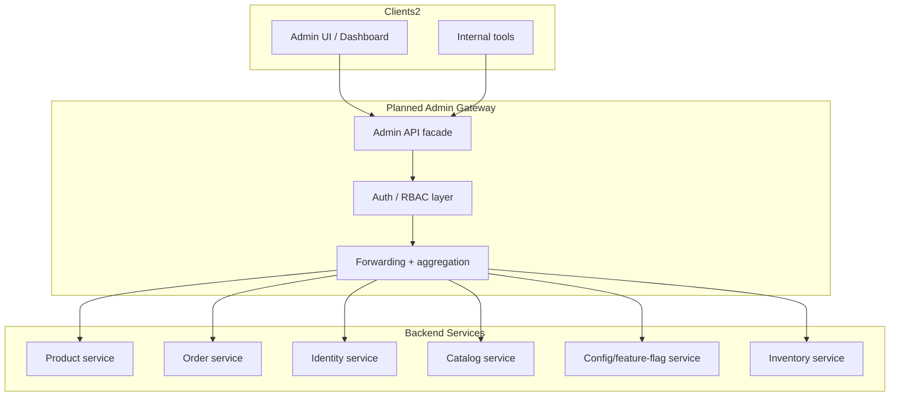
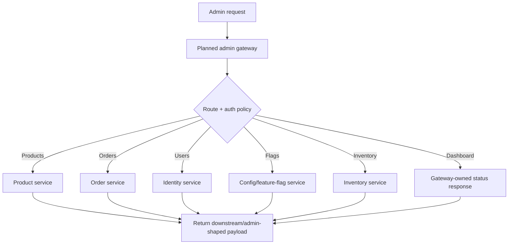

# Admin Gateway Service

Admin-facing edge service for InstaCommerce. **Current state:** this service is
still a scaffold. The only implemented business endpoint is
`GET /admin/v1/dashboard`, which returns a stub payload. No request proxying,
RBAC enforcement, or downstream service integration exists yet.

## Current-State Summary

| Area | Current implementation | Target state |
|------|------------------------|--------------|
| Endpoints | `GET /admin/v1/dashboard` + actuator | Admin API facade over product, order, identity, flags, inventory, and catalog domains |
| Routing | None | Path-based proxying and/or aggregation |
| Authentication | None in code | Admin JWT validation, role checks, internal forwarding headers |
| Tests | No test classes yet | Controller, routing, and policy coverage |

## Current Architecture (HLD)

```mermaid
graph TB
    subgraph Clients
        ADMIN[Admin UI]
        OPS[Internal tools]
    end

    subgraph Admin Gateway Service :8099
        CTRL[AdminGatewayController]
        APP[AdminGatewayServiceApplication]
        ACT[Actuator + OTEL + Prometheus]
    end

    ADMIN --> CTRL
    OPS --> CTRL
    CTRL -->|Map.of("status","ok")| ADMIN
    CTRL --> ACT
    APP --> CTRL
```

## Current UML Snapshot (LLD)



## Current Request Flow



## Target Architecture (Planned, not yet implemented)

The diagrams below describe the intended admin-gateway role once routing,
authentication, and downstream integrations are built. They are not current
runtime behavior.





## API Reference

### Implemented endpoint

| Method | Endpoint | Description | Response |
|--------|----------|-------------|----------|
| `GET` | `/admin/v1/dashboard` | Current stub admin dashboard endpoint | `{"status":"ok"}` |

### Actuator endpoints

| Method | Endpoint | Description |
|--------|----------|-------------|
| `GET` | `/actuator/health/liveness` | Kubernetes liveness probe |
| `GET` | `/actuator/health/readiness` | Kubernetes readiness probe |
| `GET` | `/actuator/prometheus` | Prometheus scrape endpoint |
| `GET` | `/actuator/info` | Application metadata |
| `GET` | `/actuator/metrics` | Micrometer metrics catalog |

## Configuration

### Runtime configuration

```yaml
server:
  port: ${SERVER_PORT:8099}
  shutdown: graceful

spring:
  application:
    name: admin-gateway-service
  config:
    import: optional:sm://
  lifecycle:
    timeout-per-shutdown-phase: 30s

management:
  tracing:
    sampling:
      probability: ${TRACING_PROBABILITY:1.0}
  otlp:
    tracing:
      endpoint: ${OTEL_EXPORTER_OTLP_TRACES_ENDPOINT:http://otel-collector.monitoring:4318/v1/traces}
    metrics:
      endpoint: ${OTEL_EXPORTER_OTLP_METRICS_ENDPOINT:http://otel-collector.monitoring:4318/v1/metrics}
  metrics:
    tags:
      service: ${spring.application.name}
      environment: ${ENVIRONMENT:dev}
    export:
      prometheus:
        enabled: true
  endpoints:
    web:
      exposure:
        include: health,info,prometheus,metrics
  endpoint:
    health:
      probes:
        enabled: true
      show-details: always
      group:
        readiness:
          include: readinessState
        liveness:
          include: livenessState

internal:
  service:
    name: ${spring.application.name}
    token: ${INTERNAL_SERVICE_TOKEN:dev-internal-token-change-in-prod}
```

### Environment variables

| Variable | Default | Description |
|----------|---------|-------------|
| `SERVER_PORT` | `8099` | HTTP server port |
| `INTERNAL_SERVICE_TOKEN` | `dev-internal-token-change-in-prod` | Placeholder internal token for future downstream forwarding |
| `OTEL_EXPORTER_OTLP_TRACES_ENDPOINT` | `http://otel-collector.monitoring:4318/v1/traces` | OTLP traces endpoint |
| `OTEL_EXPORTER_OTLP_METRICS_ENDPOINT` | `http://otel-collector.monitoring:4318/v1/metrics` | OTLP metrics endpoint |
| `TRACING_PROBABILITY` | `1.0` | Trace sampling probability |
| `ENVIRONMENT` | `dev` | Metrics/environment tag |

## Local Development

### Build and run

```bash
# From the repository root
./gradlew :services:admin-gateway-service:bootRun
```

### Docker image

The service ships with a Java 21 / Alpine multi-stage Dockerfile:

- runtime port: `8099`
- non-root user: `app`
- healthcheck: `/actuator/health/liveness`
- JVM posture: `-XX:MaxRAMPercentage=75.0`, `-XX:+UseZGC`

## Deployment Notes

The Helm values currently treat this service as a lightweight edge stub:

| Environment | Replicas | HPA | Resource requests | Resource limits |
|-------------|----------|-----|-------------------|-----------------|
| `values.yaml` | 2 | 2-6 pods @ 70% CPU | `250m / 384Mi` | `500m / 768Mi` |
| `values-dev.yaml` | tag only | inherits base | inherits base | inherits base |
| `values-prod.yaml` | 2 | inherits base | inherits base | inherits base |

## Testing Status

- `spring-boot-starter-test` is present in `build.gradle.kts`
- no `src/test` classes exist yet
- before enabling request forwarding, add controller tests, RBAC tests, and
  downstream error-propagation coverage

## Known Gaps

1. No downstream routing or aggregation logic is implemented.
2. No inbound authentication or authorization layer exists in code.
3. The internal service token is configured but unused until forwarding is added.
4. No runbook exists yet because the service does not currently own live
   control-plane behavior beyond the stub endpoint.
