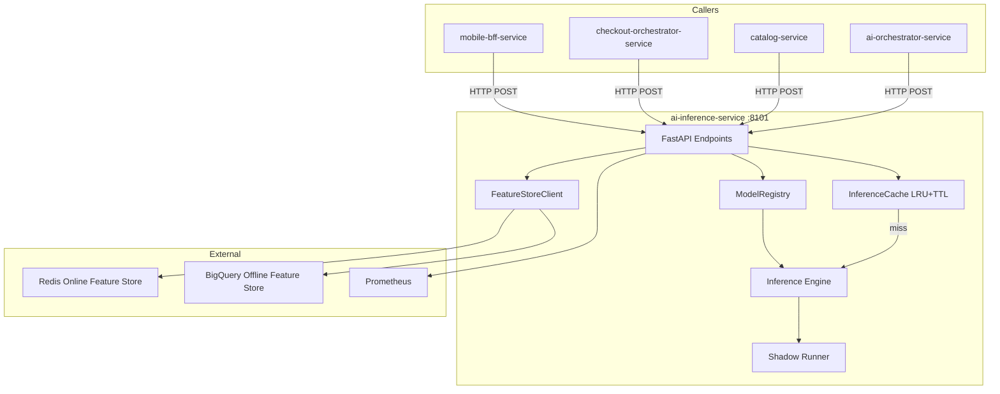
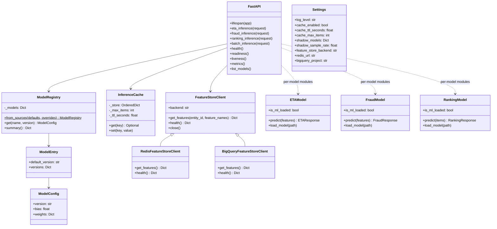
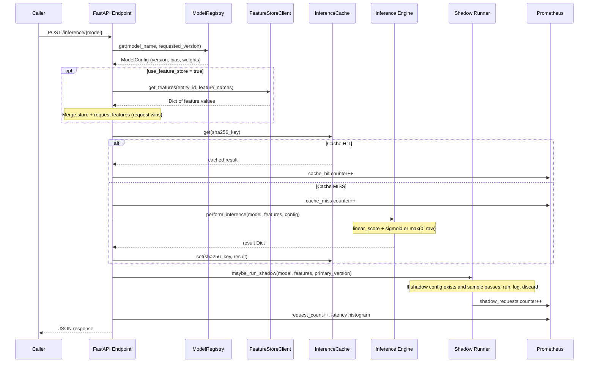
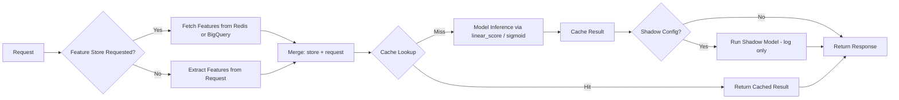
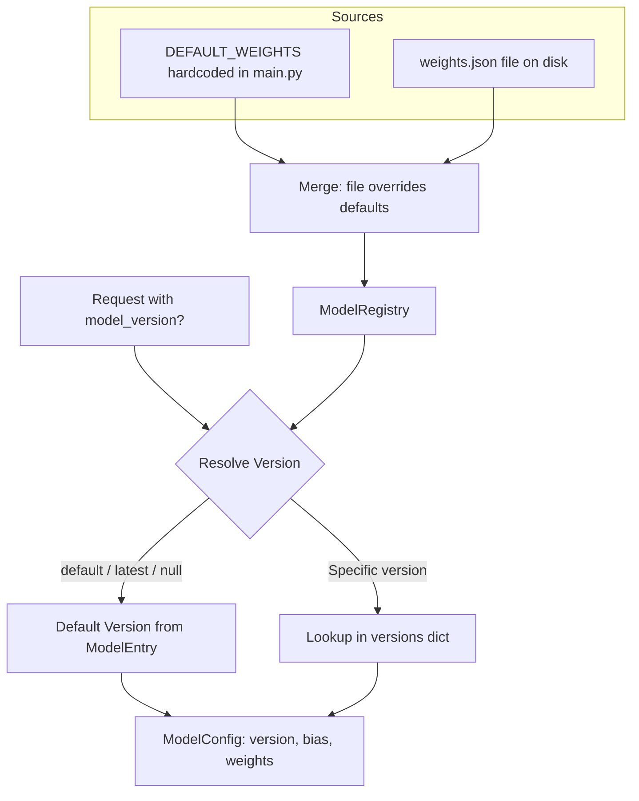
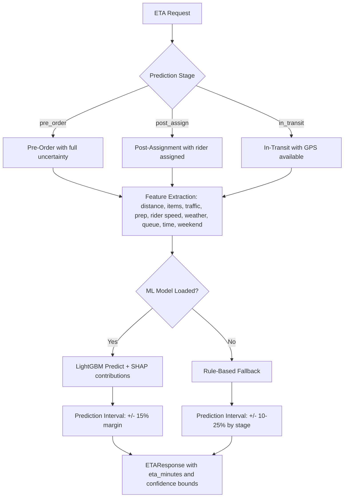
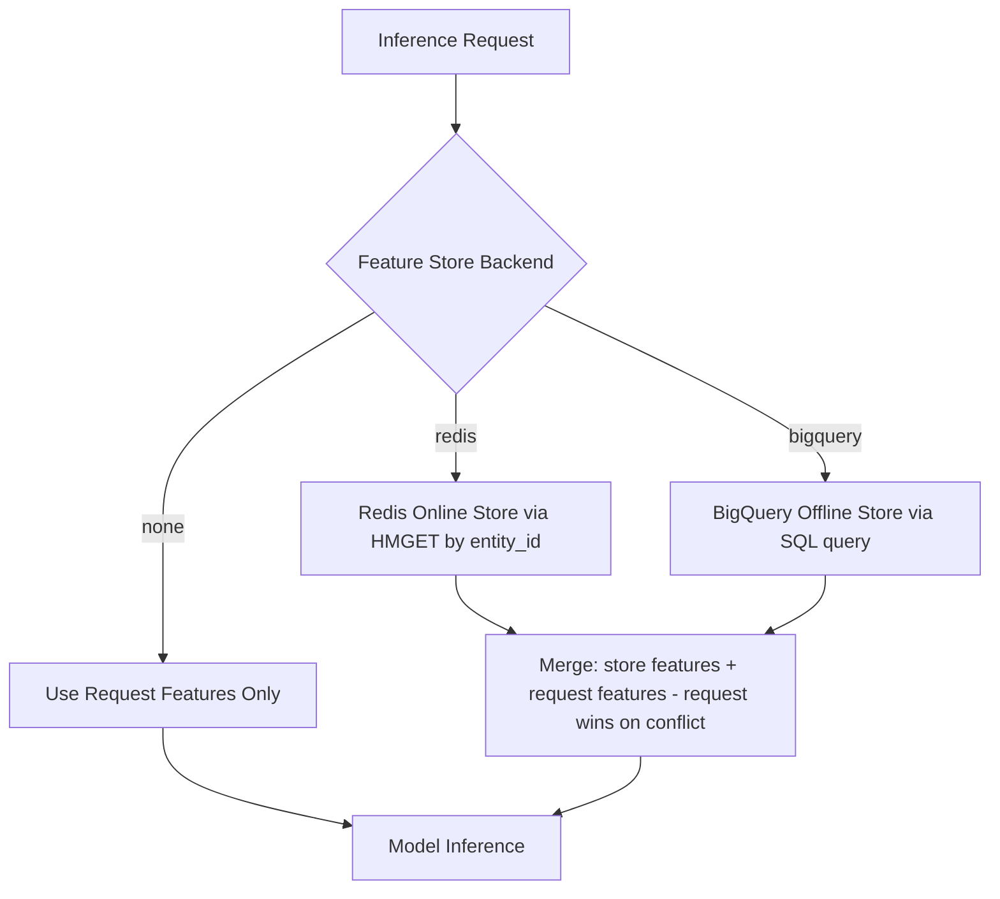
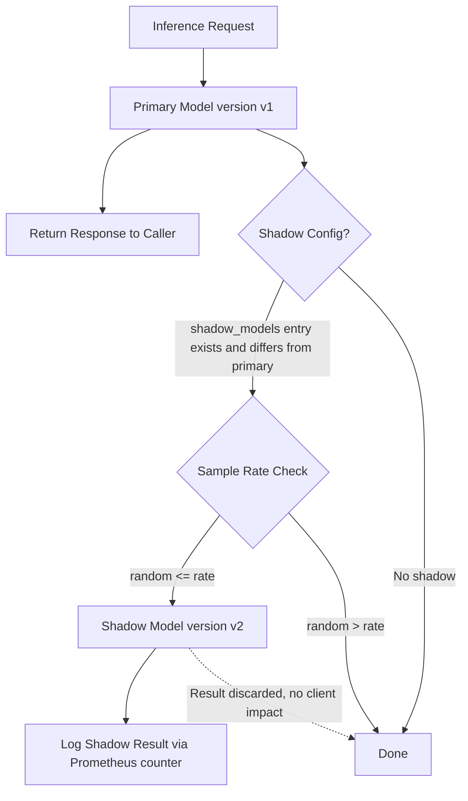

# AI Inference Service

**Python / FastAPI** — Online model-serving gateway for the InstaCommerce q-commerce platform. Hosts seven prediction models behind a unified versioned registry with per-request caching, feature-store integration, shadow/A-B routing, and deterministic rule-based fallbacks.

| Attribute | Value |
|---|---|
| **Runtime** | Python 3.14 / FastAPI 0.110 / uvicorn |
| **Port** | `8101` (configurable via `SERVER_PORT`) |
| **Models** | ETA (LightGBM), Fraud (XGBoost), Ranking (LambdaMART), Demand (Prophet+TFT), Personalization (Two-Tower NCF), CLV (BG/NBD+Gamma-Gamma), Dynamic Pricing (Contextual Bandit) |
| **Feature store** | Redis (online, <5 ms) / BigQuery (offline batch) / None (request-only) |
| **Caching** | In-memory LRU with TTL (default 1 000 entries, 300 s) |
| **Metrics** | Prometheus (`/metrics`) — per-model counters, latency histograms, cache events, feature-store latency |
| **Health probes** | `/health`, `/health/ready`, `/health/live` |
| **Shadow mode** | Per-model A/B routing + configurable shadow inference (log-only, never served) |

---

## Table of Contents

1. [Service Role and Boundaries](#service-role-and-boundaries)
2. [High-Level Design (HLD)](#high-level-design-hld)
3. [Low-Level Design (LLD)](#low-level-design-lld)
4. [Model Serving and Request Path](#model-serving-and-request-path)
5. [Model Registry and Versioning](#model-registry-and-versioning)
6. [Per-Model Decision Flows](#per-model-decision-flows)
7. [Feature Store Integration](#feature-store-integration)
8. [Shadow Mode](#shadow-mode)
9. [API Reference](#api-reference)
10. [Project Structure](#project-structure)
11. [Runtime and Configuration](#runtime-and-configuration)
12. [Dependencies](#dependencies)
13. [Observability](#observability)
14. [Testing](#testing)
15. [Failure Modes and Fallbacks](#failure-modes-and-fallbacks)
16. [Rollout and Rollback](#rollout-and-rollback)
17. [Security and Trust Boundaries](#security-and-trust-boundaries)
18. [Known Limitations](#known-limitations)
19. [Industry Comparison Notes](#industry-comparison-notes)

---

## Service Role and Boundaries

The AI Inference Service is the **online prediction plane** for InstaCommerce. It does not own training, feature computation, domain state, or transactional writes. Its sole responsibility is to accept a prediction request, resolve the correct model version, fetch any needed features, run inference (ML or rule-based fallback), and return a scored result.

**What this service owns:**

- Online model inference for seven model families
- In-process model registry with file-based weight loading and version resolution
- Deterministic rule-based fallbacks when ML artefacts are unavailable
- Response caching (in-memory LRU+TTL)
- Shadow/A-B inference execution and metric emission
- Feature store client integration (Redis online, BigQuery offline)

**What this service does NOT own:**

| Responsibility | Owner |
|---|---|
| Model training / evaluation gates | `ml/train/`, `ml/eval/evaluate.py` |
| Feature computation / refresh | `ml/feature_store/sql/`, Airflow `ml_feature_refresh` DAG |
| LangGraph agent orchestration | `ai-orchestrator-service` |
| Domain state mutations (orders, payments, inventory) | Respective Java domain services |
| Event / contract schemas | `contracts/` |
| Deployment manifests / HPA / PDB | `deploy/helm/`, `argocd/` |

**Advisory-only principle:** All outputs of this service are advisory scores. The consuming service (checkout-orchestrator, BFF, catalog-service) decides how to act on the score. The inference service never writes to domain databases, never captures payments, and never dispatches riders. This boundary is architecturally enforced: no outbox table, no Kafka producer, no domain-service write client exists in the codebase.

---

## High-Level Design (HLD)



---

## Low-Level Design (LLD)

### Component Diagram



### Key Data Structures

| Structure | Location | Purpose |
|---|---|---|
| `Settings` (frozen dataclass) | `main.py:44` | All `AI_INFERENCE_*` env vars, parsed at module load |
| `ModelRegistry` | `main.py:164` | Merged from `DEFAULT_WEIGHTS` + optional `weights.json` file |
| `ModelConfig` | `main.py:124` | `(version, bias, weights)` for a single model version |
| `ModelEntry` | `main.py:131` | `(default_version, versions)` for all versions of one model |
| `InferenceCache` | `main.py:193` | `OrderedDict[key -> (expires_at, result)]`, LRU eviction, TTL expiry |
| `FeatureStoreClient` hierarchy | `main.py:222-348` | Strategy pattern: Redis, BigQuery, None, Unavailable variants |

---

## Model Serving and Request Path

### End-to-End Inference Sequence



### Request Flow (Flowchart)



### Core Inference Functions

The registry-based endpoints (`/inference/eta`, `/inference/fraud`, `/inference/ranking`) share a common execution path in `main.py`:

1. **`resolve_model_config()`** — Looks up `ModelConfig` from the registry. Returns 404 if the model or version is not found.
2. **`build_features_for_model()`** — Extracts the feature dict from the Pydantic request.
3. **`execute_inference()`** — Checks cache, runs `perform_inference()`, caches result, triggers shadow.
4. **`perform_inference()`** — Calls `linear_score(features, weights, bias)`. For fraud and ranking, applies `safe_sigmoid()` to map the raw score to `[0, 1]`. For ETA, clamps at `max(0, raw_score)`.
5. **`maybe_run_shadow()`** — If a shadow version is configured for this model and the random sample passes, runs inference on the shadow version. Failures are logged and swallowed.

### Cache Key Generation

```python
SHA256(json.dumps({
    "model": model_name,
    "version": model_version,
    "features": features_dict
}, sort_keys=True))
```

Default: 1 000 entries, 300 s TTL. Eviction is LRU (oldest-first when capacity exceeded).

---

## Model Registry and Versioning



### Version Resolution

```python
registry.get("eta")               # default version (eta-linear-v1)
registry.get("eta", "default")    # default version
registry.get("eta", "latest")     # default version
registry.get("eta", "eta-v2")     # specific version (if registered)
```

### Default Weights (Hardcoded in `main.py`)

| Model | Version | Bias | Weights |
|---|---|---|---|
| `eta` | `eta-linear-v1` | 4.5 | `distance_km: 2.3, item_count: 0.6, traffic_factor: 3.1` |
| `ranking` | `ranking-linear-v1` | 0.15 | `relevance_score: 0.55, price_score: 0.2, availability_score: 0.35, user_affinity: 0.4` |
| `fraud` | `fraud-logit-v1` | -1.4 | `order_amount: 0.012, chargeback_rate: 4.8, device_risk: 2.1, account_age_days: -0.015` |

The `weights.json` file (path configurable via `AI_INFERENCE_WEIGHTS_PATH`) can override or extend these defaults. The file supports multi-version entries with `versions` dicts and `default_version` / `defaultVersion` keys.

### A/B Routing

The `model_version` query parameter or request field routes to any registered version. Multiple versions coexist in the registry. Upstream callers (BFF, orchestrator) direct traffic percentages to different versions for A/B testing.

---

## Per-Model Decision Flows

### All Models Summary

| Model | Module | Algorithm | Default Version | Decision Surface |
|---|---|---|---|---|
| **ETA** | `eta_model.py` | LightGBM (9 features, 3 stages) | `eta-lgbm-v1` | Customer-facing delivery promise |
| **Fraud** | `fraud_model.py` | XGBoost (15 features) | `fraud-xgb-v1` | Checkout gate: auto-approve / soft-review / block |
| **Ranking** | `ranking_model.py` | LambdaMART LightGBM (13 features) | `ranking-lambdamart-v1` | Search result ordering |
| **Demand** | `demand_model.py` | Prophet + TFT (14 features) | `demand-tft-v1` | Inventory replenishment, rider planning |
| **Personalization** | `personalization_model.py` | Two-Tower NCF (64-dim embeddings) | `pers-ncf-v1` | Homepage, buy-again, FBT surfaces |
| **CLV** | `clv_model.py` | BG/NBD + Gamma-Gamma (14 features) | `clv-bgnbd-v1` | Platinum/Gold/Silver/Bronze segmentation |
| **Dynamic Pricing** | `dynamic_pricing_model.py` | Contextual Bandit (15 features) | `pricing-bandit-v1` | Delivery fee optimization with guardrails |

All models implement a **rule-based fallback** that activates when ML artefacts are not loaded. The `method` field in every response distinguishes `"ml"` from `"rule_based"`.

### ETA Model — Three-Stage Prediction



**Rule-based fallback formula** (from `eta_model.py:198-239`):

```
ETA = (distance_km / rider_speed_kmh * 60 * traffic * weather)
    + store_prep_time * (1.1 if weekend)
    + queue_depth * 2.0 min
    + max(0, items - 1) * 0.5 min
```

Margin by stage: in-transit +/-10%, post-assign +/-15%, pre-order +/-25%.

### Fraud Model — Score, Threshold, Decision

Score thresholds (from `fraud_model.py:87-96`): `< 30` auto-approve, `30-70` soft-review, `> 70` block.

**Rule-based scoring categories:**

| Category | Indicators | Max Points |
|---|---|---|
| **Velocity** | orders/hour >= 3, orders/24h >= 8, new addresses/7d >= 3, payment methods/30d >= 3 | ~57 |
| **Basket Risk** | amount > $500, basket/avg ratio > 3x, high resale > 50% | ~37 |
| **Payment Risk** | prepaid card, country mismatch | 23 |
| **Device Risk** | VPN, emulator, new fingerprint | 35 |
| **Account Trust** | age > 365d (discount), profile completeness (discount), chargeback_rate * 40 | Discount |

### Dynamic Pricing — Guardrails

The pricing model (`dynamic_pricing_model.py:83-97`) enforces hard guardrails:

- **Price floor:** `cost_per_delivery_cents + min_margin_cents`
- **Price ceiling:** `2 * base_delivery_fee_cents`
- Response includes `guardrail_hit` field (`"price_floor"` / `"price_ceiling"` / `null`)

---

## Feature Store Integration



| Backend | Use Case | Latency | Config Env Vars |
|---|---|---|---|
| **Redis** | Online serving (real-time features) | < 5 ms | `AI_INFERENCE_REDIS_URL`, `AI_INFERENCE_REDIS_PREFIX` |
| **BigQuery** | Offline features, batch enrichment | ~100 ms | `AI_INFERENCE_BIGQUERY_PROJECT`, `_DATASET`, `_TABLE` |
| **None** | Features provided in request payload | 0 ms | Default |

**Health semantics:** Redis pings the server (`ok` / `degraded`). BigQuery returns `configured` (no active probe). Unavailable backends return `unavailable` with reason (e.g., `missing_redis_url`, `redis_dependency_missing`).

**Graceful degradation:** If the backend is configured but the dependency is missing at import time, an `UnavailableFeatureStoreClient` is returned. This does not crash the service; it returns a clear error on `get_features()` calls while all other endpoints remain healthy.

---

## Shadow Mode



**Configuration:**

```bash
AI_INFERENCE_SHADOW_MODELS='{"fraud": "fraud-v2"}'
AI_INFERENCE_SHADOW_SAMPLE_RATE=0.5
```

**Operational properties:**

- Shadow runs **after** the primary response is computed — no latency impact on the caller
- Results are **never returned** to the caller
- Failures are logged at `WARNING` level and silently swallowed (`main.py:564-565`)
- Tracked via `ai_inference_shadow_requests_total` counter

---

## API Reference

### Core Endpoints

| Method | Path | Description |
|---|---|---|
| `POST` | `/inference/eta` | ETA prediction (linear score, clamped >= 0) |
| `POST` | `/inference/fraud` | Fraud detection (sigmoid to probability) |
| `POST` | `/inference/ranking` | Search ranking (sigmoid to 0-1 score) |
| `POST` | `/inference/batch` | Batch inference (up to 100 items, multi-model) |
| `GET` | `/models` | List all registered models and versions |
| `GET` | `/metrics` | Prometheus metrics (text exposition) |
| `GET` | `/health` | Full health (models + feature store status) |
| `GET` | `/health/ready` | Readiness probe (always `{"status": "ok"}`) |
| `GET` | `/health/live` | Liveness probe (always `{"status": "ok"}`) |

### `POST /inference/eta`

| Field | Type | Required | Constraints |
|---|---|---|---|
| `distance_km` | float | Yes | 0-200 |
| `item_count` | int | Yes | 0-200 |
| `traffic_factor` | float | Yes | 0.5-3.0 |
| `model_version` | string | | Optional version override |

### `POST /inference/fraud`

| Field | Type | Required | Constraints |
|---|---|---|---|
| `order_amount` | float | Yes | 0-10000 |
| `chargeback_rate` | float | Yes | 0-1 |
| `device_risk` | float | Yes | 0-1 |
| `account_age_days` | int | Yes | 0-36500 |
| `model_version` | string | | Optional version override |

### `POST /inference/ranking`

| Field | Type | Required | Constraints |
|---|---|---|---|
| `relevance_score` | float | Yes | 0-1 |
| `price_score` | float | Yes | 0-1 |
| `availability_score` | float | Yes | 0-1 |
| `user_affinity` | float | Yes | 0-1 |
| `model_version` | string | | Optional version override |

### `POST /inference/batch`

| Field | Type | Required | Description |
|---|---|---|---|
| `items[].model_name` | `"eta"` / `"ranking"` / `"fraud"` | Yes | Model to invoke |
| `items[].payload` | object | Yes | Model-specific features |
| `items[].model_version` | string | | Version override |
| `items[].entity_id` | string | | Entity ID for feature store lookup |
| `items[].use_feature_store` | bool | | Fetch features from store |

Batch endpoint: 1-100 items per request. Items are processed sequentially (not parallelized). Each item gets its own `BatchInferenceResult` with either `output` or `error`.

### Per-Model Module Schemas (Extended)

The `app/models/` modules define richer Pydantic schemas for production use with ML-loaded models:

| Model | Request Schema | Key Response Fields |
|---|---|---|
| **ETA** | `ETAFeatures` (9 features + stage) | `eta_minutes`, `confidence_lower/upper`, `stage`, `method`, `feature_contributions` |
| **Fraud** | `FraudFeatures` (15 features) | `fraud_score` (0-100), `decision` (auto_approve/soft_review/block), `top_risk_factors` |
| **Ranking** | `List[RankingFeatures]` (13 features each) | `ranked_items` with product_id, score, rank |
| **Demand** | `DemandFeatures` (14 features) | `predicted_units`, `confidence_lower/upper`, `store_id`, `product_id`, `hour` |
| **Personalization** | `PersonalizationFeatures` (embeddings + surface) | `recommendations` with product_id, score, rank; `surface` |
| **CLV** | `CLVFeatures` (14 RFM/engagement features) | `predicted_annual_value_cents`, `segment`, `survival_probability_12m` |
| **Dynamic Pricing** | `PricingFeatures` (15 features) | `delivery_fee_cents`, `discount_applied_cents`, `surge_applied`, `guardrail_hit` |

---

## Project Structure

```
services/ai-inference-service/
+-- Dockerfile                         # Python 3.14-slim, non-root user, healthcheck
+-- requirements.txt                   # FastAPI, uvicorn, lightgbm, xgboost, scikit-learn, etc.
+-- README.md
+-- app/
    +-- __init__.py
    +-- main.py                        # FastAPI app, Settings, ModelRegistry, InferenceCache,
    |                                  # FeatureStoreClient hierarchy, inference endpoints,
    |                                  # batch endpoint, Prometheus metrics, health probes
    +-- models/
        +-- __init__.py
        +-- eta_model.py               # LightGBM 3-stage ETA (pre_order, post_assign, in_transit)
        +-- fraud_model.py             # XGBoost fraud (score 0-100, 3 decision thresholds)
        +-- ranking_model.py           # LambdaMART LTR (batch product scoring)
        +-- demand_model.py            # Prophet + TFT demand forecasting (store x SKU x hour)
        +-- personalization_model.py   # Two-Tower NCF (homepage, buy_again, FBT)
        +-- clv_model.py               # BG/NBD + Gamma-Gamma CLV (4 segments)
        +-- dynamic_pricing_model.py   # Contextual Bandit delivery fee + guardrails
```

---

## Runtime and Configuration

### Environment Variables

All settings use the `AI_INFERENCE_` prefix, parsed once at module load via the frozen `Settings` dataclass (`main.py:44-57`).

| Variable | Default | Description |
|---|---|---|
| `SERVER_PORT` | `8101` | uvicorn listen port (Dockerfile) |
| `AI_INFERENCE_LOG_LEVEL` | `INFO` | Python log level |
| `AI_INFERENCE_CACHE_ENABLED` | `true` | Enable in-memory inference cache |
| `AI_INFERENCE_CACHE_TTL_SECONDS` | `300` | Cache entry TTL |
| `AI_INFERENCE_CACHE_MAX_ITEMS` | `1000` | Max cached entries (LRU eviction) |
| `AI_INFERENCE_SHADOW_MODELS` | `{}` | JSON map: `{"model": "shadow_version"}` |
| `AI_INFERENCE_SHADOW_SAMPLE_RATE` | `1.0` | Fraction of requests to shadow (0.0-1.0) |
| `AI_INFERENCE_FEATURE_STORE_BACKEND` | `none` | `none` / `redis` / `bigquery` |
| `AI_INFERENCE_REDIS_URL` | | Redis connection URL |
| `AI_INFERENCE_REDIS_PREFIX` | `features` | Redis key prefix for feature hashes |
| `AI_INFERENCE_BIGQUERY_PROJECT` | | GCP project ID |
| `AI_INFERENCE_BIGQUERY_DATASET` | | BigQuery dataset |
| `AI_INFERENCE_BIGQUERY_TABLE` | | BigQuery feature table |
| `AI_INFERENCE_WEIGHTS_PATH` | `app/weights.json` | Path to model weights JSON override |

### Running Locally

```bash
cd services/ai-inference-service
pip install -r requirements.txt
uvicorn app.main:app --host 0.0.0.0 --port 8000 --reload
```

Models start in **rule-based fallback mode** by default. To load ML artefacts, place model files on disk and configure paths in the per-model module constructors or via `weights.json`.

### Docker

```bash
docker build -t ai-inference-service .
docker run -p 8101:8101 ai-inference-service
```

The Dockerfile runs as a non-root `app` user, includes a `HEALTHCHECK` against `/health`, and uses `python:3.14-slim` as the base.

### Deployment Shape (from review docs)

| Attribute | Value |
|---|---|
| Replicas (dev) | 2 |
| HPA range | 2-6 @ 70% CPU |
| CPU request / limit | 750m / 1500m |
| Memory request / limit | 1024Mi / 2048Mi |
| PDB | maxUnavailable: 1 |
| Readiness probe | `/health/ready` (initial delay 15s, period 10s) |
| Liveness probe | `/health/live` (initial delay 30s, period 15s) |
| Startup probe | `/health/live` (initial delay 10s, period 5s, failure threshold 20) |

---

## Dependencies

### Python Dependencies (`requirements.txt`)

| Package | Version | Purpose |
|---|---|---|
| `fastapi` | 0.110.0 | HTTP framework |
| `uvicorn[standard]` | 0.29.0 | ASGI server |
| `lightgbm` | 4.6.0 | ETA model (LightGBM Booster) |
| `xgboost` | 2.0.3 | Fraud model (XGBoost Booster) |
| `scikit-learn` | 1.5.0 | Preprocessing utilities |
| `numpy` | 1.26.4 | Numerical operations |
| `shap` | 0.45.0 | Feature contribution explanations |
| `prometheus-client` | 0.20.0 | Metrics exposition |
| `redis` | 5.0.4 | Online feature store client |
| `google-cloud-bigquery` | 3.25.0 | Offline feature store client |

### Service Dependencies

| Dependency | Type | Required? | Failure Mode |
|---|---|---|---|
| Redis (feature store) | Optional runtime | No | Falls back to request-only features |
| BigQuery (feature store) | Optional runtime | No | Falls back to request-only features |
| `weights.json` file | Optional startup | No | Uses hardcoded `DEFAULT_WEIGHTS` |
| Prometheus scrape | Operational | No | Metrics not collected; service runs fine |

No hard external dependency is required for the service to start and serve predictions.

---

## Observability

### Prometheus Metrics

All metrics are exposed at `GET /metrics` in Prometheus text exposition format.

**Service-level metrics (defined in `main.py`):**

| Metric | Type | Labels | Description |
|---|---|---|---|
| `ai_inference_requests_total` | Counter | `endpoint, model, version, status` | Total inference requests |
| `ai_inference_request_latency_seconds` | Histogram | `endpoint, model, version` | Request latency |
| `ai_inference_cache_events_total` | Counter | `model, version, result` | Cache hit/miss events |
| `ai_inference_shadow_requests_total` | Counter | `model, version` | Shadow inference count |
| `ai_inference_feature_store_latency_seconds` | Histogram | `backend` | Feature store round-trip |
| `ai_inference_feature_store_errors_total` | Counter | `backend` | Feature store errors |

**Per-model metrics (defined in `app/models/*.py`):**

| Metric | Type | Labels |
|---|---|---|
| `ml_eta_predictions_total` | Counter | `stage, model_version, method` |
| `ml_eta_latency_seconds` | Histogram | `stage, model_version` |
| `ml_eta_prediction_minutes` | Histogram | `stage` (buckets: 5-120 min) |
| `ml_fraud_predictions_total` | Counter | `decision, model_version, method` |
| `ml_fraud_latency_seconds` | Histogram | `model_version` |
| `ml_fraud_score` | Histogram | (buckets: 10-100) |
| `ml_ranking_predictions_total` | Counter | `model_version, method` |
| `ml_ranking_latency_seconds` | Histogram | `model_version` |
| `ml_ranking_batch_size` | Histogram | (buckets: 1-200) |
| `ml_demand_predictions_total` | Counter | `model_version, method` |
| `ml_demand_latency_seconds` | Histogram | `model_version` |
| `ml_personalization_predictions_total` | Counter | `surface, model_version, method` |
| `ml_personalization_latency_seconds` | Histogram | `surface, model_version` |
| `ml_clv_predictions_total` | Counter | `segment, model_version, method` |
| `ml_clv_latency_seconds` | Histogram | `model_version` |
| `ml_pricing_predictions_total` | Counter | `model_version, method` |
| `ml_pricing_latency_seconds` | Histogram | `model_version` |

### SLO Targets (from `docs/reviews/iter3/services/ai-ml-platform.md`)

| Model | p95 Latency Target | Key Quality Metric |
|---|---|---|
| Fraud | < 15 ms | False-positive rate < 5% |
| ETA | < 10 ms | Within-2-min accuracy > 85% |
| Ranking | < 20 ms | NDCG@10 >= 0.75 |
| Personalization | < 25 ms | |
| CLV | < 30 ms | |
| Demand | < 50 ms | MAPE <= 8%, accuracy >= 92% |

### Logging

Structured Python logging via `logging.basicConfig()`, level configurable via `AI_INFERENCE_LOG_LEVEL`. Module loggers: `ai_inference` (main), `ai_inference.models.eta`, `ai_inference.models.fraud`, etc.

---

## Testing

### Running Tests

```bash
cd services/ai-inference-service
pytest -v
```

### Test Strategy

The per-model modules (`app/models/*.py`) are unit-testable in isolation. Each model class accepts an optional `model_path` for ML loading and falls back to rule-based predictions by default. Key test scenarios:

1. **Rule-based fallback correctness** — Verify deterministic output for known inputs when no ML model is loaded
2. **Pydantic validation** — Confirm field constraints (`ge`, `le`, `min_length`, `max_length`) reject invalid payloads
3. **Cache behavior** — Verify hit/miss/eviction/TTL semantics of `InferenceCache`
4. **Feature store client** — Mock Redis/BigQuery clients; verify merge semantics (request features override store features)
5. **Shadow mode** — Verify shadow execution does not affect primary response; failures are swallowed
6. **Batch endpoint** — Verify multi-model fan-out, per-item error isolation, feature-store integration
7. **Version resolution** — Verify `"default"`, `"latest"`, `null`, and specific version paths through `ModelRegistry`

---

## Failure Modes and Fallbacks

| Failure | Detection | Impact | Fallback |
|---|---|---|---|
| **ML model artefact missing** | `model_path` not set or load fails | Per-model module serves rule-based predictions | `method: "rule_based"` in response |
| **`weights.json` missing / corrupt** | `load_registry_data()` catches `OSError`/`JSONDecodeError` | Registry uses hardcoded `DEFAULT_WEIGHTS` only | Log warning, proceed with defaults |
| **Redis feature store down** | Connection timeout on `ping()` | Cannot fetch online features | Health reports `degraded`; batch items return `error: "feature_store_error"` |
| **BigQuery feature store error** | Query exception | Same as Redis | Health reports `configured`; batch items return error |
| **Feature store dependency missing** | `ImportError` at `build_feature_store()` | `UnavailableFeatureStoreClient` instantiated | Service starts; feature-store calls return clear error; all other endpoints work |
| **Cache disabled** | `AI_INFERENCE_CACHE_ENABLED=false` | Every request runs inference | No impact on correctness; increased latency and compute |
| **Shadow version not found** | `KeyError` in `registry.get()` | Shadow inference skipped | Silent skip; no counter increment |
| **Shadow inference error** | Any exception in `perform_inference()` | Shadow result discarded | Warning log; primary response unaffected |
| **Unknown model in batch** | `ValueError("unknown_model")` | Single batch item fails | Per-item error; other items unaffected |
| **Invalid request payload** | Pydantic `ValidationError` | 422 response or per-item error (batch) | FastAPI returns validation details |

### Fallback Hierarchy

Every model in `app/models/` implements a `_rule_based_fallback()` method:

| Model | Fallback Strategy |
|---|---|
| ETA | Linear formula: travel_time + prep + queue + items, adjusted by stage |
| Fraud | Static threshold scoring across velocity, basket, payment, device, account signals |
| Ranking | Weighted linear combination of 10 heuristic features |
| Demand | Weighted historical average with day/hour/weekend/holiday multipliers |
| Personalization | Popularity-based ranking (no user signal) |
| CLV | Recency-frequency heuristic with subscription and engagement bonuses |
| Dynamic Pricing | Rule-based surge with distance, demand/supply ratio, peak-hour, rain, loyalty discounts + guardrails |


---

## Rollout and Rollback

### Model Version Rollout

1. **Shadow phase:** Configure `AI_INFERENCE_SHADOW_MODELS={"model": "new-version"}` and `AI_INFERENCE_SHADOW_SAMPLE_RATE=0.5`. Monitor `ai_inference_shadow_requests_total` and compare shadow vs. primary predictions offline.
2. **Canary:** Change the default version in `weights.json` or the model registry. Monitor `ai_inference_requests_total{version="new-version"}` and per-model quality metrics.
3. **Full rollout:** Remove shadow config; set new version as default.

### Rollback Mechanisms

| Layer | Mechanism | Time to Effect |
|---|---|---|
| **Model version** | Revert `weights.json` to previous version entry, pod restart | Seconds (rolling restart) |
| **Model safety switch** | Registry override forces rule-based fallback | Seconds (in-process, requires `ml/serving/model_registry.py` integration) |
| **Full service** | `helm rollback` or ArgoCD revert | Minutes |

### Key Rollout Consideration

The in-process model registry does not persist state across restarts. A pod restart reloads from `DEFAULT_WEIGHTS` + `weights.json`. This means rollback is deterministic (revert the file), but also means there is no hot-reload without restart for weight changes.


---

## Security and Trust Boundaries

### Current State

| Control | Status | Detail |
|---|---|---|
| Non-root container | Present | Dockerfile creates `app` user and group, runs as `USER app` |
| No domain write authority | Present | No outbox, no Kafka producer, no domain-service write client |
| Pydantic input validation | Present | All request fields have `ge`/`le`/`min_length`/`max_length` constraints |
| No secrets in code | Present | Redis URL, BigQuery credentials via environment variables |
| Read-only filesystem compatible | Present | No file writes at runtime (cache is in-memory) |

### Known Gaps (from review docs)

| Gap | Severity | Detail |
|---|---|---|
| **No inbound authentication** | Medium | Neither JWT validation nor internal service token is enforced. Any in-mesh caller can invoke inference endpoints. |
| **No Istio AuthorizationPolicy** | Medium | Istio authorization policy does not cover this service; reachable from any pod in the namespace. |
| **No model weight integrity check** | Medium | `weights.json` is loaded via `json.load()` with no signature or checksum verification. A tampered file produces silently wrong predictions. |
| **Redis plaintext** | High (infra) | Redis connection uses port 6379 with no TLS; feature data in cleartext within VPC. |

### Trust Boundary

```
Internet -> Istio Ingress -> BFF (JWT validation) -> ai-orchestrator-service
                                                          | internal HTTP
                                                     ai-inference-service (:8101)
                                                          | optional
                                                     Redis / BigQuery (feature store)
```

The service sits inside the mesh, behind the BFF and orchestrator. It does not face the internet directly. All callers are expected to be authenticated at the BFF layer; however, the service itself does not verify caller identity.


---

## Known Limitations

1. **Registry is in-process, not persistent.** Model versions and weights are loaded at startup and never persisted. No lineage to training run or MLflow artifact. Pod restart resets state to `DEFAULT_WEIGHTS` + `weights.json`.

2. **Shadow agreement state is pod-local.** Shadow comparison results are emitted as Prometheus counters only, not persisted to a durable store. No automatic promotion trigger exists. Agreement rate must be computed offline from Prometheus queries.

3. **No drift detection at serving time.** PSI computation exists in `ml/serving/monitoring.py` but is not wired into this service. Feature drift goes undetected until offline evaluation.

4. **Batch endpoint processes items sequentially.** `process_batch_item()` is called in a `for` loop, not parallelized with `asyncio.gather()` or a thread pool. For large batches, latency scales linearly.

5. **Health probes are unconditional.** `/health/ready` and `/health/live` always return `{"status": "ok"}` regardless of model load state or feature store health. A pod with a corrupt registry or unreachable Redis still passes readiness.

6. **No rate limiting.** The service has no per-caller or per-IP rate limiting. If exposed beyond the orchestrator, it is vulnerable to traffic spikes.

7. **Per-model modules not wired into main.py endpoints.** The richer schemas (15-feature fraud, 9-feature ETA with stages, batch ranking) exist as standalone classes but the FastAPI routes in `main.py` use simpler request schemas and the `linear_score`/`sigmoid` engine. Wiring the full models requires endpoint changes.

8. **No OTEL/distributed tracing.** Trace propagation is not implemented. Requests from the orchestrator or BFF lose trace context at this service boundary.


---

## Industry Comparison Notes

These observations are grounded in the `docs/reviews/iter3/benchmarks/` materials and public engineering signals cited therein.

| Pattern | Industry Reference | InstaCommerce Status |
|---|---|---|
| **Separate model serving from training** | Standard across DoorDash, Instacart, Grab ML platforms | Clean boundary: `ai-inference-service` serves; `ml/` trains |
| **Rule-based fallback per model** | DoorDash ETA falls back to historical median; Instacart uses rule-based substitution scoring | Every model has a deterministic fallback |
| **Shadow mode before promotion** | Standard ML platform practice (DoorDash, Uber) | Implemented; gap is pod-local state with no durable agreement tracking |
| **Feature store online/offline split** | Feast at Uber / Tecton at DoorDash; Redis online + warehouse offline | Redis + BigQuery; gap is no offline-online consistency check |
| **Guardrails on pricing** | DoorDash dynamic pricing uses floor/ceiling/fairness constraints | `_apply_guardrails()` enforces floor and ceiling; no demographic fairness check yet |
| **Advisory-only AI boundary** | Emerging standard for safety-critical paths (Grab, Swiggy) | Strict advisory-only posture enforced by architecture |
