# AI Inference Service

**Python / FastAPI** — ML model serving for ETA prediction, fraud detection, search ranking, demand forecasting, personalization, customer lifetime value (CLV), and dynamic pricing.

| Attribute | Value |
|---|---|
| **Framework** | FastAPI 0.110 |
| **Models** | LightGBM, XGBoost, Prophet/TFT, Two-Tower NCF, BG/NBD, Contextual Bandit |
| **Feature Store** | Redis (online) / BigQuery (offline) |
| **Caching** | In-memory LRU with TTL |
| **Metrics** | Prometheus (`/metrics`) |
| **Shadow Mode** | A/B routing + shadow inference per model |

---

## Table of Contents

- [Architecture Overview](#architecture-overview)
- [Model Serving Architecture](#model-serving-architecture)
- [Model Registry & Versioning](#model-registry--versioning)
- [Inference Pipeline](#inference-pipeline)
- [Model Decision Flows](#model-decision-flows)
- [Feature Store Integration](#feature-store-integration)
- [Shadow Mode](#shadow-mode)
- [API Reference](#api-reference)
- [Project Structure](#project-structure)
- [Configuration](#configuration)
- [Running Locally](#running-locally)

---

## Architecture Overview

```
┌───────────────────────────────────────────────────────────────────┐
│                      AI Inference Service                         │
│                                                                   │
│  ┌──────────┐   ┌───────────────┐   ┌────────────────────────┐   │
│  │ FastAPI   │──▶│ Model Registry│──▶│ Inference Engine        │   │
│  │ Endpoints │   │ (Versioned)   │   │ linear_score / sigmoid  │   │
│  └──────────┘   └───────────────┘   └────────┬───────────────┘   │
│       │                                       │                   │
│  ┌────┴─────┐   ┌───────────────┐   ┌────────▼───────────────┐   │
│  │ Inference │   │ Feature Store │   │ Per-Model Modules       │   │
│  │ Cache     │   │ Redis / BQ    │   │ ETA, Fraud, Ranking,    │   │
│  │ (LRU+TTL)│   └───────────────┘   │ Demand, Personalization,│   │
│  └──────────┘                       │ CLV, Dynamic Pricing     │   │
│       │                             └──────────────────────────┘   │
│  ┌────┴─────┐                                                     │
│  │Prometheus │                                                     │
│  │ /metrics  │                                                     │
│  └──────────┘                                                     │
└───────────────────────────────────────────────────────────────────┘
```

---

## Model Serving Architecture

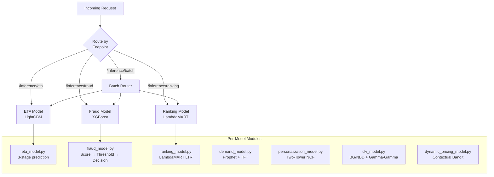

### All Models

| Model | Algorithm | Default Version | Target Metric |
|---|---|---|---|
| **ETA** | LightGBM gradient boosted regression | `eta-lgbm-v1` | ±1.5 min accuracy (from ±5 min baseline) |
| **Fraud** | XGBoost ensemble (80+ features) | `fraud-xgb-v1` | 2% → 0.3% fraud rate |
| **Ranking** | LambdaMART (LightGBM ranker, 30+ features) | `ranking-lambdamart-v1` | +15% search conversion |
| **Demand** | Prophet + Temporal Fusion Transformer | `demand-tft-v1` | 92% accuracy (per store × SKU × hour) |
| **Personalization** | Two-Tower Neural Collaborative Filtering | `pers-ncf-v1` | Homepage, buy-again, FBT surfaces |
| **CLV** | BG/NBD + Gamma-Gamma | `clv-bgnbd-v1` | Platinum/Gold/Silver/Bronze segmentation |
| **Dynamic Pricing** | Contextual Bandit (Thompson Sampling) | `pricing-bandit-v1` | 15-20% revenue improvement |

All models fall back to **rule-based heuristics** when ML artefacts are not loaded, keeping the service fully functional without trained models.

---

## Model Registry & Versioning

```mermaid
graph TD
    REQ[Request<br/>model_version?] --> RESOLVE{Resolve Version}
    RESOLVE -->|"default" / "latest" / null| DV[Default Version<br/>from ModelEntry]
    RESOLVE -->|Specific version| SV[Lookup in<br/>versions dict]
    DV --> MC[ModelConfig<br/>version, bias, weights]
    SV --> MC

    subgraph Registry Sources
        DEFAULTS[DEFAULT_WEIGHTS<br/>hardcoded in main.py]
        FILE[weights.json<br/>file on disk]
    end

    DEFAULTS --> MERGE[Merge: file overrides defaults]
    FILE --> MERGE
    MERGE --> REGISTRY[ModelRegistry]
    REGISTRY --> RESOLVE
```

### Version Resolution

```python
registry.get("eta")               # → default version (eta-linear-v1)
registry.get("eta", "default")    # → default version
registry.get("eta", "latest")     # → default version
registry.get("eta", "eta-v2")     # → specific version (if registered)
```

### A/B Routing

The `model_version` query parameter or request field routes to any registered version. Multiple versions coexist in the registry, enabling A/B testing by directing traffic percentages to different versions upstream.

### Default Weights (Hardcoded)

| Model | Version | Bias | Weights |
|---|---|---|---|
| `eta` | `eta-linear-v1` | 4.5 | distance_km: 2.3, item_count: 0.6, traffic_factor: 3.1 |
| `ranking` | `ranking-linear-v1` | 0.15 | relevance: 0.55, price: 0.2, availability: 0.35, affinity: 0.4 |
| `fraud` | `fraud-logit-v1` | -1.4 | order_amount: 0.012, chargeback: 4.8, device_risk: 2.1, account_age: -0.015 |

---

## Inference Pipeline

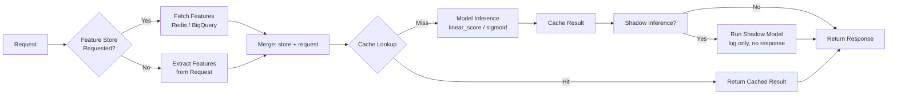

### Cache Key Generation

```python
SHA256(json.dumps({
    "model": model_name,
    "version": model_version,
    "features": features_dict
}, sort_keys=True))
```

Cache is an in-memory **LRU with TTL** (default: 1,000 entries, 300 s TTL). Eviction is oldest-first when capacity is exceeded.

---

## Model Decision Flows

### ETA Model — Three-Stage Prediction

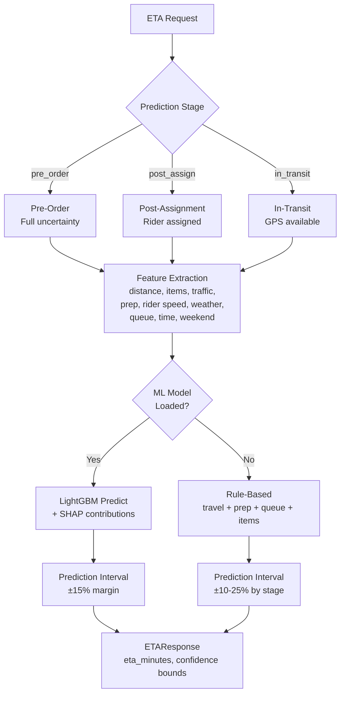

**Rule-based fallback formula:**
```
ETA = (distance_km / rider_speed_kmh × 60 × traffic × weather)
    + store_prep_time × (1.1 if weekend)
    + queue_depth × 2.0 min
    + max(0, items - 1) × 0.5 min
```

### Fraud Model — Score → Threshold → Decision

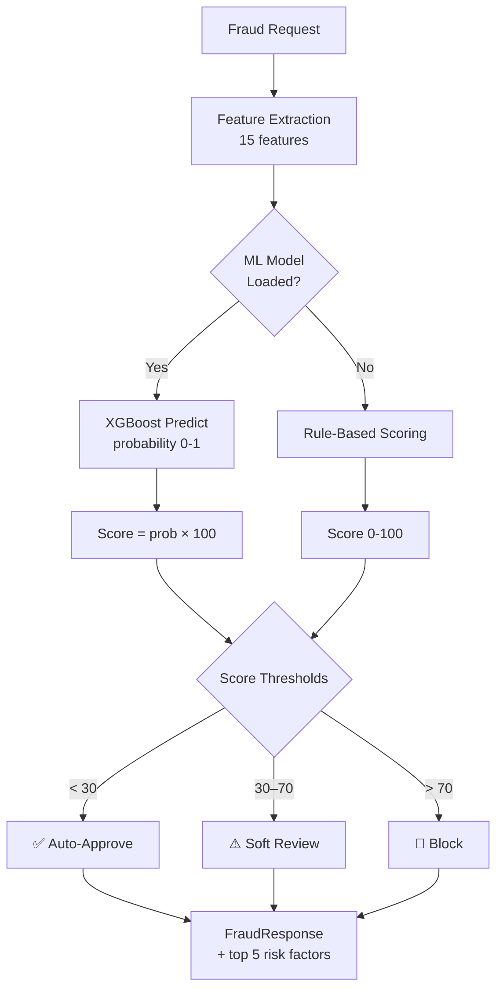

**Rule-based scoring breakdown:**

| Signal Category | Indicators | Max Points |
|---|---|---|
| **Velocity** | Orders/hour ≥ 3 (+20), orders/24h ≥ 8 (+15), new addresses/7d ≥ 3 (+12), payment methods/30d ≥ 3 (+10) | ~57 |
| **Basket Risk** | Amount > $500 (+15), basket/avg ratio > 3x (+10), high resale > 50% (+12) | ~37 |
| **Payment Risk** | Prepaid card (+8), country mismatch (+15) | 23 |
| **Device Risk** | VPN (+10), emulator (+15), new fingerprint (+10) | 35 |
| **Account Trust** | Age > 365d (-10), profile > 80% (-3), chargeback_rate × 40 | Discount |

### Ranking Model — LambdaMART

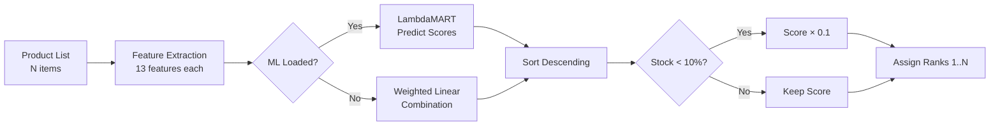

**Heuristic weights:** BM25 (0.25), query-title similarity (0.20), stock (0.10), category affinity (0.10), popularity (0.10), rating (0.08), price competitiveness (0.05), brand affinity (0.05), freshness (0.05), promoted (0.02).

### Demand Model — Forecasting

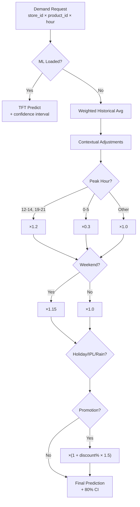

### Personalization Model — Two-Tower NCF

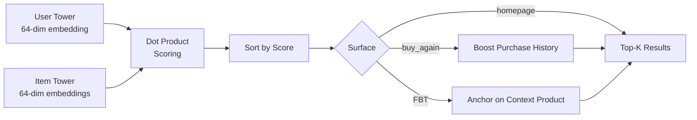

### CLV Model — BG/NBD + Gamma-Gamma

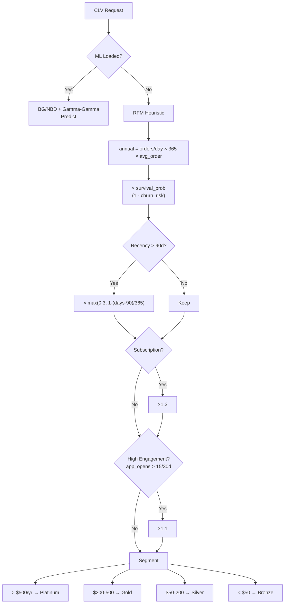

### Dynamic Pricing — Contextual Bandit

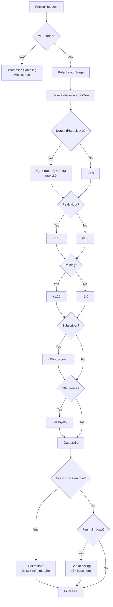

---

## Feature Store Integration

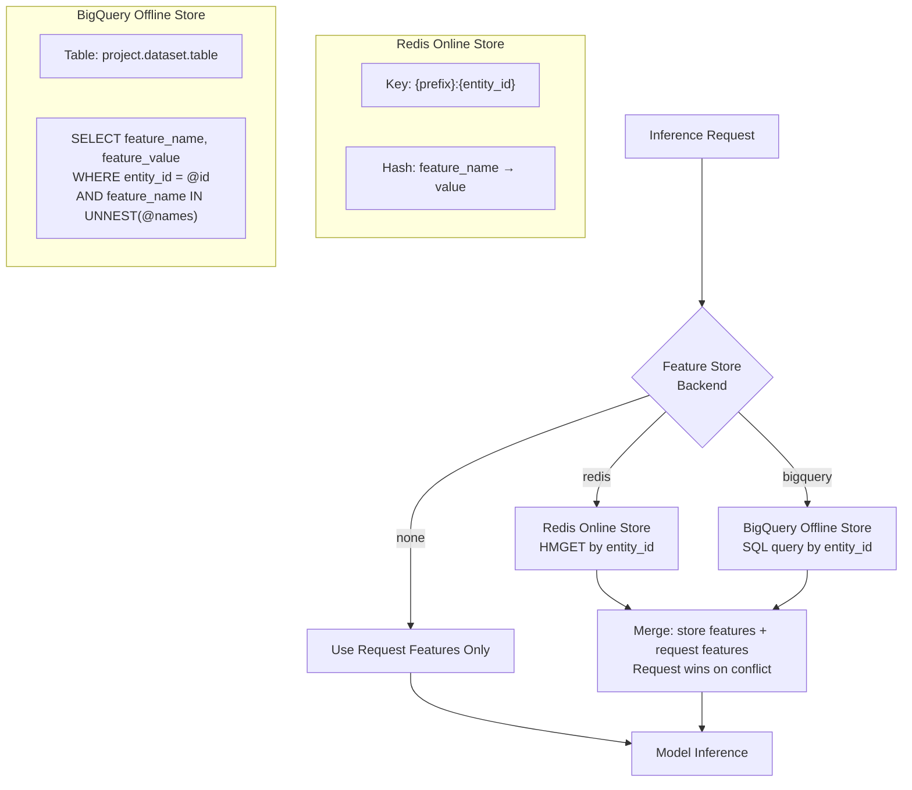

| Backend | Use Case | Latency | Config |
|---|---|---|---|
| **Redis** | Online serving (real-time features) | < 5 ms | `AI_INFERENCE_REDIS_URL`, `AI_INFERENCE_REDIS_PREFIX` |
| **BigQuery** | Offline features, batch enrichment | ~100 ms | `AI_INFERENCE_BIGQUERY_PROJECT`, `_DATASET`, `_TABLE` |
| **None** | Features provided in request payload | 0 ms | Default |

### Health Checks

Each backend exposes status via `/health`:
- **Redis:** pings the server, returns `ok` or `degraded`
- **BigQuery:** returns `configured` (no active health probe)
- **Unavailable:** returns `unavailable` with reason (e.g., `missing_redis_url`, `redis_dependency_missing`)

---

## Shadow Mode

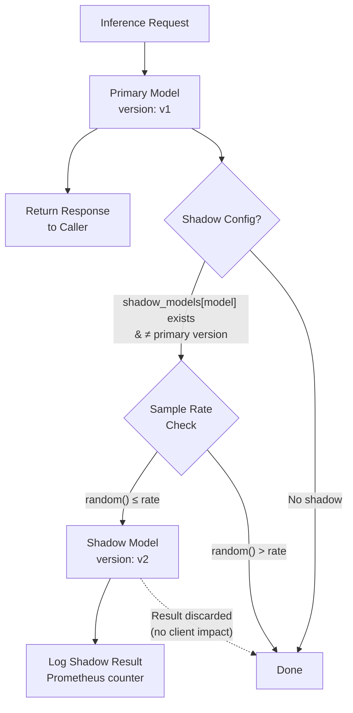

### Configuration

```bash
# Run shadow model "fraud-v2" alongside primary for 50% of fraud requests
AI_INFERENCE_SHADOW_MODELS='{"fraud": "fraud-v2"}'
AI_INFERENCE_SHADOW_SAMPLE_RATE=0.5
```

Shadow inference:
- Runs **after** the primary response is computed
- Results are **never returned** to the caller
- Failures are logged but silently swallowed
- Tracked via `ai_inference_shadow_requests_total` Prometheus counter

---

## API Reference

### Core Endpoints

| Method | Path | Description |
|---|---|---|
| `POST` | `/inference/eta` | ETA prediction |
| `POST` | `/inference/fraud` | Fraud detection |
| `POST` | `/inference/ranking` | Search ranking |
| `POST` | `/inference/batch` | Batch inference (multi-model) |
| `GET` | `/models` | List all registered models and versions |
| `GET` | `/metrics` | Prometheus metrics |
| `GET` | `/health` | Full health (models + feature store) |
| `GET` | `/health/ready` | Readiness probe |
| `GET` | `/health/live` | Liveness probe |

### `POST /inference/eta`

**Request:**

```json
{
  "distance_km": 5.2,
  "item_count": 8,
  "traffic_factor": 1.5,
  "model_version": "eta-linear-v1"
}
```

| Field | Type | Required | Constraints |
|---|---|---|---|
| `distance_km` | float | ✅ | 0–200 |
| `item_count` | int | ✅ | 0–200 |
| `traffic_factor` | float | ✅ | 0.5–3.0 |
| `model_version` | string | | Optional version override |

**Response:**

```json
{
  "eta_minutes": 18.41,
  "feature_contributions": { "distance_km": 11.96, "item_count": 4.8, "traffic_factor": 4.65 },
  "bias": 4.5,
  "model_version": "eta-linear-v1"
}
```

### `POST /inference/fraud`

**Request:**

```json
{
  "order_amount": 250.0,
  "chargeback_rate": 0.02,
  "device_risk": 0.3,
  "account_age_days": 180,
  "model_version": "fraud-logit-v1"
}
```

| Field | Type | Required | Constraints |
|---|---|---|---|
| `order_amount` | float | ✅ | 0–10,000 |
| `chargeback_rate` | float | ✅ | 0–1 |
| `device_risk` | float | ✅ | 0–1 |
| `account_age_days` | int | ✅ | 0–36,500 |
| `model_version` | string | | Optional version override |

**Response:**

```json
{
  "fraud_probability": 0.23,
  "raw_score": -0.98,
  "feature_contributions": { "order_amount": 3.0, "chargeback_rate": 0.096, "device_risk": 0.63, "account_age_days": -2.7 },
  "bias": -1.4,
  "model_version": "fraud-logit-v1"
}
```

### `POST /inference/ranking`

**Request:**

```json
{
  "relevance_score": 0.8,
  "price_score": 0.6,
  "availability_score": 1.0,
  "user_affinity": 0.7,
  "model_version": "ranking-linear-v1"
}
```

**Response:**

```json
{
  "ranking_score": 0.73,
  "raw_score": 0.99,
  "feature_contributions": { "relevance_score": 0.44, "price_score": 0.12, "availability_score": 0.35, "user_affinity": 0.28 },
  "bias": 0.15,
  "model_version": "ranking-linear-v1"
}
```

### `POST /inference/batch`

**Request:**

```json
{
  "items": [
    {
      "model_name": "eta",
      "payload": { "distance_km": 3.0, "item_count": 5, "traffic_factor": 1.2 }
    },
    {
      "model_name": "fraud",
      "payload": { "order_amount": 100.0, "chargeback_rate": 0.0, "device_risk": 0.1, "account_age_days": 365 },
      "entity_id": "user-123",
      "use_feature_store": true
    }
  ]
}
```

| Field | Type | Required | Description |
|---|---|---|---|
| `items[].model_name` | `"eta"` \| `"ranking"` \| `"fraud"` | ✅ | Model to invoke |
| `items[].payload` | object | ✅ | Model-specific features |
| `items[].model_version` | string | | Version override |
| `items[].entity_id` | string | | Entity ID for feature store lookup |
| `items[].use_feature_store` | bool | | Fetch features from store (requires `entity_id`) |

**Response:**

```json
{
  "results": [
    { "model_name": "eta", "model_version": "eta-linear-v1", "output": { "eta_minutes": 12.9, "..." : "..." } },
    { "model_name": "fraud", "model_version": "fraud-logit-v1", "output": { "fraud_probability": 0.05, "..." : "..." } }
  ]
}
```

### Per-Model Module Endpoints (Extended Models)

The `app/models/` modules define richer schemas for production use. These can be wired into FastAPI routes:

| Model | Request Schema | Response Schema | Key Output Fields |
|---|---|---|---|
| **ETA** | `ETAFeatures` (9 features + stage) | `ETAResponse` | `eta_minutes`, `confidence_lower/upper`, `stage`, `method` |
| **Fraud** | `FraudFeatures` (15 features) | `FraudResponse` | `fraud_score` (0-100), `decision` (auto_approve/soft_review/block), `top_risk_factors` |
| **Ranking** | `List[RankingFeatures]` (13 features each) | `RankingResponse` | `ranked_items` [{product_id, score, rank}] |
| **Demand** | `DemandFeatures` (14 features) | `DemandResponse` | `predicted_units`, `confidence_lower/upper`, `store_id`, `product_id`, `hour` |
| **Personalization** | `PersonalizationFeatures` (embeddings + context) | `PersonalizationResponse` | `recommendations` [{product_id, score, rank}], `surface` |
| **CLV** | `CLVFeatures` (14 RFM/engagement features) | `CLVResponse` | `predicted_annual_value_cents`, `segment` (platinum/gold/silver/bronze), `survival_probability_12m` |
| **Dynamic Pricing** | `PricingFeatures` (15 features) | `PricingResponse` | `delivery_fee_cents`, `discount_applied_cents`, `surge_applied`, `guardrail_hit` |

---

## Project Structure

```
app/
├── main.py                        # FastAPI app, model registry, inference cache, feature store,
│                                  # batch endpoint, Prometheus metrics, ETA/fraud/ranking endpoints
├── __init__.py
├── models/
│   ├── eta_model.py               # LightGBM 3-stage ETA (pre-order, post-assign, in-transit)
│   ├── fraud_model.py             # XGBoost fraud detection (score 0-100, 3 decisions)
│   ├── ranking_model.py           # LambdaMART search ranking (batch product scoring)
│   ├── demand_model.py            # Prophet + TFT demand forecasting (store × SKU × hour)
│   ├── personalization_model.py   # Two-Tower NCF recommendations (3 surfaces)
│   ├── clv_model.py               # BG/NBD + Gamma-Gamma CLV (4 segments)
│   ├── dynamic_pricing_model.py   # Contextual Bandit delivery fee optimization
│   └── __init__.py
├── Dockerfile
└── requirements.txt
```

---

## Configuration

All settings use the `AI_INFERENCE_` env prefix.

| Variable | Default | Description |
|---|---|---|
| `AI_INFERENCE_LOG_LEVEL` | `INFO` | Log level |
| `AI_INFERENCE_CACHE_ENABLED` | `true` | Enable inference cache |
| `AI_INFERENCE_CACHE_TTL_SECONDS` | `300` | Cache TTL |
| `AI_INFERENCE_CACHE_MAX_ITEMS` | `1000` | Max cached entries (LRU) |
| `AI_INFERENCE_SHADOW_MODELS` | `{}` | JSON map: `{"model": "shadow_version"}` |
| `AI_INFERENCE_SHADOW_SAMPLE_RATE` | `1.0` | Fraction of requests to shadow (0.0–1.0) |
| `AI_INFERENCE_FEATURE_STORE_BACKEND` | `none` | `none` / `redis` / `bigquery` |
| `AI_INFERENCE_REDIS_URL` | — | Redis connection URL |
| `AI_INFERENCE_REDIS_PREFIX` | `features` | Redis key prefix |
| `AI_INFERENCE_BIGQUERY_PROJECT` | — | GCP project ID |
| `AI_INFERENCE_BIGQUERY_DATASET` | — | BigQuery dataset |
| `AI_INFERENCE_BIGQUERY_TABLE` | — | BigQuery table |
| `AI_INFERENCE_WEIGHTS_PATH` | `app/weights.json` | Path to model weights JSON |

---

## Prometheus Metrics

| Metric | Type | Labels | Description |
|---|---|---|---|
| `ai_inference_requests_total` | Counter | endpoint, model, version, status | Total inference requests |
| `ai_inference_request_latency_seconds` | Histogram | endpoint, model, version | Request latency |
| `ai_inference_cache_events_total` | Counter | model, version, result (hit/miss) | Cache hit/miss events |
| `ai_inference_shadow_requests_total` | Counter | model, version | Shadow inference count |
| `ai_inference_feature_store_latency_seconds` | Histogram | backend | Feature store latency |
| `ai_inference_feature_store_errors_total` | Counter | backend | Feature store errors |
| `ml_eta_predictions_total` | Counter | stage, model_version, method | ETA predictions |
| `ml_fraud_predictions_total` | Counter | decision, model_version, method | Fraud predictions |
| `ml_fraud_score` | Histogram | — | Fraud score distribution (0-100) |
| `ml_ranking_predictions_total` | Counter | model_version, method | Ranking predictions |
| `ml_ranking_batch_size` | Histogram | — | Items per ranking request |
| `ml_demand_predictions_total` | Counter | model_version, method | Demand predictions |
| `ml_personalization_predictions_total` | Counter | surface, model_version, method | Personalization predictions |
| `ml_clv_predictions_total` | Counter | segment, model_version, method | CLV predictions |
| `ml_pricing_predictions_total` | Counter | model_version, method | Dynamic pricing predictions |

---

## Running Locally

```bash
cd services/ai-inference-service
pip install -r requirements.txt
uvicorn app.main:app --host 0.0.0.0 --port 8000 --reload
```

Models start in **rule-based fallback mode** by default. To load ML artefacts, configure the model paths in the individual model constructors or via the weights registry (`weights.json`).
