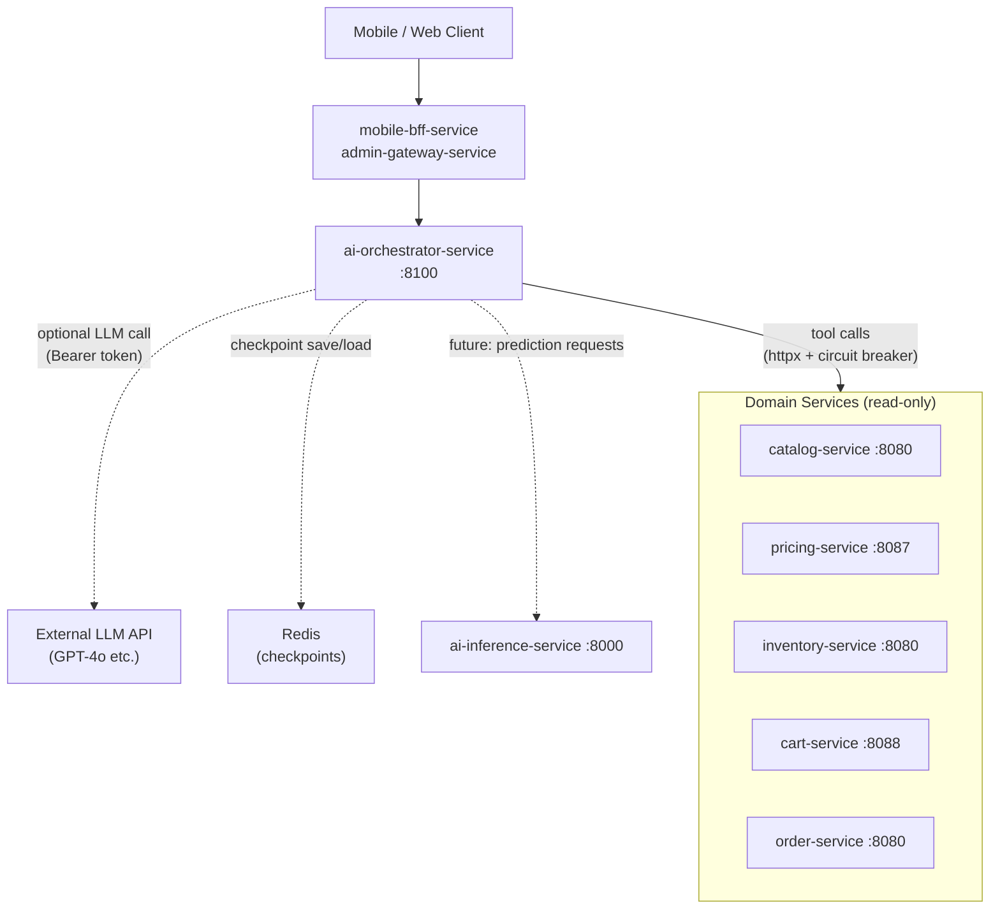
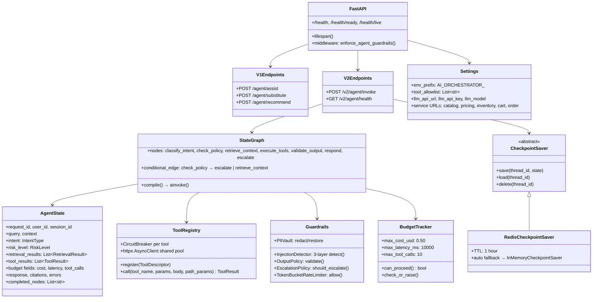
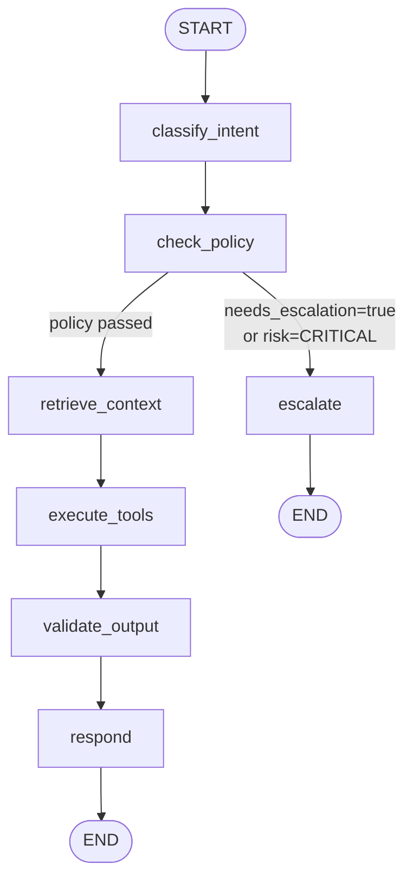
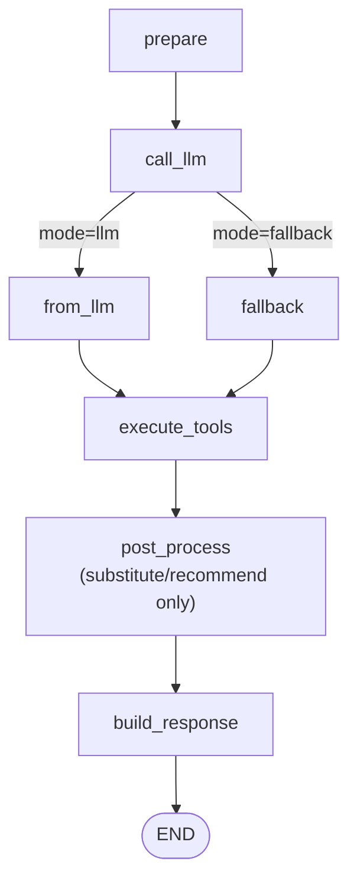
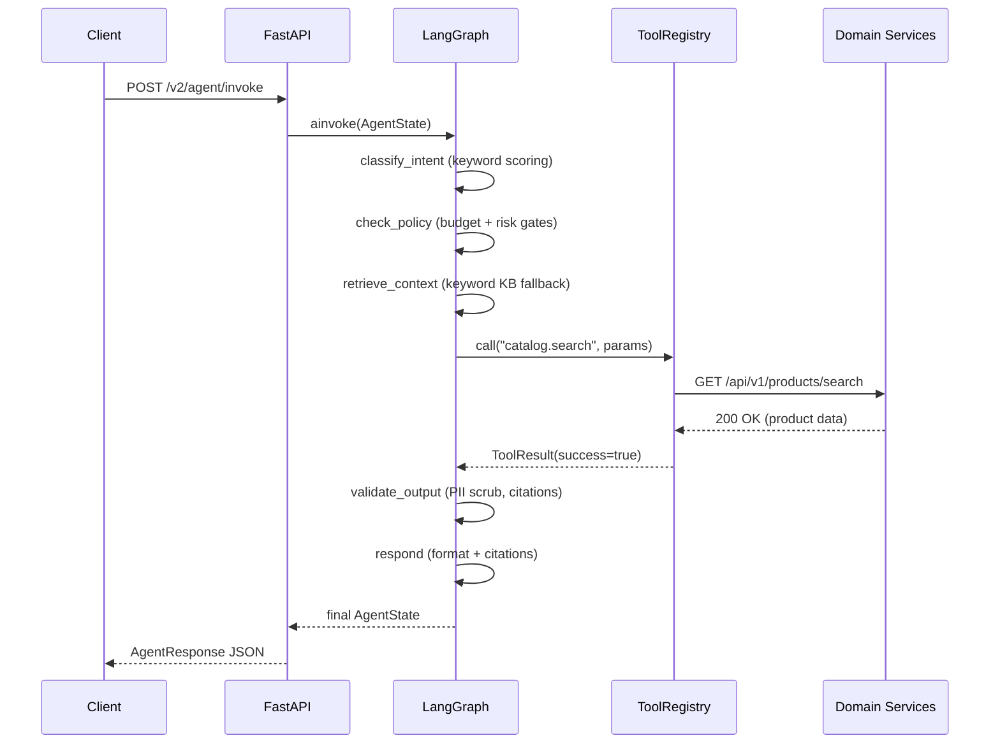
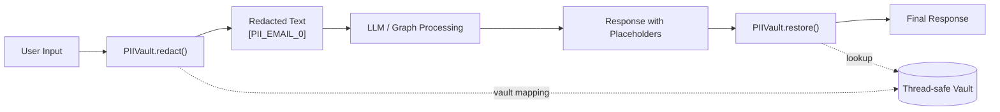

# AI Orchestrator Service

**Python / FastAPI / LangGraph** — Agentic orchestration layer for InstaCommerce q-commerce AI workflows.

| Attribute | Value |
|---|---|
| **Port** | `8100` (`SERVER_PORT` env) |
| **Framework** | FastAPI 0.115 + LangGraph 0.2 + LangChain-Core 1.2 |
| **LLM** | Configurable via `AI_ORCHESTRATOR_LLM_*` (GPT-4o / GPT-4o-mini / GPT-4-turbo / GPT-3.5-turbo); deterministic fallback when unconfigured |
| **State Persistence** | Redis checkpoint saver with automatic in-memory fallback (`checkpoints.py`) |
| **Observability** | OpenTelemetry OTLP traces (FastAPI + httpx auto-instrumentation) + structured JSON logging with PII redaction |
| **Runtime** | `uvicorn` ASGI, non-root container (`python:3.14-slim`), `HEALTHCHECK` on `/health` |

> **Operating-model classification:** This service currently operates as a **read-only copilot / propose-only agent** — it may retrieve, classify, summarize, and recommend, but it does **not** autonomously commit writes on money, inventory, dispatch, or account paths. All eight registered tools are read-only. See [Security & Trust Boundaries](#security--trust-boundaries) and the [iter-3 governance review](../../docs/reviews/iter3/platform/ai-agent-governance.md) for the rationale.

---

## Table of Contents

- [Service Role and Boundaries](#service-role-and-boundaries)
- [High-Level Design](#high-level-design)
- [Low-Level Design](#low-level-design)
- [Orchestration Path — LangGraph State Machine](#orchestration-path--langgraph-state-machine)
- [Agent Types and Intent Routing](#agent-types-and-intent-routing)
- [RAG Pipeline](#rag-pipeline)
- [Guardrails Architecture](#guardrails-architecture)
- [Tool Registry and Resilience](#tool-registry-and-resilience)
- [Budget Enforcement](#budget-enforcement)
- [API Reference](#api-reference)
- [Project Structure](#project-structure)
- [Runtime and Configuration](#runtime-and-configuration)
- [Dependencies](#dependencies)
- [Observability](#observability)
- [Testing](#testing)
- [Failure Modes and Recovery](#failure-modes-and-recovery)
- [Rollout and Rollback](#rollout-and-rollback)
- [Security and Trust Boundaries](#security-and-trust-boundaries)
- [Human-in-the-Loop and Governance](#human-in-the-loop-and-governance)
- [Known Limitations](#known-limitations)
- [Q-Commerce AI Pattern Comparison](#q-commerce-ai-pattern-comparison)

---

## Service Role and Boundaries

The AI orchestrator is the **agentic coordination layer** between InstaCommerce's customer-facing BFF surfaces (`mobile-bff-service`, `admin-gateway-service`) and the transactional domain services (catalog, pricing, inventory, cart, order). It receives a natural-language query, classifies intent, enforces policy and budget gates, retrieves context via RAG, executes read-only tools against downstream Java services with circuit breakers, validates the output (PII redaction, content safety, business-rule checks), and returns a cited response — or escalates to a human agent.

**What this service owns:**
- Intent classification (deterministic keyword scorer; LLM-backed path when `llm_api_url` is configured)
- Policy gating (cost, latency, tool-call budgets; risk-level enforcement)
- RAG context retrieval (keyword fallback today; pluggable `RetrievalProvider` / `CachedRetrievalProvider` interface for vector stores)
- Tool orchestration with per-tool circuit breakers, retry, timeout, and allowlist
- Guardrails: PII vault, prompt-injection detection, output validation, escalation policy, rate limiting
- Conversation checkpointing (Redis with in-memory fallback)

**What this service does NOT own:**
- Transactional writes — no tool in the registry performs mutations; the eight registered tools are all reads
- Model training or inference — that responsibility sits in `ai-inference-service` and `ml/`
- Feature store reads — the orchestrator does not directly access the feature store
- Authentication — inbound auth is not enforced by this service (see [Known Limitations](#known-limitations))

---

## High-Level Design

The orchestrator sits behind the Istio ingress and BFF layer. It fans out read-only HTTP calls to domain services and optionally calls an external LLM API.



---

## Low-Level Design

### Component Diagram



### Key design decisions

| Decision | Rationale |
|---|---|
| Pydantic `AgentState` threaded through every node | Type-safe state; each node touches only its slice and returns `model_copy(update=...)` |
| Deterministic keyword classifier as default | Zero external dependency; LLM classifier activates only when `llm_api_url` is configured |
| `tool_allowlist` as a `List[str]` in `Settings` | Configurable at deploy time via env; no code change to extend — but also no secondary enforcement layer (see [Known Limitations](#known-limitations)) |
| v1 endpoints in `main.py`, v2 in `api/handlers.py` | Parallel running: v1 uses an in-file `StateGraph` impl with three purpose-built graphs (assist, substitute, recommend); v2 uses the LangGraph library with a single unified graph |
| All nodes catch exceptions internally | Graph always reaches `respond` or `escalate` — never propagates raw exceptions to the caller |
| Redis checkpoint with in-memory fallback | Graceful degradation: if Redis is unreachable, the service continues with pod-local state |

---

## Orchestration Path — LangGraph State Machine

### v2 Graph Topology (`app/graph/graph.py`)

Every `/v2/agent/invoke` request traverses the compiled LangGraph state machine. Conditional routing after `check_policy` inspects `needs_escalation` and `risk_level` to decide whether the request should be processed autonomously or handed to a human agent.



### v1 Graph Topology (`app/main.py`)

The v1 surface uses three separate `StateGraph` instances (assist, substitute, recommend), each with an LLM-or-fallback branch:



### Sequence Diagram — `/v2/agent/invoke` Happy Path



### `AgentState` — Typed State Object (`app/graph/state.py`)

| Group | Fields | Notes |
|---|---|---|
| **Identity** | `request_id` (UUID auto), `user_id`, `session_id`, `created_at` | |
| **Input** | `query`, `context: Dict` | |
| **Classification** | `intent: IntentType`, `intent_confidence: float`, `risk_level: RiskLevel` | Enum: substitute / support / recommend / search / order_status / unknown |
| **Retrieval** | `retrieval_results: List[RetrievalResult]` | Each has `doc_id`, `content`, `score`, `metadata` |
| **Tool Execution** | `tool_results: List[ToolResult]`, `tool_calls_remaining` (default 10) | |
| **Budget** | `total_tokens_used`, `total_cost_usd`, `max_cost_usd` ($0.50), `max_latency_ms` (10 s), `elapsed_ms` | |
| **Output** | `response`, `response_citations`, `needs_escalation`, `escalation_reason` | |
| **Errors** | `errors: List[str]` | Accumulated per-node; never raised |
| **Graph Metadata** | `current_node`, `completed_nodes` | Audit trail of execution path |
| **Conversation** | `conversation_history: List[Dict]` | |

---

## Agent Types and Intent Routing

Intent is classified by deterministic keyword matching (`app/graph/nodes.py: classify_intent`). Each intent maps to a tool-execution plan via `_plan_tools()`:

| Intent | Tools Called | Risk Level | Escalation |
|---|---|---|---|
| `substitute` | `catalog.search` → `inventory.check` | Medium | — |
| `support` | `order.get` (if `order_id` in context) | Medium | — |
| `recommend` | `catalog.list_products` (sort=popularity) | Low | — |
| `search` | `catalog.search` | Low | — |
| `order_status` | `order.get` (path param) | Low | — |
| `unknown` | None | High | Auto-escalate if confidence < 0.1 |

---

## RAG Pipeline

### Current Implementation

The `retrieve_context` node (`app/graph/nodes.py`) provides a **keyword-based fallback** retrieval with a hardcoded knowledge base. This is functional without any external dependency.

| Topic Keyword | Doc ID | Content Summary |
|---|---|---|
| `return` | `policy-returns-001` | Returns accepted within 7 days; items must be unopened |
| `delivery` | `faq-delivery-001` | Standard delivery 10-30 min; express available for select areas |
| `substitute` | `policy-substitution-001` | Substitutions offered when OOS; customers can pre-approve |
| *(fallback)* | `faq-general-001` | Generic prompt for order number or issue description |

Each `RetrievalResult` carries `doc_id`, `content`, `score`, and `metadata`. Citations are auto-generated from `doc_id` values in the `validate_output` and `respond` nodes.

### Production Extension Path

Implement the `RetrievalProvider` interface (defined in `main.py`) and wrap it with `CachedRetrievalProvider` (SHA-256 key, LRU eviction, configurable TTL via `rag_cache_ttl_seconds` / `rag_cache_max_entries`). No graph changes are required — the provider is injected at startup.

---

## Guardrails Architecture

Five guardrail modules live under `app/guardrails/`:

### 1. PII Vault (`pii.py`) — Redact → LLM → Restore



| PII Type | Placeholder | Pattern Example |
|---|---|---|
| Email | `[PII_EMAIL_N]` | `user@example.com` |
| SSN | `[PII_SSN_N]` | `123-45-6789` |
| Credit Card | `[PII_CARD_N]` | 13–16 digit sequences |
| Phone | `[PII_PHONE_N]` | US phone formats |
| Address | `[PII_ADDRESS_N]` | Street addresses (St, Ave, Blvd, Dr, Rd, Ln, Ct) |

Thread-safe via `threading.Lock`. Supports recursive dict/list redaction (`redact_value()`). HMAC-SHA256 provenance tagging via `PII_VAULT_SECRET` env.

### 2. Prompt Injection Detection (`injection.py`)

Three-layer detection pipeline:

| Layer | Technique | Confidence | Detail |
|---|---|---|---|
| 1 — Pattern | Regex against 14 known injection signatures | 0.9 | `ignore previous instructions`, `jailbreak`, `DAN mode`, `bypass restrictions`, `reveal system prompt`, etc. |
| 2 — Entropy | Shannon entropy > 4.5 on text ≥ 20 chars | 0.6 | Flags obfuscated payloads (base64 blobs, encoded instructions) |
| 3 — Role Boundary | 8 patterns detecting system/assistant/user role markers | 0.85 | `system:`, `assistant:`, `[INST]`, `<\|system\|>`, `### System:` |

> **⚠ Known gap:** The detector catches `Exception` at the top level and returns `(False, 0.0, "detection_error")` — it **fails open**. A detector bug allows the request through. This is flagged in the [iter-3 governance review](../../docs/reviews/iter3/platform/ai-agent-governance.md) as a P0 fix.

### 3. Output Validation (`output_validator.py`)

`OutputPolicy.validate()` enforces:

| Check | Detail |
|---|---|
| **Schema** | Required fields per intent (e.g., `refund` → `amount_cents`, `reason`) |
| **Business Rules** | Refund cap: $500 (50,000 cents, `OUTPUT_MAX_REFUND_CENTS`). Discount cap: 30% (`OUTPUT_MAX_DISCOUNT_PERCENT`) |
| **Content Safety** | Blocks phrases: `"as an ai"`, `"i cannot"`, `"i'm just a language model"`, etc. Sanitizes blocked phrases to `[REDACTED]` |
| **Citation Validation** | Warns when output references UUIDs not found in tool results |

### 4. Escalation Policy (`escalation.py`)

Six configurable triggers evaluated in order; first match fires:

| Trigger | Condition | Env Override |
|---|---|---|
| `high_value_refund` | Any tool result contains `amount_cents` > 50,000 | `ESCALATION_HIGH_VALUE_CENTS` |
| `low_confidence` | `intent_confidence` < 0.5 | `ESCALATION_LOW_CONFIDENCE` |
| `user_requested` | Query contains: `"speak to human"`, `"talk to agent"`, `"real person"`, `"live agent"`, `"transfer me"`, etc. | — |
| `repeated_failure` | `len(errors)` ≥ 3 | `ESCALATION_MAX_ERRORS` |
| `safety_concern` | `risk_level == "critical"` | — |
| `payment_dispute` | `intent == "support"` and `"chargeback"` in query | — |

Custom triggers can be added at runtime via `EscalationPolicy.add_trigger(name, fn)`.

### 5. Rate Limiting (`rate_limiter.py`)

Token-bucket algorithm, per-user, thread-safe:

| Parameter | Default | Env Override |
|---|---|---|
| Sustained rate | 10 req/min | `RATE_LIMIT_PER_MINUTE` |
| Burst | 15 tokens | `RATE_LIMIT_BURST` |
| Stale bucket pruning | Every 5 min, 1-hour staleness | `RATE_LIMIT_PRUNE_INTERVAL`, `RATE_LIMIT_STALE_SECONDS` |

In the FastAPI middleware (`main.py: enforce_agent_guardrails`), the `/agent/*` path gets **two-tier rate limiting** (per-IP and per-user) plus a concurrency semaphore (`agent_max_inflight_requests`, default 200) with 503 backpressure.

---

## Tool Registry and Resilience

Each tool in `app/graph/tools.py` wraps an `httpx.AsyncClient` call to a downstream Java service. The `ToolRegistry` class manages registration, allowlist enforcement, circuit breakers, retries, and timeouts.

| Feature | Config | Source |
|---|---|---|
| **Circuit Breaker** | 3-state (closed → open → half-open). Opens after 3 consecutive failures, resets after 30 s | `tool_circuit_breaker_failures`, `tool_circuit_breaker_reset_seconds` |
| **Retry** | Exponential backoff, max 2 retries. Backoff: `min(0.5 × 2^(attempt-1), 4.0)` s. 4xx = no retry | `ToolDescriptor.max_retries` |
| **Per-tool Timeout** | 2.5 s | `tool_call_timeout_seconds` |
| **Total Timeout** | 6.0 s across all tool calls in one request | `tool_total_timeout_seconds` |
| **Max Tool Calls** | 8 per request | `tool_call_max` |
| **Idempotency** | `X-Idempotency-Key` header auto-attached to `is_write=True` tools | ToolDescriptor flag |
| **Allowlist** | Only tools in `tool_allowlist` can be invoked; unknown/disallowed tools return error immediately | `tool_allowlist` |
| **Auth** | `Authorization: Bearer <token>` header on all calls when `internal_service_token` is set | `internal_service_token` |
| **Connection Pool** | Shared `httpx.AsyncClient`, 50 max connections, 10 keepalive | `ToolRegistry.start()` |

### Tool → Service Mapping (from `tools.py: _register_defaults`)

| Tool | Service | Method | Path |
|---|---|---|---|
| `catalog.search` | catalog-service `:8080` | GET | `/api/v1/products/search` |
| `catalog.get_product` | catalog-service `:8080` | GET | `/api/v1/products/{product_id}` |
| `catalog.list_products` | catalog-service `:8080` | GET | `/api/v1/products` |
| `pricing.calculate` | pricing-service `:8087` | POST | `/api/v1/pricing/calculate` |
| `pricing.get_product` | pricing-service `:8087` | GET | `/api/v1/pricing/products/{product_id}` |
| `inventory.check` | inventory-service `:8080` | GET | `/api/v1/inventory/{product_id}` |
| `cart.get` | cart-service `:8088` | GET | `/api/v1/carts/{user_id}` |
| `order.get` | order-service `:8080` | GET | `/api/v1/orders/{order_id}` |

> All eight tools are **read-only**. No write tools (order creation, refund initiation, payment modification) are registered. The `tool_allowlist` is the sole enforcement layer — it is a `List[str]` loaded from the environment, so a misconfigured deployment could extend it without a code change.

---

## Budget Enforcement

`BudgetTracker` (`app/graph/budgets.py`) enforces per-request ceilings. All checks are **fail-closed** — missing data is treated as budget exhausted.

| Budget | Default | Description |
|---|---|---|
| **Cost** | $0.50 hard cap | Per-model USD pricing tracked per LLM call via `token_cost()` |
| **Latency** | 10,000 ms | Wall-clock ceiling; early termination via `is_latency_exceeded()` |
| **Tool Calls** | 10 max | Hard cap; decremented in `execute_tools` node |
| **Tokens** | Unlimited (0) | Optional; set `max_tokens` > 0 to activate |

### Per-Model Token Pricing (USD / 1,000 tokens)

| Model | Input | Output |
|---|---|---|
| `gpt-4o` | $0.005 | $0.015 |
| `gpt-4o-mini` | $0.00015 | $0.0006 |
| `gpt-4-turbo` | $0.01 | $0.03 |
| `gpt-3.5-turbo` | $0.0005 | $0.0015 |
| Default (fallback) | $0.01 | $0.03 |

The client-facing `max_cost_usd` field in `AgentRequest` is clamped to 0.50 at the handler level regardless of caller input.

---

## API Reference

### v2 Endpoints (LangGraph — `app/api/handlers.py`)

| Method | Path | Description |
|---|---|---|
| `POST` | `/v2/agent/invoke` | Invoke the unified LangGraph agent |
| `GET` | `/v2/agent/health` | Health check for the v2 subsystem |

#### `POST /v2/agent/invoke`

**Request:**

```json
{
  "query": "Can you find a substitute for organic milk?",
  "user_id": "user-123",
  "session_id": "sess-abc",
  "context": { "order_id": "ord-456" },
  "conversation_history": [],
  "max_cost_usd": 0.50,
  "max_latency_ms": 10000.0
}
```

| Field | Type | Required | Constraints |
|---|---|---|---|
| `query` | string | ✅ | 1–4,000 chars |
| `user_id` | string | ✅ | 1–256 chars |
| `session_id` | string | | Optional session identifier |
| `context` | object | | Arbitrary context (e.g., `order_id`) |
| `conversation_history` | array | | Previous conversation messages |
| `max_cost_usd` | float | | 0.0–0.50 (hard cap enforced server-side) |
| `max_latency_ms` | float | | 0.0–30,000 |

**Response:**

```json
{
  "request_id": "550e8400-e29b-41d4-a716-446655440000",
  "response": "Based on available information: ...",
  "intent": "substitute",
  "intent_confidence": 0.75,
  "risk_level": "medium",
  "citations": ["policy-substitution-001"],
  "escalated": false,
  "escalation_reason": null,
  "tool_results_summary": [
    { "tool": "catalog.search", "success": true, "latency_ms": 45.2 }
  ],
  "total_tokens_used": 0,
  "total_cost_usd": 0.0,
  "elapsed_ms": 123.4,
  "errors": []
}
```

### v1 Endpoints (Legacy — `app/main.py`)

| Method | Path | Description |
|---|---|---|
| `POST` | `/agent/assist` | General-purpose assistant (StateGraph: prepare → llm/fallback → tools → response) |
| `POST` | `/agent/substitute` | Product substitution (includes post-processing for inventory availability) |
| `POST` | `/agent/recommend` | Product recommendation (seed + catalog backfill) |

### Health Endpoints

| Method | Path | Description |
|---|---|---|
| `GET` | `/health` | Basic health |
| `GET` | `/health/ready` | Readiness probe |
| `GET` | `/health/live` | Liveness probe |

---

## Project Structure

```
services/ai-orchestrator-service/
├── Dockerfile                     # python:3.14-slim, non-root, HEALTHCHECK on /health
├── requirements.txt               # FastAPI, httpx, pydantic-settings, LangGraph, LangChain, OTEL
├── app/
│   ├── main.py                    # v1 endpoints, in-file StateGraph, ToolClients, LlmClient,
│   │                              #   lifespan, middleware, telemetry init (~1400 lines)
│   ├── config.py                  # Settings (pydantic-settings, env prefix: AI_ORCHESTRATOR_)
│   ├── __init__.py
│   ├── api/
│   │   ├── handlers.py            # v2 FastAPI router (/v2/agent/invoke, /v2/agent/health)
│   │   └── __init__.py
│   ├── graph/
│   │   ├── state.py               # AgentState, IntentType, RiskLevel, ToolResult, RetrievalResult
│   │   ├── nodes.py               # 7 node impls: classify, policy, retrieve, execute, validate, respond, escalate
│   │   ├── graph.py               # LangGraph StateGraph builder (build_graph → compiled graph)
│   │   ├── tools.py               # ToolRegistry, ToolDescriptor, CircuitBreaker, httpx.AsyncClient
│   │   ├── checkpoints.py         # CheckpointSaver (abstract), RedisCheckpointSaver, InMemoryCheckpointSaver
│   │   ├── budgets.py             # BudgetTracker, token_cost(), BudgetExceededError
│   │   └── __init__.py
│   └── guardrails/
│       ├── pii.py                 # PIIVault — reversible redaction with HMAC provenance
│       ├── injection.py           # InjectionDetector — 3-layer prompt injection detection
│       ├── output_validator.py    # OutputPolicy — schema, business rules, content safety, citations
│       ├── escalation.py          # EscalationPolicy — configurable rule engine (6 triggers)
│       ├── rate_limiter.py        # TokenBucketRateLimiter — per-user token bucket
│       └── __init__.py
```

---

## Runtime and Configuration

### Running Locally

```bash
cd services/ai-orchestrator-service
pip install -r requirements.txt
uvicorn app.main:app --host 0.0.0.0 --port 8100 --reload
```

### Docker

```bash
docker build -t ai-orchestrator-service .
docker run -p 8100:8100 ai-orchestrator-service
```

The container runs as a non-root `app` user. The `HEALTHCHECK` instruction pings `/health` every 30 s.

### Environment Variables

All `Settings` fields use the `AI_ORCHESTRATOR_` env prefix (case-insensitive via `pydantic-settings`).

**Core:**

| Variable | Default | Description |
|---|---|---|
| `AI_ORCHESTRATOR_SERVER_PORT` | `8100` | Server port |
| `AI_ORCHESTRATOR_LOG_LEVEL` | `INFO` | Log level |
| `AI_ORCHESTRATOR_REQUEST_TIMEOUT_SECONDS` | `3.0` | Per-request timeout for httpx clients in v1 path |

**Rate Limiting and Backpressure (v1 `/agent/*` middleware):**

| Variable | Default | Description |
|---|---|---|
| `AI_ORCHESTRATOR_AGENT_IP_RATE_LIMIT_PER_MINUTE` | `120` | Sustained per-IP rate |
| `AI_ORCHESTRATOR_AGENT_IP_RATE_LIMIT_BURST` | `180` | Burst bucket size per IP |
| `AI_ORCHESTRATOR_AGENT_USER_RATE_LIMIT_PER_MINUTE` | `30` | Sustained per-user rate |
| `AI_ORCHESTRATOR_AGENT_USER_RATE_LIMIT_BURST` | `45` | Burst bucket size per user |
| `AI_ORCHESTRATOR_AGENT_MAX_INFLIGHT_REQUESTS` | `200` | Concurrency semaphore; returns 503 when saturated |
| `AI_ORCHESTRATOR_AGENT_QUEUE_ACQUIRE_TIMEOUT_MS` | `150` | Semaphore acquire timeout |
| `AI_ORCHESTRATOR_AGENT_TRUST_FORWARDED_FOR` | `true` | Trust first `X-Forwarded-For` for IP identity |

**Tool Execution:**

| Variable | Default | Description |
|---|---|---|
| `AI_ORCHESTRATOR_TOOL_CALL_TIMEOUT_SECONDS` | `2.5` | Per-tool timeout |
| `AI_ORCHESTRATOR_TOOL_TOTAL_TIMEOUT_SECONDS` | `6.0` | Total tool budget per request |
| `AI_ORCHESTRATOR_TOOL_CALL_MAX` | `8` | Max tool calls per request |
| `AI_ORCHESTRATOR_TOOL_CIRCUIT_BREAKER_FAILURES` | `3` | Failures before circuit opens |
| `AI_ORCHESTRATOR_TOOL_CIRCUIT_BREAKER_RESET_SECONDS` | `30.0` | Circuit reset timeout |

**LLM and RAG:**

| Variable | Default | Description |
|---|---|---|
| `AI_ORCHESTRATOR_LLM_API_URL` | — | External LLM API endpoint (omit for deterministic-only mode) |
| `AI_ORCHESTRATOR_LLM_API_KEY` | — | Bearer token for LLM API |
| `AI_ORCHESTRATOR_LLM_MODEL` | — | Model name (e.g., `gpt-4o`) |
| `AI_ORCHESTRATOR_PII_REDACTION_ENABLED` | `true` | PII redaction in logs |
| `AI_ORCHESTRATOR_RAG_CACHE_TTL_SECONDS` | `300.0` | RAG cache TTL |
| `AI_ORCHESTRATOR_RAG_CACHE_MAX_ENTRIES` | `256` | RAG cache max entries |
| `AI_ORCHESTRATOR_RAG_MAX_RESULTS` | `5` | Max RAG results per query |

**Downstream Service URLs:**

| Variable | Default |
|---|---|
| `AI_ORCHESTRATOR_CATALOG_SERVICE_URL` | `http://catalog-service:8080` |
| `AI_ORCHESTRATOR_PRICING_SERVICE_URL` | `http://pricing-service:8087` |
| `AI_ORCHESTRATOR_INVENTORY_SERVICE_URL` | `http://inventory-service:8080` |
| `AI_ORCHESTRATOR_CART_SERVICE_URL` | `http://cart-service:8088` |
| `AI_ORCHESTRATOR_ORDER_SERVICE_URL` | `http://order-service:8080` |
| `AI_ORCHESTRATOR_INTERNAL_SERVICE_TOKEN` | — (token for outbound `Authorization` header) |

**Guardrail-Specific (not prefixed):**

| Variable | Default | Description |
|---|---|---|
| `INJECTION_PATTERN_CONFIDENCE` | `0.9` | Pattern-match detection confidence |
| `INJECTION_ENTROPY_THRESHOLD` | `4.5` | Shannon entropy threshold |
| `INJECTION_ENTROPY_CONFIDENCE` | `0.6` | Entropy detection confidence |
| `INJECTION_ROLE_CONFIDENCE` | `0.85` | Role boundary violation confidence |
| `INJECTION_MIN_TEXT_LENGTH` | `20` | Minimum text length for entropy analysis |
| `OUTPUT_MAX_REFUND_CENTS` | `50000` | Max auto-refund ($500) |
| `OUTPUT_MAX_DISCOUNT_PERCENT` | `30` | Max auto-discount |
| `ESCALATION_HIGH_VALUE_CENTS` | `50000` | Escalate refunds above $500 |
| `ESCALATION_LOW_CONFIDENCE` | `0.5` | Escalate below this confidence |
| `ESCALATION_MAX_ERRORS` | `3` | Escalate after N errors |
| `PII_VAULT_SECRET` | `default-key` | HMAC key for PII vault provenance |

---

## Dependencies

### Runtime (from `requirements.txt`)

| Package | Version | Purpose |
|---|---|---|
| `fastapi` | 0.115.0 | ASGI web framework |
| `uvicorn[standard]` | 0.30.6 | ASGI server |
| `httpx` | 0.27.0 | Async HTTP client for tool calls and LLM API |
| `pydantic` | 2.9.2 | Data validation, `AgentState` schema |
| `pydantic-settings` | 2.5.2 | Environment-backed configuration |
| `langgraph` | 0.2.0 | State-machine graph framework (v2 path) |
| `langchain-core` | 1.2.11 | LangChain core abstractions |
| `langchain-openai` | 0.2.0 | OpenAI LLM integration |
| `opentelemetry-api` | 1.27.0 | OTEL API |
| `opentelemetry-sdk` | 1.27.0 | OTEL SDK |
| `opentelemetry-exporter-otlp` | 1.27.0 | OTLP trace exporter |
| `opentelemetry-instrumentation-fastapi` | 0.48b0 | Auto-instrumentation for FastAPI |
| `opentelemetry-instrumentation-httpx` | 0.48b0 | Auto-instrumentation for httpx |

### Optional Runtime

| Package | Purpose |
|---|---|
| `redis[asyncio]` | Required for `RedisCheckpointSaver`; lazy-imported at first checkpoint operation |

### Service Dependencies

| Service | Protocol | Access Pattern |
|---|---|---|
| catalog-service | HTTP (httpx) | Read: product search, get, list |
| pricing-service | HTTP (httpx) | Read: price calculation, product pricing |
| inventory-service | HTTP (httpx) | Read: stock check |
| cart-service | HTTP (httpx) | Read: cart retrieval |
| order-service | HTTP (httpx) | Read: order details |
| External LLM API | HTTP (httpx) | Optional: LLM generation |
| Redis | TCP | Optional: conversation checkpoints (1-hour TTL) |

---

## Observability

### Tracing

OpenTelemetry is initialized in `main.py: init_telemetry()` when `otel_enabled=true` (default). Auto-instruments FastAPI routes and httpx client calls. Emits traces via `OTLPSpanExporter` to `otel_exporter_otlp_endpoint`.

Tool calls include custom span attributes (`tool.name`) when a tracer is available (v1 path).

### Logging

All logs are structured JSON via `JsonLogFormatter`. PII is redacted from log payloads using the `PiiRedactor` (email, SSN, credit card, phone patterns). Every graph node emits structured log events with `request_id`, `intent`, `latency_ms`, etc.

Key log events to monitor:

| Event | Level | Meaning |
|---|---|---|
| `tool.call.success` | INFO | Tool call completed successfully |
| `tool.call.timeout` | WARNING | Tool call timed out |
| `tool.call.failed` | ERROR | Tool call failed after retries |
| `circuit_breaker.opened` | WARNING | Circuit breaker tripped |
| `checkpoint.redis.unavailable` | WARNING | Falling back to in-memory checkpoints |
| `agent_rate_limited` | WARNING | Rate limit exceeded (IP or user) |
| `agent_backpressure_rejected` | WARNING | Concurrency semaphore saturated (503) |
| `node.check_policy.violations` | WARNING | Policy gate blocked processing |
| `node.escalate` | WARNING | Request escalated to human agent |

### Health Probes

| Endpoint | Purpose |
|---|---|
| `GET /health` | Basic health (also used by Dockerfile `HEALTHCHECK`) |
| `GET /health/ready` | Readiness probe for Kubernetes |
| `GET /health/live` | Liveness probe for Kubernetes |
| `GET /v2/agent/health` | v2 subsystem health |

---

## Testing

**Current status:** There are **no test files** under `services/ai-orchestrator-service`. The highest-priority missing coverage areas are:

1. **Adversarial guardrail testing** — injection detection edge cases, entropy evasion, role-boundary bypass
2. **Checkpoint/recovery behavior** — Redis failover to in-memory, state deserialization after schema changes
3. **Tool timeout and circuit-breaker behavior** — cascading failures, half-open probes
4. **Policy and escalation decisions** — budget gate edge cases, escalation trigger combinations
5. **PII vault correctness** — round-trip redact/restore fidelity, nested structure handling

Use the [iter-3 governance review](../../docs/reviews/iter3/platform/ai-agent-governance.md) as the test-plan seed. To run tests once added:

```bash
cd services/ai-orchestrator-service
pytest -v
```

---

## Failure Modes and Recovery

| Failure | Behavior | Recovery |
|---|---|---|
| **Downstream service timeout** | Circuit breaker records failure; after 3 consecutive failures, circuit opens for 30 s; tool returns `ToolResult(success=False, error="timeout")` | Graph continues with partial data; `respond` node generates best-effort response from available context |
| **All tools fail** | `execute_tools` records errors but does not escalate; `respond` node falls back to retrieval-only context or generic prompt | Manual investigation via structured logs (`tool.call.failed`) |
| **LLM API unavailable** | v1 path: `LlmClient.generate()` returns `None`; graph routes to `fallback` branch. v2 path: deterministic classification runs without LLM | Service remains fully functional in deterministic mode |
| **Redis unavailable** | `RedisCheckpointSaver` catches exception, sets `_use_fallback=True`, delegates to `InMemoryCheckpointSaver` for remainder of process lifetime | Conversation continuity degrades to pod-local; no crash. Restart to re-attempt Redis |
| **Budget exceeded** | `check_policy` sets `needs_escalation=True` with reason; graph routes to `escalate` node | User sees escalation message with reference number |
| **Intent classification error** | Exception caught; intent set to `UNKNOWN`, risk to `HIGH`, escalation triggered | Logs `node.classify_intent.error`; user routed to human |
| **PII vault error** | Redaction is best-effort in `validate_output`; PII patterns in response are replaced with `[REDACTED_*]` | PII may leak only if regex patterns do not match |
| **Rate limit / backpressure** | 429 (rate limit) or 503 (semaphore saturated) returned with `Retry-After` header | Client retries; no server-side state corruption |

**Error philosophy:** Every node catches its own exceptions and records them on `state.errors`. The graph **always** reaches `respond` or `escalate` — raw exceptions never propagate to the caller.

---

## Rollout and Rollback

### Rollout Strategy

1. **v1 and v2 endpoints coexist** — the v2 LangGraph graph is mounted at `/v2/` alongside legacy v1 endpoints at `/agent/*`. BFF callers can be migrated incrementally via feature flag or path routing.
2. **Deterministic-first** — the service is fully functional without an LLM API (`llm_api_url` unset). Deploy deterministic mode first, validate tool-call patterns and budget behavior, then enable LLM path.
3. **Read-only tool surface** — all eight registered tools are reads. No write-path risk during initial rollout.

### Rollback

- **Container rollback:** Standard Helm/ArgoCD image tag revert; no persistent state is mutated by this service (Redis checkpoints are TTL'd at 1 hour).
- **LLM rollback:** Set `AI_ORCHESTRATOR_LLM_API_URL` to empty to fall back to deterministic mode without a redeploy if the LLM model is misbehaving.
- **Tool-call rollback:** Remove a tool from `AI_ORCHESTRATOR_TOOL_ALLOWLIST` to disable it at runtime via env change + pod restart.

### Pre-Production Checklist

- [ ] Validate `/health`, `/health/ready`, `/health/live` responses
- [ ] Confirm circuit breaker opens/resets with synthetic downstream failures
- [ ] Confirm rate-limit headers (`X-Agent-*`) appear on `/agent/*` responses
- [ ] Confirm 429/503 responses under load
- [ ] Confirm OTEL traces appear in collector for tool calls
- [ ] Confirm Redis checkpoint save/load/fallback cycle

---

## Security and Trust Boundaries

| Boundary | Current State | Gap |
|---|---|---|
| **Inbound authentication** | **Not enforced.** The FastAPI surface does not validate caller identity. | P0 — any internal caller (or attacker who bypasses the API gateway) can invoke agent endpoints. The [iter-3 governance review](../../docs/reviews/iter3/platform/ai-agent-governance.md) flags this as the #1 blocker for production scale. |
| **Outbound auth** | When `AI_ORCHESTRATOR_INTERNAL_SERVICE_TOKEN` is set, tool calls attach it as `Authorization: Bearer <token>` (v2) or `X-Internal-Token` (v1). | Token is static; no rotation or per-call signing. |
| **Tool allowlist** | `tool_allowlist` in `Settings` — a global `List[str]` with no per-user or per-role scoping. | A misconfigured deployment could add write tools via env alone; no secondary enforcement layer. |
| **PII in logs** | `PiiRedactor` redacts email, SSN, credit card, phone in all JSON log output. | Address patterns are only matched in the `PIIVault` (guardrails module), not in the log redactor. |
| **Injection detection** | 3-layer detector with known patterns, entropy, and role boundaries. | Fails open on exception (see [Known Limitations](#known-limitations)). |
| **Budget ceilings** | Cost ($0.50), latency (10 s), tool calls (10), token limits — all fail-closed. | Budgets are per-request; no global spend ceiling across users/time windows. |
| **Container** | Non-root `app` user; `python:3.14-slim` base. | No image signing or SBOM generation in the Dockerfile. |

---

## Human-in-the-Loop and Governance

The service implements **propose-only AI** with mandatory human escalation for high-risk scenarios:

1. **Escalation triggers** — six rules in `EscalationPolicy` (high-value refund, low confidence, user request, repeated failure, safety concern, payment dispute) route to the `escalate` node, which packages full context (request_id, query, intent, tool results, errors, reason) and returns a human-handoff message.
2. **No durable approval loop** — the `escalate` node produces a structured log event and a user-facing message with a reference number, but there is **no integration with a ticketing system, queue, or `audit-trail-service`**. Escalation is fire-and-forget.
3. **No write-path gating** — because no write tools are registered, the governance gap around autonomous writes is currently theoretical. If write tools are added, the [iter-3 governance review](../../docs/reviews/iter3/platform/ai-agent-governance.md) recommends per-tier tool scoping (`AgentTier`: anonymous / verified / operator) and durable async approval workflows.
4. **Audit trail** — structured JSON logs capture every node execution with `request_id`, intent, tool results, and escalation reasons. These logs are not yet integrated with `audit-trail-service` for compliance queries.

---

## Known Limitations

The authoritative review is [`docs/reviews/iter3/platform/ai-agent-governance.md`](../../docs/reviews/iter3/platform/ai-agent-governance.md). Key current gaps:

| # | Limitation | Severity | Reference |
|---|---|---|---|
| 1 | **Inbound authentication absent** — neither v1 nor v2 endpoints enforce caller identity | P0 | Governance review §1 |
| 2 | **Rate limiting is in-process** — N replicas = N independent buckets; a user gets N× the configured limit | P1 | Governance review §3 |
| 3 | **Injection detector fails open** — `injection.py` line 138–140 catches `Exception` and returns `(False, 0.0, "detection_error")` | P0 | Governance review §7 |
| 4 | **Escalation has no durable backend** — `escalate` node logs + returns message but does not integrate with a ticketing system or `audit-trail-service` | P1 | Governance review §4 |
| 5 | **Tool allowlist is global** — no per-user, per-role, or per-tier scoping; env misconfiguration can add write tools | P1 | Governance review §5 |
| 6 | **No test suite** — zero test files under this service directory | P1 | — |
| 7 | **No feature-flag gate** on v2 vs v1 — both surfaces are always active; no canary/dark-launch control | P2 | Governance review §8 |
| 8 | **RAG is keyword-only** — hardcoded knowledge base; no vector store integration yet | P2 | — |
| 9 | **Redis checkpoint TTL (1 hour) is fixed** — not configurable via env; long conversations may lose state | P2 | `checkpoints.py` `_DEFAULT_TTL_S` |
| 10 | **Audit logs not integrated** with `audit-trail-service` — compliance queries cross three log streams | P1 | Governance review §3 |

---

## Q-Commerce AI Pattern Comparison

The InstaCommerce AI orchestrator's architecture aligns with the **propose-only / guarded-automation** operating models described in the [iter-3 AI agent use-cases benchmark](../../docs/reviews/iter3/benchmarks/ai-agent-use-cases.md). Key pattern alignment:

| Pattern | InstaCommerce Implementation | Industry Norm (per benchmark) |
|---|---|---|
| **Read-only tool surface** | All 8 tools are reads; no write tools registered | Best practice for initial deployment; autonomous writes require proven governance |
| **Budget ceilings (cost + latency + tool calls)** | Fail-closed `BudgetTracker` with $0.50 / 10 s / 10-call defaults | Standard for LLM cost control; some operators additionally enforce global per-user spend windows |
| **Deterministic fallback** | Full functionality without LLM API; keyword classifier + rule-based tool planning | Critical for q-commerce SLAs (10–30 min delivery); LLM latency/reliability is not yet suitable as the sole classification path |
| **Circuit breakers on tool calls** | 3-state breaker per tool, exponential backoff, per-tool and total timeouts | Standard microservice resilience; some platforms add adaptive timeout adjustment based on P99 latency |
| **Escalation to human** | 6-trigger rule engine with structured context handoff | Aligned; gap is the lack of a durable approval loop — leading platforms integrate with ticketing/queue systems |
| **PII vault with reversible redaction** | Pre-LLM redact, post-LLM restore, HMAC provenance | Above-average for this maturity stage; most comparable platforms rely on prompt-level instructions rather than structural redaction |
