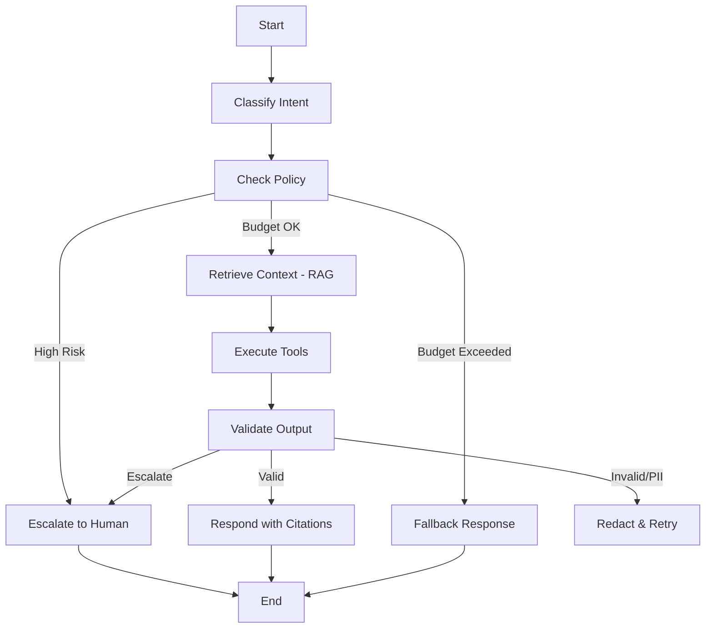
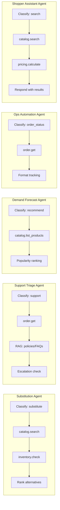
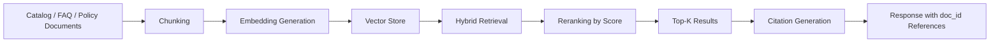
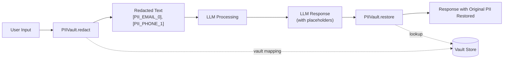
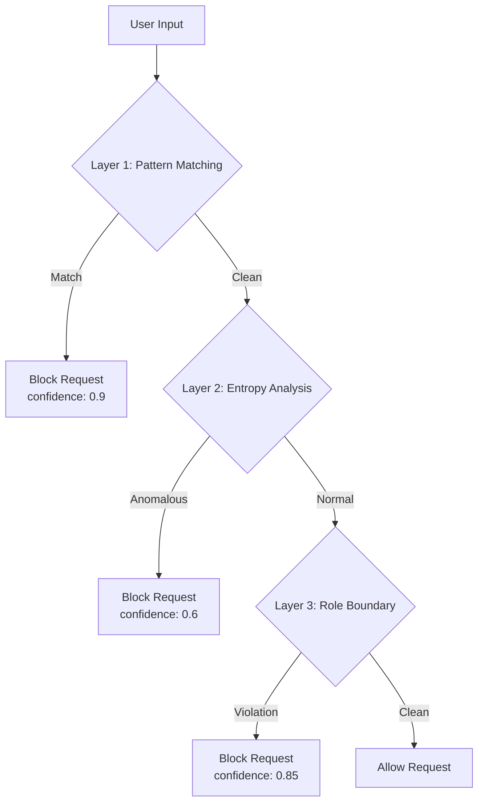
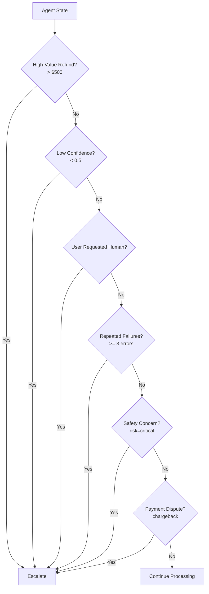
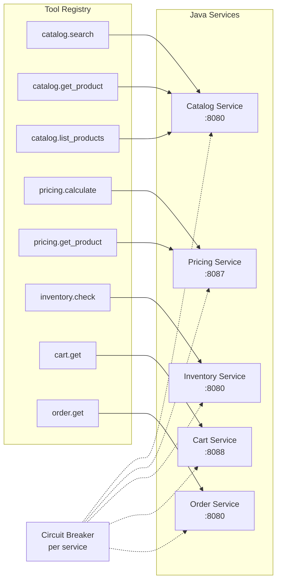

# AI Orchestrator Service

**Python / FastAPI** — LangGraph-based agent orchestration for InstaCommerce Q-commerce AI workflows.

| Attribute | Value |
|---|---|
| **Port** | `8100` |
| **Framework** | FastAPI + LangGraph |
| **LLM** | Configurable (GPT-4o, GPT-4o-mini, GPT-4-turbo, GPT-3.5-turbo) |
| **Checkpointing** | Redis (with in-memory fallback) |
| **Observability** | OpenTelemetry (OTLP traces) + structured JSON logging |

---

## Table of Contents

- [Architecture Overview](#architecture-overview)
- [LangGraph State Machine](#langgraph-state-machine)
- [Agent Types](#agent-types)
- [RAG Pipeline](#rag-pipeline)
- [Guardrails Architecture](#guardrails-architecture)
- [Tool Registry](#tool-registry)
- [Budget Enforcement](#budget-enforcement)
- [API Reference](#api-reference)
- [Project Structure](#project-structure)
- [Configuration](#configuration)
- [Running Locally](#running-locally)

---

## Architecture Overview

The orchestrator routes every user query through a LangGraph state machine that classifies intent, enforces policy/budget gates, retrieves context via RAG, executes tools against downstream Java services, validates output (PII redaction, content safety), and returns a cited response — or escalates to a human agent.

```
┌─────────────────────────────────────────────────────────────────┐
│                    AI Orchestrator Service                       │
│                                                                 │
│  ┌──────────┐   ┌──────────────┐   ┌────────────────────────┐  │
│  │ FastAPI   │──▶│ LangGraph    │──▶│ Tool Registry          │  │
│  │ Endpoints │   │ State Machine│   │ (Circuit Breakers)     │  │
│  └──────────┘   └──────────────┘   └────────┬───────────────┘  │
│       │              │                       │                  │
│       │         ┌────┴────┐          ┌───────▼──────────┐      │
│       │         │Guardrails│          │ Java Services    │      │
│       │         │ PII/Inj  │          │ Catalog, Order,  │      │
│       │         └─────────┘          │ Inventory, Cart, │      │
│       │                              │ Pricing          │      │
│       │         ┌─────────┐          └──────────────────┘      │
│       │         │Checkpoint│                                    │
│       └────────▶│ Redis    │                                    │
│                 └─────────┘                                    │
└─────────────────────────────────────────────────────────────────┘
```

---

## LangGraph State Machine

Every request traverses the compiled state graph. Conditional routing after `check_policy` decides whether to continue autonomous processing or escalate to a human agent.



### Graph Topology (from code)

```
START
  │
  ▼
classify_intent ──▶ check_policy
                        │
                        ├──(needs_escalation)──▶ escalate ──▶ END
                        │
                        ▼
                   retrieve_context ──▶ execute_tools ──▶ validate_output ──▶ respond ──▶ END
```

### State Object (`AgentState`)

The typed Pydantic state threaded through every node contains:

| Group | Fields |
|---|---|
| **Identity** | `request_id`, `user_id`, `session_id`, `created_at` |
| **Input** | `query`, `context` |
| **Classification** | `intent` (substitute / support / recommend / search / order_status / unknown), `intent_confidence`, `risk_level` (low / medium / high / critical) |
| **Retrieval** | `retrieval_results` — list of `RetrievalResult` with `doc_id`, `content`, `score`, `metadata` |
| **Tool Execution** | `tool_results`, `tool_calls_remaining` (default 10) |
| **Budget** | `total_tokens_used`, `total_cost_usd`, `max_cost_usd` ($0.50 hard cap), `max_latency_ms` (10 s), `elapsed_ms` |
| **Output** | `response`, `response_citations`, `needs_escalation`, `escalation_reason` |
| **Conversation** | `conversation_history` |
| **Graph Metadata** | `current_node`, `completed_nodes` (audit trail) |

---

## Agent Types

Each intent maps to a specialised agent flow that selects different tools and retrieval strategies.



### Intent → Tool Mapping

| Intent | Tools Called | Risk Level |
|---|---|---|
| `substitute` | `catalog.search`, `inventory.check` | Medium |
| `support` | `order.get` (if order_id in context) | Medium |
| `recommend` | `catalog.list_products` (sort=popularity) | Low |
| `search` | `catalog.search` | Low |
| `order_status` | `order.get` (path param: order_id) | Low |
| `unknown` | None (escalated if confidence < 0.1) | High |

---

## RAG Pipeline



### Current Implementation

The `retrieve_context` node provides keyword-based fallback retrieval with a simulated knowledge base:

| Topic | Doc ID | Source |
|---|---|---|
| Returns | `policy-returns-001` | Policy — "Returns accepted within 7 days. Items must be unopened." |
| Delivery | `faq-delivery-001` | FAQ — "Standard delivery 10-30 min. Express available for select areas." |
| Substitution | `policy-substitution-001` | Policy — "Substitutions offered when item OOS. Customers can pre-approve." |
| General (fallback) | `faq-general-001` | FAQ — "Provide your order number or describe your issue." |

Each `RetrievalResult` carries `doc_id`, `content`, `score`, and `metadata` (source, category). Citations are auto-generated from `doc_id` values.

**Production path:** Plug in a vector store (Pinecone, Weaviate) by implementing the `RetrievalProvider` interface with the `CachedRetrievalProvider` wrapper (TTL-based LRU cache, configurable via `rag_cache_ttl_seconds` / `rag_cache_max_entries`).

---

## Guardrails Architecture

### PII Vault (Redact → LLM → Restore)



**Detected PII types:**

| Type | Pattern | Placeholder |
|---|---|---|
| Email | `user@example.com` | `[PII_EMAIL_N]` |
| SSN | `123-45-6789` | `[PII_SSN_N]` |
| Credit Card | 13-16 digit sequences | `[PII_CARD_N]` |
| Phone | US phone numbers | `[PII_PHONE_N]` |
| Address | Street addresses (St, Ave, Blvd, etc.) | `[PII_ADDRESS_N]` |

The vault is thread-safe (`threading.Lock`), supports recursive dict/list redaction via `redact_value()`, and uses HMAC-SHA256 for provenance tagging.

### Prompt Injection Detection



**Layer 1 — Known Patterns:** `ignore previous instructions`, `you are now`, `forget everything`, `system:`, `jailbreak`, `DAN mode`, `bypass restrictions`, `reveal system prompt`, etc.

**Layer 2 — Entropy Analysis:** Shannon entropy > 4.5 on text ≥ 20 chars flags obfuscated payloads (base64 blobs, encoded instructions).

**Layer 3 — Role Boundary Violations:** Detects `system:`, `assistant:`, `[INST]`, `<|system|>`, `### System:` markers.

### Output Validation

The `OutputPolicy` enforces:

| Check | Rule |
|---|---|
| **Schema** | Required fields per intent (e.g., `refund` needs `amount_cents`, `reason`) |
| **Business Rules** | Refund cap: $500 (50000 cents). Discount cap: 30% |
| **Content Safety** | Blocks phrases: "as an AI", "I cannot", "I'm just a language model" |
| **Citation Validation** | Warns when output references UUIDs not found in tool results |

### Escalation Triggers



Human-request phrases: `"speak to human"`, `"talk to agent"`, `"real person"`, `"live agent"`, `"transfer me"`.

### Rate Limiting

Token-bucket algorithm per user:
- **Sustained rate:** 10 requests/minute (configurable)
- **Burst:** 15 tokens
- **Stale bucket pruning:** every 5 minutes (1-hour staleness threshold)

---

## Tool Registry

Each tool wraps an `httpx` call to a downstream Java micro-service with built-in resilience.

### Resilience Features

| Feature | Config |
|---|---|
| **Circuit Breaker** | 3-state (closed → open → half-open). Opens after 3 consecutive failures, resets after 30 s |
| **Retry** | Exponential backoff, max 2 retries. Backoff: `min(0.5 × 2^(attempt-1), 4.0)` seconds |
| **Per-tool Timeout** | 2.5 s default |
| **Total Timeout** | 6.0 s across all tool calls |
| **Max Tool Calls** | 8 per request |
| **Idempotency** | `X-Idempotency-Key` header auto-attached to write operations |
| **Allowlist** | Only tools in `tool_allowlist` can be invoked |

### Tool → Service Mapping



| Tool | Service | Method | Path | Description |
|---|---|---|---|---|
| `catalog.search` | Catalog (`:8080`) | GET | `/api/v1/products/search` | Full-text product search |
| `catalog.get_product` | Catalog (`:8080`) | GET | `/api/v1/products/{product_id}` | Fetch product by ID |
| `catalog.list_products` | Catalog (`:8080`) | GET | `/api/v1/products` | List products with filters |
| `pricing.calculate` | Pricing (`:8087`) | POST | `/api/v1/pricing/calculate` | Calculate price for product/cart |
| `pricing.get_product` | Pricing (`:8087`) | GET | `/api/v1/pricing/products/{product_id}` | Get product pricing |
| `inventory.check` | Inventory (`:8080`) | GET | `/api/v1/inventory/{product_id}` | Check stock availability |
| `cart.get` | Cart (`:8088`) | GET | `/api/v1/carts/{user_id}` | Get user cart |
| `order.get` | Order (`:8080`) | GET | `/api/v1/orders/{order_id}` | Get order details |

---

## Budget Enforcement

The `BudgetTracker` enforces per-request ceilings. All checks are **fail-closed** (missing data = budget exhausted).

| Budget | Default | Description |
|---|---|---|
| **Cost** | $0.50 hard cap | Per-model USD pricing tracked per LLM call |
| **Latency** | 10,000 ms | Wall-clock ceiling with early termination |
| **Tool Calls** | 10 max | Hard cap on tool invocations |
| **Tokens** | Unlimited (0) | Optional token ceiling |

### Per-Model Token Pricing (USD / 1,000 tokens)

| Model | Input | Output |
|---|---|---|
| `gpt-4o` | $0.005 | $0.015 |
| `gpt-4o-mini` | $0.00015 | $0.0006 |
| `gpt-4-turbo` | $0.01 | $0.03 |
| `gpt-3.5-turbo` | $0.0005 | $0.0015 |
| Default (fallback) | $0.01 | $0.03 |

---

## API Reference

### v2 Endpoints (LangGraph)

| Method | Path | Description |
|---|---|---|
| `POST` | `/v2/agent/invoke` | Invoke the LangGraph agent for a user query |
| `GET` | `/v2/agent/health` | Health check for the v2 agent subsystem |

#### `POST /v2/agent/invoke`

**Request Body:**

```json
{
  "query": "Can you find a substitute for organic milk?",
  "user_id": "user-123",
  "session_id": "sess-abc",
  "context": { "order_id": "ord-456" },
  "conversation_history": [],
  "max_cost_usd": 0.50,
  "max_latency_ms": 10000.0
}
```

| Field | Type | Required | Constraints |
|---|---|---|---|
| `query` | string | ✅ | 1–4,000 chars |
| `user_id` | string | ✅ | 1–256 chars |
| `session_id` | string | | |
| `context` | object | | Arbitrary context (e.g., `order_id`) |
| `conversation_history` | array | | Previous messages |
| `max_cost_usd` | float | | 0.0–0.50 (hard cap) |
| `max_latency_ms` | float | | 0.0–30,000 |

**Response:**

```json
{
  "request_id": "uuid",
  "response": "Based on available information: ...",
  "intent": "substitute",
  "intent_confidence": 0.75,
  "risk_level": "medium",
  "citations": ["policy-substitution-001"],
  "escalated": false,
  "escalation_reason": null,
  "tool_results_summary": [
    { "tool": "catalog.search", "success": true, "latency_ms": 45.2 }
  ],
  "total_tokens_used": 0,
  "total_cost_usd": 0.0,
  "elapsed_ms": 123.4,
  "errors": []
}
```

### v1 Endpoints (Legacy Monolith)

| Method | Path | Description |
|---|---|---|
| `POST` | `/api/v1/ai/assist` | General-purpose assistant |
| `POST` | `/api/v1/ai/substitute` | Product substitution |
| `POST` | `/api/v1/ai/recommend` | Product recommendation |
| `GET` | `/health` | Service health check |

---

## Project Structure

```
app/
├── main.py                    # Legacy monolith (v1 endpoints, StateGraph, tool execution)
├── config.py                  # Settings (pydantic-settings, env: AI_ORCHESTRATOR_*)
├── __init__.py
├── api/
│   ├── handlers.py            # v2 FastAPI router (/v2/agent/invoke, /v2/agent/health)
│   └── __init__.py
├── graph/
│   ├── state.py               # AgentState, IntentType, RiskLevel, ToolResult, RetrievalResult
│   ├── nodes.py               # Node implementations (classify, policy, retrieve, tools, validate, respond, escalate)
│   ├── graph.py               # LangGraph StateGraph builder with conditional edges
│   ├── tools.py               # ToolRegistry, ToolDescriptor, CircuitBreaker (httpx-based)
│   ├── checkpoints.py         # CheckpointSaver (Redis + InMemory fallback)
│   ├── budgets.py             # BudgetTracker, token_cost(), BudgetExceededError
│   └── __init__.py
├── guardrails/
│   ├── pii.py                 # PIIVault — reversible redaction with HMAC provenance
│   ├── injection.py           # InjectionDetector — 3-layer prompt injection detection
│   ├── output_validator.py    # OutputPolicy — schema, business rules, content safety, citations
│   ├── escalation.py          # EscalationPolicy — configurable rule engine (6 triggers)
│   ├── rate_limiter.py        # TokenBucketRateLimiter — per-user token bucket
│   └── __init__.py
├── Dockerfile
└── requirements.txt
```

---

## Configuration

All settings use the `AI_ORCHESTRATOR_` env prefix (case-insensitive).

| Variable | Default | Description |
|---|---|---|
| `AI_ORCHESTRATOR_SERVER_PORT` | `8100` | Server port |
| `AI_ORCHESTRATOR_LOG_LEVEL` | `INFO` | Log level |
| `AI_ORCHESTRATOR_REQUEST_TIMEOUT_SECONDS` | `3.0` | Request timeout |
| `AI_ORCHESTRATOR_AGENT_IP_RATE_LIMIT_PER_MINUTE` | `120` | Sustained per-IP request rate for `/agent/*` endpoints |
| `AI_ORCHESTRATOR_AGENT_IP_RATE_LIMIT_BURST` | `180` | Burst bucket size for per-IP rate limiting |
| `AI_ORCHESTRATOR_AGENT_USER_RATE_LIMIT_PER_MINUTE` | `30` | Sustained per-user request rate for `/agent/*` endpoints |
| `AI_ORCHESTRATOR_AGENT_USER_RATE_LIMIT_BURST` | `45` | Burst bucket size for per-user rate limiting |
| `AI_ORCHESTRATOR_AGENT_MAX_INFLIGHT_REQUESTS` | `200` | Max concurrent in-flight `/agent/*` requests |
| `AI_ORCHESTRATOR_AGENT_QUEUE_ACQUIRE_TIMEOUT_MS` | `150` | Backpressure wait timeout before returning 503 |
| `AI_ORCHESTRATOR_AGENT_TRUST_FORWARDED_FOR` | `true` | Trust first `X-Forwarded-For` value for client IP identity |
| `AI_ORCHESTRATOR_TOOL_CALL_TIMEOUT_SECONDS` | `2.5` | Per-tool call timeout |
| `AI_ORCHESTRATOR_TOOL_TOTAL_TIMEOUT_SECONDS` | `6.0` | Total tool timeout |
| `AI_ORCHESTRATOR_TOOL_CALL_MAX` | `8` | Max tool calls per request |
| `AI_ORCHESTRATOR_TOOL_CIRCUIT_BREAKER_FAILURES` | `3` | Failures before circuit opens |
| `AI_ORCHESTRATOR_TOOL_CIRCUIT_BREAKER_RESET_SECONDS` | `30.0` | Circuit reset timeout |
| `AI_ORCHESTRATOR_PII_REDACTION_ENABLED` | `true` | Enable PII redaction in logs |
| `AI_ORCHESTRATOR_RAG_CACHE_TTL_SECONDS` | `300.0` | RAG cache TTL |
| `AI_ORCHESTRATOR_RAG_CACHE_MAX_ENTRIES` | `256` | RAG cache size |
| `AI_ORCHESTRATOR_RAG_MAX_RESULTS` | `5` | Max RAG results |
| `AI_ORCHESTRATOR_LLM_API_URL` | — | LLM API endpoint |
| `AI_ORCHESTRATOR_LLM_API_KEY` | — | LLM API key |
| `AI_ORCHESTRATOR_LLM_MODEL` | — | LLM model name |
| `AI_ORCHESTRATOR_CATALOG_SERVICE_URL` | `http://catalog-service:8080` | Catalog service URL |
| `AI_ORCHESTRATOR_PRICING_SERVICE_URL` | `http://pricing-service:8087` | Pricing service URL |
| `AI_ORCHESTRATOR_INVENTORY_SERVICE_URL` | `http://inventory-service:8080` | Inventory service URL |
| `AI_ORCHESTRATOR_CART_SERVICE_URL` | `http://cart-service:8088` | Cart service URL |
| `AI_ORCHESTRATOR_ORDER_SERVICE_URL` | `http://order-service:8080` | Order service URL |
| `AI_ORCHESTRATOR_INTERNAL_SERVICE_TOKEN` | — | Token attached to downstream internal-service calls; not an inbound auth control |

### Guardrail-Specific Variables

| Variable | Default | Description |
|---|---|---|
| `INJECTION_PATTERN_CONFIDENCE` | `0.9` | Pattern-match detection confidence |
| `INJECTION_ENTROPY_THRESHOLD` | `4.5` | Shannon entropy threshold |
| `INJECTION_ENTROPY_CONFIDENCE` | `0.6` | Entropy detection confidence |
| `INJECTION_ROLE_CONFIDENCE` | `0.85` | Role boundary violation confidence |
| `OUTPUT_MAX_REFUND_CENTS` | `50000` | Max auto-refund ($500) |
| `OUTPUT_MAX_DISCOUNT_PERCENT` | `30` | Max auto-discount percentage |
| `ESCALATION_HIGH_VALUE_CENTS` | `50000` | Escalate refunds above $500 |
| `ESCALATION_LOW_CONFIDENCE` | `0.5` | Escalate below this intent confidence |
| `ESCALATION_MAX_ERRORS` | `3` | Escalate after N errors |
| `RATE_LIMIT_PER_MINUTE` | `10` | Library fallback sustained rate when rate limiter is instantiated standalone |
| `RATE_LIMIT_BURST` | `15` | Library fallback burst size when rate limiter is instantiated standalone |

---

## Running Locally

```bash
cd services/ai-orchestrator-service
pip install -r requirements.txt
uvicorn app.main:app --host 0.0.0.0 --port 8100 --reload
```

The v2 LangGraph endpoints are mounted at `/v2/`. Legacy v1 endpoints remain at `/api/v1/ai/`.

## Security & Trust Model

- **Outbound auth:** when `AI_ORCHESTRATOR_INTERNAL_SERVICE_TOKEN` is set, tool
  calls attach it to downstream service requests
- **Inbound auth:** the current FastAPI surface does **not** document or enforce
  a production-grade inbound authentication layer yet; treat this as a platform
  gap, not a hidden feature
- **Guardrails:** prompt-injection checks, PII redaction, output validation,
  budget ceilings, and escalation rules are implemented in-process

## Testing Status

- there are currently **no test files** under `services/ai-orchestrator-service`
- the highest-priority missing coverage is adversarial guardrail testing,
  checkpoint/recovery behavior, tool timeout behavior, and policy/escalation
  decisions
- use the iteration-3 governance review as the test-plan seed:
  [`../../docs/reviews/iter3/platform/ai-agent-governance.md`](../../docs/reviews/iter3/platform/ai-agent-governance.md)

## Operations & Runbook Focus Areas

Monitor and operationalize these signals before promoting the service to
customer-facing traffic:

1. tool circuit breakers opening repeatedly for catalog/pricing/inventory/order
2. checkpoint storage falling back from Redis to in-memory mode
3. escalation volume spikes, especially for low-confidence or safety-triggered
   paths
4. budget exhaustion / queue backpressure spikes on `/v2/agent/invoke`

## Known Limitations

The repository contains a strong orchestration core, but several production
controls are still maturing. The authoritative review is
[`../../docs/reviews/iter3/platform/ai-agent-governance.md`](../../docs/reviews/iter3/platform/ai-agent-governance.md).
Key current gaps:

1. inbound authentication is not yet a documented/implemented hard gate for the
   public FastAPI surface
2. rate limiting and some guardrail state are in-process, so behavior scales
   per replica rather than from a global control plane
3. escalation and audit integration are not yet documented as durable,
   enterprise-grade workflows
4. the README diagrams describe the intended platform well, but rollout should
   still follow the governance review rather than assuming every safety control
   is already production-complete
