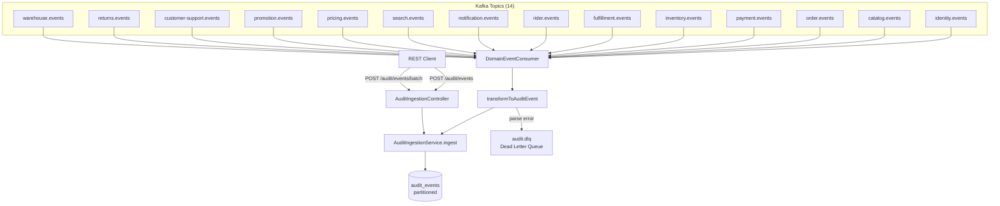
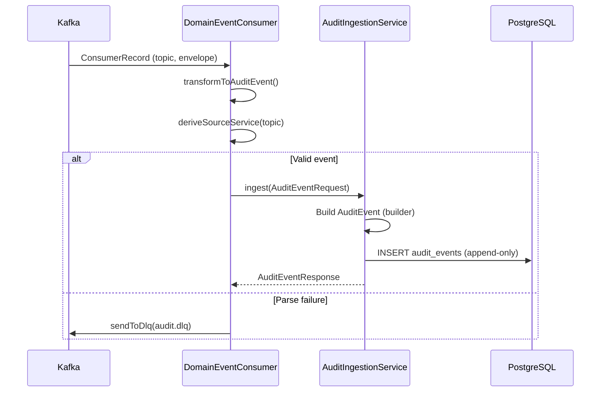
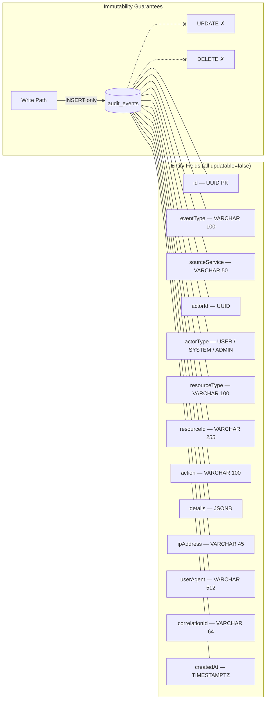
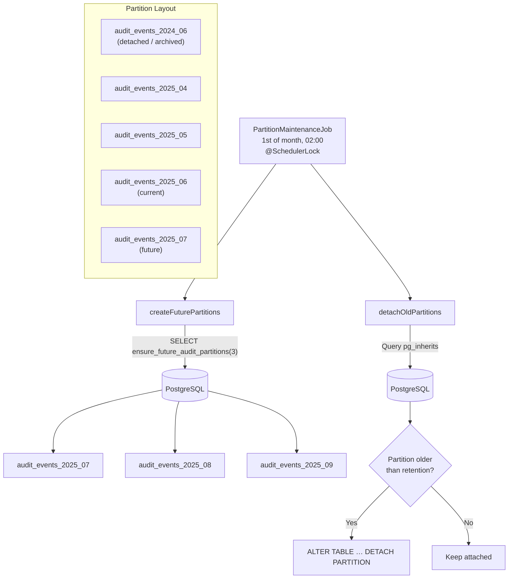
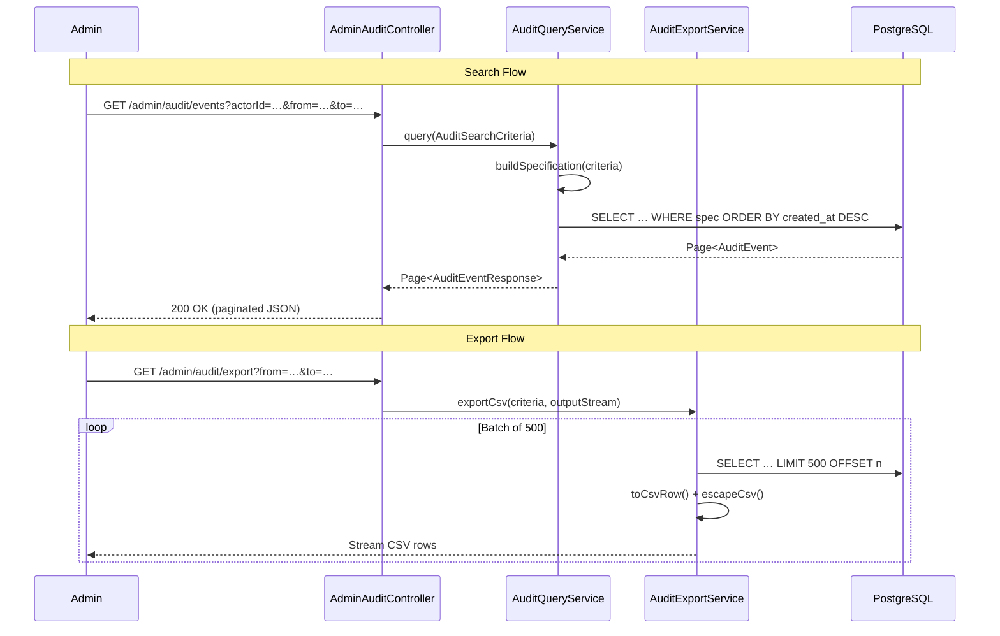

# Audit Trail Service

Centralised, **immutable audit log** with partitioned storage, compliance-grade querying, and CSV export for InstaCommerce.
Ingests domain events from **14 Kafka topics** plus a REST ingestion API, stores them append-only in PostgreSQL with monthly partitions, and provides paginated search and streaming CSV export.

## Table of Contents

- [Architecture Overview](#architecture-overview)
- [Component Map](#component-map)
- [Flow Diagrams](#flow-diagrams)
  - [Event Ingestion Flow](#event-ingestion-flow)
  - [Append-Only Storage Model](#append-only-storage-model)
  - [Partition Management](#partition-management)
  - [Query & Export Flow](#query-export-flow)
- [API Reference](#api-reference)
- [Kafka Consumer](#kafka-consumer)
- [Database Schema](#database-schema)
- [Scheduled Jobs](#scheduled-jobs)
- [Configuration](#configuration)
- [Running Locally](#running-locally)

---

## High-Level Design (HLD)

```
  Kafka (14 domain topics) ──▶ ┌──────────────────────────────┐   JPA    ┌────────────────────┐
                                │  audit-trail-service          │ ───────▶│ PostgreSQL         │
  ┌──────────────┐   REST      │  (Spring Boot 3 / Java)       │         │ (partitioned table)│
  │  API Gateway │ ──────────▶ │                                │         └────────────────────┘
  └──────────────┘             │  DomainEventConsumer           │
                                │  AuditIngestionController     │
                                │  AdminAuditController         │
                                └──────────────────────────────┘
                                            │
                                            ▼
                                  DLQ: audit.dlq (failed events)
```

**Key qualities:** append-only writes (no UPDATE/DELETE on audit rows), monthly range partitioning, ShedLock-protected maintenance job, Resilience4j, OpenTelemetry tracing, Flyway migrations, streaming CSV export.

---

## Low-Level Design (LLD)

### Component Map

| Layer | Class | Responsibility |
|-------|-------|----------------|
| **Controller** | `AuditIngestionController` | REST ingestion — single event and batch (max 1 000) |
| | `AdminAuditController` | Paginated search and CSV export (ADMIN only) |
| **Service** | `AuditIngestionService` | Converts requests → `AuditEvent` entities, persists |
| | `AuditQueryService` | Dynamic JPA Specification queries, paginated results |
| | `AuditExportService` | Streaming CSV export in batches of 500 |
| | `PartitionMaintenanceJob` | Monthly — creates future partitions, detaches old ones |
| **Kafka** | `DomainEventConsumer` | Listens to 14 domain topics, transforms to audit events |
| **Domain** | `AuditEvent`, `AuditEventBuilder` | Immutable JPA entity with builder pattern |
| **Security** | `JwtAuthenticationFilter`, `SecurityConfig` | RSA JWT validation, role-based access |
| **Config** | `AuditProperties` | Partition retention (365 days), future months (3), DLQ topic |

---

## Flow Diagrams

### Event Ingestion Flow





### Append-Only Storage Model



All `AuditEvent` columns are annotated `updatable = false` — the JPA entity enforces immutability at the application layer.

### Partition Management



- **Retention:** 365 days (configurable via `audit.partition.retentionDays`)
- **Future partitions:** 3 months ahead (configurable via `audit.partition.futureMonths`)
- Detached partitions can be archived or dropped by ops teams.

### Query & Export Flow



**Search criteria** supports: `actorId`, `resourceType`, `resourceId`, `sourceService`, `eventType`, `correlationId`, `fromDate`, `toDate`.
Default range is last 30 days; max query range is 366 days.

---

## API Reference

### Ingestion (ROLE_SYSTEM, ROLE_SERVICE)

| Method | Path | Auth | Description |
|--------|------|------|-------------|
| `POST` | `/audit/events` | `SYSTEM`, `SERVICE` | Ingest a single audit event |
| `POST` | `/audit/events/batch` | `SYSTEM`, `SERVICE` | Ingest up to 1 000 events |

**AuditEventRequest**

```json
{
  "eventType": "ORDER_PLACED",
  "sourceService": "order-service",
  "actorId": "550e8400-e29b-41d4-a716-446655440000",
  "actorType": "USER",
  "resourceType": "Order",
  "resourceId": "ord_abc123",
  "action": "CREATE",
  "details": { "totalCents": 15000, "itemCount": 3 },
  "ipAddress": "203.0.113.42",
  "userAgent": "InstaCommerce-iOS/3.2.1",
  "correlationId": "corr_xyz789"
}
```

**AuditEventResponse**

```json
{
  "id": "uuid",
  "eventType": "ORDER_PLACED",
  "sourceService": "order-service",
  "actorId": "uuid",
  "actorType": "USER",
  "resourceType": "Order",
  "resourceId": "ord_abc123",
  "action": "CREATE",
  "details": { "totalCents": 15000, "itemCount": 3 },
  "ipAddress": "203.0.113.42",
  "userAgent": "InstaCommerce-iOS/3.2.1",
  "correlationId": "corr_xyz789",
  "createdAt": "2025-01-15T10:30:00Z"
}
```

### Admin (ROLE_ADMIN)

| Method | Path | Auth | Description |
|--------|------|------|-------------|
| `GET` | `/admin/audit/events` | `ADMIN` | Paginated search with filters |
| `GET` | `/admin/audit/export` | `ADMIN` | Streaming CSV export |

**Query Parameters (AuditSearchCriteria)**

| Param | Type | Default | Description |
|-------|------|---------|-------------|
| `actorId` | UUID | — | Filter by actor |
| `resourceType` | String | — | Filter by resource type |
| `resourceId` | String | — | Filter by resource ID |
| `sourceService` | String | — | Filter by source service |
| `eventType` | String | — | Filter by event type |
| `correlationId` | String | — | Filter by correlation ID |
| `fromDate` | ISO 8601 | 30 days ago | Start of date range |
| `toDate` | ISO 8601 | now | End of date range |
| `page` | int | 0 | Page number (≥ 0) |
| `size` | int | 20 | Page size (1–100) |

### Common Error Response

```json
{
  "code": "VALIDATION_ERROR",
  "message": "Invalid request",
  "traceId": "abc123",
  "timestamp": "2025-01-15T10:30:00Z",
  "details": [{ "field": "eventType", "message": "must not be blank" }]
}
```

---

## Kafka Consumer

### DomainEventConsumer

Subscribes to **14 domain event topics**:

| Topic | Source Service |
|-------|---------------|
| `identity.events` | identity-service |
| `catalog.events` | catalog-service |
| `order.events` | order-service |
| `payment.events` | payment-service |
| `inventory.events` | inventory-service |
| `fulfillment.events` | fulfillment-service |
| `rider.events` | rider-fleet-service |
| `notification.events` | notification-service |
| `search.events` | search-service |
| `pricing.events` | pricing-service |
| `promotion.events` | pricing-service |
| `customer-support.events` | customer-support |
| `returns.events` | returns-service |
| `warehouse.events` | warehouse-service |

Failed events are forwarded to `audit.dlq` (configurable via `audit.dlqTopic`).

---

## Database Schema

### audit_events (Range Partitioned by `created_at`)

```
audit_events
  id              UUID  PK  (generated)
  event_type      VARCHAR(100)   NOT NULL
  source_service  VARCHAR(50)    NOT NULL
  actor_id        UUID           NULLABLE
  actor_type      VARCHAR(20)    (USER | SYSTEM | ADMIN)
  resource_type   VARCHAR(100)
  resource_id     VARCHAR(255)
  action          VARCHAR(100)   NOT NULL
  details         JSONB
  ip_address      VARCHAR(45)
  user_agent      VARCHAR(512)
  correlation_id  VARCHAR(64)
  created_at      TIMESTAMPTZ    NOT NULL

  -- All columns are updatable=false (immutable)
  -- Partitioned by RANGE (created_at)
  -- Monthly partitions: audit_events_YYYY_MM
```

### Partition DDL (managed by Flyway + maintenance job)

```sql
CREATE TABLE audit_events (
    id             UUID DEFAULT gen_random_uuid(),
    ...
    created_at     TIMESTAMPTZ NOT NULL
) PARTITION BY RANGE (created_at);

-- Example partition
CREATE TABLE audit_events_2025_06
    PARTITION OF audit_events
    FOR VALUES FROM ('2025-06-01') TO ('2025-07-01');
```

### Supporting Tables

```
shedlock
  name       VARCHAR(64)  PK
  lock_until TIMESTAMPTZ
  locked_at  TIMESTAMPTZ
  locked_by  VARCHAR(255)
```

Migrations managed by **Flyway** (`db/migration/V*.sql`).

---

## Scheduled Jobs

| Job | Schedule | Lock | Description |
|-----|----------|------|-------------|
| `PartitionMaintenanceJob` | `0 0 2 1 * *` (1st of month, 02:00) | ShedLock (5 min–30 min) | Creates 3 future monthly partitions, detaches partitions older than retention |

---

## Configuration

Key properties in `application.yml` / environment:

| Property | Default | Description |
|----------|---------|-------------|
| `audit.jwt.issuer` | — | Expected JWT issuer |
| `audit.jwt.public-key` | — | RSA public key (PEM or Base64) |
| `audit.partition.retention-days` | `365` | Days before partition detachment |
| `audit.partition.future-months` | `3` | Months of future partitions to create |
| `audit.dlq-topic` | `audit.dlq` | Dead-letter queue topic |
| `spring.datasource.url` | — | PostgreSQL JDBC URL |
| `spring.kafka.bootstrap-servers` | — | Kafka broker list |
| `spring.kafka.consumer.group-id` | — | Consumer group |

### Dependencies

- Java 17+, Spring Boot 3, Spring Kafka
- PostgreSQL 15+ (native range partitioning)
- Flyway, ShedLock 5.10.2
- Resilience4j 2.2.0
- JJWT 0.12.5 (RSA JWT)
- Micrometer + OpenTelemetry
- Google Cloud SQL socket factory, Secret Manager
- Testcontainers (PostgreSQL) for integration tests

---

## Running Locally

```bash
# Start dependencies
docker compose up -d postgres kafka

# Run the service
./gradlew :services:audit-trail-service:bootRun

# Health check
curl http://localhost:8080/actuator/health

# Ingest an event
curl -X POST http://localhost:8080/audit/events \
  -H "Content-Type: application/json" \
  -H "Authorization: Bearer <token>" \
  -d '{"eventType":"ORDER_PLACED","sourceService":"order-service","action":"CREATE"}'

# Search events
curl "http://localhost:8080/admin/audit/events?sourceService=order-service&size=10" \
  -H "Authorization: Bearer <admin-token>"
```

---

## Testing

```bash
./gradlew :services:audit-trail-service:test
```

## Rollout and Rollback

- deploy partitioning and retention changes before tightening API or consumer assumptions
- canary Kafka consumer changes with DLT and lag monitoring enabled
- roll back by restoring prior application image and keeping the schema additive; avoid dropping partitions or indexes during the same deploy window

## Known Limitations

- audit topic coverage, search ergonomics, and retention posture still need to stay aligned with the iter3 compliance review as the event fleet evolves
- centralized audit is only as complete as the producing services; gaps in producer emission still surface as missing history rather than local service failure
