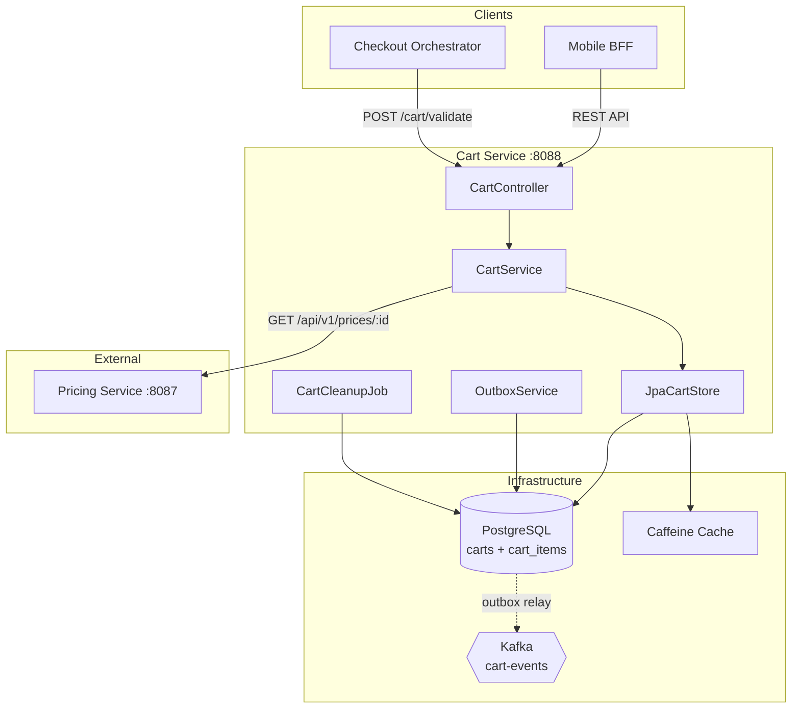
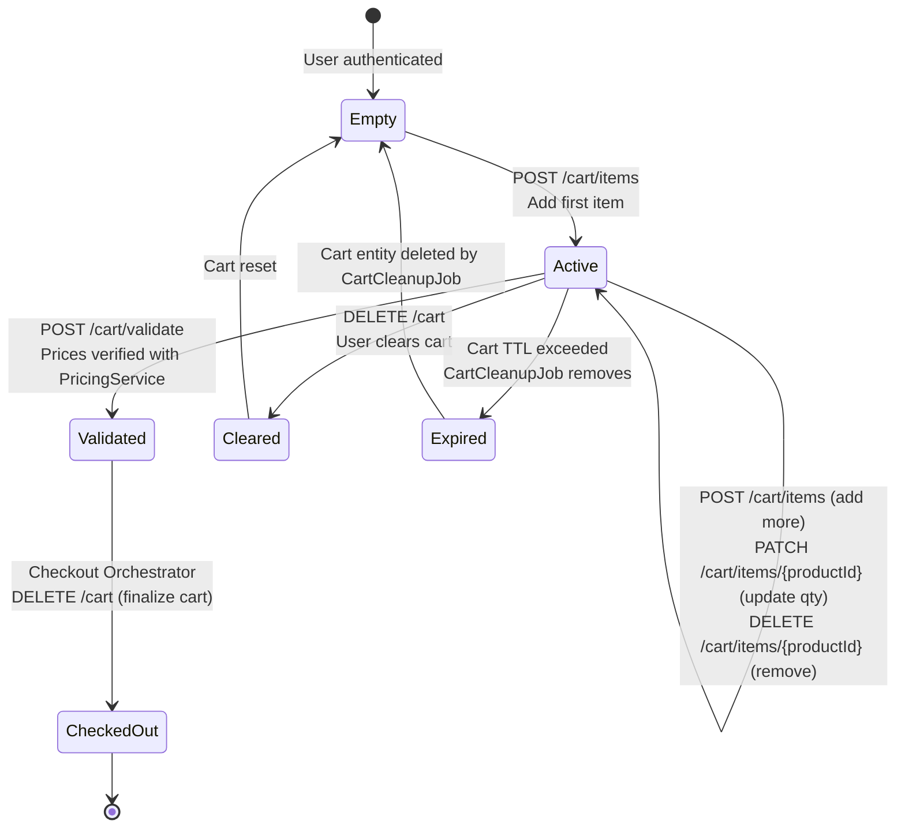
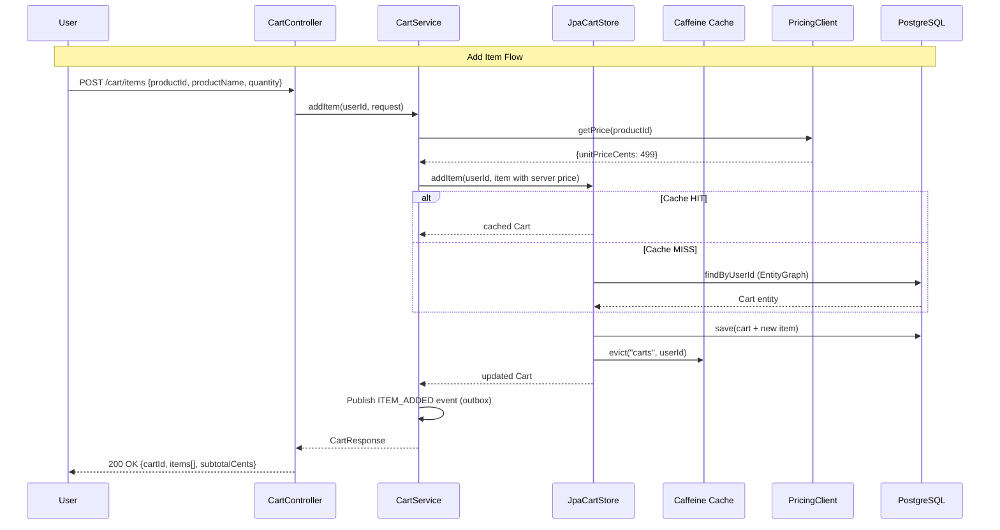
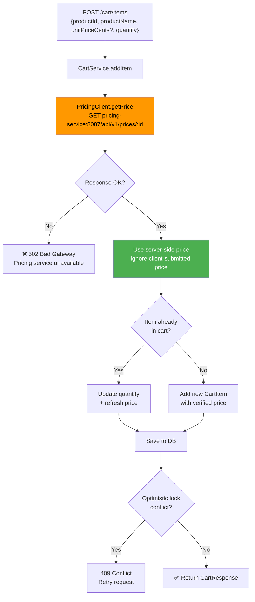
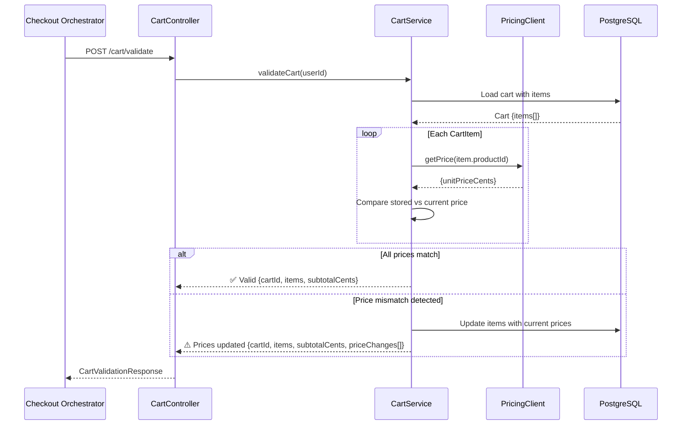
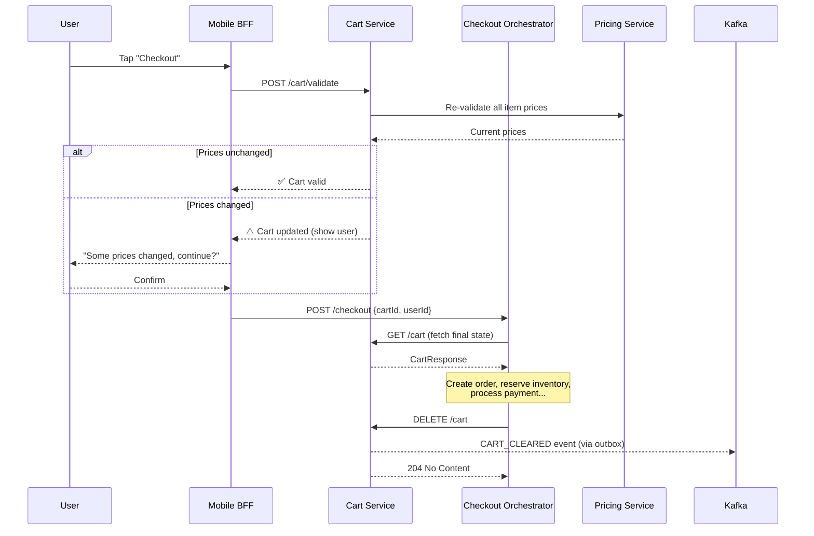
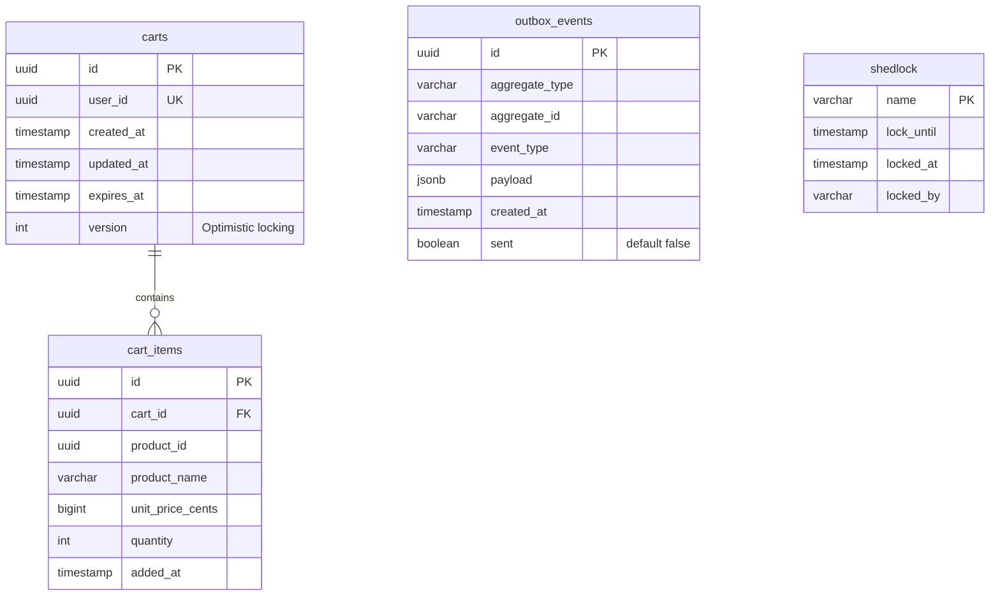

# 🛒 Cart Service

> **Shopping cart management with server-side price validation, optimistic locking, and event-driven architecture via the outbox pattern.**

| Property | Value |
|----------|-------|
| **Port** | `8088` |
| **Database** | PostgreSQL |
| **Messaging** | Kafka (`cart-events` via Outbox) |
| **Cache** | Caffeine (in-memory) |
| **Auth** | JWT (RS256) + Internal Service Auth |
| **Upstream** | Pricing Service (`:8087`) |

---

## Table of Contents

- [Architecture](#architecture)
- [Service Components](#service-components)
- [Cart Lifecycle](#cart-lifecycle)
- [Price Validation Flow](#price-validation-flow)
- [Cart-to-Checkout Handoff](#cart-to-checkout-handoff)
- [API Reference](#api-reference)
- [Database Schema](#database-schema)
- [Configuration](#configuration)
- [Running Locally](#running-locally)

---

## Architecture



---

## Service Components

| Component | Package | Responsibility |
|-----------|---------|---------------|
| **CartController** | `controller` | REST endpoints for cart CRUD and validation |
| **CartService** | `service` | Business logic: add/update/remove items, price validation via PricingClient |
| **CartStore** | `service` | Storage abstraction interface |
| **JpaCartStore** | `service` | JPA implementation with caching and optimistic locking |
| **PricingClient** | `client` | HTTP client to Pricing Service for authoritative product prices |
| **OutboxService** | `service` | Transactional event publishing (outbox pattern) |
| **CartCleanupJob** | `service` | Scheduled cleanup of expired carts (every 15 min) and old outbox events (daily 3 AM) |

---

## Cart Lifecycle



### Cart Operations Detail



---

## Price Validation Flow



### Price Validation on Checkout



### Security: Why Server-Side Validation?

| Threat | Mitigation |
|--------|-----------|
| Client submits fake low price | Price always fetched from Pricing Service |
| Stale prices in cart | Re-validated at checkout via `POST /cart/validate` |
| Race condition on quantity | Optimistic locking (`@Version`) → 409 Conflict on collision |
| Inter-service spoofing | `X-Internal-Service` + `X-Internal-Token` headers |

---

## Cart-to-Checkout Handoff



---

## API Reference

### Endpoints

| Method | Endpoint | Description | Auth |
|--------|----------|-------------|------|
| `GET` | `/cart` | Get current user's cart | JWT |
| `POST` | `/cart/items` | Add item to cart (price validated server-side) | JWT |
| `PATCH` | `/cart/items/{productId}` | Update item quantity | JWT |
| `DELETE` | `/cart/items/{productId}` | Remove item from cart | JWT |
| `DELETE` | `/cart` | Clear entire cart | JWT |
| `POST` | `/cart/validate` | Validate cart prices against Pricing Service | JWT |

### `GET /cart`

**Response:**
```json
{
  "cartId": "uuid",
  "userId": "uuid",
  "items": [
    {
      "productId": "uuid",
      "productName": "Organic Milk",
      "unitPriceCents": 499,
      "quantity": 2,
      "lineTotalCents": 998
    }
  ],
  "subtotalCents": 998,
  "itemCount": 1,
  "expiresAt": "2025-07-15T12:00:00Z"
}
```

### `POST /cart/items`

**Request:**
```json
{
  "productId": "uuid",
  "productName": "Organic Milk",
  "quantity": 2
}
```

| Field | Type | Required | Validation |
|-------|------|----------|------------|
| `productId` | UUID | ✅ | Must be valid UUID |
| `productName` | string | ✅ | Non-blank |
| `unitPriceCents` | long | ❌ | Ignored — server fetches from Pricing Service |
| `quantity` | int | ✅ | 1–10 |

**Response:** `200 OK` → CartResponse

### `PATCH /cart/items/{productId}`

**Request:**
```json
{
  "quantity": 3
}
```

| Field | Type | Required | Validation |
|-------|------|----------|------------|
| `quantity` | int | ✅ | 1–10 |

**Response:** `200 OK` → CartResponse

### `DELETE /cart/items/{productId}`

**Response:** `200 OK` → CartResponse

### `DELETE /cart`

**Response:** `200 OK` → CartResponse (empty cart)

### `POST /cart/validate`

**Response:** `200 OK` → CartResponse (with refreshed prices)

### Error Responses

| Status | Code | Description |
|--------|------|-------------|
| `400` | `BAD_REQUEST` | Validation error (invalid quantity, missing fields) |
| `401` | `UNAUTHORIZED` | Missing or invalid JWT |
| `403` | `FORBIDDEN` | Insufficient permissions |
| `404` | `CART_NOT_FOUND` | No cart exists for this user |
| `404` | `CART_ITEM_NOT_FOUND` | Product not in cart |
| `409` | `CONFLICT` | Optimistic lock conflict (concurrent modification) |
| `422` | `UNPROCESSABLE_ENTITY` | Business rule violation |

---

## Database Schema



### Constraints

- **Unique:** `(cart_id, product_id)` on `cart_items` — one entry per product per cart
- **Unique:** `user_id` on `carts` — one cart per user
- **Cascade:** Deleting a cart removes all its items (orphan removal)
- **Optimistic locking:** `version` column prevents lost updates

### Kafka Events (via Outbox)

| Event | Trigger | Payload |
|-------|---------|---------|
| `ITEM_ADDED` | Item added to cart | `{userId, cartId, productId, quantity, unitPriceCents, productName}` |
| `ITEM_REMOVED` | Item removed from cart | `{userId, cartId, productId}` |
| `CART_CLEARED` | Cart cleared | `{userId, cartId}` |

---

## Configuration

### Environment Variables

| Variable | Default | Description |
|----------|---------|-------------|
| `SERVER_PORT` | `8088` | HTTP port |
| `CART_DB_URL` | `jdbc:postgresql://localhost:5432/carts` | PostgreSQL connection URL |
| `CART_DB_USER` | `cart` | Database username |
| `CART_DB_PASSWORD` | — | Database password |
| `KAFKA_BOOTSTRAP_SERVERS` | `localhost:9092` | Kafka broker addresses |
| `CART_JWT_ISSUER` | `instacommerce-identity` | Expected JWT issuer |
| `CART_JWT_PUBLIC_KEY` | — | RSA public key (PEM) |
| `PRICING_SERVICE_BASE_URL` | `http://pricing-service:8087` | Pricing Service URL |
| `INTERNAL_SERVICE_TOKEN` | `dev-internal-token-change-in-prod` | Inter-service auth token |
| `TRACING_PROBABILITY` | `1.0` | OpenTelemetry sampling rate |

### Cart Limits

| Property | Default | Description |
|----------|---------|-------------|
| `cart.max-items-per-cart` | 50 | Maximum distinct products per cart |
| `cart.max-quantity-per-item` | 10 | Maximum quantity per product |
| `cart.kafka.cart-events-topic` | `cart-events` | Kafka topic for cart events |

### Cache Configuration

| Cache Name | Max Size | TTL | Purpose |
|------------|----------|-----|---------|
| `carts` | 50,000 | 1 hour | Cart lookups by userId |

Cache is **evicted** on all mutations (add, update, remove, clear).

### PricingClient Configuration

| Setting | Value |
|---------|-------|
| Connect timeout | 2 seconds |
| Read timeout | 3 seconds |
| Auth | `X-Internal-Service` + `X-Internal-Token` headers |
| Base URL | `http://pricing-service:8087` |

### Security

- **JWT endpoints:** `/cart/**` → requires valid JWT (userId extracted from subject)
- **Internal endpoints:** Service-to-service via `X-Internal-Service` / `X-Internal-Token`
- **Public endpoints:** `/actuator/**`
- **CORS origins:** `http://localhost:3000`, `https://*.instacommerce.dev`
- **Session:** Stateless

---

## Running Locally

### Prerequisites

- **Java 21+**
- **PostgreSQL 15+**
- **Kafka** (for outbox event publishing)
- **Pricing Service** running on port `8087`

### 1. Start dependencies

```bash
docker compose up -d postgres kafka

# Start pricing service first (cart depends on it)
./gradlew :services:pricing-service:bootRun &
```

### 2. Run the service

```bash
# From repository root
./gradlew :services:cart-service:bootRun
```

### 3. Verify

```bash
# Health check
curl http://localhost:8088/actuator/health

# Get cart (requires JWT)
curl http://localhost:8088/cart \
  -H "Authorization: Bearer <jwt-token>"

# Add item to cart
curl -X POST http://localhost:8088/cart/items \
  -H "Authorization: Bearer <jwt-token>" \
  -H "Content-Type: application/json" \
  -d '{"productId":"uuid","productName":"Organic Milk","quantity":2}'

# Update quantity
curl -X PATCH http://localhost:8088/cart/items/{productId} \
  -H "Authorization: Bearer <jwt-token>" \
  -H "Content-Type: application/json" \
  -d '{"quantity":3}'

# Validate cart prices
curl -X POST http://localhost:8088/cart/validate \
  -H "Authorization: Bearer <jwt-token>"
```

### Connection Pool (HikariCP)

| Setting | Value |
|---------|-------|
| Maximum pool size | 30 |
| Minimum idle | 10 |
| Connection timeout | 5s |
| Max lifetime | 30 min |

### Build & Test

```bash
# Build
./gradlew :services:cart-service:build

# Run tests
./gradlew :services:cart-service:test
```

---

## Observability

| Aspect | Technology |
|--------|-----------|
| **Tracing** | OpenTelemetry → OTLP exporter |
| **Metrics** | Micrometer → Prometheus (`/actuator/prometheus`) |
| **Health** | Spring Actuator (readiness: db, liveness: ping) |
| **Logging** | Logstash JSON format |
| **Graceful Shutdown** | 30s timeout per lifecycle phase |

### Scheduled Jobs

| Job | Schedule | Lock | Description |
|-----|----------|------|-------------|
| `expired-cart-cleanup` | Every 15 min | ShedLock | Deletes carts past `expiresAt` |
| `outbox-cleanup` | Daily 3 AM | ShedLock | Deletes sent outbox events older than retention period |
