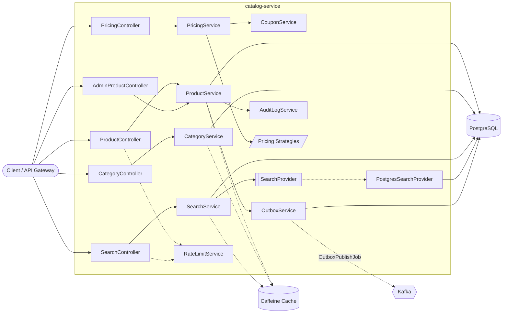
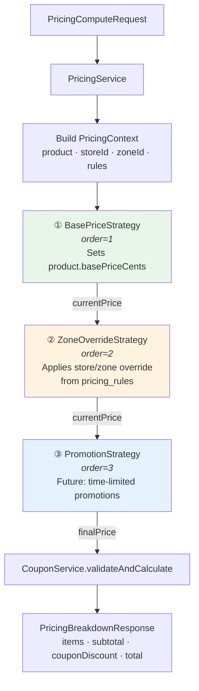
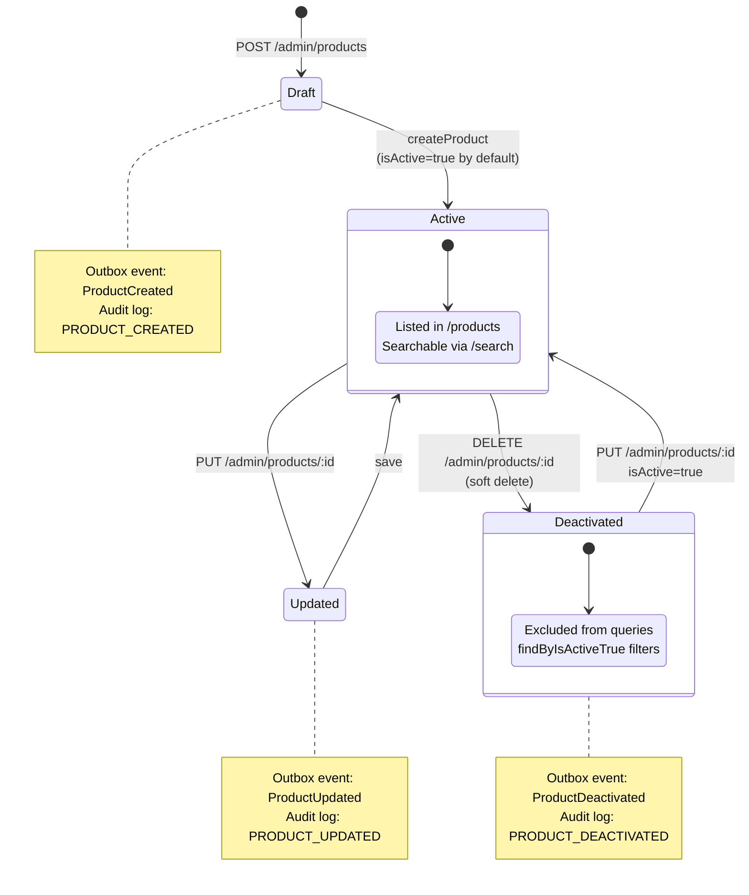
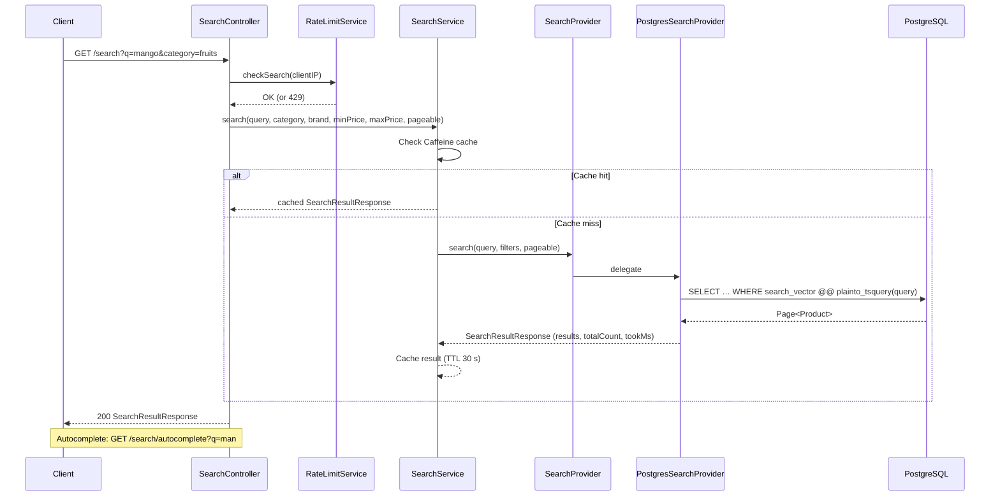
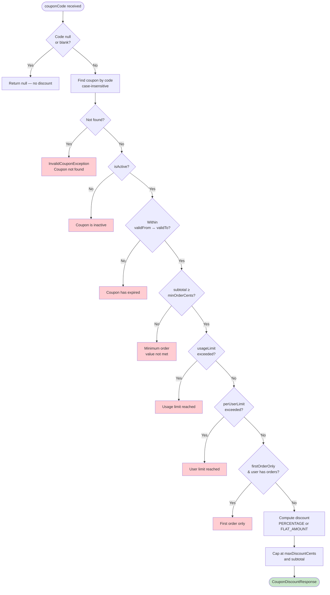
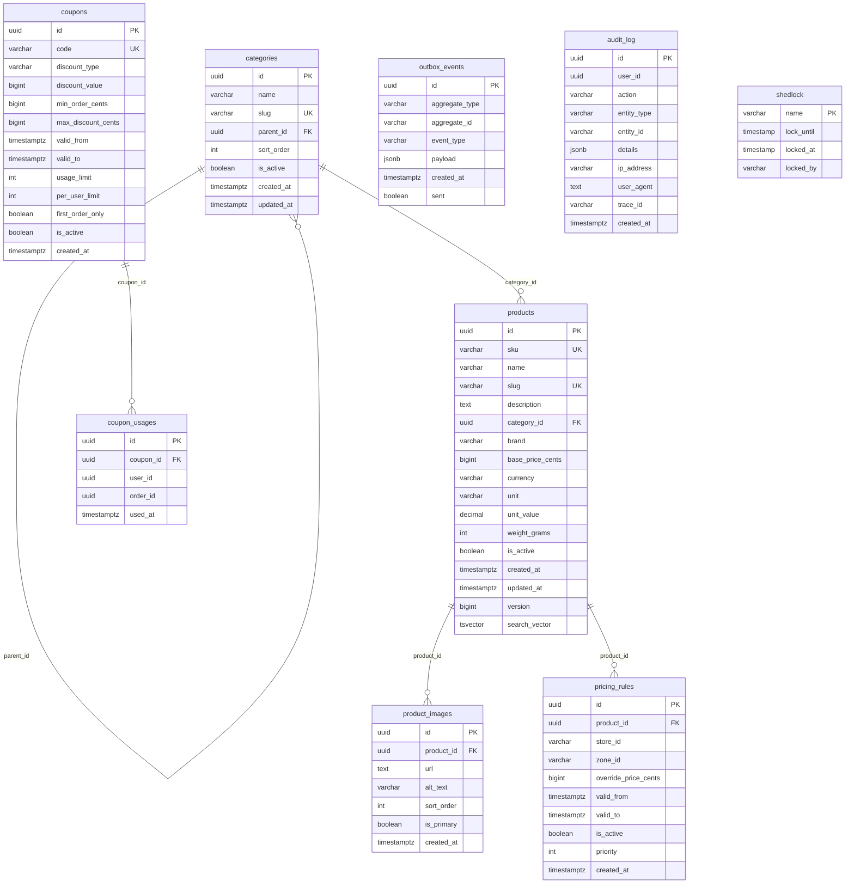

# Catalog Service

Product management, categories, full-text search, pricing strategies, and coupons for the InstaCommerce platform. Publishes domain events to Kafka via the transactional outbox pattern.

## Tech Stack

| Layer | Technology |
|---|---|
| Runtime | Java 21, Spring Boot 3 |
| Database | PostgreSQL (Flyway migrations) |
| Search | PostgreSQL `tsvector` (pluggable via `SearchProvider`) |
| Caching | Caffeine (products 5 min, categories 10 min, search 30 s) |
| Messaging | Kafka (`catalog.events` topic via outbox) |
| Auth | JWT (RS256, public-key verification) |
| Resilience | Resilience4j rate limiters (per-IP) |
| Observability | OpenTelemetry traces + OTLP metrics, Prometheus endpoint |
| Container | JDK 21 Alpine, ZGC, multi-stage Docker build |

---

## High-Level Design (HLD)



---

## Pricing Strategy Pattern

Strategies are applied as an ordered chain. Each strategy receives the current price and returns a (possibly modified) price with a rule label.



---

## Product Lifecycle



---

## Search Flow



---

## Coupon Validation Flow



---

## API Reference

### Public Endpoints (no auth required)

| Method | Path | Description | Query Params |
|---|---|---|---|
| `GET` | `/products` | List active products (paginated) | `category`, `page`, `size`, `sort` |
| `GET` | `/products/{id}` | Get product by ID | — |
| `GET` | `/categories` | Category tree (hierarchical) | — |
| `GET` | `/categories/{id}/products` | Products in a category (paginated) | `page`, `size`, `sort` |
| `GET` | `/search?q=` | Full-text search with filters | `q`, `category`, `brand`, `minPrice`, `maxPrice`, `page`, `size` |
| `GET` | `/search/autocomplete?q=` | Autocomplete suggestions | `q` |

### Authenticated Endpoints (JWT, `ROLE_ADMIN`)

| Method | Path | Description | Body |
|---|---|---|---|
| `POST` | `/admin/products` | Create product | `CreateProductRequest` |
| `PUT` | `/admin/products/{id}` | Update product | `UpdateProductRequest` |
| `DELETE` | `/admin/products/{id}` | Soft-delete (deactivate) product | — |

### Internal Endpoint (authenticated)

| Method | Path | Description | Body |
|---|---|---|---|
| `POST` | `/pricing/compute` | Compute pricing breakdown with strategy chain + coupon | `PricingComputeRequest` |

### Rate Limiting

Product and search endpoints are rate-limited at **100 requests / 60 s** per client IP (configurable via `resilience4j.ratelimiter`).

---

## Database Schema



### Key Indexes

| Table | Index | Purpose |
|---|---|---|
| `products` | `GIN (search_vector)` | Full-text search |
| `products` | `(category_id, is_active)` | Category listing |
| `products` | `(brand)` | Brand filter |
| `products` | `(base_price_cents)` | Price range filter |
| `pricing_rules` | `(store_id, product_id)` | Store-specific pricing lookups |
| `coupon_usages` | `(coupon_id, user_id)` | Per-user limit checks |
| `outbox_events` | `(sent) WHERE sent = false` | Pending event polling |
| `audit_log` | `(created_at)` | Time-range queries and cleanup |

---

## Project Structure

```
src/main/java/com/instacommerce/catalog/
├── config/            SecurityConfig, CacheConfig, SchedulerConfig, CatalogProperties
├── controller/        ProductController, CategoryController, SearchController,
│                      PricingController, AdminProductController
├── domain/model/      Product, Category, PricingRule, Coupon, CouponUsage,
│                      ProductImage, OutboxEvent, AuditLog
├── domain/valueobject/ Money
├── dto/request/       CreateProductRequest, UpdateProductRequest,
│                      PricingComputeRequest, PricingItemRequest, ProductImageRequest
├── dto/response/      ProductResponse, CategoryResponse, SearchResultResponse,
│                      PricingBreakdownResponse, PricingItemResponse,
│                      CouponDiscountResponse, AutocompleteResult, ErrorResponse
├── dto/mapper/        ProductMapper
├── event/             ProductChangedEvent
├── exception/         GlobalExceptionHandler, ProductNotFoundException,
│                      CategoryNotFoundException, DuplicateSkuException,
│                      InvalidCouponException, ApiException
├── pricing/           PricingStrategy, BasePriceStrategy, ZoneOverrideStrategy,
│                      PromotionStrategy, PricingContext, PricingResult
├── repository/        ProductRepository, CategoryRepository, SearchRepository,
│                      PricingRuleRepository, CouponRepository,
│                      CouponUsageRepository, OutboxEventRepository, AuditLogRepository
├── security/          JwtAuthenticationFilter, JwtService, DefaultJwtService,
│                      JwtKeyLoader, RestAuthenticationEntryPoint,
│                      RestAccessDeniedHandler
└── service/           ProductService, CategoryService, SearchService, PricingService,
                       CouponService, OutboxService, OutboxPublishJob, OutboxCleanupJob,
                       OutboxEventPublisher, LoggingOutboxEventPublisher,
                       AuditLogService, AuditLogCleanupJob,
                       SearchProvider, PostgresSearchProvider, RateLimitService
```

---

## Running Locally

```bash
# Start dependencies
docker compose up -d postgres

# Run the service (port 8082)
./gradlew bootRun

# Health check
curl http://localhost:8082/actuator/health/liveness
```

### Environment Variables

| Variable | Default | Description |
|---|---|---|
| `SERVER_PORT` | `8082` | HTTP listen port |
| `CATALOG_DB_URL` | `jdbc:postgresql://localhost:5432/catalog` | PostgreSQL JDBC URL |
| `CATALOG_DB_USER` | `postgres` | Database user |
| `CATALOG_DB_PASSWORD` | — | Database password |
| `CATALOG_JWT_ISSUER` | `instacommerce-identity` | Expected JWT issuer |
| `CATALOG_JWT_PUBLIC_KEY` | — | RSA public key for JWT verification |
| `TRACING_PROBABILITY` | `1.0` | OpenTelemetry trace sampling rate |

## Low-Level Design (LLD)

The low-level design centers on `ProductService`, `SearchService`, `PricingService`, `CouponService`, PostgreSQL-backed repositories, and the outbox/audit jobs listed below. The following strategy, lifecycle, and flow diagrams document how those components collaborate inside the service boundary.

---

## Testing

```bash
./gradlew :services:catalog-service:test
```

## Rollout and Rollback

- keep search/indexing and catalog write-path changes additive so downstream search consumers can tolerate overlap windows
- monitor outbox lag, search freshness, and admin write failures during rollout
- roll back application behavior first; reserve schema rollbacks for cases where additive migrations cannot preserve compatibility

## Known Limitations

- search freshness and typo-tolerance remain behind the benchmark set by leading q-commerce operators and are still called out in the iter3 read/decision review
- catalog event semantics must remain aligned with `contracts/` and downstream search/index consumers as the browse plane evolves
