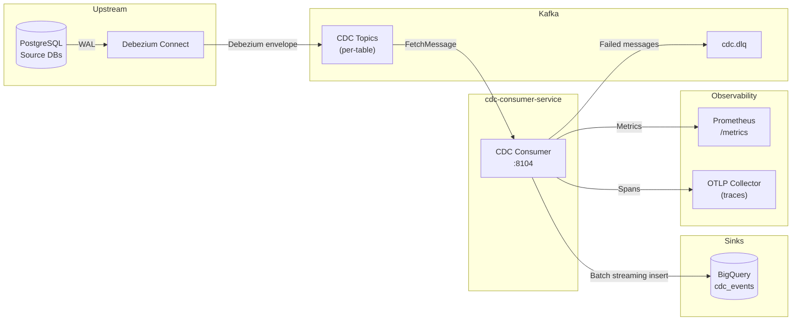
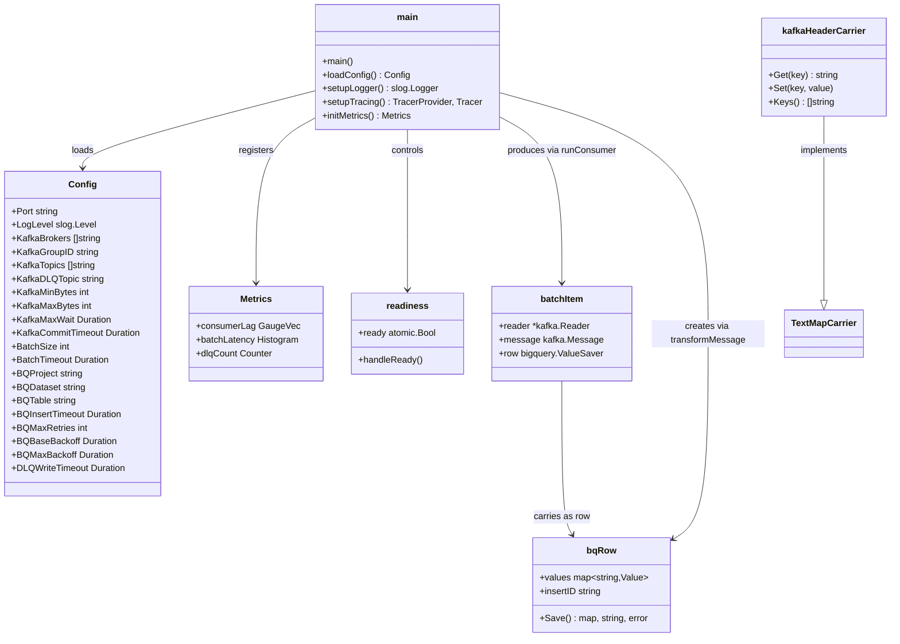
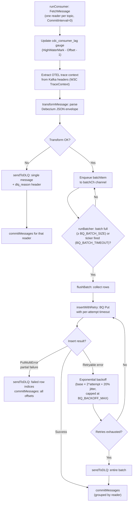
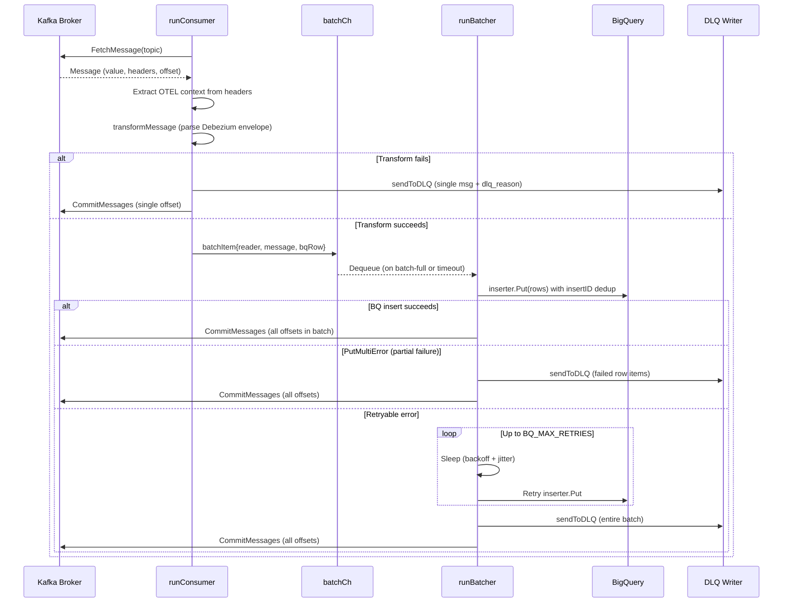

# CDC Consumer Service

> **Go · Debezium CDC → BigQuery Sink with Dead-Letter Queue**
>
> **Port:** 8104 &nbsp;|&nbsp; **Helm key:** `cdc-consumer` &nbsp;|&nbsp; **Consumer group:** `cdc-consumer-service` &nbsp;|&nbsp; **Owner:** Data Platform

Consumes Change Data Capture (CDC) events from Debezium-managed Kafka topics, transforms Debezium envelopes into BigQuery-compatible rows, and batch-inserts them into BigQuery with automatic retries and exponential backoff. Failed messages are routed to a Kafka Dead-Letter Queue (`cdc.dlq`) with full provenance metadata for operator replay.

This service is part of the **event data plane** layer alongside `outbox-relay-service` (domain event relay) and `stream-processor-service` (real-time metrics). The outbox relay produces canonical domain events; the CDC consumer captures every row mutation (including schema migration side effects) as raw Debezium envelopes for audit, replay, and data-lineage purposes. These are **complementary, not redundant** paths.

---

## Table of Contents

- [Service Role and Boundaries](#service-role-and-boundaries)
- [High-Level Design](#high-level-design)
- [Low-Level Design](#low-level-design)
- [CDC / Event-Consumption Flows](#cdc--event-consumption-flows)
- [Runtime and Configuration](#runtime-and-configuration)
- [Dependencies](#dependencies)
- [Observability](#observability)
- [Testing](#testing)
- [Failure Modes](#failure-modes)
- [Rollout and Rollback](#rollout-and-rollback)
- [Known Limitations](#known-limitations)
- [Q-Commerce Event Plane Comparison](#q-commerce-event-plane-comparison)

---

## Service Role and Boundaries

| Aspect | Detail |
|---|---|
| **Purpose** | Sink all Debezium CDC topics into a single BigQuery table (`cdc_events`) for analytics, audit trail, and data lineage |
| **Input** | Kafka topics produced by Debezium Connect (e.g. `orders_db.public.orders`), configured via `KAFKA_TOPICS` |
| **Output** | BigQuery streaming inserts into `{BQ_PROJECT}.{BQ_DATASET}.{BQ_TABLE}` |
| **Side-effect** | Failed messages land in `cdc.dlq` Kafka topic with provenance headers |
| **Delivery guarantee** | At-least-once to BigQuery (DLQ-safe); offsets are committed only after successful BQ insert or DLQ write |
| **Idempotency** | BigQuery `insertID = {topic}-{partition}-{offset}` provides dedup within BQ's ~1 minute streaming dedup window |
| **Owns** | The `cdc.dlq` topic; the `cdc_events` BigQuery table schema |
| **Does NOT own** | Debezium Connect configuration; upstream database schemas; domain event semantics (that is `outbox-relay-service`) |

**Boundary with sibling services:**

- `outbox-relay-service` reads the application-level `outbox_events` table and produces domain events to canonical topics (e.g. `orders.events`). This service reads the Debezium CDC topics that capture raw WAL-level changes.
- `stream-processor-service` consumes domain event topics for real-time operational metrics in Redis. This service consumes CDC topics for analytics/warehouse ingestion.

---

## High-Level Design



---

## Low-Level Design

### Project Structure

```
cdc-consumer-service/
├── main.go         # All logic: config, consumer, batcher, transform, retry, DLQ, HTTP, metrics, tracing
├── Dockerfile      # Multi-stage (golang:1.26-alpine → alpine:3.23), non-root, HEALTHCHECK
└── go.mod          # Module: github.com/instacommerce/cdc-consumer-service
```

### Component / UML Diagram



### Core Goroutine Model

The service runs `N+2` goroutines (where N = number of configured topics):

| Goroutine | Count | Responsibility |
|---|---|---|
| `runConsumer` | N (one per topic) | `FetchMessage` → transform → enqueue to `batchCh` |
| `runBatcher` | 1 | Drain `batchCh` → flush to BQ on batch-full or timeout → commit offsets |
| HTTP server | 1 | Health, readiness, Prometheus metrics |

Communication: `runConsumer` goroutines write `batchItem` structs to a buffered channel (`batchCh`, capacity = `BatchSize * 2`). The single `runBatcher` goroutine drains the channel.

**Shutdown sequence:** `SIGINT`/`SIGTERM` → set readiness to false → cancel context → wait for consumers to stop → close `batchCh` → batcher flushes remaining items → HTTP server graceful shutdown (15 s timeout) → tracer provider flush (10 s timeout).

---

## CDC / Event-Consumption Flows

### End-to-End Pipeline Flow



### Sequence Diagram: Message Lifecycle



### DLQ Message Envelope

Each message written to `cdc.dlq` preserves all original Kafka headers and appends provenance metadata:

| Header | Value |
|---|---|
| `dlq_reason` | Truncated error string (max 512 chars) |
| `original_topic` | Source CDC topic name |
| `original_partition` | Source partition number |
| `original_offset` | Source message offset |
| `trace_id` | OTEL trace ID (if available in span context) |

The DLQ writer uses `RequiredAcks: All` (synchronous, fully replicated) and `Async: false`. The `cdc.dlq` topic should have a retention policy of ≥ 72 hours to give operators a window for diagnosis and replay.

### BigQuery Row Schema

Each CDC event is transformed into the following row via `transformMessage`:

| Column | Type | Source |
|---|---|---|
| `topic` | STRING | `msg.Topic` |
| `partition` | INTEGER | `msg.Partition` |
| `offset` | INTEGER | `msg.Offset` |
| `key` | STRING | `msg.Key` (UTF-8 or base64 if non-UTF-8) |
| `op` | STRING | Debezium `payload.op` (`c`=create, `u`=update, `d`=delete, `r`=snapshot read) |
| `ts_ms` | INTEGER | Debezium `payload.ts_ms` (epoch milliseconds) |
| `source` | STRING | Debezium `payload.source` (JSON) |
| `before` | STRING | `payload.before` pre-change state (JSON) |
| `after` | STRING | `payload.after` post-change state (JSON) |
| `payload` | STRING | Full Debezium inner `payload` (JSON) |
| `headers` | STRING | All Kafka headers (JSON map) |
| `raw` | STRING | Complete raw message value |
| `kafka_timestamp` | TIMESTAMP | `msg.Time` |
| `ingested_at` | TIMESTAMP | `time.Now()` at transform time |

The BQ inserter is configured with `IgnoreUnknownValues: true` and `SkipInvalidRows: true` to avoid full-batch rejection from schema drift.

---

## Runtime and Configuration

### Environment Variables

| Variable | Default | Description |
|---|---|---|
| `PORT` / `SERVER_PORT` | `8104` | HTTP listen port for health/metrics |
| `KAFKA_BROKERS` | **(required)** | Comma-separated Kafka broker addresses |
| `KAFKA_TOPICS` | **(required)** | Comma-separated Debezium CDC topic names |
| `KAFKA_GROUP_ID` | `cdc-consumer-service` | Consumer group ID |
| `KAFKA_DLQ_TOPIC` | `cdc.dlq` | Dead-letter queue topic |
| `KAFKA_MIN_BYTES` | `10240` (10 KB) | Min fetch bytes per poll |
| `KAFKA_MAX_BYTES` | `10485760` (10 MB) | Max fetch bytes per poll |
| `KAFKA_MAX_WAIT` | `5s` | Max wait time for fetch to fill |
| `KAFKA_COMMIT_TIMEOUT` | `10s` | Timeout for offset commit calls |
| `BQ_PROJECT` | **(required)** | GCP project ID for BigQuery |
| `BQ_DATASET` | **(required)** | BigQuery dataset name |
| `BQ_TABLE` | **(required)** | BigQuery table name |
| `BQ_BATCH_SIZE` | `500` | Rows accumulated before flush |
| `BQ_BATCH_TIMEOUT` | `5s` | Max wait before flushing a partial batch |
| `BQ_INSERT_TIMEOUT` | `30s` | Timeout per BigQuery insert attempt |
| `BQ_MAX_RETRIES` | `5` | Max retry attempts for retryable BQ errors |
| `BQ_BACKOFF_BASE` | `1s` | Base duration for exponential backoff |
| `BQ_BACKOFF_MAX` | `30s` | Cap on backoff duration |
| `DLQ_WRITE_TIMEOUT` | `10s` | Timeout for DLQ Kafka writes |
| `LOG_LEVEL` | `info` | Structured log level (`debug`, `info`, `warn`, `error`) |
| `OTEL_EXPORTER_OTLP_ENDPOINT` | — | OTLP gRPC endpoint; `http://` scheme uses insecure transport |

### HTTP Endpoints

| Endpoint | Method | Response |
|---|---|---|
| `GET /health` | GET, HEAD | `{"status":"ok"}` — liveness probe |
| `GET /health/live` | GET, HEAD | `{"status":"ok"}` — alias for liveness |
| `GET /ready` | GET, HEAD | `{"status":"ready"}` (200) or `{"status":"not_ready"}` (503) |
| `GET /health/ready` | GET, HEAD | Alias for `/ready` |
| `GET /metrics` | GET | Prometheus exposition format via `promhttp.Handler()` |

### Helm / Kubernetes Defaults

From `deploy/helm/values.yaml`:

| Setting | Value |
|---|---|
| Helm key | `cdc-consumer` |
| Replicas | 2 (both dev and prod) |
| HPA | min 2, max 6, target CPU 70% |
| Requests | 500m CPU, 512 Mi memory |
| Limits | 1000m CPU, 1024 Mi memory |
| Readiness probe | `/health/ready` |
| Liveness probe | `/health/live` |

**CI mapping:** The Go module name `cdc-consumer-service` maps to Helm deploy key `cdc-consumer` in `.github/workflows/ci.yml`.

### Dockerfile

Multi-stage build: `golang:1.26-alpine` → `alpine:3.23`. Runs as non-root user `app:1001`. Built with `-trimpath -ldflags="-s -w"` for minimal binary size. Docker `HEALTHCHECK` hits `/health` every 30 s.

---

## Dependencies

| Dependency | Version | Purpose |
|---|---|---|
| Go | 1.25+ (per `go.mod`) | Runtime |
| `cloud.google.com/go/bigquery` | v1.74.0 | BigQuery streaming insert client |
| `github.com/segmentio/kafka-go` | v0.4.50 | Kafka consumer (FetchMessage/CommitMessages) and DLQ writer |
| `github.com/prometheus/client_golang` | v1.23.2 | Prometheus metrics registration and HTTP handler |
| `go.opentelemetry.io/otel` | v1.41.0 | OpenTelemetry tracing SDK |
| `go.opentelemetry.io/otel/exporters/otlp/otlptrace/otlptracegrpc` | v1.41.0 | OTLP gRPC trace exporter |
| `google.golang.org/api` | v0.265.0 | Google API error types for retryable-error classification |

**External systems:**

- Kafka cluster (Debezium CDC topics + DLQ topic)
- BigQuery (GCP project with dataset/table pre-provisioned)
- OTLP-compatible collector (optional; tracing degrades gracefully if unavailable)

---

## Observability

### Metrics

| Metric | Type | Labels | Description | Alert Threshold |
|---|---|---|---|---|
| `cdc_consumer_lag` | Gauge | `topic`, `partition` | Kafka consumer lag (HWM − offset − 1) | > 5000 for 10 min |
| `cdc_batch_latency_seconds` | Histogram | — | BigQuery batch insert latency (default buckets) | P99 > 10 s |
| `cdc_dlq_total` | Counter | — | Total messages sent to DLQ | rate > 1/min |

### Tracing

- Spans: `kafka.consume` (per-message, with topic/partition/offset attributes), `bigquery.batch.insert` (per-flush, with batch size and table attributes), `kafka.dlq.write` (per-DLQ batch).
- Trace context propagation: W3C TraceContext extracted from Kafka message headers via `kafkaHeaderCarrier` implementing `propagation.TextMapCarrier`.
- Exporter: OTLP gRPC. Falls back to a no-op provider if the endpoint is unset or unreachable.

### Structured Logging

JSON-formatted via `slog.NewJSONHandler` to stdout. Key events logged: service start/stop, BigQuery retry attempts, DLQ writes (with count and reason), commit failures.

---

## Testing

### Build and Test Commands

```bash
# Build
cd services/cdc-consumer-service && go build ./...

# Run all tests
cd services/cdc-consumer-service && go test -race ./...

# Run a specific test
cd services/cdc-consumer-service && go test -race ./... -run '^TestName$'
```

### CI Integration

Path filter `services/cdc-consumer-service/**` in `.github/workflows/ci.yml` triggers Go build/test. Changes to `services/go-shared` also trigger revalidation of all Go modules including this one.

### Local Run

```bash
# Start infrastructure
docker-compose up -d   # Kafka, PostgreSQL, Debezium, etc.

# Run locally
cd services/cdc-consumer-service
KAFKA_BROKERS="localhost:9092" \
  KAFKA_TOPICS="orders_db.public.orders,payments_db.public.payments" \
  BQ_PROJECT="my-project" BQ_DATASET="warehouse" BQ_TABLE="cdc_events" \
  go run .

# Docker
docker build -t cdc-consumer-service .
docker run -e KAFKA_BROKERS="..." -e KAFKA_TOPICS="..." \
  -e BQ_PROJECT="..." -e BQ_DATASET="..." -e BQ_TABLE="..." \
  -p 8104:8104 cdc-consumer-service
```

---

## Failure Modes

| Scenario | Behavior | Recovery |
|---|---|---|
| **Malformed Debezium JSON** | `transformMessage` returns error → single message sent to DLQ → offset committed | Inspect `cdc.dlq` messages with `dlq_reason` header; fix upstream schema |
| **BigQuery transient error** (429, 5xx, timeout) | Exponential backoff retry up to `BQ_MAX_RETRIES` (default 5, backoff 1 s → 30 s + 20% jitter) | Self-heals if BQ recovers within retry window |
| **BigQuery permanent error** (400, 403) | Not retryable → entire batch sent to DLQ → offsets committed | Fix BQ permissions/schema, then replay from DLQ |
| **BigQuery partial row failure** (`PutMultiError`) | Only failed row indices sent to DLQ; all offsets committed | Investigate row-level errors in DLQ `dlq_reason` |
| **DLQ write failure** | `sendToDLQ` returns error → `runBatcher` returns error → `reportErr` → service shuts down | Kubernetes restarts pod; uncommitted offsets cause batch re-fetch; BQ `insertID` deduplicates the replay |
| **Kafka commit timeout** | `commitMessages` returns error → `flushBatch` returns error → service shuts down | Restart re-fetches uncommitted offsets; BQ `insertID` deduplicates |
| **Kafka fetch failure** (not context cancellation) | `runConsumer` calls `reportErr` → service shuts down | Kubernetes restart; consumer group rebalances |
| **OTLP exporter unreachable** | Falls back to no-op tracer provider; no crash, no data loss | Fix collector endpoint; traces resume |
| **Service restart mid-batch** | Uncommitted offsets replayed from Kafka; BQ `insertID` provides dedup within ~1 minute window | Safe for restarts within BQ dedup window |

**Critical invariant:** Offsets are committed **only after** either a successful BQ insert or a successful DLQ write. If neither succeeds, the service shuts down and Kubernetes restarts it, causing the uncommitted batch to be re-processed. This is the correct backpressure behavior.

---

## Rollout and Rollback

### Deployment

- GitOps via ArgoCD; Helm chart under `deploy/helm/` with environment overrides in `values-dev.yaml` / `values-prod.yaml`.
- HPA scales from 2 to 6 replicas based on CPU.
- Consumer group rebalancing is automatic on scale-up/down; `kafka-go` handles partition reassignment.

### Safe Rollout Checklist

1. **Pre-deploy:** Confirm `cdc_consumer_lag` is stable; verify BQ table schema accepts any new Debezium fields.
2. **Deploy:** Rolling update (default Kubernetes strategy). New pods join the consumer group; old pods leave. Kafka rebalances partitions.
3. **Verify:** Watch `cdc_consumer_lag` (should not spike persistently), `cdc_dlq_total` (rate should stay ≤ baseline), `cdc_batch_latency_seconds` P99.
4. **Rollback trigger:** Sustained DLQ rate increase or consumer lag growth > 5000 for > 10 minutes.

### Rollback

- ArgoCD rollback to previous image tag, or `helm rollback`.
- Consumer group re-joins with old code; uncommitted offsets are replayed.
- No data migration required — BigQuery table is append-only with `insertID` dedup.

---

## Known Limitations

| Limitation | Impact | Mitigation |
|---|---|---|
| **BQ `insertID` dedup window is ~1 minute** | DLQ replays hours later may produce duplicate rows in BigQuery | Use a `DEDUP` view (`SELECT DISTINCT` on `topic + partition + offset`) or BigQuery MERGE for long-delay replays |
| **Single-binary architecture** | All logic in `main.go`; no unit-testable interfaces for consumer, batcher, or BQ client | Extract interfaces for `Inserter`, `DLQWriter`, and `Reader` to enable table-driven unit tests and mocks |
| **No DLQ replay tooling** | `cdc.dlq` messages must be manually re-processed | Build a replay consumer or use `kcat`/`kafkacat` to re-produce from DLQ back to source topics |
| **No circuit breaker on BQ** | Sustained BQ outage causes repeated retry cycles → DLQ → restart loops | Add a circuit breaker that short-circuits to DLQ after N consecutive batch failures |
| **No backpressure signal to Debezium** | If this consumer is slow, Debezium continues writing to Kafka; lag grows unbounded | Monitor `cdc_consumer_lag` and scale replicas or increase `BQ_BATCH_SIZE` |
| **`SkipInvalidRows` / `IgnoreUnknownValues` on inserter** | Silently drops rows that do not match BQ schema without surfacing which rows were skipped | These rows are not counted in `cdc_dlq_total`; consider logging or metering skipped-row counts |
| **`rand.Seed` deprecated pattern** | `rand.Seed(time.Now().UnixNano())` in `main()` — deprecated since Go 1.20; auto-seeded by runtime | Low impact; remove for cleanliness |
| **Dockerfile EXPOSE port mismatch** | `ENV PORT=8104` but `EXPOSE 8125` — the EXPOSE directive is cosmetically incorrect | Correct `EXPOSE` to `8104` in a future change |

---

## Q-Commerce Event Plane Comparison

The CDC-consumer's design — Debezium CDC → Kafka → batch BigQuery sink with DLQ — maps to a well-established pattern in q-commerce data platforms. Per public engineering disclosures and industry references (see `docs/reviews/iter3/benchmarks/`):

| Aspect | InstaCommerce (this service) | Industry Pattern |
|---|---|---|
| **CDC mechanism** | Debezium Connect (PostgreSQL WAL) | Standard; Debezium is the dominant open-source CDC connector. Operators like Swiggy Instamart and others use similar WAL-based CDC pipelines for real-time data lake ingestion. |
| **Sink target** | BigQuery streaming insert | Common for GCP-native stacks. Alternatives include Kafka Connect BigQuery Sink Connector (managed, but less control over DLQ/retry) or Dataflow/Beam (higher latency, better exactly-once). |
| **Delivery guarantee** | At-least-once with `insertID` dedup | Industry standard for streaming analytics. Exactly-once to BQ requires Dataflow or BQ Storage Write API with committed streams — neither is used here. |
| **DLQ maturity** | Full provenance headers, synchronous writes, separate from relay DLQ | Ahead of many q-commerce implementations; the `docs/reviews/iter3/services/event-data-plane.md` review notes this is the most mature DLQ in the platform. |
| **Outbox + CDC separation** | Outbox relay for domain events, CDC consumer for raw table changes | Matches Kleppmann's dual-purpose pattern (DDIA Ch. 11): outbox for application-level contracts, CDC for infrastructure-level data capture. |

**Key differentiator:** The explicit separation of the `outbox.relay.dlq` (domain events that failed Kafka ingestion) from `cdc.dlq` (analytics events that failed BigQuery ingestion) is a sound architectural decision, as the replay semantics and consumer audiences differ.
