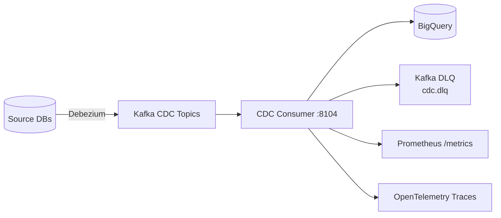
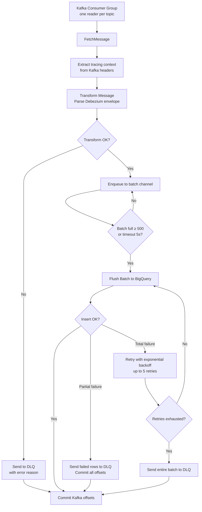
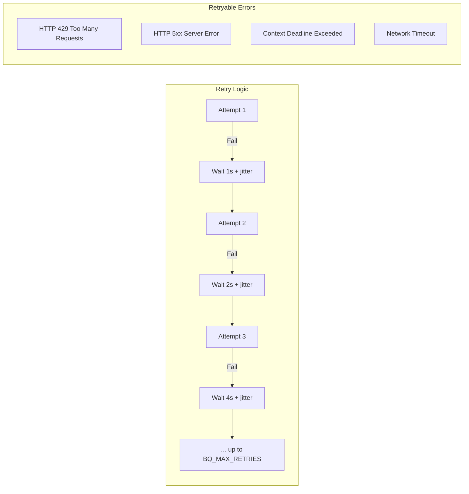
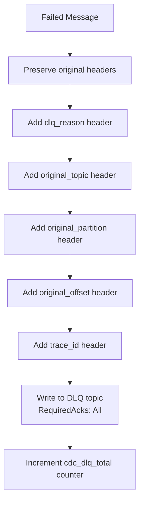

# CDC Consumer Service

> **Go · Debezium CDC Event Consumer with BigQuery Sink & Dead-Letter Queue**

Consumes Change Data Capture (CDC) events from Debezium-managed Kafka topics, transforms them into BigQuery-compatible rows, and batch-inserts into BigQuery with automatic retries and exponential backoff. Failed messages are routed to a Kafka Dead-Letter Queue (DLQ) with full provenance metadata.

## Architecture



## CDC Pipeline Flow



## Batch Insert Strategy



## DLQ Handling



## Project Structure

```
cdc-consumer-service/
├── main.go         # Consumer group, BigQuery batch inserter, DLQ writer, transform, retry
├── Dockerfile
└── go.mod
```

## BigQuery Row Schema

Each CDC event is transformed into the following BigQuery row:

| Column | Type | Description |
|---|---|---|
| `topic` | STRING | Source Kafka topic |
| `partition` | INTEGER | Kafka partition |
| `offset` | INTEGER | Kafka offset |
| `key` | STRING | Message key (UTF-8 or base64) |
| `op` | STRING | Debezium operation (`c`, `u`, `d`, `r`) |
| `ts_ms` | INTEGER | Debezium timestamp (ms) |
| `source` | STRING | Debezium source metadata (JSON) |
| `before` | STRING | Pre-change state (JSON) |
| `after` | STRING | Post-change state (JSON) |
| `payload` | STRING | Full Debezium payload (JSON) |
| `headers` | STRING | Kafka headers (JSON) |
| `raw` | STRING | Raw message value |
| `kafka_timestamp` | TIMESTAMP | Kafka message timestamp |
| `ingested_at` | TIMESTAMP | Ingestion timestamp |

## Configuration

| Variable | Default | Description |
|---|---|---|
| `PORT` / `SERVER_PORT` | `8104` | HTTP listen port |
| `KAFKA_BROKERS` | **(required)** | Comma-separated broker list |
| `KAFKA_TOPICS` | **(required)** | Comma-separated CDC topic list |
| `KAFKA_GROUP_ID` | `cdc-consumer-service` | Consumer group ID |
| `KAFKA_DLQ_TOPIC` | `cdc.dlq` | Dead-letter queue topic |
| `KAFKA_MIN_BYTES` | `10240` | Min fetch bytes |
| `KAFKA_MAX_BYTES` | `10485760` | Max fetch bytes |
| `KAFKA_MAX_WAIT` | `5s` | Max fetch wait |
| `KAFKA_COMMIT_TIMEOUT` | `10s` | Commit timeout |
| `BQ_PROJECT` | **(required)** | BigQuery project ID |
| `BQ_DATASET` | **(required)** | BigQuery dataset |
| `BQ_TABLE` | **(required)** | BigQuery table |
| `BQ_BATCH_SIZE` | `500` | Rows per batch insert |
| `BQ_BATCH_TIMEOUT` | `5s` | Max wait before flushing batch |
| `BQ_INSERT_TIMEOUT` | `30s` | Per-insert timeout |
| `BQ_MAX_RETRIES` | `5` | Max insert retry attempts |
| `BQ_BACKOFF_BASE` | `1s` | Base backoff duration |
| `BQ_BACKOFF_MAX` | `30s` | Max backoff cap |
| `DLQ_WRITE_TIMEOUT` | `10s` | DLQ write timeout |
| `LOG_LEVEL` | `info` | Log level |
| `OTEL_EXPORTER_OTLP_ENDPOINT` | — | OTLP gRPC endpoint for tracing |

## Key Metrics

| Metric | Type | Description |
|---|---|---|
| `cdc_consumer_lag` | Gauge | Consumer lag per topic/partition |
| `cdc_batch_latency_seconds` | Histogram | BigQuery batch insert latency |
| `cdc_dlq_total` | Counter | Messages sent to DLQ |

## API Reference

### `GET /health` · `GET /health/live`

Returns `{"status":"ok"}`.

### `GET /ready` · `GET /health/ready`

Returns `{"status":"ready"}` when consumers are initialized and processing.

### `GET /metrics`

Prometheus metrics endpoint.

## Build & Run

```bash
# Local
go build -o cdc-consumer .
KAFKA_BROKERS="localhost:9092" KAFKA_TOPICS="cdc.orders,cdc.payments" \
  BQ_PROJECT="my-project" BQ_DATASET="warehouse" BQ_TABLE="cdc_events" \
  ./cdc-consumer

# Docker
docker build -t cdc-consumer-service .
docker run -e KAFKA_BROKERS="..." -e KAFKA_TOPICS="..." \
  -e BQ_PROJECT="..." -e BQ_DATASET="..." -e BQ_TABLE="..." \
  -p 8104:8104 cdc-consumer-service
```

## Dependencies

- Go 1.22+
- `cloud.google.com/go/bigquery` (BigQuery client)
- `github.com/segmentio/kafka-go` (Kafka consumer + DLQ writer)
- `github.com/prometheus/client_golang` (metrics)
- OpenTelemetry SDK + OTLP gRPC exporter
