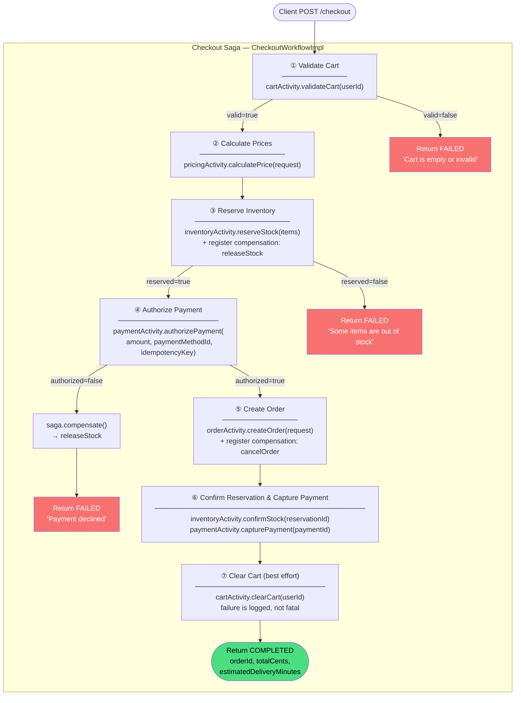
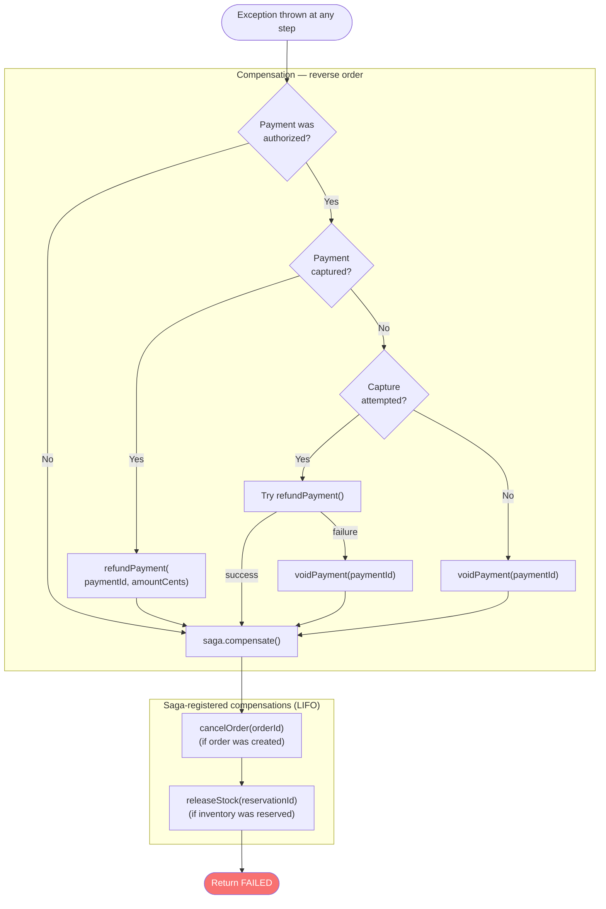
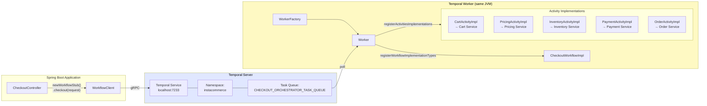
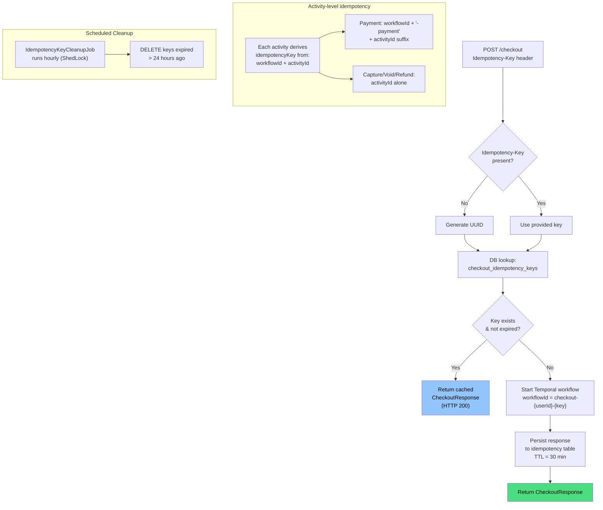

# Checkout Orchestrator Service

Temporal-based saga orchestrator for the InstaCommerce checkout workflow. Coordinates cart validation, pricing calculation, inventory reservation, payment authorization, and order creation — with full compensation (rollback) on failure at any step.

## Table of Contents

- [Architecture Overview](#architecture-overview)
- [Checkout Saga Workflow](#checkout-saga-workflow)
- [Compensation Flow](#compensation-flow)
- [Temporal Workflow Architecture](#temporal-workflow-architecture)
- [Idempotency Handling](#idempotency-handling)
- [Activity Timeout Configuration](#activity-timeout-configuration)
- [Key Components](#key-components)
- [API Reference](#api-reference)
- [Configuration](#configuration)
- [Running Locally](#running-locally)

---

## Architecture Overview

The service acts as a pure orchestrator — it owns no domain data. It starts a Temporal workflow for each checkout request and delegates every step to a downstream microservice via REST. Temporal provides durable execution, automatic retries, and saga-based compensation.

```
Client → CheckoutController → Temporal WorkflowClient → CheckoutWorkflow
                                                             │
              ┌──────────┬───────────┬───────────┬───────────┤
              ▼          ▼           ▼           ▼           ▼
         CartActivity  Pricing   Inventory   Payment    OrderActivity
              │        Activity   Activity   Activity        │
              ▼          ▼           ▼           ▼           ▼
         Cart Service  Pricing   Inventory   Payment    Order Service
                       Service    Service    Service
```

---

## Checkout Saga Workflow

The workflow executes seven steps sequentially. Each step that produces a side effect registers a compensation action before proceeding.



---

## Compensation Flow

When an exception occurs, compensations run **sequentially in reverse registration order**. Payment compensation uses a three-tier strategy: refund → void → log.



### Failure-point compensation matrix

| Failure Point | Inventory Released | Payment Voided/Refunded | Order Cancelled |
|---|:---:|:---:|:---:|
| Cart validation fails | — | — | — |
| Pricing fails | — | — | — |
| Inventory reservation fails | — | — | — |
| Payment authorization declined | ✅ releaseStock | — | — |
| Order creation fails | ✅ releaseStock | ✅ void/refund | — |
| Inventory confirm fails | ✅ releaseStock | ✅ void/refund | ✅ cancelOrder |
| Payment capture fails | ✅ releaseStock | ✅ refund/void | ✅ cancelOrder |

---

## Temporal Workflow Architecture



### Workflow lifecycle

1. `CheckoutController` creates a `WorkflowStub` with a deterministic workflow ID (`checkout-{userId}-{idempotencyKey}`) and a 5-minute execution timeout.
2. The stub submits the workflow to Temporal via gRPC.
3. The `Worker` polls `CHECKOUT_ORCHESTRATOR_TASK_QUEUE`, picks up the task, and executes `CheckoutWorkflowImpl.checkout()`.
4. Each activity call is individually scheduled by Temporal with its own timeout and retry policy.
5. On success, the `CheckoutResponse` is returned synchronously to the controller.
6. On failure, Temporal's `Saga` helper runs registered compensations in reverse order.

---

## Idempotency Handling

Idempotency is enforced at **two layers**: the HTTP API layer and the Temporal activity layer.



### Idempotency key storage

| Column | Type | Description |
|---|---|---|
| `id` | `UUID` | Primary key |
| `idempotency_key` | `VARCHAR(255)` | Unique client-supplied or auto-generated key |
| `checkout_response` | `TEXT` | JSON-serialized `CheckoutResponse` |
| `created_at` | `TIMESTAMPTZ` | Row creation time |
| `expires_at` | `TIMESTAMPTZ` | Key expiry (30 min after creation) |

Expired keys are cleaned up hourly by `IdempotencyKeyCleanupJob` using ShedLock for distributed lock safety.

---

## Activity Timeout Configuration

Each activity has independently tuned timeouts and retry policies based on the downstream service characteristics.

```mermaid
gantt
    title Activity Timeout Budget (per attempt)
    dateFormat X
    axisFormat %ss

    section Cart
    StartToClose 10s           : 0, 10

    section Pricing
    StartToClose 10s           : 0, 10

    section Inventory
    StartToClose 15s           : 0, 15

    section Payment (Auth)
    StartToClose 30s           : 0, 30
    ScheduleToClose 45s        : 0, 45

    section Order
    StartToClose 15s           : 0, 15
```



| Activity | StartToClose | ScheduleToClose | Max Attempts | Initial Interval | Backoff | Non-Retryable Exceptions |
|---|:---:|:---:|:---:|:---:|:---:|---|
| **CartActivity** | 10 s | — | 3 | 1 s | 2.0× | — |
| **PricingActivity** | 10 s | — | 3 | 1 s | 2.0× | — |
| **InventoryActivity** | 15 s | — | 3 | 1 s | 2.0× | `InsufficientStockException` |
| **PaymentActivity** | 30 s | 45 s | 3 | 2 s | 2.0× | `PaymentDeclinedException` |
| **OrderActivity** | 15 s | — | 3 | 1 s | 2.0× | — |

**Workflow execution timeout**: 5 minutes (set by the controller when starting the workflow).

---

## Key Components

### Controller

| Class | Path | Responsibility |
|---|---|---|
| `CheckoutController` | `controller/` | Accepts checkout requests, enforces auth, manages idempotency, starts Temporal workflow |

### Workflow

| Class | Path | Responsibility |
|---|---|---|
| `CheckoutWorkflow` | `workflow/` | `@WorkflowInterface` — defines `checkout()` and `getStatus()` query |
| `CheckoutWorkflowImpl` | `workflow/` | Saga orchestration logic: step sequencing, compensation registration, payment compensation strategy |

### Activities

| Interface | Implementation | Downstream Service | Methods |
|---|---|---|---|
| `CartActivity` | `CartActivityImpl` | Cart Service (`:8084`) | `validateCart`, `clearCart` |
| `PricingActivity` | `PricingActivityImpl` | Pricing Service (`:8087`) | `calculatePrice` |
| `InventoryActivity` | `InventoryActivityImpl` | Inventory Service (`:8083`) | `reserveStock`, `releaseStock`, `confirmStock` |
| `PaymentActivity` | `PaymentActivityImpl` | Payment Service (`:8086`) | `authorizePayment`, `capturePayment`, `voidPayment`, `refundPayment` |
| `OrderActivity` | `OrderActivityImpl` | Order Service (`:8085`) | `createOrder`, `cancelOrder` |

### Configuration

| Class | Responsibility |
|---|---|
| `TemporalConfig` | Creates `WorkflowServiceStubs`, `WorkflowClient`, `WorkerFactory`; registers workflow and activities |
| `TemporalProperties` | Binds `temporal.*` config (service address, namespace, task queue) |
| `CheckoutProperties` | Binds `checkout.*` config (JWT, downstream client URLs/timeouts) |
| `RestClientConfig` | Creates per-service `RestTemplate` beans with base URL, timeouts, and internal auth interceptor |
| `ShedLockConfig` | Configures ShedLock for distributed job locking |

### Infrastructure

| Class | Responsibility |
|---|---|
| `IdempotencyKeyCleanupJob` | Hourly scheduled job to purge expired idempotency keys (ShedLock-protected) |
| `GlobalExceptionHandler` | Maps `CheckoutException`, `WorkflowException`, validation, and downstream errors to structured JSON responses |
| `JwtAuthenticationFilter` | Extracts and validates JWT from `Authorization` header |

---

## API Reference

### `POST /checkout`

Initiates a checkout workflow.

**Headers**

| Header | Required | Description |
|---|:---:|---|
| `Authorization` | ✅ | `Bearer <JWT>` — subject must match `userId` in body |
| `Idempotency-Key` | ❌ | Client-supplied key for duplicate detection. Auto-generated if absent. |

**Request body**

```json
{
  "userId": "u_abc123",
  "paymentMethodId": "pm_xyz789",
  "couponCode": "SAVE10",
  "deliveryAddressId": "addr_456"
}
```

| Field | Type | Required | Description |
|---|---|:---:|---|
| `userId` | `String` | ✅ | Authenticated user's ID |
| `paymentMethodId` | `String` | ✅ | Saved payment method identifier |
| `couponCode` | `String` | ❌ | Discount coupon code |
| `deliveryAddressId` | `String` | ✅ | Delivery address identifier |

**Success response** — `200 OK`

```json
{
  "orderId": "ord_abc123",
  "status": "COMPLETED",
  "totalCents": 4599,
  "estimatedDeliveryMinutes": 35
}
```

**Failure response** — `200 OK` (workflow-level failure)

```json
{
  "orderId": null,
  "status": "FAILED: Payment declined: insufficient_funds",
  "totalCents": 0,
  "estimatedDeliveryMinutes": 0
}
```

**Error responses**

| Status | Code | Cause |
|---|---|---|
| `400` | `VALIDATION_ERROR` | Missing or invalid request fields |
| `403` | `FORBIDDEN` | JWT subject ≠ request `userId` |
| `500` | `CHECKOUT_WORKFLOW_FAILED` | Unrecoverable Temporal workflow error |
| `503` | `DOWNSTREAM_UNAVAILABLE` | Downstream service unreachable |

---

### `GET /checkout/{workflowId}/status`

Queries the current status of an in-flight checkout workflow via Temporal's query mechanism.

**Response** — `200 OK`

```json
{
  "workflowId": "checkout-u_abc123-key123",
  "status": "AUTHORIZING_PAYMENT"
}
```

**Possible status values**: `STARTED`, `VALIDATING_CART`, `CALCULATING_PRICES`, `RESERVING_INVENTORY`, `AUTHORIZING_PAYMENT`, `CREATING_ORDER`, `CONFIRMING`, `CLEARING_CART`, `COMPENSATING`, `COMPLETED`, `FAILED`

---

## Configuration

### Environment Variables

| Variable | Default | Description |
|---|---|---|
| `SERVER_PORT` | `8089` | HTTP listen port |
| `CHECKOUT_DB_URL` | `jdbc:postgresql://localhost:5432/checkout` | PostgreSQL connection URL |
| `CHECKOUT_DB_USER` | `postgres` | Database username |
| `CHECKOUT_DB_PASSWORD` | — | Database password (or via secret manager) |
| `TEMPORAL_HOST` | `localhost` | Temporal gRPC host |
| `TEMPORAL_NAMESPACE` | `instacommerce` | Temporal namespace |
| `TEMPORAL_TASK_QUEUE` | `CHECKOUT_ORCHESTRATOR_TASK_QUEUE` | Temporal task queue name |
| `CART_SERVICE_URL` | `http://localhost:8084` | Cart service base URL |
| `PRICING_SERVICE_URL` | `http://localhost:8087` | Pricing service base URL |
| `INVENTORY_SERVICE_URL` | `http://localhost:8083` | Inventory service base URL |
| `PAYMENT_SERVICE_URL` | `http://localhost:8086` | Payment service base URL |
| `ORDER_SERVICE_URL` | `http://localhost:8085` | Order service base URL |
| `INTERNAL_SERVICE_TOKEN` | `dev-internal-token-change-in-prod` | Token for service-to-service auth |

---

## Running Locally

```bash
# 1. Start dependencies (Temporal + PostgreSQL)
docker compose up temporal postgresql -d

# 2. Run the service
./gradlew :services:checkout-orchestrator-service:bootRun

# 3. Trigger a checkout
curl -X POST http://localhost:8089/checkout \
  -H "Content-Type: application/json" \
  -H "Authorization: Bearer <jwt>" \
  -H "Idempotency-Key: test-key-001" \
  -d '{
    "userId": "u_abc123",
    "paymentMethodId": "pm_xyz789",
    "deliveryAddressId": "addr_456"
  }'

# 4. Check workflow status
curl http://localhost:8089/checkout/checkout-u_abc123-test-key-001/status
```

### Docker

```bash
docker build -t checkout-orchestrator-service .
docker run -p 8089:8089 \
  -e TEMPORAL_HOST=host.docker.internal \
  -e CHECKOUT_DB_URL=jdbc:postgresql://host.docker.internal:5432/checkout \
  checkout-orchestrator-service
```

### Health checks

| Endpoint | Purpose |
|---|---|
| `/actuator/health/liveness` | Kubernetes liveness probe |
| `/actuator/health/readiness` | Kubernetes readiness probe |
| `/actuator/prometheus` | Prometheus metrics |
