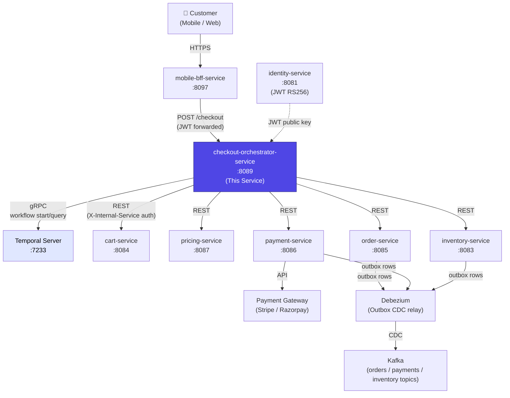
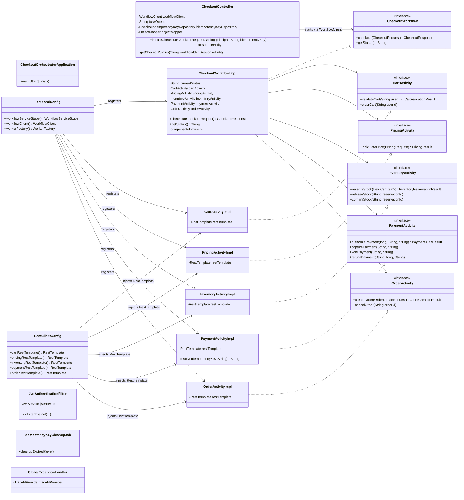
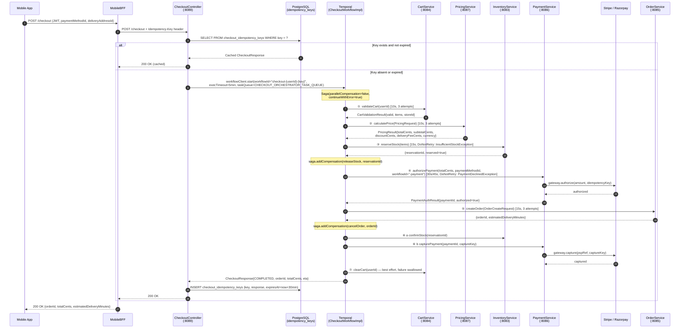
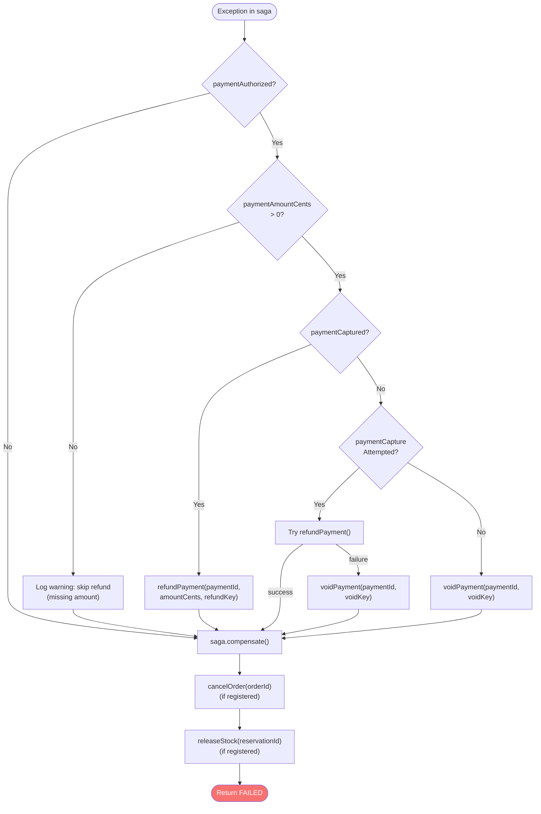
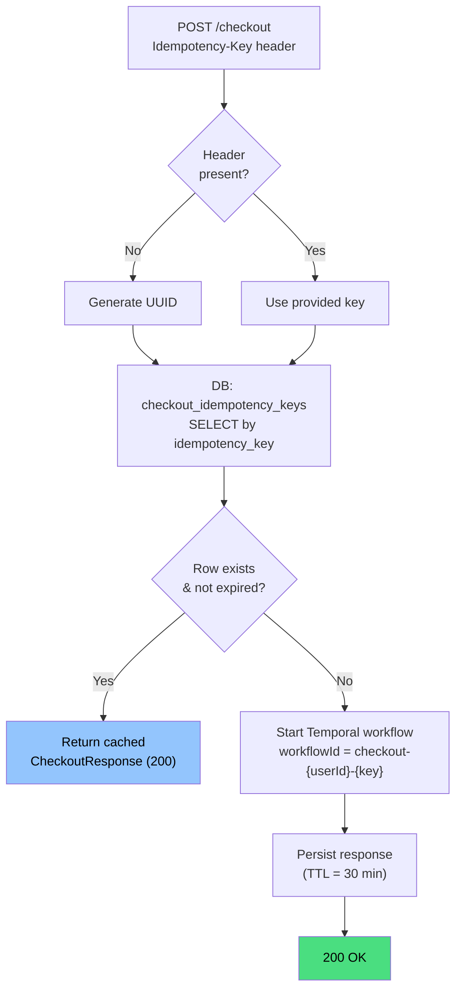

# Checkout Orchestrator Service

> **Module:** `services/checkout-orchestrator-service` · **Port:** 8089 · **Language:** Java 21 / Spring Boot · **Workflow engine:** Temporal SDK 1.22.3
>
> **Authoritative checkout saga orchestrator for InstaCommerce.** Coordinates cart validation, server-side pricing, inventory reservation, payment authorization/capture, order creation, and full compensation (rollback) on failure at any step. Owns no domain data — all state lives in downstream services; durable workflow state is managed by Temporal.

---

## Table of Contents

1.  [Service Role and Boundaries](#1-service-role-and-boundaries)
2.  [Hybrid Orchestration / Choreography Posture](#2-hybrid-orchestration--choreography-posture)
3.  [High-Level Design (HLD)](#3-high-level-design-hld)
4.  [Low-Level Design (LLD)](#4-low-level-design-lld)
5.  [Checkout Money-Path Sequence](#5-checkout-money-path-sequence)
6.  [Compensation Flow](#6-compensation-flow)
7.  [Idempotency Model](#7-idempotency-model)
8.  [Activity Timeout Configuration](#8-activity-timeout-configuration)
9.  [API Reference](#9-api-reference)
10. [Runtime and Configuration](#10-runtime-and-configuration)
11. [Dependencies](#11-dependencies)
12. [Observability](#12-observability)
13. [Testing](#13-testing)
14. [Failure Modes and Edge Cases](#14-failure-modes-and-edge-cases)
15. [Rollout and Rollback Notes](#15-rollout-and-rollback-notes)
16. [Known Limitations](#16-known-limitations)
17. [Q-Commerce Checkout Pattern Comparison](#17-q-commerce-checkout-pattern-comparison)

---

## 1. Service Role and Boundaries

### What this service owns

| Concern | Ownership |
|---|---|
| Saga step ordering and sequencing | ✅ Sole authority |
| Compensation decisions (which steps to undo, in what order) | ✅ Sole authority |
| Checkout-level idempotency cache (`checkout_idempotency_keys` table) | ✅ Sole authority |
| Temporal workflow lifecycle for checkout | ✅ Sole authority |

### What this service does NOT own

| Concern | Owner |
|---|---|
| Cart contents and validation | `cart-service` (:8084) |
| Price calculation, coupons, delivery fees | `pricing-service` (:8087) |
| Inventory reservation and stock counts | `inventory-service` (:8083) |
| Payment authorization, capture, void, refund, ledger | `payment-service` (:8086) |
| Order persistence, state machine, events | `order-service` (:8085) |
| JWT issuance and key management | `identity-service` (:8081) |

### Boundary rule

This service is a **pure orchestrator**: it holds no domain state beyond the idempotency cache. It delegates every domain operation to downstream services via synchronous REST calls wrapped as Temporal activities. Domain events (e.g., `OrderCreated`, `PaymentCaptured`, `StockReserved`) are published by the downstream services via their own outbox → Debezium → Kafka pipelines; this service does not publish events.

> **⚠️ Dual-saga defect (active):** `order-service` contains a separate `CheckoutWorkflowImpl` on task queue `CHECKOUT_TASK_QUEUE` that accepts client-supplied prices, bypassing `pricing-service`. That path is a P1 correctness defect — see the [transactional-core review](../../docs/reviews/iter3/services/transactional-core.md) §1. This service (`checkout-orchestrator-service`) is the **authoritative** checkout path.

---

## 2. Hybrid Orchestration / Choreography Posture

InstaCommerce checkout uses a **hybrid** pattern:

| Phase | Pattern | Implementation |
|---|---|---|
| **Synchronous checkout saga** | Orchestration (Temporal) | `CheckoutWorkflowImpl` sequences 7 steps via activity stubs; Temporal manages retries, timeouts, and compensation |
| **Post-checkout event propagation** | Choreography (Kafka) | Downstream services (order, payment, inventory) write outbox rows that Debezium relays to Kafka topics (`orders.events`, `payments.events`, `inventory.events`). Consumers (notification-service, fulfillment-service, rider-fleet-service) react independently |

The orchestrator controls the **transactional path** (money-path). Once the saga completes, downstream domain events drive the **fulfillment path** through loose choreography.

```
┌─────────────────────────────────────────────────────────────────┐
│ ORCHESTRATED (this service via Temporal)                        │
│ cart → pricing → inventory → payment → order → confirm/capture  │
└────────────────────────────────┬────────────────────────────────┘
                                 │ saga completes
                                 ▼
┌─────────────────────────────────────────────────────────────────┐
│ CHOREOGRAPHED (downstream services via outbox → Kafka)          │
│ OrderCreated → notification, fulfillment, rider pre-assignment  │
│ PaymentCaptured → reconciliation, ledger, fraud signals         │
│ StockConfirmed → warehouse pick queue, analytics                │
└─────────────────────────────────────────────────────────────────┘
```

---

## 3. High-Level Design (HLD)

### System context



### Architectural planes

This service sits at the boundary of the **Edge Plane** (receives JWT-authenticated requests from BFF) and the **Transactional Core Plane** (orchestrates the money-path across order, payment, and inventory).

---

## 4. Low-Level Design (LLD)

### Component diagram



### Key data types (Java records)

| Record | Fields | Source |
|---|---|---|
| `CheckoutRequest` | `userId` (required), `paymentMethodId` (required), `couponCode` (optional), `deliveryAddressId` (required) | Client via `POST /checkout` |
| `CheckoutResponse` | `orderId`, `status`, `totalCents`, `estimatedDeliveryMinutes` | Workflow result |
| `CartValidationResult` | `userId`, `items: List<CartItem>`, `valid`, `storeId` | cart-service |
| `CartItem` | `productId`, `quantity`, `unitPriceCents` | cart-service |
| `PricingRequest` | `userId`, `items`, `storeId`, `couponCode`, `deliveryAddressId` | Built by workflow |
| `PricingResult` | `subtotalCents`, `discountCents`, `deliveryFeeCents`, `totalCents`, `currency` | pricing-service |
| `InventoryReservationResult` | `reservationId`, `reserved` | inventory-service |
| `PaymentAuthResult` | `paymentId`, `authorized`, `declineReason` | payment-service |
| `OrderCreateRequest` | `userId`, `storeId`, `items`, `subtotalCents`, `discountCents`, `deliveryFeeCents`, `totalCents`, `currency`, `couponCode`, `reservationId`, `paymentId`, `deliveryAddressId`, `paymentMethodId` | Built by workflow |
| `OrderCreationResult` | `orderId`, `estimatedDeliveryMinutes` | order-service |

### Database schema (Flyway-managed)

**V1 — `checkout_idempotency_keys`**

| Column | Type | Constraint |
|---|---|---|
| `id` | `UUID` | PK, `gen_random_uuid()` |
| `idempotency_key` | `VARCHAR(255)` | UNIQUE index |
| `checkout_response` | `TEXT` | JSON-serialized `CheckoutResponse` |
| `created_at` | `TIMESTAMPTZ` | `DEFAULT now()` |
| `expires_at` | `TIMESTAMPTZ` | NOT NULL |

**V2 — `shedlock`** (standard ShedLock table for distributed job locking)

---

## 5. Checkout Money-Path Sequence

The following sequence diagram shows the full happy-path checkout including idempotency checks, all seven saga steps, and downstream event publishing.



### Idempotency key lineage through the money-path

```
Client Idempotency-Key: "ik-abc123"
  └─ workflowId: "checkout-{userId}-ik-abc123"
       ├─ authKey:        workflowId + "-payment"
       │    └─ resolvedKey: authKey + "-" + activityId     (stable across Temporal retries)
       ├─ captureKeyPrefix: authKey + "-" + paymentId
       │    └─ captureKey: captureKeyPrefix + "-capture" + "-" + activityId
       ├─ voidKey:        captureKeyPrefix + "-void" + "-" + activityId
       └─ refundKey:      captureKeyPrefix + "-refund" + "-" + activityId
```

---

## 6. Compensation Flow

When an exception occurs, `compensatePayment()` runs first (handles payment void/refund), then `saga.compensate()` runs registered compensations **sequentially in LIFO order** (`parallelCompensation=false`, `continueWithError=true`).

### Payment compensation strategy (three-tier)



### Failure-point compensation matrix

| Failure Point | Inventory Released | Payment Voided/Refunded | Order Cancelled |
|---|:---:|:---:|:---:|
| Cart validation fails | — | — | — |
| Pricing calculation fails | — | — | — |
| Inventory reservation fails | — | — | — |
| Payment authorization declined | ✅ `releaseStock` | — (not authorized) | — |
| Order creation fails | ✅ `releaseStock` | ✅ `void` | — |
| Inventory confirm fails | ✅ `releaseStock` | ✅ `void`/`refund` | ✅ `cancelOrder` |
| Payment capture fails | ✅ `releaseStock` | ✅ `refund`→`void` fallback | ✅ `cancelOrder` |

---

## 7. Idempotency Model

Idempotency is enforced at **three layers**:

### Layer 1 — HTTP/Controller (DB-backed)



### Layer 2 — Temporal activity execution

`PaymentActivityImpl.resolveIdempotencyKey()` appends the Temporal `activityId` to every provided key. Since `activityId` is stable across retries of the same activity schedule, this prevents double-charges on transient PSP failures.

### Layer 3 — Downstream service database

Payment-service enforces a `UNIQUE(idempotency_key)` constraint on the `payments` table. Duplicate keys return the existing payment rather than creating a new PSP charge.

### Cleanup

`IdempotencyKeyCleanupJob` runs hourly (`@Scheduled(fixedRate = 3600_000)`), ShedLock-protected (`lockAtLeastFor=PT5M, lockAtMostFor=PT30M`), and deletes keys expired more than 24 hours ago.

---

## 8. Activity Timeout Configuration

Each activity stub is configured in `CheckoutWorkflowImpl` with independently tuned timeouts and retry policies:

| Activity | StartToClose | ScheduleToClose | Max Attempts | Initial Interval | Backoff | Non-Retryable Exceptions |
|---|:---:|:---:|:---:|:---:|:---:|---|
| `CartActivity` | 10 s | — | 3 | 1 s | 2.0× | — |
| `PricingActivity` | 10 s | — | 3 | 1 s | 2.0× | — |
| `InventoryActivity` | 15 s | — | 3 | 1 s | 2.0× | `InsufficientStockException` |
| `PaymentActivity` | 30 s | 45 s | 3 | 2 s | 2.0× | `PaymentDeclinedException` |
| `OrderActivity` | 15 s | — | 3 | 1 s | 2.0× | — |

**Workflow execution timeout:** 5 minutes (set by `CheckoutController` via `WorkflowOptions.setWorkflowExecutionTimeout`).

**Worst-case single-attempt budget:** 10 + 10 + 15 + 30 + 15 + 15 + 30 + 10 = **135 s** (confirm + capture reuse inventory + payment timeouts). With 3 retry attempts at max backoff, worst case approaches the 5-minute workflow timeout.

---

## 9. API Reference

### `POST /checkout`

Initiates a checkout workflow. Blocks until the Temporal workflow completes (synchronous execution).

**Headers**

| Header | Required | Description |
|---|:---:|---|
| `Authorization` | ✅ | `Bearer <JWT>` — `sub` claim must match `userId` in body |
| `Idempotency-Key` | ❌ | Client-supplied UUID for duplicate detection. Auto-generated if absent |

**Request body**

```json
{
  "userId": "u_abc123",
  "paymentMethodId": "pm_xyz789",
  "couponCode": "SAVE10",
  "deliveryAddressId": "addr_456"
}
```

| Field | Type | Required | Validation | Description |
|---|---|:---:|---|---|
| `userId` | `String` | ✅ | `@NotNull` | Authenticated user's ID |
| `paymentMethodId` | `String` | ✅ | `@NotBlank` | Saved payment method identifier |
| `couponCode` | `String` | ❌ | — | Discount coupon code |
| `deliveryAddressId` | `String` | ✅ | `@NotBlank` | Delivery address identifier |

**Success response** — `200 OK`

```json
{
  "orderId": "ord_abc123",
  "status": "COMPLETED",
  "totalCents": 4599,
  "estimatedDeliveryMinutes": 35
}
```

**Workflow-level failure** — `200 OK`

```json
{
  "orderId": null,
  "status": "FAILED: Payment declined: insufficient_funds",
  "totalCents": 0,
  "estimatedDeliveryMinutes": 0
}
```

**Error responses**

| Status | Code | Cause | Handler |
|---|---|---|---|
| `400` | `VALIDATION_ERROR` | Missing/invalid fields | `MethodArgumentNotValidException`, `ConstraintViolationException`, `HttpMessageNotReadableException` |
| `401` | `TOKEN_INVALID` | JWT invalid or expired | `JwtAuthenticationFilter` |
| `403` | `FORBIDDEN` | JWT `sub` ≠ request `userId` | `CheckoutController` |
| `404` | `WORKFLOW_NOT_FOUND` | Workflow ID not found in Temporal | `WorkflowNotFoundException` |
| `500` | `CHECKOUT_WORKFLOW_FAILED` | Unrecoverable Temporal error | `WorkflowException` |
| `503` | `DOWNSTREAM_UNAVAILABLE` | Downstream HTTP timeout | `ResourceAccessException` |

All error responses include `traceId` (resolved from MDC, `X-B3-TraceId`, `X-Trace-Id`, `traceparent`, or `X-Request-Id`) and `timestamp`.

### `GET /checkout/{workflowId}/status`

Queries the current status of an in-flight checkout workflow via Temporal's `@QueryMethod`.

**Response** — `200 OK`

```json
{
  "workflowId": "checkout-u_abc123-key123",
  "status": "AUTHORIZING_PAYMENT"
}
```

**Status values** (from `CheckoutWorkflowImpl.currentStatus`): `STARTED` → `VALIDATING_CART` → `CALCULATING_PRICES` → `RESERVING_INVENTORY` → `AUTHORIZING_PAYMENT` → `CREATING_ORDER` → `CONFIRMING` → `CLEARING_CART` → `COMPLETED` | `COMPENSATING` → `FAILED`

---

## 10. Runtime and Configuration

### Technology stack

| Component | Version/Library |
|---|---|
| JDK | 21 (Eclipse Temurin) |
| Spring Boot | Managed via `io.spring.dependency-management` |
| Temporal SDK | 1.22.3 |
| Database | PostgreSQL (via HikariCP, pool: 5–20) |
| Migrations | Flyway |
| JWT | jjwt 0.12.5 (RS256 verification) |
| Distributed locking | ShedLock 5.12.0 (JDBC provider) |
| GC | ZGC (`-XX:+UseZGC`, `-XX:MaxRAMPercentage=75.0`) |
| Container base | `eclipse-temurin:21-jre-alpine`, non-root user (`app:1001`) |

### Environment variables

| Variable | Default | Description |
|---|---|---|
| `SERVER_PORT` | `8089` | HTTP listen port |
| `CHECKOUT_DB_URL` | `jdbc:postgresql://localhost:5432/checkout` | PostgreSQL JDBC URL |
| `CHECKOUT_DB_USER` | `postgres` | Database username |
| `CHECKOUT_DB_PASSWORD` | — | Database password (supports `sm://` secret manager URIs) |
| `CHECKOUT_JWT_ISSUER` | `instacommerce-identity` | Expected JWT issuer claim |
| `CHECKOUT_JWT_PUBLIC_KEY` | — | RSA public key for JWT verification (supports `sm://`) |
| `TEMPORAL_HOST` | `localhost` | Temporal gRPC host (port 7233 appended in config) |
| `TEMPORAL_NAMESPACE` | `instacommerce` | Temporal namespace |
| `TEMPORAL_TASK_QUEUE` | `CHECKOUT_ORCHESTRATOR_TASK_QUEUE` | Temporal task queue name |
| `CART_SERVICE_URL` | `http://localhost:8084` | Cart service base URL |
| `PRICING_SERVICE_URL` | `http://localhost:8087` | Pricing service base URL |
| `INVENTORY_SERVICE_URL` | `http://localhost:8083` | Inventory service base URL |
| `PAYMENT_SERVICE_URL` | `http://localhost:8086` | Payment service base URL |
| `ORDER_SERVICE_URL` | `http://localhost:8085` | Order service base URL |
| `INTERNAL_SERVICE_TOKEN` | `dev-internal-token-change-in-prod` | Token for service-to-service auth headers |
| `OTEL_EXPORTER_OTLP_TRACES_ENDPOINT` | `http://otel-collector.monitoring:4318/v1/traces` | OTLP traces endpoint |
| `OTEL_EXPORTER_OTLP_METRICS_ENDPOINT` | `http://otel-collector.monitoring:4318/v1/metrics` | OTLP metrics endpoint |
| `TRACING_PROBABILITY` | `1.0` | Trace sampling probability |
| `ENVIRONMENT` | `dev` | Environment tag for metrics |

### Running locally

```bash
# 1. Start infrastructure (Temporal + PostgreSQL)
docker compose up temporal postgresql -d

# 2. Run the service
./gradlew :services:checkout-orchestrator-service:bootRun

# 3. Trigger a checkout
curl -X POST http://localhost:8089/checkout \
  -H "Content-Type: application/json" \
  -H "Authorization: Bearer <jwt>" \
  -H "Idempotency-Key: test-key-001" \
  -d '{
    "userId": "u_abc123",
    "paymentMethodId": "pm_xyz789",
    "deliveryAddressId": "addr_456"
  }'

# 4. Check workflow status
curl http://localhost:8089/checkout/checkout-u_abc123-test-key-001/status
```

### Docker

```bash
docker build -t checkout-orchestrator-service .
docker run -p 8089:8089 \
  -e TEMPORAL_HOST=host.docker.internal \
  -e CHECKOUT_DB_URL=jdbc:postgresql://host.docker.internal:5432/checkout \
  checkout-orchestrator-service
```

---

## 11. Dependencies

### Build dependencies (`build.gradle.kts`)

| Dependency | Purpose |
|---|---|
| `spring-boot-starter-web` | HTTP server (Tomcat) |
| `spring-boot-starter-validation` | Bean validation (`@NotNull`, `@NotBlank`) |
| `spring-boot-starter-actuator` | Health probes, Prometheus metrics |
| `spring-boot-starter-security` | JWT auth filter, CORS, stateless sessions |
| `spring-boot-starter-data-jpa` | Idempotency key persistence (Hibernate/JPA) |
| `flyway-core` + `flyway-database-postgresql` | Schema migrations |
| `shedlock-spring` + `shedlock-provider-jdbc-template` (5.12.0) | Distributed scheduled job locking |
| `micrometer-tracing-bridge-otel` | Distributed tracing (OpenTelemetry bridge) |
| `micrometer-registry-otlp` | OTLP metrics export |
| `logstash-logback-encoder` (7.4) | JSON structured logging |
| `temporal-sdk` (1.22.3) | Temporal workflow/activity SDK |
| `jjwt-api` / `jjwt-impl` / `jjwt-jackson` (0.12.5) | JWT parsing and RS256 verification |
| `postgresql` (runtime) | JDBC driver |

### Runtime infrastructure

| System | Required | Purpose |
|---|---|---|
| PostgreSQL | ✅ | Idempotency keys, ShedLock |
| Temporal Server | ✅ | Workflow execution, task queue, durable state |
| identity-service | ✅ | JWT public key (for RS256 verification) |
| cart-service | ✅ | Cart validation and clearing |
| pricing-service | ✅ | Price calculation (subtotal, discount, delivery fee, total) |
| inventory-service | ✅ | Stock reservation, confirmation, release |
| payment-service | ✅ | Payment auth, capture, void, refund |
| order-service | ✅ | Order creation and cancellation |
| OTEL Collector | Optional | Trace and metric export |

### Downstream REST endpoints called

| Service | Endpoint | HTTP Method | Activity |
|---|---|---|---|
| cart-service | `/api/carts/{userId}/validate` | GET | `CartActivity.validateCart` |
| cart-service | `/api/carts/{userId}` | DELETE | `CartActivity.clearCart` |
| pricing-service | `/api/pricing/calculate` | POST | `PricingActivity.calculatePrice` |
| inventory-service | `/api/inventory/reservations` | POST | `InventoryActivity.reserveStock` |
| inventory-service | `/api/inventory/reservations/{id}` | DELETE | `InventoryActivity.releaseStock` |
| inventory-service | `/api/inventory/reservations/{id}/confirm` | POST | `InventoryActivity.confirmStock` |
| payment-service | `/payments/authorize` | POST | `PaymentActivity.authorizePayment` |
| payment-service | `/payments/{id}/capture` | POST | `PaymentActivity.capturePayment` |
| payment-service | `/payments/{id}/void` | POST | `PaymentActivity.voidPayment` |
| payment-service | `/payments/{id}/refund` | POST | `PaymentActivity.refundPayment` |
| order-service | `/api/orders` | POST | `OrderActivity.createOrder` |
| order-service | `/api/orders/{id}/cancel` | POST | `OrderActivity.cancelOrder` |

All outbound REST calls include `X-Internal-Service` and `X-Internal-Token` headers via `InternalServiceAuthInterceptor` (defense-in-depth on top of Istio mTLS).

---

## 12. Observability

### Health endpoints

| Endpoint | Purpose |
|---|---|
| `/actuator/health/liveness` | Kubernetes liveness probe |
| `/actuator/health/readiness` | Kubernetes readiness probe |
| `/actuator/prometheus` | Prometheus-format metrics scrape |
| `/actuator/metrics` | Micrometer metrics (JSON) |
| `/actuator/info` | Application info |

### Distributed tracing

- **Bridge:** `micrometer-tracing-bridge-otel` propagates W3C `traceparent` and B3 headers
- **Export:** OTLP to `otel-collector.monitoring:4318` (configurable)
- **Sampling:** Configurable via `TRACING_PROBABILITY` (default: 1.0 in dev)
- **Error responses** include `traceId` resolved from MDC / `X-B3-TraceId` / `traceparent` / `X-Request-Id`

### Structured logging

JSON-formatted via `logstash-logback-encoder`. Key log points:
- `CheckoutController`: workflow start, idempotency cache hit/miss
- `*ActivityImpl`: each downstream call logged with activity-specific context
- `CheckoutWorkflowImpl`: cart clear failure (warn), payment compensation failure (warn), amount-skip (warn)
- `IdempotencyKeyCleanupJob`: cleanup count per run

### Metrics

- Standard Spring Actuator / Micrometer metrics (HTTP request latency, JVM stats)
- Metrics tagged with `service=checkout-orchestrator-service` and `environment` tag
- OTLP metrics exported alongside traces

### Recommended SLIs/SLOs (from [observability-sre review](../../docs/reviews/iter3/platform/observability-sre.md))

| SLO | Target | Window |
|---|---|---|
| HTTP availability | 99.9% | 30d |
| Checkout p99 latency ≤ 2 s | 99.5% | 30d |
| Temporal workflow success rate | 99.5% | 30d |

> **Gap:** Temporal SDK metrics (`temporal_workflow_*` via Micrometer) are not yet wired. Adding `MicrometerClientStatsReporter` to `TemporalConfig` would surface workflow/activity-level counters.

---

## 13. Testing

### Current state

**There are no tests checked in for this service.** The `src/test/` directory is empty. This is a **P0 gap** for a money-path service. The [testing-quality-governance review](../../docs/reviews/iter3/platform/testing-quality-governance.md) classifies checkout as **Tier 0** (requires integration + E2E + replay + load gate).

### Recommended test strategy

| Layer | Tool | Scope |
|---|---|---|
| Unit | JUnit 5 + Mockito | `CheckoutWorkflowImpl` saga logic, `compensatePayment()` branches, `CheckoutController` idempotency logic |
| Temporal replay | Temporal test framework (`TestWorkflowEnvironment`) | Workflow determinism, compensation ordering, status transitions |
| Integration | Testcontainers (PostgreSQL) + Spring Boot Test | Idempotency key persistence, cleanup job, Flyway migrations |
| Contract | WireMock or Spring Cloud Contract | Downstream REST API contracts for all 5 activity implementations |
| E2E | Full docker-compose stack | Happy path + failure scenarios across real services |
| Load | k6 or Gatling | Thread starvation under concurrent checkouts (see §14) |

### How to run tests

```bash
# Run all tests for this service
./gradlew :services:checkout-orchestrator-service:test

# Run a specific test class
./gradlew :services:checkout-orchestrator-service:test --tests "com.instacommerce.checkout.workflow.CheckoutWorkflowImplTest"
```

---

## 14. Failure Modes and Edge Cases

### Thread starvation under load

The `POST /checkout` endpoint blocks the Tomcat thread for the full Temporal workflow duration (up to 5 minutes). Under high concurrency (e.g., flash sales), this can exhaust the thread pool. The [transactional-core review](../../docs/reviews/iter3/services/transactional-core.md) §1.4 recommends switching to `202 Accepted` + polling — the `GET /{workflowId}/status` endpoint is already implemented.

### Workflow ID collision on idempotency TTL expiry

If a client retries with the same `Idempotency-Key` after the 30-minute DB TTL expires but before the 5-minute Temporal workflow execution timeout, Temporal throws `WorkflowExecutionAlreadyStarted`. This exception is **not caught** in `CheckoutController` and propagates as HTTP 500. Fix: catch `WorkflowExecutionAlreadyStarted` and return the live workflow status.

### Payment idempotency key truncation

The compound capture key resolves to ~131 characters (`checkout-{userId}-{key}-payment-{paymentId}-capture-{activityId}`). If the downstream `payments.idempotency_key` column is `VARCHAR(64)`, truncation may cause collision. The [transactional-core review](../../docs/reviews/iter3/services/transactional-core.md) §3.3 recommends applying SHA-256 hashing for keys exceeding 60 characters.

### Pricing race condition

The pricing snapshot obtained in step 2 is not locked against concurrent price changes. During the ~100–200ms window between `calculatePrice` and `createOrder`, prices could change (flash sales, coupon mass-redemptions). No `quoteId` or `priceVersion` is persisted for auditability. The [transactional-core review](../../docs/reviews/iter3/services/transactional-core.md) §2 recommends a quote-token pattern.

### Temporal workflow reset double-charge

If an operator resets a workflow via `tctl`, the `activityId` may differ from the original run, producing a new payment idempotency key and a second authorization. Mitigation: use `Workflow.randomUUID()` for the payment nonce (deterministic across replays within the same history).

### Compensation failure logging

If `compensatePayment()` fails (e.g., PSP is down during void/refund), the exception is caught, logged as a `warn`, and swallowed — the user may have an authorized/captured charge with no matching order. This requires manual intervention via reconciliation-engine.

### Cart clear failure

Step 7 (`clearCart`) swallows exceptions. A stale cart after successful checkout is a UX annoyance but not a money-path defect.

---

## 15. Rollout and Rollback Notes

### Deployment considerations

- **Schema-first:** Flyway migrations (`V1`, `V2`) must run before the application starts. Ensure DB credentials and connectivity before deploying a new version.
- **Temporal namespace:** The `instacommerce` namespace and `CHECKOUT_ORCHESTRATOR_TASK_QUEUE` task queue must exist in Temporal before the worker starts. The `WorkerFactory` bean has `initMethod = "start"` — if Temporal is unreachable, the application will fail to start.
- **Graceful shutdown:** Configured with `server.shutdown=graceful` and a 30-second drain timeout (`spring.lifecycle.timeout-per-shutdown-phase=30s`). In-flight Temporal activities will be rescheduled by Temporal after the worker disconnects.
- **JPA validation:** `spring.jpa.hibernate.ddl-auto=validate` — Hibernate validates the schema against entity mappings at startup. Schema drift will prevent boot.

### Rolling update safety

- This service is stateless (domain-wise) and safe for rolling updates. Multiple replicas can poll the same Temporal task queue concurrently.
- The idempotency key DB table is shared across replicas. DB-level `UNIQUE` index ensures correctness under concurrent writes.

### Rollback

- **Application rollback:** Deploy the previous container image. Temporal workflows started by the new version will continue executing on old-version workers (assuming no workflow definition changes that break determinism).
- **Schema rollback:** If a new Flyway migration was applied, a manual `DELETE` or reverse migration script is needed. The current schema (V1 + V2) is simple enough that rollback is low-risk.
- **Temporal workflow compatibility:** If a new version changes `CheckoutWorkflowImpl` in a non-deterministic way (reordering activities, changing activity options), in-flight workflows from the old version will fail replay. Use Temporal's versioning API (`Workflow.getVersion()`) for safe migrations.

### Feature flag considerations (from review docs)

- Deprecation of the `order-service` checkout path should be gated by `order.checkout.direct-saga.enabled` (default false in prod) with API gateway routing to this service.

---

## 16. Known Limitations

| # | Limitation | Severity | Reference |
|---|---|:---:|---|
| 1 | Synchronous `POST /checkout` blocks Tomcat thread for full workflow duration (up to 5 min) | High | [transactional-core §1.4](../../docs/reviews/iter3/services/transactional-core.md) |
| 2 | No tests — 0 test files for a Tier 0 money-path service | Critical | [testing-quality §Tier 0](../../docs/reviews/iter3/platform/testing-quality-governance.md) |
| 3 | `WorkflowExecutionAlreadyStarted` not caught in controller (HTTP 500 on TTL-expiry retry) | Medium | [transactional-core §1.5](../../docs/reviews/iter3/services/transactional-core.md) |
| 4 | Payment idempotency key can exceed downstream `VARCHAR(64)` column width | Medium | [transactional-core §3.3](../../docs/reviews/iter3/services/transactional-core.md) |
| 5 | No pricing lock/quote-token — race window between pricing and order creation | Medium | [transactional-core §2](../../docs/reviews/iter3/services/transactional-core.md) |
| 6 | Dual checkout saga in `order-service` accepts client-supplied prices (P1 defect) | Critical | [transactional-core §1.1](../../docs/reviews/iter3/services/transactional-core.md) |
| 7 | Temporal SDK metrics (`temporal_workflow_*`) not wired to Micrometer | Low | [observability-sre §SLO-13](../../docs/reviews/iter3/platform/observability-sre.md) |
| 8 | Compensation failure (void/refund) is swallowed as warn log — no alert, no dead-letter | Medium | Source: `CheckoutWorkflowImpl.compensatePayment()` |
| 9 | No store throughput governor — no capacity check before checkout | Low | [india-operator-patterns §R2.5](../../docs/reviews/iter3/benchmarks/india-operator-patterns.md) |
| 10 | Workflow reset via `tctl` may produce a second payment authorization | Low | [transactional-core §3.2](../../docs/reviews/iter3/services/transactional-core.md) |

---

## 17. Q-Commerce Checkout Pattern Comparison

Grounded in the [India operator benchmarks](../../docs/reviews/iter3/benchmarks/india-operator-patterns.md) and [global operator patterns](../../docs/reviews/iter3/benchmarks/global-operator-patterns.md) from the iter3 review:

| Concern | InstaCommerce (this service) | Typical Q-Commerce Pattern (Swiggy Instamart, Zepto, etc.) |
|---|---|---|
| **Orchestration** | Temporal saga with 7 sequential steps | Varies: some use orchestration (saga), some use choreography with compensating events |
| **Pricing authority** | Server-side via `pricing-service` (correct) — but no quote-token lock | Best practice: immutable quote token issued at price calculation, validated at order write |
| **Inventory reservation** | Pessimistic lock in `inventory-service` during saga | Common: pessimistic reserve → confirm; some use optimistic with retry |
| **Payment model** | Auth → Capture (two-phase) with idempotency keys | Standard for payment-first flows; some operators capture on dispatch for freshness reasons |
| **Store throughput governing** | Not yet implemented — no capacity check at checkout time | Swiggy Instamart: per-store max concurrent orders with queue + real-time ETA before checkout |
| **Async checkout** | Synchronous (blocks HTTP thread) | Best practice for ≤10-minute delivery SLAs: `202 Accepted` + polling or SSE push |
| **Rider pre-assignment** | Not triggered at checkout — happens post-saga via Kafka choreography | Best practice: trigger pre-assignment on `OrderConfirmed` to reduce dispatch latency |

> **Key takeaway:** The orchestration-first approach with Temporal is architecturally sound and aligns with industry practice for money-path safety. The primary gaps versus production q-commerce operators are the synchronous blocking model, absence of a pricing lock, and missing store capacity governance — all documented in the iter3 review with remediation paths.
