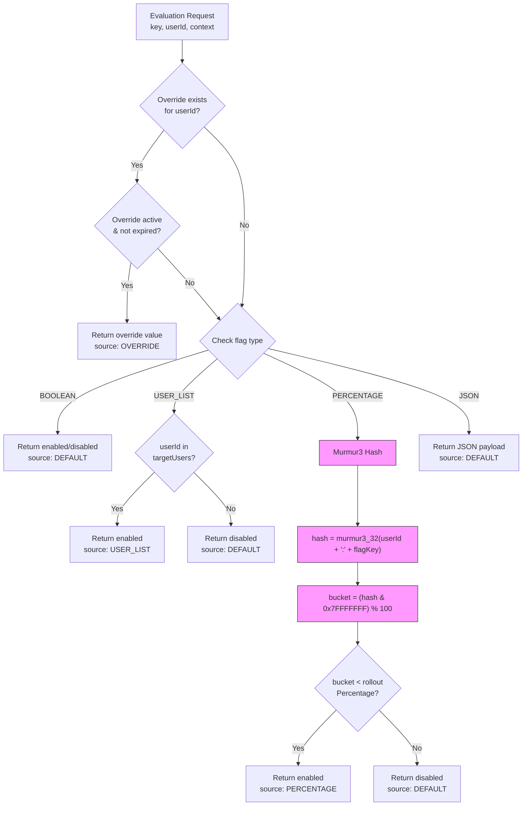
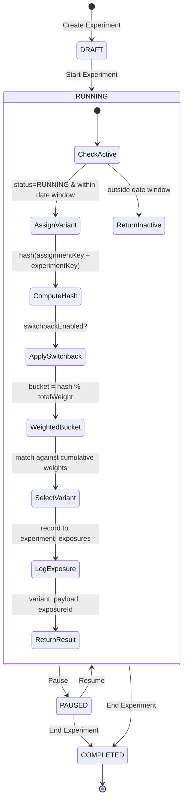
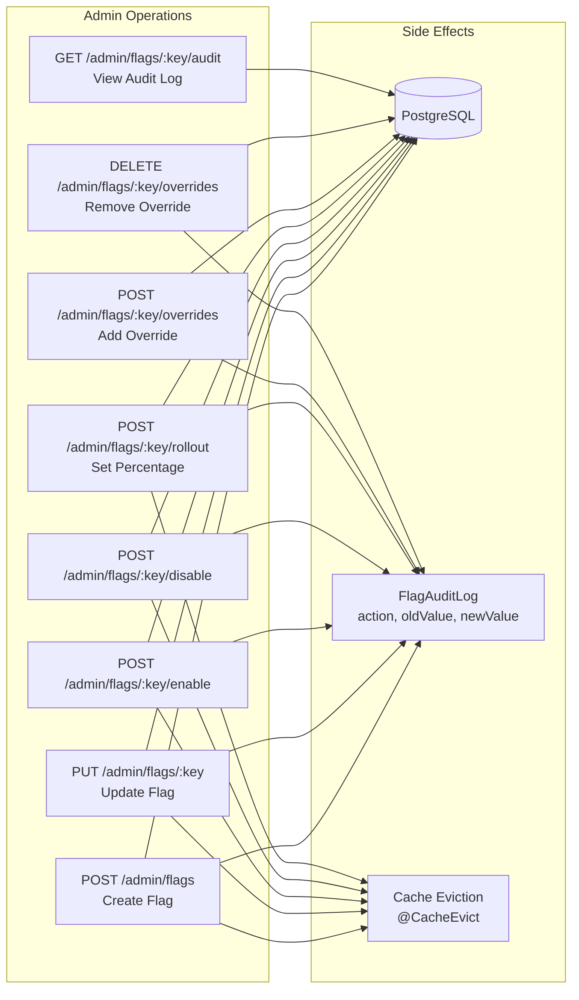

# Config / Feature Flag Service

Centralized feature flag management and A/B experimentation platform for InstaCommerce. Provides real-time flag evaluation with Murmur3 consistent hashing, percentage-based rollouts, user targeting, override management, and full experiment lifecycle support with switchback capabilities.

## Table of Contents

- [Architecture Overview](#architecture-overview)
- [Key Components](#key-components)
- [Flag Evaluation Flow](#flag-evaluation-flow)
- [Experiment Lifecycle](#experiment-lifecycle)
- [Flag Management CRUD](#flag-management-crud)
- [Caching Strategy](#caching-strategy)
- [API Reference](#api-reference)
- [Configuration](#configuration)

---

## Architecture Overview

```mermaid
graph TB
    subgraph Clients
        ADMIN[Admin UI]
        SDK[Service SDKs]
        MOBILE[Mobile App]
    end

    subgraph Config Feature Flag Service :8096
        AFC[AdminFlagController<br>/admin/flags]
        AEC[AdminExperimentController<br>/admin/experiments]
        FEC[FlagEvaluationController<br>/flags]
        EEC[ExperimentEvaluationController<br>/experiments]

        FMS[FlagManagementService]
        EMS[ExperimentManagementService]
        FES[FlagEvaluationService]
        EES[ExperimentEvaluationService]
        BES[BulkEvaluationService]
        FOS[FlagOverrideService]
        FCRJ[FlagCacheRefreshJob<br>@Scheduled 30s]
    end

    subgraph Data
        PG[(PostgreSQL<br>feature_flags_db)]
        CACHE[(Caffeine Cache<br>5000 entries / 30s TTL)]
    end

    ADMIN --> AFC & AEC
    SDK --> FEC & EEC
    MOBILE --> FEC & EEC

    AFC --> FMS
    AEC --> EMS
    FEC --> FES & BES
    EEC --> EES

    FES --> CACHE
    FES --> FOS
    BES --> FES
    FCRJ --> CACHE

    FMS --> PG
    EMS --> PG
    FES --> PG
    EES --> PG
    FOS --> PG
```

---

## Key Components

| Component | Responsibility |
|---|---|
| **AdminFlagController** | CRUD operations for feature flags, enable/disable, rollout percentage, overrides, audit log |
| **AdminExperimentController** | CRUD operations for experiments and their variants |
| **FlagEvaluationController** | Single and bulk flag evaluation for consuming services |
| **ExperimentEvaluationController** | Experiment variant assignment and exposure logging |
| **FlagManagementService** | Flag persistence, validation, and audit logging |
| **FlagEvaluationService** | Core evaluation engine — override checks, Murmur3 hashing, bucketing |
| **ExperimentManagementService** | Experiment persistence and variant management |
| **ExperimentEvaluationService** | Variant assignment via weighted hashing with switchback support |
| **BulkEvaluationService** | Evaluates multiple flags in a single request by delegating to FlagEvaluationService |
| **FlagOverrideService** | Per-user flag overrides with optional TTL expiration |
| **FlagCacheRefreshJob** | Scheduled job (30s interval, ShedLock-protected) that warms the flag cache |

---

## Flag Evaluation Flow



The Murmur3 consistent hashing algorithm ensures deterministic assignment — the same user always gets the same result for a given flag key, providing a stable experience across requests.

---

## Experiment Lifecycle



### Switchback Experiments

When `switchbackEnabled = true`, the variant assignment rotates on a time interval:

```
switchbackWindow = minutesElapsed / switchbackIntervalMinutes
hashInput = assignmentKey + ":" + experimentKey + ":" + switchbackWindow
```

This re-rolls the assignment each window, enabling time-based A/B rotation for experimentation.

---

## Flag Management CRUD



Every mutation is recorded in the `FlagAuditLog` with action type (`CREATED`, `UPDATED`, `ENABLED`, `DISABLED`, `OVERRIDE_ADDED`, `OVERRIDE_REMOVED`), old/new values, and the acting user.

---

## Caching Strategy

```mermaid
flowchart TD
    subgraph Cache Layer
        CC[Caffeine Cache<br>maximumSize=5000<br>expireAfterWrite=30s]
    end

    subgraph Read Path
        EVAL[FlagEvaluationService.loadFlag] -->|@Cacheable 'flags'| CC
        CC -->|Cache Miss| DB[(PostgreSQL)]
        DB --> CC
        CC -->|Cache Hit| EVAL
    end

    subgraph Write Path
        MGMT[FlagManagementService] -->|@CacheEvict 'flags'| CC
        MGMT --> DB
    end

    subgraph Warm-up
        JOB[FlagCacheRefreshJob<br>Every 30s<br>ShedLock protected] -->|Refresh| CC
    end

    subgraph Override Cache
        OC[flag-overrides cache<br>key: flagKey:userId]
        FOS[FlagOverrideService] --> OC
    end

    style CC fill:#ffd700,stroke:#333
```

| Parameter | Value | Env Variable |
|---|---|---|
| Cache type | Caffeine | — |
| TTL | 30 seconds | `FLAG_CACHE_TTL` |
| Max entries | 5,000 | `FLAG_CACHE_MAX_SIZE` |
| Refresh interval | 30 seconds (ShedLock) | — |
| Override cache key | `flagKey:userId` | — |

---

## API Reference

### Flag Evaluation

| Method | Endpoint | Description | Auth |
|---|---|---|---|
| `GET` | `/flags/{key}?userId=&context=` | Evaluate a single flag | Authenticated |
| `POST` | `/flags/bulk` | Bulk evaluate multiple flags | Authenticated |

**GET /flags/{key}**

| Parameter | Type | Required | Description |
|---|---|---|---|
| `key` | path | ✅ | Flag key |
| `userId` | query | ❌ | User ID for percentage/user-list evaluation |
| `context` | query | ❌ | Additional evaluation context |

Response:
```json
{
  "key": "dark-mode",
  "value": "true",
  "source": "PERCENTAGE"
}
```

**POST /flags/bulk**

Request:
```json
{
  "keys": ["dark-mode", "new-checkout"],
  "userId": "user-123",
  "context": {}
}
```

Response:
```json
{
  "dark-mode": { "key": "dark-mode", "value": "true", "source": "PERCENTAGE" },
  "new-checkout": { "key": "new-checkout", "value": "false", "source": "DEFAULT" }
}
```

### Experiment Evaluation

| Method | Endpoint | Description | Auth |
|---|---|---|---|
| `GET` | `/experiments/{key}?userId=&assignmentKey=&context=` | Evaluate experiment | Authenticated |
| `POST` | `/experiments/evaluate` | Evaluate experiment via body | Authenticated |

Response:
```json
{
  "key": "checkout-redesign",
  "experimentId": "exp-uuid",
  "variant": "variant-b",
  "variantId": "var-uuid",
  "payload": { "buttonColor": "blue" },
  "source": "ASSIGNED",
  "switchbackWindow": 3,
  "exposureId": "exposure-uuid"
}
```

### Flag Admin

| Method | Endpoint | Description | Auth |
|---|---|---|---|
| `POST` | `/admin/flags` | Create a flag | ROLE_ADMIN |
| `PUT` | `/admin/flags/{key}` | Update a flag | ROLE_ADMIN |
| `GET` | `/admin/flags/{key}` | Get a flag | ROLE_ADMIN |
| `GET` | `/admin/flags` | List all flags | ROLE_ADMIN |
| `POST` | `/admin/flags/{key}/enable` | Enable a flag | ROLE_ADMIN |
| `POST` | `/admin/flags/{key}/disable` | Disable a flag | ROLE_ADMIN |
| `POST` | `/admin/flags/{key}/rollout` | Set rollout percentage | ROLE_ADMIN |
| `GET` | `/admin/flags/{key}/audit` | Get audit log | ROLE_ADMIN |
| `POST` | `/admin/flags/{key}/overrides` | Add user override | ROLE_ADMIN |
| `DELETE` | `/admin/flags/{key}/overrides` | Remove user override | ROLE_ADMIN |

### Experiment Admin

| Method | Endpoint | Description | Auth |
|---|---|---|---|
| `POST` | `/admin/experiments` | Create experiment with variants | ROLE_ADMIN |
| `PUT` | `/admin/experiments/{key}` | Update experiment | ROLE_ADMIN |
| `GET` | `/admin/experiments/{key}` | Get experiment details | ROLE_ADMIN |
| `GET` | `/admin/experiments` | List all experiments | ROLE_ADMIN |

### Flag Types

| Type | Description |
|---|---|
| `BOOLEAN` | Simple on/off toggle |
| `PERCENTAGE` | Murmur3 hash-based gradual rollout (0–100%) |
| `USER_LIST` | Enabled for specific users in `targetUsers` array |
| `JSON` | Returns custom JSON payload |

### Evaluation Sources

| Source | Description |
|---|---|
| `DEFAULT` | Flag evaluated using default value |
| `OVERRIDE` | Per-user override applied |
| `PERCENTAGE` | User fell within rollout percentage |
| `USER_LIST` | User matched target users list |

### Error Response

```json
{
  "code": "FLAG_NOT_FOUND",
  "message": "Feature flag not found: dark-mode",
  "traceId": "abc-123",
  "timestamp": "2024-01-15T10:30:00Z",
  "details": []
}
```

---

## Configuration

### application.yml

```yaml
server:
  port: ${SERVER_PORT:8096}
  shutdown: graceful

spring:
  application:
    name: config-feature-flag-service
  datasource:
    url: jdbc:postgresql://${DB_HOST:localhost}:${DB_PORT:5432}/feature_flags_db
  cache:
    type: caffeine
    caffeine:
      spec: maximumSize=${FLAG_CACHE_MAX_SIZE:5000},expireAfterWrite=${FLAG_CACHE_TTL:30}s

feature-flag:
  jwt:
    issuer: instacommerce-identity
    public-key: ${sm://jwt-rsa-public-key}
  cache:
    flags-ttl-seconds: ${FLAG_CACHE_TTL:30}
    max-size: ${FLAG_CACHE_MAX_SIZE:5000}
```

### Environment Variables

| Variable | Default | Description |
|---|---|---|
| `SERVER_PORT` | `8096` | HTTP server port |
| `DB_HOST` | `localhost` | PostgreSQL host |
| `DB_PORT` | `5432` | PostgreSQL port |
| `FLAG_CACHE_TTL` | `30` | Cache TTL in seconds |
| `FLAG_CACHE_MAX_SIZE` | `5000` | Max cached flag entries |
| `OTEL_EXPORTER_OTLP_TRACES_ENDPOINT` | `http://otel-collector.monitoring:4318/v1/traces` | OpenTelemetry traces endpoint |
| `TRACING_PROBABILITY` | `1.0` | Trace sampling probability |
| `ENVIRONMENT` | `dev` | Deployment environment tag |

### Security

- **JWT Authentication**: RSA public-key verification via `JwtAuthenticationFilter`
- **Admin endpoints** (`/admin/**`): Require `ROLE_ADMIN`
- **Evaluation endpoints** (`/flags/**`, `/experiments/**`): Require authentication
- **Actuator/health**: Public access
- **CORS**: Configurable allowed origins
- **Session**: Stateless (no server-side sessions)

### Tech Stack

- Java 21, Spring Boot 3.x
- PostgreSQL, Spring Data JPA
- Caffeine Cache, ShedLock
- Guava Murmur3 Hashing
- OpenTelemetry + Prometheus
- Docker (Alpine, non-root)
