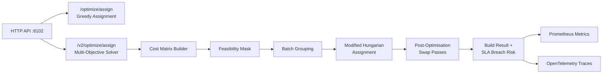
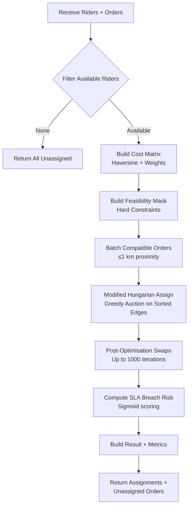
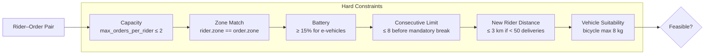

# Dispatch Optimizer Service

> **Go · Multi-Objective Rider–Order Assignment**

Computes optimal rider-to-order assignments using a multi-objective solver that minimises delivery time, rider idle time, and SLA breach probability. The service exposes two API versions: a greedy nearest-neighbour endpoint (v1) and a full multi-objective solver with batching and post-optimisation swaps (v2).

## Architecture



## Multi-Objective Solver Flow



## Constraint Evaluation



## Project Structure

```
dispatch-optimizer-service/
├── main.go                  # HTTP server, v1 greedy assignment, health/metrics endpoints
├── handler/
│   └── assign_v2.go         # V2 handler — delegates to optimizer.Solver
├── optimizer/
│   ├── solver.go            # Multi-objective solver (cost matrix, Hungarian, post-opt)
│   ├── haversine.go         # Haversine distance, ETA estimation, batch compatibility
│   ├── constraints.go       # Hard constraint checker (capacity, zone, battery, etc.)
│   └── metrics.go           # Prometheus metrics for solver internals
├── Dockerfile
└── go.mod
```

## API Reference

### `POST /optimize/assign` — V1 Greedy

Nearest-neighbour greedy assignment with configurable constraints.

**Request:**
```json
{
  "riders": [
    { "id": "r1", "position": { "lat": 12.97, "lng": 77.59 }, "zone": "zone-a" }
  ],
  "orders": [
    { "id": "o1", "position": { "lat": 12.98, "lng": 77.60 }, "zone": "zone-a" }
  ],
  "capacity": 3
}
```

**Response:**
```json
{
  "assignments": [
    { "rider_id": "r1", "order_ids": ["o1"], "total_distance": 1.23 }
  ],
  "unassigned_orders": []
}
```

### `POST /v2/optimize/assign` — V2 Multi-Objective

Full multi-objective solver with SLA breach risk, ETA estimates, and route waypoints.

**Request:**
```json
{
  "riders": [
    {
      "id": "r1",
      "position": { "lat": 12.97, "lng": 77.59 },
      "zone": "zone-a",
      "active_orders": 0,
      "consecutive_deliveries": 3,
      "total_deliveries": 120,
      "avg_speed_kmh": 25.0,
      "is_available": true,
      "vehicle_type": "scooter",
      "battery_percent": 80.0
    }
  ],
  "orders": [
    {
      "id": "o1",
      "position": { "lat": 12.98, "lng": 77.60 },
      "zone": "zone-a",
      "item_count": 3,
      "weight": 2.5,
      "sla_deadline": "2025-01-01T10:10:00Z",
      "is_express_order": false
    }
  ],
  "config": {
    "max_iterations": 1000,
    "timeout_ms": 5000,
    "weight_delivery_time": 0.5,
    "weight_idle_time": 0.2,
    "weight_sla_breach": 0.3,
    "max_orders_per_rider": 2
  }
}
```

**Response:**
```json
{
  "assignments": [
    {
      "rider_id": "r1",
      "order_ids": ["o1"],
      "estimated_eta_minutes": 4.2,
      "total_distance_km": 1.23,
      "sla_breach_risk": 0.05,
      "route_waypoints": [
        { "lat": 12.97, "lng": 77.59 },
        { "lat": 12.98, "lng": 77.60 }
      ]
    }
  ],
  "unassigned_orders": [],
  "total_cost": 2.1,
  "solve_duration_ms": 12,
  "metrics": {
    "total_distance": 1.23,
    "avg_delivery_time": 4.2,
    "sla_breach_count": 0,
    "batched_orders": 0
  }
}
```

### `GET /health` · `GET /health/ready` · `GET /health/live`

Returns `{"status":"ok"}`.

### `GET /metrics`

Prometheus metrics endpoint.

## Configuration

| Variable | Default | Description |
|---|---|---|
| `PORT` / `SERVER_PORT` | `8102` | HTTP listen port |
| `DISPATCH_CONSTRAINTS` | `zone` | Comma-separated constraint list (v1): `zone`, `capacity` |
| `LOG_LEVEL` | `info` | Log level (`debug`, `info`, `warn`, `error`) |
| `OTEL_EXPORTER_OTLP_ENDPOINT` | — | OTLP gRPC endpoint for tracing |

### Solver Defaults (V2)

| Parameter | Default | Description |
|---|---|---|
| `max_iterations` | 1000 | Post-optimisation swap passes cap |
| `timeout_ms` | 5000 | Hard wall-clock timeout per solve |
| `weight_delivery_time` | 0.5 | Objective weight for delivery time |
| `weight_idle_time` | 0.2 | Objective weight for rider idle time |
| `weight_sla_breach` | 0.3 | Objective weight for SLA breach probability |
| `max_orders_per_rider` | 2 | Maximum concurrent orders per rider |
| `max_consecutive` | 8 | Max consecutive deliveries before mandatory break |
| `new_rider_max_km` | 3.0 | Max distance (km) for riders with < 50 deliveries |

## Key Metrics

| Metric | Type | Description |
|---|---|---|
| `dispatch_optimizer_http_requests_total` | Counter | HTTP requests by path/method/status |
| `dispatch_optimizer_assignment_duration_seconds` | Histogram | V1 assignment duration |
| `dispatch_optimizer_solver_solve_duration_seconds` | Histogram | V2 solver duration |
| `dispatch_optimizer_solver_assigned_orders_total` | Counter | Orders successfully assigned |
| `dispatch_optimizer_solver_unassigned_orders_total` | Counter | Orders left unassigned |
| `dispatch_optimizer_solver_batched_orders_total` | Counter | Orders batched together |
| `dispatch_optimizer_solver_sla_breach_risk` | Histogram | SLA breach risk distribution |
| `dispatch_optimizer_solver_delivery_distance_km` | Histogram | Delivery distance distribution |

## Build & Run

```bash
# Local
go build -o dispatch-optimizer .
PORT=8102 ./dispatch-optimizer

# Docker
docker build -t dispatch-optimizer-service .
docker run -p 8102:8102 dispatch-optimizer-service
```

## Dependencies

- Go 1.22+
- Prometheus client (`github.com/prometheus/client_golang`)
- OpenTelemetry SDK + OTLP gRPC exporter
