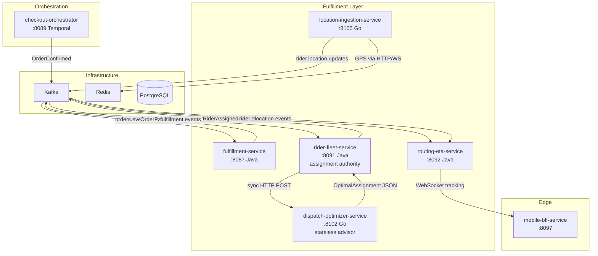
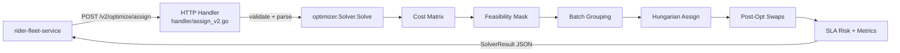
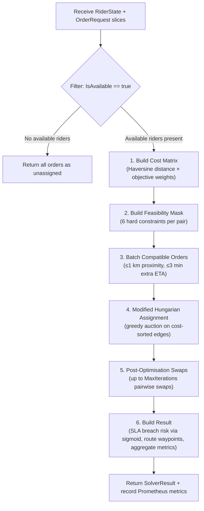
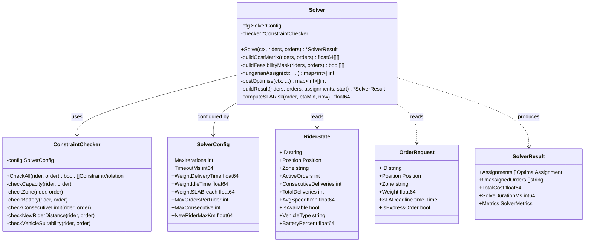
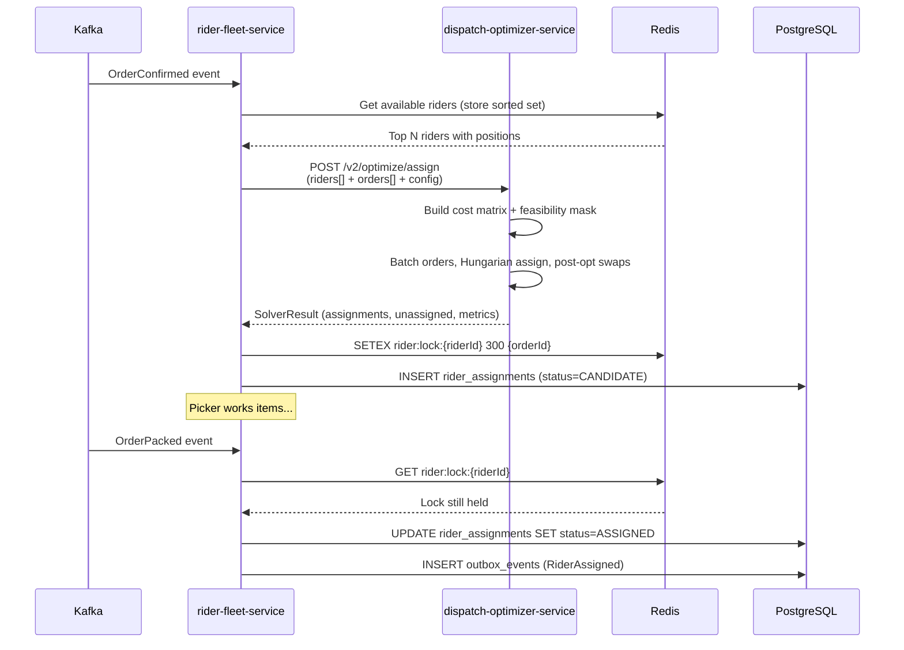

# Dispatch Optimizer Service

> **Go · Stateless Multi-Objective Rider–Order Assignment Advisor**

## Contents

1. [Service Role and Boundaries](#1-service-role-and-boundaries)
2. [Dispatch Authority Posture](#2-dispatch-authority-posture)
3. [High-Level Design](#3-high-level-design)
4. [Low-Level Design](#4-low-level-design)
5. [Optimization and Event Flows](#5-optimization-and-event-flows)
6. [API Reference](#6-api-reference)
7. [Runtime and Configuration](#7-runtime-and-configuration)
8. [Dependencies](#8-dependencies)
9. [Observability](#9-observability)
10. [Testing](#10-testing)
11. [Failure Modes](#11-failure-modes)
12. [Rollout and Rollback](#12-rollout-and-rollback)
13. [Known Limitations](#13-known-limitations)
14. [Q-Commerce Dispatch Pattern Comparison](#14-q-commerce-dispatch-pattern-comparison)
15. [Project Structure](#15-project-structure)
16. [Build and Run](#16-build-and-run)

---

## 1. Service Role and Boundaries

`dispatch-optimizer-service` computes optimal rider-to-order assignments by minimising a weighted combination of delivery time, rider idle time, and SLA breach probability. It is a **stateless, request-scoped advisory service** — it owns no persistent state, produces no Kafka events, and never mutates rider or order records.

| Attribute | Value |
|-----------|-------|
| Language | Go 1.24 (`go.mod`) |
| Port | 8102 |
| State ownership | None — request-scoped computation only |
| Event authority | None — consulted via synchronous HTTP |
| Caller | `rider-fleet-service` (target integration via circuit breaker) |
| SLO target | 99.9 % HTTP availability (43.2 min error budget / 30 d) |

The service exposes two API versions:

- **V1** (`POST /optimize/assign`) — greedy nearest-neighbour with configurable capacity/zone constraints, implemented in `main.go`.
- **V2** (`POST /v2/optimize/assign`) — full multi-objective solver with cost-matrix construction, hard-constraint feasibility masking, order batching, modified Hungarian assignment, and iterative post-optimisation swaps. Implemented across `handler/assign_v2.go` and the `optimizer/` package (`solver.go`, `constraints.go`, `haversine.go`, `metrics.go`).

**What this service does NOT do:** persist assignments, track rider locations, publish domain events, manage rider availability, or hold locks. All state mutation happens in `rider-fleet-service`, which owns `rider_assignments` and rider availability.

---

## 2. Dispatch Authority Posture

`rider-fleet-service` is the **single assignment authority** in InstaCommerce. It owns the `riders`, `rider_availability`, and `rider_assignments` tables. `dispatch-optimizer-service` is a **stateless advisor** — it receives a snapshot of rider/order state, returns an optimal assignment plan, and has no side effects.

The target integration pattern (documented in `docs/reviews/iter3/services/fulfillment-logistics.md` §7.3 and `docs/reviews/iter3/diagrams/lld/fulfillment-dispatch-eta.md` §2.3) is:

1. `rider-fleet-service` receives an `OrderConfirmed` or `OrderPacked` Kafka event.
2. It collects available riders and pending orders, then calls `POST /v2/optimize/assign`.
3. It uses the returned `OptimalAssignment` to execute the actual assignment (Redis lock, DB insert, outbox event).
4. A Resilience4j `@CircuitBreaker` wraps the HTTP call; on failure or timeout, `rider-fleet-service` falls back to greedy first-available assignment.

This advisory posture means the optimizer can be disabled, upgraded, or rolled back without affecting assignment correctness — only assignment quality degrades.

---

## 3. High-Level Design

### 3.1 System Context



### 3.2 Request Flow Overview



---

## 4. Low-Level Design

### 4.1 V2 Solver Pipeline

The `Solver.Solve` method (`optimizer/solver.go`) executes six sequential stages within a context-bounded timeout:



### 4.2 Cost Function

Defined in `solver.go` `buildCostMatrix`:

```
cost(rider_i, order_j) = WeightDeliveryTime × ETA_minutes
                       + WeightIdleTime   × idle_minutes
                       + WeightSLABreach  × sigmoid_risk × 100
```

- **ETA**: `HaversineDistance(rider, order) / avg_speed_kmh × 60 × traffic_factor` (`haversine.go`).
- **Idle component**: equals ETA when `rider.ActiveOrders == 0` (penalises further travel less for idle riders).
- **SLA risk**: sigmoid `1 / (1 + exp(-10 × (ETA/remaining - 0.7)))`. Stays near 0 when ratio < 0.5, rises steeply past 0.8 (`solver.go` `computeSLARisk`). Falls back to `CreatedAt + 10min` when `SLADeadline` is zero.

Default weights: `delivery_time=0.5, idle_time=0.2, sla_breach=0.3` (configurable per request via `SolverConfig`).

### 4.3 Hard Constraints (Feasibility Mask)

Implemented in `optimizer/constraints.go` via `ConstraintChecker.CheckAll`. Each constraint returns a `ConstraintViolation` or nil:

| # | Constraint | Rule | Source Field |
|---|------------|------|-------------|
| 1 | **Capacity** | `rider.ActiveOrders < MaxOrdersPerRider` (default 2) | `SolverConfig` |
| 2 | **Zone match** | `rider.Zone == order.Zone` (bypassed if either is empty) | Request metadata |
| 3 | **Battery** | `BatteryPercent ≥ 15 %` for `bicycle` and `scooter` vehicle types | `RiderState` |
| 4 | **Consecutive limit** | `ConsecutiveDeliveries < MaxConsecutive` (default 8) before mandatory break | `RiderState` |
| 5 | **New-rider distance** | `HaversineDistance ≤ NewRiderMaxKm` (default 3.0 km) when `TotalDeliveries < 50` | `RiderState` |
| 6 | **Vehicle suitability** | `bicycle` riders cannot carry orders > 8 kg | `RiderState` + `OrderRequest` |

### 4.4 Batching Logic

`BatchCompatible` (`haversine.go`) groups orders whose pairwise Haversine distance is ≤ 1 km **and** whose extra ETA (at a conservative 20 km/h) does not exceed `batchETAThreshold` (3 minutes). The Hungarian assignment stage attempts to assign entire batches to a single rider when feasibility and capacity allow.

### 4.5 Modified Hungarian Assignment

`hungarianAssign` (`solver.go`) builds a priority queue of all feasible `(rider, order)` edges sorted by ascending cost, then greedily assigns edges while respecting `MaxOrdersPerRider`. When an order belongs to a multi-order batch, the algorithm attempts to assign the entire batch atomically before falling back to single-order assignment. The loop exits early on context cancellation.

### 4.6 Post-Optimisation Swaps

`postOptimise` (`solver.go`) iterates up to `MaxIterations` (default 1000) passes. Each pass examines all rider pairs and attempts to move an order from rider A to rider B if the new cost is lower and rider B has capacity. Iteration stops when no improving swap is found or the context deadline is reached.

### 4.7 Component Diagram



---

## 5. Optimization and Event Flows

### 5.1 V2 Dispatch Assignment Sequence (Target Integration)

This sequence shows how `rider-fleet-service` uses the optimizer in the target pre-assignment flow (per `docs/reviews/iter3/diagrams/lld/fulfillment-dispatch-eta.md` §2.3, §8.2):



### 5.2 V1 Greedy Assignment Flow

The V1 endpoint (`main.go` `handleAssign`) uses a simpler nearest-neighbour greedy:

1. Iterate riders in input order.
2. For each rider, repeatedly find the nearest unassigned order that passes the `ConstraintSet` (capacity + env-configured constraints).
3. Accumulate Haversine distance and assigned order IDs.
4. Return all assignments plus any remaining unassigned orders.

V1 constraints are configured via the `DISPATCH_CONSTRAINTS` env var (default: `zone`). Capacity is always enforced.

### 5.3 Circuit Breaker Fallback

When the optimizer is unreachable or exceeds the 5 s timeout, the calling `rider-fleet-service` circuit breaker opens and falls back to greedy first-available assignment. The optimizer itself has no fallback logic — it either returns a result within the timeout or the caller handles the failure.

---

## 6. API Reference

### `POST /optimize/assign` — V1 Greedy

Nearest-neighbour greedy assignment with configurable constraints.

**Request:**
```json
{
  "riders": [
    { "id": "r1", "position": { "lat": 12.97, "lng": 77.59 }, "zone": "zone-a" }
  ],
  "orders": [
    { "id": "o1", "position": { "lat": 12.98, "lng": 77.60 }, "zone": "zone-a" }
  ],
  "capacity": 3
}
```

**Response:**
```json
{
  "assignments": [
    { "rider_id": "r1", "order_ids": ["o1"], "total_distance": 1.23 }
  ],
  "unassigned_orders": []
}
```

Validation: `capacity > 0`, unique rider/order IDs, lat ∈ [-90, 90], lng ∈ [-180, 180]. Request body capped at 1 MiB. Unknown JSON fields are rejected.

### `POST /v2/optimize/assign` — V2 Multi-Objective

Full multi-objective solver with SLA breach risk, ETA estimates, and route waypoints.

**Request:**
```json
{
  "riders": [
    {
      "id": "r1",
      "position": { "lat": 12.97, "lng": 77.59 },
      "zone": "zone-a",
      "active_orders": 0,
      "consecutive_deliveries": 3,
      "total_deliveries": 120,
      "avg_speed_kmh": 25.0,
      "is_available": true,
      "vehicle_type": "scooter",
      "battery_percent": 80.0
    }
  ],
  "orders": [
    {
      "id": "o1",
      "position": { "lat": 12.98, "lng": 77.60 },
      "zone": "zone-a",
      "item_count": 3,
      "weight": 2.5,
      "sla_deadline": "2025-01-01T10:10:00Z",
      "is_express_order": false
    }
  ],
  "config": {
    "max_iterations": 1000,
    "timeout_ms": 5000,
    "weight_delivery_time": 0.5,
    "weight_idle_time": 0.2,
    "weight_sla_breach": 0.3,
    "max_orders_per_rider": 2
  }
}
```

If `config` is provided, a temporary `Solver` is created with those overrides for the call. Zero-valued config fields fall back to defaults.

**Response:**
```json
{
  "assignments": [
    {
      "rider_id": "r1",
      "order_ids": ["o1"],
      "estimated_eta_minutes": 4.2,
      "total_distance_km": 1.23,
      "sla_breach_risk": 0.05,
      "route_waypoints": [
        { "lat": 12.97, "lng": 77.59 },
        { "lat": 12.98, "lng": 77.60 }
      ]
    }
  ],
  "unassigned_orders": [],
  "total_cost": 2.1,
  "solve_duration_ms": 12,
  "metrics": {
    "total_distance": 1.23,
    "avg_delivery_time": 4.2,
    "sla_breach_count": 0,
    "batched_orders": 0
  }
}
```

Assignments are sorted by `rider_id` for deterministic output. Unassigned orders are sorted lexicographically.

### `GET /health` · `GET /health/ready` · `GET /health/live`

Returns `{"status":"ok"}` (GET/HEAD only). Used by Kubernetes probes (`readinessPath: /health/ready`, `livenessPath: /health/live` in Helm values).

### `GET /metrics`

Prometheus metrics endpoint via `promhttp.Handler()`.

---

## 7. Runtime and Configuration

### 7.1 Environment Variables

| Variable | Default | Description |
|---|---|---|
| `PORT` / `SERVER_PORT` | `8102` | HTTP listen port |
| `DISPATCH_CONSTRAINTS` | `zone` | Comma-separated V1 constraint list: `zone`, `capacity` |
| `LOG_LEVEL` | `info` | Structured JSON log level (`debug`, `info`, `warn`, `error`) |
| `OTEL_EXPORTER_OTLP_ENDPOINT` | — | OTLP gRPC endpoint for distributed tracing |

### 7.2 V2 Solver Config Defaults

These are set in `optimizer/solver.go` constants and applied via `SolverConfig.withDefaults()`. Callers can override per-request via the `config` JSON field.

| Parameter | Default | Constant Name | Description |
|---|---|---|---|
| `max_iterations` | 1000 | `DefaultMaxIterations` | Post-optimisation swap pass cap |
| `timeout_ms` | 5000 | `DefaultTimeoutMs` | Hard wall-clock timeout per `Solve` call |
| `weight_delivery_time` | 0.5 | `DefaultWeightDeliveryTime` | Objective weight for total delivery time |
| `weight_idle_time` | 0.2 | `DefaultWeightIdleTime` | Objective weight for rider idle time |
| `weight_sla_breach` | 0.3 | `DefaultWeightSLABreach` | Objective weight for SLA breach probability |
| `max_orders_per_rider` | 2 | `DefaultMaxOrdersPerRider` | Maximum concurrent active orders per rider |
| `max_consecutive` | 8 | `DefaultMaxConsecutive` | Max consecutive deliveries before mandatory break |
| `new_rider_max_km` | 3.0 | `DefaultNewRiderMaxKm` | Max assignment distance (km) for riders with < 50 deliveries |

**Target integration note:** per-store weight overrides are planned via `config-feature-flag-service` keys (`dispatch.optimizer.weights.*`, `dispatch.optimizer.store.{storeId}.enabled`). See `docs/reviews/iter3/services/fulfillment-logistics.md` §7.3.

### 7.3 HTTP Server Timeouts

Configured in `main.go`:

| Timeout | Value |
|---|---|
| `ReadHeaderTimeout` | 5 s |
| `ReadTimeout` | 15 s |
| `WriteTimeout` | 15 s |
| `IdleTimeout` | 60 s |
| Graceful shutdown | 15 s (`context.WithTimeout` on `SIGINT`/`SIGTERM`) |

### 7.4 Kubernetes / Helm

From `deploy/helm/values.yaml`:

| Setting | Value |
|---|---|
| Replicas | 2 (prod), HPA min 2 / max 6, target CPU 70 % |
| CPU request / limit | 500m / 1000m |
| Memory request / limit | 512Mi / 1024Mi |
| Readiness probe | `/health/ready` |
| Liveness probe | `/health/live` |

---

## 8. Dependencies

From `go.mod` (Go 1.24):

| Dependency | Purpose |
|---|---|
| `github.com/prometheus/client_golang` v1.19.0 | Prometheus metrics registration and HTTP handler |
| `go.opentelemetry.io/otel` v1.41.0 | Core OpenTelemetry API (tracing, propagation) |
| `go.opentelemetry.io/otel/exporters/otlp/otlptrace/otlptracegrpc` v1.41.0 | OTLP gRPC trace exporter |
| `go.opentelemetry.io/otel/sdk` v1.41.0 | OTel SDK (TracerProvider, Resource, BatchSpanProcessor) |
| `go.opentelemetry.io/contrib/instrumentation/net/http/otelhttp` v0.66.0 | Automatic HTTP handler instrumentation |

No database drivers, Kafka clients, or Redis clients — consistent with the stateless advisory role.

### Runtime Dependencies (Upstream Services)

| Service | Relationship | Protocol |
|---|---|---|
| `rider-fleet-service` | Sole caller | Synchronous HTTP (target: circuit-breaker-wrapped) |
| `otel-collector` | Trace export | gRPC OTLP (best-effort; falls back to no-op if unavailable) |
| Prometheus | Metric scrape | Pull-based `/metrics` |

---

## 9. Observability

### 9.1 Prometheus Metrics

**V1 metrics** (registered in `main.go`):

| Metric | Type | Labels | Description |
|---|---|---|---|
| `dispatch_optimizer_http_requests_total` | Counter | `path`, `method`, `status` | HTTP requests by route |
| `dispatch_optimizer_http_request_duration_seconds` | Histogram | `path`, `method`, `status` | HTTP request latency |
| `dispatch_optimizer_assignment_duration_seconds` | Histogram | — | V1 greedy assignment latency |
| `dispatch_optimizer_assigned_orders_total` | Counter | — | Orders assigned (V1) |
| `dispatch_optimizer_unassigned_orders_total` | Counter | — | Orders unassigned (V1) |

**V2 metrics** (registered in `optimizer/metrics.go` via package `init`):

| Metric | Type | Buckets | Description |
|---|---|---|---|
| `dispatch_optimizer_solver_solve_duration_seconds` | Histogram | 5ms–5s | Wall-clock solve time per `Solve` call |
| `dispatch_optimizer_solver_assigned_orders_total` | Counter | — | Orders assigned by the multi-objective solver |
| `dispatch_optimizer_solver_unassigned_orders_total` | Counter | — | Orders the solver could not assign |
| `dispatch_optimizer_solver_batched_orders_total` | Counter | — | Orders batched with at least one other |
| `dispatch_optimizer_solver_sla_breach_risk` | Histogram | 0.05–1.0 | SLA breach risk distribution across assignments |
| `dispatch_optimizer_solver_delivery_distance_km` | Histogram | 0.5–20 km | Delivery distance distribution per assignment |

### 9.2 OpenTelemetry Tracing

All HTTP handlers are wrapped with `otelhttp.NewHandler`. Key manually-created spans:

| Span | Attributes |
|---|---|
| `optimize.assign` (V1) | `riders`, `orders`, `capacity`, `constraints`, `assigned_orders`, `unassigned_orders`, `total_distance_km` |
| `v2.optimize.assign` (V2) | `riders`, `orders`, `assigned_orders`, `unassigned_orders`, `total_cost`, `solve_duration_ms` |

Trace propagation: W3C TraceContext + Baggage. Exporter: OTLP gRPC to `OTEL_EXPORTER_OTLP_ENDPOINT`. If the exporter fails to initialise, a no-op TracerProvider is used (the service stays operational).

### 9.3 Structured Logging

JSON structured logs via `log/slog` to stdout. Every non-health request logs: `method`, `path`, `status`, `duration_ms`, `bytes`, `trace_id`, `span_id`. All log entries include `"service": "dispatch-optimizer-service"`.

---

## 10. Testing

### 10.1 Current State

No Go test files (`*_test.go`) exist in the service directory. This is a known gap identified in the iter3 review (`docs/reviews/iter3/services/fulfillment-logistics.md` §7.2).

### 10.2 How to Validate

```bash
# Build
cd services/dispatch-optimizer-service && go build ./...

# Run tests (when added)
cd services/dispatch-optimizer-service && go test -race ./...

# Smoke test (local)
PORT=8102 go run . &
curl -s http://localhost:8102/health/ready
curl -s -X POST http://localhost:8102/v2/optimize/assign \
  -H 'Content-Type: application/json' \
  -d '{"riders":[{"id":"r1","position":{"lat":12.97,"lng":77.59},"zone":"z1","is_available":true,"avg_speed_kmh":25}],"orders":[{"id":"o1","position":{"lat":12.98,"lng":77.60},"zone":"z1","weight":2.0,"sla_deadline":"2030-01-01T00:00:00Z"}]}'
```

CI runs `go test ./...` then `go build ./...` per the path filter in `.github/workflows/ci.yml`.

### 10.3 Recommended Test Coverage (from iter3 review)

- **Unit tests:** `ConstraintChecker.CheckAll` with each constraint in isolation and combined.
- **Solver tests:** small input matrices (5 riders × 5 orders) verifying assignment optimality, batch grouping, timeout behaviour, and context cancellation.
- **Haversine tests:** known-distance pairs, zero-distance, antipodal points.
- **Load test:** 20 riders × 10 orders at 100 concurrent requests — expected p99 < 500 ms (not yet validated).

---

## 11. Failure Modes

| Failure | Detection | Blast Radius | Automated Recovery | Manual Fallback |
|---|---|---|---|---|
| **Solver timeout (> 5 s)** | Context deadline exceeded; `Solve` returns partial result + `context.DeadlineExceeded` | Single assignment batch | Caller circuit breaker opens → greedy fallback | Disable optimizer via feature flag `fulfillment.dispatch_optimizer_v2.enabled: false` |
| **HTTP 5xx / unreachable** | Caller gets connection error or 500 | Single assignment batch | Resilience4j circuit breaker auto-fallback | Same feature flag |
| **OTel exporter failure** | OTLP gRPC connection error at startup | Tracing only (no functional impact) | No-op TracerProvider used; service continues | Restart with corrected `OTEL_EXPORTER_OTLP_ENDPOINT` |
| **Prometheus registration panic** | `MustRegister` panics if duplicate collectors | Service crash at startup | Kubernetes restarts pod | Fix metric registration conflict |
| **Invalid request body** | Handler returns 400 with JSON error | Single request | Caller retries or falls back | Fix caller payload |
| **All riders unavailable** | `Solve` returns all orders as unassigned (not an error) | Assignment quality | `rider-fleet-service` publishes `RiderShortage` ops alert | Increase `max_orders_per_rider` temporarily; call out more riders |
| **Stale rider positions** | Not detectable by this service | Assignment quality (suboptimal routes) | None — position freshness is the caller's responsibility | Improve location-ingestion pipeline |

### Partial Results on Timeout

The solver checks `ctx.Err()` between iterations in both the Hungarian assignment loop and post-optimisation passes. If the context expires mid-solve, the service returns whatever assignments have been computed so far — partial but valid.

---

## 12. Rollout and Rollback

### 12.1 Feature Flag Gating

Target rollout uses `config-feature-flag-service` flags on the calling side:

```yaml
fulfillment.dispatch_optimizer_v2.enabled: false    # Global kill switch
dispatch.optimizer.store.{storeId}.enabled: true    # Per-store override
dispatch.optimizer.weights.delivery_time: 0.5       # Tunable weights
dispatch.optimizer.weights.idle_time: 0.2
dispatch.optimizer.weights.sla_breach: 0.3
```

### 12.2 Phased Rollout (from iter3 review)

| Week | Scope | Validation | Rollback Trigger |
|---|---|---|---|
| 3 | 10 % of stores use V2 solver | Monitor `dispatch_optimizer_solver_solve_duration_seconds` p99 | p99 > 3 s → increase timeout or fallback to greedy |
| 6 | 50 % of stores | SLA segment breach rate should decrease | `dispatch_to_deliver_ms` p95 > 360 s (20 % degradation) → auto-rollback per store |
| 7 | 100 % | 3-day monitoring, final ops review | Manual rollback if critical incident |

### 12.3 Deployment Safety

- Helm rolling update: max surge 1, max unavailable 0.
- Graceful shutdown: `server.Shutdown(ctx)` with 15 s timeout drains in-flight requests before exit.
- Health probes: `/health/ready` and `/health/live` return 200 before traffic is routed.
- Rollback: `helm rollback dispatch-optimizer-service` or disable via feature flag on the caller side (zero-downtime).

---

## 13. Known Limitations

| # | Limitation | Impact | Mitigation / Future Work |
|---|---|---|---|
| 1 | **No test files** | No automated regression coverage | Add unit + integration tests (iter3 recommendation) |
| 2 | **Not wired by default** | V2 solver is available but `rider-fleet-service` does not call it yet | Integration behind circuit breaker + feature flag (iter3 §7.3) |
| 3 | **No per-store config** | Solver weights are global defaults or per-request overrides only | Planned: `config-feature-flag-service` per-store keys |
| 4 | **No load-test validation** | p99 latency at 100 concurrent requests is unverified | Run load test: 20 riders × 10 orders, target p99 < 500 ms |
| 5 | **Haversine only, no road distance** | Straight-line distance underestimates real travel time | Future: integrate `routing-eta-service` for road-network ETA |
| 6 | **Traffic factor hardcoded to 1.0** | No congestion modelling | Future: dynamic traffic factor from real-time location data |
| 7 | **V1 and V2 share `unassigned_orders_total` metric name** | V1 (`main.go`) and V2 (`optimizer/metrics.go`) register separate counters with the same semantic name; both increment independently | Distinguish via labels or unify counters |
| 8 | **Express orders not excluded from batching** | Code batches based on proximity only; `IsExpressOrder` flag exists on `OrderRequest` but is not checked in `BatchCompatible` | Add express-order exclusion to batching logic |
| 9 | **Solver config env override** | V2 solver defaults are compile-time constants, not env-driven | Add env var support for production tuning without per-request config |

---

## 14. Q-Commerce Dispatch Pattern Comparison

The following comparison is grounded in the benchmarks documented in `docs/reviews/iter3/diagrams/lld/fulfillment-dispatch-eta.md` §1.2:

| Dimension | InstaCommerce (current) | Leading India Q-Commerce (Blinkit/Zepto benchmark) |
|---|---|---|
| **Assignment trigger** | Post-pack (`OrderPacked`) | Pre-pack (`OrderConfirmed`) — rider staged before pack completes |
| **Pack-to-dispatch budget** | 4–7 min (post-assign) | ~1 min (pre-assigned rider already at store) |
| **Solver approach** | Multi-objective Hungarian + post-opt (V2, available but not yet wired) | Proprietary; assumed ML-augmented real-time dispatch |
| **SLA segment tracking** | Not yet instrumented (iter3 gap) | Per-segment timer: `confirm_to_pick`, `pick_to_pack`, `pack_to_dispatch`, `dispatch_to_deliver` |

**Key insight from iter3 review:** InstaCommerce loses 3–6 minutes in `pack_to_dispatch` versus the benchmark because rider assignment triggers on `OrderPacked` rather than `OrderConfirmed`. The target architecture (§2.3 in the LLD) addresses this by pre-assigning a `CANDIDATE` rider on `OrderConfirmed` and promoting to `ASSIGNED` on `OrderPacked`.

---

## 15. Project Structure

```
dispatch-optimizer-service/
├── main.go                  # HTTP server, V1 greedy assignment, health/metrics endpoints
├── handler/
│   └── assign_v2.go         # V2 HTTP handler — delegates to optimizer.Solver
├── optimizer/
│   ├── __init__.go           # Package doc: multi-objective dispatch optimization
│   ├── solver.go            # Solver struct, Solve pipeline, cost matrix, Hungarian, post-opt
│   ├── haversine.go         # HaversineDistance, EstimateETAMinutes, BatchCompatible
│   ├── constraints.go       # ConstraintChecker with 6 hard constraints
│   └── metrics.go           # Prometheus metrics for V2 solver (registered via init)
├── Dockerfile               # Multi-stage build: Go 1.26-alpine → alpine:3.23, non-root user
└── go.mod                   # Go 1.24 module definition
```

---

## 16. Build and Run

```bash
# Local build and run
cd services/dispatch-optimizer-service
go build -o dispatch-optimizer .
PORT=8102 ./dispatch-optimizer

# Docker
docker build -t dispatch-optimizer-service .
docker run -p 8102:8102 dispatch-optimizer-service

# CI validation (from repo root)
cd services/dispatch-optimizer-service && go test -race ./... && go build ./...
```
