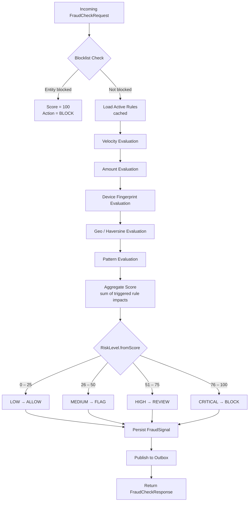
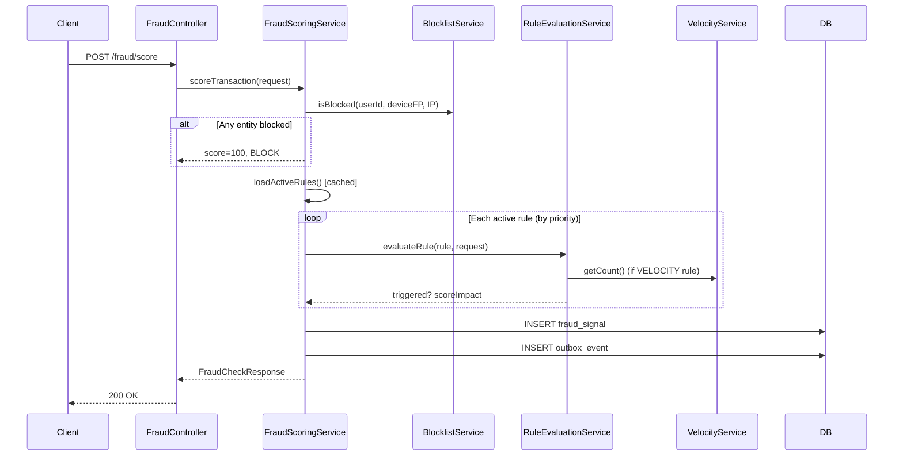
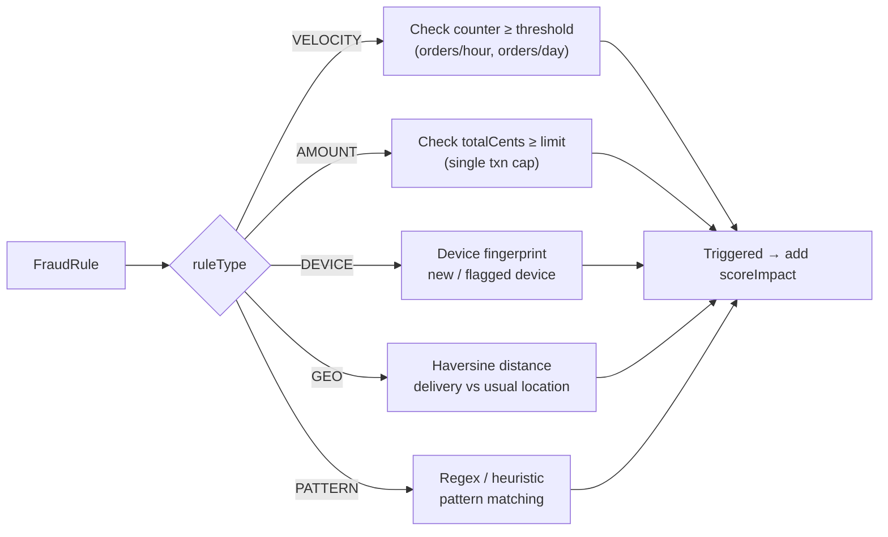
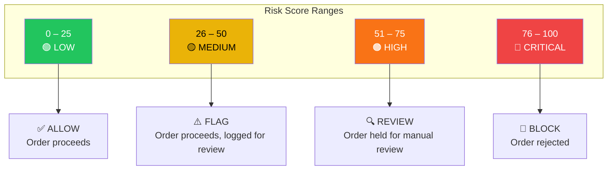

# Fraud Detection Service

Rule-based fraud scoring, velocity checks, and blocklist management for
InstaCommerce. The service consumes order/payment events to enrich velocity
signals, but the repository implementation is currently rule-engine centric
rather than a fully wired ML-serving stack.
Every order/payment event is evaluated through a multi-stage pipeline that produces a risk score and an automated decision (**ALLOW / FLAG / REVIEW / BLOCK**).

## Table of Contents

- [Architecture Overview](#architecture-overview)
- [Component Map](#component-map)
- [Flow Diagrams](#flow-diagrams)
  - [Fraud Scoring Pipeline](#fraud-scoring-pipeline)
  - [Rule Evaluation Flow](#rule-evaluation-flow)
  - [Blocklist Management](#blocklist-management)
  - [Decision Matrix](#decision-matrix)
- [API Reference](#api-reference)
- [Kafka Consumers](#kafka-consumers)
- [Database Schema](#database-schema)
- [Scheduled Jobs](#scheduled-jobs)
- [Configuration](#configuration)
- [Known Limitations](#known-limitations)
- [Running Locally](#running-locally)

---

## High-Level Design (HLD)

```
┌──────────────┐   REST    ┌──────────────────────────────┐   JPA    ┌────────────┐
│  API Gateway │ ────────▶ │  fraud-detection-service      │ ───────▶│ PostgreSQL │
└──────────────┘           │  (Spring Boot 3 / Java)       │         └────────────┘
                           │                                │
  Kafka (order.events) ──▶ │  OrderEventConsumer            │
  Kafka (payment.events) ▶ │  PaymentEventConsumer          │
                           │                                │
                           │  Outbox → CDC relay ───────────┼──▶ Kafka (fraud.events)
                           └──────────────────────────────┘
```

**Key qualities:** Caffeine-cached rules & blocklist, PostgreSQL UPSERT velocity counters, ShedLock for distributed job safety, OpenTelemetry tracing, Flyway migrations.

---

## Low-Level Design (LLD)

### Component Map

| Layer | Class | Responsibility |
|-------|-------|----------------|
| **Controller** | `FraudController` | Score a transaction, report suspicious activity |
| | `AdminFraudController` | CRUD fraud rules, manage blocklist (ADMIN only) |
| **Service** | `FraudScoringService` | Orchestrates the full scoring pipeline |
| | `VelocityService` | UPSERT time-windowed counters (1 h / 24 h) |
| | `RuleEvaluationService` | Evaluates individual rules (VELOCITY, AMOUNT, DEVICE, GEO, PATTERN) |
| | `RuleConditionValidator` | Validates condition JSON structure per rule type |
| | `BlocklistService` | Check / add / remove blocked entities with expiry |
| | `OutboxService` | Transactional outbox writes |
| **Kafka** | `OrderEventConsumer` | Listens `order.events` — updates velocity counters on `OrderPlaced` |
| | `PaymentEventConsumer` | Listens `payment.events` — tracks failed payments |
| **Jobs** | `OutboxCleanupJob` | Daily 03:30 — purges sent outbox rows |
| | `VelocityCounterCleanupJob` | Hourly — deletes expired velocity windows |
| **Domain** | `FraudRule`, `FraudSignal`, `BlockedEntity`, `VelocityCounter`, `OutboxEvent` | JPA entities |
| | `RiskLevel` (enum) | LOW (0–25), MEDIUM (26–50), HIGH (51–75), CRITICAL (76–100) |
| | `FraudAction` (enum) | ALLOW, FLAG, REVIEW, BLOCK — with `fromRiskLevel()` and `escalate()` |
| **Security** | `JwtAuthenticationFilter`, `DefaultJwtService`, `JwtKeyLoader` | RSA JWT validation, role extraction |

---

## Flow Diagrams

### Fraud Scoring Pipeline





### Rule Evaluation Flow



Each rule stores its parameters in a `conditionJson` (JSONB) column, validated by `RuleConditionValidator`.

### Blocklist Management

```mermaid
flowchart TD
        Admin["Admin (ROLE_ADMIN)"] -->|POST /admin/fraud/blocklist| BL[BlocklistService.block]
        BL --> DB[(blocked_entities)]
        BL --> CE["@CacheEvict('blocklist')"]

        Admin -->|DELETE /admin/fraud/blocklist/{entityType}/{entityValue}| UB[BlocklistService.unblock]
        UB --> DB
        UB --> CE2["@CacheEvict('blocklist')"]

    ScoreReq[Scoring Request] --> Check[BlocklistService.isBlocked]
    Check -->|"@Cacheable('blocklist')"| DB
    Check --> Exp{expiresAt < now?}
    Exp -->|expired| NotBlocked[Not blocked]
    Exp -->|active| Blocked["Blocked → score = 100"]
```

### Decision Matrix



---

## API Reference

### Fraud Scoring

| Method | Path | Auth | Description |
|--------|------|------|-------------|
| `POST` | `/fraud/score` | `USER`, `SERVICE` | Score a transaction |
| `POST` | `/fraud/report` | `USER` | Report suspicious activity |

**FraudCheckRequest**

```json
{
  "userId": "uuid",
  "orderId": "uuid",
  "totalCents": 15000,
  "deviceFingerprint": "fp_abc123",
  "ipAddress": "203.0.113.42",
  "deliveryLat": 12.9716,
  "deliveryLng": 77.5946,
  "itemCount": 3,
  "paymentMethodType": "CARD",
  "isNewUser": false
}
```

**FraudCheckResponse**

```json
{
  "score": 35,
  "riskLevel": "MEDIUM",
  "action": "FLAG",
  "rulesTriggered": ["high-value-order", "new-device"],
  "signalId": "uuid"
}
```

### Admin — Rules (ROLE_ADMIN)

| Method | Path | Auth | Description |
|--------|------|------|-------------|
| `GET` | `/admin/fraud/rules` | `ADMIN` | List all fraud rules |
| `GET` | `/admin/fraud/rules/:id` | `ADMIN` | Get a single rule |
| `POST` | `/admin/fraud/rules` | `ADMIN` | Create rule (`FraudRuleRequest`) |
| `PUT` | `/admin/fraud/rules/:id` | `ADMIN` | Update rule |
| `DELETE` | `/admin/fraud/rules/:id` | `ADMIN` | Delete rule |

**FraudRuleRequest**

```json
{
  "name": "high-value-order",
  "ruleType": "AMOUNT",
  "conditionJson": "{\"maxCents\": 50000}",
  "scoreImpact": 30,
  "action": "FLAG",
  "active": true,
  "priority": 10
}
```

### Admin — Blocklist (ROLE_ADMIN)

| Method | Path | Auth | Description |
|--------|------|------|-------------|
| `GET` | `/admin/fraud/blocklist` | `ADMIN` | List active blocked entities |
| `POST` | `/admin/fraud/blocklist` | `ADMIN` | Block an entity (`BlockRequest`) |
| `DELETE` | `/admin/fraud/blocklist/{entityType}/{entityValue}` | `ADMIN` | Unblock an entity |

**BlockRequest**

```json
{
  "entityType": "IP",
  "entityValue": "203.0.113.42",
  "reason": "Repeated chargebacks",
  "expiresAt": "2025-06-01T00:00:00Z"
}
```

### Common Error Response

```json
{
  "code": "FRAUD_RULE_NOT_FOUND",
  "message": "Rule not found",
  "traceId": "abc123",
  "timestamp": "2025-01-15T10:30:00Z",
  "details": []
}
```

| HTTP Status | Code | Meaning |
|-------------|------|---------|
| 404 | `FRAUD_RULE_NOT_FOUND` | Rule does not exist |
| 404 | `BLOCKED_ENTITY_NOT_FOUND` | Blocked entity not found |

---

## Kafka Consumers

| Consumer | Topic | Trigger Event | Action |
|----------|-------|---------------|--------|
| `OrderEventConsumer` | `order.events`, `orders.events` | `OrderPlaced` | Increments velocity counters for user, device, IP and amount windows |
| `PaymentEventConsumer` | `payment.events`, `payments.events` | `PaymentFailed` | Tracks failed payment attempts for user, device, and IP windows |

Both consumers deserialise an `EventEnvelope` record (`id`, `aggregateId`, `eventType`, `payload`).
Kafka error handling uses `FixedBackOff` with DLT (dead-letter topic) fallback.

---

## Database Schema

### Core Tables

```
fraud_rules
  id              UUID  PK
  name            VARCHAR  UNIQUE
  rule_type       VARCHAR  (VELOCITY | AMOUNT | DEVICE | GEO | PATTERN)
  condition_json  JSONB
  score_impact    INT  (0–100)
  action          VARCHAR  (ALLOW | FLAG | REVIEW | BLOCK)
  active          BOOLEAN  DEFAULT TRUE
  priority        INT
  created_at      TIMESTAMPTZ
  updated_at      TIMESTAMPTZ

fraud_signals
  id                  UUID  PK
  user_id             UUID
  order_id            UUID
  device_fingerprint  VARCHAR
  ip_address          VARCHAR
  score               INT
  risk_level          VARCHAR  (LOW | MEDIUM | HIGH | CRITICAL)
  rules_triggered     JSONB
  action_taken        VARCHAR
  created_at          TIMESTAMPTZ

blocked_entities
  id            UUID  PK
  entity_type   VARCHAR  (USER | DEVICE | IP | CARD)
  entity_value  VARCHAR
  reason        TEXT
  blocked_by    VARCHAR
  blocked_at    TIMESTAMPTZ
  expires_at    TIMESTAMPTZ  NULLABLE
  active        BOOLEAN  DEFAULT TRUE

velocity_counters
  id            UUID  PK
  entity_type   VARCHAR
  entity_id     VARCHAR
  counter_type  VARCHAR  (ORDERS_PER_HOUR | ORDERS_PER_DAY | AMOUNT_PER_DAY | …)
  counter_value BIGINT
  window_start  TIMESTAMPTZ
  window_end    TIMESTAMPTZ
  -- PostgreSQL UPSERT via repository

outbox_events
  id             UUID  PK
  aggregate_type VARCHAR
  aggregate_id   VARCHAR
  event_type     VARCHAR
  payload        JSONB
  created_at     TIMESTAMPTZ
  sent           BOOLEAN  DEFAULT FALSE
```

Migrations managed by **Flyway** (`db/migration/V*.sql`).

---

## Scheduled Jobs

| Job | Schedule | Lock | Description |
|-----|----------|------|-------------|
| `OutboxCleanupJob` | `0 30 3 * * *` (daily 03:30) | ShedLock | Deletes `sent = true` outbox rows past retention |
| `VelocityCounterCleanupJob` | `0 15 * * * *` (hourly :15) | ShedLock | Deletes counters whose `window_end < now()` |

---

## Configuration

Key properties in `application.yml` / environment:

| Property | Default | Description |
|----------|---------|-------------|
| `fraud.jwt.issuer` | — | Expected JWT issuer |
| `fraud.jwt.public-key` | — | RSA public key (PEM or Base64) |
| `fraud.cors.allowed-origins` | — | CORS allowed origins |
| `fraud.velocity.cleanup-cron` | `0 15 * * * *` | Velocity counter cleanup cron |
| `outbox.cleanup-cron` | `0 30 3 * * *` | Outbox cleanup cron |
| `spring.datasource.url` | — | PostgreSQL JDBC URL |
| `spring.kafka.bootstrap-servers` | — | Kafka broker list |
| `spring.kafka.consumer.group-id` | — | Consumer group |

### Dependencies

- Java 17+, Spring Boot 3, Spring Kafka
- PostgreSQL 15+, Flyway
- Caffeine 3.1.8 (fraudRules & blocklist caches)
- ShedLock 5.10.2
- JJWT 0.12.5 (RSA JWT)
- Micrometer + OpenTelemetry
- Google Cloud SQL socket factory, Secret Manager
- Testcontainers (PostgreSQL) for integration tests

---

## Running Locally

```bash
# Start dependencies
docker compose up -d postgres kafka

# Run the service
./gradlew :services:fraud-detection-service:bootRun

# Health check
curl http://localhost:8095/actuator/health

# Score a transaction
curl -X POST http://localhost:8095/fraud/score \
  -H "Content-Type: application/json" \
  -H "Authorization: Bearer <token>" \
  -d '{"userId":"...","orderId":"...","totalCents":5000}'
```

## Known Limitations

- the README previously overstated ML coupling; the checked-in implementation is
  still primarily rule/velocity based
- Kafka listeners use explicit listener group IDs (`fraud-detection-orders`,
  `fraud-detection-payments`) instead of the shared default consumer group from
  `application.yml`

---

## Testing

```bash
./gradlew :services:fraud-detection-service:test
```

## Rollout and Rollback

- ship fraud-rule changes with observability on false-positive rate, manual overrides, and topic lag
- canary consumer or scoring-path changes before widening them across all payment/order traffic
- roll back by restoring the previous image or reverting the rule set; avoid destructive data cleanup in the same window
