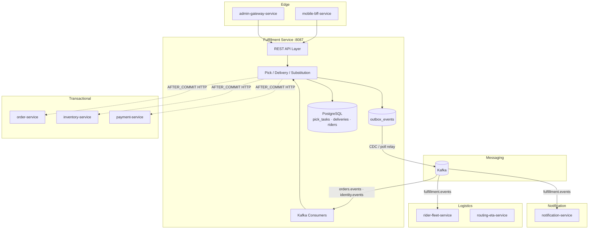
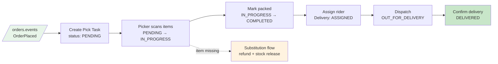
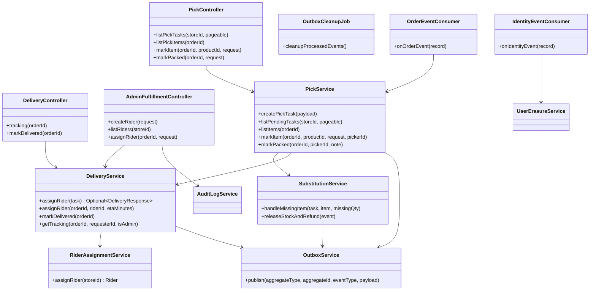
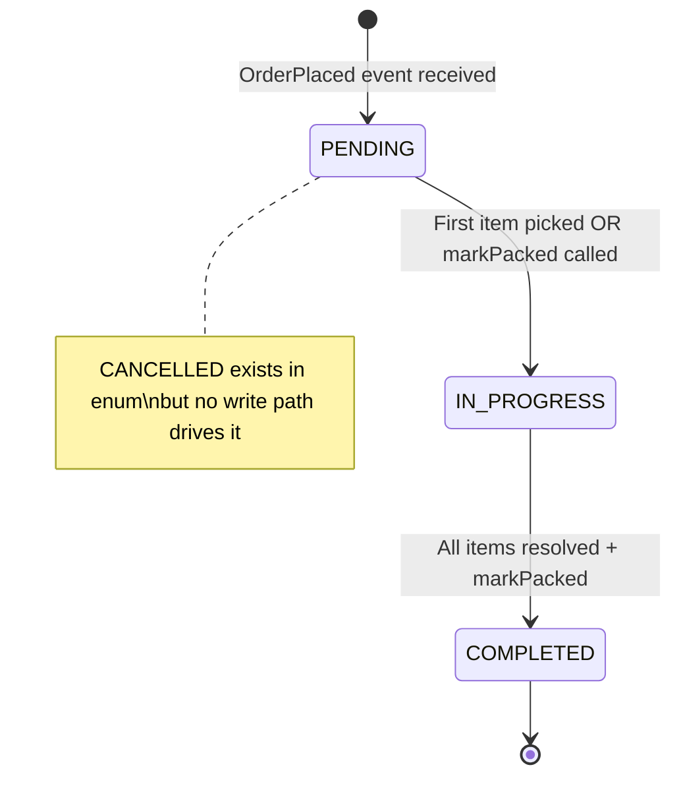
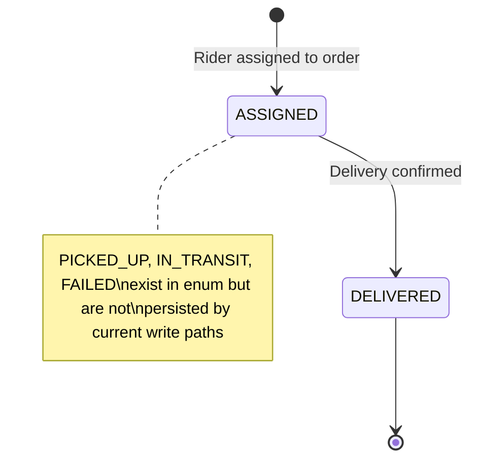
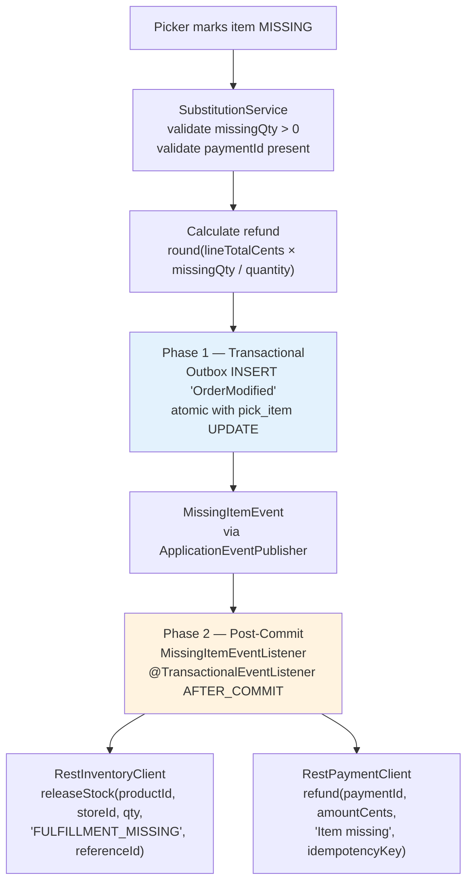
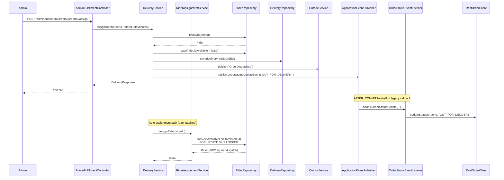
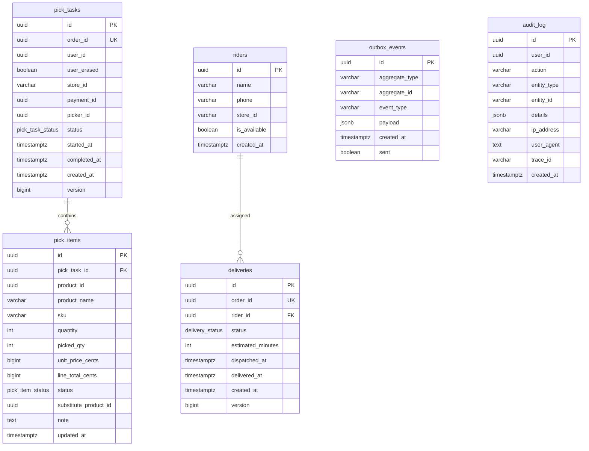

# Fulfillment Service

> **Module path:** `services/fulfillment-service` · **Port:** `8087` (local) / `8080` (container) · **Language:** Java 21 / Spring Boot 3

Pick-pack-deliver workflow engine. Consumes `OrderPlaced` events from Kafka,
creates store-level pick tasks, manages item-level picking with substitution /
missing-item refunds, coordinates rider assignment and delivery confirmation, and
publishes fulfillment lifecycle events via the transactional outbox pattern.

---

## 1. Service Role & Boundaries

**Owns:** pick tasks, pick items, deliveries, riders (legacy), outbox events, audit log.

**Does not own:** order lifecycle, payment processing, inventory levels, rider
fleet management, dispatch optimization, ETA computation, live GPS tracking.

The service sits between the order domain (`order-service`) and the logistics
layer (`rider-fleet-service`, `routing-eta-service`). It is the **sole authority**
for pick/pack state and the current (legacy) authority for simple rider
assignment; the iter-3 architecture review
([`docs/reviews/iter3/services/fulfillment-logistics.md`](../../docs/reviews/iter3/services/fulfillment-logistics.md))
designates `rider-fleet-service` as the target single assignment authority, with
this service's `RiderAssignmentService` to be deprecated.

| Boundary | Upstream | Downstream |
|----------|----------|------------|
| Events consumed | `orders.events` (`OrderPlaced`), `identity.events` (`UserErased`) | — |
| Events published | — | `fulfillment.events` (`OrderPacked`, `OrderDispatched`, `OrderDelivered`, `OrderModified`) |
| Sync HTTP calls (outbound) | — | `order-service` (legacy callback), `inventory-service` (stock release), `payment-service` (refund) |
| Sync HTTP calls (inbound) | `mobile-bff-service`, `admin-gateway-service` | — |

---

## 2. Hybrid Rollout Posture

The service maintains **two parallel status-propagation paths** as a deliberate
migration posture:

1. **Durable path (outbox):** `OutboxService.publish()` writes events atomically
   within the fulfillment transaction. These are relayed to `fulfillment.events`
   via CDC or poll relay.
2. **Legacy path (HTTP callback):** `OrderStatusEventListener` fires
   `AFTER_COMMIT` and calls `RestOrderClient.updateStatus()` into
   `order-service`. This is a **best-effort** call — failures are logged, not
   retried.

The legacy callback is gated by a single flag:

```
FULFILLMENT_CHOREOGRAPHY_ORDER_STATUS_CALLBACK_ENABLED=true  # default
```

Set to `false` when the downstream order-service Kafka consumer is the sole
status propagation path. The flag does **not** affect outbox publishing.

A dedicated Micrometer counter `fulfillment.order_status_callback.skipped`
tracks how many callbacks are suppressed when the flag is off, providing
operational visibility during migration.

---

## 3. High-Level Design (HLD)

### 3.1 System Context



### 3.2 Fulfillment Pipeline



---

## 4. Low-Level Design (LLD)

### 4.1 Component Overview

| Layer | Component | Responsibility |
|-------|-----------|----------------|
| Controller | `PickController` | Picker-facing pick list and packing endpoints (`/fulfillment/picklist`, `/fulfillment/orders/*/packed`) |
| Controller | `DeliveryController` | Order tracking and delivery confirmation (`/orders/*/tracking`, `/fulfillment/orders/*/delivered`) |
| Controller | `AdminFulfillmentController` | Admin rider & dispatch management (`/admin/fulfillment`), audit-logged |
| Service | `PickService` | Pick task creation, item picking, packing state transitions, auto-complete detection |
| Service | `DeliveryService` | Rider assignment (admin + auto), dispatch, delivery confirmation, tracking timeline |
| Service | `RiderAssignmentService` | FIFO rider selection per store via `SELECT … FOR UPDATE SKIP LOCKED` |
| Service | `SubstitutionService` | 2-phase missing-item handling — transactional outbox write + post-commit inventory release & payment refund |
| Service | `OutboxService` | Transactional outbox writes (`Propagation.MANDATORY` — must join caller's TX) |
| Service | `OutboxCleanupJob` | ShedLock-guarded cron (`0 0 */6 * * *`) — purges sent events older than 7 days |
| Service | `UserErasureService` | GDPR right-to-erasure: anonymizes `userId` in `pick_tasks` to nil UUID, sets `user_erased = true` |
| Service | `AuditLogService` | Structured audit trail capturing IP, User-Agent, OTEL traceId |
| Consumer | `OrderEventConsumer` | `@KafkaListener(topics = "orders.events", groupId = "fulfillment-service")` → creates pick tasks on `OrderPlaced` |
| Consumer | `IdentityEventConsumer` | `@KafkaListener(topics = "identity.events", groupId = "fulfillment-service-erasure")` → anonymizes user on `UserErased` |
| Client | `RestOrderClient` | Legacy best-effort HTTP callback into `order-service /admin/orders/{id}/status` (connect 5s / read 10s) |
| Client | `RestInventoryClient` | Releases stock via `inventory-service /inventory/adjust` (connect 5s / read 10s) |
| Client | `RestPaymentClient` | Issues refunds via `payment-service /payments/{id}/refund` (connect 5s / read 10s) |
| Listener | `OrderStatusEventListener` | `@TransactionalEventListener(AFTER_COMMIT)` — fires legacy HTTP callback if enabled |
| Listener | `MissingItemEventListener` | `@TransactionalEventListener(AFTER_COMMIT)` — triggers phase-2 stock release + refund |
| Security | `JwtAuthenticationFilter` | Validates JWT bearer tokens (RSA public key, configurable issuer) |
| Security | `InternalServiceAuthFilter` | Authenticates service-to-service calls via `X-Internal-Service` / `X-Internal-Token` headers |

### 4.2 Component Diagram (UML)



---

## 5. State Machines, Events & Callbacks

### 5.1 Pick Task State Machine



| From | To | Trigger | Guard |
|------|----|---------|-------|
| `PENDING` | `IN_PROGRESS` | `markItem()` or `markPacked()` with resolved items | Task must not be `COMPLETED` or `CANCELLED` |
| `IN_PROGRESS` | `COMPLETED` | All items in terminal status (`PICKED`/`MISSING`/`SUBSTITUTED`) + `markPacked()` or auto-complete | `countByPickTask_IdAndStatus(PENDING) == 0` |
| `COMPLETED` | _(terminal)_ | — | — |

**Pick item statuses:** `PENDING` → `PICKED`, `MISSING`, or `SUBSTITUTED`

> `CANCELLED` exists in `PickTaskStatus` and is reflected in tracking/status
> mapping code (`resolveStatus()`), but no controller or event flow currently
> drives a cancellation transition.

### 5.2 Delivery State Machine



| From | To | Trigger |
|------|----|---------|
| `ASSIGNED` | `DELIVERED` | `POST /fulfillment/orders/{orderId}/delivered` or `markDelivered()` |
| `DELIVERED` | _(terminal)_ | — |

> `PICKED_UP`, `IN_TRANSIT`, and `FAILED` exist in `DeliveryStatus` and are
> normalized by `resolveStatus()` for tracking, but current write paths only
> persist `ASSIGNED` and `DELIVERED`.

### 5.3 Substitution / Missing-Item 2-Phase Flow



The two-phase pattern ensures the outbox write is atomic with the pick-item
update, while HTTP calls to external services happen after the transaction
commits. Both HTTP calls are fire-and-forget with error logging — failures do
not roll back the outbox event.

### 5.4 Rider Assignment Sequence



### 5.5 Event Contract Summary

**Published events** (via outbox → `fulfillment.events`):

| Event | Trigger | Key Payload Fields |
|-------|---------|-------------------|
| `OrderPacked` | Pick task completed | `orderId`, `userId`, `storeId`, `packedAt`, `note` |
| `OrderDispatched` | Rider assigned & dispatched | `orderId`, `userId`, `riderId`, `riderName`, `estimatedMinutes`, `dispatchedAt` |
| `OrderDelivered` | Delivery confirmed | `orderId`, `userId`, `deliveredAt` |
| `OrderModified` | Item missing / substituted | `orderId`, `productId`, `missingQty`, `refundCents` |

**Consumed events:**

| Topic | Group ID | Event | Action |
|-------|----------|-------|--------|
| `orders.events` | `fulfillment-service` | `OrderPlaced` | Create pick task + pick items (idempotent via `uq_pick_order`) |
| `identity.events` | `fulfillment-service-erasure` | `UserErased` | Anonymize userId in `pick_tasks` (GDPR) |

**Error handling:** `DefaultErrorHandler` with `FixedBackOff(1000 ms, 3 retries)` → `DeadLetterPublishingRecoverer` → `*.DLT` topic on exhaustion.

---

## 6. Event Flow Diagram

```mermaid
flowchart LR
    subgraph Consumed Events
        OEV[/"orders.events"/]
        IEV[/"identity.events"/]
    end

    subgraph Fulfillment Service
        OEC[OrderEventConsumer]
        IEC[IdentityEventConsumer]
        PS[PickService]
        DS[DeliveryService]
        SS[SubstitutionService]
        UES[UserErasureService]
        OBS[OutboxService]
        OE[(outbox_events)]
    end

    subgraph Published Events
        FEV[/"fulfillment.events"/]
        DLT[/"*.DLT"/]
    end

    subgraph Downstream
        ORD[order-service]
        NS[notification-service]
        RFS2[rider-fleet-service]
    end

    OEV -->|OrderPlaced| OEC --> PS
    IEV -->|UserErased| IEC --> UES

    PS -->|@Transactional| OBS --> OE
    DS -->|@Transactional| OBS
    SS -->|@Transactional| OBS

    OE -->|CDC / poll relay| FEV
    FEV --> NS
    FEV --> RFS2
    OEV -.->|on failure| DLT

    PS -.->|AFTER_COMMIT best-effort HTTP| ORD
    DS -.->|AFTER_COMMIT best-effort HTTP| ORD
```

---

## 7. Database Schema



**Key indexes:**

| Table | Index | Purpose |
|-------|-------|---------|
| `pick_tasks` | `idx_pick_tasks_store` | Composite on `(store_id, status)` — picker picklist queries |
| `pick_items` | `idx_pick_items_task` | FK lookup on `(pick_task_id)` |
| `deliveries` | `idx_deliveries_rider` | Composite on `(rider_id, status)` — rider workload |
| `riders` | `idx_riders_store` | Composite on `(store_id, is_available)` — assignment query |
| `outbox_events` | `idx_outbox_unsent` | Partial index `WHERE sent = false` — relay poll |
| `audit_log` | `idx_audit_user_id`, `idx_audit_action`, `idx_audit_created_at` | Lookup by user, action type, time range |

**Migrations:** Flyway-managed, `src/main/resources/db/migration/V1` through `V8`:

| Version | Description |
|---------|-------------|
| V1 | `pick_tasks`, `pick_items` tables + enum types + `idx_pick_tasks_store` |
| V2 | `riders`, `deliveries` tables + enum type + `idx_deliveries_rider`, `idx_riders_store` |
| V3 | `outbox_events` table + `idx_outbox_unsent` partial index |
| V4 | `audit_log` table + indexes |
| V5 | `pick_tasks.user_erased` boolean column (GDPR) |
| V6 | `version` columns on `pick_tasks` and `deliveries` (optimistic locking) |
| V7 | `shedlock` table (distributed cron) |
| V8 | `pick_items.sku` column |

**Concurrency controls:**
- `@Version` optimistic locking on `pick_tasks` and `deliveries` entities
- `SELECT … FOR UPDATE SKIP LOCKED` on rider assignment (`RiderRepository.findNextAvailableForStore`)
- Unique constraint `uq_pick_order` prevents duplicate pick tasks per order
- Unique constraint `uq_delivery_order` prevents duplicate deliveries per order
- `DataIntegrityViolationException` catch in `createPickTask()` for idempotent reprocessing

---

## 8. Runtime & Configuration

### 8.1 Configuration Reference

| Property | Env Var | Default |
|----------|---------|---------|
| Server port | `SERVER_PORT` | `8087` |
| Graceful shutdown timeout | — | `30s` |
| Database URL | `FULFILLMENT_DB_URL` | `jdbc:postgresql://localhost:5432/fulfillment` |
| Database user | `FULFILLMENT_DB_USER` | `postgres` |
| Database password | `FULFILLMENT_DB_PASSWORD` | `sm://db-password-fulfillment` |
| HikariCP max pool | — | `20` |
| HikariCP min idle | — | `5` |
| HikariCP connect timeout | — | `5000 ms` |
| HikariCP max lifetime | — | `1800000 ms` (30 min) |
| Kafka bootstrap | `KAFKA_BOOTSTRAP_SERVERS` | `localhost:9092` |
| Kafka consumer group | `FULFILLMENT_KAFKA_GROUP` | `fulfillment-service` |
| Kafka auto-offset-reset | — | `earliest` |
| Order service URL | `ORDER_SERVICE_URL` | `http://localhost:8085` |
| Payment service URL | `PAYMENT_SERVICE_URL` | `http://localhost:8086` |
| Inventory service URL | `INVENTORY_SERVICE_URL` | `http://localhost:8083` |
| JWT issuer | `FULFILLMENT_JWT_ISSUER` | `instacommerce-identity` |
| JWT public key | `FULFILLMENT_JWT_PUBLIC_KEY` | `sm://jwt-rsa-public-key` |
| Internal service token | `INTERNAL_SERVICE_TOKEN` | `dev-internal-token-change-in-prod` |
| Default delivery ETA | `FULFILLMENT_DEFAULT_ETA_MINUTES` | `15` |
| Legacy HTTP callback | `FULFILLMENT_CHOREOGRAPHY_ORDER_STATUS_CALLBACK_ENABLED` | `true` |
| Trace sampling | `TRACING_PROBABILITY` | `1.0` |
| OTLP traces endpoint | `OTEL_EXPORTER_OTLP_TRACES_ENDPOINT` | `http://otel-collector.monitoring:4318/v1/traces` |
| OTLP metrics endpoint | `OTEL_EXPORTER_OTLP_METRICS_ENDPOINT` | `http://otel-collector.monitoring:4318/v1/metrics` |
| Environment tag | `ENVIRONMENT` | `dev` |
| CORS allowed origins | `fulfillment.cors.allowed-origins` | `http://localhost:3000,https://*.instacommerce.dev` |

### 8.2 Container Runtime

- **Base image:** `eclipse-temurin:21-jre-alpine`
- **JVM flags:** `-XX:MaxRAMPercentage=75.0 -XX:+UseZGC`
- **Non-root user:** `app` (uid 1001)
- **Container port:** `8080` (`SERVER_PORT` overridden in Dockerfile)
- **Healthcheck:** `wget -qO- http://localhost:8080/actuator/health/liveness` every 30s, 3 retries
- **Secrets:** GCP Secret Manager via `spring.config.import: optional:sm://`

### 8.3 Security Model

| Mechanism | Details |
|-----------|---------|
| JWT authentication | RSA public key verification, configurable issuer, stateless sessions |
| Role-based access | `ROLE_PICKER` (pick endpoints), `ROLE_RIDER` (delivery confirmation), `ROLE_ADMIN` (admin endpoints) |
| Internal service auth | `X-Internal-Service` + `X-Internal-Token` headers → granted `ROLE_INTERNAL_SERVICE` + `ROLE_ADMIN` |
| Outbound auth | `InternalServiceAuthInterceptor` adds service headers to all RestTemplate calls |
| CORS | Configurable origins, credentials allowed, 1-hour preflight cache |
| Method security | `@EnableMethodSecurity` + `@PreAuthorize` on admin controller |

---

## 9. Dependencies

### 9.1 Runtime Dependencies

| Dependency | Purpose |
|------------|---------|
| `spring-boot-starter-web` | REST API |
| `spring-boot-starter-data-jpa` | JPA/Hibernate ORM |
| `spring-boot-starter-security` | Authentication & authorization |
| `spring-boot-starter-validation` | Bean validation |
| `spring-boot-starter-actuator` | Health, metrics, info endpoints |
| `spring-boot-starter-kafka` | Kafka consumer/producer |
| `micrometer-tracing-bridge-otel` | Distributed tracing (OTLP) |
| `micrometer-registry-otlp` | Metrics export (OTLP) |
| `logstash-logback-encoder:7.4` | Structured JSON logging |
| `spring-cloud-gcp-starter-secretmanager` | GCP Secret Manager integration |
| `postgres-socket-factory:1.15.0` | Cloud SQL socket factory (GCP) |
| `flyway-core` + `flyway-database-postgresql` | Schema migrations |
| `jjwt-api:0.12.5` + `jjwt-impl` + `jjwt-jackson` | JWT parsing & validation |
| `postgresql` (runtime) | JDBC driver |

### 9.2 Test Dependencies

| Dependency | Purpose |
|------------|---------|
| `spring-boot-starter-test` | JUnit 5 + Mockito + AssertJ |
| `spring-security-test` | Security test utilities |
| `testcontainers:postgresql:1.19.3` | Integration test PostgreSQL |
| `testcontainers:junit-jupiter:1.19.3` | Testcontainers JUnit 5 extension |

### 9.3 Service Dependencies

| Service | Protocol | Purpose | Timeout |
|---------|----------|---------|---------|
| `order-service` (:8085) | HTTP (legacy callback) | Status updates (`/admin/orders/{id}/status`) | 5s connect / 10s read |
| `inventory-service` (:8083) | HTTP | Stock release (`/inventory/adjust`) | 5s connect / 10s read |
| `payment-service` (:8086) | HTTP | Refunds (`/payments/{id}/refund`) | 5s connect / 10s read |
| PostgreSQL | JDBC | Primary data store | 5s connect, pool max 20 |
| Kafka | Consumer/Producer | Event consumption and DLT publishing | — |

---

## 10. Observability

### 10.1 Health Endpoints

| Endpoint | Purpose | Auth |
|----------|---------|------|
| `/actuator/health/liveness` | Kubernetes liveness probe (container healthcheck) | Public |
| `/actuator/health/readiness` | Kubernetes readiness probe (includes DB check) | Public |
| `/actuator/prometheus` | Prometheus metrics scrape | Public |
| `/actuator/metrics` | Micrometer metrics (JSON) | Public |
| `/actuator/info` | Application info | Public |

Readiness includes `readinessState` + `db` health indicators. Liveness includes
`livenessState` only.

### 10.2 Key Metrics

| Metric | Type | Tags | Source |
|--------|------|------|--------|
| `fulfillment.order_status_callback.skipped` | Counter | — | `OrderStatusEventListener` — migration visibility |
| Spring Kafka consumer metrics | Multiple | `topic`, `group` | Auto-configured |
| HikariCP pool metrics | Gauge | — | Auto-configured via Actuator |
| JVM / GC metrics | Multiple | — | Micrometer auto-instrumentation |
| HTTP server request metrics | Timer | `method`, `uri`, `status` | Spring MVC auto-instrumentation |

### 10.3 Logging & Tracing

- **Format:** Structured JSON via `logstash-logback-encoder:7.4`
- **Tracing:** Micrometer OTEL bridge → OTLP exporter to `otel-collector.monitoring:4318`
- **Sampling:** Configurable via `TRACING_PROBABILITY` (default `1.0` — 100%)
- **TraceId in errors:** All API error responses include the current `traceId` from OTEL context
- **Audit log:** Structured `audit_log` table with `user_id`, `action`, `entity_type`, `entity_id`, `ip_address`, `user_agent`, `trace_id`

---

## 11. API Reference

### 11.1 Picker Endpoints (`/fulfillment`) — requires `ROLE_PICKER`

| Method | Path | Description | Request | Response |
|--------|------|-------------|---------|----------|
| `GET` | `/fulfillment/picklist/{storeId}` | List pending/in-progress pick tasks (paginated) | `Pageable` | `Page<PickTaskResponse>` |
| `GET` | `/fulfillment/picklist/{orderId}/items` | List pick items for an order | — | `List<PickItemResponse>` |
| `POST` | `/fulfillment/picklist/{orderId}/items/{productId}` | Mark item picked/missing/substituted | `MarkItemPickedRequest` | `PickItemResponse` |
| `POST` | `/fulfillment/orders/{orderId}/packed` | Mark order packed | `MarkPackedRequest` (optional body) | `PickTaskResponse` |

### 11.2 Delivery Endpoints — requires `ROLE_RIDER` or authenticated

| Method | Path | Auth | Description | Response |
|--------|------|------|-------------|----------|
| `GET` | `/orders/{orderId}/tracking` | Authenticated (owner or admin) | Delivery tracking + timeline | `TrackingResponse` |
| `POST` | `/fulfillment/orders/{orderId}/delivered` | `ROLE_RIDER` | Confirm delivery | `DeliveryResponse` |

### 11.3 Admin Endpoints (`/admin/fulfillment`) — requires `ROLE_ADMIN`

| Method | Path | Description | Request | Response |
|--------|------|-------------|---------|----------|
| `POST` | `/admin/fulfillment/riders` | Create a rider | `CreateRiderRequest` | `RiderResponse` |
| `GET` | `/admin/fulfillment/riders?storeId=` | List riders (optionally by store) | `storeId` query param | `List<RiderResponse>` |
| `POST` | `/admin/fulfillment/orders/{orderId}/assign` | Assign rider to order | `AssignRiderRequest` | `DeliveryResponse` |

### 11.4 Request Bodies

```json
// POST /fulfillment/picklist/{orderId}/items/{productId}
{
  "status": "PICKED | MISSING | SUBSTITUTED",
  "pickedQty": 2,
  "substituteProductId": "uuid (required if SUBSTITUTED)",
  "note": "optional note"
}

// POST /fulfillment/orders/{orderId}/packed
{ "note": "optional packing note" }

// POST /fulfillment/orders/{orderId}/delivered
{ "note": "optional delivery note" }

// POST /admin/fulfillment/riders
{
  "name": "Rider Name",
  "phone": "+919876543210",
  "storeId": "store-001"
}

// POST /admin/fulfillment/orders/{orderId}/assign
{
  "riderId": "uuid",
  "estimatedMinutes": 15
}
```

### 11.5 Error Response Format

```json
{
  "code": "PICK_TASK_NOT_FOUND",
  "message": "Pick task not found for order",
  "traceId": "abc123",
  "timestamp": "2025-01-01T00:00:00Z",
  "details": []
}
```

| HTTP Status | Code | Cause |
|-------------|------|-------|
| `400` | `VALIDATION_ERROR` | Invalid request body / parameters / `pickedQty > quantity` / substitution without `substituteProductId` |
| `403` | `ACCESS_DENIED` | Missing required role |
| `404` | `PICK_TASK_NOT_FOUND` | No pick task for order |
| `404` | `PICK_ITEM_NOT_FOUND` | Item not in pick list |
| `404` | `DELIVERY_NOT_FOUND` | No delivery for order |
| `404` | `RIDER_NOT_FOUND` | Rider does not exist |
| `409` | `INVALID_PICK_TASK_STATE` | Illegal state transition (e.g., mark packed on cancelled task) |
| `409` | `NO_AVAILABLE_RIDER` | No available riders for store / selected rider unavailable |
| `500` | `INTERNAL_ERROR` | Unhandled server error |

---

## 12. Testing

```bash
# Run all tests
./gradlew :services:fulfillment-service:test

# Run a specific test class
./gradlew :services:fulfillment-service:test --tests "com.instacommerce.fulfillment.event.OrderStatusEventListenerTest"
```

**Current test coverage:**

| Test | Type | What it validates |
|------|------|-------------------|
| `OrderStatusEventListenerTest` | Unit (Mockito) | Legacy HTTP callback flag: enabled by default invokes `OrderClient`; disabled skips client and increments `fulfillment.order_status_callback.skipped` counter; multiple events accumulate counter |

Test infrastructure includes `spring-boot-starter-test`, `spring-security-test`,
and Testcontainers PostgreSQL — the wiring is in place for integration tests but
broader coverage has not yet been written.

---

## 13. Failure Modes

| Failure | Impact | Current Mitigation | Residual Risk |
|---------|--------|--------------------|---------------|
| PostgreSQL down | All writes fail, readiness probe fails, pod removed from LB | HikariCP connection timeout (5s), Kubernetes readiness removes pod | Pick tasks created during outage will be retried from Kafka (earliest offset) |
| Kafka broker unreachable | No new pick tasks created, DLT unavailable | Consumer retries with `FixedBackOff(1s, 3)`, then DLT | If Kafka is fully down, DLT also fails — consumer will rebalance on recovery |
| `inventory-service` unreachable | Stock not released for missing items | Logged and swallowed in `SubstitutionService.releaseStockAndRefund()` | Inventory drift until manual reconciliation — no automatic retry |
| `payment-service` unreachable | Refund not issued | Logged and swallowed in `SubstitutionService.releaseStockAndRefund()` | Customer overcharged until manual refund — no automatic retry |
| `order-service` unreachable (callback) | Legacy status update not delivered | Logged and swallowed in `RestOrderClient.updateStatus()` | Outbox event still published; downstream consumers get the event via Kafka |
| Concurrent rider assignment | Two orders claim same rider | `SELECT … FOR UPDATE SKIP LOCKED` on `RiderRepository.findNextAvailableForStore()` | Mitigated for auto-assignment; admin manual assignment checks `rider.isAvailable` but without row lock |
| Duplicate `OrderPlaced` event | Duplicate pick task attempt | Unique constraint `uq_pick_order` + `DataIntegrityViolationException` catch | Idempotent — silently ignored |
| GDPR erasure replay | Re-anonymization of already-erased user | Idempotent — `UPDATE … SET userId = placeholder WHERE userId = :userId` returns 0 rows | No risk |
| Outbox relay lag | Events delayed to downstream consumers | Separate concern — relay is external (CDC/Debezium or poll-based) | `idx_outbox_unsent` partial index ensures efficient polling |
| ShedLock failure | Outbox cleanup doesn't run | Lock held for max 30 min (`lockAtMostFor`), next cron window retries | Outbox table grows; no correctness impact |

---

## 14. Rollout & Rollback Notes

### Rollout

1. **Database-first:** Flyway migrations run automatically on boot. Migrations
   V1–V8 are additive (new tables, new columns, new indexes) — safe to run
   against a live database.
2. **Feature flag:** The `FULFILLMENT_CHOREOGRAPHY_ORDER_STATUS_CALLBACK_ENABLED`
   flag allows the legacy HTTP callback to be disabled per-environment without a
   code deploy. Recommended sequence: enable Kafka-based order status consumer
   in `order-service` → validate → set flag to `false` → monitor
   `fulfillment.order_status_callback.skipped` counter.
3. **Graceful shutdown:** `server.shutdown=graceful` with 30s drain timeout
   ensures in-flight requests complete before pod termination.

### Rollback

1. **Code rollback:** Standard Kubernetes rolling update. Previous version will
   re-validate schema via `ddl-auto: validate` — safe as long as migrations are
   additive.
2. **Migration rollback:** Flyway does not support auto-rollback. For V5–V8
   (column additions), the previous code simply ignores the new columns. For
   V1–V4 (table creation), rollback requires manual `DROP` statements — these
   are destructive and should only be used in pre-production.
3. **Feature flag rollback:** Set
   `FULFILLMENT_CHOREOGRAPHY_ORDER_STATUS_CALLBACK_ENABLED=true` to re-enable
   the legacy HTTP callback instantly.

---

## 15. Known Limitations

1. **Dual-write migration posture:** The service emits outbox events **and**
   performs a best-effort after-commit HTTP callback into `order-service`. This
   is intentional but must converge to outbox-only.
2. **Incomplete delivery state machine:** Write paths only persist `ASSIGNED`
   and `DELIVERED`. `PICKED_UP`, `IN_TRANSIT`, and `FAILED` exist in the enum
   and in `resolveStatus()` mapping but have no active write paths.
3. **No cancellation flow:** `PickTaskStatus.CANCELLED` exists in the domain
   model but no controller, consumer, or event flow drives the transition.
4. **Fire-and-forget HTTP side effects:** `RestInventoryClient` and
   `RestPaymentClient` calls in the substitution phase-2 flow are not retried
   on failure — inventory drift and missed refunds require manual reconciliation.
5. **Legacy rider assignment:** `RiderAssignmentService` uses FIFO-by-last-dispatch
   selection. The iter-3 architecture review recommends migrating to
   `rider-fleet-service` with composite scoring (distance + idle time + rating),
   GPS-aware assignment, and pre-pack rider staging.
6. **No per-segment SLA metrics:** State transitions emit high-level events but
   no `confirm_to_pick_ms`, `pick_to_pack_ms`, `pack_to_dispatch_ms`, or
   `dispatch_to_deliver_ms` timers for SLA segment visibility.
7. **Limited test coverage:** Only `OrderStatusEventListenerTest` exists.
   Integration tests using Testcontainers are wired but not yet written.
8. **No pack verification:** `markPacked()` transitions state without
   scanning verification or item-count guards beyond checking all items are
   in a terminal status.

---

## 16. Q-Commerce Fulfillment Comparison Note

The iter-3 architecture review
([`docs/reviews/iter3/services/fulfillment-logistics.md`](../../docs/reviews/iter3/services/fulfillment-logistics.md),
[`docs/reviews/iter3/diagrams/lld/fulfillment-dispatch-eta.md`](../../docs/reviews/iter3/diagrams/lld/fulfillment-dispatch-eta.md))
benchmarks this service against India q-commerce operators (Blinkit, Zepto,
Swiggy Instamart). Key grounded gaps:

| Dimension | This Service (Current) | India Operator Pattern | Gap Source |
|-----------|----------------------|----------------------|------------|
| Rider assignment trigger | Post-pack (`OrderPacked`) | Pre-pack (`OrderConfirmed`) — rider staged before pack completes | +3–6 min `pack_to_dispatch` latency |
| Assignment algorithm | FIFO by last dispatch, store-scoped | Composite score (distance + idle + rating + load) via optimizer | No GPS, no scoring |
| Availability freshness | Direct DB query (row lock) | Redis with 5–10s GPS refresh | This service's row lock is correct but rider-fleet's 60s Caffeine cache (separate service) is stale |
| SLA segment tracking | No per-segment metrics | Per-segment timers with breach alerting | No operational visibility into which segment breaches SLA |
| Pick location hints | Items have name + SKU only | Aisle/shelf/bin location for dark store pickers | Missing warehouse topology |

These gaps are tracked in the iter-3 recommendations register and are **not**
limitations of this service alone — they require coordinated changes across
`rider-fleet-service`, `dispatch-optimizer-service`, `location-ingestion-service`,
and `routing-eta-service`.

---

## Local Development

```bash
# Build (skip tests)
./gradlew :services:fulfillment-service:build -x test

# Run locally (requires PostgreSQL + Kafka from docker-compose)
./gradlew :services:fulfillment-service:bootRun

# Run tests
./gradlew :services:fulfillment-service:test
```

| Endpoint | Local | Container |
|----------|-------|-----------|
| Application | `http://localhost:8087` | `http://localhost:8080` |
| Liveness | `/actuator/health/liveness` | same |
| Readiness | `/actuator/health/readiness` | same |
| Prometheus | `/actuator/prometheus` | same |
