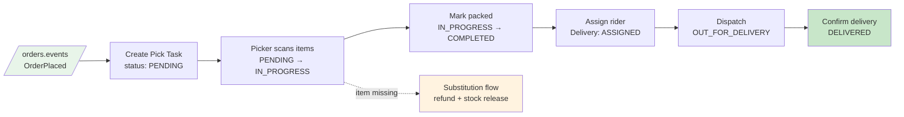
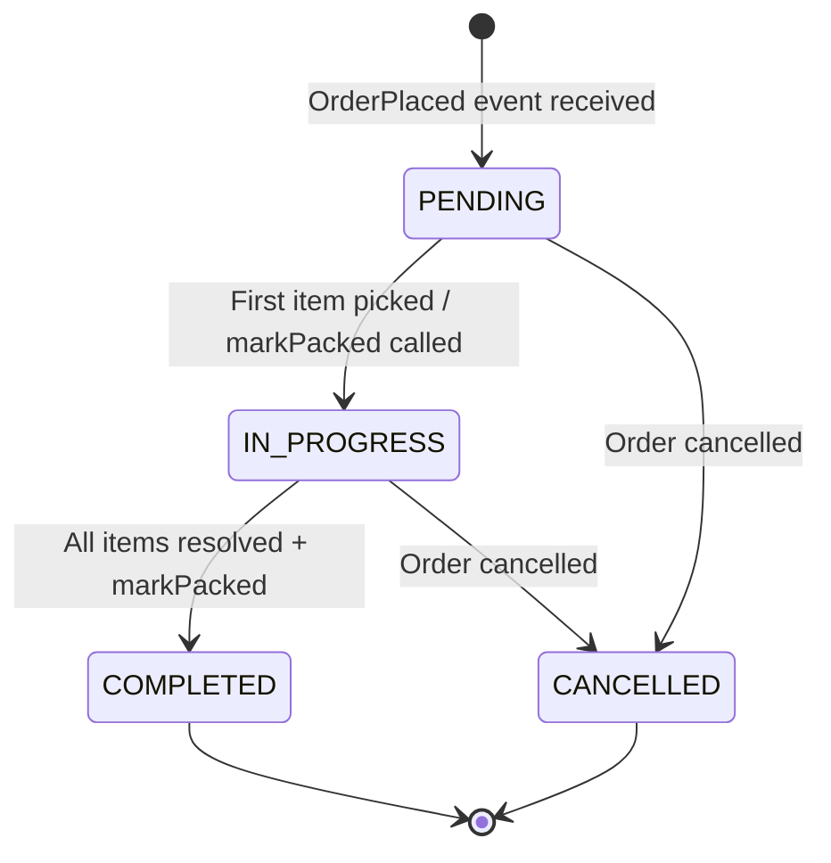
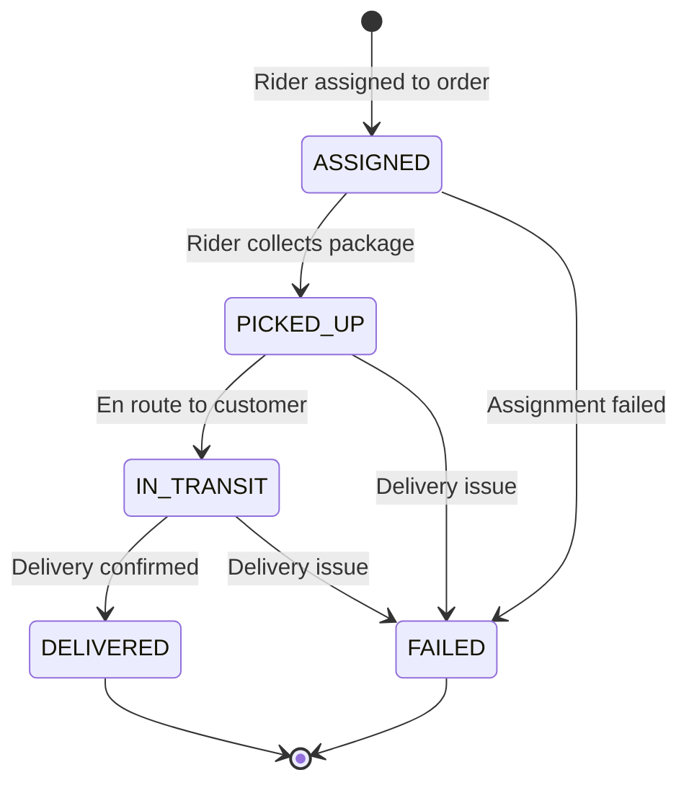
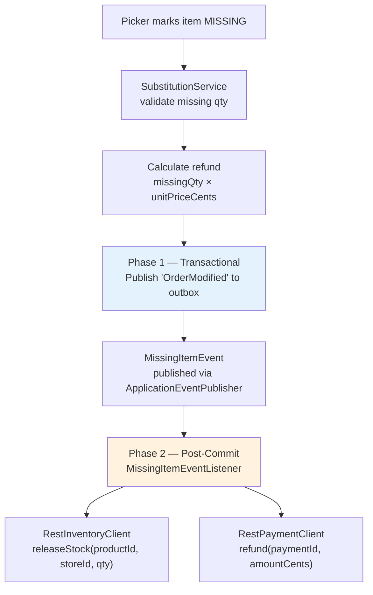
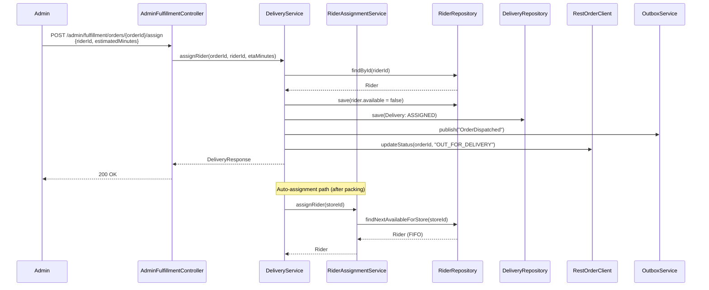
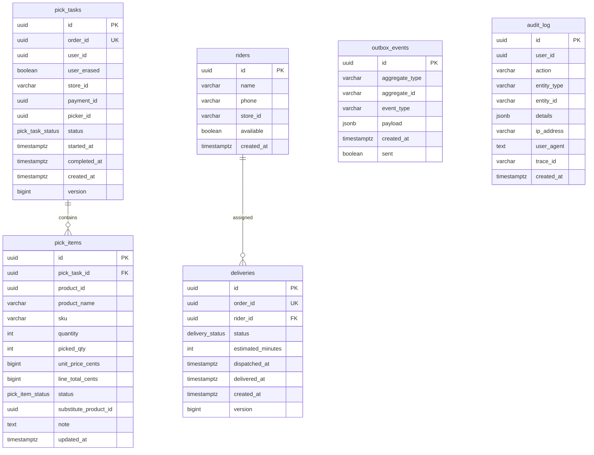

# Fulfillment Service

Pick-pack-deliver workflow engine. Consumes **order events** from Kafka, creates pick tasks for store pickers, manages the delivery lifecycle (rider assignment → dispatch → delivery), handles item substitutions with automatic refunds, and publishes **fulfillment events** via the transactional outbox pattern.

## Key Components

| Layer | Component | Responsibility |
|-------|-----------|----------------|
| Controller | `PickController` | Picker-facing pick list and packing endpoints (`/fulfillment/picklist`, `/fulfillment/orders/*/packed`) |
| Controller | `DeliveryController` | Order tracking and delivery confirmation (`/orders/*/tracking`, `/fulfillment/orders/*/delivered`) |
| Controller | `AdminFulfillmentController` | Admin rider & dispatch management (`/admin/fulfillment`) |
| Service | `PickService` | Pick task creation, item picking, packing state transitions |
| Service | `DeliveryService` | Rider assignment, dispatch, delivery confirmation, tracking timeline |
| Service | `RiderAssignmentService` | FIFO rider selection per store |
| Service | `SubstitutionService` | Missing-item handling — inventory release + payment refund (2-phase) |
| Service | `OutboxService` | Transactional outbox writes (`Propagation.MANDATORY`) |
| Service | `OutboxCleanupJob` | ShedLock-guarded cron that purges sent events |
| Service | `UserErasureService` | GDPR anonymization of user data in fulfillment records |
| Service | `AuditLogService` | Structured audit trail with IP, User-Agent, traceId |
| Consumer | `OrderEventConsumer` | Listens to `orders.events` → creates pick tasks on `OrderPlaced` |
| Consumer | `IdentityEventConsumer` | Listens to `identity.events` → anonymizes user on `UserErased` |
| Client | `RestOrderClient` | Updates order status in order-service |
| Client | `RestInventoryClient` | Releases stock via inventory-service |
| Client | `RestPaymentClient` | Issues refunds via payment-service |

## Architecture

### 1. Fulfillment Pipeline



---

### 2. Pick Task State Machine



| From | Allowed To |
|------|-----------|
| `PENDING` | `IN_PROGRESS`, `CANCELLED` |
| `IN_PROGRESS` | `COMPLETED`, `CANCELLED` |
| `COMPLETED` | _(terminal)_ |
| `CANCELLED` | _(terminal)_ |

**Pick Item statuses:** `PENDING` → `PICKED`, `MISSING`, or `SUBSTITUTED`

---

### 3. Delivery State Machine



| From | Allowed To |
|------|-----------|
| `ASSIGNED` | `PICKED_UP`, `FAILED` |
| `PICKED_UP` | `IN_TRANSIT`, `FAILED` |
| `IN_TRANSIT` | `DELIVERED`, `FAILED` |
| `DELIVERED` | _(terminal)_ |
| `FAILED` | _(terminal)_ |

---

### 4. Substitution Flow



The two-phase pattern ensures the outbox write is atomic with the pick-item update, while HTTP calls to external services happen after the transaction commits.

---

### 5. Rider Assignment Sequence



---

### 6. Event Flow

```mermaid
flowchart LR
    subgraph Consumed Events
        OEV[/"orders.events"/]
        IEV[/"identity.events"/]
    end

    subgraph Fulfillment Service
        OEC[OrderEventConsumer]
        IEC[IdentityEventConsumer]
        PS[PickService]
        DS[DeliveryService]
        SS[SubstitutionService]
        UES[UserErasureService]
        OBS[OutboxService]
        OE[(outbox_events)]
    end

    subgraph Published Events
        FEV[/"fulfillment.events"/]
        DLT[/"*.DLT"/]
    end

    subgraph Downstream
        ORD[order-service]
        NS[notification-service]
    end

    OEV -->|OrderPlaced| OEC --> PS
    IEV -->|UserErased| IEC --> UES

    PS -->|@Transactional| OBS --> OE
    DS -->|@Transactional| OBS
    SS -->|@Transactional| OBS

    OE -->|CDC / poll relay| FEV
    FEV --> NS
    OEV -.->|on failure| DLT

    PS -->|HTTP| ORD
    DS -->|HTTP| ORD
```

**Published events** (via outbox → `fulfillment.events`):

| Event | Trigger | Key Payload Fields |
|-------|---------|-------------------|
| `OrderPacked` | Pick task completed | `orderId`, `userId`, `storeId`, `packedAt`, `note` |
| `OrderDispatched` | Rider assigned & dispatched | `orderId`, `riderId`, `estimatedMinutes`, `dispatchedAt` |
| `OrderDelivered` | Delivery confirmed | `orderId`, `riderId`, `deliveredAt` |
| `OrderModified` | Item missing / substituted | `orderId`, `productId`, `missingQty`, `refundCents` |

**Consumed events:**

| Topic | Group ID | Event | Action |
|-------|----------|-------|--------|
| `orders.events` | `fulfillment-service` | `OrderPlaced` | Create pick task + pick items |
| `identity.events` | `fulfillment-service-erasure` | `UserErased` | Anonymize user data (GDPR) |

**Error handling:** `DefaultErrorHandler` with `FixedBackOff(1000 ms, 3 retries)` → Dead Letter Topic on exhaustion.

> **Choreography rollout note:** The legacy HTTP callback to order-service
> (`OrderStatusEventListener` → `RestOrderClient.updateStatus`) can be disabled
> via `FULFILLMENT_CHOREOGRAPHY_ORDER_STATUS_CALLBACK_ENABLED=false` once
> order-service's Kafka-based fulfillment event consumer is promoted to handle
> status transitions. Disabling the callback avoids a dual-update path where both
> the HTTP call and the Kafka choreography consumer update the same order state.
> Outbox event publishing is unaffected by this flag.

---

### 7. API Reference

#### Picker Endpoints (`/fulfillment`) — requires `ROLE_PICKER`

| Method | Path | Description | Request | Response |
|--------|------|-------------|---------|----------|
| `GET` | `/fulfillment/picklist/{storeId}` | List pending/in-progress pick tasks (paginated) | `Pageable` | `Page<PickTaskResponse>` |
| `GET` | `/fulfillment/picklist/{orderId}/items` | List pick items for an order | — | `List<PickItemResponse>` |
| `POST` | `/fulfillment/picklist/{orderId}/items/{productId}` | Mark item picked/missing/substituted | `MarkItemPickedRequest` | `PickItemResponse` |
| `POST` | `/fulfillment/orders/{orderId}/packed` | Mark order packed | `MarkPackedRequest` | `PickTaskResponse` |

#### Delivery Endpoints — requires `ROLE_RIDER` or authenticated

| Method | Path | Auth | Description | Response |
|--------|------|------|-------------|----------|
| `GET` | `/orders/{orderId}/tracking` | Authenticated | Get delivery tracking + timeline | `TrackingResponse` |
| `POST` | `/fulfillment/orders/{orderId}/delivered` | `ROLE_RIDER` | Confirm delivery | `DeliveryResponse` |

#### Admin Endpoints (`/admin/fulfillment`) — requires `ROLE_ADMIN`

| Method | Path | Description | Request | Response |
|--------|------|-------------|---------|----------|
| `POST` | `/admin/fulfillment/riders` | Create a rider | `CreateRiderRequest` | `RiderResponse` |
| `GET` | `/admin/fulfillment/riders?storeId=` | List riders for a store | `storeId` query param | `List<RiderResponse>` |
| `POST` | `/admin/fulfillment/orders/{orderId}/assign` | Assign rider to order | `AssignRiderRequest` | `DeliveryResponse` |

#### Request Bodies

```json
// POST /fulfillment/picklist/{orderId}/items/{productId}
{
  "status": "PICKED | MISSING | SUBSTITUTED",
  "pickedQty": 2,
  "substituteProductId": "uuid (optional)",
  "note": "optional note"
}

// POST /fulfillment/orders/{orderId}/packed
{ "note": "optional packing note" }

// POST /fulfillment/orders/{orderId}/delivered
{ "note": "optional delivery note" }

// POST /admin/fulfillment/riders
{
  "name": "Rider Name",
  "phone": "+919876543210",
  "storeId": "store-001"
}

// POST /admin/fulfillment/orders/{orderId}/assign
{
  "riderId": "uuid",
  "estimatedMinutes": 15
}
```

#### Error Response Format

```json
{
  "code": "PICK_TASK_NOT_FOUND",
  "message": "Pick task not found for order",
  "traceId": "abc123",
  "timestamp": "2025-01-01T00:00:00Z",
  "details": []
}
```

| HTTP Status | Code | Cause |
|-------------|------|-------|
| `400` | `VALIDATION_ERROR` | Invalid request body / parameters |
| `403` | `ACCESS_DENIED` | Missing required role |
| `404` | `PICK_TASK_NOT_FOUND` | No pick task for order |
| `404` | `PICK_ITEM_NOT_FOUND` | Item not in pick list |
| `404` | `DELIVERY_NOT_FOUND` | No delivery for order |
| `404` | `RIDER_NOT_FOUND` | Rider does not exist |
| `409` | `INVALID_PICK_TASK_STATE` | Illegal state transition |
| `409` | `NO_AVAILABLE_RIDER` | No riders available for store |
| `500` | `INTERNAL_ERROR` | Unhandled server error |

---

## Database Schema



**Key indexes:**

| Table | Index | Purpose |
|-------|-------|---------|
| `pick_tasks` | `idx_pick_tasks_store` | Filter by `(store_id, status)` |
| `deliveries` | `idx_deliveries_rider` | Filter by `(rider_id, status)` |
| `riders` | `idx_riders_store` | Available riders by `(store_id, is_available)` |
| `outbox_events` | `idx_outbox_unsent` | Partial index `WHERE sent = false` |
| `audit_log` | `idx_audit_user_id` / `idx_audit_action` / `idx_audit_created_at` | Lookup by user, action, time range |

Migrations managed by **Flyway** (`src/main/resources/db/migration/` — V1 through V8).

---

## Configuration

| Property | Env Var | Default |
|----------|---------|---------|
| Server port | `SERVER_PORT` | `8087` |
| Database URL | — | `jdbc:postgresql://localhost:5432/fulfillment` |
| Database password | `FULFILLMENT_DB_PASSWORD` | — |
| Kafka bootstrap | `KAFKA_BOOTSTRAP_SERVERS` | `localhost:9092` |
| Order service URL | `ORDER_SERVICE_URL` | `http://localhost:8085` |
| Payment service URL | `PAYMENT_SERVICE_URL` | `http://localhost:8086` |
| Inventory service URL | `INVENTORY_SERVICE_URL` | `http://localhost:8083` |
| JWT issuer | `FULFILLMENT_JWT_ISSUER` | `instacommerce-identity` |
| JWT public key | `FULFILLMENT_JWT_PUBLIC_KEY` | — |
| Default delivery ETA | `FULFILLMENT_DEFAULT_ETA_MINUTES` | `15` |
| Order-status HTTP callback | `FULFILLMENT_CHOREOGRAPHY_ORDER_STATUS_CALLBACK_ENABLED` | `true` |

## Tech Stack

- **Java 21**, Spring Boot 3, Spring Data JPA, Spring Security
- **PostgreSQL** with Flyway migrations
- **Kafka** (Spring Kafka) for event consumption & outbox publishing
- **ShedLock** for distributed cron scheduling
- **Micrometer + OTLP** for metrics and distributed tracing
- **Testcontainers** (PostgreSQL) for integration tests
- **GCP Secret Manager** for secrets in production
