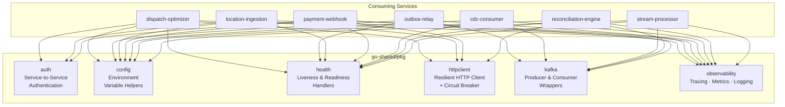
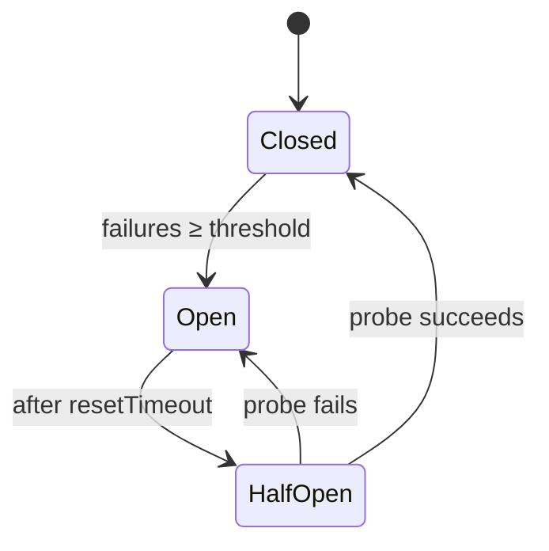

# Go Shared Libraries

> **Common Packages Used by All InstaCommerce Go Services**

A collection of battle-tested, production-ready packages that provide consistent authentication, configuration, health checks, HTTP clients, Kafka integration, and observability across all Go microservices in the InstaCommerce platform.

## Package Dependency Diagram



## Packages

### `pkg/auth` — Service-to-Service Authentication

HTTP middleware that validates internal service-to-service calls using shared token authentication.

**Key types:**
- `InternalAuthMiddleware` — validates `X-Internal-Service` and `X-Internal-Token` headers
- `Wrap(next http.Handler) http.Handler` — wraps any handler with auth enforcement

**Features:**
- Constant-time token comparison (`crypto/subtle`)
- Automatic skip for health/metrics endpoints
- Configurable via `INTERNAL_SERVICE_TOKEN` and `INTERNAL_SERVICE_NAME`

**Usage:**
```go
authMiddleware := auth.NewInternalAuthMiddleware(logger)
handler := authMiddleware.Wrap(mux)
```

---

### `pkg/config` — Environment Variable Helpers

Type-safe environment variable loading with defaults and validation.

**Functions:**
| Function | Returns | Description |
|---|---|---|
| `GetEnv(key, default)` | `string` | String env var with fallback |
| `GetEnvInt(key, default)` | `int` | Integer env var with fallback |
| `GetEnvDuration(key, default)` | `time.Duration` | Duration env var (e.g. `"5s"`) |
| `GetEnvBool(key, default)` | `bool` | Boolean env var (`true`/`1`/`yes`) |
| `MustGetEnv(key)` | `string` | Panics if not set |
| `GetEnvSlice(key, sep, default)` | `[]string` | Split string env var |

**Usage:**
```go
port := config.GetEnv("PORT", "8080")
timeout := config.GetEnvDuration("REQUEST_TIMEOUT", 5*time.Second)
brokers := config.GetEnvSlice("KAFKA_BROKERS", ",", nil)
dbURL := config.MustGetEnv("DATABASE_URL") // panics if empty
```

---

### `pkg/health` — Liveness & Readiness Handlers

Standard Kubernetes health-check handlers with pluggable dependency checks.

**Key types:**
- `Handler` — manages readiness state and dependency checks
- `Check` — named dependency verifier (`func(ctx) error`)

**Features:**
- `/health` — deep health check with all dependency results
- `/health/live` — lightweight liveness probe
- `/health/ready` — readiness probe (controlled via `SetReady`)
- Concurrent dependency checks with 5-second timeout
- JSON response with per-check latency

**Usage:**
```go
healthHandler := health.NewHandler(
    health.Check{Name: "postgres", Check: db.PingContext},
    health.Check{Name: "redis", Check: func(ctx context.Context) error {
        return redisClient.Ping(ctx).Err()
    }},
)
healthHandler.SetReady(true)

mux.HandleFunc("/health", healthHandler.HealthHandler())
mux.HandleFunc("/health/ready", healthHandler.ReadyHandler())
mux.HandleFunc("/health/live", healthHandler.LiveHandler())
```

---

### `pkg/httpclient` — Resilient HTTP Client

Production HTTP client with automatic retries, exponential backoff with jitter, and a circuit breaker.

**Key types:**
- `Client` — wraps `http.Client` with retry and circuit-breaker logic
- `CircuitBreaker` — three-state circuit breaker (Closed → Open → HalfOpen)

**Features:**
- Configurable retry count with exponential backoff + jitter
- Circuit breaker trips after N consecutive failures
- Half-open probe after reset timeout
- JSON request/response helpers
- Context-aware cancellation

**Circuit Breaker States:**


**Usage:**
```go
client := httpclient.New(httpclient.Options{
    BaseURL:        "http://order-service:8080",
    Timeout:        5 * time.Second,
    MaxRetries:     3,
    BackoffBase:    100 * time.Millisecond,
    CircuitBreaker: true,
    FailureThreshold: 5,
    ResetTimeout:   30 * time.Second,
    Logger:         logger,
})

var result OrderResponse
err := client.GetJSON(ctx, "/api/v1/orders/123", &result)
```

---

### `pkg/kafka` — Producer & Consumer Wrappers

Production-grade Kafka producer and consumer wrappers built on `segmentio/kafka-go`.

#### Producer

**Features:**
- Idempotent writes (`RequiredAcks: -1`)
- Configurable batching and compression (snappy, lz4, gzip, zstd)
- Automatic retries
- `PublishJSON` helper for marshalling

**Usage:**
```go
producer, err := kafka.NewProducer(kafka.ProducerConfig{
    Brokers:      []string{"localhost:9092"},
    ClientID:     "my-service",
    RequiredAcks: -1,
    BatchSize:    100,
    Compression:  "snappy",
}, logger)
defer producer.Close()

err = producer.Publish(ctx, "orders.events", orderID, payload)
```

#### Consumer

**Features:**
- Managed consumer group with automatic offset commits
- Sequential per-partition processing
- Graceful shutdown with drain
- `MessageHandler` callback interface

**Usage:**
```go
consumer, err := kafka.NewConsumer(kafka.ConsumerConfig{
    Brokers: []string{"localhost:9092"},
    GroupID: "my-consumer-group",
    Topics:  []string{"orders.events"},
}, func(ctx context.Context, msg kafka.Message) error {
    // process message
    return nil
}, logger)

go consumer.Start(ctx)
defer consumer.Close()
```

---

### `pkg/observability` — Tracing · Metrics · Logging

Unified observability stack for all Go services.

#### Tracing (`tracing.go`)

Initialises an OpenTelemetry TracerProvider with OTLP/HTTP export.

**Usage:**
```go
shutdown, err := observability.InitTracer(ctx, "my-service", logger)
defer shutdown(ctx)
```

**Env vars:** `OTEL_EXPORTER_OTLP_ENDPOINT`, `SERVICE_VERSION`, `ENVIRONMENT`

#### Logging (`logging.go`)

Creates a structured `slog.Logger` with environment-aware formatting.

**Features:**
- JSON output in production, text output in development
- Automatic `service_name` and `service_version` attributes
- Source location included at DEBUG level

**Usage:**
```go
logger := observability.NewLogger("info")
```

**Env vars:** `ENVIRONMENT`, `SERVICE_NAME`, `SERVICE_VERSION`

#### Metrics (`metrics.go`)

Standard Prometheus HTTP metrics with middleware.

**Metrics registered:**
| Metric | Type | Labels |
|---|---|---|
| `{ns}_http_requests_total` | Counter | method, path, status |
| `{ns}_http_request_duration_seconds` | Histogram | method, path, status |
| `{ns}_http_request_size_bytes` | Histogram | method, path |
| `{ns}_http_response_size_bytes` | Histogram | method, path |

**Usage:**
```go
httpMetrics := observability.NewHTTPMetrics("dispatch_optimizer")
handler := httpMetrics.Instrument(mux)
```

## Project Structure

```
go-shared/
├── go.mod
└── pkg/
    ├── auth/
    │   └── middleware.go      # InternalAuthMiddleware
    ├── config/
    │   └── config.go          # GetEnv, GetEnvInt, GetEnvDuration, etc.
    ├── health/
    │   └── handler.go         # Health/Ready/Live handlers with dep checks
    ├── httpclient/
    │   └── client.go          # Resilient HTTP client + CircuitBreaker
    ├── kafka/
    │   ├── producer.go        # Idempotent Kafka producer
    │   └── consumer.go        # Managed consumer group
    └── observability/
        ├── tracing.go         # OTel TracerProvider init
        ├── logging.go         # Structured slog.Logger factory
        └── metrics.go         # Prometheus HTTP metrics + middleware
```

## Installation

```go
// In your service's go.mod
require github.com/instacommerce/go-shared v0.0.0
```

## Dependencies

- Go 1.22+
- `github.com/prometheus/client_golang` (Prometheus metrics)
- `github.com/segmentio/kafka-go` (Kafka client)
- `go.opentelemetry.io/otel` (OpenTelemetry tracing)
- `go.opentelemetry.io/contrib/instrumentation/net/http/otelhttp` (HTTP instrumentation)
