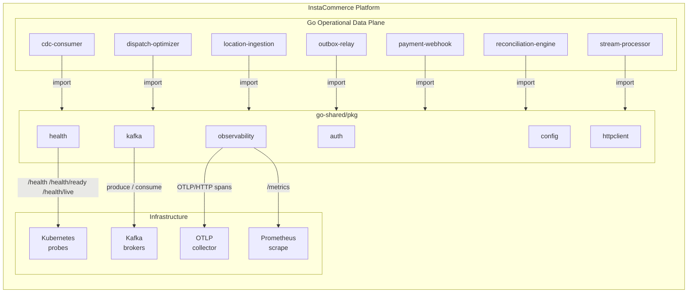
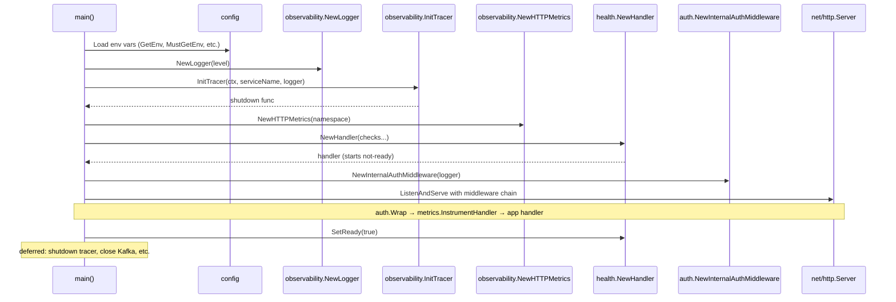
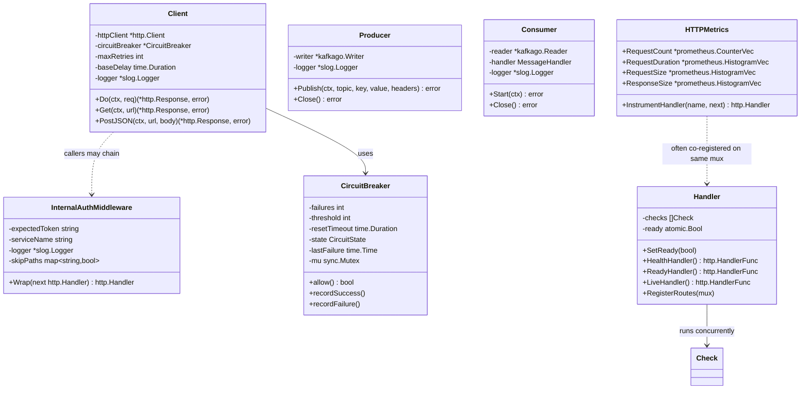
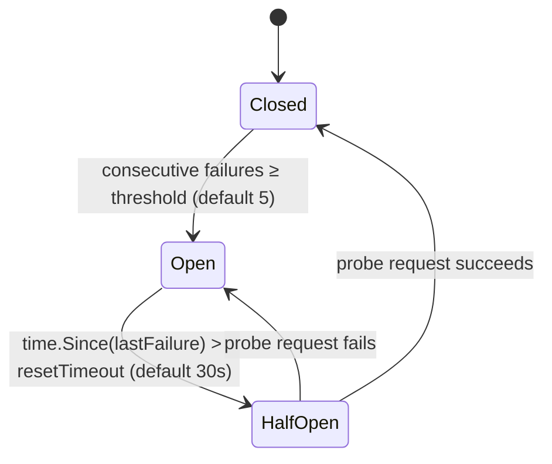

# Go Shared Libraries (`go-shared`)

> Platform library providing auth, config, health, HTTP resilience, Kafka, and
> observability primitives for all InstaCommerce Go services.

| | |
|---|---|
| **Module** | `github.com/instacommerce/go-shared` |
| **Go version** | 1.23+ (`go.mod`) |
| **Owner** | `@instacommerce/platform-team` |
| **CI trigger** | Any change under `services/go-shared/**` revalidates **all 8 Go modules** (see [CI / Governance](#ci--governance)) |
| **Packages** | `auth` · `config` · `health` · `httpclient` · `kafka` · `observability` |
| **Test files** | None checked in (see [Known Limitations](#known-limitations)) |

---

## Table of Contents

- [Library Role and Boundaries](#library-role-and-boundaries)
- [High-Level Design](#high-level-design)
- [Low-Level Design](#low-level-design)
- [Package Responsibilities](#package-responsibilities)
  - [pkg/auth](#pkgauth--service-to-service-authentication)
  - [pkg/config](#pkgconfig--environment-variable-helpers)
  - [pkg/health](#pkghealth--kubernetes-health-probes)
  - [pkg/httpclient](#pkghttpclient--resilient-http-client)
  - [pkg/kafka](#pkgkafka--producer--consumer-wrappers)
  - [pkg/observability](#pkgobservability--tracing--metrics--logging)
- [Adoption Patterns](#adoption-patterns)
- [Runtime and Configuration](#runtime-and-configuration)
- [Observability and Testing](#observability-and-testing)
- [Failure Modes](#failure-modes)
- [CI / Governance](#ci--governance)
- [Migration Guidance](#migration-guidance)
- [Known Limitations](#known-limitations)
- [Industry Pattern Comparison](#industry-pattern-comparison)
- [Project Structure](#project-structure)
- [Dependencies](#dependencies)

---

## Library Role and Boundaries

`go-shared` is a **leaf dependency with no runtime of its own**. It is imported
by the seven Go services that form InstaCommerce's operational data plane:

| Service | Uses |
|---|---|
| `cdc-consumer-service` | config, health, kafka (consumer), observability |
| `dispatch-optimizer-service` | auth, config, health, httpclient, observability |
| `location-ingestion-service` | auth, config, health, httpclient, observability |
| `outbox-relay-service` | config, health, kafka (producer), observability |
| `payment-webhook-service` | auth, config, health, httpclient, kafka, observability |
| `reconciliation-engine` | config, health, httpclient, kafka, observability |
| `stream-processor-service` | config, health, kafka, observability |

**What it is:**

- A curated set of cross-cutting Go packages each service composes at its own
  discretion. No framework, no forced lifecycle, no init-order coupling.
- A standardisation point for Kubernetes probes, Prometheus metric naming,
  structured logging shape, OTLP trace setup, and internal auth headers.

**What it is not:**

- Not a deployable service — CI validates builds and tests but never produces
  a Docker image for `go-shared`.
- Not a framework or service chassis — it does not own `main()`, HTTP server
  lifecycle, or graceful-shutdown orchestration.
- Not a domain library — business logic, event envelope types, and topic
  routing remain in each service or in `contracts/`.

---

## High-Level Design

### System Context — Where go-shared Sits



### Request Flow — Service Startup Sequence



---

## Low-Level Design

### Component Relationships



### Circuit Breaker State Machine



---

## Package Responsibilities

### `pkg/auth` — Service-to-Service Authentication

HTTP middleware validating internal service calls via shared-token headers.
Defined in `middleware.go`.

| Symbol | Kind | Description |
|---|---|---|
| `HeaderService` | `const` | `"X-Internal-Service"` — identifies the calling service |
| `HeaderToken` | `const` | `"X-Internal-Token"` — carries the shared auth token |
| `InternalAuthMiddleware` | `struct` | Stateless middleware; holds expected token, service name, logger, skip-path set |
| `NewInternalAuthMiddleware(logger)` | `func` | Reads `INTERNAL_SERVICE_TOKEN` and `INTERNAL_SERVICE_NAME` from env |
| `Wrap(next http.Handler) http.Handler` | `method` | Wraps a handler with auth enforcement |

**Behaviour:**

- Paths `/health`, `/health/ready`, `/health/live`, `/metrics` bypass auth.
- Missing headers → `401 {"error":"missing authentication headers"}`.
- Bad token → `403 {"error":"forbidden"}`.
- Token comparison uses `crypto/subtle.ConstantTimeCompare` to prevent timing
  side-channels.

```go
authMiddleware := auth.NewInternalAuthMiddleware(logger)
handler := authMiddleware.Wrap(mux)
```

---

### `pkg/config` — Environment Variable Helpers

Type-safe env-var loading with sensible defaults and fail-fast semantics.
Defined in `config.go`.

| Function | Signature | Behaviour |
|---|---|---|
| `GetEnv` | `(key, defaultValue string) string` | Returns value or default if unset/empty |
| `GetEnvInt` | `(key string, defaultValue int) int` | Parses via `strconv.Atoi`; returns default on error |
| `GetEnvDuration` | `(key string, defaultValue time.Duration) time.Duration` | Parses via `time.ParseDuration` (e.g. `"5s"`, `"100ms"`) |
| `GetEnvBool` | `(key string, defaultValue bool) bool` | Truthy: `"true"`, `"1"`, `"yes"` (case-insensitive) |
| `GetEnvSlice` | `(key, sep string, defaultValue []string) []string` | Splits by separator; trims whitespace; drops empty elements |
| `MustGetEnv` | `(key string) string` | **Panics** with `"required environment variable %s is not set"` if unset/empty |

```go
port := config.GetEnv("PORT", "8080")
timeout := config.GetEnvDuration("REQUEST_TIMEOUT", 5*time.Second)
brokers := config.GetEnvSlice("KAFKA_BROKERS", ",", nil)
dbURL := config.MustGetEnv("DATABASE_URL") // panics if empty
```

---

### `pkg/health` — Kubernetes Health Probes

Standard liveness, readiness, and deep health-check endpoints with pluggable
dependency verifiers. Defined in `handler.go`.

| Symbol | Kind | Description |
|---|---|---|
| `Check` | `struct` | `Name string` + `Check func(ctx context.Context) error` |
| `Handler` | `struct` | Holds `[]Check` and an `atomic.Bool` ready flag |
| `NewHandler(checks ...Check)` | `func` | Creates handler; **starts not-ready** |
| `SetReady(bool)` | `method` | Toggles readiness (lock-free `atomic.Bool`) |
| `HealthHandler()` | `method` | Runs all checks concurrently (5 s timeout), returns JSON; 200 if all pass, 503 if any fail |
| `ReadyHandler()` | `method` | Returns `{"status":"ready"}` / `{"status":"not_ready"}` with 200 / 503 |
| `LiveHandler()` | `method` | Always returns `{"status":"alive"}` with 200 |
| `RegisterRoutes(mux)` | `method` | Registers `/health`, `/health/ready`, `/health/live` on the mux |

**Response examples:**

```jsonc
// GET /health — 200
{"status":"ok","checks":[{"name":"postgres","status":"ok","latency":"1.2ms"}]}

// GET /health — 503
{"status":"degraded","checks":[{"name":"kafka","status":"fail","error":"connection refused","latency":"5s"}]}
```

```go
h := health.NewHandler(
    health.Check{Name: "postgres", Check: db.PingContext},
    health.Check{Name: "kafka", Check: func(ctx context.Context) error {
        return kafkaReader.Stats().Lag // example
    }},
)
h.RegisterRoutes(mux)
// after all init completes:
h.SetReady(true)
```

---

### `pkg/httpclient` — Resilient HTTP Client

Production HTTP client with retries, exponential backoff + jitter, and a
three-state circuit breaker. Defined in `client.go`.

| Symbol | Kind | Description |
|---|---|---|
| `CircuitState` | `type int` | `Closed` (0), `Open` (1), `HalfOpen` (2) |
| `CircuitBreaker` | `struct` | `sync.Mutex`-protected state machine |
| `Client` | `struct` | Wraps `http.Client` + `CircuitBreaker` |
| `Option` | `func(*Client)` | Functional options pattern |
| `NewClient(opts ...Option)` | `func` | Creates client with production defaults |
| `Do(ctx, req)` | `method` | Execute with retry + circuit breaker |
| `Get(ctx, url)` | `method` | Convenience GET wrapper |
| `PostJSON(ctx, url, body)` | `method` | Marshals body as JSON, sends POST |

**Defaults** (from `NewClient`):

| Parameter | Default | Option |
|---|---|---|
| Timeout | 30 s | `WithTimeout(d)` |
| Max retries | 3 | `WithMaxRetries(n)` |
| Base delay | 500 ms | `WithBaseDelay(d)` |
| CB failure threshold | 5 consecutive | `WithCircuitBreakerThreshold(n)` |
| CB reset timeout | 30 s | `WithCircuitBreakerResetTimeout(d)` |

**Retry policy:** retries on network errors and HTTP 5xx responses only; 4xx
responses are returned immediately. Body is buffered and replayed across
attempts. Backoff formula: `baseDelay × 2^(attempt-1) + 20% jitter`.

```go
client := httpclient.NewClient(
    httpclient.WithTimeout(5*time.Second),
    httpclient.WithMaxRetries(3),
    httpclient.WithBaseDelay(100*time.Millisecond),
    httpclient.WithCircuitBreakerThreshold(5),
    httpclient.WithCircuitBreakerResetTimeout(30*time.Second),
    httpclient.WithLogger(logger),
)

resp, err := client.Get(ctx, "http://order-service:8080/api/v1/orders/123")
```

---

### `pkg/kafka` — Producer & Consumer Wrappers

Production Kafka wrappers built on `segmentio/kafka-go v0.4.47`. Defined in
`producer.go` and `consumer.go`.

#### Producer

| Symbol | Kind | Description |
|---|---|---|
| `ProducerConfig` | `struct` | Brokers, ClientID, RequiredAcks, MaxRetries, BatchSize, LingerMs, Compression |
| `Producer` | `struct` | Thread-safe writer wrapper |
| `NewProducer(cfg, logger)` | `func` | Validates config, resolves compression codec, creates `kafka-go.Writer` |
| `Publish(ctx, topic, key, value, headers)` | `method` | Synchronous single-message send (`Async: false`) |
| `Close()` | `method` | Flushes pending batch, releases resources |

**Defaults:** `RequiredAcks=-1` (all ISR), `MaxRetries=5`, `BatchSize=100`,
`LingerMs=10`, `Balancer=Hash{}`, `Async=false`.

**Compression codecs:** `"snappy"`, `"lz4"`, `"gzip"`, `"zstd"`, `""` (none).

```go
p, err := kafka.NewProducer(kafka.ProducerConfig{
    Brokers:     []string{"kafka:9092"},
    ClientID:    "outbox-relay",
    Compression: "snappy",
}, logger)
defer p.Close()

err = p.Publish(ctx, "orders.events", orderIDBytes, payload, headers)
```

#### Consumer

| Symbol | Kind | Description |
|---|---|---|
| `ConsumerConfig` | `struct` | Brokers, GroupID, Topics, MinBytes, MaxBytes, MaxWait |
| `Message` | `struct` | Topic, Partition, Offset, Key, Value, Headers (map), Timestamp |
| `MessageHandler` | `func(ctx, Message) error` | Callback per message |
| `Consumer` | `struct` | Manages a `kafka-go.Reader` consumer group |
| `NewConsumer(cfg, handler, logger)` | `func` | Validates config; creates reader with group |
| `Start(ctx)` | `method` | Blocking consume loop; returns nil on context cancellation |
| `Close()` | `method` | Shuts down reader, triggers rebalance |

**Defaults:** `MinBytes=1 KB`, `MaxBytes=10 MB`, `MaxWait=3 s`,
`CommitInterval=1 s` (hard-coded), `StartOffset=LastOffset`.

**Delivery semantics:** At-least-once, handler-gated. If the handler returns
an error, the offset is **not** committed and the message will be redelivered.

```go
c, err := kafka.NewConsumer(kafka.ConsumerConfig{
    Brokers: []string{"kafka:9092"},
    GroupID: "cdc-consumer-group",
    Topics:  []string{"pg.public.orders"},
}, func(ctx context.Context, msg kafka.Message) error {
    return processChange(ctx, msg)
}, logger)

go c.Start(ctx)
defer c.Close()
```

---

### `pkg/observability` — Tracing · Metrics · Logging

Unified observability stack across three files.

#### Tracing (`tracing.go`)

`InitTracer(ctx, serviceName, logger) (shutdownFn, error)` — initialises an
OpenTelemetry `TracerProvider` exporting via **OTLP/HTTP** (insecure) with
`ParentBased(TraceIDRatioBased(1.0))` sampling (100 %) and W3C TraceContext +
Baggage propagation.

| Env Var | Default | Purpose |
|---|---|---|
| `OTEL_EXPORTER_OTLP_ENDPOINT` | `localhost:4318` | OTLP collector address |
| `SERVICE_VERSION` | `"unknown"` | Attached to resource as `service.version` |
| `ENVIRONMENT` | `"development"` | Attached to resource as `deployment.environment` |

```go
shutdown, err := observability.InitTracer(ctx, "dispatch-optimizer-service", logger)
defer shutdown(ctx)
```

#### Logging (`logging.go`)

`NewLogger(level string) *slog.Logger` — creates a structured logger.

| Env Var | Effect |
|---|---|
| `ENVIRONMENT` | `"development"` / `"local"` → text handler; anything else → JSON handler |
| `SERVICE_NAME` | Attached as `service_name` default attribute |
| `SERVICE_VERSION` | Attached as `service_version` default attribute |

Level accepts `"DEBUG"`, `"INFO"`, `"WARN"`, `"ERROR"` (case-insensitive;
default `INFO`). Source location is included only at `DEBUG`.

```go
logger := observability.NewLogger("info")
```

#### Metrics (`metrics.go`)

`NewHTTPMetrics(namespace string) *HTTPMetrics` — creates and registers four
Prometheus metric families.

| Metric Name | Type | Labels | Buckets |
|---|---|---|---|
| `{ns}_http_requests_total` | Counter | method, path, status | — |
| `{ns}_http_request_duration_seconds` | Histogram | method, path, status | 5 ms … 10 s (11 buckets) |
| `{ns}_http_request_size_bytes` | Histogram | method, path | Exponential 64 B × 4, 8 buckets (~1 MB) |
| `{ns}_http_response_size_bytes` | Histogram | method, path | Same as request size |

`InstrumentHandler(name string, next http.Handler) http.Handler` wraps a
handler to record all four metrics automatically.

```go
metrics := observability.NewHTTPMetrics("dispatch_optimizer")
mux.Handle("/api/v1/dispatch", metrics.InstrumentHandler("dispatch", appHandler))
```

---

## Adoption Patterns

A typical consuming service wires go-shared in its `main()`:

```go
package main

import (
    "context"
    "net/http"
    "os"
    "os/signal"
    "syscall"

    "github.com/instacommerce/go-shared/pkg/auth"
    "github.com/instacommerce/go-shared/pkg/config"
    "github.com/instacommerce/go-shared/pkg/health"
    "github.com/instacommerce/go-shared/pkg/httpclient"
    "github.com/instacommerce/go-shared/pkg/observability"
    "github.com/prometheus/client_golang/prometheus/promhttp"
)

func main() {
    ctx, stop := signal.NotifyContext(context.Background(), syscall.SIGINT, syscall.SIGTERM)
    defer stop()

    // 1. Config
    port := config.GetEnv("PORT", "8080")
    logLevel := config.GetEnv("LOG_LEVEL", "info")

    // 2. Logging
    logger := observability.NewLogger(logLevel)

    // 3. Tracing
    shutdown, _ := observability.InitTracer(ctx, "my-service", logger)
    defer shutdown(ctx)

    // 4. Health
    h := health.NewHandler( /* checks */ )

    // 5. Auth middleware
    authMw := auth.NewInternalAuthMiddleware(logger)

    // 6. Metrics
    metrics := observability.NewHTTPMetrics("my_service")

    // 7. HTTP client for upstream calls
    client := httpclient.NewClient(
        httpclient.WithTimeout(config.GetEnvDuration("UPSTREAM_TIMEOUT", 5*time.Second)),
        httpclient.WithLogger(logger),
    )

    // 8. Assemble
    mux := http.NewServeMux()
    h.RegisterRoutes(mux)
    mux.Handle("/metrics", promhttp.Handler())
    mux.Handle("/api/", metrics.InstrumentHandler("api", authMw.Wrap(appHandler(client))))

    h.SetReady(true)
    http.ListenAndServe(":"+port, mux)
}
```

**Key principle:** Each service chooses which packages to import. There is no
required boot order beyond: config → logger → tracer → everything else.

---

## Runtime and Configuration

### Full Environment Variable Reference

| Variable | Package | Default | Required | Notes |
|---|---|---|---|---|
| `INTERNAL_SERVICE_TOKEN` | `auth` | `""` | Yes (for authed paths) | Shared secret; same value in all services |
| `INTERNAL_SERVICE_NAME` | `auth` | `""` | No | Used in log context only |
| `ENVIRONMENT` | `observability` | `"production"` (logging) / `"development"` (tracing) | No | Controls JSON vs text logging and trace resource |
| `SERVICE_NAME` | `observability` | `""` | No | Default log attribute |
| `SERVICE_VERSION` | `observability` | `"unknown"` | No | Trace + log attribute |
| `OTEL_EXPORTER_OTLP_ENDPOINT` | `observability` | `"localhost:4318"` | No | OTLP/HTTP collector address |

Service-specific variables (ports, Kafka brokers, database URLs, etc.) are
loaded via `config.GetEnv` / `config.MustGetEnv` in each service's `main()`.

### Kubernetes Contract

| Endpoint | Probe Type | HTTP | Behaviour |
|---|---|---|---|
| `/health` | Deep check | `GET` | Runs all registered checks concurrently (5 s timeout). 200 = ok, 503 = degraded. |
| `/health/ready` | Readiness | `GET` | Controlled by `SetReady(bool)`. 200 / 503. |
| `/health/live` | Liveness | `GET` | Always 200 `{"status":"alive"}`. |
| `/metrics` | Prometheus scrape | `GET` | Standard Prometheus exposition format. |

---

## Observability and Testing

### Observability

- **Traces:** OTLP/HTTP spans to the configured collector with W3C
  TraceContext propagation. All services sharing the same collector will form
  a single distributed trace across Java (Spring OTEL auto-instrumentation),
  Go (go-shared InitTracer), and Python (OpenTelemetry SDK) services.
- **Metrics:** Prometheus counters and histograms per service namespace,
  scraped at `/metrics`. Bucket boundaries are tuned for sub-second latency
  budgets.
- **Logs:** Structured JSON (production) or text (development) via `slog`
  with `service_name` and `service_version` attributes.

### Testing

- **No test files** exist in go-shared today. This is a known gap.
- CI validates go-shared via `go build ./...` and `go test ./...` (which
  currently passes vacuously). Each consuming service's own test suite serves
  as integration-level coverage.
- Validate locally:

  ```bash
  cd services/go-shared && go build ./... && go vet ./...
  ```

- When go-shared changes, CI forces revalidation of all 7 consuming Go
  services:

  ```bash
  # CI runs per-service:
  cd services/<service> && go test ./... && go build ./...
  ```

---

## Failure Modes

| Scenario | Package | Behaviour | Mitigation |
|---|---|---|---|
| `INTERNAL_SERVICE_TOKEN` unset | `auth` | Middleware compares against empty string; every request with a non-empty token gets 403 | Use `config.MustGetEnv` for this variable in service `main()` |
| `MustGetEnv` variable missing | `config` | **Process panics** at startup with descriptive message | Intentional fail-fast; set all required env vars in Helm values |
| All health checks fail | `health` | `/health` returns 503 `{"status":"degraded",...}` | Kubernetes restarts pod via liveness; investigate dependency |
| Circuit breaker opens | `httpclient` | All requests immediately fail with `"circuit breaker is open for METHOD URL"` | CB auto-transitions to half-open after `resetTimeout` (default 30 s) |
| Retries exhausted | `httpclient` | Error: `"METHOD URL failed after N attempts: ..."` | Caller receives wrapped error; should log and handle gracefully |
| Kafka broker unreachable | `kafka` | Producer `Publish` returns error; consumer `Start` returns error on fetch | Caller retries or circuit-breaks; consumer loop exits on non-context errors |
| Handler error in consumer | `kafka` | Offset **not committed**; message redelivered on next poll | Service must ensure handler idempotency or tolerate duplicates |
| OTLP collector unreachable | `observability` | `InitTracer` succeeds (exporter is async); spans are silently dropped by batcher | Monitor collector health separately; traces degrade gracefully |
| Prometheus register collision | `observability` | `MustRegister` panics if the same namespace is registered twice in one process | Call `NewHTTPMetrics` exactly once per namespace |

---

## CI / Governance

go-shared changes have a blast radius across the entire Go service fleet.

**Path filter** (from `.github/workflows/ci.yml`):

```
go-shared: 'services/go-shared/**'
```

When this filter matches, CI sets the Go matrix to **all 8 modules**:

```
go-shared, cdc-consumer-service, dispatch-optimizer-service,
location-ingestion-service, outbox-relay-service, payment-webhook-service,
reconciliation-engine, stream-processor-service
```

Each module runs `go test ./...` and `go build ./...` independently.
go-shared itself is **excluded** from Docker image builds and Helm deploy
tag updates (the CI logic: `[[ "$svc" == "go-shared" ]] && continue`).

**Review policy** (per `docs/reviews/iter3/platform/repo-truth-ownership.md`):
Changes require platform-team approval plus 2 additional reviewers.

---

## Migration Guidance

### Adding go-shared to a New Go Service

1. Add a `replace` directive or versioned `require` in the service's `go.mod`:

   ```
   require github.com/instacommerce/go-shared v0.0.0

   replace github.com/instacommerce/go-shared => ../go-shared
   ```

2. Import only the packages you need — no "all-or-nothing" dependency.

3. Update `.github/workflows/ci.yml`:
   - Add the service to the path filter list.
   - Add the service to the Go matrix array `all_go_services`.
   - If the Go module name differs from the Helm chart name, add an entry to
     `go_service_to_helm`.

### Adding a New Package to go-shared

1. Create `pkg/<name>/<name>.go` following existing patterns (package doc
   comment, `*slog.Logger` parameter, env vars via `config` or `os.Getenv`).
2. Run `cd services/go-shared && go build ./...` to validate.
3. **All 7 consuming services must be retested** — CI handles this
   automatically, but verify locally for critical changes.
4. Update this README.

### Upgrading a Dependency

1. Run `cd services/go-shared && go get <module>@<version> && go mod tidy`.
2. Verify no breaking API changes affect consuming services.
3. CI will revalidate all Go modules on the PR.

---

## Rollout & Rollback

- update shared packages with compatibility in mind because a small API change can fan out across every Go service in the repo
- roll out breaking behavior behind additive helpers or migration windows rather than in-place signature churn
- validate one consumer locally first, then expand to the rest of the Go fleet before merging wide-reaching shared-library changes

## Known Limitations

These are grounded in checked-in code and documented in
`docs/reviews/iter3/` platform reviews.

| # | Limitation | Impact | Reference |
|---|---|---|---|
| 1 | **No test files** in go-shared | Correctness relies entirely on downstream service tests | All source dirs lack `_test.go` files |
| 2 | **Single flat token** for all internal auth | Any compromised pod can impersonate any other service | `middleware.go` uses one `INTERNAL_SERVICE_TOKEN` |
| 3 | **Consumer `StartOffset: LastOffset`** | New consumer groups silently skip any existing backlog | `consumer.go` line 88 |
| 4 | **Consumer `CommitInterval: 1s` hard-coded** | Commits may race ahead of handler; tuning requires code change | `consumer.go` line 87 |
| 5 | **No event envelope type** | Each Go producer must manually construct the canonical event envelope from `contracts/` | `producer.go` `Publish` accepts raw `[]byte` |
| 6 | **httpclient does not inject auth headers** | Services must manually set `X-Internal-Service` / `X-Internal-Token` on outbound calls | `client.go` has no `WithInternalAuth` option |
| 7 | **OTLP/HTTP only** for tracing | `dispatch-optimizer-service` uses OTLP/gRPC, creating inconsistency | `tracing.go` hard-codes `otlptracehttp` |
| 8 | **No correlation-ID propagation** | `X-Correlation-ID` is not extracted, propagated through context, or attached to log records | Not present in any go-shared file |
| 9 | **100 % trace sampling** | Not suitable for high-volume production without collector-side sampling | `tracing.go` line 68: `TraceIDRatioBased(1.0)` |
| 10 | **`InstrumentHandler` does not attach `otelhttp` spans** | HTTP handler spans lack trace context linkage to OTLP traces | `metrics.go` uses Prometheus only |

---

## Industry Pattern Comparison

> Grounded in `docs/reviews/iter3/benchmarks/global-operator-patterns.md` and
> `docs/reviews/AI-GOLANG-OPPORTUNITIES-REVIEW.md`.

The go-shared library follows the **shared platform-library pattern** common in
polyglot q-commerce architectures, where Go handles high-throughput,
I/O-bound operational services (CDC, dispatch, location, webhooks) while Java
owns complex domain/saga logic and Python owns ML/AI inference.

| Concern | InstaCommerce go-shared | Industry pattern (Uber, DoorDash) |
|---|---|---|
| Scope | Auth, config, health, HTTP, Kafka, observability | Typically also includes service mesh integration, feature flags, rate limiting |
| Config | Env-var helpers with `GetEnv` / `MustGetEnv` | Often dynamic config (feature flags, remote config) |
| Resilience | Client-side circuit breaker + retry in `httpclient` | Service mesh (Envoy/Istio) often handles retry/CB at infra layer |
| Observability | OTLP tracing + Prometheus metrics + structured slog | Consistent; industry favours unified SDK or auto-instrumentation agents |
| Kafka | `segmentio/kafka-go` wrappers | Confluent Go client or custom wrappers with schema registry integration |
| Auth | Flat shared-token middleware | mTLS + service identity (SPIFFE) at mesh layer |

go-shared is intentionally narrow: it standardises the primitives each service
needs without becoming a framework. The identified gaps (correlation IDs, event
envelopes, per-service auth identity) are common maturity steps documented in
the iter3 review cycle.

---

## Project Structure

```
go-shared/
├── README.md
├── go.mod                          # module github.com/instacommerce/go-shared — Go 1.23
├── go.sum
└── pkg/
    ├── auth/
    │   └── middleware.go           # InternalAuthMiddleware (constant-time token check)
    ├── config/
    │   └── config.go              # GetEnv, GetEnvInt, GetEnvDuration, GetEnvBool, GetEnvSlice, MustGetEnv
    ├── health/
    │   └── handler.go             # Handler with /health, /health/ready, /health/live
    ├── httpclient/
    │   └── client.go              # Client + CircuitBreaker with retry + backoff
    ├── kafka/
    │   ├── producer.go            # Producer (synchronous, hash-partitioned, configurable compression)
    │   └── consumer.go            # Consumer (consumer-group, at-least-once, handler-gated commit)
    └── observability/
        ├── tracing.go             # InitTracer (OTLP/HTTP, W3C propagation, 100% sampling)
        ├── logging.go             # NewLogger (slog, JSON/text by ENVIRONMENT)
        └── metrics.go             # HTTPMetrics (Prometheus counters + histograms + middleware)
```

---

## Dependencies

**Direct** (from `go.mod`):

| Module | Version | Purpose |
|---|---|---|
| `github.com/prometheus/client_golang` | v1.19.0 | Prometheus metric types and registry |
| `github.com/segmentio/kafka-go` | v0.4.47 | Kafka producer and consumer |
| `go.opentelemetry.io/otel` | v1.28.0 | OpenTelemetry API |
| `go.opentelemetry.io/otel/exporters/otlp/otlptrace/otlptracehttp` | v1.28.0 | OTLP/HTTP trace exporter |
| `go.opentelemetry.io/otel/sdk` | v1.28.0 | OpenTelemetry SDK (TracerProvider, resource, sampler) |

**Notable transitive:** `google.golang.org/grpc`, `google.golang.org/protobuf`,
`github.com/klauspost/compress`, `github.com/pierrec/lz4/v4` (Kafka
compression codecs), `github.com/cenkalti/backoff/v4` (OTLP exporter retry).

Standard library only (no external deps): `auth`, `config`, `health`, `httpclient`.
