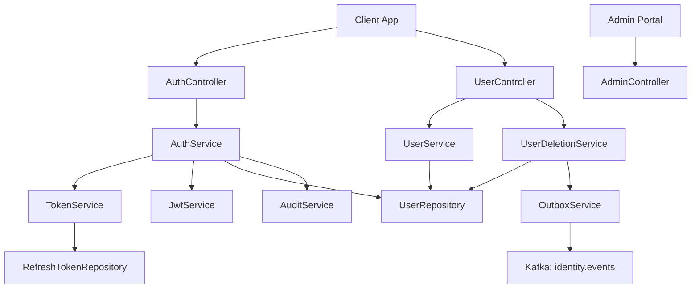
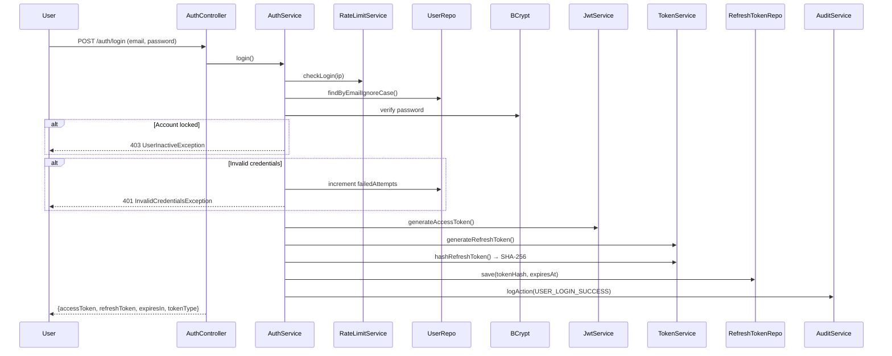
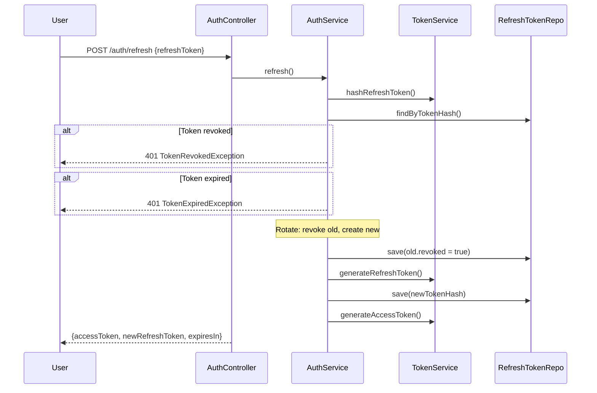
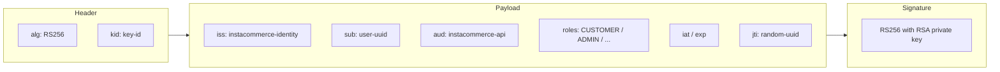
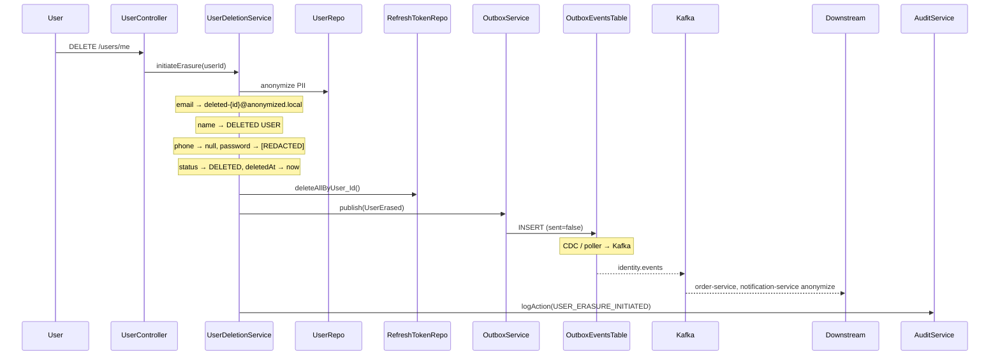
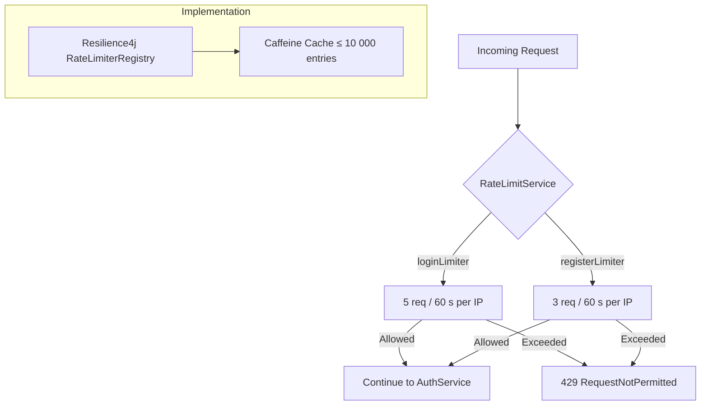

# Identity Service

Handles user registration, authentication (JWT), authorization, token management, and GDPR erasure for the InstaCommerce platform.

Built with **Spring Boot 3**, **Java 21**, **PostgreSQL**, and **Resilience4j** rate limiting. Domain events are published via the transactional outbox pattern to **Kafka** (`identity.events` topic).

## Key Components

| Layer | Component | Responsibility |
|-------|-----------|----------------|
| Controller | `AuthController` | Registration, login, token refresh, revoke, logout |
| Controller | `UserController` | Profile (`/users/me`), password change, GDPR deletion, notification preferences |
| Controller | `AdminController` | User listing & lookup (ADMIN role required) |
| Controller | `JwksController` | Publishes RSA public key at `/.well-known/jwks.json` |
| Service | `AuthService` | Credential verification, account lockout, token issuance |
| Service | `UserService` | Current-user resolution, password changes |
| Service | `UserDeletionService` | GDPR erasure — anonymizes PII, publishes `UserErased` event |
| Service | `TokenService` | Access / refresh token generation, SHA-256 hashing |
| Service | `RateLimitService` | Per-IP rate limiting via Resilience4j + Caffeine cache |
| Service | `OutboxService` | Transactional outbox writes for reliable event delivery |
| Service | `AuditService` | Async audit log persistence |
| Security | `JwtService` / `DefaultJwtService` | RS256 JWT signing & validation (JJWT 0.12) |
| Security | `JwtAuthenticationFilter` | Extracts & validates Bearer tokens on every request |
| Security | `InternalServiceAuthFilter` | Service-to-service auth via `X-Internal-Token` header |
| Security | `JwtKeyLoader` | Loads RSA key pair (GCP Secret Manager or env vars) |

---

## Architecture

### 1. Service Architecture



### 2. Authentication Flow



### 3. Token Refresh Flow



### 4. JWT Token Structure



### 5. GDPR User Deletion Flow



### 6. Rate Limiting Flow



---

## API Reference

### Auth Endpoints (`/auth`)

| Method | Path | Auth | Description |
|--------|------|------|-------------|
| `POST` | `/auth/register` | None | Register a new user account |
| `POST` | `/auth/login` | None | Authenticate with email & password |
| `POST` | `/auth/refresh` | None | Exchange a refresh token for new token pair |
| `POST` | `/auth/revoke` | Bearer | Revoke a specific refresh token |
| `POST` | `/auth/logout` | Bearer | Revoke all refresh tokens for the current user |

### User Endpoints (`/users`)

| Method | Path | Auth | Description |
|--------|------|------|-------------|
| `GET` | `/users/me` | Bearer | Get current user profile |
| `POST` | `/users/me/password` | Bearer | Change password (revokes all refresh tokens) |
| `DELETE` | `/users/me` | Bearer | GDPR erasure — anonymize & delete account |
| `GET` | `/users/me/notification-preferences` | Bearer | Get notification preferences |
| `PUT` | `/users/me/notification-preferences` | Bearer | Update notification preferences |

### Admin Endpoints (`/admin`)

| Method | Path | Auth | Description |
|--------|------|------|-------------|
| `GET` | `/admin/users` | Bearer + ADMIN | List all users (paginated) |
| `GET` | `/admin/users/{id}` | Bearer + ADMIN | Get user by ID |
| `GET` | `/admin/users/{id}/notification-preferences` | Bearer + ADMIN | Get user's notification preferences |

### Well-Known Endpoints

| Method | Path | Auth | Description |
|--------|------|------|-------------|
| `GET` | `/.well-known/jwks.json` | None | RSA public key (JWKS format) |

### Actuator Endpoints

| Path | Description |
|------|-------------|
| `/actuator/health` | Health check (liveness + readiness) |
| `/actuator/prometheus` | Prometheus metrics |
| `/actuator/info` | Application info |
| `/actuator/metrics` | Micrometer metrics |

---

## Database Schema

Managed by **Flyway** migrations (`src/main/resources/db/migration/`).

### `users`

| Column | Type | Notes |
|--------|------|-------|
| `id` | `UUID` | PK, auto-generated |
| `email` | `VARCHAR(255)` | Unique |
| `first_name` | `VARCHAR(100)` | |
| `last_name` | `VARCHAR(100)` | |
| `phone` | `VARCHAR(30)` | |
| `password_hash` | `VARCHAR(72)` | BCrypt |
| `roles` | `VARCHAR[]` | `{CUSTOMER}`, `{ADMIN}`, etc. |
| `status` | `VARCHAR(20)` | `ACTIVE`, `SUSPENDED`, `DELETED` |
| `failed_attempts` | `INTEGER` | Login failure counter |
| `locked_until` | `TIMESTAMPTZ` | Account lockout expiry |
| `deleted_at` | `TIMESTAMPTZ` | GDPR erasure timestamp |
| `created_at` | `TIMESTAMPTZ` | |
| `updated_at` | `TIMESTAMPTZ` | |
| `version` | `BIGINT` | Optimistic locking |

### `refresh_tokens`

| Column | Type | Notes |
|--------|------|-------|
| `id` | `UUID` | PK |
| `user_id` | `UUID` | FK → `users(id)` ON DELETE CASCADE |
| `token_hash` | `VARCHAR(64)` | SHA-256 hex, unique |
| `device_info` | `VARCHAR(255)` | Optional client metadata |
| `expires_at` | `TIMESTAMPTZ` | |
| `revoked` | `BOOLEAN` | Default `false` |
| `created_at` | `TIMESTAMPTZ` | |

### `audit_log`

| Column | Type | Notes |
|--------|------|-------|
| `id` | `BIGSERIAL` | PK |
| `user_id` | `UUID` | Nullable (for failed logins) |
| `action` | `VARCHAR(100)` | e.g. `USER_LOGIN_SUCCESS` |
| `entity_type` | `VARCHAR(50)` | `User`, `RefreshToken` |
| `entity_id` | `VARCHAR(100)` | |
| `details` | `JSONB` | Additional context |
| `ip_address` | `VARCHAR(45)` | |
| `user_agent` | `TEXT` | |
| `trace_id` | `VARCHAR(32)` | OpenTelemetry trace ID |
| `created_at` | `TIMESTAMPTZ` | |

### `outbox_events`

| Column | Type | Notes |
|--------|------|-------|
| `id` | `UUID` | PK |
| `aggregate_type` | `VARCHAR(50)` | e.g. `User` |
| `aggregate_id` | `VARCHAR(255)` | e.g. user UUID |
| `event_type` | `VARCHAR(50)` | e.g. `UserErased` |
| `payload` | `JSONB` | Event payload |
| `created_at` | `TIMESTAMPTZ` | |
| `sent` | `BOOLEAN` | Default `false`, set `true` after Kafka delivery |

### `notification_preferences`

| Column | Type | Notes |
|--------|------|-------|
| `user_id` | `UUID` | PK, FK → `users(id)` ON DELETE CASCADE |
| `email_opt_out` | `BOOLEAN` | Default `false` |
| `sms_opt_out` | `BOOLEAN` | Default `false` |
| `push_opt_out` | `BOOLEAN` | Default `false` |
| `marketing_opt_out` | `BOOLEAN` | Default `false` |
| `created_at` | `TIMESTAMPTZ` | |
| `updated_at` | `TIMESTAMPTZ` | |

---

## Kafka Events Published

All events are written to the `outbox_events` table inside the same transaction as the domain change (transactional outbox pattern). A CDC connector or scheduled poller picks them up and publishes to the **`identity.events`** Kafka topic.

| Event Type | Aggregate | Trigger | Payload |
|------------|-----------|---------|---------|
| `UserErased` | `User` | `DELETE /users/me` | `{ userId, erasedAt }` |

---

## Configuration

### Environment Variables

| Variable | Default | Description |
|----------|---------|-------------|
| `SERVER_PORT` | `8081` | HTTP listen port |
| `IDENTITY_DB_URL` | `jdbc:postgresql://localhost:5432/identity_db` | PostgreSQL JDBC URL |
| `IDENTITY_DB_USER` | `postgres` | Database username |
| `IDENTITY_DB_PASSWORD` | — | Database password (or via GCP Secret Manager `sm://db-password-identity`) |
| `IDENTITY_JWT_PUBLIC_KEY` | — | RSA public key PEM (or `sm://jwt-rsa-public-key`) |
| `IDENTITY_JWT_PRIVATE_KEY` | — | RSA private key PEM (or `sm://jwt-rsa-private-key`) |
| `IDENTITY_JWT_ISSUER` | `instacommerce-identity` | JWT `iss` claim |
| `IDENTITY_ACCESS_TTL` | `900` | Access token TTL in seconds (15 min) |
| `IDENTITY_REFRESH_TTL` | `604800` | Refresh token TTL in seconds (7 days) |
| `IDENTITY_MAX_REFRESH_TOKENS` | `5` | Max active refresh tokens per user |
| `IDENTITY_CORS_ORIGINS` | `http://localhost:3000,https://*.instacommerce.dev` | Comma-separated allowed origins |
| `INTERNAL_SERVICE_TOKEN` | `dev-internal-token-change-in-prod` | Shared secret for service-to-service auth |
| `OTEL_EXPORTER_OTLP_TRACES_ENDPOINT` | `http://otel-collector.monitoring:4318/v1/traces` | OpenTelemetry traces endpoint |
| `OTEL_EXPORTER_OTLP_METRICS_ENDPOINT` | `http://otel-collector.monitoring:4318/v1/metrics` | OpenTelemetry metrics endpoint |
| `TRACING_PROBABILITY` | `1.0` | Trace sampling probability |
| `ENVIRONMENT` | `dev` | Environment tag for metrics |

---

## Running Locally

### Prerequisites

- **Java 21**
- **PostgreSQL 15+**
- **Gradle 8.7+** (wrapper included)

### 1. Start PostgreSQL

```bash
docker run -d --name identity-pg \
  -e POSTGRES_DB=identity_db \
  -e POSTGRES_PASSWORD=postgres \
  -p 5432:5432 \
  postgres:15-alpine
```

### 2. Generate RSA Key Pair

```bash
openssl genrsa -out private.pem 2048
openssl rsa -in private.pem -pubout -out public.pem

export IDENTITY_JWT_PRIVATE_KEY=$(cat private.pem)
export IDENTITY_JWT_PUBLIC_KEY=$(cat public.pem)
```

### 3. Run the Service

```bash
./gradlew bootRun
```

The service starts on `http://localhost:8081`. Flyway applies all migrations automatically.

### 4. Verify

```bash
curl http://localhost:8081/actuator/health
```

### Docker

```bash
docker build -t identity-service .
docker run -p 8081:8080 \
  -e IDENTITY_DB_URL=jdbc:postgresql://host.docker.internal:5432/identity_db \
  -e IDENTITY_DB_PASSWORD=postgres \
  -e IDENTITY_JWT_PUBLIC_KEY="$(cat public.pem)" \
  -e IDENTITY_JWT_PRIVATE_KEY="$(cat private.pem)" \
  identity-service
```

---

## Security Notes

- Passwords hashed with **BCrypt** (Spring Security default encoder).
- Refresh tokens stored as **SHA-256 hashes** — raw tokens never persisted.
- Refresh tokens are **rotated on every use** (old token revoked, new one issued).
- Max **5 active refresh tokens** per user; oldest evicted automatically.
- Account locked for **30 minutes** after **10 consecutive failed logins**.
- Rate limiting: **5 login** / **3 register** requests per IP per 60 seconds.
- JWT signed with **RS256** (2048-bit RSA); public key exposed via JWKS endpoint.
- Stateless sessions — no server-side session storage.
- Service-to-service auth via `X-Internal-Token` header (defense-in-depth on top of Istio mTLS).

## Tech Stack

| Technology | Purpose |
|------------|---------|
| Spring Boot 3 | Application framework |
| Java 21 (ZGC) | Runtime |
| PostgreSQL | Primary data store |
| Flyway | Schema migrations |
| JJWT 0.12 | JWT signing & validation |
| Resilience4j | Rate limiting |
| Caffeine | In-memory rate limiter cache |
| MapStruct | DTO mapping |
| Micrometer + OTLP | Metrics & distributed tracing |
| Prometheus | Metrics export |
| Testcontainers | Integration testing |
| GCP Secret Manager | Secrets (prod) |
