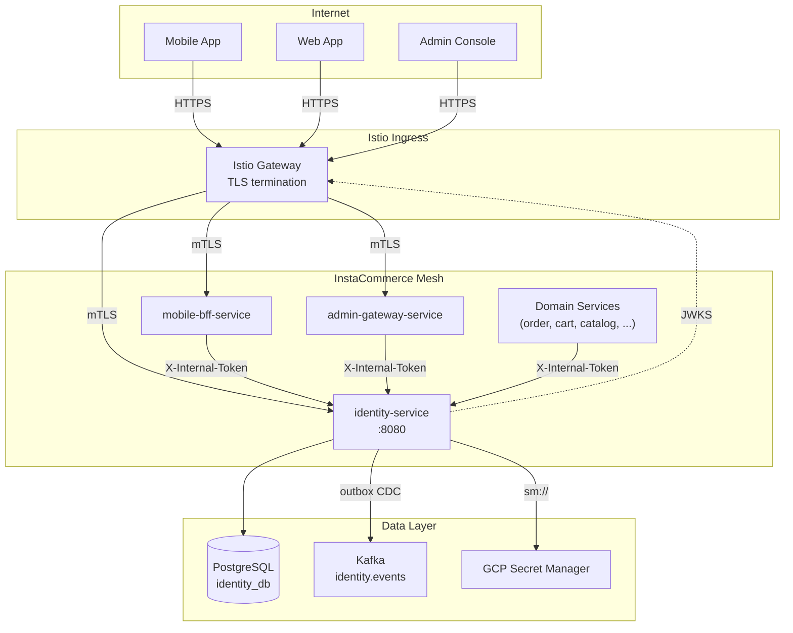
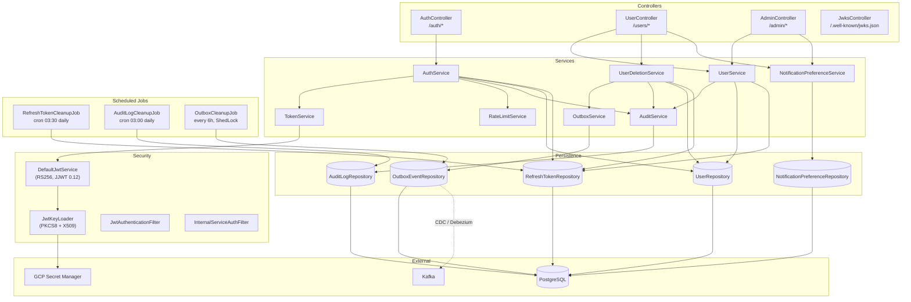
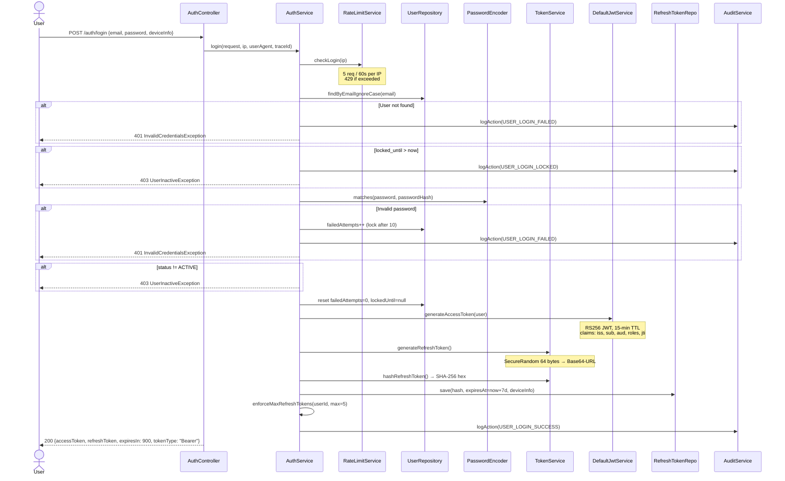
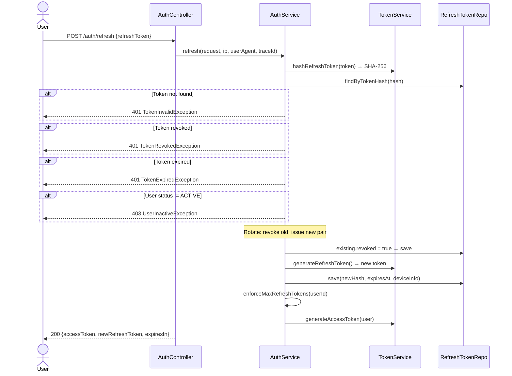
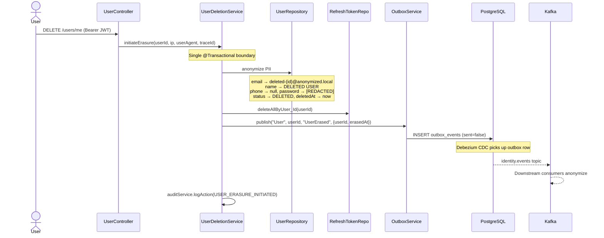

# Identity Service

> **Module path:** `services/identity-service`
> **Port:** 8081 (dev) · 8080 (k8s container)
> **Runtime:** Spring Boot 3, Java 21, PostgreSQL 15+
> **Source of truth for:** user credentials, JWT issuance, refresh-token lifecycle, GDPR erasure, audit trail

---

## Table of Contents

1. [Service Role & Boundaries](#1-service-role--boundaries)
2. [High-Level Design (HLD)](#2-high-level-design-hld)
3. [Low-Level Design (LLD)](#3-low-level-design-lld)
4. [Auth & Token Flows](#4-auth--token-flows)
5. [API Reference](#5-api-reference)
6. [Database Schema](#6-database-schema)
7. [Kafka Events](#7-kafka-events)
8. [Runtime & Configuration](#8-runtime--configuration)
9. [Dependencies](#9-dependencies)
10. [Observability](#10-observability)
11. [Testing](#11-testing)
12. [Failure Modes & Mitigations](#12-failure-modes--mitigations)
13. [Security & Trust Boundaries](#13-security--trust-boundaries)
14. [Rollout & Rollback Notes](#14-rollout--rollback-notes)
15. [Known Limitations & Future Work](#15-known-limitations--future-work)
16. [Q-Commerce Identity Pattern Comparison](#16-q-commerce-identity-pattern-comparison)

---

## 1. Service Role & Boundaries

**identity-service** is the single write-authority for user identity within the InstaCommerce mesh. It owns:

| Responsibility | Scope |
|---|---|
| **Credential management** | Email/password registration, BCrypt hashing, account-lockout state |
| **Token issuance** | RS256 JWT access tokens (15 min), opaque refresh tokens (7 days) with rotation |
| **JWKS publication** | `/.well-known/jwks.json` — consumed by Istio `RequestAuthentication` and every downstream verifier |
| **GDPR erasure** | PII anonymization + `UserErased` outbox event to downstream services |
| **Notification preferences** | Per-user opt-out flags (email, SMS, push, marketing) |
| **Audit trail** | Async, immutable audit log with OTEL trace-id correlation |
| **Admin user lookup** | Paginated user listing and lookup behind `ROLE_ADMIN` RBAC |

**What this service does NOT own:**

- Authorization policies beyond role claims in the JWT — downstream services enforce their own `@PreAuthorize` / Istio `AuthorizationPolicy` rules.
- Session state — the architecture is fully stateless; JWTs are self-contained.
- OTP / phone-based login — not yet implemented (see [§15](#15-known-limitations--future-work)).
- User profile enrichment (addresses, payment methods) — owned by other domain services.

---

## 2. High-Level Design (HLD)

### 2.1 System Context



### 2.2 Trust Boundaries

```
B1  Internet ──► Istio Ingress Gateway   (TLS SIMPLE termination, rate limiting target)
B2  Ingress  ──► Edge Services            (Istio mTLS, RequestAuthentication validates JWT via JWKS)
B3  Edge     ──► Domain Services          (Istio mTLS STRICT + X-Internal-Token defense-in-depth)
B4  Services ──► Data Layer               (Private-IP CloudSQL, GCP Workload Identity for Secret Manager)
```

### 2.3 Deployment Topology

- **Container:** Multi-stage Docker build (`gradle:8.7-jdk21` → `eclipse-temurin:21-jre-alpine`); runs as non-root user (`uid 1001`), `+UseZGC`, `MaxRAMPercentage=75%`.
- **Helm:** Deployed via `deploy/helm/` templates; ArgoCD syncs from `argocd/`.
- **Replicas:** Stateless — horizontally scalable. Rate limiting is pod-local (see [§12](#12-failure-modes--mitigations)).

---

## 3. Low-Level Design (LLD)

### 3.1 Component Diagram



### 3.2 Key Class Responsibilities

| Layer | Class | Responsibility |
|---|---|---|
| Controller | `AuthController` | Register, login, refresh, revoke, logout — delegates to `AuthService` |
| Controller | `UserController` | `GET /users/me`, password change, `DELETE /users/me` (GDPR), notification prefs |
| Controller | `AdminController` | `GET /admin/users` (paginated), `GET /admin/users/{id}` — `@PreAuthorize("hasRole('ADMIN')")` |
| Controller | `JwksController` | Exposes RSA public key in JWKS format for external verification |
| Service | `AuthService` | Orchestrates rate-limit check → credential verification → lockout logic → token issuance → audit |
| Service | `TokenService` | Wraps `JwtService` for access tokens; generates 64-byte `SecureRandom` refresh tokens; SHA-256 hashing |
| Service | `UserDeletionService` | Transactional PII anonymization → refresh-token purge → outbox publish → audit |
| Service | `RateLimitService` | Per-IP rate limiting via Resilience4j `RateLimiterRegistry` + Caffeine cache (10K entries, 5 min TTL) |
| Service | `OutboxService` | Writes `outbox_events` row within the caller's `@Transactional` boundary (`Propagation.MANDATORY`) |
| Service | `AuditService` | `@Async("auditExecutor")` + `REQUIRES_NEW` — non-blocking audit writes on a dedicated thread pool |
| Service | `NotificationPreferenceService` | CRUD for per-user notification opt-out flags |
| Security | `DefaultJwtService` | RS256 JWT generation (JJWT 0.12.5); validation with issuer + audience checks |
| Security | `JwtKeyLoader` | Parses PKCS8/X509 PEM keys (or derives public key from `RSAPrivateCrtKey`); computes `kid` via SHA-256 |
| Security | `JwtAuthenticationFilter` | `OncePerRequestFilter`: extracts Bearer token, validates, sets `SecurityContext`; skips permit-all paths |
| Security | `InternalServiceAuthFilter` | `OncePerRequestFilter`: validates `X-Internal-Token` header for service-to-service calls |
| Config | `IdentityProperties` | `@ConfigurationProperties(prefix = "identity")` — binds CORS, token TTLs, JWT key material |
| Config | `SchedulerConfig` | `@EnableScheduling` + `@EnableAsync`; `auditExecutor` thread pool (core=2, max=5, queue=500) |
| Metrics | `AuthMetrics` | Micrometer counters (`auth.login.total`, `auth.register.total`, `auth.refresh.total`, `auth.revoke.total`) + login duration timer |
| Scheduled | `RefreshTokenCleanupJob` | Cron `0 30 3 * * *` — deletes expired/revoked tokens older than 7 days |
| Scheduled | `AuditLogCleanupJob` | Cron `0 0 3 * * *` — deletes audit entries older than 730 days (2 years) |
| Scheduled | `OutboxCleanupJob` | Every 6 hours — ShedLock-protected; deletes sent outbox events older than 7 days |
| Exception | `GlobalExceptionHandler` | `@RestControllerAdvice`: maps domain exceptions → structured `ErrorResponse` with trace ID |

### 3.3 Filter Chain Order

`SecurityConfig` installs filters in this order (before `UsernamePasswordAuthenticationFilter`):

1. **`InternalServiceAuthFilter`** — if `X-Internal-Service` + `X-Internal-Token` headers match, sets `SecurityContext` with `ROLE_INTERNAL_SERVICE` + `ROLE_ADMIN`.
2. **`JwtAuthenticationFilter`** — if `Authorization: Bearer <token>` present, validates JWT and sets `SecurityContext` with user's roles. Skips `/auth/login`, `/auth/register`, `/auth/refresh`, `/.well-known/**`, `/actuator/**`.

If neither filter authenticates the request, Spring Security's `authorizeHttpRequests` rules apply: permit-all for public paths, `authenticated()` for everything else.

---

## 4. Auth & Token Flows

### 4.1 Login Flow



### 4.2 Token Refresh Flow (Rotation)



### 4.3 GDPR Erasure Flow



### 4.4 JWT Structure

The access token is an RS256-signed JWT with the following shape:

```
Header:  { "alg": "RS256", "kid": "<SHA-256 of public key modulus+exponent>" }
Payload: { "iss": "instacommerce-identity",
           "sub": "<user-uuid>",
           "aud": "instacommerce-api",
           "roles": ["CUSTOMER"],
           "iat": <epoch>, "exp": <epoch+900>,
           "jti": "<random-uuid>" }
Signature: RS256(header.payload, RSA-private-key)
```

- **`kid`** is deterministically computed from the RSA public key (`JwtKeyLoader.computeKeyId`), enabling future key rotation without ambiguity.
- **Validation** requires matching `iss` and `aud` claims (`DefaultJwtService.validateAccessToken`).
- **Public key** is exposed at `GET /.well-known/jwks.json` — Istio `RequestAuthentication` fetches from this endpoint.

---

## 5. API Reference

### Auth Endpoints (`/auth`)

| Method | Path | Auth | Description |
|---|---|---|---|
| `POST` | `/auth/register` | None | Register a new user; returns token pair |
| `POST` | `/auth/login` | None | Authenticate with email & password |
| `POST` | `/auth/refresh` | None | Exchange refresh token for new token pair (rotation) |
| `POST` | `/auth/revoke` | Bearer | Revoke a specific refresh token |
| `POST` | `/auth/logout` | Bearer | Revoke all refresh tokens for the current user |

### User Endpoints (`/users`)

| Method | Path | Auth | Description |
|---|---|---|---|
| `GET` | `/users/me` | Bearer | Get current user profile |
| `POST` | `/users/me/password` | Bearer | Change password (revokes all refresh tokens) |
| `DELETE` | `/users/me` | Bearer | GDPR erasure — anonymize PII & delete account |
| `GET` | `/users/me/notification-preferences` | Bearer | Get notification opt-out preferences |
| `PUT` | `/users/me/notification-preferences` | Bearer | Update notification opt-out preferences |

### Admin Endpoints (`/admin`)

| Method | Path | Auth | Description |
|---|---|---|---|
| `GET` | `/admin/users` | Bearer + ADMIN | List all users (paginated, default 20) |
| `GET` | `/admin/users/{id}` | Bearer + ADMIN | Get user by ID |
| `GET` | `/admin/users/{id}/notification-preferences` | Bearer + ADMIN | Get user's notification preferences |

### Infrastructure Endpoints

| Method | Path | Auth | Description |
|---|---|---|---|
| `GET` | `/.well-known/jwks.json` | None | RSA public key in JWKS format |
| `GET` | `/actuator/health` | None | Liveness + readiness probes |
| `GET` | `/actuator/health/readiness` | None | Readiness (includes DB check) |
| `GET` | `/actuator/health/liveness` | None | Liveness probe |
| `GET` | `/actuator/prometheus` | None | Prometheus metrics scrape endpoint |
| `GET` | `/actuator/info` | None | Application info |
| `GET` | `/actuator/metrics` | None | Micrometer metrics index |

---

## 6. Database Schema

Managed by **Flyway** (V1–V10 migrations in `src/main/resources/db/migration/`). Hibernate `ddl-auto: validate` — schema changes must go through migrations.

### `users`

| Column | Type | Notes |
|---|---|---|
| `id` | `UUID` | PK, auto-generated |
| `email` | `VARCHAR(255)` | Unique, case-insensitive lookup |
| `first_name` | `VARCHAR(100)` | |
| `last_name` | `VARCHAR(100)` | |
| `phone` | `VARCHAR(30)` | |
| `password_hash` | `VARCHAR(72)` | BCrypt |
| `roles` | `VARCHAR[]` | `{CUSTOMER}`, `{ADMIN}`, etc. |
| `status` | `VARCHAR(20)` | `ACTIVE` · `SUSPENDED` · `DELETED` |
| `failed_attempts` | `INTEGER` | Login failure counter (V8) |
| `locked_until` | `TIMESTAMPTZ` | Account lockout expiry (V8) |
| `deleted_at` | `TIMESTAMPTZ` | GDPR erasure timestamp (V4) |
| `created_at` | `TIMESTAMPTZ` | |
| `updated_at` | `TIMESTAMPTZ` | |
| `version` | `BIGINT` | Optimistic locking (`@Version`) |

### `refresh_tokens`

| Column | Type | Notes |
|---|---|---|
| `id` | `UUID` | PK |
| `user_id` | `UUID` | FK → `users(id)` ON DELETE CASCADE |
| `token_hash` | `VARCHAR(64)` | SHA-256 hex digest, unique |
| `device_info` | `VARCHAR(255)` | Optional client metadata |
| `expires_at` | `TIMESTAMPTZ` | |
| `revoked` | `BOOLEAN` | Default `false` |
| `created_at` | `TIMESTAMPTZ` | |

### `audit_log`

| Column | Type | Notes |
|---|---|---|
| `id` | `BIGSERIAL` | PK |
| `user_id` | `UUID` | Nullable (for failed logins with unknown user) |
| `action` | `VARCHAR(100)` | e.g. `USER_LOGIN_SUCCESS`, `USER_ERASURE_INITIATED` |
| `entity_type` | `VARCHAR(50)` | `User`, `RefreshToken` |
| `entity_id` | `VARCHAR(100)` | |
| `details` | `JSONB` | Additional context (structured) |
| `ip_address` | `VARCHAR(45)` | IPv4/IPv6 |
| `user_agent` | `TEXT` | |
| `trace_id` | `VARCHAR(32)` | OpenTelemetry trace ID for correlation |
| `created_at` | `TIMESTAMPTZ` | |

### `outbox_events`

| Column | Type | Notes |
|---|---|---|
| `id` | `UUID` | PK |
| `aggregate_type` | `VARCHAR(50)` | e.g. `User` |
| `aggregate_id` | `VARCHAR(255)` | e.g. user UUID |
| `event_type` | `VARCHAR(50)` | e.g. `UserErased` |
| `payload` | `JSONB` | Event payload (JSON) |
| `created_at` | `TIMESTAMPTZ` | |
| `sent` | `BOOLEAN` | Default `false`; set `true` after Kafka delivery by CDC connector |

### `notification_preferences`

| Column | Type | Notes |
|---|---|---|
| `user_id` | `UUID` | PK, FK → `users(id)` ON DELETE CASCADE |
| `email_opt_out` | `BOOLEAN` | Default `false` |
| `sms_opt_out` | `BOOLEAN` | Default `false` |
| `push_opt_out` | `BOOLEAN` | Default `false` |
| `marketing_opt_out` | `BOOLEAN` | Default `false` |
| `created_at` | `TIMESTAMPTZ` | |
| `updated_at` | `TIMESTAMPTZ` | |

### `shedlock` (V10)

Standard ShedLock table for distributed scheduled-job coordination across replicas.

---

## 7. Kafka Events

All events use the **transactional outbox pattern**: the `outbox_events` row is written inside the same `@Transactional` boundary as the domain change. Debezium CDC (or a poller) relays rows to the **`identity.events`** Kafka topic.

| Event Type | Aggregate | Trigger | Payload |
|---|---|---|---|
| `UserErased` | `User` | `DELETE /users/me` | `{ "userId": "<uuid>", "erasedAt": "<ISO-8601>" }` |

**Downstream consumers:** order-service, notification-service, and any service holding user PII must subscribe and anonymize their local copies upon receiving `UserErased`.

> **Note:** Auth lifecycle events (login, register, password change) are currently logged only in the `audit_log` table and metrics, not published to Kafka. The outbox is wired only for GDPR erasure events.

---

## 8. Runtime & Configuration

### 8.1 Environment Variables

| Variable | Default | Description |
|---|---|---|
| `SERVER_PORT` | `8081` | HTTP listen port (container overrides to `8080`) |
| `IDENTITY_DB_URL` | `jdbc:postgresql://localhost:5432/identity_db` | JDBC URL |
| `IDENTITY_DB_USER` | `postgres` | DB username |
| `IDENTITY_DB_PASSWORD` | — | DB password (fallback if `sm://db-password-identity` unavailable) |
| `IDENTITY_JWT_PUBLIC_KEY` | — | RSA public key PEM (fallback if `sm://jwt-rsa-public-key` unavailable) |
| `IDENTITY_JWT_PRIVATE_KEY` | — | RSA private key PEM (fallback if `sm://jwt-rsa-private-key` unavailable) |
| `IDENTITY_JWT_ISSUER` | `instacommerce-identity` | JWT `iss` claim value |
| `IDENTITY_ACCESS_TTL` | `900` | Access token TTL in seconds (15 min) |
| `IDENTITY_REFRESH_TTL` | `604800` | Refresh token TTL in seconds (7 days) |
| `IDENTITY_MAX_REFRESH_TOKENS` | `5` | Max active refresh tokens per user |
| `IDENTITY_CORS_ORIGINS` | `http://localhost:3000,https://*.instacommerce.dev` | Comma-separated allowed origins |
| `INTERNAL_SERVICE_TOKEN` | `dev-internal-token-change-in-prod` | Shared secret for service-to-service auth |
| `OTEL_EXPORTER_OTLP_TRACES_ENDPOINT` | `http://otel-collector.monitoring:4318/v1/traces` | OTLP traces endpoint |
| `OTEL_EXPORTER_OTLP_METRICS_ENDPOINT` | `http://otel-collector.monitoring:4318/v1/metrics` | OTLP metrics endpoint |
| `TRACING_PROBABILITY` | `1.0` | Trace sampling probability |
| `ENVIRONMENT` | `dev` | Environment tag for metrics |

### 8.2 HikariCP Pool

Configured in `application.yml`:

| Setting | Value |
|---|---|
| `maximum-pool-size` | 20 |
| `minimum-idle` | 5 |
| `connection-timeout` | 5000 ms |
| `max-lifetime` | 1,800,000 ms (30 min) |
| `idle-timeout` | 600,000 ms (10 min) |

### 8.3 Running Locally

**Prerequisites:** Java 21, PostgreSQL 15+ (or `docker-compose up -d` from repo root which creates `identity_db` via `scripts/init-dbs.sql`).

```bash
# Generate RSA key pair for local dev
openssl genrsa -out private.pem 2048
openssl rsa -in private.pem -pubout -out public.pem
export IDENTITY_JWT_PRIVATE_KEY=$(cat private.pem)
export IDENTITY_JWT_PUBLIC_KEY=$(cat public.pem)

# Run (Flyway auto-migrates)
./gradlew :services:identity-service:bootRun

# Verify
curl http://localhost:8081/actuator/health
```

### 8.4 Docker

```bash
./gradlew :services:identity-service:bootJar
docker build -t identity-service services/identity-service/
docker run -p 8081:8080 \
  -e IDENTITY_DB_URL=jdbc:postgresql://host.docker.internal:5432/identity_db \
  -e IDENTITY_DB_PASSWORD=postgres \
  -e IDENTITY_JWT_PUBLIC_KEY="$(cat public.pem)" \
  -e IDENTITY_JWT_PRIVATE_KEY="$(cat private.pem)" \
  identity-service
```

The Dockerfile uses a non-root user (`uid 1001`), ZGC, and a `HEALTHCHECK` against `/actuator/health/liveness`.

### 8.5 Graceful Shutdown

`server.shutdown: graceful` with a 30-second drain timeout (`spring.lifecycle.timeout-per-shutdown-phase: 30s`). In-flight requests complete before the JVM exits.

---

## 9. Dependencies

### 9.1 Build Dependencies (`build.gradle.kts`)

| Dependency | Version | Purpose |
|---|---|---|
| `spring-boot-starter-web` | (BOM) | REST API framework |
| `spring-boot-starter-data-jpa` | (BOM) | JPA / Hibernate persistence |
| `spring-boot-starter-security` | (BOM) | Security filter chain, BCrypt, `@PreAuthorize` |
| `spring-boot-starter-validation` | (BOM) | Bean Validation (Jakarta) |
| `spring-boot-starter-actuator` | (BOM) | Health, metrics, info endpoints |
| `flyway-core` + `flyway-database-postgresql` | (BOM) | Schema migration |
| `jjwt-api` / `jjwt-impl` / `jjwt-jackson` | 0.12.5 | JWT signing & parsing |
| `mapstruct` | 1.5.5.Final | Compile-time DTO mapping |
| `resilience4j-spring-boot3` | 2.2.0 | Rate limiter registry |
| `caffeine` | (BOM) | In-memory cache for rate limiters |
| `shedlock-spring` + `shedlock-provider-jdbc-template` | 5.10.2 | Distributed lock for scheduled jobs |
| `spring-cloud-gcp-starter-secretmanager` | (BOM) | `sm://` secret resolution |
| `postgres-socket-factory` | 1.15.0 | CloudSQL IAM socket factory |
| `micrometer-tracing-bridge-otel` | (BOM) | OTEL tracing bridge |
| `micrometer-registry-otlp` | (BOM) | OTLP metrics export |
| `micrometer-registry-prometheus` | (BOM) | Prometheus scrape endpoint |
| `logstash-logback-encoder` | 7.4 | Structured JSON logging |
| `postgresql` | (runtime) | JDBC driver |

### 9.2 Test Dependencies

| Dependency | Purpose |
|---|---|
| `spring-boot-starter-test` | JUnit 5, Mockito, AssertJ |
| `spring-security-test` | Security test utilities |
| `testcontainers:postgresql` (1.19.3) | Disposable PostgreSQL for integration tests |
| `testcontainers:junit-jupiter` (1.19.3) | JUnit 5 Testcontainers lifecycle |

### 9.3 Infrastructure Dependencies

| System | Relationship |
|---|---|
| **PostgreSQL** (`identity_db`) | Primary data store — required for startup (readiness probe includes DB) |
| **GCP Secret Manager** | JWT keys + DB password in production (`sm://` prefix, optional in dev) |
| **Kafka** (`identity.events` topic) | Outbox event relay via Debezium CDC — async, not on the critical write path |
| **OTEL Collector** | Traces + metrics export — degradation is non-blocking |

---

## 10. Observability

### 10.1 Metrics (Micrometer)

Custom counters and timers registered in `AuthMetrics`:

| Metric | Type | Tags | Description |
|---|---|---|---|
| `auth.login.total` | Counter | `result=success\|failure` | Login attempts |
| `auth.login.duration` | Timer | — | Login latency (includes BCrypt) |
| `auth.register.total` | Counter | — | Registration count |
| `auth.refresh.total` | Counter | — | Token refresh count |
| `auth.revoke.total` | Counter | — | Token revocations (single + logout) |

Standard Spring Boot metrics (`http.server.requests`, `hikaricp.*`, `jvm.*`, `system.*`) are also exported.

**Scrape endpoint:** `GET /actuator/prometheus`
**OTLP push:** Traces → `${OTEL_EXPORTER_OTLP_TRACES_ENDPOINT}`, Metrics → `${OTEL_EXPORTER_OTLP_METRICS_ENDPOINT}`

### 10.2 Logging

Structured JSON via `logstash-logback-encoder` (configured in `logback-spring.xml`). Every log line includes `service` and `environment` fields. OTEL trace IDs are automatically injected via the Micrometer tracing bridge.

### 10.3 Health Probes

| Probe | Path | Includes |
|---|---|---|
| Liveness | `/actuator/health/liveness` | `livenessState` |
| Readiness | `/actuator/health/readiness` | `readinessState` + `db` (PostgreSQL connectivity) |
| Combined | `/actuator/health` | All indicators, `show-details: always` |

### 10.4 Audit Trail

The `audit_log` table provides a queryable security audit trail. Every entry includes `trace_id` for correlation with distributed traces. Actions logged:

`USER_REGISTERED`, `USER_LOGIN_SUCCESS`, `USER_LOGIN_FAILED`, `USER_LOGIN_LOCKED`, `USER_LOGIN_BLOCKED`, `TOKEN_REFRESH`, `TOKEN_REVOKE`, `USER_LOGOUT`, `PASSWORD_CHANGED`, `USER_ERASURE_INITIATED`

Audit writes are **async** (`@Async("auditExecutor")`) on a dedicated thread pool (core=2, max=5, queue=500) with `REQUIRES_NEW` propagation, so audit failures do not roll back the business transaction.

---

## 11. Testing

### 11.1 Test Harness

Tests use JUnit 5 (via `useJUnitPlatform()`), Spring Boot Test, and Spring Security Test. Integration tests use **Testcontainers** with PostgreSQL (`testcontainers:postgresql:1.19.3`).

### 11.2 Running Tests

```bash
# All tests for this service
./gradlew :services:identity-service:test

# Single test class
./gradlew :services:identity-service:test --tests "com.instacommerce.identity.service.AuthServiceTest"

# Single test method
./gradlew :services:identity-service:test --tests "com.instacommerce.identity.service.AuthServiceTest.loginSuccess"
```

### 11.3 CI

`.github/workflows/ci.yml` runs identity-service tests as part of the Java service matrix. Path filters trigger on changes under `services/identity-service/`.

---

## 12. Failure Modes & Mitigations

| Failure Mode | Impact | Current Mitigation | Residual Risk |
|---|---|---|---|
| **PostgreSQL down** | All auth operations fail; readiness probe fails → pod removed from LB | Graceful shutdown (30s drain); HikariCP connection timeout (5s) | No read replica / cache fallback for login |
| **GCP Secret Manager unavailable at startup** | Pod fails to load RSA keys → crash loop | `sm://` prefix with env-var fallback | If both `sm://` and env var are missing, startup fails (fail-closed — correct behavior) |
| **Brute-force login across pods** | Rate limiting is pod-local (Caffeine); attacker can distribute across N replicas to get N × 5 attempts/min | Account lockout after 10 failed attempts persisted in DB (cross-pod) | Pod-local rate limiting is a **known gap** — see [§15](#15-known-limitations--future-work) |
| **Refresh token replay** | Stolen refresh token used after rotation | Token revoked on use; replay hits `TokenRevokedException` | No automatic revocation of the *new* token on replay of the old one (no reuse-detection cascade) |
| **JWT key compromise** | All tokens can be forged until key rotation | Keys in GCP Secret Manager with Workload Identity | No automated key rotation path — see [§15](#15-known-limitations--future-work) |
| **Outbox relay lag** | `UserErased` event delayed to downstream consumers | Debezium CDC near-real-time; `OutboxCleanupJob` garbage-collects sent events | GDPR erasure is local-immediate; downstream propagation is eventually consistent |
| **Audit thread pool exhaustion** | Audit writes queue up or are silently dropped | Queue capacity = 500; `REQUIRES_NEW` isolation | Sustained burst beyond queue capacity may discard audit entries |
| **ShedLock contention** | Outbox cleanup job blocked by stale lock | `lockAtMostFor = PT30M` auto-releases stale locks | Cleanup delayed by up to 30 min on lock holder crash |
| **Kafka unavailable** | Outbox events accumulate in `outbox_events` table (not directly written by this service to Kafka) | Debezium retries; outbox rows persist until sent | Prolonged Kafka outage grows `outbox_events` table; needs monitoring |

---

## 13. Security & Trust Boundaries

### 13.1 Cryptographic Controls

| Control | Implementation |
|---|---|
| **Password hashing** | BCrypt via Spring Security's default `PasswordEncoder` |
| **JWT signing** | RS256 (2048-bit RSA) via JJWT 0.12.5; private key never leaves Secret Manager / env var |
| **Refresh token storage** | SHA-256 hash stored; raw 64-byte `SecureRandom` token returned to client only once |
| **Refresh token rotation** | Old token revoked on every refresh; new token issued — limits window of stolen-token use |
| **Key ID (`kid`)** | SHA-256(modulus ‖ exponent), deterministic — supports future multi-key JWKS |

### 13.2 Access Control

| Boundary | Mechanism |
|---|---|
| **Public → identity-service** | Istio TLS termination → Istio mTLS sidecar → `SecurityConfig` filter chain |
| **JWT validation** | `JwtAuthenticationFilter`: RS256 signature + `iss` + `aud` checks |
| **Internal service calls** | `InternalServiceAuthFilter`: `X-Internal-Service` + `X-Internal-Token` headers; grants `ROLE_INTERNAL_SERVICE` + `ROLE_ADMIN` |
| **Admin endpoints** | `@PreAuthorize("hasRole('ADMIN')")` on `AdminController` methods |
| **CORS** | Configurable origins via `IDENTITY_CORS_ORIGINS`; credentials allowed; 1-hour preflight cache |
| **CSRF** | Disabled (stateless API — no cookies) |
| **Sessions** | `SessionCreationPolicy.STATELESS` |

### 13.3 Rate Limiting

| Limiter | Limit | Scope |
|---|---|---|
| `loginLimiter` | 5 requests / 60 seconds | Per IP address |
| `registerLimiter` | 3 requests / 60 seconds | Per IP address |

Implemented via Resilience4j `RateLimiterRegistry` + Caffeine cache (max 10,000 entries, 5-min access expiry). Rate limit exceeded → `429 Too Many Requests` with `Retry-After: 60` header.

### 13.4 Account Lockout

10 consecutive failed login attempts → `locked_until` set to `now + 30 minutes`. Lockout state is persisted in the `users` table (cross-pod). Successful login resets `failed_attempts` to 0.

### 13.5 Known Security Gaps

These are documented in the Iter 3 principal engineering review (`docs/reviews/iter3/services/edge-identity.md` and `docs/reviews/iter3/platform/security-trust-boundaries.md`):

| # | Gap | Severity | Notes |
|---|---|---|---|
| 1 | Rate limiting is **pod-local** (Caffeine) — bypassed under multi-replica deployment | 🔴 Critical | Attacker gets N × limit across N pods. Account lockout (DB-persisted) is the backstop. |
| 2 | Single flat `INTERNAL_SERVICE_TOKEN` shared across all ~28 services | 🔴 Critical | Any compromised pod can impersonate any other. See Iter 3 remediation plan. |
| 3 | `InternalServiceAuthFilter` uses `String.equals()` — timing side-channel | 🔴 Critical | Should use `MessageDigest.isEqual()` or `subtle.ConstantTimeCompare`. |
| 4 | `InternalServiceAuthFilter` grants `ROLE_ADMIN` to every internal caller | 🔴 Critical | Any service can invoke admin endpoints via internal token. |
| 5 | Default fallback token `dev-internal-token-change-in-prod` | 🟠 High | Reachable if `INTERNAL_SERVICE_TOKEN` env var is unset in production. |
| 6 | No JWT key rotation path | 🟠 High | Single key pair with no rotation or revocation mechanism. |

---

## 14. Rollout & Rollback Notes

### 14.1 Schema Migrations

Flyway migrations (V1–V10) are **forward-only** by default. To roll back a migration:

1. Create a new `V(N+1)__rollback_*.sql` that reverses the change.
2. Flyway does not support automatic rollback of applied migrations.
3. Test the rollback migration against a production-schema-replica before applying.

**Safe rollout order for identity changes:**
1. Deploy migration (Flyway runs on startup before traffic is served).
2. Deploy application code.
3. Verify readiness probe passes (`/actuator/health/readiness` includes DB check).

### 14.2 Token TTL Changes

Changing `IDENTITY_ACCESS_TTL` or `IDENTITY_REFRESH_TTL` takes effect **only for newly issued tokens**. Existing tokens remain valid until their original expiry. This means:
- **Shortening TTL:** Safe to deploy; old tokens drain naturally.
- **Lengthening TTL:** Safe to deploy; old tokens still expire at original time.

### 14.3 Key Rotation (Future)

No automated key rotation exists today. When implemented, the rollout must:
1. Add the new key to JWKS **before** using it to sign.
2. Sign new tokens with the new key.
3. Keep the old key in JWKS for at least `max(access-TTL, refresh-TTL)` = 7 days.
4. Remove the old key from JWKS after the drain window.

### 14.4 Rollback Procedure

The service is stateless (no local state, no sticky sessions). Rollback is a standard Helm/ArgoCD image revert:
1. Revert the image tag in `deploy/helm/values-dev.yaml` (or the target env values file).
2. ArgoCD syncs the change; Kubernetes rolls pods.
3. If a Flyway migration was applied, it remains — deploy a compensating migration if needed.

---

## 15. Known Limitations & Future Work

| # | Limitation | Impact | Remediation Path |
|---|---|---|---|
| 1 | **No OTP / phone-based login** | Indian q-commerce users authenticate >90% via phone OTP (per Iter 3 review). Email-only login is insufficient for the target market. | Planned: `login_otps` table (V11), `AuthController` OTP request/verify endpoints, SMS gateway interface. See `docs/reviews/iter3/services/edge-identity.md` §3.2.1. |
| 2 | **Pod-local rate limiting** | Attackers can bypass per-IP limits by hitting different pods. | Migrate to Redis-backed or Envoy global rate-limit service. Account lockout (DB-persisted) is the current backstop. |
| 3 | **Single shared `INTERNAL_SERVICE_TOKEN`** | Flat trust — any compromised pod can impersonate any service. | Iter 3 recommends per-service tokens or Istio `AuthorizationPolicy` with SPIFFE identity. |
| 4 | **No JWT key rotation** | Single key pair; compromise requires manual intervention. | Implement multi-key JWKS with `kid`-based selection (infrastructure already computes `kid`). |
| 5 | **No refresh-token reuse detection cascade** | Replay of a rotated-out token does not revoke the new token. | Consider revoking the entire token family on reuse detection (per RFC 6749 §10.4 guidance). |
| 6 | **Auth lifecycle events not on Kafka** | Login, register, password-change events are only in `audit_log`, not available for real-time downstream consumers (fraud, analytics). | Wire `OutboxService.publish()` calls in `AuthService` for key auth events. |
| 7 | **`InternalServiceAuthFilter` timing attack** | `String.equals()` is not constant-time. | Replace with `MessageDigest.isEqual()`. |
| 8 | **No email verification flow** | Users can register with any email without verification. | Add email verification token flow post-registration. |

---

## 16. Q-Commerce Identity Pattern Comparison

Grounded in `docs/reviews/iter3/services/edge-identity.md` and `docs/reviews/iter3/benchmarks/india-operator-patterns.md`:

| Dimension | Industry Pattern (Blinkit, Zepto, Swiggy Instamart) | InstaCommerce Current State |
|---|---|---|
| **Primary auth method** | Phone OTP (>90% of logins in Indian q-commerce) | Email + password only — OTP not yet implemented |
| **Token model** | Short-lived access tokens + device-bound refresh tokens | ✅ RS256 JWT (15 min) + rotated refresh tokens (7 days) — structurally aligned |
| **Rate limiting** | Global rate limiting (Redis / API gateway layer) | Pod-local Caffeine — insufficient for multi-replica |
| **Key management** | Centralized secret management with rotation | ✅ GCP Secret Manager; rotation path not yet automated |
| **GDPR / data erasure** | Event-driven propagation to all PII-holding services | ✅ Transactional outbox → Kafka `UserErased` event |
| **Internal auth** | mTLS with per-service identity (SPIFFE) | Istio mTLS + flat shared token (defense-in-depth, but token is not per-service) |

The cryptographic fundamentals (RS256, BCrypt, SHA-256 refresh hashing, JWKS, transactional outbox) are production-grade. The primary gap versus leading Indian q-commerce operators is the absence of phone/OTP login and the pod-local rate-limiting model.
