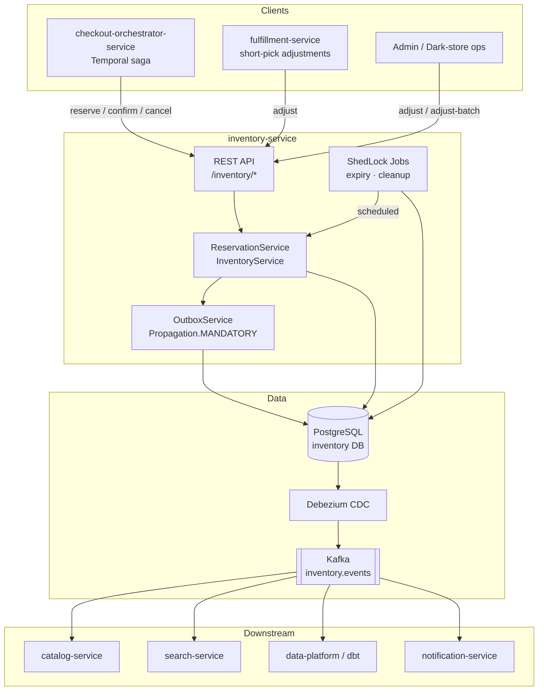
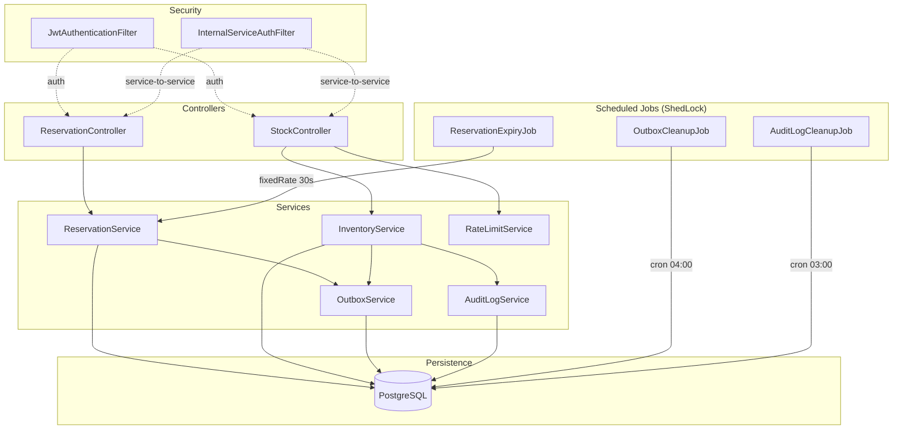
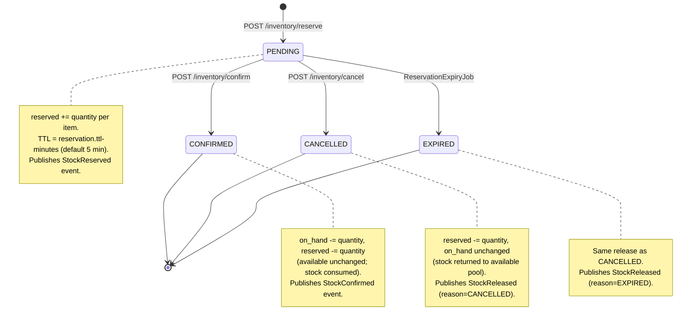
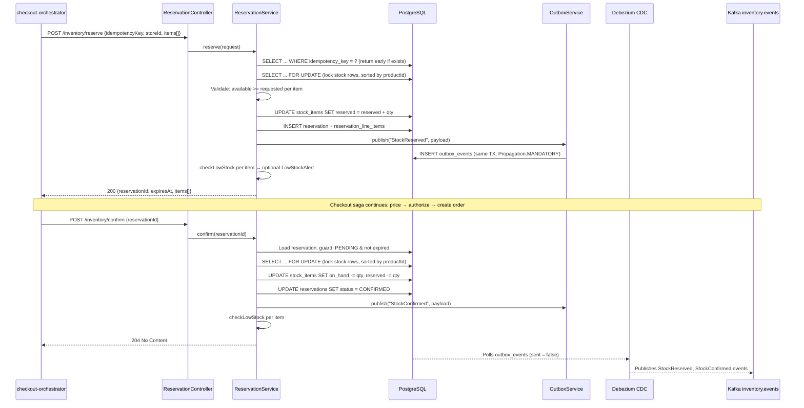
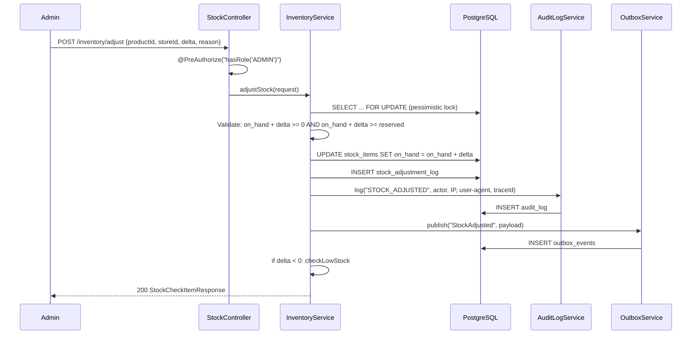
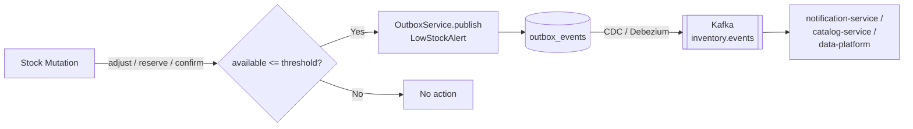
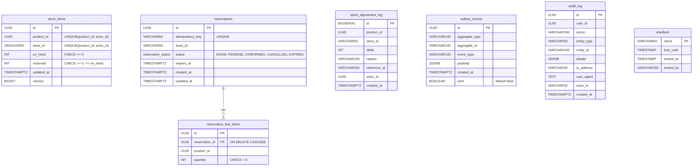

# Inventory Service

> **Module:** `services/inventory-service` · **Port:** 8083 · **Database:** `inventory` (PostgreSQL) · **Kafka topic:** `inventory.events`

The single authority for per-SKU per-store stock counts and the checkout reservation lifecycle in InstaCommerce. Every stock mutation — reserve, confirm, cancel, adjust, expire — flows through this service. No other service may write `stock_items`.

Spring Boot 3 / Java 21 · PostgreSQL with Flyway · Transactional outbox → Debezium/CDC → Kafka · Pessimistic row-level locking · ShedLock distributed scheduling · OTEL traces + Micrometer/OTLP metrics · Structured JSON logging (Logstash encoder).

---

## Table of Contents

1.  [Service Role and Boundaries](#1-service-role-and-boundaries)
2.  [Reservation Authority Posture](#2-reservation-authority-posture)
3.  [High-Level Design (HLD)](#3-high-level-design-hld)
4.  [Low-Level Design (LLD)](#4-low-level-design-lld)
5.  [Request and Event Flows](#5-request-and-event-flows)
6.  [Database Schema](#6-database-schema)
7.  [API Reference](#7-api-reference)
8.  [Runtime and Configuration](#8-runtime-and-configuration)
9.  [Dependencies](#9-dependencies)
10. [Observability](#10-observability)
11. [Testing](#11-testing)
12. [Failure Modes](#12-failure-modes)
13. [Rollout and Rollback Notes](#13-rollout-and-rollback-notes)
14. [Known Limitations](#14-known-limitations)
15. [Industry Comparison Notes](#15-industry-comparison-notes)

---

## 1. Service Role and Boundaries

### What this service owns

| Concern | Mechanism |
|---|---|
| Per-SKU per-store stock truth | `stock_items (product_id, store_id)` UNIQUE — two-bucket model: `on_hand`, `reserved`; `available = on_hand − reserved` (computed, never persisted) |
| Checkout reservation lifecycle | PENDING → CONFIRMED / CANCELLED / EXPIRED state machine on `reservations` table |
| Stock adjustments | Admin-only `adjust` / `adjust-batch` with `stock_adjustment_log`, audit trail, and outbox events |
| Low-stock alerting | Threshold-based `LowStockAlert` events emitted transactionally via outbox |
| Domain event publishing | `outbox_events` table written within the mutation transaction; Debezium CDC relays to `inventory.events` Kafka topic |

### What this service does NOT own

| Concern | Owner |
|---|---|
| Store registry, operating hours, delivery zones, capacity | `warehouse-service` |
| Saga orchestration (reserve → pay → confirm) | `checkout-orchestrator-service` (Temporal) |
| Order lifecycle | `order-service` |
| Catalog visibility (hide/show on out-of-stock) | `catalog-service` / `search-service` (downstream consumers of inventory events) |
| Physical picking, packing, substitution | `fulfillment-service` |

### Upstream callers

`checkout-orchestrator-service` (Temporal activities for reserve/confirm/cancel), `fulfillment-service` (stock adjustments on short-pick), admin tooling (adjust/adjust-batch).

### Downstream consumers

`catalog-service`, `search-service`, `data-platform` (CDC/dbt), `notification-service` — all consume from `inventory.events` Kafka topic.

---

## 2. Reservation Authority Posture

Inventory-service is the **sole reservation authority**: it holds the pessimistic locks, enforces `available >= requested`, manages TTL expiry, and publishes the outbox events that make the reservation outcome durable and visible to the rest of the platform.

**Concurrency contract:**

- All stock mutations acquire `PESSIMISTIC_WRITE` (`SELECT ... FOR UPDATE`) on the `stock_items` row(s), with a configurable lock timeout (default 2 000 ms).
- Multi-item mutations sort by `productId` before locking to prevent deadlocks. This invariant is enforced in both `ReservationService` and `InventoryService`.
- DB-level CHECK constraints (`on_hand >= 0`, `reserved >= 0`, `reserved <= on_hand`) are the final safety net against corruption.

**Idempotency contract:**

- Reserve: client-supplied `idempotencyKey` with UNIQUE constraint on `reservations.idempotency_key`. Duplicate requests return the original response.
- Confirm: idempotent on `CONFIRMED` status (returns 204 without re-decrementing).
- Cancel: idempotent on `CANCELLED` or `EXPIRED` status (returns 204 without re-releasing).

---

## 3. High-Level Design (HLD)

### System context — inventory-service within InstaCommerce



### Component overview



---

## 4. Low-Level Design (LLD)

### 4.1 Stock model

```
stock_items
┌──────────┬────────────┬──────────┬─────────┬──────────┬─────────┐
│ id (PK)  │ product_id │ store_id │ on_hand │ reserved │ version │
│ UUID     │ UUID       │ VARCHAR  │ INT≥0   │ INT≥0    │ BIGINT  │
└──────────┴────────────┴──────────┴─────────┴──────────┴─────────┘
  UNIQUE (product_id, store_id)
  CHECK  (on_hand >= 0)
  CHECK  (reserved >= 0)
  CHECK  (reserved <= on_hand)

  available = on_hand − reserved  (computed, never persisted)
```

`on_hand` represents physical stock the store believes it has. `reserved` is the sum of quantities held by PENDING reservations. `available` is what can be offered to new checkout attempts.

> **Note on `@Version`:** The JPA entity carries a `@Version` field. Because all mutations use `PESSIMISTIC_WRITE`, the version increment is a side effect — optimistic locking is not the active concurrency control mechanism. See the iter-3 review (`docs/reviews/iter3/services/inventory-dark-store.md` §3.4) for a discussion of this dual-lock appearance.

### 4.2 Reservation state machine



Terminal states: `CONFIRMED`, `CANCELLED`, `EXPIRED` — no re-entry is allowed.

**State guards (from `ReservationService`):**

| Operation | Guard | On violation |
|---|---|---|
| `confirm` | `status == PENDING && now < expiresAt` | `ReservationStateException` (409) or `ReservationExpiredException` (409) |
| `cancel` | `status != CONFIRMED` | CANCELLED/EXPIRED → idempotent no-op; CONFIRMED → `ReservationStateException` (409) |
| `expireReservation` | `status == PENDING` | Any other status → silent no-op |

### 4.3 Locking strategy

All stock mutations in both `ReservationService` and `InventoryService` use the same pattern:

```java
entityManager.createQuery(
        "SELECT s FROM StockItem s WHERE s.productId = :pid AND s.storeId = :sid",
        StockItem.class)
    .setLockMode(LockModeType.PESSIMISTIC_WRITE)
    .setHint("jakarta.persistence.lock.timeout", inventoryProperties.getLockTimeoutMs())
    .getSingleResult();
```

- PostgreSQL `SELECT ... FOR UPDATE` with row-level locks.
- Lock timeout: configurable via `INVENTORY_LOCK_TIMEOUT_MS` (default 2 000 ms).
- Multi-item operations sort items by `productId` before locking (consistent lock ordering prevents deadlocks).
- `reserve` runs at `Isolation.READ_COMMITTED`; `confirm`, `cancel`, `adjustStock`, `adjustStockBatch` use the default `READ_COMMITTED`.

### 4.4 UML component diagram

```mermaid
classDiagram
    class ReservationController {
        +reserve(ReserveRequest) ReserveResponse
        +confirm(ConfirmRequest) void
        +cancel(CancelRequest) void
    }
    class StockController {
        +check(StockCheckRequest) StockCheckResponse
        +adjust(StockAdjustRequest) StockCheckItemResponse
        +adjustBatch(StockAdjustBatchRequest) StockCheckResponse
    }
    class ReservationService {
        -reservationRepository
        -stockItemRepository
        -entityManager
        -outboxService
        -inventoryProperties
        -reservationProperties
        +reserve(ReserveRequest) ReserveResponse
        +confirm(UUID) void
        +cancel(UUID) void
        +expireReservation(UUID) void
        -lockStockItem(UUID, String) StockItem
        -releaseReserved(Reservation) void
        -checkLowStock(StockItem, String) void
    end
    class InventoryService {
        -stockItemRepository
        -stockAdjustmentLogRepository
        -entityManager
        -auditLogService
        -outboxService
        -inventoryProperties
        +checkAvailability(StockCheckRequest) StockCheckResponse
        +adjustStock(StockAdjustRequest) StockCheckItemResponse
        +adjustStockBatch(StockAdjustBatchRequest) StockCheckResponse
        -lockStockItem(UUID, String) StockItem
        -checkLowStock(StockItem, String) void
    }
    class OutboxService {
        +publish(String, String, String, Map) void
    }
    class AuditLogService {
        +log(UUID, String, String, String, Map) void
    }
    class RateLimitService {
        -limiters: Cache~String, RateLimiter~
        +tryAcquire(String) boolean
    }
    class ReservationExpiryJob {
        +expireStaleReservations() void
    }
    class OutboxCleanupJob {
        +purgeOldSentEvents() void
    }
    class AuditLogCleanupJob {
        +purgeExpiredLogs() void
    }

    ReservationController --> ReservationService
    StockController --> InventoryService
    StockController --> RateLimitService
    ReservationService --> OutboxService
    InventoryService --> OutboxService
    InventoryService --> AuditLogService
    ReservationExpiryJob --> ReservationService
```

---

## 5. Request and Event Flows

### 5.1 Reserve → Confirm (checkout happy path)



### 5.2 Cancel and expire paths

**Cancel (saga compensation):** `checkout-orchestrator-service` calls `POST /inventory/cancel` when any downstream saga step fails (e.g., payment declined). `ReservationService.cancel()` decrements `reserved` per item and publishes a `StockReleased` event with `reason: CANCELLED`.

**Expire (background job):** `ReservationExpiryJob` runs on a configurable fixed rate (default 30 s), protected by ShedLock (`lockAtLeast: 30s`, `lockAtMost: 5m`). It queries PENDING reservations where `expires_at < now()` in batches of 100 and calls `expireReservation(reservationId)` per row. Each expiry releases stock and publishes a `StockReleased` event with `reason: EXPIRED`.

### 5.3 Stock adjustment flow



### 5.4 Low-stock alert pipeline



**Trigger points:**

| Operation | Condition |
|---|---|
| `adjustStock` / `adjustStockBatch` | `delta < 0` AND resulting `available <= threshold` |
| `reserve` | After incrementing reserved, if `available <= threshold` |
| `confirm` | After decrementing `on_hand`, if `available <= threshold` |

### 5.5 Outbox events published

All events are written to `outbox_events` with `Propagation.MANDATORY` (requires an existing transaction). Debezium CDC reads unsent rows and publishes to `inventory.events`.

| Event type | Aggregate | Trigger | Contract schema |
|---|---|---|---|
| `StockReserved` | `Reservation` | `reserve()` | `contracts/.../schemas/inventory/StockReserved.v1.json` |
| `StockConfirmed` | `Reservation` | `confirm()` | `contracts/.../schemas/inventory/StockConfirmed.v1.json` |
| `StockReleased` | `Reservation` | `cancel()`, `expireReservation()` | `contracts/.../schemas/inventory/StockReleased.v1.json` |
| `StockAdjusted` | `StockItem` | `adjustStock()`, `adjustStockBatch()` | *(no contract schema yet)* |
| `LowStockAlert` | `StockItem` | any mutation where `available <= threshold` | `contracts/.../schemas/inventory/LowStockAlert.v1.json` |

---

## 6. Database Schema

Eight Flyway migrations (`V1` through `V8`) define the schema. `hibernate.ddl-auto: validate` ensures Hibernate never alters the schema — Flyway is the only authority.



**Key constraints and indexes:**

| Table | Constraint / Index | Purpose |
|---|---|---|
| `stock_items` | `UNIQUE (product_id, store_id)` | One stock record per SKU per store |
| `stock_items` | `CHECK (on_hand >= 0)`, `CHECK (reserved >= 0)`, `CHECK (reserved <= on_hand)` | Invariant safety net |
| `reservations` | `UNIQUE (idempotency_key)` | Deduplication |
| `reservations` | Partial index on `status = 'PENDING'` (status, expires_at) | Fast expiry queries |
| `reservation_line_items` | FK → `reservations` `ON DELETE CASCADE`, `CHECK (quantity > 0)` | Referential integrity |
| `stock_adjustment_log` | `idx_adj_product_store`, `idx_adj_created_at`, partial index on `reference_id` | Query performance (V8) |
| `outbox_events` | Partial index on `sent = false` by `created_at` | CDC poll efficiency |
| `audit_log` | Indexes on `user_id`, `action`, `created_at` | Audit query performance |

---

## 7. API Reference

All endpoints are served under the `/inventory` base path. Authentication is via JWT (`Authorization: Bearer <token>`) or internal service token (`X-Internal-Service` + `X-Internal-Token` headers).

### Reservation endpoints

| Method | Path | Auth | Description | Success |
|---|---|---|---|---|
| `POST` | `/inventory/reserve` | JWT / Internal | Reserve stock for checkout | `200` — `ReserveResponse` |
| `POST` | `/inventory/confirm` | JWT / Internal | Confirm reservation (deduct stock) | `204` No Content |
| `POST` | `/inventory/cancel` | JWT / Internal | Cancel reservation (release stock) | `204` No Content |

### Stock endpoints

| Method | Path | Auth | Description | Success |
|---|---|---|---|---|
| `POST` | `/inventory/check` | JWT / Internal | Check stock availability (rate-limited) | `200` — `StockCheckResponse` |
| `POST` | `/inventory/adjust` | `ROLE_ADMIN` | Adjust stock for a single product | `200` — `StockCheckItemResponse` |
| `POST` | `/inventory/adjust-batch` | `ROLE_ADMIN` | Adjust stock for multiple products | `200` — `StockCheckResponse` |

### Request / response schemas

<details>
<summary><strong>ReserveRequest</strong></summary>

```json
{
  "idempotencyKey": "order-abc-123",
  "storeId": "store-01",
  "items": [
    { "productId": "uuid", "quantity": 2 }
  ]
}
```
</details>

<details>
<summary><strong>ReserveResponse</strong></summary>

```json
{
  "reservationId": "uuid",
  "expiresAt": "2025-01-15T10:35:00Z",
  "items": [
    { "productId": "uuid", "quantity": 2 }
  ]
}
```
</details>

<details>
<summary><strong>ConfirmRequest / CancelRequest</strong></summary>

```json
{ "reservationId": "uuid" }
```
</details>

<details>
<summary><strong>StockCheckRequest</strong></summary>

```json
{
  "storeId": "store-01",
  "items": [
    { "productId": "uuid", "quantity": 5 }
  ]
}
```
</details>

<details>
<summary><strong>StockCheckResponse</strong></summary>

```json
{
  "items": [
    { "productId": "uuid", "available": 42, "onHand": 50, "sufficient": true }
  ]
}
```
</details>

<details>
<summary><strong>StockAdjustRequest</strong></summary>

```json
{
  "productId": "uuid",
  "storeId": "store-01",
  "delta": -5,
  "reason": "SHRINKAGE",
  "referenceId": "optional-ref"
}
```
</details>

<details>
<summary><strong>StockAdjustBatchRequest</strong></summary>

```json
{
  "storeId": "store-01",
  "reason": "RECEIVING",
  "referenceId": "PO-2025-001",
  "items": [
    { "productId": "uuid-1", "delta": 100 },
    { "productId": "uuid-2", "delta": 50 }
  ]
}
```
</details>

### Error response envelope

```json
{
  "code": "INSUFFICIENT_STOCK",
  "message": "Insufficient stock for product ...",
  "traceId": "abc123",
  "timestamp": "2025-01-15T10:30:00Z",
  "details": []
}
```

| HTTP | Code | Cause |
|---|---|---|
| `400` | `VALIDATION_ERROR` | Invalid request body / constraint violation |
| `401` | `TOKEN_INVALID` | Missing or invalid JWT |
| `403` | `ACCESS_DENIED` | Missing `ROLE_ADMIN` for adjust endpoints |
| `404` | `PRODUCT_NOT_FOUND` | Product/store combination does not exist |
| `404` | `RESERVATION_NOT_FOUND` | Reservation ID not found |
| `409` | `INSUFFICIENT_STOCK` | Not enough available stock to reserve |
| `409` | `RESERVATION_EXPIRED` | Reservation TTL exceeded |
| `409` | `INVALID_RESERVATION_STATE` | Invalid state transition (e.g., cancel a confirmed reservation) |
| `409` | `INVALID_STOCK_ADJUSTMENT` | Adjustment would violate `on_hand >= 0` or `on_hand >= reserved` |
| `429` | *(none)* | Rate limit exceeded on `/inventory/check` |
| `500` | `INTERNAL_ERROR` | Unhandled exception (logged with full stack trace) |

---

## 8. Runtime and Configuration

### Key properties (`application.yml`)

| Property | Env override | Default | Description |
|---|---|---|---|
| `server.port` | `SERVER_PORT` | `8083` | HTTP listen port (Dockerfile overrides to `8080`) |
| `spring.datasource.url` | `INVENTORY_DB_URL` | `jdbc:postgresql://localhost:5432/inventory` | PostgreSQL JDBC URL |
| `spring.datasource.password` | `sm://db-password-inventory` or `INVENTORY_DB_PASSWORD` | — | DB password (GCP Secret Manager in prod) |
| `spring.datasource.hikari.maximum-pool-size` | — | `60` | HikariCP max connections |
| `spring.datasource.hikari.minimum-idle` | — | `15` | HikariCP min idle |
| `spring.datasource.hikari.connection-timeout` | — | `3000` ms | Connection acquisition timeout |
| `spring.datasource.hikari.leak-detection-threshold` | — | `30000` ms | Connection leak alert |
| `inventory.low-stock-threshold` | `INVENTORY_LOW_STOCK_THRESHOLD` | `10` | Available qty at or below which `LowStockAlert` fires |
| `inventory.lock-timeout-ms` | `INVENTORY_LOCK_TIMEOUT_MS` | `2000` | Pessimistic lock wait timeout (ms) |
| `reservation.ttl-minutes` | `INVENTORY_RESERVATION_TTL_MINUTES` | `5` | Reservation time-to-live |
| `reservation.expiry-check-interval-ms` | `INVENTORY_RESERVATION_EXPIRY_INTERVAL_MS` | `30000` | Expiry job polling interval |
| `rate-limit.requests-per-period` | — | `50` | Max requests per IP per period on `/check` |
| `rate-limit.period-seconds` | — | `60` | Rate limit window |
| `internal.service.token` | `INTERNAL_SERVICE_TOKEN` | `dev-internal-token-change-in-prod` | Shared token for service-to-service auth |
| `management.tracing.sampling.probability` | `TRACING_PROBABILITY` | `1.0` | OTEL trace sampling rate |

### Secrets

Production secrets are loaded from GCP Secret Manager via `spring.config.import: optional:sm://` and the `com.google.cloud:spring-cloud-gcp-starter-secretmanager` dependency:

- `sm://db-password-inventory` → database password
- `sm://jwt-rsa-public-key` → RSA public key for JWT verification

### JVM tuning (Dockerfile)

```
java -XX:MaxRAMPercentage=75.0 -XX:+UseZGC -Djava.security.egd=file:/dev/./urandom -jar app.jar
```

Base image: `eclipse-temurin:25-jre-alpine`. Non-root user (`app:1001`). Docker healthcheck: `GET /actuator/health/liveness` every 30 s.

### Graceful shutdown

`server.shutdown: graceful` with `spring.lifecycle.timeout-per-shutdown-phase: 30s`. In-flight requests are drained before the process exits.

### Running locally

```bash
# Option 1: Use the repo's docker-compose (brings up PostgreSQL, Kafka, etc.)
docker-compose up -d

# Build & run
./gradlew :services:inventory-service:bootRun

# Option 2: Standalone PostgreSQL
docker run -d --name inventory-pg \
  -e POSTGRES_DB=inventory -e POSTGRES_PASSWORD=postgres \
  -p 5432:5432 postgres:16
./gradlew :services:inventory-service:bootRun

# Option 3: Docker image
./gradlew :services:inventory-service:bootJar
docker build -t inventory-service services/inventory-service
docker run -p 8083:8080 \
  -e INVENTORY_DB_URL=jdbc:postgresql://host.docker.internal:5432/inventory \
  -e INVENTORY_DB_PASSWORD=postgres \
  -e INVENTORY_JWT_PUBLIC_KEY="<pem>" \
  inventory-service
```

---

## 9. Dependencies

### Build dependencies (`build.gradle.kts`)

| Category | Artifact | Purpose |
|---|---|---|
| Web | `spring-boot-starter-web` | REST API |
| Persistence | `spring-boot-starter-data-jpa`, `flyway-core`, `flyway-database-postgresql`, `postgresql` (runtime) | JPA/Hibernate, schema migrations |
| Security | `spring-boot-starter-security`, `jjwt-api/impl/jackson 0.12.5` | JWT auth, role-based access |
| Validation | `spring-boot-starter-validation` | Bean validation (`@Valid`) |
| Observability | `spring-boot-starter-actuator`, `micrometer-tracing-bridge-otel`, `micrometer-registry-otlp`, `logstash-logback-encoder 7.4` | Health, metrics, traces, structured logs |
| Cloud | `spring-cloud-gcp-starter-secretmanager`, `postgres-socket-factory 1.15.0` | GCP Secret Manager, Cloud SQL socket |
| Scheduling | `shedlock-spring 5.10.0`, `shedlock-provider-jdbc-template 5.10.0` | Distributed lock for scheduled jobs |
| Rate limiting | `resilience4j-ratelimiter 2.3.0`, `caffeine 3.1.8` | Per-IP rate limiting with in-memory cache |

### Test dependencies

| Artifact | Purpose |
|---|---|
| `spring-boot-starter-test` | JUnit 5, MockMvc, assertions |
| `spring-security-test` | Security context test support |
| `testcontainers:postgresql 1.19.3`, `testcontainers:junit-jupiter 1.19.3` | Integration tests with real PostgreSQL |

### Infrastructure dependencies

| System | Purpose | Connection |
|---|---|---|
| PostgreSQL | Primary data store | JDBC via HikariCP (or Cloud SQL socket in GCP) |
| Kafka | Event bus (`inventory.events` topic) | Via Debezium CDC reading `outbox_events` |
| Debezium | CDC connector | Reads `outbox_events` table, publishes to Kafka |
| GCP Secret Manager | Secrets | `sm://` prefix in `application.yml` |
| OTEL Collector | Traces + metrics | `http://otel-collector.monitoring:4318` |

---

## 10. Observability

### Health probes

| Endpoint | Type | Includes |
|---|---|---|
| `GET /actuator/health/liveness` | Liveness | `livenessState` only |
| `GET /actuator/health/readiness` | Readiness | `readinessState` + DB connectivity |

### Metrics

Exposed at `GET /actuator/prometheus` and pushed via OTLP to the collector. Includes:

- Standard Spring Boot / JVM / HikariCP metrics
- Custom tags: `service=inventory-service`, `environment=${ENVIRONMENT}`

### Tracing

OTEL distributed tracing via `micrometer-tracing-bridge-otel`. Trace IDs are propagated in error responses (`traceId` field) and audit logs (`trace_id` column). Sampling rate is configurable (`TRACING_PROBABILITY`, default `1.0`).

### Structured logging

All logs are JSON-structured via Logstash encoder (`logback-spring.xml`), with `service` and `environment` fields embedded. Unhandled exceptions are logged at `ERROR` with full stack traces by `GlobalExceptionHandler`.

### Audit trail

Admin actions (`STOCK_ADJUSTED`, `STOCK_ADJUSTED_BATCH`) are recorded in `audit_log` with: `user_id`, `action`, `entity_type`, `entity_id`, `details` (JSONB), `ip_address` (X-Forwarded-For aware), `user_agent`, `trace_id`.

---

## 11. Testing

### Test infrastructure

- **Framework:** JUnit 5 via Gradle (`useJUnitPlatform()`)
- **Integration:** Testcontainers with PostgreSQL 1.19.3 for real-database tests
- **Security:** `spring-security-test` for authenticated / role-based test contexts

### Running tests

```bash
# All inventory-service tests
./gradlew :services:inventory-service:test

# Single test class
./gradlew :services:inventory-service:test --tests "com.instacommerce.inventory.service.ReservationServiceTest"

# Single test method
./gradlew :services:inventory-service:test --tests "com.instacommerce.inventory.service.ReservationServiceTest.shouldReserveStock"
```

### Build

```bash
./gradlew :services:inventory-service:build -x test   # compile + package
./gradlew :services:inventory-service:bootRun          # run locally
```

---

## 12. Failure Modes

| Failure | Impact | Mitigation |
|---|---|---|
| **PostgreSQL down** | All endpoints return 5xx; readiness probe fails; Kubernetes stops routing traffic | HikariCP connection timeout (3 s); graceful shutdown drains in-flight; readiness group includes `db` |
| **Pessimistic lock timeout** | Concurrent requests on hot SKU exceed 2 s wait | `LockTimeoutException` propagates as 500 (**known gap**: not mapped to a clean 503/409 in `GlobalExceptionHandler`; see §14) |
| **Reservation expiry race** | Concurrent `cancel` and `expireReservation` on same PENDING reservation can double-decrement `reserved` | DB `CHECK (reserved >= 0)` catches corruption; surfaces as `DataIntegrityViolationException` / 500 (**known gap**: no `PESSIMISTIC_WRITE` on `Reservation` row; see §14) |
| **Idempotency key race** | Two concurrent reserves with same key both miss `findByIdempotencyKey` | DB `UNIQUE (idempotency_key)` rejects the loser; surfaces as 500 (**known gap**: `DataIntegrityViolationException` not mapped to clean 409) |
| **Debezium / CDC lag** | Outbox events are written but not yet published to Kafka; downstream consumers see stale data | At-least-once delivery once CDC catches up; no data loss; `outbox_events.sent` flag tracks relay state |
| **ShedLock contention** | If multiple replicas attempt the same job, only one acquires the lock; others skip | By design — `lockAtLeast` prevents rapid re-execution |
| **Kafka unavailable** | Events queue in `outbox_events` (unbounded); no Kafka dependency on the write path | Outbox decouples the write path from Kafka availability; `OutboxCleanupJob` only deletes `sent = true` rows |
| **GCP Secret Manager unavailable at startup** | `spring.config.import: optional:sm://` — service starts with local fallbacks if available | Falls back to `INVENTORY_DB_PASSWORD` and `INVENTORY_JWT_PUBLIC_KEY` env vars |

---

## 13. Rollout and Rollback Notes

### Schema migrations

Flyway migrations are **forward-only** and run automatically at startup (`spring.flyway.enabled: true`). All eight migrations (V1–V8) are additive (CREATE TABLE, CREATE INDEX). Rollback requires a manual counter-migration.

**Pre-deploy checklist:**

1. New migration must be backward-compatible with the previous application version (additive columns with defaults, new tables, new indexes — never drop/rename in the same release).
2. Run `./gradlew :services:inventory-service:build` to verify Hibernate `validate` passes against the new schema.
3. Deploy migration first (new binary with new migration), then route traffic.

### Application rollback

- **Stateless service:** rolling back the Kubernetes deployment to the previous image is safe as long as no destructive migration was applied.
- **Reservation TTL:** in-flight PENDING reservations will be expired by `ReservationExpiryJob` on the running version; no cross-version coordination is needed.
- **Outbox events:** a rollback to an older app version does not affect CDC relay — new event types from the new version may already be in Kafka; downstream consumers must tolerate unknown event types.

### Feature flags

The service does not currently integrate with `config-feature-flag-service`. New behavior changes should be gated by environment-variable toggles in `application.yml` until feature-flag integration is added (see known limitations).

---

## 14. Known Limitations

These are documented findings from the checked-in code and the iter-3 review materials (`docs/reviews/iter3/services/inventory-dark-store.md`, `docs/reviews/iter3/diagrams/lld/inventory-warehouse-reservation.md`).

| # | Finding | Severity | Detail |
|---|---|---|---|
| 1 | **`storeId` is unvalidated** | HIGH | `store_id VARCHAR(50)` has no referential link to `warehouse-service`. Reservations can be created against non-existent, inactive, or maintenance stores. Target fix: local `dark_stores` table populated via Kafka `StoreStatusChanged` events. |
| 2 | **No `PESSIMISTIC_WRITE` on `Reservation` row during confirm/cancel** | MEDIUM | Concurrent confirm or cancel/expire on the same reservation can produce double-decrements on `reserved`. DB `CHECK (reserved >= 0)` catches it but surfaces as 500, not a clean 409. |
| 3 | **`DataIntegrityViolationException` not mapped** | MEDIUM | Concurrent duplicate reserves (same idempotency key) that both miss the app-level check hit the DB UNIQUE constraint and surface as 500 instead of being caught and re-fetched. |
| 4 | **`LockTimeoutException` not mapped** | MEDIUM | Under hot-SKU contention, lock timeouts surface as 500 instead of 503 with Retry-After. |
| 5 | **`orderId` conflated with `idempotencyKey`** | MEDIUM | `StockReserved` event sets `orderId = request.idempotencyKey()`. If the caller uses a non-UUID idempotency key, downstream consumers parsing `orderId` as UUID will break. |
| 6 | **Contract schema gaps** | HIGH | `StockConfirmed.v1.json` and `StockReleased.v1.json` omit `items[]` and `storeId`. The service code includes these fields in the outbox payload, but the contract schemas don't declare them. `StockAdjusted` has no contract schema at all. |
| 7 | **No `OutOfStock` event** | HIGH | When `available` hits zero, no distinct event is published. Catalog/search must infer out-of-stock from `LowStockAlert` with `currentQuantity <= 0`. |
| 8 | **Global low-stock threshold** | HIGH | A single `INVENTORY_LOW_STOCK_THRESHOLD` (default 10) is meaningless across heterogeneous SKU velocity and store sizes. No per-SKU or per-store threshold. |
| 9 | **No stock reconciliation** | HIGH | No cycle-count, no physical-count-vs-system variance capture, no automated drift correction. Stock accuracy will degrade over time. |
| 10 | **Two-bucket model only** | MEDIUM | No `in_transit`, `actual_count`, `display_buffer`, or lot/expiry tracking. See industry comparison (§15). |
| 11 | **Sequential lock acquisition** | LOW | Multi-item reserve/adjust acquires locks in a for-loop (one `SELECT FOR UPDATE` per item). Batch acquisition in a single query would reduce latency. |
| 12 | **`@Version` on `StockItem` is unused** | LOW | `@Version` exists but all mutations use `PESSIMISTIC_WRITE`, making the optimistic lock a no-op. |
| 13 | **No test classes checked in** | LOW | `src/test/` contains no test files. Testcontainers dependency suggests integration tests are planned but not yet implemented. |
| 14 | **`reason` is free-text** | MEDIUM | `stock_adjustment_log.reason` is `VARCHAR(100)` with no enum enforcement, making reporting unreliable. |

---

## 15. Industry Comparison Notes

Grounded in `docs/reviews/iter3/benchmarks/india-operator-patterns.md` and `docs/reviews/iter3/benchmarks/global-operator-patterns.md`.

| Capability | InstaCommerce (current) | India q-commerce leaders (Blinkit, Zepto, Swiggy Instamart) |
|---|---|---|
| **Stock buckets** | Two: `on_hand`, `reserved` | Three to four: `available`, `promised`, `actual` (cycle-count verified), `in_transit` (Zepto) |
| **Lot / FEFO tracking** | None — no `lot_id`, `expiry_date`, `manufacture_date` columns | Zepto: lot-level FEFO with guided picking (cited ~12% perishable write-off reduction) |
| **Cycle-count workflow** | None — no scheduled count task or variance capture | Blinkit: mandatory daily category-based counts; Zepto: shift-end counts |
| **Receiving flow** | Manual admin `POST /adjust` | Barcode-driven GRN with PO-receive events |
| **Alert thresholds** | Single global threshold (`10`) | Per-SKU velocity-weighted or ML-driven thresholds |
| **Display buffer** | None | Swiggy Instamart: 5–10 unit deduction buffer on high-velocity SKUs to avoid phantom availability |
| **Reservation authority** | Pessimistic locking with sorted lock ordering ✅ | Comparable — pessimistic or optimistic with retry; InstaCommerce's approach is sound |
| **Outbox / CDC eventing** | Transactional outbox → Debezium → Kafka ✅ | Industry standard; InstaCommerce is aligned |

The reservation authority and outbox eventing patterns are well-aligned with industry best practice. The primary gaps are in stock accuracy (reconciliation, FEFO, multi-bucket) and operational tooling (receiving, cycle-count, per-SKU thresholds), which are documented as future implementation targets in the iter-3 review materials.
