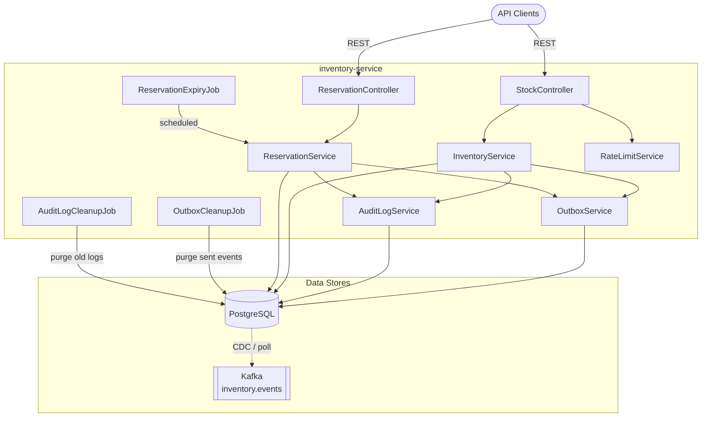
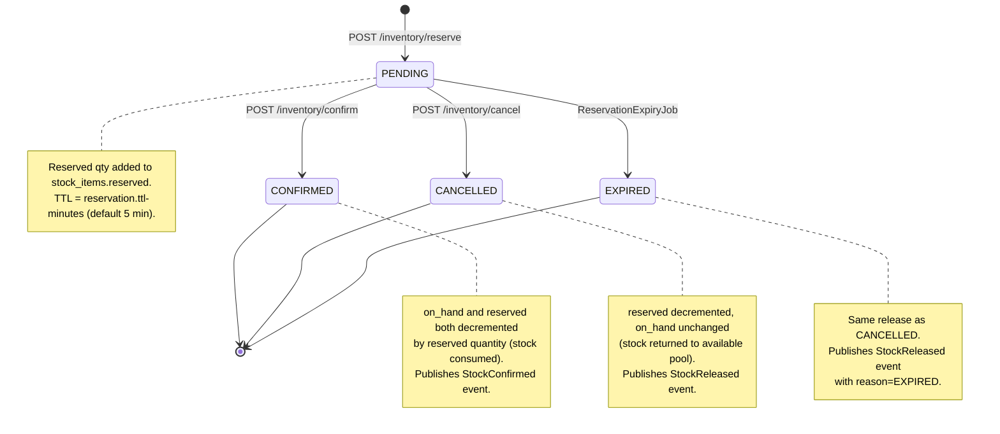
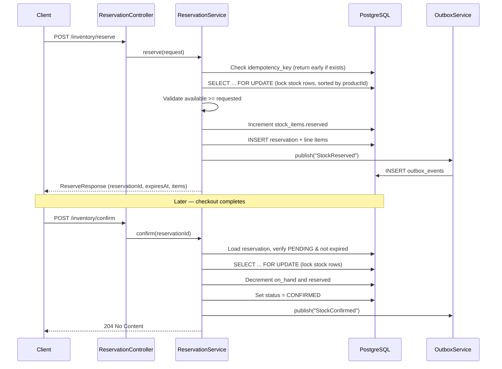
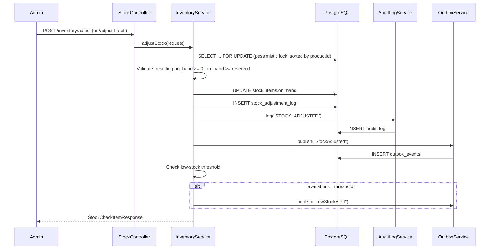
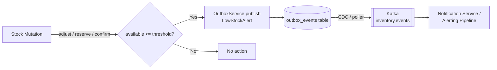
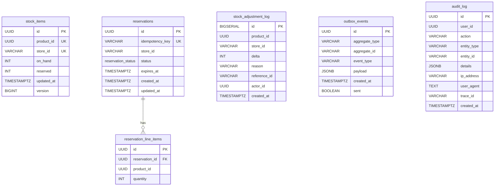

# Inventory Service

Stock management, reservation (for checkout), stock adjustments, and low-stock alerts for the InstaCommerce platform.

Built with Spring Boot 3 on Java 21. Uses PostgreSQL for persistence, the transactional outbox pattern for reliable event publishing to Kafka (`inventory.events`), and pessimistic locking for safe concurrent stock mutations.

---

## Table of Contents

- [Service Architecture](#service-architecture)
- [Stock Reservation Flow](#stock-reservation-flow)
- [Inventory Adjustment Flow](#inventory-adjustment-flow)
- [Low-Stock Alert Pipeline](#low-stock-alert-pipeline)
- [Database Schema](#database-schema)
- [API Reference](#api-reference)
- [Key Components](#key-components)
- [Configuration](#configuration)
- [Running Locally](#running-locally)

---

## Service Architecture



---

## Stock Reservation Flow

The reservation lifecycle follows a **reserve → confirm / cancel** pattern with automatic expiry for abandoned reservations.



**Detailed reserve → confirm flow:**



---

## Inventory Adjustment Flow

Stock adjustments (receiving, shrinkage, corrections) are performed by admins and require the `ADMIN` role.



---

## Low-Stock Alert Pipeline

Alerts are evaluated whenever available stock (`on_hand − reserved`) drops to or below the configurable threshold.



**LowStockAlert event payload:**

```json
{
  "productId": "uuid",
  "warehouseId": "store-01",
  "currentQuantity": 8,
  "threshold": 10,
  "detectedAt": "2025-01-15T10:30:00Z"
}
```

**Trigger points:**

| Operation | Condition |
|---|---|
| `adjustStock` / `adjustStockBatch` | When `delta < 0` and resulting available ≤ threshold |
| `reserve` | After reserving stock, if available ≤ threshold |
| `confirm` | After decrementing `on_hand`, if available ≤ threshold |

---

## Database Schema



**Key constraints:**

- `stock_items`: unique on `(product_id, store_id)`, check `on_hand >= 0`, check `reserved >= 0`, check `reserved <= on_hand`
- `reservations`: unique on `idempotency_key`; partial indexes on `status = 'PENDING'` for expiry queries
- `reservation_line_items`: FK to `reservations` with `ON DELETE CASCADE`, check `quantity > 0`

---

## API Reference

All endpoints are served under the `/inventory` base path.

### Reservation Endpoints

| Method | Path | Auth | Description | Request Body | Success Response |
|---|---|---|---|---|---|
| `POST` | `/inventory/reserve` | JWT | Reserve stock for checkout | `ReserveRequest` | `200` — `ReserveResponse` |
| `POST` | `/inventory/confirm` | JWT | Confirm reservation (deduct stock) | `ConfirmRequest` | `204` No Content |
| `POST` | `/inventory/cancel` | JWT | Cancel reservation (release stock) | `CancelRequest` | `204` No Content |

### Stock Endpoints

| Method | Path | Auth | Description | Request Body | Success Response |
|---|---|---|---|---|---|
| `POST` | `/inventory/check` | JWT | Check stock availability | `StockCheckRequest` | `200` — `StockCheckResponse` |
| `POST` | `/inventory/adjust` | `ADMIN` | Adjust stock for a single product | `StockAdjustRequest` | `200` — `StockCheckItemResponse` |
| `POST` | `/inventory/adjust-batch` | `ADMIN` | Adjust stock for multiple products | `StockAdjustBatchRequest` | `200` — `StockCheckResponse` |

### Request / Response Schemas

<details>
<summary><strong>ReserveRequest</strong></summary>

```json
{
  "idempotencyKey": "order-abc-123",
  "storeId": "store-01",
  "items": [
    { "productId": "uuid", "quantity": 2 }
  ]
}
```
</details>

<details>
<summary><strong>ReserveResponse</strong></summary>

```json
{
  "reservationId": "uuid",
  "expiresAt": "2025-01-15T10:35:00Z",
  "items": [
    { "productId": "uuid", "quantity": 2 }
  ]
}
```
</details>

<details>
<summary><strong>ConfirmRequest / CancelRequest</strong></summary>

```json
{ "reservationId": "uuid" }
```
</details>

<details>
<summary><strong>StockCheckRequest</strong></summary>

```json
{
  "storeId": "store-01",
  "items": [
    { "productId": "uuid", "quantity": 5 }
  ]
}
```
</details>

<details>
<summary><strong>StockCheckResponse</strong></summary>

```json
{
  "items": [
    { "productId": "uuid", "available": 42, "onHand": 50, "sufficient": true }
  ]
}
```
</details>

<details>
<summary><strong>StockAdjustRequest</strong></summary>

```json
{
  "productId": "uuid",
  "storeId": "store-01",
  "delta": -5,
  "reason": "SHRINKAGE",
  "referenceId": "optional-ref"
}
```
</details>

<details>
<summary><strong>StockAdjustBatchRequest</strong></summary>

```json
{
  "storeId": "store-01",
  "reason": "RECEIVING",
  "referenceId": "PO-2025-001",
  "items": [
    { "productId": "uuid-1", "delta": 100 },
    { "productId": "uuid-2", "delta": 50 }
  ]
}
```
</details>

### Error Response

All errors follow a standard envelope:

```json
{
  "code": "INSUFFICIENT_STOCK",
  "message": "Insufficient stock for product ...",
  "traceId": "abc123",
  "timestamp": "2025-01-15T10:30:00Z",
  "details": []
}
```

| HTTP Status | Code | Cause |
|---|---|---|
| `400` | `VALIDATION_ERROR` | Invalid request body / constraint violation |
| `403` | `ACCESS_DENIED` | Missing `ADMIN` role for adjust endpoints |
| `404` | `PRODUCT_NOT_FOUND` | Product/store combination does not exist |
| `404` | `RESERVATION_NOT_FOUND` | Reservation ID not found |
| `409` | `INSUFFICIENT_STOCK` | Not enough available stock to reserve |
| `409` | `RESERVATION_EXPIRED` | Reservation TTL exceeded |
| `409` | `INVALID_RESERVATION_STATE` | Invalid state transition (e.g., cancel a confirmed reservation) |
| `409` | `INVALID_STOCK_ADJUSTMENT` | Adjustment would result in negative stock |
| `429` | — | Rate limit exceeded (`/inventory/check`) |

---

## Key Components

| Component | Role |
|---|---|
| `ReservationController` | REST endpoints for reserve / confirm / cancel |
| `StockController` | REST endpoints for stock check and adjustments |
| `ReservationService` | Reservation lifecycle — reserve, confirm, cancel, expire. Pessimistic locking with sorted product IDs to prevent deadlocks |
| `InventoryService` | Stock availability checks and adjustments. Pessimistic locking, audit logging, outbox event publishing |
| `OutboxService` | Writes domain events to `outbox_events` within the same transaction (`Propagation.MANDATORY`). A CDC connector or poller publishes these to Kafka |
| `RateLimitService` | Per-IP rate limiting using Resilience4j + Caffeine cache (default 50 req / 60 s) |
| `AuditLogService` | Records admin actions with user, IP, User-Agent, and trace ID |
| `ReservationExpiryJob` | Scheduled job (ShedLock) that expires stale `PENDING` reservations in batches of 100 |
| `OutboxCleanupJob` | Purges sent outbox events older than 30 days (daily at 04:00) |
| `AuditLogCleanupJob` | Purges audit logs older than the retention period (default 730 days, daily at 03:00) |

---

## Configuration

Key properties in `application.yml` (override via environment variables):

| Property | Env Var | Default | Description |
|---|---|---|---|
| `server.port` | `SERVER_PORT` | `8083` | HTTP listen port |
| `spring.datasource.url` | `INVENTORY_DB_URL` | `jdbc:postgresql://localhost:5432/inventory` | PostgreSQL connection |
| `inventory.low-stock-threshold` | `INVENTORY_LOW_STOCK_THRESHOLD` | `10` | Available qty at or below which `LowStockAlert` fires |
| `inventory.lock-timeout-ms` | `INVENTORY_LOCK_TIMEOUT_MS` | `2000` | Pessimistic lock wait timeout (ms) |
| `reservation.ttl-minutes` | `INVENTORY_RESERVATION_TTL_MINUTES` | `5` | Reservation time-to-live |
| `reservation.expiry-check-interval-ms` | `INVENTORY_RESERVATION_EXPIRY_INTERVAL_MS` | `30000` | Expiry job polling interval |
| `rate-limit.requests-per-period` | — | `50` | Max requests per period per IP |
| `rate-limit.period-seconds` | — | `60` | Rate limit window (seconds) |

---

## Running Locally

```bash
# Start PostgreSQL
docker run -d --name inventory-pg \
  -e POSTGRES_DB=inventory \
  -e POSTGRES_PASSWORD=postgres \
  -p 5432:5432 postgres:16

# Build & run
./gradlew :services:inventory-service:bootRun

# Or via Docker
docker build -t inventory-service services/inventory-service
docker run -p 8083:8080 \
  -e INVENTORY_DB_URL=jdbc:postgresql://host.docker.internal:5432/inventory \
  -e INVENTORY_DB_PASSWORD=postgres \
  -e INVENTORY_JWT_PUBLIC_KEY="<pem>" \
  inventory-service
```

### Health Check

```
GET /actuator/health/liveness   → liveness probe
GET /actuator/health/readiness  → readiness probe (includes DB)
```
