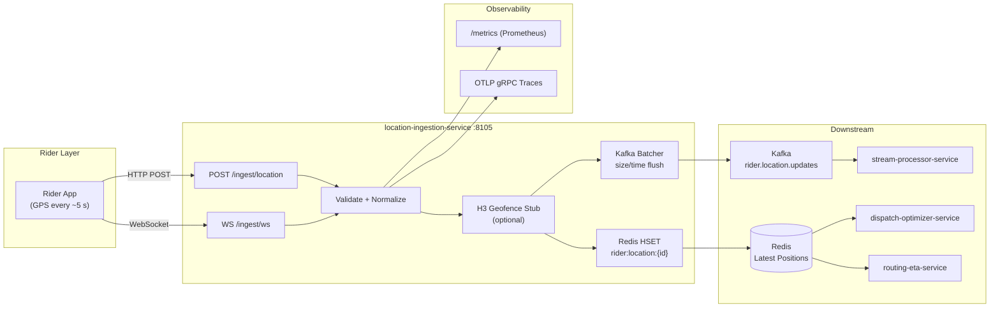
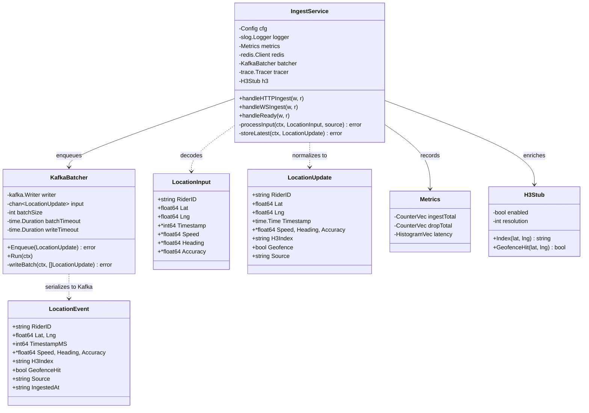
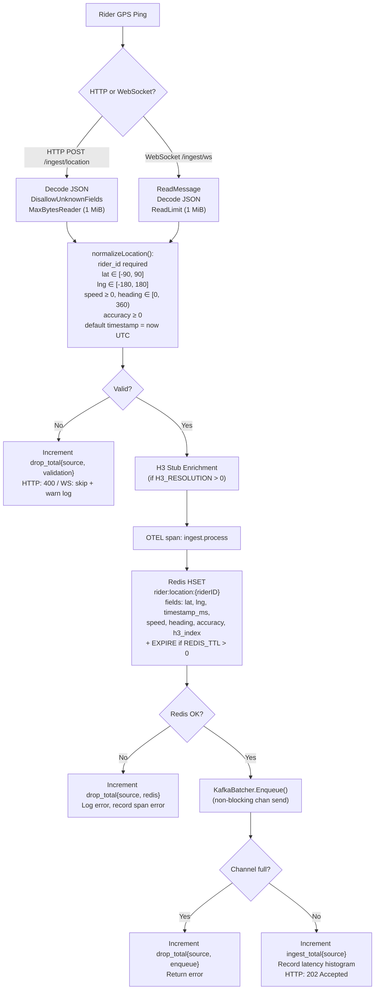
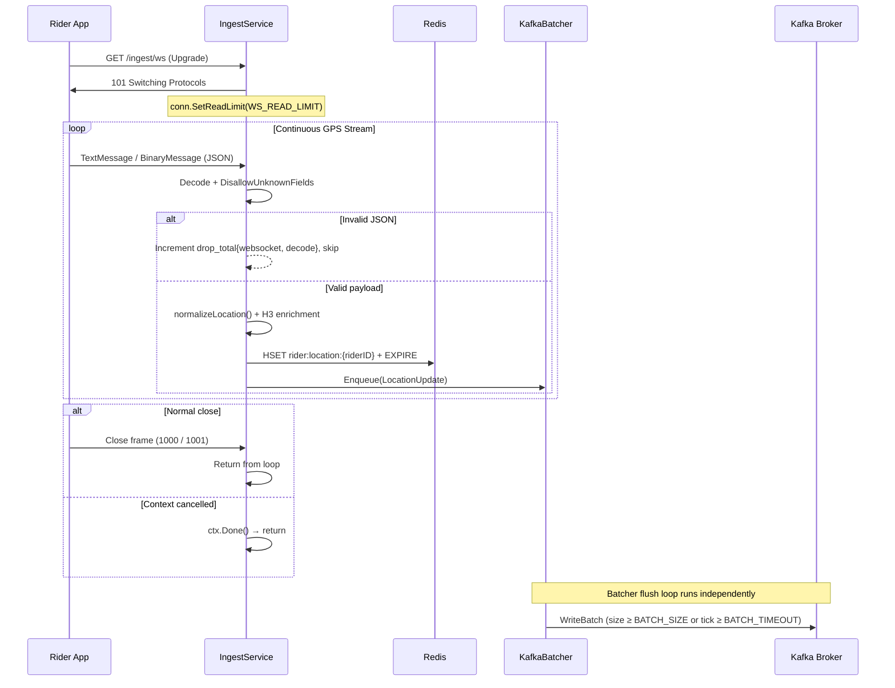
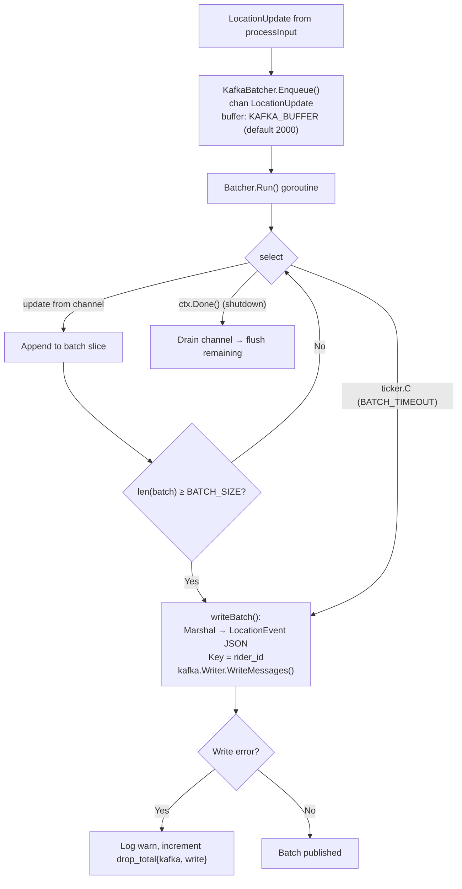

# Location Ingestion Service

> **Go · High-Throughput Rider GPS Pipeline · HTTP & WebSocket → Redis + Kafka**

Stateless, high-throughput GPS ingestion service that accepts rider location
updates over HTTP POST and WebSocket, validates and optionally enriches them
with H3 geofence data, stores the latest position per rider in Redis (HSET with
configurable TTL), and batches updates to Kafka (`rider.location.updates`) for
downstream analytics and stream processing. The service owns no persistent
state; Redis is used as an ephemeral latest-position cache and Kafka is the
durable event log.

**Downstream consumers** (per `docs/reviews/iter3`): `stream-processor-service`
reads `rider.location.updates` for analytics; `routing-eta-service` and
`dispatch-optimizer-service` read the Redis latest-position keys at query time.

---

## Table of Contents

- [Service Role and Boundaries](#service-role-and-boundaries)
- [High-Level Design](#high-level-design)
- [Low-Level Design](#low-level-design)
- [Location Ingestion Flows](#location-ingestion-flows)
- [Runtime and Configuration](#runtime-and-configuration)
- [Dependencies](#dependencies)
- [API Reference](#api-reference)
- [Observability](#observability)
- [Testing](#testing)
- [Failure Modes](#failure-modes)
- [Rollout and Rollback Notes](#rollout-and-rollback-notes)
- [Known Limitations](#known-limitations)
- [Q-Commerce Telemetry Comparison](#q-commerce-telemetry-comparison)

---

## Service Role and Boundaries

| Attribute | Value |
|---|---|
| **Language / Runtime** | Go 1.24 (`go.mod`), single static binary |
| **Port** | `8105` (configurable via `PORT` / `SERVER_PORT`) |
| **Owns** | Ingestion, validation, normalization, optional H3 enrichment, Redis latest-position write, Kafka batch publish |
| **Does not own** | Dispatch scoring, ETA calculation, assignment, order state, persistent rider profiles |
| **Redis key pattern** | `rider:location:{riderID}` (HSET, configurable prefix and TTL) |
| **Kafka topic** | `rider.location.updates` (batched, keyed by `rider_id`, `RequireAll` acks) |
| **Upstream** | Rider mobile app (GPS pings, typically every 5 s) |
| **Downstream** | `stream-processor-service` (Kafka), `dispatch-optimizer-service` (Redis reads), `routing-eta-service` (Redis reads) |

The service is intentionally thin: it ingests, validates, fans out, and exits.
It does **not** maintain rider state machines, assignment logic, or geofence
zone management APIs. Geofence checking is in-process and log-only; events are
not yet published to a downstream topic (see [Known Limitations](#known-limitations)).

### Project Structure

```
location-ingestion-service/
├── main.go                 # HTTP/WS server, Config, IngestService, KafkaBatcher, tracing
├── handler/
│   ├── location.go         # LocationHandler — HTTP POST + WebSocket (handler-layer abstraction)
│   ├── geofence.go         # GeofenceChecker — Haversine + H3 stub zone detection
│   └── batcher.go          # LocationBatcher — time/size Kafka batching with KafkaProducer interface
├── store/
│   └── redis.go            # LatestPositionStore — Redis SET/GET/GetNearby (SCAN-based)
├── Dockerfile              # Multi-stage alpine build, non-root user, HEALTHCHECK
└── go.mod                  # Go 1.24, direct deps listed below
```

`main.go` contains a self-contained implementation (`IngestService`, `KafkaBatcher`,
`Config`, `Metrics`) used at runtime. The `handler/` and `store/` packages provide
a more interface-driven design (e.g., `KafkaProducer`, `LatestPositionStore`
interfaces) suitable for unit testing with mocks.

---

## High-Level Design



---

## Low-Level Design

### Component Diagram



### handler/ Layer (Interface-Driven)

The `handler/` package provides an alternative, interface-driven design with:

- **`LocationHandler`** — depends on `LatestPositionStore` interface and
  `LocationBatcher` for testability.
- **`GeofenceChecker`** — thread-safe (`sync.RWMutex`) zone registry with
  Haversine distance checks and H3 stub indexing. Zone types: `store`,
  `delivery`, `restricted`. Events: `ENTERED_STORE`, `NEAR_DELIVERY`,
  `ENTERED_RESTRICTED`, `EXITED_ZONE` (1.5× radius buffer).
- **`LocationBatcher`** — `KafkaProducer` interface, `Add()` + `Start(ctx)`
  flush loop, drains buffer on context cancellation.

### store/ Layer

- **`LatestPositionStore`** — Redis `SET`/`GET` with JSON serialization and
  configurable TTL (default 5 min). `GetNearby()` uses `SCAN` + Haversine
  filtering (O(n) — see [Known Limitations](#known-limitations)).

---

## Location Ingestion Flows

### GPS Ingestion Pipeline (Flowchart)



### WebSocket Connection Lifecycle (Sequence)



### Kafka Batching (System Flow)



---

## Runtime and Configuration

All configuration is via environment variables. The service has no config files.

| Variable | Default | Description |
|---|---|---|
| `PORT` / `SERVER_PORT` | `8105` | HTTP listen port |
| `KAFKA_BROKERS` | _(none — Kafka disabled if empty)_ | Comma-separated broker addresses |
| `KAFKA_TOPIC` | `rider.location.updates` | Destination Kafka topic |
| `KAFKA_BATCH_SIZE` | `200` | Max messages per Kafka batch write |
| `KAFKA_BATCH_TIMEOUT` | `1s` | Max wait before flushing an incomplete batch |
| `KAFKA_WRITE_TIMEOUT` | `5s` | Per-batch Kafka write timeout |
| `KAFKA_BUFFER` | `2000` | Capacity of the in-memory `chan LocationUpdate` |
| `REDIS_ADDR` | `localhost:6379` | Redis address |
| `REDIS_PASSWORD` | _(empty)_ | Redis password |
| `REDIS_DB` | `0` | Redis database index |
| `REDIS_KEY_PREFIX` | `rider:location:` | Prefix for latest-position hash keys |
| `REDIS_TTL` | `0` _(no expiry)_ | TTL per key; rider considered offline after expiry. `store/redis.go` defaults to 5 min. |
| `H3_RESOLUTION` | `0` _(disabled)_ | H3 resolution for geofence stub (9 ≈ 174 m hexagons) |
| `MAX_BODY_BYTES` | `1048576` (1 MiB) | Max HTTP request body size |
| `WS_READ_LIMIT` | `1048576` (1 MiB) | Max WebSocket message size |
| `SHUTDOWN_TIMEOUT` | `15s` | Graceful shutdown timeout for HTTP server |
| `PROCESS_TIMEOUT` | `3s` | Per-update processing context timeout |
| `LOG_LEVEL` | `info` | Structured JSON log level (`debug`, `info`, `warn`, `error`) |

### Server Timeouts (hardcoded in `main.go`)

| Parameter | Value |
|---|---|
| `ReadHeaderTimeout` | 5 s |
| `ReadTimeout` | 10 s |
| `WriteTimeout` | 10 s |
| `IdleTimeout` | 60 s |

### Kafka Writer Settings (from `main.go`)

- **Balancer:** `kafka.Hash{}` — partitions by message key (`rider_id`), ensuring per-rider ordering within a partition.
- **RequiredAcks:** `kafka.RequireAll` — waits for all in-sync replicas.
- **AllowAutoTopicCreation:** `true`.

### Graceful Shutdown Sequence

1. Receive `SIGINT` / `SIGTERM`.
2. `server.Shutdown(ctx)` with `SHUTDOWN_TIMEOUT` — drains in-flight HTTP requests, closes WebSocket connections.
3. Cancel batcher context → batcher drains remaining channel items and flushes a final batch.
4. Close Kafka writer and Redis client.

---

## Dependencies

| Dependency | Version | Purpose |
|---|---|---|
| Go | 1.24 (`go.mod`) / 1.22 (`Dockerfile` build stage) | Runtime |
| `github.com/gorilla/websocket` | v1.5.1 | WebSocket upgrade and message framing |
| `github.com/redis/go-redis/v9` | v9.5.5 | Redis client (HSET, GET, SCAN, EXPIRE) |
| `github.com/segmentio/kafka-go` | v0.4.47 | Kafka producer (batch writes, hash partitioning) |
| `github.com/prometheus/client_golang` | v1.19.0 | Prometheus metrics (counters, histograms) |
| `go.opentelemetry.io/otel` | v1.41.0 | Distributed tracing (OTLP gRPC exporter) |
| `go.opentelemetry.io/contrib/.../otelhttp` | v0.50.0 | Automatic HTTP handler instrumentation |

Infrastructure dependencies at runtime: **Redis** (required), **Kafka** (required for data path; readiness probe fails if unavailable), **OTLP collector** (optional; tracing degrades gracefully if unavailable).

---

## API Reference

### `POST /ingest/location`

Accepts a single GPS update. Body must be a single JSON object; `DisallowUnknownFields` is enforced.

**Request:**
```json
{
  "rider_id": "rider-42",
  "lat": 12.9716,
  "lng": 77.5946,
  "timestamp": 1704067200000,
  "speed": 25.5,
  "heading": 180.0,
  "accuracy": 5.0
}
```

| Field | Type | Required | Validation |
|---|---|---|---|
| `rider_id` | string | yes | Non-empty |
| `lat` | float64 | yes | `[-90, 90]` |
| `lng` | float64 | yes | `[-180, 180]` |
| `timestamp` | int64 (epoch ms) | no | Defaults to `time.Now().UTC()` if absent or ≤ 0 |
| `speed` | float64 | no | `≥ 0` |
| `heading` | float64 | no | `[0, 360)` |
| `accuracy` | float64 | no | `≥ 0` |

**Responses:**

| Status | Body | Condition |
|---|---|---|
| `202 Accepted` | `{"status":"accepted"}` | Valid update stored and enqueued |
| `400 Bad Request` | `{"error":"..."}` | JSON decode failure, unknown fields, or validation error |
| `405 Method Not Allowed` | `{"error":"method not allowed"}` | Non-POST request |
| `413 Request Entity Too Large` | `{"error":"request body too large"}` | Body exceeds `MAX_BODY_BYTES` |
| `503 Service Unavailable` | `{"error":"..."}` | Redis or Kafka failure |

### `GET /ingest/ws`

WebSocket endpoint for continuous GPS streaming. Sends JSON `LocationUpdate`
messages (same schema as HTTP). Invalid messages are silently dropped with
metric increments. No per-message response is sent back.

### `GET /health` · `GET /health/live`

Always returns `200 {"status":"ok"}`. Suitable for Kubernetes liveness probe.

### `GET /ready` · `GET /health/ready`

Checks Redis (`PING`) and Kafka (TCP dial to first broker) connectivity with
a 2 s timeout. Returns component-level status:

```json
{
  "status": "ok",
  "checks": { "redis": "ok", "kafka": "ok" }
}
```

Returns `503` if either dependency is down or unconfigured.

### `GET /metrics`

Prometheus metrics endpoint (`promhttp.Handler()`).

---

## Observability

### Prometheus Metrics

Registered in `main.go` (`newMetrics()`):

| Metric | Type | Labels | Source |
|---|---|---|---|
| `location_ingestion_ingest_total` | Counter | `source` (`http` / `websocket`) | `main.go` — accepted updates |
| `location_ingestion_drop_total` | Counter | `source`, `reason` (`decode`, `validation`, `redis`, `enqueue`, `kafka/write`, `kafka/marshal`) | `main.go` — dropped updates |
| `location_ingestion_latency_seconds` | Histogram | `source` | `main.go` — end-to-end processing time |

Registered in `handler/location.go` (`NewLocationMetrics()`):

| Metric | Type | Labels | Source |
|---|---|---|---|
| `location_handler_updates_received_total` | Counter | `source` | Handler layer — raw receives |
| `location_handler_updates_invalid_total` | Counter | `source`, `reason` | Handler layer — validation failures |
| `location_handler_updates_dropped_total` | Counter | `source`, `reason` | Handler layer — drops (e.g., Redis failure) |
| `location_handler_process_latency_seconds` | Histogram | `source` | Handler layer — processing time (buckets: 1–250 ms) |

### Distributed Tracing

- **Provider:** OpenTelemetry SDK with OTLP gRPC exporter (auto-configured via `OTEL_EXPORTER_OTLP_ENDPOINT`).
- **HTTP instrumentation:** `otelhttp.NewHandler(mux, "http.server")` wraps all routes.
- **Custom span:** `ingest.process` is created per update inside `processInput()` and records errors on Redis/Kafka failures.
- **Propagation:** W3C TraceContext + Baggage.
- **Degradation:** If OTLP exporter initialization fails, tracing is disabled with a `NoopExporter`-equivalent; the service continues to operate.

### Structured Logging

JSON-formatted via `slog.NewJSONHandler(os.Stdout)`. Every log line includes
`"service": "location-ingestion-service"`. Key log events:

- `"location ingestion service listening"` — startup
- `"redis store failed"`, `"kafka enqueue failed"`, `"kafka batch write failed"` — errors
- `"websocket upgrade failed"`, `"websocket read failed"` — connection issues
- `"h3 geofence stub enabled"` — H3 feature flag activation

---

## Testing

### Running Tests

```bash
# From service directory
cd services/location-ingestion-service
go test -race ./...

# Build verification
go build ./...
```

### Current Test Coverage

The `handler/` and `store/` packages expose interfaces (`KafkaProducer`,
`LatestPositionStore`) suitable for unit testing with mocks. The `main.go`
implementation is end-to-end testable with Testcontainers for Redis and Kafka
or with the service's own in-process structure.

No checked-in test files exist in the current codebase. Testing should be
added as a priority (see [Known Limitations](#known-limitations)).

### Manual Smoke Test

```bash
# Start dependencies
docker-compose up -d redis kafka

# Run service
KAFKA_BROKERS="localhost:9092" REDIS_ADDR="localhost:6379" go run .

# HTTP test
curl -X POST http://localhost:8105/ingest/location \
  -H 'Content-Type: application/json' \
  -d '{"rider_id":"rider-1","lat":12.97,"lng":77.59}'

# WebSocket test (requires wscat or similar)
wscat -c ws://localhost:8105/ingest/ws
> {"rider_id":"rider-1","lat":12.97,"lng":77.59}

# Health / readiness
curl http://localhost:8105/health
curl http://localhost:8105/health/ready
```

---

## Failure Modes

| Failure | Impact | Behavior (from code) |
|---|---|---|
| **Redis down** | Latest position not stored; readiness probe returns 503 | `processInput` increments `drop_total{source, redis}`, logs error, records OTEL span error, returns 503 to HTTP clients |
| **Kafka down** | Events not published; readiness probe returns 503 | Readiness check fails (`checkKafka` dials first broker). Writes fail in `writeBatch`, logged as warn, `drop_total{kafka, write}` incremented. Buffered messages up to `KAFKA_BUFFER` are retained in-memory. |
| **Kafka buffer full** | Back-pressure; new updates rejected | `Enqueue()` returns error on full channel (non-blocking send). Caller increments `drop_total{source, enqueue}`. |
| **Invalid GPS payload** | Update dropped | `normalizeLocation()` returns `errInvalidPayload`, 400 to HTTP, silent skip + metric on WebSocket |
| **WebSocket disconnect** | Connection loop exits | Normal close (1000/1001) or read error terminates the goroutine; no crash |
| **OTLP collector unavailable** | Traces lost, service unaffected | `otlptracegrpc.New()` failure → `TracerProvider` with no exporter; service logs warn and continues |
| **SIGTERM during batch flush** | Partial data loss possible | Shutdown cancels batcher context → `Run()` drains remaining channel items into a final `context.Background()` flush. Items not yet in the channel are lost. |

### Redis Failure Mode Detail

Redis failure is **blocking** for the update path — if HSET fails, the update
is not enqueued to Kafka. This is a deliberate design choice: Redis is the
source of truth for "latest position" and downstream dispatch queries read from
it. Publishing a Kafka event without updating Redis would create a
consistency gap where analytics show a position that dispatch cannot query.

---

## Rollout and Rollback Notes

### Deployment

- **Image:** Multi-stage Docker build (`golang:1.22-alpine` → `alpine:3.20`), non-root user (`app:1001`), `CGO_ENABLED=0`.
- **Health check:** Dockerfile `HEALTHCHECK` hits `/health` every 30 s.
- **Kubernetes:** Use `/health/live` for liveness, `/health/ready` for readiness. Readiness gates on Redis + Kafka connectivity.
- **Helm:** Deployed via the shared Helm chart in `deploy/helm/` with service-specific value overrides. The Go module name `location-ingestion-service` maps to Helm deploy key `location-ingestion` (per `.github/workflows/ci.yml`).
- **CI:** Path filter `services/location-ingestion-service/**` plus `services/go-shared/**` changes trigger Go build + test in the CI matrix.

### Rolling Update Safety

1. The service is stateless — any replica can handle any rider's updates.
2. Kafka message keys are `rider_id` with hash partitioning, so per-rider ordering is preserved regardless of which replica ingests the update.
3. Graceful shutdown (15 s default) drains HTTP connections and flushes the Kafka batch buffer before exit.
4. **Rollback:** Standard image tag rollback. No migrations, no persistent state to reconcile. If a bad version drops updates, `location_ingestion_drop_total` will spike — alert on rate increase.

### Configuration Change Safety

- `KAFKA_BATCH_SIZE` / `KAFKA_BATCH_TIMEOUT` — can be changed at any time; affects latency/throughput tradeoff. Smaller batch + shorter timeout = lower latency, higher Kafka RPC overhead.
- `KAFKA_BUFFER` — increase if `drop_total{enqueue}` is non-zero; decrease only if memory-constrained.
- `REDIS_TTL` — changing TTL affects when riders are considered "offline" by downstream dispatch queries. Coordinate with `dispatch-optimizer-service` expectations.
- `H3_RESOLUTION` — enabling (> 0) adds a stub H3 index to each update. No production H3 library is integrated; this is a feature flag for future enrichment.

---

## Known Limitations

1. **H3 geofence is a stub.** `H3Stub.Index()` generates a deterministic string
   from lat/lng/resolution but does not use the `uber/h3-go` library.
   `GeofenceHit()` always returns `false`. The `handler/geofence.go`
   `GeofenceChecker` uses Haversine distance (not actual H3 cell membership).
   Replace with `uber/h3-go` for production hexagonal geofencing.

2. **Geofence events are log-only.** `GeofenceChecker.Check()` emits events to
   structured logs but does not publish them to Kafka. Per the iter3 review,
   a `rider.geofence.events` topic is recommended for downstream consumption
   by `routing-eta-service` and `fulfillment-service`.

3. **No dual Kafka path.** All updates go through the batched
   `rider.location.updates` topic. The iter3 review recommends a
   `rider.location.critical` topic (single-message, no batching) for riders
   with active deliveries, enabling low-latency ETA recalculation.

4. **`GetNearby()` is O(n) SCAN.** `store/redis.go` iterates all
   `rider:*:location` keys with `SCAN` + Haversine filtering. This is
   acceptable for moderate fleet sizes but will not scale to large fleets.
   Redis GEO commands (`GEOADD`/`GEORADIUS`) or a spatial index would be needed.

5. **No checked-in tests.** The `handler/` interfaces are test-friendly, but no
   `_test.go` files are committed. Unit tests for validation, batcher flush
   logic, and integration tests with Testcontainers should be added.

6. **Redis failure blocks Kafka publish.** If Redis HSET fails, the update is
   not enqueued to Kafka. This prevents analytics/position divergence but means
   a Redis outage stops all data flow, not just dispatch queries.

7. **`Dockerfile` Go version mismatch.** `go.mod` specifies Go 1.24;
   `Dockerfile` uses `golang:1.22-alpine`. The build image should be updated
   to match.

8. **`Dockerfile` port mismatch.** `EXPOSE 8120` does not match the default
   `PORT=8105`. The `EXPOSE` directive should be corrected.

9. **No backpressure signaling to WebSocket clients.** When the Kafka buffer
   is full, HTTP clients receive a 503 but WebSocket clients only get a
   server-side log warning. The connection stays open and subsequent updates
   continue to be attempted.

10. **Heartbeat staleness not surfaced.** `dispatch-optimizer-service` does not
    currently consume a `last_ping_at` signal from this service. Per the
    global-operator-patterns review, Grab deprioritizes riders with stale
    heartbeats (> 30 s); this is not yet implemented.

---

## Q-Commerce Telemetry Comparison

The following comparison is grounded in `docs/reviews/iter3/benchmarks/`:

| Pattern | Industry Reference | InstaCommerce Status |
|---|---|---|
| **GPS ping as first-class SLI** | Grab treats driver heartbeat latency as a top-level SLI; riders not pinging in > 30 s are deprioritized | ⚠️ Partial — `location-ingestion-service` ingests pings, but heartbeat staleness is not surfaced to the optimizer as a constraint |
| **Dual-path location streaming** | Critical-path (active delivery) vs. bulk (idle fleet) separation | ❌ Not implemented — all updates go through a single batched Kafka topic |
| **Real-time GPS in assignment scoring** | India q-commerce operators feed live GPS into assignment scoring (5 s resolution) | ❌ Gap — assignment uses `store_id` filtering, not live GPS from Redis |
| **Geofence-triggered status transitions** | Near-destination geofence auto-transitions delivery status | ⚠️ Partial — geofence detection exists in code but events are log-only, not published downstream |
| **ETA recalculation on GPS ping** | Each GPS ping triggers ETA recalc for in-flight orders | ❌ Gap — `routing-eta-service` computes ETA at request time; GPS pings do not trigger recalculation |

These gaps are documented in the iter3 review with specific remediation
recommendations (R3.5, R5.2, R6.1, R6.2, Action 3.C).
