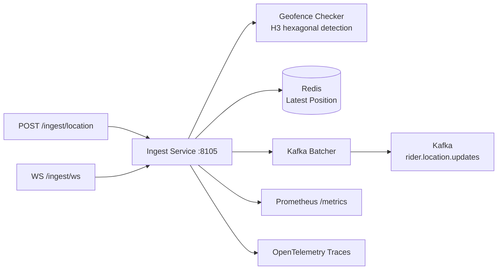
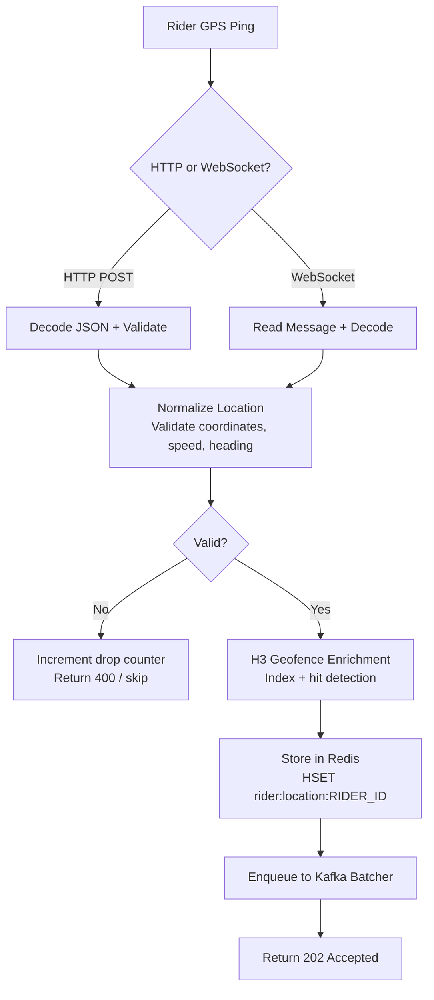
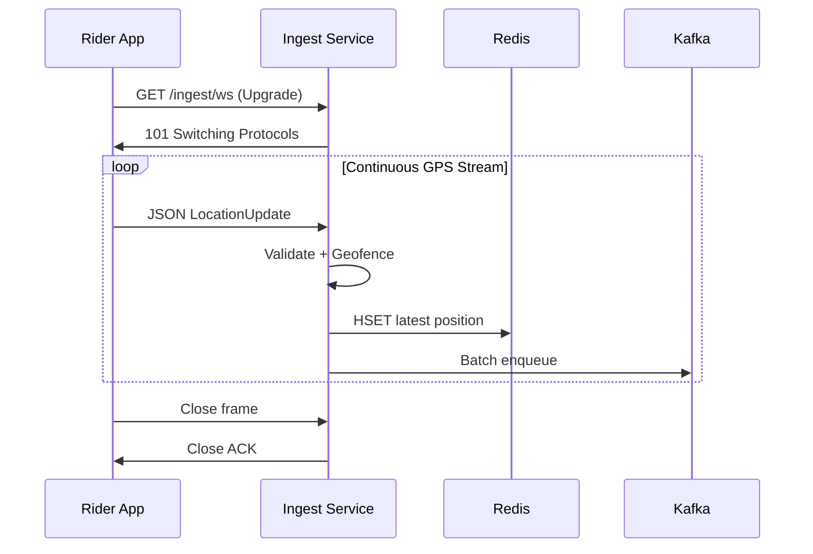
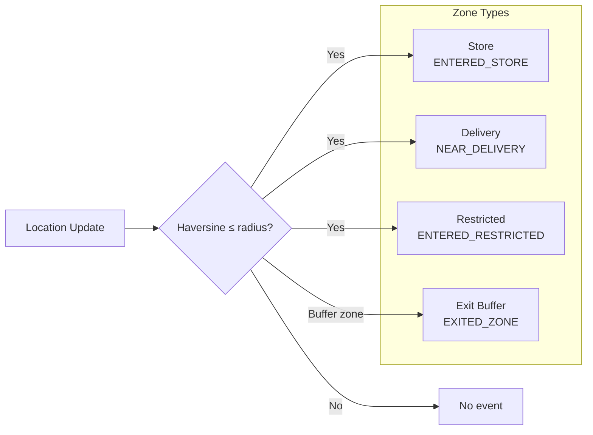
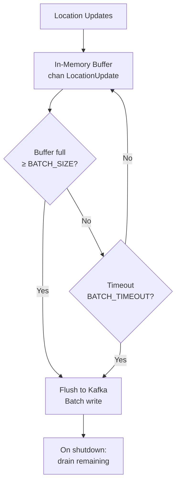

# Location Ingestion Service

> **Go · Real-Time Rider GPS Ingestion via HTTP & WebSocket**

High-throughput GPS ingestion pipeline that accepts rider location updates over HTTP and WebSocket, validates and enriches them with H3 geofence data, stores the latest position in Redis for sub-millisecond dispatch queries, and batches updates to Kafka for downstream analytics.

## Architecture



## GPS Ingestion Flow



## WebSocket Connection Lifecycle



## Geofence Detection



## Kafka Batching



## Project Structure

```
location-ingestion-service/
├── main.go                 # HTTP/WS server, config, batcher, Redis, tracing
├── handler/
│   ├── location.go         # LocationHandler — HTTP POST + WebSocket handlers
│   ├── geofence.go         # GeofenceChecker — H3-based zone detection
│   └── batcher.go          # LocationBatcher — time/size-based Kafka batching
├── store/
│   └── redis.go            # LatestPositionStore — Redis persistence + GetNearby
├── Dockerfile
└── go.mod
```

## API Reference

### `POST /ingest/location`

Accepts a single GPS update.

**Request:**
```json
{
  "rider_id": "rider-42",
  "lat": 12.9716,
  "lng": 77.5946,
  "timestamp": 1704067200000,
  "speed": 25.5,
  "heading": 180.0,
  "accuracy": 5.0
}
```

**Response:** `202 Accepted`
```json
{ "status": "accepted" }
```

### `GET /ingest/ws`

WebSocket endpoint for continuous GPS streaming. Send JSON `LocationUpdate` messages; no response per message.

### `GET /health` · `GET /health/live`

Returns `{"status":"ok"}`.

### `GET /ready` · `GET /health/ready`

Checks Redis and Kafka connectivity. Returns component-level status.

### `GET /metrics`

Prometheus metrics endpoint.

## Configuration

| Variable | Default | Description |
|---|---|---|
| `PORT` / `SERVER_PORT` | `8105` | HTTP listen port |
| `KAFKA_BROKERS` | — | Comma-separated Kafka broker list |
| `KAFKA_TOPIC` | `rider.location.updates` | Kafka destination topic |
| `KAFKA_BATCH_SIZE` | `200` | Messages per Kafka batch write |
| `KAFKA_BATCH_TIMEOUT` | `1s` | Max wait before flushing batch |
| `KAFKA_WRITE_TIMEOUT` | `5s` | Kafka write timeout |
| `KAFKA_BUFFER` | `2000` | In-memory channel buffer size |
| `REDIS_ADDR` | `localhost:6379` | Redis address |
| `REDIS_PASSWORD` | — | Redis password |
| `REDIS_DB` | `0` | Redis database index |
| `REDIS_KEY_PREFIX` | `rider:location:` | Redis key prefix for latest positions |
| `REDIS_TTL` | — | Key TTL (rider goes offline after expiry) |
| `H3_RESOLUTION` | `0` (disabled) | H3 resolution for geofence (9 ≈ 174m hexagons) |
| `MAX_BODY_BYTES` | `1048576` | Max HTTP request body size |
| `WS_READ_LIMIT` | `1048576` | WebSocket max message size |
| `SHUTDOWN_TIMEOUT` | `15s` | Graceful shutdown timeout |
| `PROCESS_TIMEOUT` | `3s` | Per-update processing timeout |
| `LOG_LEVEL` | `info` | Log level |

## Key Metrics

| Metric | Type | Description |
|---|---|---|
| `location_ingestion_ingest_total` | Counter | Accepted updates by source (`http`/`websocket`) |
| `location_ingestion_drop_total` | Counter | Dropped updates by source and reason |
| `location_ingestion_latency_seconds` | Histogram | Processing latency by source |
| `location_handler_updates_received_total` | Counter | Raw updates received (handler layer) |
| `location_handler_process_latency_seconds` | Histogram | Handler-level processing latency |

## Redis Data Model

- **Key:** `rider:{rider_id}:location`
- **Type:** JSON string (or Hash in main.go variant)
- **TTL:** Configurable; rider considered offline after expiry (default 5 min in store)
- **Fields:** `lat`, `lng`, `timestamp_ms`, `speed`, `heading`, `accuracy`, `h3_index`

## Build & Run

```bash
# Local
go build -o location-ingestion .
KAFKA_BROKERS="localhost:9092" REDIS_ADDR="localhost:6379" ./location-ingestion

# Docker
docker build -t location-ingestion-service .
docker run -e KAFKA_BROKERS="..." -e REDIS_ADDR="..." -p 8105:8105 location-ingestion-service
```

## Dependencies

- Go 1.22+
- `github.com/gorilla/websocket` (WebSocket support)
- `github.com/redis/go-redis/v9` (Redis client)
- `github.com/segmentio/kafka-go` (Kafka producer)
- `github.com/prometheus/client_golang` (metrics)
- OpenTelemetry SDK + OTLP gRPC exporter
