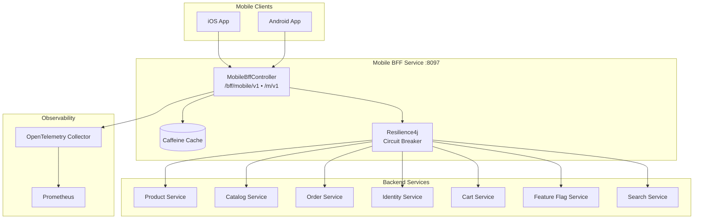
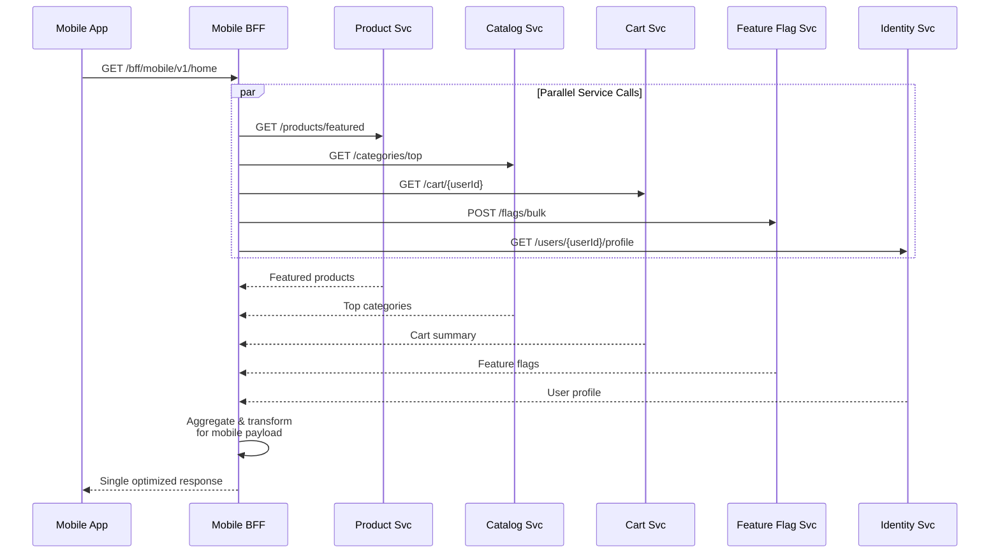
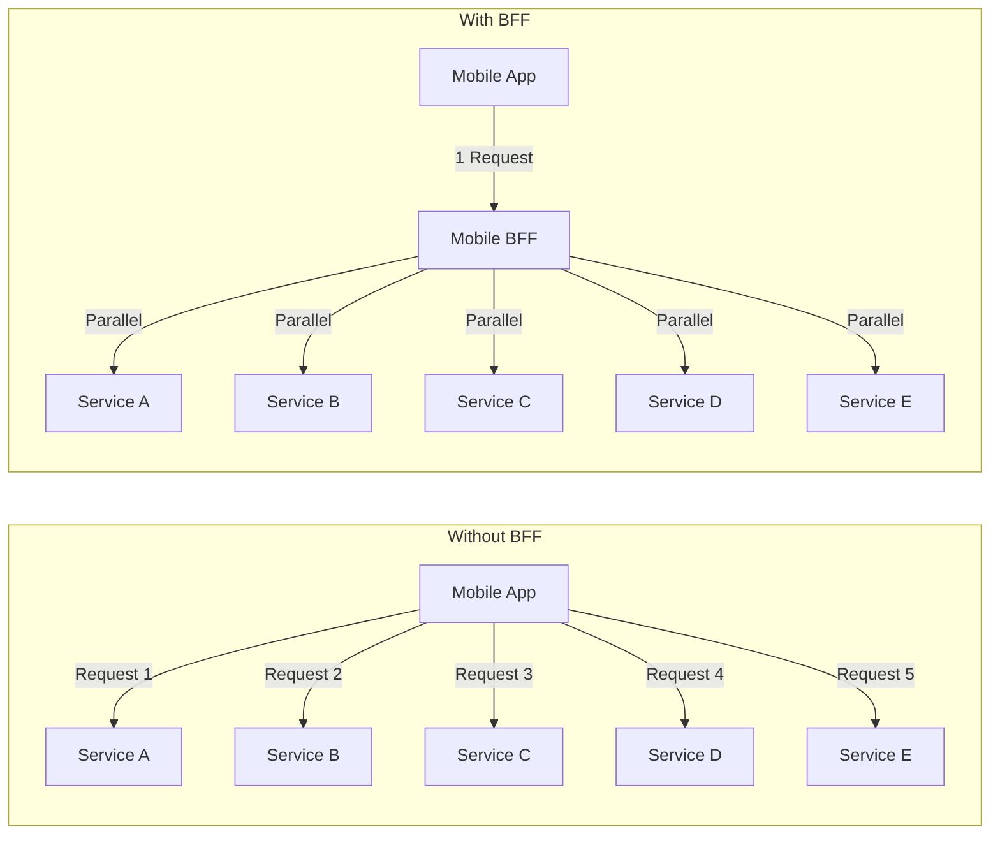
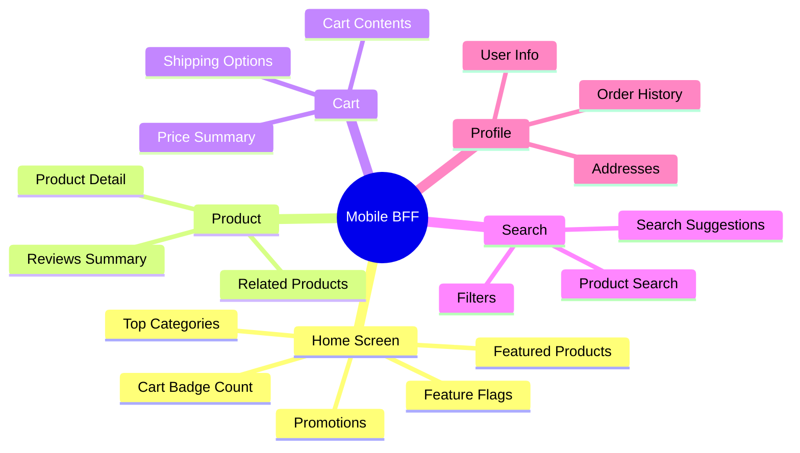
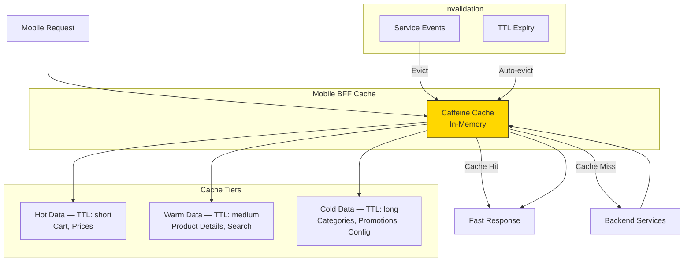

# Mobile BFF Service

Backend-For-Frontend (BFF) service providing mobile-optimized API aggregation for the InstaCommerce mobile app. Aggregates data from multiple backend microservices into single, efficient responses tailored for mobile consumption using reactive (WebFlux) non-blocking I/O.

## Table of Contents

- [Architecture Overview](#architecture-overview)
- [Key Components](#key-components)
- [Aggregation Pattern](#aggregation-pattern)
- [Supported Mobile Endpoints](#supported-mobile-endpoints)
- [Caching Strategy](#caching-strategy)
- [API Reference](#api-reference)
- [Configuration](#configuration)

---

## Architecture Overview



---

## Key Components

| Component | Responsibility |
|---|---|
| **MobileBffController** | Mobile-facing API layer — exposes aggregated endpoints at `/bff/mobile/v1` and `/m/v1` (short alias) |
| **Caffeine Cache** | In-memory caching for frequently accessed, slow-changing data (categories, promotions) |
| **Resilience4j Circuit Breaker** | Protects against backend service failures with fallback responses |
| **WebFlux Reactive Stack** | Non-blocking I/O for parallel service calls and efficient mobile response times |

---

## Aggregation Pattern



### Why BFF?



**Benefits:**
- **Fewer round trips** — One mobile request instead of 5+ separate API calls
- **Lower latency** — Parallel server-side calls over fast internal network
- **Battery & data savings** — Reduced connection overhead on mobile
- **Mobile-shaped payloads** — Only fields the mobile app needs, no over-fetching
- **Backend isolation** — Mobile app decoupled from service topology changes

---

## Supported Mobile Endpoints



---

## Caching Strategy



| Data Category | Cache Strategy | Rationale |
|---|---|---|
| Categories & Navigation | Long TTL | Changes infrequently, used on every screen |
| Product Listings | Medium TTL | Moderate change rate, high read frequency |
| Cart & Prices | Short TTL / No cache | Must be fresh for checkout accuracy |
| Feature Flags | Short TTL | Flags cached upstream in Feature Flag Service |
| User Profile | Per-session | User-specific, cached for session duration |

**Implementation:**
- Cache type: **Caffeine** (configured via Spring Cache abstraction)
- Dependency: `com.github.ben-manes.caffeine:caffeine:3.1.8`
- Circuit breaker: **Resilience4j** — returns cached/fallback data when backend services are degraded

---

## API Reference

### Mobile Endpoints

Both path prefixes are equivalent — `/m/v1` is a short alias for `/bff/mobile/v1`.

| Method | Endpoint | Description |
|---|---|---|
| `GET` | `/bff/mobile/v1/home` | Home screen aggregated data |
| `GET` | `/m/v1/home` | Home screen (short alias) |

### Home Response

**GET /bff/mobile/v1/home**

```json
{
  "status": "ok"
}
```

### Actuator Endpoints

| Method | Endpoint | Description |
|---|---|---|
| `GET` | `/actuator/health/liveness` | Kubernetes liveness probe |
| `GET` | `/actuator/health/readiness` | Kubernetes readiness probe |
| `GET` | `/actuator/prometheus` | Prometheus metrics scrape endpoint |
| `GET` | `/actuator/info` | Application info |

### Error Responses

| Status | Description |
|---|---|
| `401` | Missing or invalid authentication |
| `502` | One or more backend services unavailable |
| `504` | Backend service timeout |

---

## Configuration

### application.yml

```yaml
server:
  port: ${SERVER_PORT:8097}
  shutdown: graceful

spring:
  application:
    name: mobile-bff-service
  cache:
    type: caffeine
  lifecycle:
    timeout-per-shutdown-phase: 30s

internal:
  service:
    token: ${INTERNAL_SERVICE_TOKEN:dev-internal-token-change-in-prod}

management:
  endpoints:
    web:
      exposure:
        include: health,info,prometheus
  endpoint:
    health:
      probes:
        enabled: true
  tracing:
    sampling:
      probability: ${TRACING_PROBABILITY:1.0}
  otlp:
    tracing:
      endpoint: ${OTEL_EXPORTER_OTLP_TRACES_ENDPOINT:http://otel-collector.monitoring:4318/v1/traces}
    metrics:
      export:
        endpoint: ${OTEL_EXPORTER_OTLP_METRICS_ENDPOINT:http://otel-collector.monitoring:4318/v1/metrics}
```

### Environment Variables

| Variable | Default | Description |
|---|---|---|
| `SERVER_PORT` | `8097` | HTTP server port |
| `INTERNAL_SERVICE_TOKEN` | `dev-internal-token-change-in-prod` | Token for inter-service authentication |
| `OTEL_EXPORTER_OTLP_TRACES_ENDPOINT` | `http://otel-collector.monitoring:4318/v1/traces` | OpenTelemetry traces endpoint |
| `OTEL_EXPORTER_OTLP_METRICS_ENDPOINT` | `http://otel-collector.monitoring:4318/v1/metrics` | OpenTelemetry metrics endpoint |
| `TRACING_PROBABILITY` | `1.0` | Trace sampling probability (0.0–1.0) |
| `ENVIRONMENT` | `dev` | Deployment environment tag |

### Tech Stack

- Java 21, Spring Boot 3.x (WebFlux)
- Reactive stack (Project Reactor / `Mono<T>`)
- Caffeine Cache
- Resilience4j (Circuit Breaker)
- Micrometer + OpenTelemetry + Prometheus
- ZGC garbage collector
- Docker (Alpine, non-root user)
- Kubernetes health probes (liveness/readiness)
