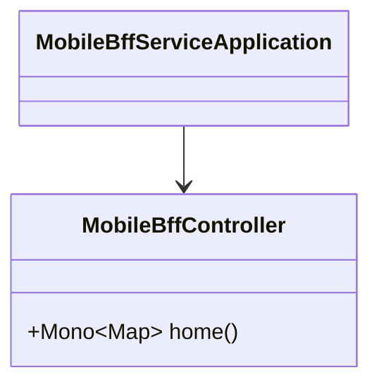
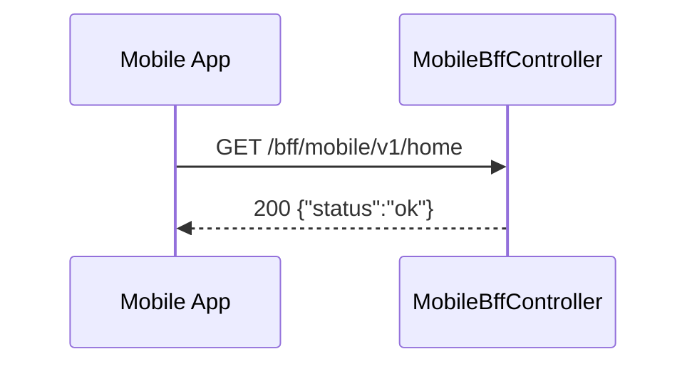
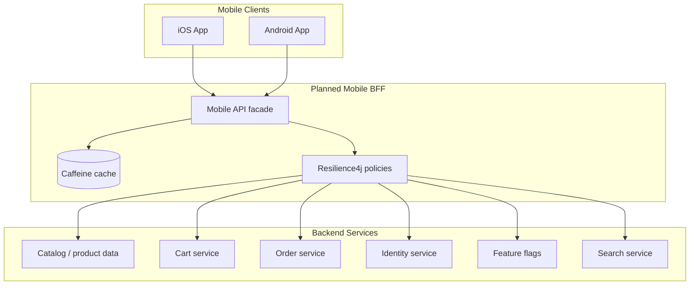
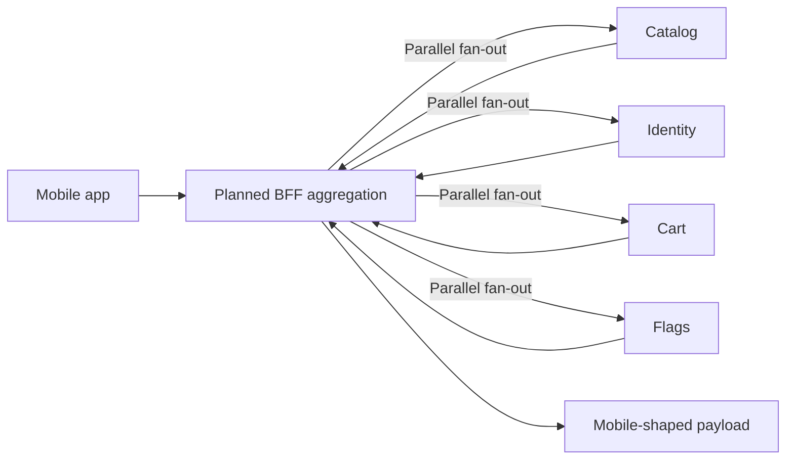

# Mobile BFF Service

Mobile-facing edge service for InstaCommerce. **Current state:** this service is
still a scaffold. The only implemented business endpoint is
`GET /bff/mobile/v1/home` (also aliased as `/m/v1/home`), which returns a stub
payload. The repository already carries the dependencies for a richer reactive
aggregation layer, but no downstream clients, cache usage, or resilience rules
are wired yet.

## Current-State Summary

| Area | Current implementation | Target state |
|------|------------------------|--------------|
| Endpoints | `GET /bff/mobile/v1/home` + actuator | Aggregated mobile APIs for home, product, cart, search, profile |
| Backend integration | None | Parallel calls into product, catalog, cart, identity, flags, and search |
| Caching | Dependency present only (`spring.cache.type: caffeine`) | Screen-aware caching with TTLs and invalidation hooks |
| Resilience | Dependency present only (`resilience4j-spring-boot3`) | Circuit breakers, fallback payloads, and timeout budgets |
| Tests | No test classes yet | Controller, aggregation, and contract coverage |

## Current Architecture (HLD)

```mermaid
graph TB
    subgraph Clients
        IOS[iOS App]
        ANDROID[Android App]
    end

    subgraph Mobile BFF Service :8097
        CTRL[MobileBffController]
        APP[MobileBffServiceApplication]
        ACT[Actuator + OTEL + Prometheus]
    end

    IOS --> CTRL
    ANDROID --> CTRL
    CTRL -->|Mono.just({"status":"ok"})| IOS
    CTRL --> ACT
    APP --> CTRL
```

## Current UML Snapshot (LLD)



## Current Request Flow



## Target Architecture (Planned, not yet implemented)

The following diagrams describe the **intended** BFF role once service
aggregation is built. They are not a statement of current runtime behavior.





## API Reference

### Implemented Endpoints

Both path prefixes are equivalent — `/m/v1` is a short alias for
`/bff/mobile/v1`.

| Method | Endpoint | Description | Response |
|--------|----------|-------------|----------|
| `GET` | `/bff/mobile/v1/home` | Current stub home endpoint | `{"status":"ok"}` |
| `GET` | `/m/v1/home` | Short alias for the same stub | `{"status":"ok"}` |

### Actuator Endpoints

| Method | Endpoint | Description |
|--------|----------|-------------|
| `GET` | `/actuator/health/liveness` | Kubernetes liveness probe |
| `GET` | `/actuator/health/readiness` | Kubernetes readiness probe |
| `GET` | `/actuator/prometheus` | Prometheus scrape endpoint |
| `GET` | `/actuator/info` | Application metadata |
| `GET` | `/actuator/metrics` | Micrometer metrics catalog |

## Configuration

### Runtime configuration

```yaml
server:
  port: ${SERVER_PORT:8097}
  shutdown: graceful

spring:
  application:
    name: mobile-bff-service
  config:
    import: optional:sm://
  lifecycle:
    timeout-per-shutdown-phase: 30s
  cache:
    type: caffeine

management:
  tracing:
    sampling:
      probability: ${TRACING_PROBABILITY:1.0}
  otlp:
    tracing:
      endpoint: ${OTEL_EXPORTER_OTLP_TRACES_ENDPOINT:http://otel-collector.monitoring:4318/v1/traces}
    metrics:
      endpoint: ${OTEL_EXPORTER_OTLP_METRICS_ENDPOINT:http://otel-collector.monitoring:4318/v1/metrics}
  metrics:
    tags:
      service: ${spring.application.name}
      environment: ${ENVIRONMENT:dev}
    export:
      prometheus:
        enabled: true
  endpoints:
    web:
      exposure:
        include: health,info,prometheus,metrics
  endpoint:
    health:
      probes:
        enabled: true
      show-details: always
      group:
        readiness:
          include: readinessState
        liveness:
          include: livenessState

internal:
  service:
    name: ${spring.application.name}
    token: ${INTERNAL_SERVICE_TOKEN:dev-internal-token-change-in-prod}
```

### Environment variables

| Variable | Default | Description |
|----------|---------|-------------|
| `SERVER_PORT` | `8097` | HTTP server port |
| `INTERNAL_SERVICE_TOKEN` | `dev-internal-token-change-in-prod` | Shared internal token placeholder for future service-to-service calls |
| `OTEL_EXPORTER_OTLP_TRACES_ENDPOINT` | `http://otel-collector.monitoring:4318/v1/traces` | OTLP traces endpoint |
| `OTEL_EXPORTER_OTLP_METRICS_ENDPOINT` | `http://otel-collector.monitoring:4318/v1/metrics` | OTLP metrics endpoint |
| `TRACING_PROBABILITY` | `1.0` | Trace sampling probability |
| `ENVIRONMENT` | `dev` | Metrics/environment tag |

## Local Development

### Build and run

```bash
# From the repository root
./gradlew :services:mobile-bff-service:bootRun
```

### Docker image

The service ships with a Java 21 / Alpine multi-stage Dockerfile:

- runtime port: `8097`
- non-root user: `app`
- healthcheck: `/actuator/health/liveness`
- JVM posture: `-XX:MaxRAMPercentage=75.0`, `-XX:+UseZGC`

## Deployment Notes

The Helm values currently configure this service as a lightweight edge stub:

| Environment | Replicas | HPA | Resource requests | Resource limits |
|-------------|----------|-----|-------------------|-----------------|
| `values.yaml` | 2 | 2-8 pods @ 70% CPU | `250m / 384Mi` | `500m / 768Mi` |
| `values-dev.yaml` | tag only | inherits base | inherits base | inherits base |
| `values-prod.yaml` | 2 | inherits base | inherits base | inherits base |

## Testing Status

- `spring-boot-starter-test` and `reactor-test` are present in `build.gradle.kts`
- no `src/test` classes exist yet
- before turning this into a real aggregator, add controller tests, downstream
  contract tests, and timeout/fallback coverage

## Known Gaps

1. No downstream service clients are implemented.
2. Caffeine and Resilience4j are configured as dependencies but unused.
3. No authentication or authorization layer is implemented beyond the future
   internal token placeholder in configuration.
4. No deployment/runbook-specific troubleshooting guidance exists yet because
   the service does not own live aggregation logic today.
