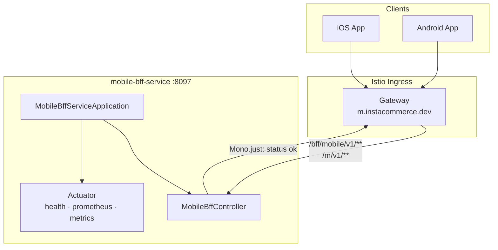
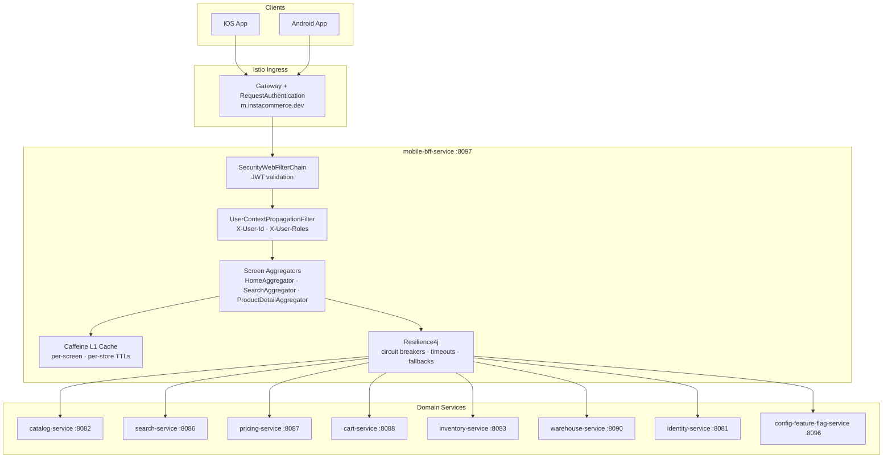
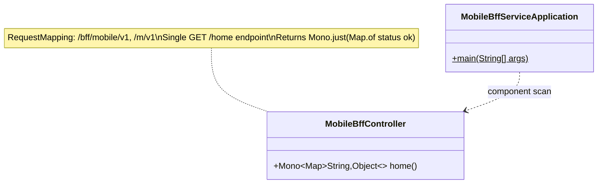
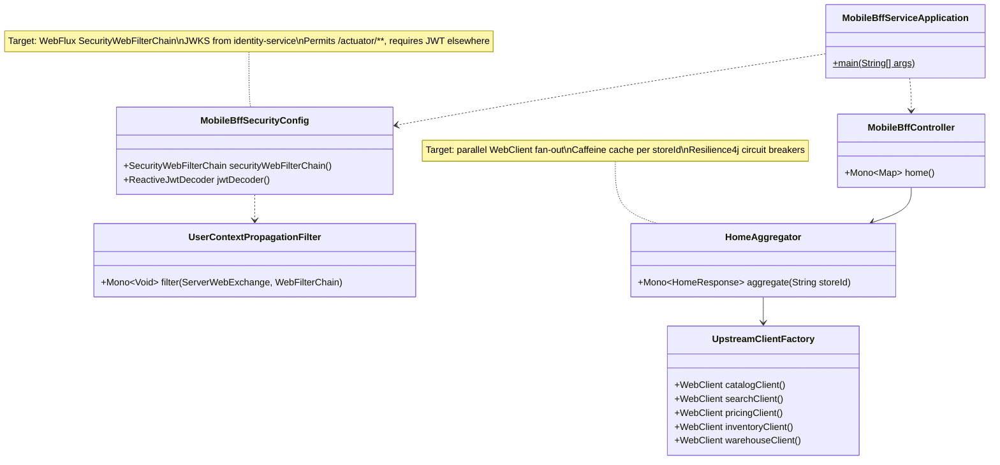
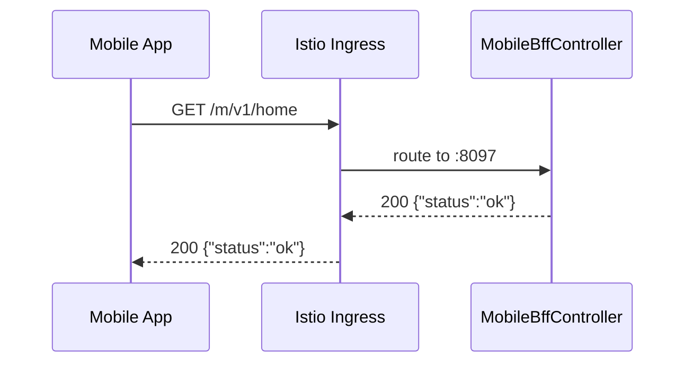
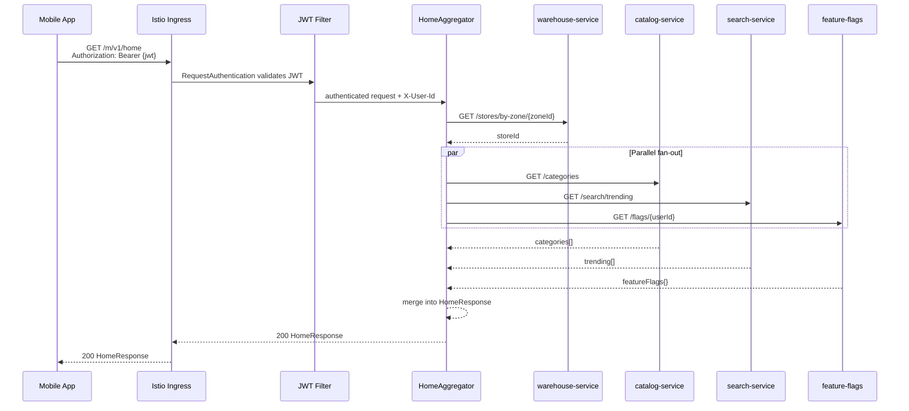
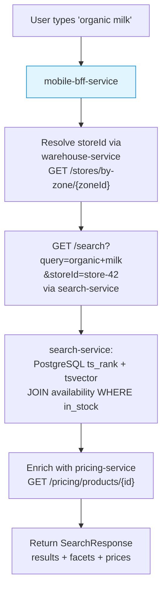

# Mobile BFF Service

> **Owner:** `@instacommerce/mobile-team`
> ([`docs/reviews/iter3/platform/repo-truth-ownership.md`](../../docs/reviews/iter3/platform/repo-truth-ownership.md))
> · **Port:** 8097 · **Stack:** Spring Boot 3 / WebFlux (Reactor) / Java 21
> · **SLO target:** 99.95 % HTTP availability, 30-day window
> ([SLO-15](../../docs/reviews/iter3/platform/observability-sre.md))

Mobile-facing **Backend-for-Frontend** (BFF) for InstaCommerce. This service
sits behind Istio ingress on `m.instacommerce.dev` and is designed to aggregate
parallel upstream responses into mobile-shaped payloads. It is the single point
of entry for iOS and Android clients in the InstaCommerce architecture.

**Current state:** the service is a **scaffold**. The only implemented business
endpoint is `GET /bff/mobile/v1/home` (aliased as `/m/v1/home`), which returns
`{"status":"ok"}`. Dependencies for reactive aggregation (WebFlux), caching
(Caffeine), resilience (Resilience4j), and observability (OTEL + Prometheus)
are wired in `build.gradle.kts` and `application.yml` but **none are exercised
by application code today**. No downstream service clients, security filters,
or cache policies exist in the codebase.

---

## Table of Contents

1. [Service Role and Boundaries](#1-service-role-and-boundaries)
2. [Current State vs Target State](#2-current-state-vs-target-state)
3. [High-Level Design (HLD)](#3-high-level-design-hld)
4. [Low-Level Design (LLD)](#4-low-level-design-lld)
5. [Request Composition Flows](#5-request-composition-flows)
6. [API Reference](#6-api-reference)
7. [Runtime and Configuration](#7-runtime-and-configuration)
8. [Dependencies](#8-dependencies)
9. [Observability](#9-observability)
10. [Testing](#10-testing)
11. [Failure Modes](#11-failure-modes)
12. [Deployment, Rollout, and Rollback](#12-deployment-rollout-and-rollback)
13. [Known Limitations and Open Issues](#13-known-limitations-and-open-issues)
14. [Industry Context: Q-Commerce BFF Patterns](#14-industry-context-q-commerce-bff-patterns)
15. [Related Documentation](#15-related-documentation)

---

## 1. Service Role and Boundaries

The mobile-bff-service belongs to the **Edge Layer** (cluster C1) alongside
`identity-service` and `admin-gateway-service`
([edge-identity review](../../docs/reviews/iter3/services/edge-identity.md) §2).

**Responsibilities (target):**

| Responsibility | Details |
|----------------|---------|
| Screen-level aggregation | Fan out to catalog, search, pricing, inventory, cart, identity, feature-flags; merge into a single mobile-shaped response per screen |
| Store-zone resolution | Resolve the user's delivery address to a `storeId` via `warehouse-service` before querying inventory and pricing |
| Auth boundary enforcement | Validate customer JWTs (RS256, issuer `instacommerce-identity`) and propagate `X-User-Id` / `X-User-Roles` headers downstream |
| Resilience shaping | Apply per-upstream circuit breakers, timeout budgets, and degraded-payload fallbacks |
| Response caching | Caffeine L1 cache keyed per screen/store with TTLs aligned to data freshness contracts |
| Observability fan-in | Emit OTEL traces spanning the full fan-out/merge cycle; expose Prometheus metrics |

**Explicit non-responsibilities:**

- Does **not** own any database.
- Does **not** perform writes to domain services (cart mutations, orders,
  payments flow through domain APIs directly or via checkout-orchestrator).
- Does **not** duplicate catalog search logic — delegates to `search-service`.
- Does **not** manage tokens — delegates to `identity-service`.

---

## 2. Current State vs Target State

| Area | Current (checked-in code) | Target (per iter3 reviews) |
|------|---------------------------|----------------------------|
| **Endpoints** | `GET /bff/mobile/v1/home` → `Mono.just(Map.of("status","ok"))` | Aggregated mobile APIs: home, category, search, product detail, cart summary, profile |
| **Backend integration** | Zero downstream calls | Parallel WebClient calls to catalog, search, pricing, inventory, warehouse, cart, identity, feature-flags |
| **Security** | No `SecurityFilterChain`, no JWT filter | WebFlux `SecurityWebFilterChain` with `spring-boot-starter-oauth2-resource-server`, JWKS validation against identity-service |
| **Caching** | `spring.cache.type: caffeine` configured, zero `@Cacheable` usage | Screen-aware Caffeine caches with per-upstream TTLs and `@CacheEvict` hooks |
| **Resilience** | `resilience4j-spring-boot3` dependency, zero configuration instances | Per-upstream circuit breakers, rate limiters, and timeout budgets with degraded fallback payloads |
| **Tests** | `spring-boot-starter-test` + `reactor-test` in build.gradle.kts; no test classes | Controller, aggregation, contract, circuit-breaker, and timeout coverage |
| **Istio policy** | VirtualService routes `/bff/mobile/v1` and `/m/v1` to this service | Add `RequestAuthentication` + `AuthorizationPolicy` (currently missing per [security-trust-boundaries §G10](../../docs/reviews/iter3/platform/security-trust-boundaries.md)) |

---

## 3. High-Level Design (HLD)

### 3.1 Current Architecture — Scaffold

The checked-in codebase has two Java classes and no runtime integrations.



### 3.2 Target Architecture — Aggregation BFF

The following diagram describes the **intended** architecture once aggregation,
security, and resilience are implemented per
[edge-identity §7](../../docs/reviews/iter3/services/edge-identity.md) and
[browse-search-discovery](../../docs/reviews/iter3/diagrams/lld/browse-search-discovery.md).



---

## 4. Low-Level Design (LLD)

### 4.1 Current Component Model



### 4.2 Target Component Model

Per [edge-identity §7.2–7.3](../../docs/reviews/iter3/services/edge-identity.md)
and [browse-search-discovery §8](../../docs/reviews/iter3/diagrams/lld/browse-search-discovery.md),
the target LLD adds security, propagation, client, and aggregation layers.



---

## 5. Request Composition Flows

### 5.1 Current Flow — Stub



### 5.2 Target Flow — Home Screen Aggregation

Per [browse-search-discovery §1.2 journey J1](../../docs/reviews/iter3/diagrams/lld/browse-search-discovery.md),
the home screen is a parallel fan-out with p99 < 100 ms target latency.



### 5.3 Target Flow — Product Search with Store Resolution

Per [browse-search-discovery §8.3](../../docs/reviews/iter3/diagrams/lld/browse-search-discovery.md),
search resolves a `storeId` from the delivery address before querying.



---

## 6. API Reference

### 6.1 Implemented Endpoints

Both path prefixes are equivalent — `/m/v1` is a short alias for
`/bff/mobile/v1`. Both are registered via `@RequestMapping` on
[`MobileBffController.java`](src/main/java/com/instacommerce/mobilebff/controller/MobileBffController.java).

| Method | Endpoint | Description | Response |
|--------|----------|-------------|----------|
| `GET` | `/bff/mobile/v1/home` | Stub home endpoint | `{"status":"ok"}` |
| `GET` | `/m/v1/home` | Short alias | `{"status":"ok"}` |

### 6.2 Actuator / Operational Endpoints

| Method | Endpoint | Description |
|--------|----------|-------------|
| `GET` | `/actuator/health/liveness` | Kubernetes liveness probe |
| `GET` | `/actuator/health/readiness` | Kubernetes readiness probe |
| `GET` | `/actuator/prometheus` | Prometheus scrape endpoint |
| `GET` | `/actuator/info` | Application metadata |
| `GET` | `/actuator/metrics` | Micrometer metrics catalog |

### 6.3 Target Endpoints (planned, not implemented)

Per iter3 review documents
([browse-search-discovery §1.2](../../docs/reviews/iter3/diagrams/lld/browse-search-discovery.md),
[lld-edge-checkout §2](../../docs/reviews/iter3/diagrams/lld-edge-checkout.md)):

| Method | Endpoint | Upstream fan-out | Latency target |
|--------|----------|-----------------|---------------|
| `GET` | `/m/v1/home` | catalog + search (trending) + feature-flags | p99 < 100 ms |
| `GET` | `/m/v1/categories/{id}` | search + inventory | p99 < 150 ms |
| `GET` | `/m/v1/search` | warehouse (store resolution) + search + pricing | p99 < 200 ms |
| `GET` | `/m/v1/search/autocomplete` | search | p99 < 80 ms |
| `GET` | `/m/v1/products/{id}` | catalog + pricing + inventory | p99 < 150 ms |
| `POST` | `/m/v1/auth/login` | identity (proxy) | — |
| `POST` | `/m/v1/checkout` | checkout-orchestrator (proxy) | — |

---

## 7. Runtime and Configuration

### 7.1 `application.yml` (checked-in)

Source: [`src/main/resources/application.yml`](src/main/resources/application.yml)

```yaml
server:
  port: ${SERVER_PORT:8097}
  shutdown: graceful

spring:
  application:
    name: mobile-bff-service
  config:
    import: optional:sm://          # GCP Secret Manager integration
  lifecycle:
    timeout-per-shutdown-phase: 30s
  cache:
    type: caffeine                  # Dependency wired, no caches defined

management:
  tracing:
    sampling:
      probability: ${TRACING_PROBABILITY:1.0}
  otlp:
    tracing:
      endpoint: ${OTEL_EXPORTER_OTLP_TRACES_ENDPOINT:http://otel-collector.monitoring:4318/v1/traces}
    metrics:
      endpoint: ${OTEL_EXPORTER_OTLP_METRICS_ENDPOINT:http://otel-collector.monitoring:4318/v1/metrics}
  metrics:
    tags:
      service: ${spring.application.name}
      environment: ${ENVIRONMENT:dev}
    export:
      prometheus:
        enabled: true
  endpoints:
    web:
      exposure:
        include: health,info,prometheus,metrics
  endpoint:
    health:
      probes:
        enabled: true
      show-details: always
      group:
        readiness:
          include: readinessState
        liveness:
          include: livenessState
  health:
    livenessstate:
      enabled: true
    readinessstate:
      enabled: true

internal:
  service:
    name: ${spring.application.name}
    token: ${INTERNAL_SERVICE_TOKEN:dev-internal-token-change-in-prod}
```

### 7.2 Environment Variables

| Variable | Default | Description |
|----------|---------|-------------|
| `SERVER_PORT` | `8097` | HTTP listen port |
| `INTERNAL_SERVICE_TOKEN` | `dev-internal-token-change-in-prod` | Placeholder for future `X-Internal-Token` header (not enforced today) |
| `OTEL_EXPORTER_OTLP_TRACES_ENDPOINT` | `http://otel-collector.monitoring:4318/v1/traces` | OTLP traces collector |
| `OTEL_EXPORTER_OTLP_METRICS_ENDPOINT` | `http://otel-collector.monitoring:4318/v1/metrics` | OTLP metrics collector |
| `TRACING_PROBABILITY` | `1.0` | Trace sampling probability (1.0 = all requests) |
| `ENVIRONMENT` | `dev` | Metric tag for environment |
| `SPRING_PROFILES_ACTIVE` | — | Set to `gcp` in Helm values for deployed environments |

### 7.3 GCP Secret Manager

`spring.config.import: optional:sm://` enables optional pull of secrets at
startup. Currently no secrets are referenced by application code. Target state
adds `IDENTITY_JWKS_URI` and per-upstream service URLs.

---

## 8. Dependencies

### 8.1 Build Dependencies (`build.gradle.kts`)

| Dependency | Purpose | Actually used? |
|------------|---------|---------------|
| `spring-boot-starter-webflux` | Reactive HTTP server (Netty) + WebClient | **Yes** — controller returns `Mono` |
| `spring-boot-starter-validation` | Bean validation | **No** — no `@Valid` annotations |
| `spring-boot-starter-actuator` | Health, metrics, info endpoints | **Yes** — exposed at `/actuator/**` |
| `spring-boot-starter-cache` | Cache abstraction | **Configured** (`caffeine` type) but no caches defined |
| `resilience4j-spring-boot3` (2.2.0) | Circuit breakers, rate limiters | **No** — no instances configured |
| `caffeine` (3.1.8) | In-process cache engine | **No** — backing engine present, no caches |
| `micrometer-tracing-bridge-otel` | OTEL trace bridge | **Yes** — auto-configured via actuator |
| `micrometer-registry-otlp` | OTLP metric export | **Yes** — `management.otlp.metrics` configured |
| `micrometer-registry-prometheus` | Prometheus scrape | **Yes** — `/actuator/prometheus` exposed |
| `logstash-logback-encoder` (7.4) | JSON-structured logs | **Yes** — on classpath, auto-configured |
| `spring-boot-starter-test` (test) | JUnit 5 test support | **Present** — no test classes exist |
| `reactor-test` (test) | `StepVerifier` for reactive testing | **Present** — no test classes exist |

### 8.2 Upstream Service Dependencies (target)

Per the iter3 browse/checkout LLDs, once aggregation is built:

| Service | Call pattern | Protocol |
|---------|-------------|----------|
| `catalog-service` (:8082) | `GET /products/{id}`, `GET /categories` | HTTP/REST |
| `search-service` (:8086) | `GET /search`, `GET /search/autocomplete`, `GET /search/trending` | HTTP/REST |
| `pricing-service` (:8087) | `GET /pricing/products/{id}` | HTTP/REST |
| `inventory-service` (:8083) | `GET /inventory/{productId}/store/{storeId}` | HTTP/REST |
| `warehouse-service` (:8090) | `GET /stores/by-zone/{zoneId}` | HTTP/REST |
| `cart-service` (:8088) | `GET/POST/PUT/DELETE /carts` | HTTP/REST |
| `identity-service` (:8081) | JWKS at `/.well-known/jwks.json` | HTTP/REST |
| `config-feature-flag-service` (:8096) | `GET /flags/{userId}` | HTTP/REST |
| `checkout-orchestrator-service` (:8089) | `POST /checkout` | HTTP/REST (proxy) |

**Current state:** none of these clients are implemented.

### 8.3 Infrastructure Dependencies

| Component | Used by | Notes |
|-----------|---------|-------|
| Istio ingress gateway | Routing | Routes `/bff/mobile/v1` and `/m/v1` per `deploy/helm/values.yaml` |
| OTEL Collector | Traces + metrics | Default: `otel-collector.monitoring:4318` |
| GCP Secret Manager | Config | `optional:sm://` import |

---

## 9. Observability

### 9.1 What Is Wired Today

| Signal | Mechanism | Status |
|--------|-----------|--------|
| **Traces** | Micrometer OTEL bridge → OTLP exporter | Auto-instrumented on all WebFlux requests; sampling defaults to 100 % |
| **Metrics** | Micrometer → Prometheus registry + OTLP registry | HTTP server metrics, JVM metrics, Netty metrics exposed at `/actuator/prometheus` |
| **Structured logs** | logstash-logback-encoder (JSON) | On classpath, auto-configured |
| **Health probes** | Actuator liveness + readiness groups | Kubernetes probe-ready |

### 9.2 SLO

Per [observability-sre §3.1](../../docs/reviews/iter3/platform/observability-sre.md):

| SLO ID | Indicator | Target | Window | Error budget |
|--------|-----------|--------|--------|-------------|
| SLO-15 | HTTP availability | 99.95 % | 30 days | 21.6 min downtime |

### 9.3 Target Alerts (not yet configured)

Per [edge-identity §14](../../docs/reviews/iter3/services/edge-identity.md):

| Metric | Alert condition |
|--------|----------------|
| `mobile_bff_upstream_circuit_breaker_state` | OPEN state > 30 s |
| `http_server_requests_seconds{status=~"5.."}` | 5xx rate > 1 % over 5 min |
| Readiness probe failure | Pod not ready > 60 s |

---

## 10. Testing

### 10.1 Current State

- `spring-boot-starter-test` and `reactor-test` are on the test classpath.
- **No `src/test` directory or test classes exist.**
- JUnit Platform is configured in `build.gradle.kts` via
  `tasks.withType<Test> { useJUnitPlatform() }`.

### 10.2 Running Tests

```bash
# Build (from repo root)
./gradlew :services:mobile-bff-service:build -x test

# Run tests (currently a no-op — no test classes)
./gradlew :services:mobile-bff-service:test

# Run a specific test class (once tests exist)
./gradlew :services:mobile-bff-service:test --tests "com.instacommerce.mobilebff.SomeTest"
```

### 10.3 Target Test Coverage

Per [edge-identity §Wave 1 validation](../../docs/reviews/iter3/services/edge-identity.md):

| Category | What to test |
|----------|-------------|
| Controller / WebFlux | `WebTestClient` against `/m/v1/home` with valid JWT → 200; expired JWT → 401; missing JWT → 401 |
| Aggregation | `StepVerifier` for parallel fan-out; verify Mono.zip merges upstream responses correctly |
| Circuit breaker | Simulate upstream 5xx → verify circuit opens → verify fallback payload returned |
| Timeout | Simulate upstream latency > budget → verify timeout fires → degraded response |
| Contract | Verify upstream call shapes match service API contracts |

---

## 11. Failure Modes

### 11.1 Current Failure Surface

Since the service is a scaffold returning a static `Mono.just(...)`, the only
failure modes today are JVM/container-level:

| Failure | Impact | Mitigation |
|---------|--------|-----------|
| Pod OOM / crash | Liveness probe fails → Kubernetes restart | HPA min 2 replicas |
| Istio sidecar unavailable | Requests cannot route | PDB `maxUnavailable: 1` in Helm |

### 11.2 Target Failure Modes

Per [identity-edge-auth LLD §failure-modes](../../docs/reviews/iter3/diagrams/lld/identity-edge-auth.md):

| Failure | User impact | Detection | Mitigation |
|---------|-------------|-----------|-----------|
| **BFF pod down** | Mobile home screen fails | Readiness probe, HPA | Min 2 replicas; client-side retry; degraded UX |
| **identity-service JWKS unreachable** | All authenticated requests rejected (401) | Circuit breaker state metric | Cache JWKS locally with TTL; fallback to cached key |
| **catalog-service timeout** | Home screen missing categories | `http_client_requests_seconds` p99 spike | Circuit breaker opens; return cached/stale categories |
| **search-service down** | Search returns empty | Circuit breaker OPEN metric | Fallback: static trending list or empty with message |
| **Cascading fan-out failure** | All upstreams slow → BFF thread starvation | Request duration histogram | Per-upstream timeout budgets; partial response assembly |

---

## 12. Deployment, Rollout, and Rollback

### 12.1 Docker Image

Multi-stage build in [`Dockerfile`](Dockerfile):

| Property | Value |
|----------|-------|
| Build stage | `gradle:9.4-jdk21` |
| Runtime base | `eclipse-temurin:25-jre-alpine` |
| User | `app` (UID 1001, non-root) |
| Port | `8097` |
| Healthcheck | `wget -qO- http://localhost:8097/actuator/health/liveness` (30 s interval) |
| JVM flags | `-XX:MaxRAMPercentage=75.0 -XX:+UseZGC -Djava.security.egd=file:/dev/./urandom` |

### 12.2 Helm / Kubernetes

Source: [`deploy/helm/values.yaml`](../../deploy/helm/values.yaml),
[`values-dev.yaml`](../../deploy/helm/values-dev.yaml),
[`values-prod.yaml`](../../deploy/helm/values-prod.yaml).

| Property | `values.yaml` (base) | `values-dev.yaml` | `values-prod.yaml` |
|----------|---------------------|-------------------|--------------------|
| Replicas | 2 | inherits | 2 |
| HPA range | 2 – 8 @ 70 % CPU | inherits | inherits |
| CPU request / limit | 250m / 500m | inherits | inherits |
| Memory request / limit | 384Mi / 768Mi | inherits | inherits |
| Image tag | — | `dev` | `prod` |
| Image registry | `asia-south1-docker.pkg.dev/instacommerce/images` | `…/dev-images` | `…/prod-images` |
| PDB | `maxUnavailable: 1` | inherits | inherits |

Istio VirtualService routes (from `values.yaml`):

| Prefix | Destination |
|--------|-------------|
| `/bff/mobile/v1` | `mobile-bff-service:8097` |
| `/m/v1` | `mobile-bff-service:8097` |

### 12.3 CI

Defined in [`.github/workflows/ci.yml`](../../.github/workflows/ci.yml):

- Path filter: `services/mobile-bff-service/**`
- Build matrix: standard Java `build-test` job (Gradle build + test)
- Full validation runs on `main`/`master` push and includes this service

### 12.4 Rollout Strategy

As a stateless edge service with no database, rolling deploys are safe:

1. ArgoCD syncs new image tag from `values-dev.yaml` / `values-prod.yaml`
2. Kubernetes rolling update respects PDB (`maxUnavailable: 1`)
3. New pods must pass readiness probe (`/actuator/health/readiness`) before
   receiving traffic
4. Graceful shutdown (`timeout-per-shutdown-phase: 30s`) drains in-flight
   requests

### 12.5 Rollback

```bash
# Revert to previous Helm revision
helm rollback <release-name> <previous-revision> -n <namespace>

# Or revert the image tag in values-{env}.yaml and let ArgoCD sync
git revert <commit> && git push
```

No database migrations to worry about — this service is stateless.

---

## 13. Known Limitations and Open Issues

| # | Issue | Severity | Source |
|---|-------|----------|--------|
| 1 | **No security chain** — no `SecurityFilterChain`, no JWT validation. Requests pass through unauthenticated. | HIGH | [edge-identity §7](../../docs/reviews/iter3/services/edge-identity.md), [security-trust-boundaries §G10](../../docs/reviews/iter3/platform/security-trust-boundaries.md) |
| 2 | **No downstream service clients** — the service makes zero upstream calls. | HIGH | Codebase: only `Mono.just(Map.of("status","ok"))` |
| 3 | **Caffeine cache configured but unused** — `spring.cache.type: caffeine` is set, but no `@Cacheable` or cache names are defined. | MEDIUM | `application.yml`, no cache usage in code |
| 4 | **Resilience4j dependency unused** — no circuit breaker, rate limiter, or timeout instances are configured. | MEDIUM | `build.gradle.kts`, no `resilience4j.*` config |
| 5 | **No Istio RequestAuthentication** — unlike payment/order/checkout services, mobile-bff has no JWT validation policy at the mesh layer. | MEDIUM | `deploy/helm/values.yaml` `requestAuthentications` section |
| 6 | **`INTERNAL_SERVICE_TOKEN` not enforced** — env var is configured but no filter reads or validates it. | LOW | `application.yml` `internal.service.token` |
| 7 | **No test classes** — `src/test` does not exist. | MEDIUM | Codebase |
| 8 | **Pod-local rate limiting risk** — when rate limiting is added, it must be distributed (not Caffeine-based) to avoid bypass under multi-replica HPA. | — | [edge-identity §5](../../docs/reviews/iter3/services/edge-identity.md) |

**Planned remediation wave:** Wave 1 of the iter3 implementation program
([edge-identity §Wave 1](../../docs/reviews/iter3/services/edge-identity.md) —
"BFF and admin hardening," estimated 4–8 weeks).

---

## 14. Industry Context: Q-Commerce BFF Patterns

For context, leading q-commerce platforms use BFF layers with similar
responsibilities to the target design. Observations grounded in
[iter3 benchmarks](../../docs/reviews/iter3/benchmarks/):

- **Screen-level aggregation** is the standard BFF pattern in q-commerce mobile
  apps, reducing client round-trips over high-latency mobile networks. The
  mobile-bff-service's target of parallel fan-out with per-screen response
  shaping aligns with this norm.
- **ETA range presentation** — the
  [global-operator-patterns](../../docs/reviews/iter3/benchmarks/global-operator-patterns.md)
  review notes that returning `eta_low_minutes` / `eta_high_minutes` (p25/p75)
  instead of a single point estimate reduces support tickets when ETA drifts.
  This is a BFF-level response shaping concern.
- **Auth at the edge** is universal — every production BFF validates tokens
  before fan-out. The current scaffold's lack of any security chain is the
  highest-priority gap relative to industry practice.

---

## 15. Related Documentation

| Document | Relevance |
|----------|-----------|
| [`docs/reviews/iter3/services/edge-identity.md`](../../docs/reviews/iter3/services/edge-identity.md) | Primary implementation guide for BFF security chain (§7), wave plan (§Wave 1) |
| [`docs/reviews/iter3/diagrams/lld/identity-edge-auth.md`](../../docs/reviews/iter3/diagrams/lld/identity-edge-auth.md) | LLD for identity/edge auth request lifecycle, trust boundaries, failure modes |
| [`docs/reviews/iter3/diagrams/lld/browse-search-discovery.md`](../../docs/reviews/iter3/diagrams/lld/browse-search-discovery.md) | BFF aggregation patterns for search/browse flows, latency targets |
| [`docs/reviews/iter3/diagrams/lld-edge-checkout.md`](../../docs/reviews/iter3/diagrams/lld-edge-checkout.md) | End-to-end customer edge → checkout path through BFF |
| [`docs/reviews/iter3/platform/security-trust-boundaries.md`](../../docs/reviews/iter3/platform/security-trust-boundaries.md) | Gap G10: BFF has no security config class |
| [`docs/reviews/iter3/platform/observability-sre.md`](../../docs/reviews/iter3/platform/observability-sre.md) | SLO-15 definition for mobile-bff-service |
| [`docs/reviews/iter3/platform/repo-truth-ownership.md`](../../docs/reviews/iter3/platform/repo-truth-ownership.md) | CODEOWNERS and CI mapping |
