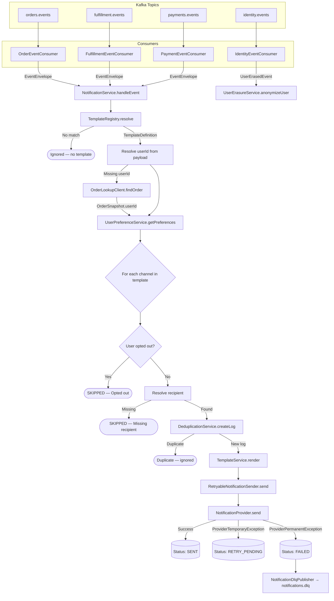
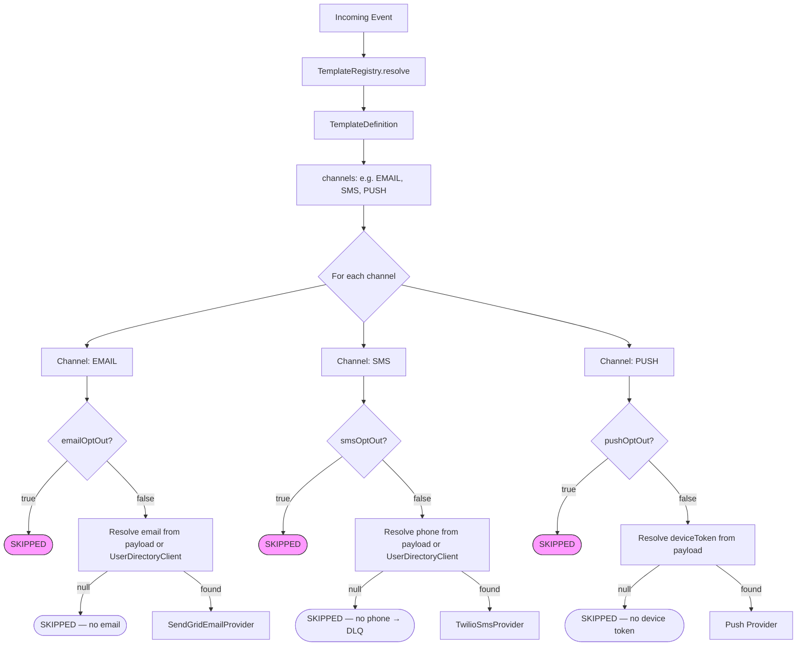
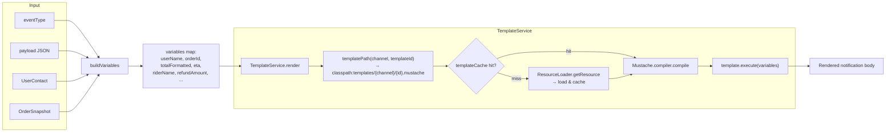
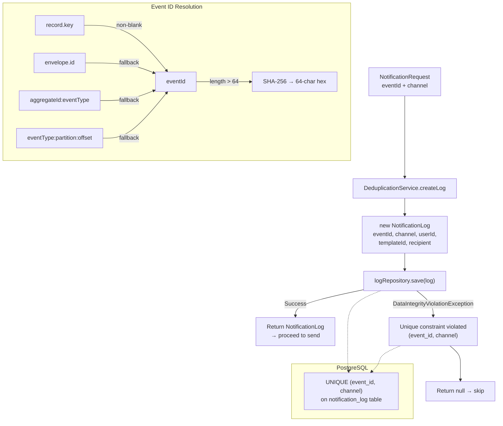
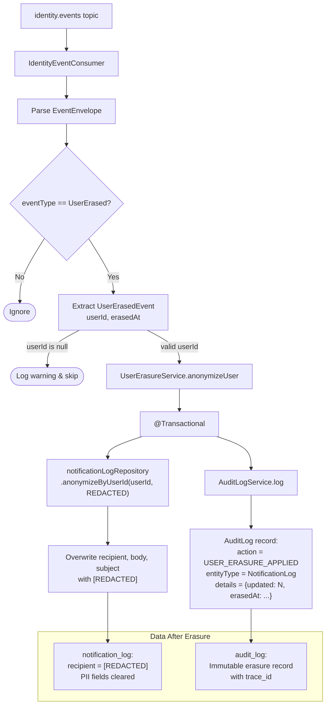
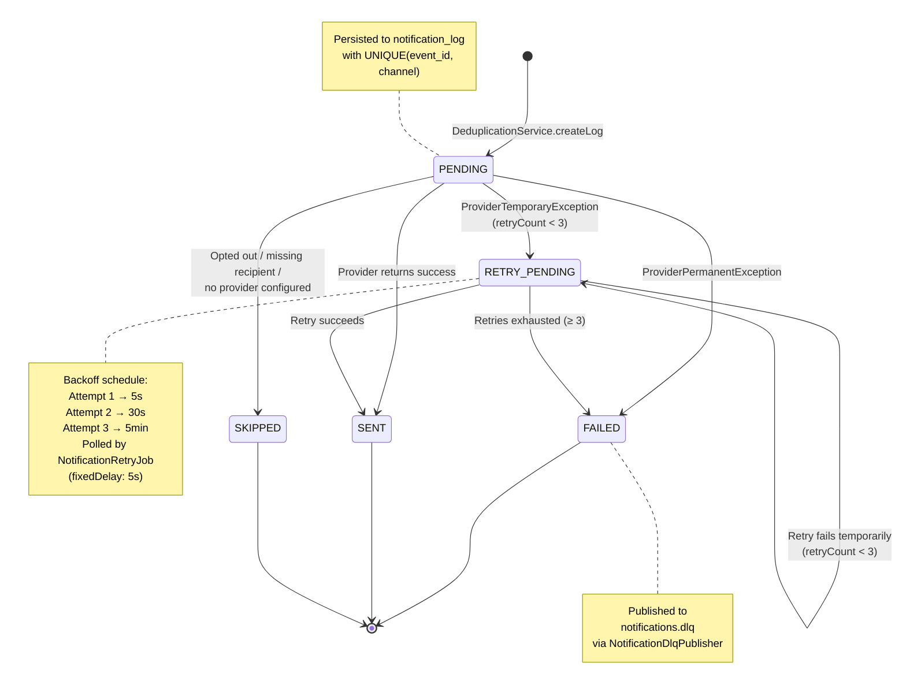

# Notification Service

Event-driven notification delivery service for InstaCommerce. Consumes domain events from order, payment, fulfillment, and identity Kafka topics and delivers notifications via SMS, email, and push channels. Features a Mustache template engine, database-backed deduplication, user preference-based channel routing, and GDPR-compliant erasure handling.

## Architecture Overview

| Layer | Components |
|---|---|
| **Kafka Consumers** | `FulfillmentEventConsumer`, `OrderEventConsumer`, `PaymentEventConsumer`, `IdentityEventConsumer` |
| **Core Services** | `NotificationService`, `TemplateService`, `UserPreferenceService`, `DeduplicationService` |
| **Providers** | `SendGridEmailProvider` (email), `TwilioSmsProvider` (SMS), `LoggingProvider` (fallback) |
| **Infrastructure** | `RetryableNotificationSender`, `NotificationRetryJob`, `NotificationDlqPublisher`, `NotificationLogCleanupJob` |
| **REST Clients** | `RestUserDirectoryClient` → identity-service, `RestOrderLookupClient` → order-service |
| **GDPR** | `UserErasureService`, `AuditLogService` |

## Kafka Topics

| Topic | Consumer | Events | Purpose |
|---|---|---|---|
| `orders.events` | `OrderEventConsumer` | `OrderPlaced`, `OrderPacked`, `OrderDelivered` | Order lifecycle notifications |
| `fulfillment.events` | `FulfillmentEventConsumer` | `OrderDispatched` | Dispatch & delivery updates |
| `payments.events` | `PaymentEventConsumer` | `PaymentRefunded` | Refund confirmations |
| `identity.events` | `IdentityEventConsumer` | `UserErased` | GDPR right-to-erasure |
| `notifications.dlq` | — (produced to) | Failed notifications | Dead-letter queue |

All consumers use group ID `notification-service` with concurrency of 3 partitions.

## Template Registry

The `TemplateRegistry` maps event types to template definitions, each specifying which channels to deliver on:

| Event Type | Template ID | Channels | Email Subject |
|---|---|---|---|
| `OrderPlaced` | `order_confirmed` | EMAIL, SMS | Order confirmed |
| `OrderPacked` | `order_packed` | SMS | Order packed |
| `OrderDispatched` | `order_dispatched` | SMS, PUSH | Out for delivery |
| `OrderDelivered` | `order_delivered` | EMAIL, SMS | Order delivered |
| `PaymentRefunded` | `payment_refunded` | EMAIL | Payment refunded |

Templates are Mustache files stored at `src/main/resources/templates/{channel}/{templateId}.mustache`.

## Diagrams

### 1. Event-to-Notification Flow



### 2. Channel Routing Logic



### 3. Template Rendering Pipeline



### 4. Deduplication Mechanism



### 5. GDPR Erasure Handling



### 6. Notification Lifecycle



## Retry & DLQ Strategy

1. **First attempt** — `RetryableNotificationSender.send()` dispatches asynchronously via `@Async("notificationExecutor")`.
2. **Temporary failure** — status set to `RETRY_PENDING` with `nextRetryAt` using exponential backoff (5 s → 30 s → 5 min).
3. **`NotificationRetryJob`** — scheduled poller (`fixedDelay: 5000 ms`) picks up `RETRY_PENDING` rows whose `nextRetryAt` has passed, in batches of 100.
4. **Exhausted retries** (≥ 3 attempts) or **permanent failure** — status set to `FAILED`, event published to `notifications.dlq` Kafka topic.
5. **`NotificationLogCleanupJob`** — daily cron (`0 0 3 * * *`) deletes logs older than 90 days.

## Database Schema

Managed by Flyway. Three migrations:

| Migration | Description |
|---|---|
| `V1__create_notification_log.sql` | `notification_log` table with `UNIQUE(event_id, channel)` for deduplication |
| `V2__create_audit_log.sql` | `audit_log` table for GDPR-compliant action tracking |
| `V3__add_retry_columns.sql` | Adds `retry_count`, `next_retry_at`, `event_type`, `subject`, `body` columns; partial index on `RETRY_PENDING` status |

## Observability

| Signal | Implementation |
|---|---|
| **Metrics** | Micrometer counters: `notification.sent`, `notification.failed`, `notification.skipped` exported via OTLP |
| **Tracing** | OpenTelemetry via `micrometer-tracing-bridge-otel`; trace IDs attached to audit logs |
| **Logging** | Structured JSON via `logstash-logback-encoder`; PII masked by `MaskingUtil` |
| **Health** | Spring Actuator liveness/readiness probes; readiness includes DB check |

## Configuration

Key properties in `application.yml` (all overridable via environment variables):

| Property | Default | Description |
|---|---|---|
| `notification.providers.sendgrid.api-key` | — | SendGrid API key (via Secret Manager) |
| `notification.providers.sendgrid.from-email` | `no-reply@instacommerce.com` | Sender email |
| `notification.providers.twilio.account-sid` | — | Twilio SID |
| `notification.providers.twilio.from-number` | — | Twilio sender number |
| `notification.identity.base-url` | `http://localhost:8081` | identity-service URL for user preferences |
| `notification.identity.preference-cache-ttl` | `60s` | TTL for cached user preferences |
| `notification.order.base-url` | `http://localhost:8085` | order-service URL for order lookups |
| `notification.delivery.default-eta-minutes` | `15` | Fallback ETA when not in event payload |
| `notification.dlq-topic` | `notifications.dlq` | Kafka DLQ topic |
| `notification.retry.batch-size` | `100` | Max rows per retry poll cycle |

## Tech Stack

- **Runtime**: Java 21, Spring Boot, Spring Kafka
- **Database**: PostgreSQL with Flyway migrations
- **Templates**: Mustache (`spring-boot-starter-mustache`)
- **Email**: SendGrid
- **SMS**: Twilio
- **Secrets**: Google Cloud Secret Manager
- **Observability**: Micrometer + OpenTelemetry, Logstash JSON logging
- **Container**: Multi-stage Docker build, JRE 21 Alpine, ZGC, non-root user

## Project Structure

```
src/main/java/com/instacommerce/notification/
├── config/                  # Properties, Kafka error handling, security, async config
├── consumer/                # Kafka consumers + EventEnvelope DTO
├── domain/
│   ├── model/               # NotificationLog, NotificationChannel, NotificationStatus, AuditLog
│   └── valueobject/         # TemplateId
├── dto/                     # NotificationRequest, NotificationResult
├── exception/               # TraceIdProvider
├── infrastructure/
│   ├── metrics/             # NotificationMetrics (Micrometer counters)
│   └── retry/               # RetryableNotificationSender, RetryJob, CleanupJob, DlqPublisher
├── provider/                # NotificationProvider SPI, SendGrid, Twilio, Logging implementations
├── repository/              # JPA repositories for notification_log and audit_log
├── service/                 # Core services: Notification, Template, Deduplication, UserPreference, Erasure
└── template/                # TemplateRegistry, TemplateDefinition
```
