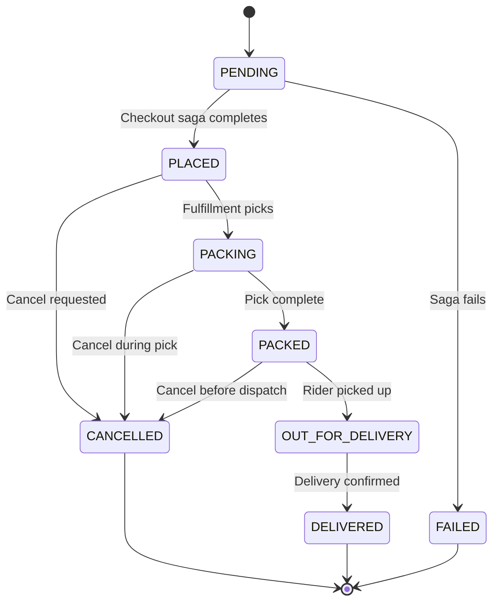
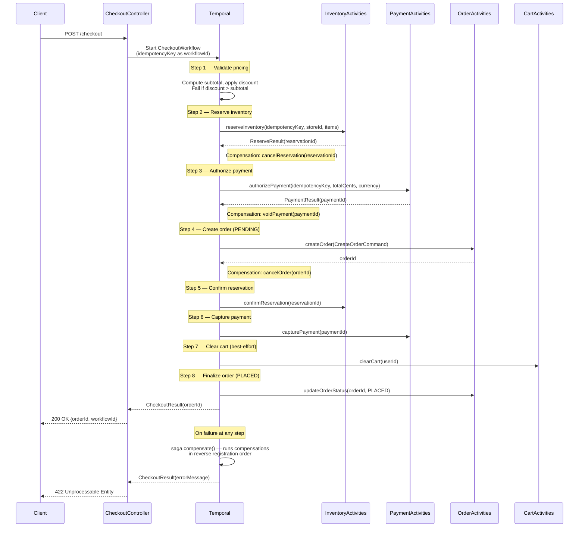
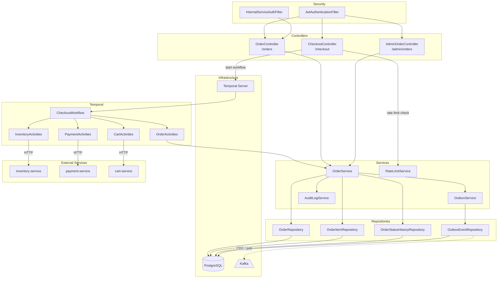
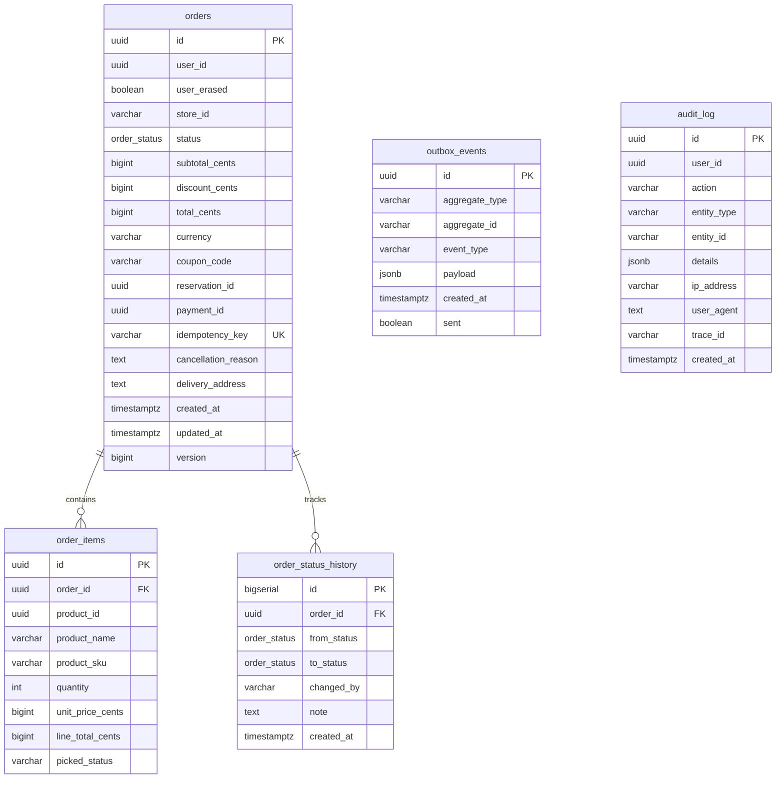
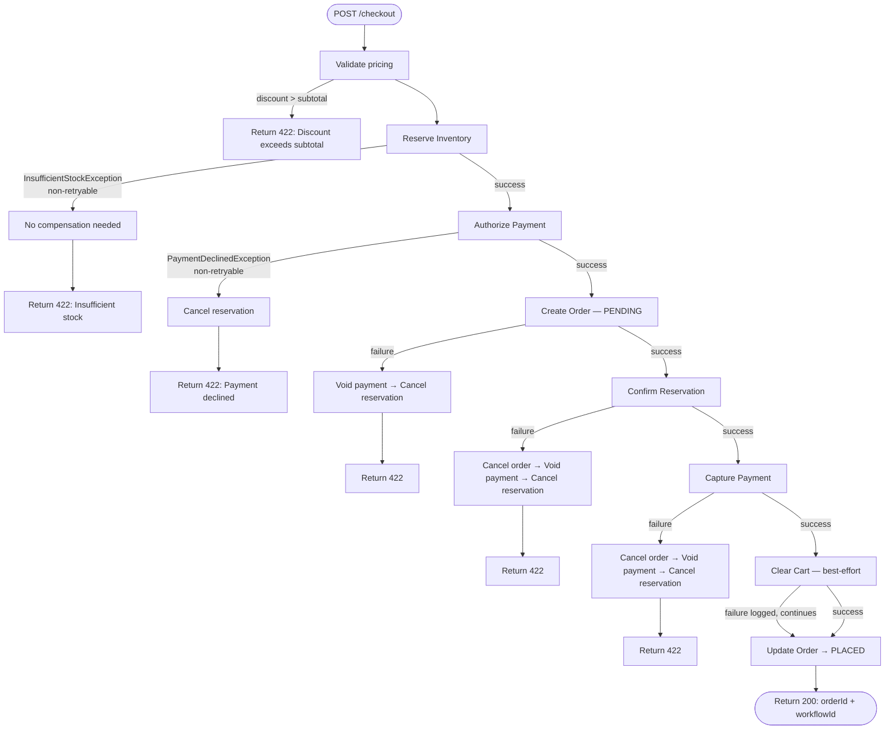

# Order Service

Manages the order lifecycle from placement through delivery or cancellation. Uses **Temporal** for checkout workflow orchestration (saga pattern with automatic compensation) and **Kafka** for event publishing via the transactional outbox pattern.

## Key Components

| Layer | Component | Responsibility |
|-------|-----------|----------------|
| Controller | `OrderController` | Customer-facing order endpoints (`/orders`) |
| Controller | `CheckoutController` | Initiates Temporal checkout workflow (`/checkout`) |
| Controller | `AdminOrderController` | Admin order management (`/admin/orders`) |
| Service | `OrderService` | Order CRUD, state transitions, outbox publishing |
| Service | `OutboxService` | Transactional outbox writes (runs inside caller's `@Transactional`) |
| Service | `OutboxCleanupJob` | ShedLock-guarded cron that purges sent events older than 30 days |
| Workflow | `CheckoutWorkflow` / `CheckoutWorkflowImpl` | Temporal saga — reserve → pay → create order |
| Activity | `InventoryActivities` | Reserve / confirm / cancel inventory via inventory-service |
| Activity | `PaymentActivities` | Authorize / capture / void payment via payment-service |
| Activity | `OrderActivities` | Create order, cancel order, update status |
| Activity | `CartActivities` | Clear cart after successful checkout |
| Consumer | `IdentityEventConsumer` | Listens to `identity.events` for GDPR user-erasure |
| Domain | `OrderStateMachine` | Enforces valid state transitions |

## Architecture

### 1. Order State Machine



Valid transitions enforced by `OrderStateMachine`:

| From | Allowed To |
|------|-----------|
| `PENDING` | `PLACED`, `FAILED`, `CANCELLED` |
| `PLACED` | `PACKING`, `CANCELLED` |
| `PACKING` | `PACKED`, `CANCELLED` |
| `PACKED` | `OUT_FOR_DELIVERY`, `CANCELLED` |
| `OUT_FOR_DELIVERY` | `DELIVERED` |
| `DELIVERED` | _(terminal)_ |
| `CANCELLED` | _(terminal)_ |
| `FAILED` | _(terminal)_ |

---

### 2. Checkout Saga (Temporal Workflow)



**Activity retry configuration:**

| Activity | Timeout | Max Attempts | Backoff | Non-retryable Exceptions |
|----------|---------|-------------|---------|--------------------------|
| `InventoryActivities` | 10 s | 3 | 1 s × 2.0 coeff | `InsufficientStockException` |
| `PaymentActivities` | 30 s | 3 | 2 s | `PaymentDeclinedException` |
| `OrderActivities` | 10 s | 3 | default | — |
| `CartActivities` | 5 s | 2 | default | — |

---

### 3. Service Architecture



---

### 4. Event Flow

```mermaid
flowchart LR
    subgraph Order Service
        OS[OrderService]
        OBS[OutboxService]
        OE[(outbox_events)]
        IEC[IdentityEventConsumer]
    end

    subgraph Kafka Topics
        OEV[order.events]
        IEV[identity.events]
        DLT[*.DLT]
    end

    subgraph Downstream
        FS[fulfillment-service]
        NS[notification-service]
        AS[analytics-service]
    end

    OS -->|@Transactional| OBS --> OE
    OE -->|CDC / poll relay| OEV
    OEV --> FS & NS & AS
    IEV --> IEC
    OEV -.->|on failure| DLT
```

**Published events** (via outbox → `order.events`):

| Event | Trigger | Key Payload Fields |
|-------|---------|-------------------|
| `OrderCreated` | Order row inserted | `orderId`, `userId`, `status` |
| `OrderPlaced` | Status → `PLACED` | `orderId`, `userId`, `storeId`, `paymentId`, `totalCents`, `currency`, `items[]`, `deliveryAddress` |
| `OrderStatusChanged` | Any status transition | `orderId`, `from`, `to` |
| `OrderCancelled` | Status → `CANCELLED` | `orderId`, `userId`, `paymentId`, `totalCents`, `currency`, `reason` |

**Consumed events:**

| Topic | Event | Action |
|-------|-------|--------|
| `identity.events` | `UserErased` | Anonymize user data in orders (GDPR) |

---

### 5. API Reference

#### Customer Endpoints (`/orders`)

| Method | Path | Auth | Description | Response |
|--------|------|------|-------------|----------|
| `GET` | `/orders` | JWT | List current user's orders (paginated) | `Page<OrderSummaryResponse>` |
| `GET` | `/orders/{id}` | JWT | Get order detail (owner or admin) | `OrderResponse` |
| `GET` | `/orders/{id}/status` | JWT | Get order status + timeline | `OrderStatusResponse` |
| `POST` | `/orders/{id}/cancel` | JWT | Cancel order (user, pre-packing only) | `204 No Content` |

#### Checkout (`/checkout`)

| Method | Path | Auth | Description | Response |
|--------|------|------|-------------|----------|
| `POST` | `/checkout` | JWT | Start checkout saga | `200` → `CheckoutResponse` or `422` on failure |

**Request body:**

```json
{
  "userId": "uuid",
  "storeId": "string",
  "items": [
    {
      "productId": "uuid",
      "productName": "string",
      "productSku": "string",
      "quantity": 2,
      "unitPriceCents": 1500,
      "lineTotalCents": 3000
    }
  ],
  "subtotalCents": 3000,
  "discountCents": 0,
  "totalCents": 3000,
  "currency": "INR",
  "couponCode": "SAVE10",
  "idempotencyKey": "unique-key-64-chars-max",
  "deliveryAddress": "123 Main St"
}
```

#### Admin Endpoints (`/admin/orders`) — requires `ROLE_ADMIN`

| Method | Path | Auth | Description | Response |
|--------|------|------|-------------|----------|
| `GET` | `/admin/orders/{id}` | Admin | Get any order | `OrderResponse` |
| `POST` | `/admin/orders/{id}/cancel` | Admin | Cancel any cancellable order | `204 No Content` |
| `POST` | `/admin/orders/{id}/status` | Admin | Advance order status | `204 No Content` |

**Status update request body:**

```json
{
  "status": "PACKING",
  "note": "optional reason"
}
```

#### Error Response Format

All errors return a consistent structure:

```json
{
  "code": "ORDER_NOT_FOUND",
  "message": "Order not found",
  "traceId": "abc123",
  "timestamp": "2025-01-01T00:00:00Z",
  "details": []
}
```

| HTTP Status | Code | Cause |
|-------------|------|-------|
| `400` | `VALIDATION_ERROR` | Invalid request body / parameters |
| `403` | `ACCESS_DENIED` | Missing `ROLE_ADMIN` |
| `404` | `ORDER_NOT_FOUND` | Order does not exist or not owned by user |
| `409` | `DUPLICATE_CHECKOUT` | Idempotency key already used |
| `409` | `INVALID_ORDER_STATE` | Illegal state transition |
| `422` | — | Checkout saga failed (insufficient stock, payment declined, etc.) |
| `429` | `RATE_LIMIT_EXCEEDED` | Checkout rate limit hit (10 req / 60 s per user) |
| `500` | `INTERNAL_ERROR` | Unhandled server error |

---

### 6. Database Schema



**Key indexes:**

| Table | Index | Purpose |
|-------|-------|---------|
| `orders` | `idx_orders_user` | Filter by `user_id` |
| `orders` | `idx_orders_status` | Filter by `status` |
| `orders` | `idx_orders_created` | Sort by `created_at DESC` |
| `orders` | `idx_orders_user_created_at` | Composite for user order listing |
| `orders` | `uq_order_idempotency` | Unique constraint on `idempotency_key` |
| `order_items` | `idx_order_items_order` | Join to parent order |
| `order_status_history` | `idx_osh_order` | History lookup by order |
| `outbox_events` | `idx_outbox_unsent` | Partial index (`WHERE sent = false`) |
| `audit_log` | `idx_audit_user_id` | Lookup by user |
| `audit_log` | `idx_audit_action` | Filter by action type |
| `audit_log` | `idx_audit_created_at` | Time-range queries |

Migrations are managed by **Flyway** (`src/main/resources/db/migration/`).

---

### 7. Error Handling & Compensation Flow



**Compensation rules:**

- Compensations run in **reverse registration order** (last registered, first executed).
- Compensations run **sequentially** (`parallelCompensation = false`).
- Cart clearing is best-effort — failure is logged but does not trigger compensation.
- Duplicate checkouts are rejected via Temporal's `WORKFLOW_ID_REUSE_POLICY_REJECT_DUPLICATE` and return `409 Conflict`.

**Retry behavior:**

- Each activity has independent retry configuration with exponential backoff.
- Domain exceptions (`InsufficientStockException`, `PaymentDeclinedException`) are marked **non-retryable** to fail fast.
- The overall workflow has a **5-minute execution timeout**.

## Configuration

| Property | Env Var | Default |
|----------|---------|---------|
| Server port | `SERVER_PORT` | `8085` |
| Database URL | `ORDER_DB_URL` | `jdbc:postgresql://localhost:5432/orders` |
| Inventory service | `INVENTORY_SERVICE_URL` | `http://localhost:8083` |
| Cart service | `CART_SERVICE_URL` | `http://localhost:8084` |
| Payment service | `PAYMENT_SERVICE_URL` | `http://localhost:8086` |
| Temporal address | `TEMPORAL_HOST` | `localhost:7233` |
| Temporal namespace | `TEMPORAL_NAMESPACE` | `instacommerce` |
| Temporal task queue | `TEMPORAL_TASK_QUEUE` | `CHECKOUT_TASK_QUEUE` |
| JWT issuer | `ORDER_JWT_ISSUER` | `instacommerce-identity` |
| Checkout rate limit | — | 10 requests / 60 s per user |

## Tech Stack

- **Java 21**, Spring Boot 3, Spring Data JPA, Spring Security
- **PostgreSQL** with Flyway migrations
- **Temporal** (SDK 1.24.2) for workflow orchestration
- **Kafka** (Spring Kafka) for event publishing & consumption
- **Resilience4j** for rate limiting
- **ShedLock** for distributed cron scheduling
- **Micrometer + OTLP** for metrics and distributed tracing
- **Testcontainers** (PostgreSQL) for integration tests
