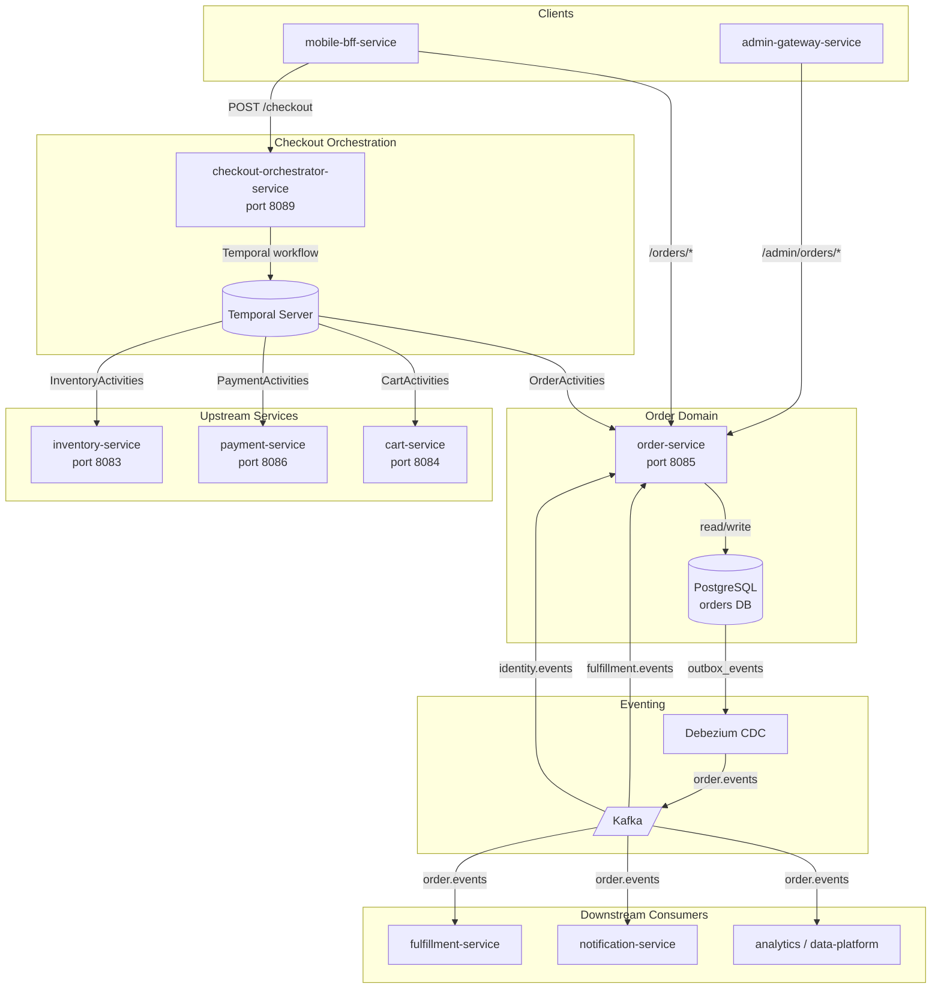
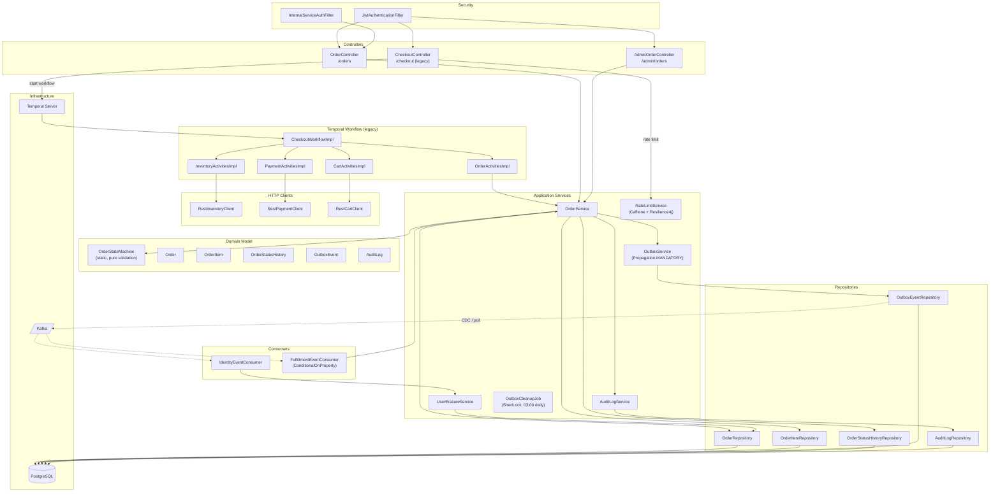
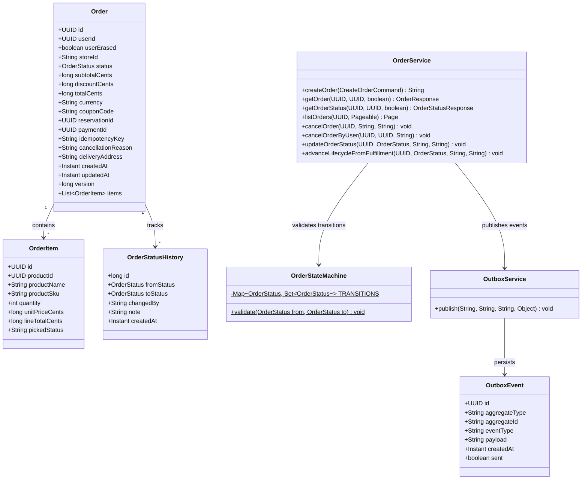
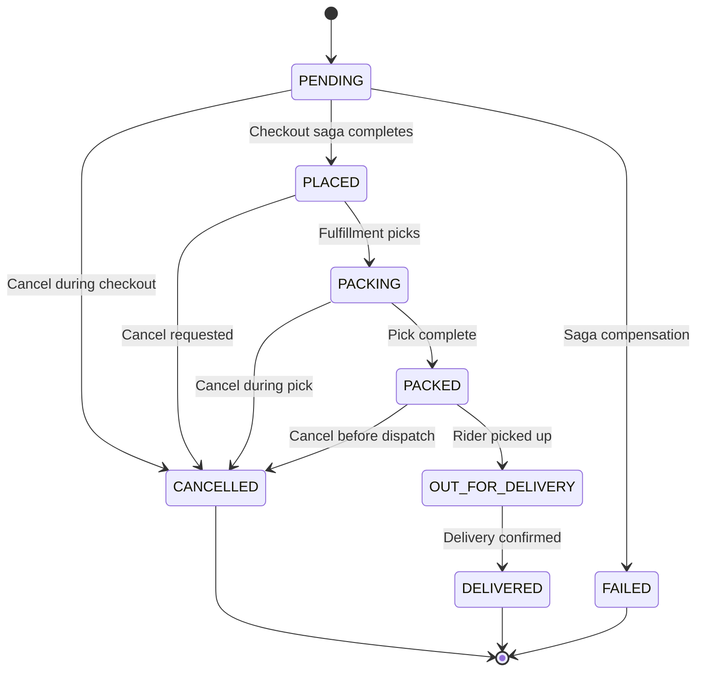
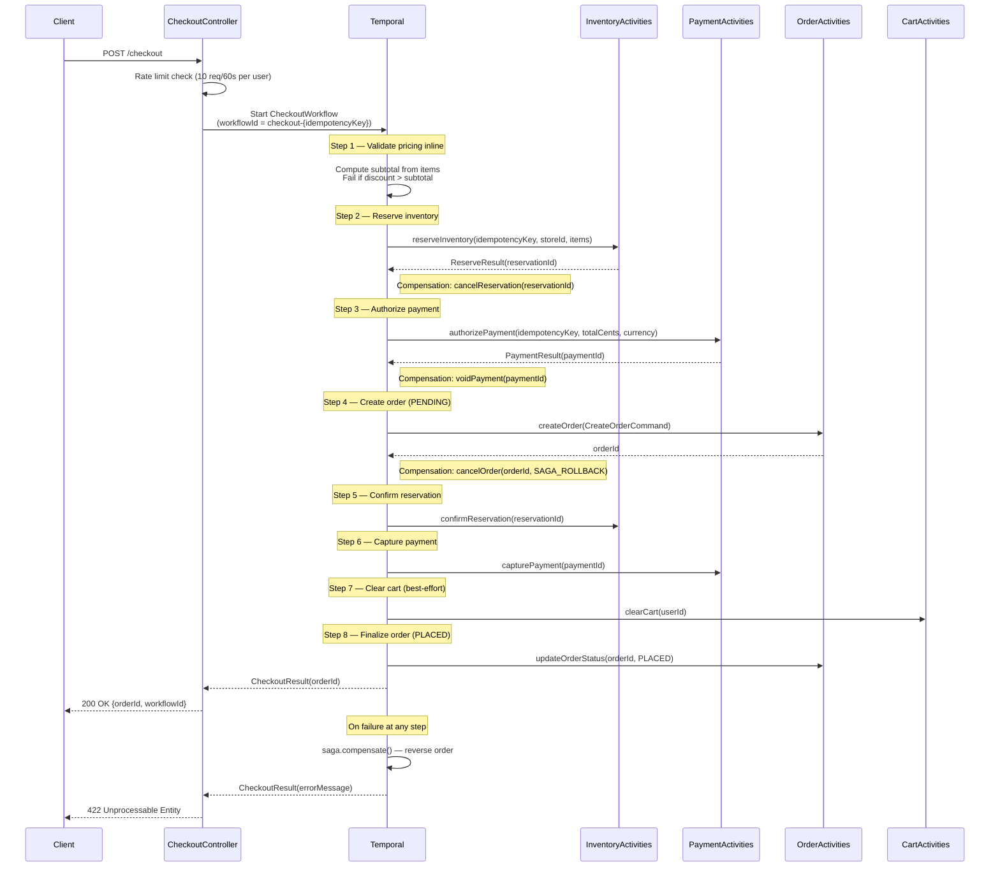
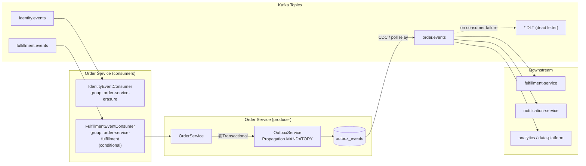
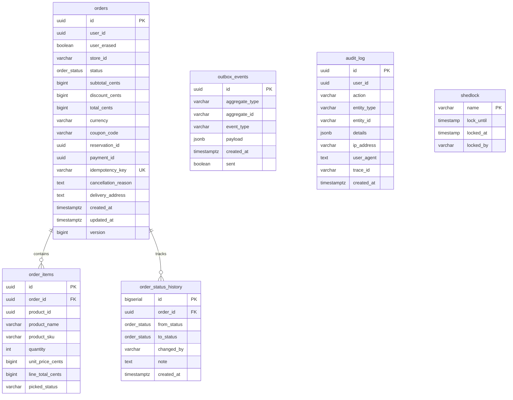
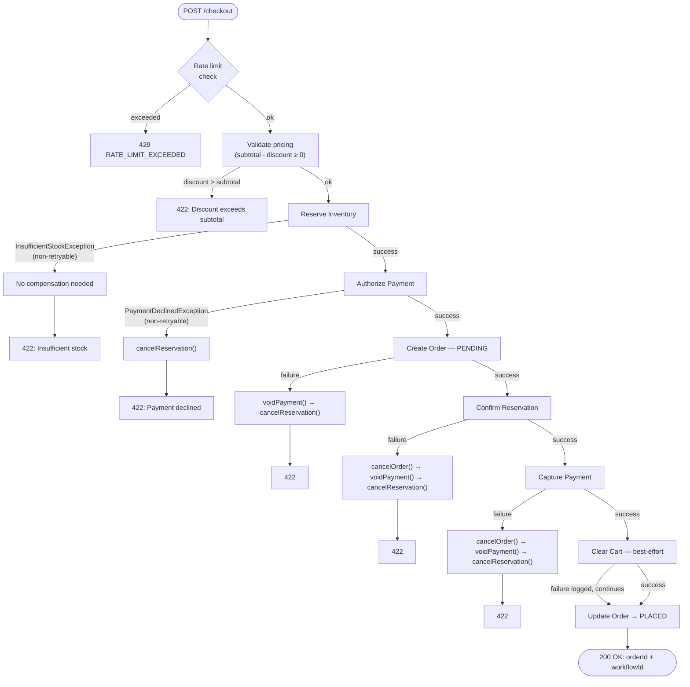

# Order Service

> **Module path:** `services/order-service` · **Port:** `8085` · **Language:** Java 21 / Spring Boot 3  
> **Owner:** Transactional Core team · **Classification:** Money-path adjacent — order state of record

---

## Table of Contents

1. [Service Role and Boundaries](#1-service-role-and-boundaries)
2. [Current Hybrid Choreography Posture](#2-current-hybrid-choreography-posture)
3. [High-Level Design (HLD)](#3-high-level-design-hld)
4. [Low-Level Design (LLD)](#4-low-level-design-lld)
5. [Request, Event, and State-Transition Flows](#5-request-event-and-state-transition-flows)
6. [API Reference](#6-api-reference)
7. [Database Schema](#7-database-schema)
8. [Runtime and Configuration](#8-runtime-and-configuration)
9. [Dependencies](#9-dependencies)
10. [Observability](#10-observability)
11. [Testing](#11-testing)
12. [Failure Modes and Compensation](#12-failure-modes-and-compensation)
13. [Rollout and Rollback](#13-rollout-and-rollback)
14. [Known Limitations](#14-known-limitations)
15. [Q-Commerce Pattern Comparison](#15-q-commerce-pattern-comparison)

---

## 1. Service Role and Boundaries

Order-service is the **system of record for order state**. It owns:

- The `orders`, `order_items`, and `order_status_history` tables in its dedicated PostgreSQL database.
- An `OrderStateMachine` that enforces an 8-status lifecycle (`PENDING` → `PLACED` → `PACKING` → `PACKED` → `OUT_FOR_DELIVERY` → `DELIVERED`, with `CANCELLED` and `FAILED` as terminal states).
- Transactional outbox event publishing (`OrderCreated`, `OrderPlaced`, `OrderStatusChanged`, `OrderCancelled`) for downstream consumers.
- A GDPR user-erasure path (via `IdentityEventConsumer` → `UserErasureService`), replacing `user_id` with a zero-UUID placeholder and setting `user_erased = true`.
- An audit log capturing every state mutation with actor, IP, user-agent, and OTEL trace ID.

**What order-service does NOT own:**

| Concern | Owner |
|---------|-------|
| Checkout saga orchestration (authoritative) | `checkout-orchestrator-service` (port 8089) |
| Payment state machine, PSP gateway calls | `payment-service` (port 8086) |
| Inventory reservation lifecycle | `inventory-service` (port 8083) |
| Fulfillment task assignment, picker/packer flows | `fulfillment-service` |
| Pricing truth, coupon application | `pricing-service` |

Order-service exposes `OrderActivities` (create, cancel, update status) as Temporal activities that the checkout orchestrator invokes. It does **not** own the saga step ordering or compensation decisions — those are the orchestrator's responsibility.

---

## 2. Current Hybrid Choreography Posture

Order-service currently occupies a **hybrid orchestration + choreography** position:

### Orchestration (inbound)

The `checkout-orchestrator-service` drives order creation via Temporal activities. Order-service acts as a participant, not an orchestrator, for the checkout money-path.

### Legacy Direct Saga (deprecated, feature-flagged)

Order-service contains its own `CheckoutWorkflowImpl` + `CheckoutController` on `POST /checkout` (port 8085). This path is **feature-gated** by `ORDER_CHECKOUT_DIRECT_SAGA_ENABLED` (default `true`). When disabled, the endpoint returns `410 Gone` with code `CHECKOUT_MOVED`.

> **⚠️ Critical correctness defect** (documented in `docs/reviews/iter3/services/transactional-core.md`): The order-service checkout path computes pricing inline from client-supplied `item.unitPriceCents()`, bypassing `pricing-service` validation entirely. It also lacks delivery-fee inclusion and server-side coupon application. The `checkout-orchestrator-service` is the only path that calls `pricing-service` for a locked price snapshot. Set `ORDER_CHECKOUT_DIRECT_SAGA_ENABLED=false` in production.

### Choreography (inbound events)

`FulfillmentEventConsumer` listens to `fulfillment.events` and advances order state through the packing → dispatch → delivery lifecycle. This consumer is **off by default** (`ORDER_CHOREOGRAPHY_FULFILLMENT_CONSUMER_ENABLED=false`) and must be explicitly enabled.

`IdentityEventConsumer` listens to `identity.events` unconditionally for GDPR `UserErased` events.

### Choreography (outbound events)

All order mutations write to the `outbox_events` table inside the same database transaction. Events are relayed to the `order.events` Kafka topic via CDC (Debezium) or a poll-based relay.

---

## 3. High-Level Design (HLD)

### System Context



---

## 4. Low-Level Design (LLD)

### Component Architecture



### UML Component Diagram



---

## 5. Request, Event, and State-Transition Flows

### 5.1 Order State Machine

Enforced by `OrderStateMachine.validate()` — a static `Map<OrderStatus, Set<OrderStatus>>` lookup that throws `InvalidOrderStateException` on illegal transitions.



| From | Allowed To | Trigger Source |
|------|-----------|----------------|
| `PENDING` | `PLACED`, `FAILED`, `CANCELLED` | Checkout orchestrator (Temporal) |
| `PLACED` | `PACKING`, `CANCELLED` | FulfillmentEventConsumer / Admin / User |
| `PACKING` | `PACKED`, `CANCELLED` | FulfillmentEventConsumer / Admin |
| `PACKED` | `OUT_FOR_DELIVERY`, `CANCELLED` | FulfillmentEventConsumer / Admin |
| `OUT_FOR_DELIVERY` | `DELIVERED` | FulfillmentEventConsumer / Admin |
| `DELIVERED` | _(terminal)_ | — |
| `CANCELLED` | _(terminal)_ | — |
| `FAILED` | _(terminal)_ | — |

**Fulfillment lifecycle bridging:** `advanceLifecycleFromFulfillment()` auto-bridges intermediate states. For example, receiving `OrderPacked` while the order is in `PLACED` will transition through `PLACED → PACKING → PACKED` in a single call (two status changes, two outbox events). Stale events for already-advanced orders are silently ignored via `lifecycleRank()` comparison.

**User cancellation guard:** `cancelOrderByUser()` restricts user-initiated cancellation to `PENDING` or `PLACED` status only, even though the state machine technically allows `CANCELLED` from `PACKING` and `PACKED`. Admin cancellation via `AdminOrderController` can cancel from any non-terminal pre-delivery state.

### 5.2 Checkout Saga (Legacy Direct Path)

The local Temporal workflow (`CheckoutWorkflowImpl`) implements an 8-step saga. `checkout-orchestrator-service` is the authoritative checkout path in production (see [§2](#2-current-hybrid-choreography-posture)).



**Activity retry configuration** (from `CheckoutWorkflowImpl`):

| Activity | Start-to-Close Timeout | Max Attempts | Initial Backoff | Backoff Coefficient | Non-Retryable |
|----------|------------------------|-------------|-----------------|---------------------|---------------|
| `InventoryActivities` | 10 s | 3 | 1 s | 2.0 | `InsufficientStockException` |
| `PaymentActivities` | 30 s | 3 | 2 s | default | `PaymentDeclinedException` |
| `OrderActivities` | 10 s | 3 | default | default | — |
| `CartActivities` | 5 s | 2 | default | default | — |

**Workflow-level:** 5-minute execution timeout, `WORKFLOW_ID_REUSE_POLICY_REJECT_DUPLICATE`.

### 5.3 Event Flows



**Published events** (via outbox → `order.events`):

| Event | Trigger | Key Payload Fields |
|-------|---------|-------------------|
| `OrderCreated` | Order row inserted | `orderId`, `userId`, `status` |
| `OrderPlaced` | Status → `PLACED` | `orderId`, `userId`, `storeId`, `paymentId`, `totalCents`, `currency`, `items[]`, `deliveryAddress`, `placedAt` |
| `OrderStatusChanged` | Any status transition | `orderId`, `from`, `to` |
| `OrderCancelled` | Status → `CANCELLED` | `orderId`, `userId`, `paymentId`, `totalCents`, `currency`, `reason` |

**Consumed events:**

| Topic | Consumer Group | Event | Action |
|-------|---------------|-------|--------|
| `identity.events` | `order-service-erasure` | `UserErased` | Anonymize: set `user_id` → zero-UUID, `user_erased = true` |
| `fulfillment.events` | `order-service-fulfillment` | `OrderPacked` | Advance to `PACKED` (bridges through `PACKING` if needed) |
| `fulfillment.events` | `order-service-fulfillment` | `OrderDispatched` | Advance to `OUT_FOR_DELIVERY` |
| `fulfillment.events` | `order-service-fulfillment` | `OrderDelivered` | Advance to `DELIVERED` |
| `fulfillment.events` | `order-service-fulfillment` | `OrderModified` | Logged and ignored (pending dedicated handling) |

**Dead-letter handling:** Kafka consumer errors are retried 3 times with 1-second fixed backoff. `JsonProcessingException` and `IllegalArgumentException` are non-retryable and route directly to `<topic>.DLT`.

---

## 6. API Reference

### Customer Endpoints (`/orders`)

| Method | Path | Auth | Description | Response |
|--------|------|------|-------------|----------|
| `GET` | `/orders` | JWT | List current user's orders (paginated, max 100/page) | `Page<OrderSummaryResponse>` |
| `GET` | `/orders/{id}` | JWT | Get order detail (owner or admin) | `OrderResponse` |
| `GET` | `/orders/{id}/status` | JWT | Get order status + timeline | `OrderStatusResponse` |
| `POST` | `/orders/{id}/cancel` | JWT | Cancel order (user, `PENDING`/`PLACED` only) | `204 No Content` |

Cancel request body: `{ "reason": "string (required, max 200 chars)" }`

### Legacy Checkout (`/checkout`)

| Method | Path | Auth | Description | Response |
|--------|------|------|-------------|----------|
| `POST` | `/checkout` | JWT | Start legacy checkout saga | `200` → `CheckoutResponse` / `410` if disabled / `422` on saga failure |

**Request body:**

```json
{
  "userId": "uuid",
  "storeId": "string",
  "items": [
    {
      "productId": "uuid",
      "productName": "string",
      "productSku": "string",
      "quantity": 2,
      "unitPriceCents": 1500,
      "lineTotalCents": 3000
    }
  ],
  "subtotalCents": 3000,
  "discountCents": 0,
  "totalCents": 3000,
  "currency": "INR",
  "couponCode": "SAVE10",
  "idempotencyKey": "unique-key-64-chars-max",
  "deliveryAddress": "123 Main St"
}
```

Validation constraints: `items` max 50, `currency` exactly 3 chars (ISO 4217), `idempotencyKey` max 64 chars, `deliveryAddress` max 500 chars.

### Admin Endpoints (`/admin/orders`) — requires `ROLE_ADMIN`

| Method | Path | Auth | Description | Response |
|--------|------|------|-------------|----------|
| `GET` | `/admin/orders/{id}` | `ROLE_ADMIN` | Get any order | `OrderResponse` |
| `POST` | `/admin/orders/{id}/cancel` | `ROLE_ADMIN` | Cancel any cancellable order | `204 No Content` |
| `POST` | `/admin/orders/{id}/status` | `ROLE_ADMIN` | Advance order status | `204 No Content` |

Status update body: `{ "status": "PACKING", "note": "optional reason" }`

### Error Response Format

```json
{
  "code": "ORDER_NOT_FOUND",
  "message": "Order not found",
  "traceId": "abc123",
  "timestamp": "2025-01-01T00:00:00Z",
  "details": []
}
```

| HTTP Status | Code | Cause |
|-------------|------|-------|
| `400` | `VALIDATION_ERROR` | Invalid request body, constraint violation, or malformed JSON |
| `403` | `ACCESS_DENIED` | Missing `ROLE_ADMIN` for admin endpoints |
| `404` | `ORDER_NOT_FOUND` | Order does not exist or not owned by requesting user |
| `409` | `DUPLICATE_CHECKOUT` | Idempotency key already has an active Temporal workflow |
| `409` | `INVALID_ORDER_STATE` | Illegal state transition per `OrderStateMachine` |
| `410` | `CHECKOUT_MOVED` | Legacy checkout disabled; use `checkout-orchestrator-service` |
| `422` | _(varies)_ | Checkout saga failed (insufficient stock, payment declined, etc.) |
| `429` | `RATE_LIMIT_EXCEEDED` | Checkout rate limit hit (10 req / 60 s per user) |
| `500` | `INTERNAL_ERROR` | Unhandled server error |

---

## 7. Database Schema

Managed by **Flyway** with 9 migrations (`V1`–`V9`) in `src/main/resources/db/migration/`. Hibernate DDL mode is `validate` — Flyway is the sole schema authority.



**Key indexes:**

| Table | Index | Type | Purpose |
|-------|-------|------|---------|
| `orders` | `uq_order_idempotency` | UNIQUE | Idempotent order creation |
| `orders` | `idx_orders_user` | B-tree | Filter by `user_id` |
| `orders` | `idx_orders_status` | B-tree | Filter by `status` |
| `orders` | `idx_orders_created` | B-tree DESC | Sort by `created_at` |
| `orders` | `idx_orders_user_created_at` | Composite | User order listing (V9) |
| `order_items` | `idx_order_items_order` | B-tree | FK join to parent order |
| `order_items` | `chk_qty` | CHECK | `quantity > 0` |
| `order_status_history` | `idx_osh_order` | B-tree | History lookup by order |
| `outbox_events` | `idx_outbox_unsent` | Partial (`WHERE sent = false`) | CDC/poll relay scan |
| `audit_log` | `idx_audit_user_id` | B-tree | Lookup by user |
| `audit_log` | `idx_audit_action` | B-tree | Filter by action type |
| `audit_log` | `idx_audit_created_at` | B-tree | Time-range queries |

**Data types:** All monetary values are stored as `BIGINT` (integer cents) — no floating-point in the money path. `order_status` is a PostgreSQL `ENUM` type. Optimistic concurrency is enforced via `@Version` on `orders.version`.

---

## 8. Runtime and Configuration

### Environment Variables

| Property | Env Var | Default | Notes |
|----------|---------|---------|-------|
| Server port | `SERVER_PORT` | `8085` | Dockerfile overrides to `8080` |
| Database URL | `ORDER_DB_URL` | `jdbc:postgresql://localhost:5432/orders` | |
| Database user | `ORDER_DB_USER` | `postgres` | |
| Database password | `ORDER_DB_PASSWORD` | — | Also supports GCP Secret Manager via `sm://db-password-order` |
| Inventory service | `INVENTORY_SERVICE_URL` | `http://localhost:8083` | |
| Cart service | `CART_SERVICE_URL` | `http://localhost:8084` | |
| Payment service | `PAYMENT_SERVICE_URL` | `http://localhost:8086` | |
| Kafka bootstrap | `KAFKA_BOOTSTRAP_SERVERS` | `localhost:9092` | |
| Temporal address | `TEMPORAL_HOST` | `localhost:7233` | Appends `:7233` in config |
| Temporal namespace | `TEMPORAL_NAMESPACE` | `instacommerce` | |
| Temporal task queue | `TEMPORAL_TASK_QUEUE` | `CHECKOUT_TASK_QUEUE` | |
| JWT issuer | `ORDER_JWT_ISSUER` | `instacommerce-identity` | |
| JWT public key | `ORDER_JWT_PUBLIC_KEY` | — | Also supports `sm://jwt-rsa-public-key` |
| Legacy checkout toggle | `ORDER_CHECKOUT_DIRECT_SAGA_ENABLED` | `true` | **Set `false` in production** |
| Fulfillment consumer toggle | `ORDER_CHOREOGRAPHY_FULFILLMENT_CONSUMER_ENABLED` | `false` | Enable when fulfillment-service is deployed |
| Fulfillment topic | `ORDER_CHOREOGRAPHY_FULFILLMENT_TOPIC` | `fulfillment.events` | |
| Fulfillment consumer group | `ORDER_CHOREOGRAPHY_FULFILLMENT_CONSUMER_GROUP` | `order-service-fulfillment` | |
| Internal service token | `INTERNAL_SERVICE_TOKEN` | `dev-internal-token-change-in-prod` | For inter-service auth |
| Tracing probability | `TRACING_PROBABILITY` | `1.0` | Reduce in production |
| OTLP traces endpoint | `OTEL_EXPORTER_OTLP_TRACES_ENDPOINT` | `http://otel-collector.monitoring:4318/v1/traces` | |
| OTLP metrics endpoint | `OTEL_EXPORTER_OTLP_METRICS_ENDPOINT` | `http://otel-collector.monitoring:4318/v1/metrics` | |
| Environment label | `ENVIRONMENT` | `dev` | Used in metric tags and logs |

### Connection Pool

HikariCP: max pool size 20, minimum idle 5, connection timeout 5 s, max lifetime 30 min.

### Rate Limiting

`resilience4j.ratelimiter.instances.checkoutLimiter`: 10 requests per 60-second window per user. Zero timeout (immediate rejection). Per-user limiters cached in Caffeine (max 10,000 entries, 5-min access expiry).

### Graceful Shutdown

`spring.lifecycle.timeout-per-shutdown-phase: 30s`. Server shutdown mode: `graceful`.

### Docker

Multi-stage build: Gradle 8.7 + JDK 21 → Eclipse Temurin 21 JRE Alpine. Runs as non-root user `app` (UID 1001). JVM flags: `-XX:MaxRAMPercentage=75.0 -XX:+UseZGC`. Healthcheck: `/actuator/health/liveness` every 30 s.

---

## 9. Dependencies

### Build Dependencies (`build.gradle.kts`)

| Category | Dependency | Version | Purpose |
|----------|-----------|---------|---------|
| Web | `spring-boot-starter-web` | Boot BOM | REST API |
| Data | `spring-boot-starter-data-jpa` | Boot BOM | JPA/Hibernate |
| Security | `spring-boot-starter-security` | Boot BOM | JWT + RBAC |
| Validation | `spring-boot-starter-validation` | Boot BOM | Bean validation |
| Actuator | `spring-boot-starter-actuator` | Boot BOM | Health, metrics |
| Kafka | `spring-boot-starter-kafka` | Boot BOM | Event consumption |
| Resilience | `resilience4j-spring-boot3` | 2.2.0 | Rate limiting |
| Observability | `micrometer-tracing-bridge-otel` | Boot BOM | Distributed tracing |
| Observability | `micrometer-registry-otlp` | Boot BOM | OTLP metrics export |
| Logging | `logstash-logback-encoder` | 7.4 | JSON structured logs |
| Cloud | `spring-cloud-gcp-starter-secretmanager` | GCP BOM | GCP Secret Manager |
| Cloud | `postgres-socket-factory` | 1.15.0 | Cloud SQL auth proxy |
| DB | `flyway-core` + `flyway-database-postgresql` | Boot BOM | Schema migrations |
| Caching | `caffeine` | 3.1.8 | In-process rate limiter cache |
| Scheduling | `shedlock-spring` + `shedlock-provider-jdbc-template` | 5.12.0 | Distributed cron locking |
| Workflow | `temporal-sdk` | 1.24.2 | Saga orchestration (legacy) |
| Auth | `jjwt-api` / `jjwt-impl` / `jjwt-jackson` | 0.12.5 | JWT parsing/validation |
| Contracts | `project(":contracts")` | — | Shared proto/event definitions |
| DB driver | `postgresql` | Boot BOM | JDBC driver |

### Test Dependencies

| Dependency | Purpose |
|-----------|---------|
| `spring-boot-starter-test` | JUnit 5, AssertJ, Mockito |
| `spring-security-test` | Security context testing |
| `testcontainers:postgresql` 1.19.3 | Integration tests with real PostgreSQL |
| `testcontainers:junit-jupiter` 1.19.3 | Testcontainers JUnit lifecycle |

### Runtime Service Dependencies

| Service | Protocol | Required For |
|---------|----------|-------------|
| PostgreSQL | JDBC | Order persistence (must be up for readiness) |
| Kafka | TCP | Outbox event relay + fulfillment/identity consumption |
| Temporal Server | gRPC | Legacy checkout saga (only when `direct-saga-enabled=true`) |
| `inventory-service` | HTTP | Reserve/confirm/cancel inventory (via Temporal activities) |
| `payment-service` | HTTP | Authorize/capture/void payment (via Temporal activities) |
| `cart-service` | HTTP | Clear cart post-checkout (via Temporal activities) |
| OTEL Collector | HTTP (OTLP) | Traces and metrics export |
| GCP Secret Manager | HTTPS | Production secrets (`sm://` prefix) |

---

## 10. Observability

### Health Endpoints

| Endpoint | Purpose | Includes |
|----------|---------|----------|
| `/actuator/health/liveness` | Kubernetes liveness probe | `livenessState` |
| `/actuator/health/readiness` | Kubernetes readiness probe | `readinessState`, `db` |
| `/actuator/health` | Full health (show-details: always) | All indicators |

### Metrics

- **Export:** Micrometer → OTLP (endpoint configurable) + Prometheus scrape via `/actuator/prometheus`.
- **Tags:** Every metric tagged with `service=order-service` and `environment=${ENVIRONMENT}`.
- **Tracing:** OTEL bridge via `micrometer-tracing-bridge-otel`. Sampling probability configurable via `TRACING_PROBABILITY` (default `1.0`).

### Structured Logging

Logback with `LogstashEncoder` — every log line is JSON with fields `service`, `environment`, and OTEL trace/span IDs propagated automatically. Configured in `src/main/resources/logback-spring.xml`.

### Audit Trail

`AuditLogService` records every order mutation to the `audit_log` table with: `userId`, `action`, `entityType`, `entityId`, `details` (JSONB), `ipAddress` (from `X-Forwarded-For`), `userAgent`, and `traceId` (from OTEL context). Actions tracked: `ORDER_PLACED`, `ORDER_CANCELLED`, `USER_ERASURE_APPLIED`.

---

## 11. Testing

### Test Commands

```bash
# Run all order-service tests
./gradlew :services:order-service:test

# Run a specific test class
./gradlew :services:order-service:test --tests "com.instacommerce.order.service.OrderServiceFulfillmentLifecycleTest"

# Run a specific test method
./gradlew :services:order-service:test --tests "com.instacommerce.order.consumer.FulfillmentEventConsumerTest.mapsDispatchedEventToOutForDelivery"
```

### Test Coverage

| Test Class | Type | Coverage Area |
|-----------|------|---------------|
| `OrderServiceFulfillmentLifecycleTest` | Unit (Mockito) | `advanceLifecycleFromFulfillment()`: multi-step bridging, stale event ignoring, PENDING rejection |
| `FulfillmentEventConsumerTest` | Unit (Mockito) | Kafka event deserialization, event-type-to-status mapping, unsupported event ignoring |
| `CheckoutControllerTest` | Unit (Mockito) | Feature flag guard (`410 Gone` when disabled), rate limiter not called when disabled |

### Test Infrastructure

- **JUnit 5** via Gradle `useJUnitPlatform()`.
- **Testcontainers** (PostgreSQL 1.19.3) available for integration tests requiring a real database.
- **Mockito** (via `@ExtendWith(MockitoExtension.class)`) for unit tests with injected mocks.

---

## 12. Failure Modes and Compensation

### Checkout Saga Compensation



**Compensation rules:**

- Compensations run in **reverse registration order** (last registered, first executed) — `Saga.Options.Builder().setParallelCompensation(false)`.
- Cart clearing is **best-effort** — failure is caught, logged, and does not trigger compensation.
- Duplicate checkouts rejected via Temporal's `WORKFLOW_ID_REUSE_POLICY_REJECT_DUPLICATE` → `409 DUPLICATE_CHECKOUT`.

### Kafka Consumer Failures

- 3 retries with 1-second fixed backoff (`DefaultErrorHandler` + `FixedBackOff(1000L, 3)`).
- `JsonProcessingException` and `IllegalArgumentException` are **non-retryable** — sent directly to `<topic>.DLT`.
- Ack mode: `record` (per-record commit, not batch).
- Auto-commit disabled; offset committed only after successful processing.

### Idempotency

| Layer | Mechanism |
|-------|-----------|
| Order creation | `idempotency_key` UNIQUE constraint — duplicate `createOrder()` returns existing order ID |
| Checkout workflow | Temporal `WORKFLOW_ID_REUSE_POLICY_REJECT_DUPLICATE` on `checkout-{idempotencyKey}` |
| Status transitions | `OrderStateMachine.validate()` + no-op return when `currentStatus == newStatus` |
| Fulfillment events | `hasReachedLifecycleStep()` rank comparison silently ignores stale events |
| User erasure | `anonymizeByUserId()` is naturally idempotent (overwrites same placeholder UUID) |

### Optimistic Concurrency

`Order.version` (`@Version`) provides optimistic locking. Concurrent updates to the same order throw `OptimisticLockException`, which surfaces as `500` and should be retried by the caller.

---

## 13. Rollout and Rollback

### Feature Flags

| Flag | Env Var | Default | Effect When `false` |
|------|---------|---------|---------------------|
| Direct saga checkout | `ORDER_CHECKOUT_DIRECT_SAGA_ENABLED` | `true` | `POST /checkout` returns `410 Gone`; Temporal `WorkflowClient`, `WorkerFactory`, and all activity beans are not created (`@ConditionalOnProperty`) |
| Fulfillment consumer | `ORDER_CHOREOGRAPHY_FULFILLMENT_CONSUMER_ENABLED` | `false` | `FulfillmentEventConsumer` bean not registered; no Kafka subscription to `fulfillment.events` |

### Deprecation Plan for Legacy Checkout

Per `docs/reviews/iter3/services/transactional-core.md` §1.3:

| Phase | Action | Gate |
|-------|--------|------|
| P1 (1 sprint) | Set `ORDER_CHECKOUT_DIRECT_SAGA_ENABLED=false` in production | API gateway routes to `checkout-orchestrator-service` |
| P2 (1 sprint) | Verify zero traffic on `POST /checkout` (port 8085) for 7 days | Grafana metrics confirmation |
| P3 | Delete `CheckoutWorkflowImpl`, activities, `CheckoutController`, `TemporalConfig`, `TemporalProperties`, `WorkerRegistration` | Zero `PENDING` orders from old path |

**Rollback:** Re-enable the feature flag. No database migration needed.

### Database Migrations

Flyway runs automatically on startup (`spring.flyway.enabled=true`). Migrations are forward-only. Rollback requires a new `V<N+1>__rollback_*.sql` migration.

### Deployment Considerations

- Graceful shutdown (30 s) ensures in-flight HTTP requests and Kafka consumer offsets are committed.
- Temporal workflows survive service restarts — they are durable and will resume on the next worker poll.
- Outbox events are crash-safe — uncommitted transactions are rolled back; committed-but-unsent events are picked up by CDC/poll on the next cycle.
- The ShedLock `order-outbox-cleanup` job holds a lock for up to 30 minutes; deploying during the 03:00 UTC window may delay cleanup (safe — not customer-facing).

---

## 14. Known Limitations

| # | Limitation | Impact | Ref |
|---|-----------|--------|-----|
| L1 | **Legacy checkout trusts client-supplied prices** — inline computation from `item.unitPriceCents()` bypasses `pricing-service` validation, coupon application, and delivery-fee inclusion. | Correctness defect on money path. Users can submit arbitrary prices. | `transactional-core.md` §1.1 |
| L2 | **Checkout blocks HTTP thread** — `CheckoutController` calls `workflow.execute()` synchronously, blocking the Tomcat thread for up to 5 minutes. | Thread-pool exhaustion under load (10k+ concurrent checkouts). | `transactional-core.md` §1.4, `CheckoutController` TODO comment |
| L3 | **No pricing snapshot ID** — `orders` table stores denormalized price values but no `quote_id` or `locked_price_version` linking to a pricing-service quote. | No audit proof of agreed price at checkout time; dispute resolution gap. | `transactional-core.md` §2.2 |
| L4 | **Fulfillment consumer disabled by default** — `ORDER_CHOREOGRAPHY_FULFILLMENT_CONSUMER_ENABLED=false`. Orders in `PLACED` state will not advance through fulfillment lifecycle until explicitly enabled. | Operational — requires coordination with fulfillment-service deployment. | `application.yml` |
| L5 | **OrderModified events are logged and ignored** — no order-modification handling implemented. | Partial-fulfillment or item-substitution scenarios are not reflected in order state. | `FulfillmentEventConsumer` |
| L6 | **No dedicated refund flow on cancellation** — `OrderCancelled` event publishes `paymentId` and `totalCents` for downstream refund processing, but order-service does not initiate or track refund state. | Refund depends entirely on a consumer (e.g., `payment-service`) reacting to the event. | `OrderService.cancelOrder()` comment |
| L7 | **No order-level delivery fee** — `orders` table has no `delivery_fee_cents` column. The checkout orchestrator includes delivery fees via `pricing-service`, but this is folded into `totalCents` without a separate breakdown. | Customer-facing order detail cannot show delivery fee line item. | `V1__create_orders.sql` |
| L8 | **Outbox cleanup window** — sent events are purged after 30 days. No configurable retention. | May not meet all compliance requirements without adjustment. | `OutboxCleanupJob` |

---

## 15. Q-Commerce Pattern Comparison

Grounded in `docs/reviews/iter3/benchmarks/india-operator-patterns.md` and the order-service codebase:

| Pattern | Industry (Zepto / Blinkit / Swiggy Instamart) | InstaCommerce Order Service | Gap |
|---------|------------------------------------------------|----------------------------|-----|
| **Checkout orchestration** | Dedicated saga orchestrator with server-side pricing lock (quote token) | Has dedicated orchestrator (`checkout-orchestrator-service`) + legacy inline path being deprecated. No quote-token yet. | 🟡 Medium — orchestrator exists but pricing lock is not in order schema |
| **Order state granularity** | Fine-grained (8–12 states typical: includes READY_FOR_PICK, PICKER_ASSIGNED, etc.) | 8 states (`PENDING` → `DELIVERED`). No picker/rider assignment granularity. | 🟡 Medium — fulfillment handles sub-states externally |
| **Idempotent money path** | Three-layer idempotency: API → workflow → DB unique constraint | Two layers in order-service (Temporal workflow ID + DB unique key). Orchestrator adds a third (DB-backed idempotency cache). | 🟢 Low — when orchestrator path is used |
| **Event-driven fulfillment bridge** | Real-time status push from fulfillment to order via event bus | `FulfillmentEventConsumer` with lifecycle bridging and stale-event handling. | 🟢 Low |
| **Partial fulfillment / substitution** | Item-level substitution reflected in order state | `OrderModified` events are logged and ignored (L5). | 🟠 High |
| **Pricing snapshot audit** | Quote token / locked-price-version stored with order for dispute resolution | Not implemented (L3). | 🟠 High |

---

_Last updated from checked-in source at `services/order-service/` and review docs at `docs/reviews/iter3/`._
