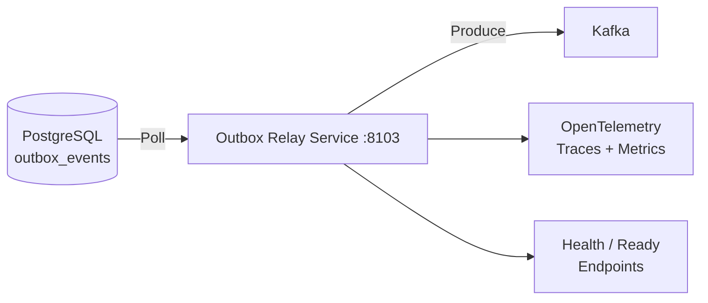
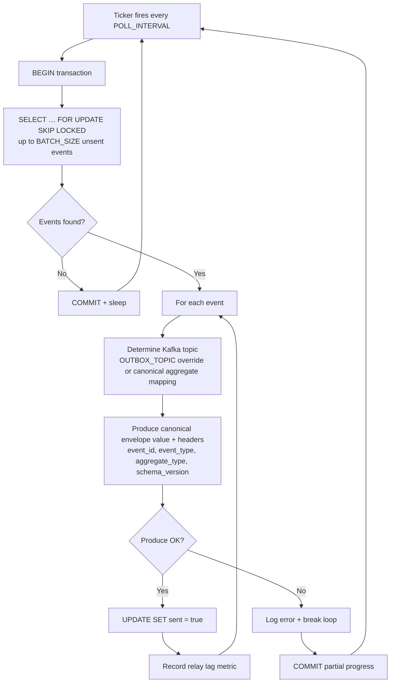
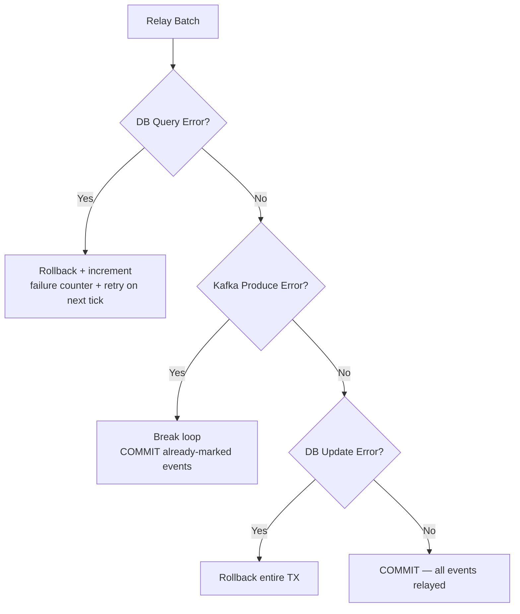

# Outbox Relay Service

> **Go · Transactional Outbox Pattern with Exactly-Once Kafka Delivery**

Polls an `outbox_events` table in PostgreSQL and reliably relays events to Kafka using the transactional outbox pattern. Guarantees exactly-once semantics through `SELECT … FOR UPDATE SKIP LOCKED`, idempotent Kafka producer configuration, and atomic poll-produce-mark cycles within a single database transaction.

## Architecture



## Outbox Pattern Flow



## Failure Handling



## Project Structure

```
outbox-relay-service/
├── main.go         # Config, poll loop, Kafka producer, health/ready, telemetry
├── Dockerfile
└── go.mod
```

## API Reference

### `GET /health` · `GET /health/live`

Returns `{"status":"ok"}`.

### `GET /ready` · `GET /health/ready`

Checks PostgreSQL connectivity and Kafka broker availability. Returns `503` if shutting down or either dependency is unreachable.

## Configuration

| Variable | Default | Description |
|---|---|---|
| `PORT` / `SERVER_PORT` | `8103` | HTTP listen port |
| `DATABASE_URL` / `POSTGRES_DSN` | **(required)** | PostgreSQL connection string |
| `OUTBOX_POLL_INTERVAL` | `1s` | Polling interval (Go duration) |
| `OUTBOX_BATCH_SIZE` | `100` | Max events per poll cycle |
| `OUTBOX_TABLE` | `outbox_events` | Table name (alphanumeric + underscore only) |
| `OUTBOX_TOPIC` | *(empty)* | Override Kafka topic; if empty, uses canonical aggregate mapping (e.g., `Order` -> `orders.events`) |
| `KAFKA_BROKERS` | **(required)** | Comma-separated broker list |
| `KAFKA_CLIENT_ID` | `outbox-relay-service` | Kafka client identifier |
| `SHUTDOWN_TIMEOUT` | `20s` | Graceful shutdown timeout |
| `READY_TIMEOUT` | `2s` | Readiness probe timeout |
| `LOG_LEVEL` | `info` | Log level (`debug`, `info`, `warn`, `error`) |
| `OTEL_SERVICE_NAME` | `outbox-relay-service` | OTel service name |
| `OTEL_EXPORTER_OTLP_ENDPOINT` | — | OTLP HTTP endpoint for traces + metrics |

## Database Schema

The relay expects the following table (name configurable via `OUTBOX_TABLE`):

```sql
CREATE TABLE outbox_events (
    id             UUID PRIMARY KEY DEFAULT gen_random_uuid(),
    aggregate_type TEXT    NOT NULL,
    aggregate_id   TEXT    NOT NULL,
    event_type     TEXT    NOT NULL,
    payload        JSONB   NOT NULL,
    sent           BOOLEAN NOT NULL DEFAULT FALSE,
    created_at     TIMESTAMPTZ NOT NULL DEFAULT now()
);

CREATE INDEX idx_outbox_unsent ON outbox_events (created_at) WHERE sent = FALSE;
```

## Kafka Producer Configuration

| Setting | Value | Rationale |
|---|---|---|
| `RequiredAcks` | `WaitForAll` | Durability guarantee |
| `Idempotent` | `true` | Exactly-once semantics |
| `MaxOpenRequests` | `1` | Required for idempotence |
| `Retry.Max` | `10` | Resilience to transient failures |

## Published Message Shape

- Value: canonical envelope (`common/EventEnvelope.v1.json`) with
  `id`, `eventType`, `aggregateType`, `aggregateId`, `eventTime`, `schemaVersion`, and nested `payload`.
- Headers: `event_id`, `event_type`, `aggregate_type`, `schema_version`.

## Key Metrics

| Metric | Type | Description |
|---|---|---|
| `outbox.relay.count` | Counter | Events successfully relayed |
| `outbox.relay.failures` | Counter | Relay failures |
| `outbox.relay.lag.seconds` | Histogram | Lag between event creation and relay |

## Build & Run

```bash
# Local
go build -o outbox-relay .
DATABASE_URL="postgres://..." KAFKA_BROKERS="localhost:9092" ./outbox-relay

# Docker
docker build -t outbox-relay-service .
docker run -e DATABASE_URL="..." -e KAFKA_BROKERS="..." -p 8103:8103 outbox-relay-service
```

## Dependencies

- Go 1.22+
- `github.com/IBM/sarama` (Kafka client with idempotent producer)
- `github.com/jackc/pgx/v5` (PostgreSQL driver)
- OpenTelemetry SDK (traces + metrics via OTLP HTTP)
